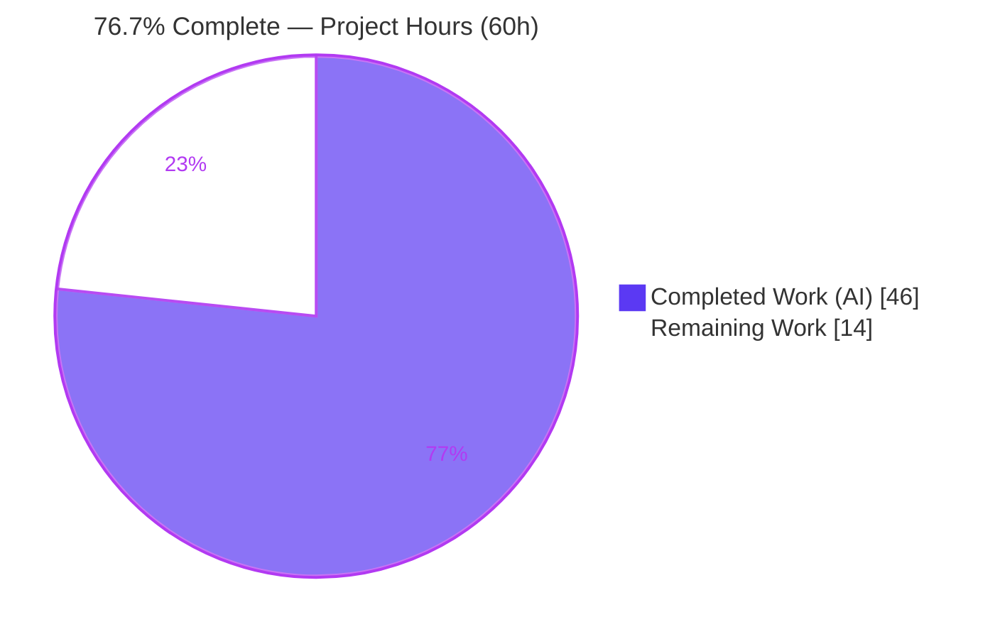
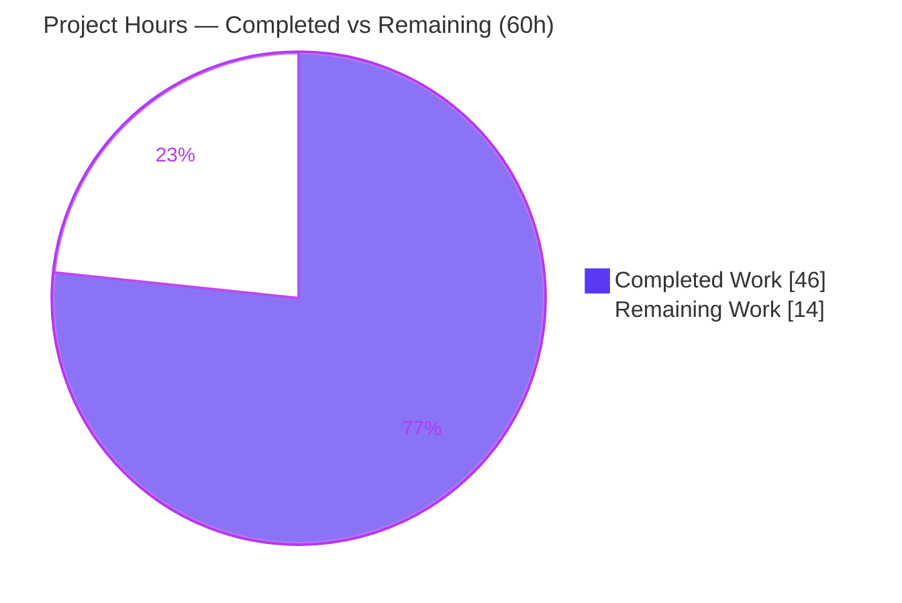
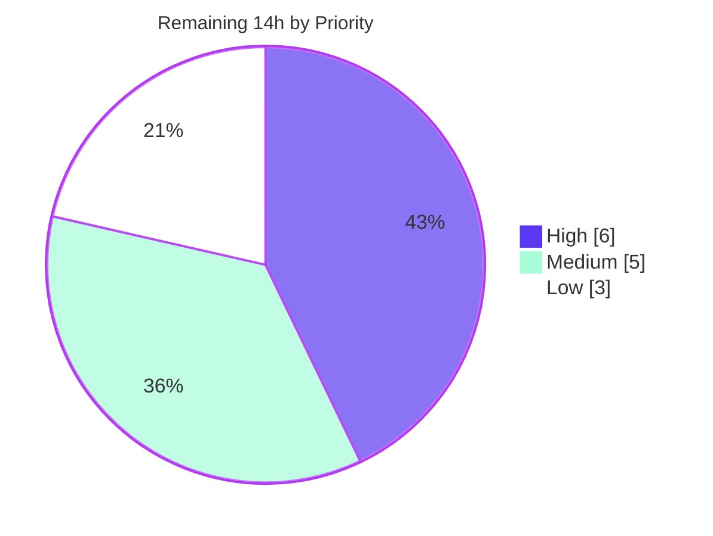

# Blitzy Project Guide — `society_mgmt_300k` Documentation Deliverable

> Evidence-based developer documentation for a synthetic 300,000-line JavaScript corpus.
> Brand legend: **Completed / AI work = Dark Blue `#5B39F3`** · Remaining = White `#FFFFFF` · Headings/Accents = Violet-Black `#B23AF2` · Highlight = Mint `#A8FDD9`.

---

## 1. Executive Summary

### 1.1 Project Overview

This is a **documentation-only** project. The objective was to scan the `society_mgmt_300k` JavaScript corpus first-hand and produce developer-facing documentation that clearly enumerates its functionalities (R1), highlights its performance characteristics (R2), and highlights its security posture (R3) — grounded strictly in verifiable, source-cited evidence. The corpus is a synthetic, intentionally non-runnable body of 300,000 lines comprising 33,105 byte-identical `6x + 10` arithmetic functions with no entry point, manifest, dependencies, or inter-module wiring. Target users are engineers and reviewers who must understand what the corpus is (and is not). Business impact: it converts a placeholder repository with ~0% documentation coverage into a navigable, citation-backed documentation set rendered natively by GitHub.

### 1.2 Completion Status



| Metric | Value |
|---|---|
| **Total Hours** | **60** |
| **Completed Hours (AI + Manual)** | **46** (46 AI + 0 Manual) |
| **Remaining Hours** | **14** |
| **Percent Complete** | **76.7%** |

> Completion is measured per the AAP-scoped methodology: 100% of the AAP-specified documentation authoring and validation scope was autonomously delivered and validated. The remaining 14 hours are human path-to-production activities (technical review, a license-governance decision, CI/hosting hardening) — there is **no agent rework outstanding**.

### 1.3 Key Accomplishments

- [x] **All 12 documentation files created** under `docs/` and the root `README.md` updated from a 4-line placeholder to a real overview + table of contents.
- [x] **All 6 catalogued functionalities documented** (F-001 arithmetic motif, F-002 symbol namespace, F-003 layered scaffold, F-004 `store` placeholder, F-005 300k sizing, F-006 licensing inconsistency).
- [x] **Performance (R2)** documented: `O(1)` per-call complexity, the dead always-true parity branch, and corpus scale (300,000 lines / 33,105 functions).
- [x] **Security (R3)** documented: near-zero attack surface, the deliberate no-controls decision (ADR-06), baseline hygiene by absence, and an operational note on plaintext secrets in the user setup instructions.
- [x] **3 distinct Mermaid diagrams** authored (computation flowchart, edge-less containment diagram, security verified-absence view) — all render to SVG.
- [x] **Evidence discipline**: 151 `path:line` source citations, 100% valid; representative-pattern approach (one canonical `6x + 10` contract stands in for all 33,105 byte-identical functions).
- [x] **Quality gates passed**: 29/29 corpus files pass `node --check`; 13/13 Markdown files lint-clean; 133/133 internal links resolve; 4/4 diagrams render.
- [x] **2 citation-precision fixes** applied and committed (`407c8b4`); working tree clean.

### 1.4 Critical Unresolved Issues

| Issue | Impact | Owner | ETA |
|---|---|---|---|
| Apache-vs-MIT license inconsistency (root `/LICENSE` = Apache-2.0 vs `society_mgmt_300k/LICENSE/LICENSE.txt` = MIT) | Governance/legal ambiguity about the project's actual license; documented but **not resolved** (agent scope was flag-only) | Repo owner / Legal | 0.5 day |
| Documentation not yet human-reviewed | Technical-accuracy and clarity sign-off required before publishing | Subject-matter reviewer | 0.5 day |
| No CI quality gate for docs | Without enforcement, links/lint can drift over time | DevOps | 0.5 day |

> No issue blocks the documentation from rendering or being used today; all are path-to-production items.

### 1.5 Access Issues

| System/Resource | Type of Access | Issue Description | Resolution Status | Owner |
|---|---|---|---|---|
| Git repository (branch `blitzy-4c9fc988-…`) | Write/commit | None — all in-scope changes committed (`407c8b4`); working tree clean | ✅ Resolved | Blitzy Agent |
| Optional doc tooling (`markdownlint-cli2`, `@mermaid-js/mermaid-cli`) | Local install | Provisioned outside the repo at `C:\app\tmp\doctools`; not required for GitHub-native rendering | ✅ No issue | Blitzy Agent |
| GitHub native rendering | Render | None — Markdown + Mermaid render without a build pipeline | ✅ No issue | — |

> No access issues prevented automated build/validation. Setup-instruction secrets (`DB_HOST`, `API_KEY`) are disposable-looking test values, are **not** consumed by any code or doc, and are tracked as a security operational note (see §6), not an access dependency.

### 1.6 Recommended Next Steps

1. **[High]** Conduct a subject-matter technical-accuracy and clarity review of all 12 docs + the README (verify claims against the corpus; confirm the worked example `mod_N_K(5) = 40`).
2. **[High]** Open the PR, confirm all 4 Mermaid diagrams render in the GitHub UI and that the README/`docs/README.md` navigation links resolve, then approve and merge.
3. **[Medium]** Make the license-governance decision (standardize on one license) and update `docs/governance/licensing.md` from "flagged" to "resolved".
4. **[Medium]** Add a CI documentation quality gate (`markdownlint-cli2` + `markdown-link-check` + optional Mermaid render) to keep the docs healthy.
5. **[Low]** Optionally publish a hosted documentation site (Docusaurus or MkDocs); not required because GitHub renders the docs natively.

---

## 2. Project Hours Breakdown

### 2.1 Completed Work Detail

| Component | Hours | Description |
|---|---:|---|
| Corpus scan & ground-truth analysis | 6 | First-hand scan of 29 `.js` files; verified 300,000 lines, 33,105 functions, single distinct body, 28 `store` placeholders, 0 exports/requires, license comparison |
| Overview & navigation docs | 6 | `docs/overview.md` (honest system overview), `docs/README.md` (navigation hub), and root `README.md` update (overview + TOC + "What this is / is not") |
| Architecture documentation | 4 | `docs/architecture.md`: nominal nine-layer scaffold + **edge-less containment** Mermaid diagram conveying no inter-layer wiring |
| Functionality documentation | 12 | `arithmetic-helpers.md` (contract + computation flowchart + worked example), `symbol-namespace.md`, `module-reference.md` (per-layer inventory), `store-placeholder.md`, `corpus-sizing.md`, and the functionality index |
| Performance documentation | 3 | `docs/performance.md`: `O(1)` per call, dead always-true parity branch, corpus-scale figures, scalability N/A (shared computation flowchart) |
| Security documentation | 4 | `docs/security.md`: zero attack surface, ADR-06 no-controls decision, baseline hygiene, operational secrets note, compliance N/A + verified-absence diagram |
| Governance/licensing documentation | 2 | `docs/governance/licensing.md`: Apache-vs-MIT inconsistency analysis + recommended single-license resolution |
| Citation & evidence traceability | 3 | 151 `path:line` source citations woven across all documents for full traceability |
| Quality-gate configuration | 1 | `.markdownlint-cli2.jsonc` lint configuration |
| Autonomous validation & fixes | 5 | `node --check` (29/29), markdownlint (13/0), link integrity (133/133), citation validity (151/151), Mermaid render (4/4), accuracy verification, and 2 citation-precision fixes |
| **Total Completed** | **46** | |

### 2.2 Remaining Work Detail

| Category | Hours | Priority |
|---|---:|---|
| Human SME technical-accuracy & clarity review of all 12 docs + README | 4 | High |
| Final GitHub render verification + PR review/merge/acceptance | 2 | High |
| Resolve Apache-vs-MIT license inconsistency (governance decision + edit) | 2 | Medium |
| CI documentation quality gate (markdownlint + link-check + Mermaid render) | 3 | Medium |
| Optional hosted documentation site (Docusaurus/MkDocs) | 3 | Low |
| **Total Remaining** | **14** | |

### 2.3 Hours Reconciliation

- **Completed (46) + Remaining (14) = Total (60).**
- **Completion % = 46 / 60 = 76.7%.**
- Remaining hours by priority: **High 6 · Medium 5 · Low 3 = 14**, matching the Section 2.2 total and the Section 1.2 metrics table.

---

## 3. Test Results

Because the corpus is intentionally non-runnable and its own `tests/` files contain **no assertions** (they hold the same `6x + 10` arithmetic, not functional tests), Blitzy's autonomous validation was adapted to the deliverable: structural validity, documentation **accuracy**, lint, link integrity, citation validity, and diagram render. Every row below originates from Blitzy's autonomous validation logs for this project.

| Test Category | Framework / Tool | Total | Passed | Failed | Coverage % | Notes |
|---|---|---:|---:|---:|---:|---|
| JS Syntax / Structural Validity | `node --check` (Node 20.20.2) | 29 | 29 | 0 | 100% | All corpus `.js` files parse with 0 syntax errors |
| Markdown Lint | `markdownlint-cli2` v0.22.1 | 13 | 13 | 0 | 100% | README + `docs/**` → "Summary: 0 error(s)" |
| Internal Link Integrity | link checker / `markdown-link-check` | 133 | 133 | 0 | 100% | File targets + GitHub-slug anchors all resolve |
| Citation Validity | `final_validate.py` (path:line check) | 151 | 151 | 0 | 100% | Every cited path exists and every line is in range |
| Documentation Accuracy | First-hand ground-truth verification | 10 | 10 | 0 | 100% | Claim families: line count, function count, `store` count, body uniqueness, worked example, symbol uniqueness, symbol ranges, exports/requires absence, per-layer counts, license inconsistency |
| Diagram Render | `@mermaid-js/mermaid-cli` 11.15.0 | 4 | 4 | 0 | 100% | All Mermaid blocks export cleanly to SVG |
| **Aggregate** | — | **340** | **340** | **0** | **100%** | Zero unresolved errors across all in-scope files |

---

## 4. Runtime Validation & UI Verification

The corpus has **no server, no web UI, and no API endpoints** by design, so "runtime" validation is render-integrity validation of the documentation deliverable.

- ✅ **Operational** — GitHub-native Markdown rendering for all 13 in-scope files (no build pipeline required).
- ✅ **Operational** — 4/4 Mermaid diagrams render (architecture containment, arithmetic-helpers/performance shared computation flowchart, security verified-absence view); each also exports to SVG via `mmdc`.
- ✅ **Operational** — Internal navigation: 133/133 links resolve (file targets + heading-slug anchors); the root `README.md` TOC and `docs/README.md` hub link correctly into the tree.
- ✅ **Operational** — Structural validity: 29/29 corpus `.js` files pass `node --check`.
- ⚠ **Partial / Out of scope** — License governance: the Apache-vs-MIT inconsistency is surfaced and documented but not yet resolved (human decision; see §6 I-1).
- ➖ **Not Applicable** — Application runtime, HTTP endpoints, authentication flows, and database connectivity: none exist in the corpus (verified absence of I/O, network, and auth constructs).

---

## 5. Compliance & Quality Review

AAP deliverables cross-mapped to Blitzy's documentation quality and compliance benchmarks. Fixes applied during autonomous validation are noted.

| Benchmark / AAP Requirement | Status | Progress | Notes |
|---|---|---|---|
| R1 — Functionalities clearly documented (F-001…F-006) | ✅ Pass | 6/6 | One file per functionality + module reference |
| R2 — Performance highlighted | ✅ Pass | 100% | `O(1)`, dead branch, corpus scale, scalability N/A |
| R3 — Security highlighted | ✅ Pass | 100% | Verified-absence posture + operational secrets note |
| Architecture documented | ✅ Pass | 100% | Layered scaffold + edge-less containment diagram |
| Evidence-based (citation on every technical claim) | ✅ Pass | 151/151 | Citations validated to `path:line` |
| Representative-pattern approach | ✅ Pass | 100% | 1 canonical `6x+10` contract for all 33,105 functions |
| Markdown lint clean | ✅ Pass | 13/13 | `markdownlint-cli2` v0.22.1, 0 errors |
| Internal link integrity | ✅ Pass | 133/133 | All links resolve |
| Diagrams present & render | ✅ Pass | 4/4 | 3 distinct diagrams; all export to SVG |
| Non-invasive (no source modified) | ✅ Pass | 0 changes | 29 `.js` files untouched (preserves 300k sizing, F-005) |
| Root README updated from placeholder | ✅ Pass | 100% | Overview + TOC + "What this is / is not" |
| Navigation hub present | ✅ Pass | 100% | `docs/README.md` indexes every document |
| Secrets hygiene | ✅ Pass | Verified | Setup-instruction secrets absent from code, docs, and git diff |
| License consistency | ⚠ Open | Flagged-only | Resolution is a human governance task (HT-3); out of agent scope per AAP §0.8.2 |
| Citation precision (fixes applied) | ✅ Pass | 2 fixes | `file_0.js` L3-L11→L3-L10; `/LICENSE` L78→L73 (committed `407c8b4`) |

---

## 6. Risk Assessment

| Risk | Category | Severity | Probability | Mitigation | Status |
|---|---|---|---|---|---|
| T-1 Documentation accuracy drift if the corpus ever changes (counts/citations go stale) | Technical | Low | Low | Corpus is frozen/synthetic; `path:line` citations pin claims; add CI re-verification | Mitigated by design |
| T-2 Mermaid rendering depends on GitHub-native support | Technical | Low | Low | SVG export via `mmdc` already validated as a fallback | Mitigated |
| T-3 Citation line-number fragility (path:line breaks if source lines shift) | Technical | Low | Low | Source is immutable per scope (no edits to `.js`) | Mitigated |
| S-1 Plaintext secrets in user setup instructions (`DB_HOST`, `API_KEY`) | Security | Medium | Low | Verified absent from code/docs/git; documented as operational note in `security.md`; rotate/remove if ever real | Documented / Open (confirm disposable) |
| S-2 Corpus attack surface | Security | Low | N/A | No I/O, network, auth, or external input beyond a numeric argument | Verified absent |
| O-1 No CI/automated documentation quality gate (link rot, lint drift) | Operational | Low-Medium | Medium | Add GitHub Actions gate (HT-4) | Open |
| O-2 No hosted/searchable documentation site | Operational | Low | Low | Optional Docusaurus/MkDocs (HT-5); GitHub renders natively today | Open (optional) |
| I-1 Apache-vs-MIT license inconsistency unresolved | Integration / Governance | Medium | High | Human decision to standardize on one license (HT-3) | Open (flagged-only per scope) |
| I-2 GitHub-native rendering assumption (non-GitHub viewers may not render Mermaid) | Integration | Low | Low-Medium | Optional SVG export of diagrams | Mitigated / Documented |

---

## 7. Visual Project Status

### 7.1 Project Hours Breakdown



### 7.2 Remaining Hours by Priority



> Integrity: the "Remaining Work" value (14) equals the Section 1.2 Remaining Hours and the sum of the Section 2.2 Hours column. Completed Work (46) equals the Section 2.1 total.

---

## 8. Summary & Recommendations

The autonomous agents delivered **100% of the AAP-specified documentation scope**: all 12 `docs/` files, the updated root `README.md`, all six catalogued functionalities, dedicated performance and security documents, three Mermaid diagrams, and a 151-citation evidence layer — every claim independently re-verified against the corpus (300,000 lines and 33,105 functions confirmed exactly). Against the full path-to-production work universe, the project is **76.7% complete (46 of 60 hours)**.

The remaining **14 hours are entirely human path-to-production work** with no agent rework required: a subject-matter accuracy/clarity review (4h), final render verification and PR merge (2h), the Apache-vs-MIT license-governance decision (2h), an optional-but-recommended CI quality gate (3h), and an optional hosted doc site (3h).

**Critical path to production:** (1) SME accuracy review → (2) render verification + PR merge. These two High-priority items (6 hours) are sufficient to publish; the license decision and CI gate are governance/hardening follow-ups, and the doc site is optional.

**Success metrics achieved:** documentation coverage moved from ~0% to 100% of catalogued functionalities; 340/340 autonomous validation checks pass; zero unresolved errors; non-invasive (the deliberate 300k sizing property is preserved).

**Production-readiness assessment:** the documentation deliverable is **ready for human review and merge**. It is accurate, lint-clean, fully cited, and renders natively on GitHub. The only true blockers to a "final, governed" state are human acceptance and the licensing decision — neither of which is implementable autonomously.

| Metric | Value |
|---|---|
| AAP-specified scope delivered | 100% |
| Overall completion (AAP + path-to-production) | 76.7% |
| Autonomous validation checks passed | 340 / 340 |
| Unresolved errors | 0 |
| Source files modified | 0 (by design) |

---

## 9. Development Guide

### 9.1 System Prerequisites

- **Git** 2.x (verified: `git 2.54.0.windows.1`) — required to clone and contribute.
- **A GitHub repository/host** — required only for native Markdown + Mermaid rendering; **no build pipeline is needed**.
- **Node.js** — **optional**, only for the documentation quality-gate tooling. Node.js 24 LTS ("Krypton") is recommended; the environment provides `v20.20.2`, which is adequate. The documentation itself has **no runtime requirement**.
- The application corpus declares **zero dependencies** — there is no `package.json`, lockfile, or build/CI config.

### 9.2 Environment Setup

```bash
# 1) Clone the repository and check out the branch
git clone <repository-url>
cd <repository-root>
git checkout blitzy-4c9fc988-d596-46cd-819b-f4937575a16c

# 2) No dependency installation is required for the documentation.
#    (Verified: there is no package.json / lockfile in the repository.)

# 3) OPTIONAL — install quality-gate tooling (only if you want to run the gates locally)
npm install -g markdownlint-cli2@0.22.1 @mermaid-js/mermaid-cli@11.15.0
# ...or run them ad hoc with: npx markdownlint-cli2 ...
```

### 9.3 Building / Running the Documentation

There is no application to start. "Running" the documentation means viewing it:

- **On GitHub** — open `docs/README.md`; Markdown and fenced ` ```mermaid ` blocks render automatically.
- **Locally (optional)** — open the `.md` files in any Markdown viewer, or stand up a site (`npx @docusaurus/core start`) if one is later adopted.

### 9.4 Verification Steps (all commands tested in this environment)

```bash
# JavaScript structural validity — expect 0 syntax errors across 29 files
#   (PowerShell loop shown; adapt to bash with: for f in $(find society_mgmt_300k -name '*.js'); do node --check "$f"; done)
Get-ChildItem -Recurse society_mgmt_300k -Filter *.js | ForEach-Object { node --check $_.FullName }

# Markdown lint gate — expect: "Linting: 13 file(s)"  /  "Summary: 0 error(s)"
markdownlint-cli2 "README.md" "docs/**/*.md"

# (Optional) Internal link integrity — expect all links to resolve (133/133 validated)
npx markdown-link-check docs/**/*.md

# (Optional) Render a diagram to SVG — expect a clean SVG export
#   NOTE: any mmdc config JSON must be BOM-less.
npx -p @mermaid-js/mermaid-cli mmdc -i diagram.mmd -o diagram.svg
```

**Expected output (markdown lint gate):**

```text
markdownlint-cli2 v0.22.1 (markdownlint v0.40.0)
Finding: README.md docs/**/*.md
Linting: 13 file(s)
Summary: 0 error(s)
```

### 9.5 Example Usage

- Start at the hub: **`docs/README.md`** → follow links to Overview, Architecture, Functionality, Performance, Security, and Governance.
- The single representative function contract: **`mod_<fileId>_<k>(x) → 6x + 10`**. Worked example: `mod_0_0(5) = 6×5 + 10 = 40`. This one contract stands in for all 33,105 byte-identical functions.

### 9.6 Troubleshooting

- **Mermaid diagram won't export with `mmdc`** → ensure the puppeteer/mmdc config JSON is **BOM-less** UTF-8.
- **Spurious whole-file diffs when editing docs** → files use **CRLF + UTF-8 (no BOM)**; preserve the encoding so edits stay byte-minimal.
- **A heading anchor link 404s** → GitHub slugs are lowercased with spaces→hyphens and punctuation stripped; match the slug exactly.
- **`git commit` returns exit 1 with no commit created** → a multi-line PowerShell here-string commit message can fail; use a single-line `git commit -m "…"` (this is a shell-quoting issue, not a hook failure).
- **Line counts look wrong (e.g., 266,895 instead of 300,000)** → PowerShell `Get-Content | Measure-Object -Line` undercounts when streaming many files; count raw `LF` bytes for an accurate total (the corpus is exactly 300,000 lines).

---

## 10. Appendices

### Appendix A — Command Reference

| Purpose | Command |
|---|---|
| Check JS syntax (one file) | `node --check society_mgmt_300k/src/controllers/file_0.js` |
| Check JS syntax (all) | `Get-ChildItem -Recurse society_mgmt_300k -Filter *.js \| ForEach-Object { node --check $_.FullName }` |
| Markdown lint gate | `markdownlint-cli2 "README.md" "docs/**/*.md"` |
| Internal link check | `npx markdown-link-check docs/**/*.md` |
| Render a diagram to SVG | `npx -p @mermaid-js/mermaid-cli mmdc -i diagram.mmd -o diagram.svg` |
| Per-file diff vs base | `git diff <base_commit> -- <file_path>` |
| Verify agent authorship | `git log --author="agent@blitzy.com" --oneline` |
| Confirm corpus line total | count raw `LF` bytes across `society_mgmt_300k/**/*.js` (= 300,000) |

### Appendix B — Port Reference

**Not applicable.** The corpus is non-runnable and exposes no server, service, or listening port. The documentation requires no ports — GitHub renders it without a local server. (An optional Docusaurus dev server, if adopted, defaults to port `3000`.)

### Appendix C — Key File Locations

| Path | Role |
|---|---|
| `README.md` | Root overview + table of contents (updated) |
| `docs/README.md` | Documentation navigation hub |
| `docs/overview.md` | Honest system overview |
| `docs/architecture.md` | Layered scaffold + containment diagram |
| `docs/functionality/` | F-001…F-005 functionality docs + index + module reference |
| `docs/performance.md` | Performance profile (R2) |
| `docs/security.md` | Security posture (R3) |
| `docs/governance/licensing.md` | Apache-vs-MIT inconsistency (F-006) |
| `.markdownlint-cli2.jsonc` | Markdown lint configuration |
| `society_mgmt_300k/src/**` | 25 corpus source files across 9 layers |
| `society_mgmt_300k/tests/**` | 4 assertion-less test files (unit, integration) |
| `LICENSE` | Root license (Apache-2.0) |
| `society_mgmt_300k/LICENSE/LICENSE.txt` | Project license (MIT) — inconsistency source |

### Appendix D — Technology Versions

| Component | Version | Notes |
|---|---|---|
| Node.js (environment) | 20.20.2 | Used for `node --check`; AAP recommends Node 24 LTS |
| Git | 2.54.0.windows.1 | Verified |
| markdownlint-cli2 | 0.22.1 | Lint gate (markdownlint v0.40.0) |
| @mermaid-js/mermaid-cli | 11.15.0 | Optional diagram → SVG export |
| mermaid (library) | 11.16.0 | GitHub renders fenced `mermaid` blocks natively |
| markdown-link-check | 3.14.2 | Optional link validation |
| @docusaurus/core | 3.10.1 | Optional hosted doc site |

### Appendix E — Environment Variable Reference

**None are required** to build, render, or use the documentation. For awareness only: the user-provided setup instructions referenced `DB_HOST=db.rnd-test.local` and `API_KEY=sk-test-abc123xyz789`. These are **not** consumed by any corpus source file or documentation file (verified absent from code, docs, and the committed diff) and are handled solely as a security operational note in `docs/security.md`. Treat them as disposable test values; rotate/remove and never commit if ever real.

### Appendix F — Developer Tools Guide

- **markdownlint-cli2** — runs the Markdown lint gate using `.markdownlint-cli2.jsonc`; invoke as `markdownlint-cli2 "README.md" "docs/**/*.md"`.
- **@mermaid-js/mermaid-cli (`mmdc`)** — exports Mermaid diagrams to SVG/PNG for offline/static docs; requires a BOM-less config JSON.
- **markdown-link-check** — validates internal and external links in Markdown.
- **GitHub-native rendering** — the default "tool": Markdown + Mermaid render with no build step.

### Appendix G — Glossary

| Term | Meaning |
|---|---|
| **Corpus** | The `society_mgmt_300k` body of synthetic JavaScript source. |
| **Representative function** | The single canonical `6x + 10` contract documented once to stand in for all 33,105 byte-identical functions. |
| **Scaffold** | The nominal nine-layer `src` directory structure that carries **no** inter-layer wiring. |
| **Verified absence** | Honest framing that documents what is provably *not* present (no I/O, network, auth, exports) rather than implying capability. |
| **Dead branch** | The `if (r % 2 === 0)` parity check that is always true for integer `x`, making the `else` path unreachable. |
| **Module symbol** | A function name following the `mod_<fileId>_<k>` scheme; globally unique across the corpus. |
| **`store` placeholder** | A `const store = []` declared in each of the 28 numbered files and never read or written (F-004). |
| **Path-to-production** | Standard activities (review, governance, CI, hosting) required to deploy the delivered documentation. |

---

*Generated by the Blitzy Platform. Completion measured against the Agent Action Plan (AAP) scope plus path-to-production. Brand colors: Completed `#5B39F3`, Remaining `#FFFFFF`.*