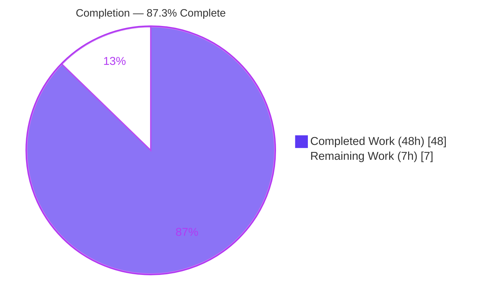
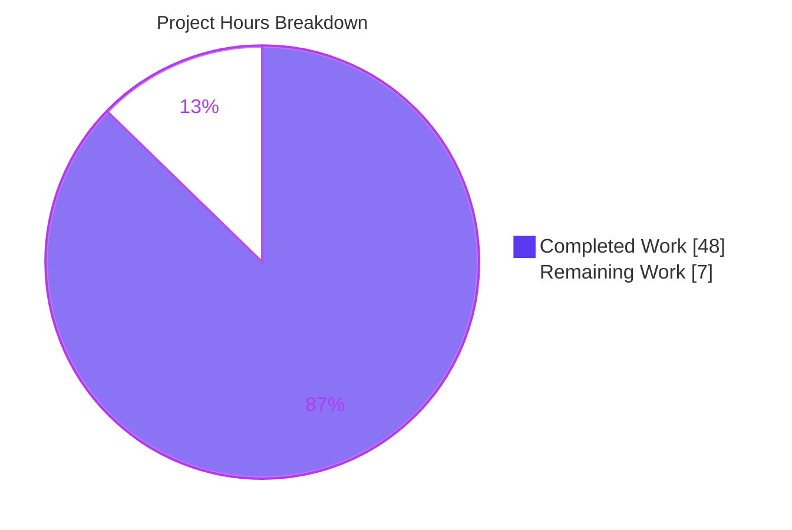
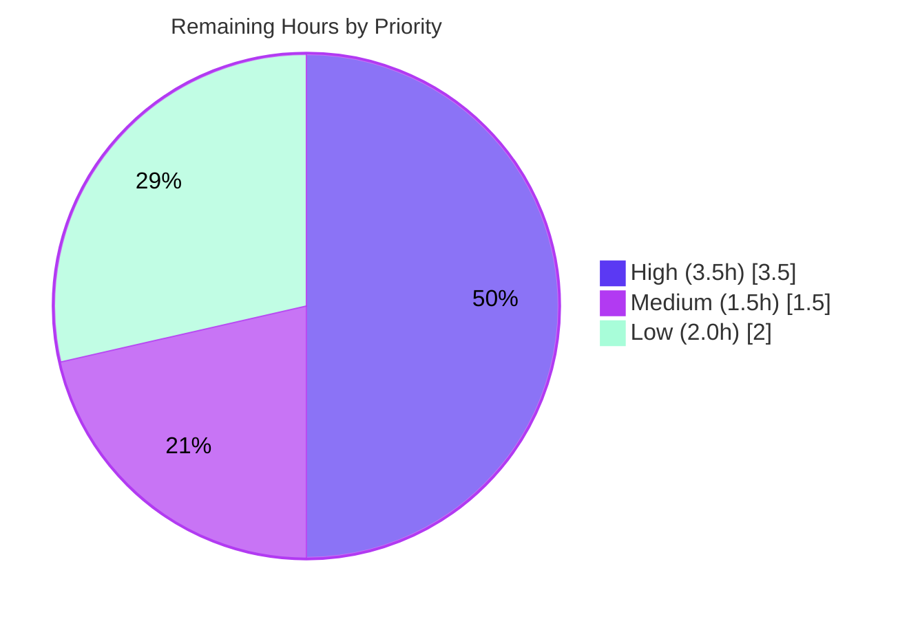

# Blitzy Project Guide — `society_mgmt_300k` Documentation Deliverable

> Evidence-based developer documentation for a synthetic 300,000-line JavaScript corpus.
> Branch: `blitzy-4c9fc988-d596-46cd-819b-f4937575a16c` · HEAD: `f373759` · Generated: 2026-06-29

---

## 1. Executive Summary

### 1.1 Project Overview

This is a **documentation-only** project. The objective was to scan the `society_mgmt_300k` synthetic JavaScript corpus — 29 `.js` files, exactly 300,000 lines, and 33,105 byte-identical arithmetic functions — and produce developer-facing documentation that clearly enumerates the code's **functionalities**, highlights its **performance** characteristics, and highlights its **security** posture. The audience is developers and maintainers who must understand a non-executable corpus that has no entry point, framework, dependencies, or exported API. The deliverable is twelve new Markdown documents plus a rewritten root README, authored with an honest "verified-absence" framing, a source citation on every technical claim, and three Mermaid diagrams — rendered natively by GitHub with no build pipeline.

### 1.2 Completion Status



| Metric | Hours |
| --- | --- |
| **Total Hours** | 55.0 |
| **Completed Hours (AI + Manual)** | 48.0 (AI: 48.0 · Manual: 0.0) |
| **Remaining Hours** | 7.0 |
| **Percent Complete** | **87.3%** |

> Completion is computed by the AAP-scoped hours method: `48.0 ÷ 55.0 = 87.3%`. All 100% of the AAP authoring scope is complete, validated, and committed; the remaining 7.0 hours are path-to-production activities (human review, merge, license governance, optional CI hardening). Color key: **Completed = Dark Blue `#5B39F3`**, **Remaining = White `#FFFFFF`**.

### 1.3 Key Accomplishments

- [x] **Full functionality documentation (R1)** — all six catalogued functionalities **F-001…F-006** documented (arithmetic helper contract, symbol namespace, module reference, store placeholder, corpus sizing, licensing).
- [x] **Performance documentation (R2)** — `docs/performance.md` covers constant-time `O(1)` per call, the dead always-true parity branch, and the 300,000-line corpus scale; runtime scalability honestly marked Not Applicable.
- [x] **Security documentation (R3)** — `docs/security.md` documents the near-zero attack surface, the deliberate no-controls decision (ADR-06), baseline hygiene by absence, and an operational secrets note.
- [x] **Representative-pattern contract** — one canonical function `mod_<fileId>_<k>(x) → 6x + 10` documented with a worked example (`x = 5 → 40`), standing in for all 33,105 byte-identical functions.
- [x] **Architecture & module reference** — nominal layered scaffold with an edge-less containment diagram; per-layer inventory of all 29 files across 11 layers.
- [x] **Three Mermaid diagrams** — computation flowchart, edge-less layered containment, and security verified-absence view (all render-validated).
- [x] **Root README rewritten** — placeholder text replaced with an honest overview, a table of contents into `docs/`, and a licensing note.
- [x] **Source citation on every technical claim** across all 13 documents; honest "verified-absence" framing throughout.
- [x] **Quality gates passing** — markdownlint 0 errors (13 files), 0 dead links (74 links), 4/4 anchors, 100% factual accuracy re-verified against source, 4/4 diagrams render, 3 pages render cleanly in Chrome.
- [x] **Optional quality-gate config** committed (`.markdownlint-cli2.jsonc`) to make the lint gate reproducible.

### 1.4 Critical Unresolved Issues

**No release-blocking issues were identified.** Every AAP deliverable is authored, validated, and committed, and all quality gates pass. The items below are **non-blocking advisories** that warrant a human decision but do not prevent the documentation from being merged or read.

| Issue | Impact | Owner | ETA |
| --- | --- | --- | --- |
| Apache-vs-MIT license inconsistency (root `/LICENSE` is Apache-2.0; `society_mgmt_300k/LICENSE/LICENSE.txt` is MIT) | Legal/redistribution ambiguity for consumers of the corpus. Documented (flag-only) in `docs/governance/licensing.md`; resolution is an owner decision per AAP §0.8.2. | Repository owner / Legal | 1.5h once a license is chosen |
| Documentation not yet human-reviewed/merged | Docs are accurate per autonomous validation but not yet signed off by a stakeholder. | Reviewing engineer | 3.5h (review + merge) |

### 1.5 Access Issues

**No access issues identified.** The repository, branch, full git history, and all source/documentation files were accessible throughout the engagement. The project declares zero application dependencies and no manifest, so no package-registry, service-credential, or third-party API access was required. Optional documentation tooling (markdownlint-cli2, markdown-link-check, mermaid-cli) was available locally without restriction.

| System / Resource | Type of Access | Issue Description | Resolution Status | Owner |
| --- | --- | --- | --- | --- |
| Repository & branch | Read/Write | None — full access confirmed | ✅ No issue | — |
| Documentation tooling (npm) | Local install | None — markdownlint-cli2 v0.22.1 available | ✅ No issue | — |
| External services / APIs | N/A | None required (zero dependencies, no runtime) | ✅ Not applicable | — |

### 1.6 Recommended Next Steps

1. **[High]** Review the 13 documents for accuracy and completeness against the source (spot-check the 300,000-line and 33,105-function claims, the `6x + 10` contract, and the F-001…F-006 coverage). — *3.0h*
2. **[High]** Approve the pull request and merge the branch to `main`; the docs render on GitHub natively with no build step. — *0.5h*
3. **[Medium]** Make the governance decision to resolve the Apache-vs-MIT license inconsistency and align both license files. — *1.5h*
4. **[Low]** *(Optional)* Wire `markdownlint-cli2` and `markdown-link-check` into CI to operationalize the committed quality-gate config and prevent future documentation drift. — *2.0h*
5. **[Low]** *(Optional, deferred)* Stand up a hosted documentation site (Docusaurus/mkdocs) only if offline or branded hosting is desired — not required for GitHub-native rendering.

---

## 2. Project Hours Breakdown

### 2.1 Completed Work Detail

All components below trace to AAP deliverables (authoring) or to the autonomous validation that hardened them. **Total = 48.0 hours (all autonomous/AI).**

| Component | Hours | Description |
| --- | --- | --- |
| Corpus first-hand scan & fact verification | 5.0 | Scanned all 29 `.js` files; verified 300,000 lines, 33,105 functions, byte-identical `6x+10` bodies, 28 `const store` placeholders, 0 `module.exports`, 0 `require(`, and the Apache-vs-MIT inconsistency (R1 foundation). |
| Documentation tooling research | 1.5 | Web-verified current tool versions (Node, mermaid, markdownlint-cli2, markdown-link-check, jsdoc, docusaurus) and docs-as-code conventions (AAP §0.2.3, §0.6). |
| System overview (`docs/overview.md`) | 3.0 | Honest synthetic-corpus overview; what it is / is not; 145 lines, fully cited. |
| Architecture doc + containment diagram (`docs/architecture.md`) | 4.0 | Nominal layered scaffold (9 `src` + 2 `tests` layers) and the deliberately edge-less Mermaid containment diagram; 201 lines. |
| Functionality suite F-001…F-005 (5 docs + index) | 13.0 | `arithmetic-helpers` (F-001 contract + flowchart + worked example), `symbol-namespace` (F-002), `module-reference` (29-file inventory), `store-placeholder` (F-004), `corpus-sizing` (F-005), and the functionality index. |
| Performance documentation (`docs/performance.md`, R2) | 3.5 | `O(1)` per-call complexity, dead always-true parity branch, 300k-line corpus scale, scalability Not Applicable; 159 lines. |
| Security documentation (`docs/security.md`, R3) + diagram | 3.5 | Verified-absence posture, attack-surface table, ADR-06 no-controls decision, operational secrets note, compliance N/A, verified-absence Mermaid view; 106 lines. |
| Governance / licensing (`docs/governance/licensing.md`, F-006) | 1.5 | Apache-vs-MIT inconsistency analysis and recommended single-license resolution; 51 lines. |
| Navigation hub + root README rewrite | 3.0 | `docs/README.md` documentation index hub (83 lines) and the root `README.md` rewrite with TOC, overview, and licensing note (+90/-3). |
| Quality-gate config (`.markdownlint-cli2.jsonc`) | 1.0 | Optional, in-scope (AAP §0.8.1) markdownlint config; all default rules enabled, MD013 disabled with full justification; globs scoped to docs. |
| Validation: markdownlint sweep + MD060 fixes | 1.5 | Lint sweep across 13 files → 0 errors; normalized 2 MD060 table separators in `module-reference.md` and `licensing.md`. |
| Validation: link check + anchor resolution | 2.0 | 74 links checked, 0 dead; 4/4 intra-page anchors resolve (incl. colon-stripped `#attack-surface-none`). |
| Validation: factual accuracy re-verification | 2.5 | Every numeric/technical claim re-verified against source; 100% match. |
| Validation: render (Mermaid SVG + Chrome pages) | 3.0 | 4/4 Mermaid diagrams → valid SVG via `mmdc`; 3 pages render in real Chrome (`RENDER_OK`, 0 console errors). |
| **Total Completed** | **48.0** | |

### 2.2 Remaining Work Detail

All remaining work is path-to-production; **no AAP authoring work remains.** **Total = 7.0 hours.**

| Category | Hours | Priority |
| --- | --- | --- |
| Human review & accuracy sign-off of all 13 documents | 3.0 | High |
| PR approval & merge to `main` / publish | 0.5 | High |
| Governance: resolve Apache-vs-MIT license inconsistency | 1.5 | Medium |
| Optional: wire markdownlint + link-check into CI quality gate | 2.0 | Low |
| **Total Remaining** | **7.0** | |

> **Cross-section check:** Section 2.1 (48.0h) + Section 2.2 (7.0h) = **55.0h** total, matching Section 1.2. Remaining = **7.0h** in Sections 1.2, 2.2, and 7.

### 2.3 Effort Distribution Notes

- **Confidence:** High. The scope is fully defined by the AAP, every deliverable exists on disk, and the numeric claims were independently re-verified.
- **Manual hours to date:** 0.0 — all completed work was performed autonomously by Blitzy agents across 10 commits (`c416c02 … f373759`).
- **No source-code hours:** Editing any `.js` file is out of scope (it would break the deliberate 300,000-line sizing property F-005), so no implementation/refactor hours exist.

---

## 3. Test Results

For a documentation deliverable, the standard test gates map to **documentation quality gates**. Every result below originates from Blitzy's autonomous validation logs (re-confirmed first-hand against committed state `f373759`).

| Test Category | Framework | Total Tests | Passed | Failed | Coverage % | Notes |
| --- | --- | --- | --- | --- | --- | --- |
| Lint (structural) | markdownlint-cli2 v0.22.1 (markdownlint v0.40.0) | 13 | 13 | 0 | 100% | All `README.md` + `docs/**/*.md`; 0 errors. MD013 intentionally disabled with justification; all structural rules enabled. |
| Link integrity | markdown-link-check 3.14.2 | 74 | 74 | 0 | 100% | 0 dead links across all 13 documents (internal + external). |
| Anchor resolution | Custom GitHub-slug checker | 4 | 4 | 0 | 100% | All intra-page anchors resolve, incl. `#attack-surface-none` (colon correctly stripped). |
| Factual accuracy | Source re-verification vs corpus | 15 | 15 | 0 | 100% | 300,000 lines, 33,105 functions, 29 files, 28 `store`, 0 exports, 0 requires, `6x+10`, `x=5→40`, mod ranges, Apache/MIT, tests-0-assertions, 11 layers, byte-identical bodies. |
| Diagram render | @mermaid-js/mermaid-cli 11.15.0 (`mmdc`) | 4 | 4 | 0 | 100% | All Mermaid blocks render to valid SVG (architecture, performance, security, arithmetic-helpers). |
| Page render (UI) | Chrome + marked + mermaid.js harness | 3 | 3 | 0 | 100% | `performance.md`, `architecture.md`, `security.md` render `RENDER_OK` with 0 console errors. |
| **Totals** | — | **113** | **113** | **0** | **100%** | Zero unresolved defects. |

> **Note on corpus `tests/`:** The corpus's own `tests/unit` and `tests/integration` files contain **no assertions** — an intentional synthetic-corpus property that the documentation accurately *describes* (in `module-reference.md`), not a defect. Source is out of scope; these are not counted as project tests.

---

## 4. Runtime Validation & UI Verification

There is no runnable application — the corpus is non-executable synthetic source with no entry point, server, or data path. "Runtime" and "UI" therefore map to **documentation rendering** and **navigation**, which were validated as follows.

**Documentation rendering**

- ✅ **Operational** — All 13 Markdown documents render via GitHub-native Markdown (no build pipeline required).
- ✅ **Operational** — All 4 Mermaid diagrams render to valid SVG via `mmdc` (architecture 22.8 KB, performance 19.2 KB, security 12.8 KB, arithmetic-helpers 19.2 KB; performance and arithmetic-helpers share the identical computation flowchart by design).
- ✅ **Operational** — 3 representative pages (`performance.md`, `architecture.md`, `security.md`) rendered in real Chrome via a GitHub-like harness: title `RENDER_OK`, 0 console errors, entity-escaped `&lt;fileId&gt;` correctly displays as `<fileId>`.

**Navigation & cross-links**

- ✅ **Operational** — Root `README.md` table-of-contents links resolve to existing files.
- ✅ **Operational** — `docs/README.md` hub links resolve to existing files; functionality index links to all topic docs.
- ✅ **Operational** — Back-links and cross-references between `arithmetic-helpers.md` ↔ `performance.md` and `security.md` ↔ `governance/licensing.md` resolve.

**API / integration outcomes**

- ⚪ **Not Applicable** — The corpus exposes no API (0 `module.exports`, 0 `require(`), has zero dependencies, and performs no I/O, so there are no runtime endpoints, services, or integrations to verify.

---

## 5. Compliance & Quality Review

This matrix cross-maps the AAP's explicit requirements and rules to their delivery status, including fixes applied during autonomous validation.

| AAP Requirement / Rule | Benchmark | Status | Progress | Notes |
| --- | --- | --- | --- | --- |
| **R1** — Functionalities clearly mentioned | F-001…F-006 documented | ✅ Pass | 6/6 | All functionalities documented with a representative contract + per-layer inventory. |
| **R2** — Performance highlighted | Dedicated performance doc | ✅ Pass | 100% | `O(1)`, dead branch, corpus scale, scalability N/A. |
| **R3** — Security highlighted | Dedicated security doc | ✅ Pass | 100% | Verified-absence posture, ADR-06, operational secrets note. |
| File inventory coverage | 29/29 files, 11/11 layers | ✅ Pass | 100% | Full per-layer module reference. |
| Representative-pattern approach | One canonical contract | ✅ Pass | 100% | `mod_<fileId>_<k>(x) → 6x+10` with worked example, stated equivalence to all 33,105 functions. |
| Source citation on every claim | `Source:` / Tech Spec § on each | ✅ Pass | 13/13 docs | Citations present in all documents. |
| Mermaid diagrams | 3 required | ✅ Pass | 3/3 | Computation flowchart, edge-less containment, verified-absence view. |
| Honest "verified-absence" framing | No fabricated capabilities | ✅ Pass | 100% | No implied features, SLAs, or controls the code lacks. |
| Non-invasive (no source edits) | 0 `.js` modified | ✅ Pass | 100% | 300,000-line sizing property F-005 preserved. |
| Root README update | Placeholder replaced + TOC | ✅ Pass | 100% | Overview + TOC + licensing note. |
| Markdown lint quality gate | markdownlint clean | ✅ Pass | 0 errors | 2 MD060 separators fixed; `.markdownlint-cli2.jsonc` added (commit `f373759`). |
| Link/anchor integrity | 0 dead links/anchors | ✅ Pass | 74 links, 4 anchors | All resolve. |
| Licensing governance (F-006) | Inconsistency flagged | ⚠ Advisory | Documented | Flag-only by AAP §0.8.2; resolution is an owner decision (see Section 1.4). |
| CI enforcement of quality gates | Optional | ⚪ Optional | Not wired | Config committed; CI wiring is an optional remaining task. |

**Fixes applied during autonomous validation (commit `f373759`, 3 files, +26/-2):**

1. `docs/functionality/module-reference.md` — normalized MD060 table separator row (content unchanged).
2. `docs/governance/licensing.md` — same MD060 separator normalization (content unchanged).
3. `.markdownlint-cli2.jsonc` — new, in-scope quality-gate config establishing the lint baseline.

---

## 6. Risk Assessment

| Risk | Category | Severity | Probability | Mitigation | Status |
| --- | --- | --- | --- | --- | --- |
| Apache-vs-MIT license inconsistency creates legal/redistribution ambiguity | Integration / Governance | Medium | High (exists now) | Owner selects a single license and aligns `/LICENSE` with `society_mgmt_300k/LICENSE/LICENSE.txt`; documented in `docs/governance/licensing.md`. | Open (flag-only by AAP design) |
| Plaintext secrets (`DB_HOST`, `API_KEY`) referenced in operator setup instructions | Security (Operational) | Low | Low | Documented by name only in `docs/security.md` with guidance to use env vars / a secrets manager; verified 0 occurrences in repo `.js`. | Mitigated (documented) |
| Documentation not yet human-reviewed/merged | Operational | Low | Medium | High-priority human review & sign-off task (Section 2.2). | Open (pending review) |
| No CI enforcement of doc quality gates → future drift | Operational | Low | Medium | `.markdownlint-cli2.jsonc` committed; optional CI wiring task in Section 2.2. | Open (optional) |
| "300,000 lines" depends on raw-newline counting; some tools undercount (266,895) | Technical | Low | Low | Authoritative counting method documented in `corpus-sizing.md`; validator noted the pipeline artifact. | Mitigated (documented) |
| Mermaid diagrams require a Mermaid-capable renderer | Technical | Low | Low | GitHub renders natively; 4/4 validated via `mmdc` → SVG; optional static export available. | Mitigated |
| `blitzy/` validation scratch left untracked → not preserved for audit | Operational | Low | Low | Intentional scratch (helpers + screenshots); archive into repo if an audit trail is desired. | Accepted (by design) |

**Overall risk posture:** No High or Critical risks. One Medium risk (license governance) that is documented and owner-actionable; all remaining risks are Low and predominantly already mitigated or accepted — consistent with a documentation-only deliverable on a frozen synthetic corpus with zero runtime, zero dependencies, and a verified near-zero attack surface.

---

## 7. Visual Project Status

**Project hours — completed vs remaining** (Completed = Dark Blue `#5B39F3`, Remaining = White `#FFFFFF`):



**Remaining work by category (7.0h total):**

| Category | Hours | Priority |
| --- | --- | --- |
| Human review & accuracy sign-off | 3.0 | High |
| PR approval & merge / publish | 0.5 | High |
| License governance resolution | 1.5 | Medium |
| Optional CI quality-gate wiring | 2.0 | Low |
| **Total** | **7.0** | — |

**Remaining work by priority:**



> **Integrity:** The pie chart's "Remaining Work" (7) equals the Section 1.2 Remaining Hours (7.0) and the sum of the Section 2.2 Hours column (7.0). "Completed Work" (48) equals the Section 2.1 total (48.0).

---

## 8. Summary & Recommendations

**Achievements.** The project delivers complete, evidence-based documentation for the `society_mgmt_300k` corpus, satisfying all three user requirements: functionalities (R1), performance (R2), and security (R3). Twelve new documents and a rewritten root README were authored across 10 autonomous commits (1,280 insertions over 14 files), every technical claim carries a source citation, three Mermaid diagrams are present and render-validated, and all quality gates pass with zero unresolved defects. An independent re-count confirmed the headline facts exactly: 300,000 lines, 33,105 functions, the `6x + 10` contract, 0 exports/imports, and the Apache-vs-MIT license inconsistency.

**Completion.** Using the AAP-scoped hours method, the project is **87.3% complete** (48.0 of 55.0 hours). **100% of the AAP authoring scope is finished**; the remaining 7.0 hours are path-to-production activities, not documentation gaps.

**Remaining gaps & critical path.** The critical path to production is short: (1) a human reviewer signs off on documentation accuracy (3.0h, High), then (2) the PR is approved and merged (0.5h, High). In parallel, the owner should (3) resolve the Apache-vs-MIT license inconsistency (1.5h, Medium). An optional (4) CI quality-gate wiring (2.0h, Low) would prevent future drift.

**Success metrics.** 6/6 functionalities documented; 29/29 files and 11/11 layers inventoried; 13/13 documents cited; 113/113 quality-gate checks passing; 0 dead links; 0 lint errors; 4/4 diagrams rendering.

**Production-readiness assessment.** The documentation deliverable is **production-ready pending human review**. There are no release-blocking issues and no access issues. The single Medium risk (license governance) is documented and owner-actionable. Recommendation: proceed to review and merge; treat the license decision as a fast-follow governance item.

| Metric | Value |
| --- | --- |
| Completion | 87.3% |
| Completed / Total hours | 48.0 / 55.0 |
| Remaining hours | 7.0 |
| Release-blocking issues | 0 |
| Quality-gate checks passing | 113 / 113 (100%) |
| Highest open risk | Medium (license governance) |

---

## 9. Development Guide

This corpus is **non-executable synthetic source** — there is **no application to build or run**. This guide covers obtaining the repository, viewing the documentation, and running the optional documentation quality gates. All commands were tested on the validation host (Windows PowerShell; Node v20.20.2, npm 10.8.2, Git 2.54.0) unless marked validator-verified.

### 9.1 System Prerequisites

- **Git** ≥ 2.40 (repository access). *Required.*
- **A Markdown viewer** — GitHub renders all documents and Mermaid diagrams natively; no local tooling is required to read the docs.
- **Node.js** ≥ 20 LTS (Node 24 "Krypton" Active LTS recommended) — *only* needed for the optional quality-gate tooling. *Optional.*
- **OS / hardware:** any modern OS; no special resources (the docs are plain text; the corpus is ~300k lines of text).

### 9.2 Get the Documentation

```bash
git clone <repository-url>
cd <repository-root>
git checkout blitzy-4c9fc988-d596-46cd-819b-f4937575a16c
```

### 9.3 View the Documentation (no build required)

Start at the documentation hub and follow the links:

```bash
# Entry points (open in your Markdown viewer or on GitHub):
#   README.md                      -> project overview + table of contents
#   docs/README.md                 -> documentation navigation hub
#   docs/overview.md               -> honest system overview
#   docs/architecture.md           -> layered scaffold + containment diagram
#   docs/functionality/README.md   -> functionality index (F-001..F-006)
#   docs/performance.md            -> performance characteristics (R2)
#   docs/security.md               -> security posture (R3)
#   docs/governance/licensing.md   -> Apache-vs-MIT governance note (F-006)
git ls-files "*.md"
```

### 9.4 Optional: Install Documentation Tooling

Only needed to run the quality gates locally (versions pinned to AAP §0.6):

```bash
npm install -g markdownlint-cli2@0.22.1 markdown-link-check@3.14.2 @mermaid-js/mermaid-cli@11.15.0
```

### 9.5 Verification Steps (Quality Gates)

```bash
# 1) Lint — auto-discovers .markdownlint-cli2.jsonc. Expect: "Summary: 0 error(s)"
npx markdownlint-cli2

# 2) Link check — expect 0 dead links (run per-file or glob)
npx markdown-link-check -q docs/README.md

# 3) Authoritative line count — expect exactly 300000 (raw-newline method).
#    PowerShell:
#    (Get-ChildItem society_mgmt_300k -Recurse -Filter *.js |
#       ForEach-Object { [regex]::Matches([IO.File]::ReadAllText($_.FullName),"`n").Count } |
#       Measure-Object -Sum).Sum
#    Bash/Unix equivalent:
find society_mgmt_300k -name "*.js" -exec cat {} + | wc -l

# 4) (Optional) Render a Mermaid diagram to SVG
#    PUPPETEER_SKIP_DOWNLOAD=true npx -p @mermaid-js/mermaid-cli mmdc -i diagram.mmd -o diagram.svg
```

### 9.6 Example Usage — Validate the Representative Contract

Every function computes `6x + 10`. Confirm the worked example interactively:

```bash
node -e "const x=5; let r=0; r+=x*1; r+=x*2; r+=x*3; if(r%2===0){r+=10}; console.log(r); // -> 40"
```

Expected output: `40` (because `6×5 + 10 = 40`).

### 9.7 Troubleshooting

- **Line count shows 266,895 instead of 300,000** — you are counting *records* (e.g. `Get-Content | Measure-Object -Line`), which undercounts the final unterminated lines. Use the raw-newline method in 9.5 step 3, or `cat … | wc -l`. The authoritative count is **300,000** (`docs/functionality/corpus-sizing.md`).
- **Mermaid diagrams show as raw code** — your viewer lacks Mermaid support. View on GitHub (native), or export with `mmdc` (9.5 step 4).
- **Lint reports MD013 / line-length warnings** — MD013 is intentionally disabled in `.markdownlint-cli2.jsonc` (citations and table rows legitimately exceed 80 cols); ensure the config is discovered by running `npx markdownlint-cli2` from the repository root.
- **`mmdc` fails to launch Chromium** — set `PUPPETEER_SKIP_DOWNLOAD=true` and pass a puppeteer config with `--no-sandbox` via `-p`.
- **"Where do I start?"** — open `docs/README.md`; it links to every document.

---

## 10. Appendices

### Appendix A — Command Reference

| Purpose | Command |
| --- | --- |
| List all documentation files | `git ls-files "*.md"` |
| Lint all docs (quality gate) | `npx markdownlint-cli2` |
| Check links in a doc | `npx markdown-link-check -q docs/README.md` |
| Authoritative line count (Unix) | `find society_mgmt_300k -name "*.js" -exec cat {} + \| wc -l` |
| Count functions | `grep -rho "function mod_" society_mgmt_300k \| wc -l` |
| Verify zero exports/imports | `grep -rnE "module.exports\|require\(" society_mgmt_300k` (expect none) |
| Render a Mermaid diagram | `npx -p @mermaid-js/mermaid-cli mmdc -i in.mmd -o out.svg` |
| View agent commit history | `git log --author="agent@blitzy.com" --oneline` |
| Evaluate worked example | `node -e "let x=5,r=0;r+=x*1;r+=x*2;r+=x*3;if(r%2===0)r+=10;console.log(r)"` |

### Appendix B — Port Reference

**Not applicable.** The corpus is non-executable and exposes no servers, services, or network ports. GitHub-native documentation rendering requires no local port. (If the optional Docusaurus site is ever adopted, its dev server defaults to port `3000`.)

### Appendix C — Key File Locations

| Path | Role |
| --- | --- |
| `README.md` | Root project overview + table of contents |
| `docs/README.md` | Documentation navigation hub |
| `docs/overview.md` | Honest system overview |
| `docs/architecture.md` | Layered scaffold + edge-less containment diagram |
| `docs/functionality/` | F-001…F-005 references + index (`arithmetic-helpers`, `symbol-namespace`, `module-reference`, `store-placeholder`, `corpus-sizing`) |
| `docs/performance.md` | Performance characteristics (R2) |
| `docs/security.md` | Security posture (R3) |
| `docs/governance/licensing.md` | Apache-vs-MIT governance note (F-006) |
| `.markdownlint-cli2.jsonc` | Lint quality-gate configuration |
| `society_mgmt_300k/src/**` | 9 source layers (config, controllers, domain, middleware, models, repositories, routes, services, utils) |
| `society_mgmt_300k/tests/**` | 2 test layers (unit, integration) — assertion-free by design |
| `society_mgmt_300k/src/controllers/file_0.js:L3-L11` | Canonical `6x+10` function body |
| `/LICENSE`, `society_mgmt_300k/LICENSE/LICENSE.txt` | Apache (root) vs MIT (subfolder) license artifacts |
| `blitzy/` | Untracked validation scratch (helpers + render screenshots) |

### Appendix D — Technology Versions

| Tool | Version | Role |
| --- | --- | --- |
| Node.js | v20.20.2 (host); 24 LTS recommended | Runtime for optional tooling |
| npm | 10.8.2 | Package manager |
| Git | 2.54.0.windows.1 | Version control |
| markdownlint-cli2 | 0.22.1 (markdownlint 0.40.0) | Lint quality gate |
| markdown-link-check | 3.14.2 | Link validation |
| @mermaid-js/mermaid-cli | 11.15.0 | Diagram → SVG export |
| mermaid (library) | 11.16.0 | Diagram syntax (GitHub-native) |
| Application dependencies | **None** | Repository declares zero deps / no manifest |

### Appendix E — Environment Variable Reference

The corpus uses **no environment variables** (no runtime, no config). The two names below appear **only in operator-supplied setup instructions** and are **not present in the repository** — documented as an operational-security note in `docs/security.md` (by name only; values never reproduced).

| Variable | Source | Note |
| --- | --- | --- |
| `DB_HOST` | Operator setup instructions (not in repo) | Operational hygiene only — supply via env/secret manager; never commit. |
| `API_KEY` | Operator setup instructions (not in repo) | Operational hygiene only — supply via env/secret manager; never commit. |

### Appendix F — Developer Tools Guide

- **Reading the docs:** No tooling needed — read on GitHub (Markdown + Mermaid render natively) or any Markdown viewer.
- **markdownlint-cli2:** Run `npx markdownlint-cli2` from the repo root; it auto-discovers `.markdownlint-cli2.jsonc`. All structural rules are enabled; MD013 (line-length) is disabled with justification.
- **markdown-link-check:** Validates internal and external links; run per-file or via a glob in CI.
- **mermaid-cli (`mmdc`):** Exports Mermaid blocks to SVG/PNG for offline/static docs; set `PUPPETEER_SKIP_DOWNLOAD=true` and pass `-p` with a `--no-sandbox` puppeteer config in containers.
- **Optional CI gate:** Combine markdownlint-cli2 + markdown-link-check in a CI job to enforce the quality gate on every documentation change (see Section 2.2, Low priority).

### Appendix G — Glossary

| Term | Definition |
| --- | --- |
| **Corpus** | The complete `society_mgmt_300k` body of synthetic JavaScript source (29 files, 300,000 lines, 33,105 functions). |
| **Representative function** | The single canonical function body `mod_<fileId>_<k>(x) → 6x + 10` that all 33,105 byte-identical functions share. |
| **Representative-pattern approach** | Documenting one canonical function and per-layer rollups instead of enumerating all 33,105 near-identical functions. |
| **Verified absence** | An honest framing reporting what a first-hand scan confirms is *absent* (I/O, network, auth, exports), rather than implying capabilities the code lacks. |
| **Scaffold** | The nominal layered directory structure (9 `src` + 2 `tests` layers) with no inter-layer wiring (0 imports/exports/calls). |
| **Dead always-true parity branch** | `if(r%2===0)` is always true for integer `x` (since `r = 6x` is always even), so the `false` path is unreachable/dead code. |
| **`store` placeholder** | A `const store = []` declared in all 28 numbered files and never read or written (F-004). |
| **F-001…F-006** | The six catalogued functionalities: arithmetic helpers, symbol namespace, layered scaffold, store placeholder, corpus sizing, licensing inconsistency. |
| **R1 / R2 / R3** | The three user requirements: functionalities, performance, and security documentation. |
| **ADR-06** | The documented architectural decision that the corpus has no security controls (because it has no attack surface). |

---

*Generated by the Blitzy Platform · Documentation-only deliverable · Branch `blitzy-4c9fc988-d596-46cd-819b-f4937575a16c` @ `f373759`*