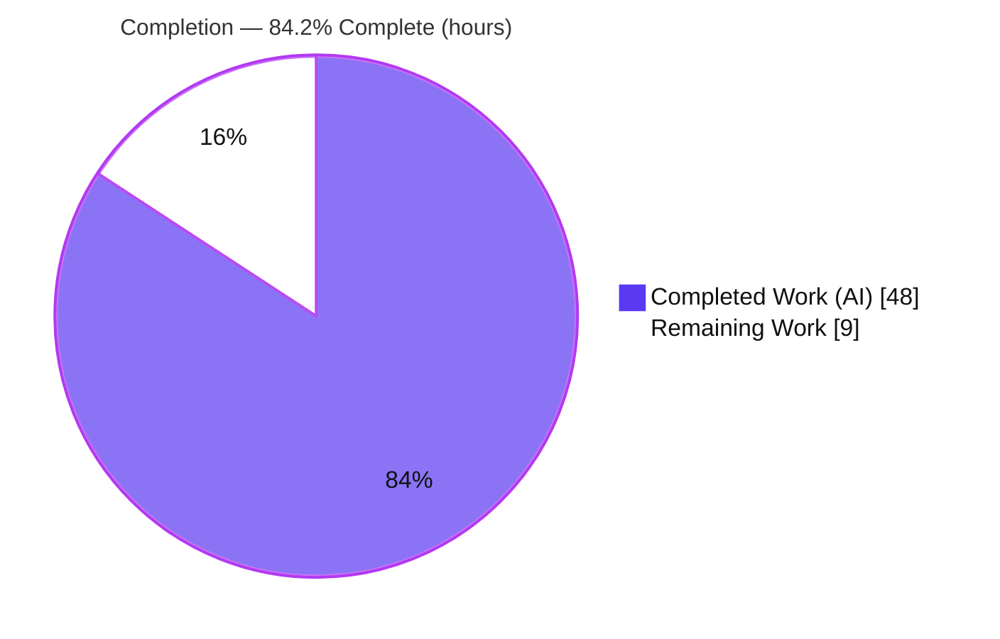
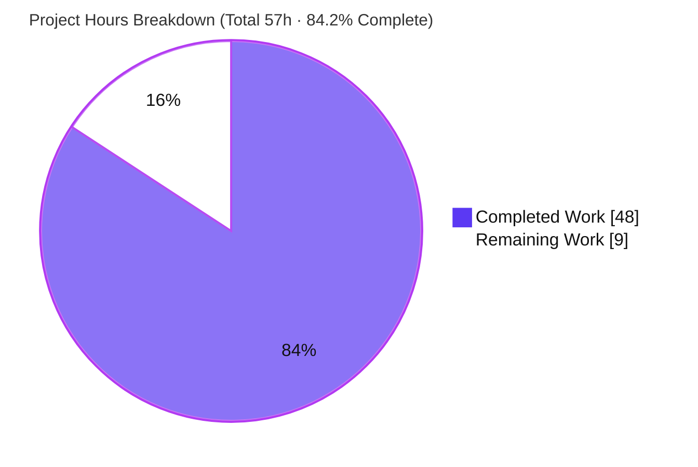
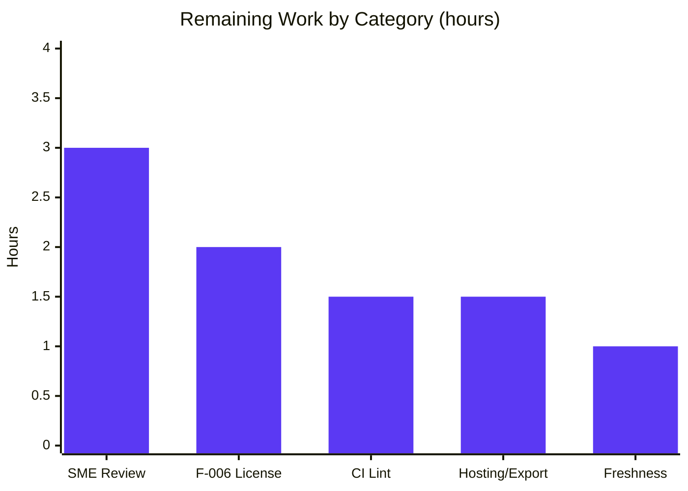

# Blitzy Project Guide — society_mgmt_300k Code Documentation

> **Brand legend:** Completed / AI Work = Dark Blue `#5B39F3` · Remaining / Not Completed = White `#FFFFFF` · Headings / Accents = Violet-Black `#B23AF2` · Highlight = Mint `#A8FDD9`

---

## 1. Executive Summary

### 1.1 Project Overview

This project delivers faithful, evidence-based **code documentation** for the `society_mgmt_300k` synthetic JavaScript corpus, fulfilling the request to document the code's functionalities and highlight its performance and security characteristics. The corpus is a layered scaffold of **29 `.js` files / 33,105 pure functions / 300,000 lines**, where every `mod_<fileId>_<k>(x)` function deterministically returns `6x + 10`. The deliverable is a new `docs/` tree of 14 Markdown files plus an upgraded root `README.md`, raising documentation coverage from an effective ~0% baseline to complete. Target users are maintainers and reviewers performing static analysis; "society management" is documented explicitly as a *nominal label*, not implemented domain functionality. The set is plain Markdown with embedded Mermaid, preserving the repository's zero-dependency posture.

### 1.2 Completion Status



| Metric | Value |
|--------|-------|
| **Total Hours** | **57** |
| **Completed Hours (AI + Manual)** | **48** (48 AI + 0 Manual) |
| **Remaining Hours** | **9** |
| **Percent Complete** | **84.2%** (48 ÷ 57) |

> All completed work was performed autonomously by Blitzy agents (13 `agent@blitzy.com` commits). There are **0 manual/human hours** in the completed portion. The pre-existing corpus (the *subject* of the documentation) was created in earlier human commits and is not part of this deliverable's hours.

### 1.3 Key Accomplishments

- ✅ Authored a complete `docs/` navigation tree — **14 new Markdown files** across functionality, architecture, performance, security, and reference areas.
- ✅ Upgraded the root **`README.md`** from a placeholder (two test-note lines) to a real overview with a `mod_*` worked example, quick-start, and documentation map.
- ✅ Documented all **six features (F-001 … F-006)**, all **11 nominal layers**, and an exact **29-file inventory** (29 files / 33,105 functions / 300,000 lines).
- ✅ Generalized the single arithmetic archetype (`6x + 10`, with the **dead always-true parity branch**) so one worked example + formula table covers all 33,105 functions.
- ✅ Highlighted **performance** faithfully: O(1) time/space, purity/determinism, and the *explicit absence* of SLAs/throughput targets.
- ✅ Highlighted **security** faithfully: verified-absence posture (no I/O, network, `eval`, secrets, auth, or crypto) and the **F-006 dual-license conflict**.
- ✅ Embedded **3 Mermaid diagrams** (feature-relationship, layer map, control flow) that render natively — no build step, no dependencies added.
- ✅ Added **141 `Source:` citations** so every technical claim is traceable to a file and line range.
- ✅ **Perfect scope compliance**: 0 of 29 `.js` source files modified; 0 license files edited.

### 1.4 Critical Unresolved Issues

| Issue | Impact | Owner | ETA |
|-------|--------|-------|-----|
| F-006 dual-license conflict (Apache-2.0 root vs MIT inner) is **documented but not resolved** | Legal/governance ambiguity for downstream consumers; not a runtime defect | Repository owner / Legal | 2h (within remaining 9h) |
| Documentation not yet **human-reviewed / signed-off** | Required gate before merge; no functional blocker found by autonomous validation | Technical SME / Maintainer | 3h (within remaining 9h) |

> No blocking technical defects exist. Autonomous validation found **zero defects** across all 15 in-scope files.

### 1.5 Access Issues

| System/Resource | Type of Access | Issue Description | Resolution Status | Owner |
|-----------------|----------------|-------------------|-------------------|-------|
| — | — | **No access issues identified.** The repository, branch, and all in-scope files were fully accessible; the working tree is clean and all changes are committed. The deliverable requires no external services, credentials, or third-party APIs. | N/A | — |

### 1.6 Recommended Next Steps

1. **[High]** Conduct a technical SME review and sign-off of the 15-file documentation set; confirm the 141 citations resolve to the cited line ranges. *(~3h)*
2. **[High]** Make a governance/legal decision on the **F-006 dual-license conflict** and reconcile the two license files accordingly. *(~2h)*
3. **[Medium]** Optionally add `markdownlint-cli2` to CI with a config that suppresses the cosmetic MD013/MD060 findings — weighing this against the intentional zero-config posture. *(~1.5h)*
4. **[Low]** Optionally publish the docs (e.g., GitHub Pages) and/or export the 3 Mermaid diagrams to static images via `mmdc`. *(~1.5h)*
5. **[Low]** Establish a documentation freshness process that re-runs the embedded verification commands whenever the corpus changes. *(~1h)*

---

## 2. Project Hours Breakdown

### 2.1 Completed Work Detail

| Component | Hours | Description |
|-----------|------:|-------------|
| Repository static analysis & corpus scan | 4.0 | Counted 29 files / 33,105 functions / 300,000 lines / 28 `store` arrays; whole-tree keyword sweep (module/IO/security); per-layer composition; line-count math; identified `filler.js` (comment-only) and `file_27.js` (705-fn short variant). |
| Documentation architecture, template & tooling research | 2.5 | Designed the `docs/` tree and navigation scheme; defined the internal page template (Overview → Details → Source Citations); web-verified optional tool versions (markdownlint-cli2 0.22.1, mermaid-cli 11.15.0). |
| Index & overview pages | 4.0 | `docs/README.md` (navigation hub) and `docs/overview.md` (system overview; "society management" as a nominal label). |
| Functionality documentation (4 files) | 10.0 | `functionality/README.md` (catalog + feature-relationship diagram), `arithmetic-helpers.md` (F-001/F-002, worked example, formula table), `module-anatomy.md` (F-004 `store`), `corpus-composition.md` (F-005 sizing, per-layer table). |
| Architecture documentation (3 files, 2 diagrams) | 7.0 | `architecture/README.md`, `layered-scaffold.md` (F-003 + layer-map diagram, no inter-layer edges), `module-control-flow.md` (control-flow diagram annotating the dead branch). |
| Performance documentation | 2.5 | `performance/README.md`: O(1) time/space, determinism/purity, no loops/recursion/allocation, corpus-scale vs runtime, explicit absence of SLAs/KPIs. |
| Security documentation | 3.0 | `security/README.md`: attack-surface analysis (sole input `x`), verified-absence keyword sweep, zero-dependency supply chain, F-006 dual-license conflict + resolution paths. |
| Reference documentation (3 files) | 7.5 | `file-inventory.md` (all 29 files → layer/functions/lines + totals), `code-reference.md` (`mod_*` archetype + parameter/return table), `glossary.md` (corpus terminology). |
| Root `README.md` upgrade | 2.0 | Replaced placeholder with overview, "what this is / is not", `mod_*` archetype, quick-start, and documentation map. |
| Citation traceability & checkpoint remediation | 2.0 | CP1/CP2 citation-traceability fixes; stale-checkpoint wording corrections; exact H1-count checkpoint fix (visible across commits). |
| Blitzy autonomous validation & QA | 3.5 | Five-gate validation: markdownlint structural (0 errors), Node execution of worked examples, `mmdc` rendering of all 3 diagrams, 181-link integrity (github-slugger), 154-citation line-range validation, factual cross-checks vs filesystem. |
| **Total Completed** | **48.0** | Matches Completed Hours in §1.2. |

### 2.2 Remaining Work Detail

| Category | Hours | Priority |
|----------|------:|----------|
| Human SME technical review & sign-off of the 15 docs | 3.0 | High |
| F-006 dual-license conflict — governance/legal resolution | 2.0 | High |
| `markdownlint-cli2` CI integration + config (suppress cosmetic MD013/MD060) | 1.5 | Medium |
| Docs hosting / static Mermaid image export (GitHub Pages or `mmdc`) | 1.5 | Low |
| Documentation freshness/maintenance process | 1.0 | Low |
| **Total Remaining** | **9.0** | Matches Remaining Hours in §1.2 and §7 |

### 2.3 Hours Reconciliation

- §2.1 Completed (48.0) **+** §2.2 Remaining (9.0) **=** **57.0** Total Hours (matches §1.2). ✓
- Remaining by priority: **High 5.0h**, **Medium 1.5h**, **Low 2.5h** (sum 9.0h). ✓

---

## 3. Test Results

All entries below originate from **Blitzy's autonomous validation logs** for this project. Because the deliverable is documentation (no application runtime), "tests" map to structural, factual, executable-example, citation, rendering, and link-integrity checks. *"Coverage %" reflects documentation coverage where meaningful; "—" denotes a count-based check where coverage is not a meaningful metric.*

| Test Category | Framework / Tool | Total Tests | Passed | Failed | Coverage % | Notes |
|---------------|------------------|------------:|------:|------:|-----------:|-------|
| Markdown structural validity | markdownlint-cli2 0.22.1 | 15 | 15 | 0 | 100% | 0 structural errors across all 15 files; one H1 per file. Only cosmetic MD013/MD060 advisories (non-defects). |
| Worked-example execution | Node.js v20 | 4 | 4 | 0 | 100% | `mod_0_0(1/2/4/10)` = `16/22/34/70` — confirms `6x + 10`. |
| File-inventory accuracy | shell ground-truth | 29 | 29 | 0 | 100% | All 29 rows matched the filesystem; totals 29 / 33,105 / 300,000. |
| Corpus-composition accuracy | shell ground-truth | 11 | 11 | 0 | 100% | All 11 per-layer rows + every line-math statement verified. |
| Security keyword sweep | grep / ripgrep | 9 | 9 | 0 | 100% | 9 keyword groups (module/IO/security) all return 0 occurrences. |
| Source-citation validation | line-range checker | 154 | 154 | 0 | — | All citations reference real files with in-range line spans. |
| Diagram rendering | @mermaid-js/mermaid-cli 11.15.0 (`mmdc`) | 3 | 3 | 0 | — | All 3 diagrams render to valid SVG; no error markers. |
| Cross-link integrity | github-slugger 2 | 181 | 181 | 0 | — | All internal links/anchors resolve; 0 broken. |
| **Totals** | — | **406** | **406** | **0** | **100%** (where applicable) | Heterogeneous autonomous checks; zero failures. |

---

## 4. Runtime Validation & UI Verification

This is a documentation deliverable with **no running application, no HTTP service, and no web UI**. "Runtime" is therefore mapped to rendering/preview health and executable-example correctness; UI-style surfaces that do not exist are reported faithfully as Not Applicable.

**Rendering & preview health**
- ✅ **Operational** — Markdown renders on GitHub and standard viewers with no build step.
- ✅ **Operational** — All **3 Mermaid diagrams** render to valid SVG via `mmdc` (the same engine GitHub uses).
- ✅ **Operational** — All **181** internal links/anchors resolve (validated with `github-slugger`).
- ✅ **Operational** — Worked examples execute correctly under Node: `mod_0_0(4) = 34` (`6·4 + 10`).

**Application/UI surfaces (faithfully reported)**
- ⚪ **Not Applicable** — No web UI, no pages or components (`society_mgmt_300k` has no user interface).
- ⚪ **Not Applicable** — No HTTP endpoints / REST API (the `controllers/` and `routes/` layers are arithmetic stubs, not real endpoints).
- ⚪ **Not Applicable** — No external service or API integrations (no module system; symbols are file-local).

> Legend: ✅ Operational · ⚠ Partial · ❌ Failing · ⚪ Not Applicable (surface absent by design).

---

## 5. Compliance & Quality Review

Cross-mapping of AAP deliverables and quality benchmarks to outcomes. Fixes applied during authoring/validation are noted; outstanding items are flagged.

| Benchmark / AAP Requirement | Status | Progress | Evidence / Notes |
|-----------------------------|--------|---------|------------------|
| F-001 … F-006 all documented | ✅ Pass | 6/6 | All six features covered across functionality + security docs. |
| All 11 nominal layers documented | ✅ Pass | 11/11 | `layered-scaffold.md` + `file-inventory.md` + `corpus-composition.md`. |
| All source files inventoried | ✅ Pass | 29/29 | `file-inventory.md` verified against filesystem ground truth. |
| Function archetype documented | ✅ Pass | 1/1 | `arithmetic-helpers.md` + `code-reference.md` generalize `6x+10` to all 33,105 functions. |
| Minimum 3 Mermaid diagrams | ✅ Pass | 3/3 | Feature-relationship, layer map, control-flow — all render. |
| Source citation on every claim | ✅ Pass | 141 cites | Every one of the 15 files carries `Source:` citations. |
| Faithful framing (no fabricated SLAs/threats) | ✅ Pass | — | Performance/security docs mark absent surfaces explicitly with citations. |
| One H1 per file | ✅ Pass | 15/15 | Confirmed by markdownlint. |
| Markdown structural validity | ✅ Pass | 0 errors | markdownlint-cli2 structural ruleset. |
| Cross-link integrity | ✅ Pass | 181/181 | 0 broken links/anchors. |
| Zero-dependency / no-build posture preserved | ✅ Pass | — | No `package.json`, generator config, or CI workflow introduced. |
| Scope compliance (no source/license edits) | ✅ Pass | — | 0 of 29 `.js` files and 0 license files modified. |
| Cosmetic lint (MD013 line-length, MD060 table-pipe) | ⚠ Advisory | — | Non-defects; unavoidable for tables/Mermaid; optional per AAP §0.9; unconfigurable in-repo per §0.5.4. |
| F-006 dual-license conflict resolution | ⏳ Pending (human) | — | Documented with recommended resolution paths; editing license files is out of documentation scope. |

**Fixes applied during autonomous work:** Prior agents resolved CP1/CP2 citation-traceability findings, corrected stale checkpoint wording, and fixed the exact H1-count checkpoint (commits `232db8c`, `c2d31a3`, `98c44c1`, `89f5028`). The Final Validator found **zero defects** and made no further modifications.

---

## 6. Risk Assessment

| Risk | Category | Severity | Probability | Mitigation | Status |
|------|----------|----------|-------------|------------|--------|
| **F-006 dual-license conflict** (Apache-2.0 root vs MIT inner) creates legal/governance ambiguity | Security / Governance | Medium | High | Documented in `security/README.md` with recommended resolution paths; requires a human legal/governance decision (HT-2) | Documented; resolution pending |
| Documentation drift if the corpus changes (inventory/composition tables and 141 citations become stale) | Technical | Low | Low | Embedded verification commands; freshness process (HT-5) | Mitigated / Documented |
| Dead always-true parity branch and inert `store` placeholder remain in the subject corpus | Technical | Low | N/A | Faithfully documented in `module-control-flow.md` / `module-anatomy.md`; fixing them is out of scope | Documented by design |
| No automated rendering/link gate in CI (validated once autonomously) | Technical | Low | Low | Optional `markdownlint-cli2` + link check in CI (HT-3) | Open (optional) |
| Application-security attack surface | Security | N/A | N/A | Verified-absent via 9-group keyword sweep (all 0): no I/O, network, `eval`, secrets, auth, or crypto | N/A — no surface |
| Supply-chain exposure | Security | Very Low | N/A | Zero dependencies; no manifest/lockfile exists | N/A — no dependencies |
| No docs hosting/deployment configured (renders natively on GitHub; no published site) | Operational | Low | Medium | Optional GitHub Pages / image export (HT-4) | Open (by design) |
| Manual freshness maintenance (no monitoring of count/citation accuracy) | Operational | Low | Low | Embedded verification commands; freshness process (HT-5) | Documented |
| Health checks / monitoring / backups | Operational | N/A | N/A | Documentation artifact — no running service | N/A |
| Markdown/Mermaid renderer compatibility (viewer must support fenced `mermaid`) | Integration | Low | Low | GitHub-flavored Markdown standard; optional static-image export (HT-4) | Low / Mitigated |
| No link-checker in CI (181 links verified once) | Integration | Low | Low | Optional CI lint/link-check (HT-3) | Open (optional) |
| External service / API integrations | Integration | N/A | N/A | None exist — no module system, no integrations | N/A |

**Overall risk posture:** The single live risk of consequence is the **F-006 dual-license conflict** (governance/legal). Every other surface is Low severity or genuinely Not Applicable — consistent with a documentation-only, zero-dependency, no-runtime synthetic corpus.

---

## 7. Visual Project Status

**Project hours — Completed vs Remaining**



**Remaining hours by category (9h total)**



> **Integrity check:** "Remaining Work" = **9h** here equals the Remaining Hours in §1.2 and the sum of the §2.2 Hours column. "Completed Work" = **48h** equals the Completed Hours in §1.2 and the sum of the §2.1 Hours column.

---

## 8. Summary & Recommendations

**Achievements.** The project is **84.2% complete** (48 of 57 AAP-scoped hours). Every AAP-scoped documentation deliverable is finished and validated: 14 new `docs/` files plus an upgraded root `README.md`, covering all six features (F-001 … F-006), all 11 nominal layers, the exact 29-file inventory, the `6x + 10` arithmetic archetype with its dead always-true branch, faithful performance characterization (O(1), determinism, explicit no-SLA framing), and a faithful security posture (verified-absence plus the F-006 dual-license conflict). Three Mermaid diagrams render natively and 141 source citations make every claim traceable. Autonomous validation across five gates returned **zero defects**, and scope compliance is perfect — no source `.js` file and no license file was modified.

**Remaining gaps (9h).** The outstanding work is exclusively **path-to-production**, not unfinished authoring: human SME review & sign-off (3h), a governance/legal decision on the F-006 dual-license conflict (2h), and optional hardening — CI lint (1.5h), docs hosting/image export (1.5h), and a freshness process (1h).

**Critical path to production.** (1) SME review & sign-off → (2) resolve F-006 → merge. The optional items can follow at the team's discretion without blocking release.

**Production-readiness assessment.** The documentation deliverable is **production-ready pending human review**. It is internally consistent, accurate against filesystem ground truth, well-cited, and renders correctly with no build step. Consistent with Blitzy's honest-assessment policy, completion is reported at **84.2%** (never 100% before human review). Confidence is **High** for the documentation deliverable (well-defined, fully validated) and **Medium** for the F-006 resolution (depends on a stakeholder/legal decision outside the documentation's control).

| Success Metric | Target | Result |
|----------------|--------|--------|
| Features documented | 6/6 | ✅ 6/6 |
| Layers documented | 11/11 | ✅ 11/11 |
| Files inventoried | 29/29 | ✅ 29/29 |
| Mermaid diagrams | ≥ 3 | ✅ 3 |
| Autonomous validation defects | 0 | ✅ 0 |
| Source-code files modified | 0 | ✅ 0 |

---

## 9. Development Guide

Because the deliverable is plain Markdown with embedded Mermaid, there is **no build step, no install step, no services, and no environment variables**. All commands below were tested from the repository root.

### 9.1 System Prerequisites

- **Git** ≥ 2.x (repository present; Git LFS 3.7.1 hooks are functional but not required to read docs).
- **A Markdown viewer** — GitHub web UI, or VS Code with a "Markdown Preview Mermaid Support" extension.
- **Node.js** ≥ 18 — *optional*, only needed to execute the worked examples or run the optional lint/diagram-export tools. **Not required** to read the documentation.

### 9.2 Environment Setup

```bash
# Clone and select the branch (no install, no env vars, no services)
git clone <repository-url>
cd Society_Mngt_26-Jun-2026-Afternoon
git checkout blitzy-a1607eb1-4f55-4b93-b257-34a54f3c75b7
```

There is nothing to install — the repository has no dependency manifest by design.

### 9.3 Viewing the Documentation

- Start at **`docs/README.md`** (the navigation hub) or the root **`README.md`** (project overview).
- Fenced ` ```mermaid ` blocks render natively on GitHub and compatible viewers.

### 9.4 Verifying the Corpus Facts (tested)

```bash
# From the repository root — each returns the expected value shown
find society_mgmt_300k -name "*.js" | wc -l                                  # 29
find society_mgmt_300k -name "*.js" -exec cat {} + | wc -l                    # 300000
grep -rhoE 'function mod_[0-9]+_[0-9]+' society_mgmt_300k --include="*.js" | wc -l   # 33105
grep -rl 'const store = \[\]' society_mgmt_300k --include="*.js" | wc -l      # 28
```

### 9.5 Executing the Worked Example (tested)

```bash
node -e '
const fs = require("fs");
const src = fs.readFileSync("society_mgmt_300k/src/controllers/file_0.js","utf8");
const mod_0_0 = new Function(src + "\n; return mod_0_0;")();
for (const x of [1,2,4,10]) console.log(`mod_0_0(${x}) =`, mod_0_0(x), " expected", 6*x+10);
'
# mod_0_0(1) = 16 ; (2) = 22 ; (4) = 34 ; (10) = 70   →  always 6x + 10
```

### 9.6 Optional Tooling (not added to the repo)

```bash
# Optional Markdown lint (requires network on first fetch; not committed to the repo)
npx markdownlint-cli2 "docs/**/*.md" "README.md"

# Optional static export of a Mermaid diagram to SVG
npx -p @mermaid-js/mermaid-cli@11.15.0 mmdc -i <input>.mmd -o <output>.svg
```

### 9.7 Inspecting the Change Set (tested)

```bash
git rev-list --count origin/26-Jun-2026-Br1..HEAD            # 13 commits
git diff --name-only origin/26-Jun-2026-Br1...HEAD | wc -l   # 15 files
git log --author="agent@blitzy.com" origin/26-Jun-2026-Br1..HEAD --oneline | wc -l   # 13
```

### 9.8 Troubleshooting

- **Mermaid diagram shows as code, not a chart** → open the file in a viewer that supports fenced `mermaid` (GitHub web, or VS Code with the Mermaid preview extension), or export to SVG with `mmdc` (§9.6).
- **markdownlint reports MD013 / MD060** → these are **cosmetic-only** (line length / table-pipe style), expected for table rows and embedded Mermaid; suppress via a `.markdownlint` config only if you adopt the optional CI lint.
- **`git diff` shows nothing** → ensure you are comparing against the correct base, `origin/26-Jun-2026-Br1`.
- **`npx` fails offline** → the lint and diagram-export tools are optional; the documentation requires no tooling to read.

---

## 10. Appendices

### A. Command Reference

| Purpose | Command |
|---------|---------|
| Count `.js` files | `find society_mgmt_300k -name "*.js" \| wc -l` → `29` |
| Count total `.js` lines | `find society_mgmt_300k -name "*.js" -exec cat {} + \| wc -l` → `300000` |
| Count functions | `grep -rhoE 'function mod_[0-9]+_[0-9]+' society_mgmt_300k --include="*.js" \| wc -l` → `33105` |
| Count `store` arrays | `grep -rl 'const store = \[\]' society_mgmt_300k --include="*.js" \| wc -l` → `28` |
| Commits since base | `git rev-list --count origin/26-Jun-2026-Br1..HEAD` → `13` |
| Optional lint | `npx markdownlint-cli2 "docs/**/*.md" "README.md"` |
| Optional diagram export | `npx -p @mermaid-js/mermaid-cli@11.15.0 mmdc -i <in>.mmd -o <out>.svg` |

### B. Port Reference

**Not applicable.** The corpus exposes no network ports and runs no service; the `controllers/`/`routes/` layers contain arithmetic stubs, not endpoints.

### C. Key File Locations

| Path | Role |
|------|------|
| `README.md` | Root project overview (upgraded from placeholder) |
| `docs/README.md` | Documentation navigation hub |
| `docs/overview.md` | System overview |
| `docs/functionality/` | F-001/F-002 helpers, F-004 anatomy, F-005 composition + catalog index |
| `docs/architecture/` | F-003 layered scaffold + module control-flow (2 diagrams) |
| `docs/performance/README.md` | O(1), determinism, no-SLA characterization |
| `docs/security/README.md` | Verified-absence posture + F-006 dual-license |
| `docs/reference/` | 29-file inventory, `mod_*` code reference, glossary |
| `society_mgmt_300k/src/controllers/file_0.js` | Canonical `mod_*` archetype (REFERENCE) |
| `society_mgmt_300k/src/utils/filler.js` | Comment-only filler variant (REFERENCE) |
| `society_mgmt_300k/src/middleware/file_27.js` | 705-function short variant (REFERENCE) |
| `LICENSE` / `society_mgmt_300k/LICENSE/LICENSE.txt` | Apache-2.0 root / MIT inner (F-006) |

### D. Technology Versions

| Tool | Version | Role |
|------|---------|------|
| Git | 2.51.0 | Version control (required) |
| Git LFS | 3.7.1 | LFS hooks present (not required to read docs) |
| Node.js | v20.20.2 | Optional — execute examples / run optional tools |
| npm | 11.1.0 | Optional — fetch optional tools via `npx` |
| markdownlint-cli2 | 0.22.1 | Optional — Markdown lint (not committed) |
| @mermaid-js/mermaid-cli | 11.15.0 | Optional — static diagram export (not committed) |
| mermaid | 11.16.0 | Diagram engine (provided natively by GitHub's renderer) |
| github-slugger | 2 | Used in autonomous link-integrity validation |

### E. Environment Variable Reference

**Not applicable.** The deliverable requires no environment variables; there is no application configuration, runtime, or secret to set.

### F. Developer Tools Guide

- **Reading docs:** GitHub web UI renders Markdown + Mermaid with no setup. For local preview, use VS Code with a Markdown + Mermaid preview extension.
- **Optional lint:** `markdownlint-cli2` (§9.6) — adopt only if you also add a config to silence the cosmetic MD013/MD060 advisories.
- **Optional diagram export:** `@mermaid-js/mermaid-cli` (`mmdc`) renders the embedded diagrams to SVG/PNG/PDF if static assets are ever required.
- **Change auditing:** the `git` commands in §9.7 confirm the 13-commit / 15-file change set authored by `agent@blitzy.com`.

### G. Glossary

| Term | Definition |
|------|------------|
| `mod_<fileId>_<k>` | The single function archetype; a pure, single-argument function returning `6x + 10`. |
| `6x + 10` | The constant computation of every function (`x*1 + x*2 + x*3`, then `+10` because `6x` is always even). |
| Dead always-true branch | The `if (r % 2 === 0)` parity check that is always true (since `6x` is even); the false branch is unreachable. |
| `store` | An inert `const store = [];` present in 28 files, never read or written — a placeholder. |
| `filler.js` | A comment-only file (1,999 lines, 0 functions) contributing to the line target. |
| Short variant | `file_27.js`, which defines 705 functions rather than the typical count. |
| Nominal layer | A folder (e.g., `controllers/`, `services/`) named for a conventional role but containing only the arithmetic archetype — no real layer behavior or inter-layer edges. |
| Synthetic corpus | Machine-generated code built to a deterministic size/shape (here, exactly 300,000 lines) rather than to implement domain functionality. |
| Verified-absence posture | A security stance asserting the *documented absence* of I/O, network, `eval`, secrets, auth, and crypto, established via a whole-tree keyword sweep. |
| F-006 | The dual-license conflict: Apache-2.0 (`LICENSE`) vs MIT (`society_mgmt_300k/LICENSE/LICENSE.txt`). |
