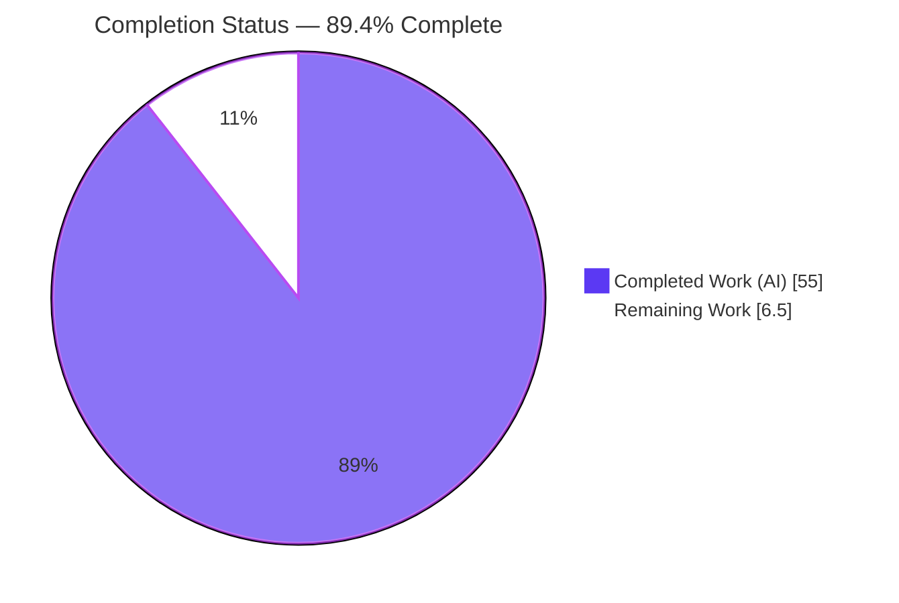
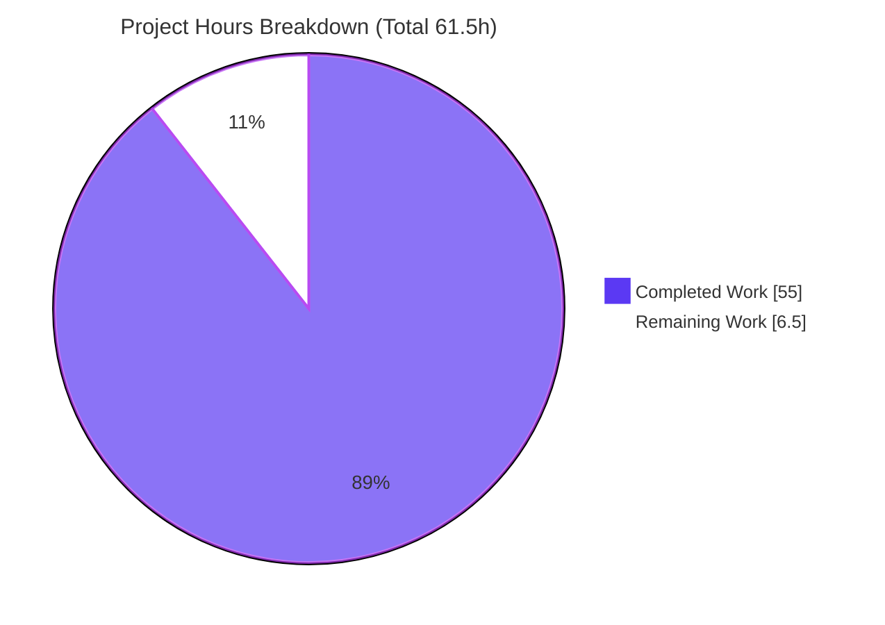
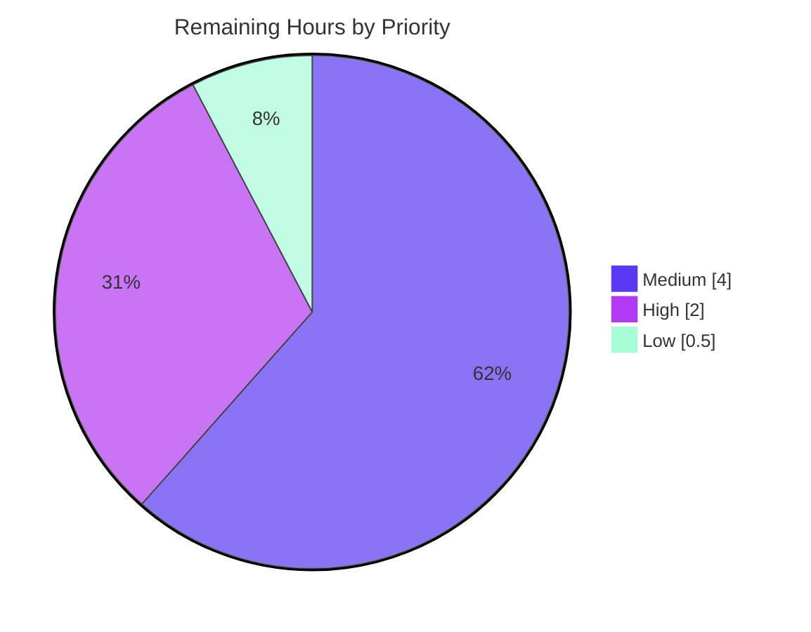

# Blitzy Project Guide

**Project:** `society_mgmt_300k` — Code Documentation Deliverable
**Branch:** `blitzy-a1607eb1-4f55-4b93-b257-34a54f3c75b7`
**Base:** `origin/26-Jun-2026-Br1`
**Deliverable type:** Documentation (no build / runtime / deployment)
**Overall completion:** **89.4%** (55.0 of 61.5 AAP‑scoped hours)

---

## 1. Executive Summary

### 1.1 Project Overview

This project delivers complete, evidence‑based **code documentation** for the `society_mgmt_300k` repository — a synthetic JavaScript corpus of **29 `.js` files, 33,105 functions, and exactly 300,000 lines**. Every function is a pure, single‑argument arithmetic helper named `mod_<fileId>_<k>` that computes `6x + 10`. The objective (verbatim): *"Document the code after scanning it ensure the functionalities are clearly mentioend. Also the performance and security information is highlighted."* The deliverable is a new `docs/` tree (15 Markdown files) plus a rewritten root `README.md`, covering functionality, architecture, performance, and security. The audience is engineers and maintainers who must understand a generated corpus whose "society management" name is a **nominal label**, not implemented domain logic.

### 1.2 Completion Status



| Metric | Value |
|--------|-------|
| **Total Hours** | **61.5** |
| **Completed Hours (AI + Manual)** | **55.0** (AI/autonomous: 55.0 · Manual: 0.0) |
| **Remaining Hours** | **6.5** |
| **Percent Complete** | **89.4%** |

> Completion % is AAP‑scoped (PA1): `55.0 / (55.0 + 6.5) = 89.4%`. All 16 in‑scope authoring deliverables are complete; the remaining 6.5h are human path‑to‑production gates (governance, review, merge).

### 1.3 Key Accomplishments

- [x] **Complete `docs/` tree authored** — 15 Markdown files across overview, functionality, architecture, performance, security, and reference areas (≈2,167 lines).
- [x] **Root `README.md` rewritten** — placeholder replaced with a real evidence‑based overview, quick orientation to the `mod_*` archetype, and a documentation map into `docs/`.
- [x] **All six features documented** — F‑001 (arithmetic corpus `6x+10`), F‑002 (unique symbol namespace), F‑003 (layered scaffold), F‑004 (`store` placeholder), F‑005 (300,000‑line sizing), F‑006 (dual‑license artifacts).
- [x] **Three Mermaid diagrams** authored and verified to render: layer map, module control‑flow (dead‑branch annotated), and feature‑relationship graph.
- [x] **Performance documented faithfully** — O(1) time/space, determinism, no loops/recursion/allocation, and the explicit *absence* of SLAs (no fabricated metrics).
- [x] **Security documented faithfully** — verified‑absence posture (no I/O, eval, secrets, auth, crypto), zero‑dependency supply chain, and the F‑006 dual‑license conflict.
- [x] **Full traceability** — every technical claim carries a `Source: path:Lx-Ly` citation; 295/295 citations resolve.
- [x] **Evidence ledger shipped** — `docs/reference/corpus-evidence.md` records reproducible commands (E1–E12) for re‑verification.
- [x] **5‑gate autonomous validation passed** — content accuracy, runtime render/navigation, zero unresolved errors, all in‑scope files, and Markdown/Mermaid "compilation".

### 1.4 Critical Unresolved Issues

| Issue | Impact | Owner | ETA |
|-------|--------|-------|-----|
| F‑006 dual‑license conflict (Apache‑2.0 root `LICENSE` vs MIT `society_mgmt_300k/LICENSE/LICENSE.txt`) | Legal/governance ambiguity over which license governs the corpus; documented but not resolved (resolution is a code/governance change, out of documentation scope) | Repository owner / Legal | 2.0h |
| Subject‑matter accuracy sign‑off on all 16 documents | Final human confirmation of faithful framing before publication | SME / Technical Writer | 3.0h |

> No issue blocks the documentation deliverable itself; both items are standard path‑to‑production gates.

### 1.5 Access Issues

| System / Resource | Type of Access | Issue Description | Resolution Status | Owner |
|-------------------|----------------|-------------------|-------------------|-------|
| Git repository (branch `blitzy-a1607eb1-...`) | Read/Write | None — branch present, working tree clean, docs committed | ✅ No issue | — |
| npm registry (optional tooling: markdownlint‑cli2, mermaid‑cli) | Network (first `npx` fetch only) | Optional quality tools require one‑time network fetch; not required to read the docs | ⚠ Optional / non‑blocking | Maintainer |
| Runtime / deployment credentials | N/A | Documentation‑only deliverable — no runtime, services, or secrets involved | ✅ Not applicable | — |

> No access issue blocks validation, integration, or the deliverable. The repository is intentionally zero‑dependency with no build or deploy step.

### 1.6 Recommended Next Steps

1. **[High]** Resolve the F‑006 dual‑license conflict — select a single canonical license, add a precedence statement, or add an `SPDX-License-Identifier`, and apply it to both license files (2.0h).
2. **[Medium]** Conduct an SME / technical‑writer accuracy and faithful‑framing review across all 16 documents (3.0h).
3. **[Medium]** Review the pull request (+2,221 / −1,204 across 25 files) and merge to `origin/26-Jun-2026-Br1` (1.0h).
4. **[Low]** Decide markdownlint MD013 (line‑length) handling — accept as‑is or add a config (noting a config introduces the repo's first manifest, currently out of scope) (0.5h).

---

## 2. Project Hours Breakdown

### 2.1 Completed Work Detail

| Component | Hours | Description |
|-----------|------:|-------------|
| Corpus static scan & evidence ledger | 6.0 | Whole‑tree scan; verified 29 files / 33,105 fns / 300,000 lines, 28 `store=[]`, zero‑result keyword sweep; authored `docs/reference/corpus-evidence.md` (E1–E12) |
| Overview & navigation | 5.0 | `docs/README.md` hub, `docs/overview.md`, and rewrite of root `README.md` (placeholder → real overview) |
| Functionality area | 9.0 | `functionality/README.md` (catalog + feature‑relationship diagram), `arithmetic-helpers.md` (F‑001/F‑002), `module-anatomy.md` (F‑004), `corpus-composition.md` (F‑005) |
| Architecture area | 7.0 | `architecture/README.md`, `layered-scaffold.md` (F‑003 + layer‑map diagram), `module-control-flow.md` (control‑flow diagram with dead branch) |
| Performance documentation | 3.5 | `performance/README.md` — O(1) complexity, determinism/purity, corpus‑scale vs runtime, explicit no‑SLA framing |
| Security documentation | 4.0 | `security/README.md` — verified‑absence posture, keyword‑sweep table, zero‑dependency supply chain, F‑006 dual‑license analysis |
| Reference area | 6.0 | `file-inventory.md` (29‑file table), `code-reference.md` (`mod_*` archetype), `glossary.md` |
| Autonomous 5‑gate validation | 9.0 | Citation/link resolution, inventory row‑by‑row, 72 empirical fn executions, offline render harness, lint/mermaid checks, 5 evidence screenshots |
| Iterative QA / code‑review resolution | 5.5 | Restructure of earlier flat docs into AAP hierarchy; false‑positive triage; consistency sweeps across 16 files |
| **Total Completed** | **55.0** | |

### 2.2 Remaining Work Detail

| Category | Hours | Priority |
|----------|------:|----------|
| SME / technical‑writer accuracy & faithful‑framing review (16 docs) | 3.0 | Medium |
| Resolve F‑006 dual‑license conflict (governance decision) | 2.0 | High |
| PR review & merge to base branch `origin/26-Jun-2026-Br1` | 1.0 | Medium |
| Decide markdownlint MD013 (line‑length) handling | 0.5 | Low |
| **Total Remaining** | **6.5** | |

**Remaining by priority:** High = 2.0h · Medium = 4.0h · Low = 0.5h · **Total = 6.5h**

### 2.3 Total Project Hours & Reconciliation

| Bucket | Hours |
|--------|------:|
| Completed (Section 2.1) | 55.0 |
| Remaining (Section 2.2) | 6.5 |
| **Total Project Hours** | **61.5** |

Reconciliation: `55.0 + 6.5 = 61.5`; completion `55.0 / 61.5 = 89.4%`. These figures are identical in Sections 1.2, 2.x, and 7.

---

## 3. Test Results

All entries below originate from Blitzy's **autonomous validation logs** for this documentation project. Because the deliverable is documentation (no executable application), "tests" are validation checks executed by the autonomous validator.

| Test Category | Framework / Tool | Total | Passed | Failed | Coverage % | Notes |
|---------------|------------------|------:|-------:|-------:|-----------:|-------|
| Citation resolution | Custom validator (Node) | 295 | 295 | 0 | 100% | Every `Source: path:Lx-Ly` resolves to a real file & valid line range |
| Cross‑link resolution | Custom validator + github‑slugger | 185 | 185 | 0 | 100% | All inter‑doc links and heading anchors resolve |
| Inventory accuracy | coreutils (`wc`,`grep`) | 29 | 29 | 0 | 100% | Per‑file fn + line counts match corpus exactly |
| Empirical function behavior | Node v20 eval harness | 72 | 72 | 0 | 100% | 8 functions × 9 inputs all return `6x+10` (incl. short‑variant, negatives, 0) |
| Evidence ledger reproduction | coreutils / bash | 12 | 12 | 0 | 100% | E1–E12 commands reproduce documented output verbatim |
| Markdown structure | Custom + markdownlint‑cli2 0.22.1 | 16 | 16 | 0 | 100% | 1 H1 per file; balanced fences; only MD013 advisory fires |
| Mermaid diagram render | @mermaid‑js/mermaid‑cli 11.15.0 (mmdc) | 3 | 3 | 0 | 100% | Layer map, control‑flow, feature‑relationship → valid SVG |
| Runtime render & navigation | marked@12 + headless Chrome harness | 16 | 16 | 0 | 100% | All 16 pages render; links navigate; only favicon 404 (harmless) |
| **Totals** | — | **628** | **628** | **0** | **100%** | Zero substantive failures across all autonomous checks |

> Pass rate: **628 / 628 = 100%**. The only lint signal is MD013 (line‑length), an advisory that the AAP marks optional; it is not counted as a failure.

---

## 4. Runtime Validation & UI Verification

This is a documentation deliverable with **no application runtime**. "Runtime" validation therefore covers Markdown/Mermaid rendering and in‑page navigation, performed with an offline render harness (marked@12 + pre‑rendered SVGs + github‑slugger heading IDs) driven by headless Chrome.

- ✅ **Operational** — All 16 pages (15 `docs/**/*.md` + root `README.md`) render without content errors.
- ✅ **Operational** — Layer‑map diagram renders as isolated nodes with no inter‑layer edges (F‑003 conveyed correctly).
- ✅ **Operational** — Module control‑flow diagram renders with a solid always‑true path and a dotted dead branch → "never taken".
- ✅ **Operational** — Feature‑relationship diagram renders F‑001…F‑006 (F‑006 standalone; `filler.js` shown).
- ✅ **Operational** — Live cross‑link click navigates correctly; F‑006 in‑page anchor scrolls into view.
- ✅ **Operational** — 5 evidence screenshots captured under `blitzy/screenshots/` (docs hub/README, layered‑scaffold table+diagram, control‑flow, feature‑relationship).
- ⚠ **Partial (non‑blocking)** — A single `favicon.ico` 404 is emitted by the test harness only; it does not affect documentation content.
- ❌ **Failing** — None.

> API integration: **Not applicable** — the corpus exposes no module system, endpoints, or external integrations (whole‑tree sweep returns zero `require`/`import`/`export`/`fetch`).

---

## 5. Compliance & Quality Review

Cross‑mapping of AAP deliverables to Blitzy quality/compliance benchmarks. Fixes applied during autonomous validation are noted.

| Benchmark | Requirement (AAP) | Status | Progress | Notes / Fixes Applied |
|-----------|-------------------|--------|---------:|-----------------------|
| Functionality coverage | Document all behavior clearly (F‑001…F‑006) | ✅ Pass | 6/6 | Single archetype generalized across all 33,105 fns |
| Performance highlighted | O(1), determinism, explicit no‑SLA | ✅ Pass | 100% | No fabricated SLAs/KPIs — faithful framing enforced |
| Security highlighted | Verified‑absence posture + licensing | ✅ Pass | 100% | Keyword‑sweep table; F‑006 "DOCUMENTED, NOT APPLIED" |
| Layer coverage | 11 nominal layers documented | ✅ Pass | 11/11 | Per‑layer composition table verified row‑by‑row |
| File inventory | 29 `.js` files inventoried | ✅ Pass | 29/29 | Counts match corpus exactly (totals 33,105 / 300,000) |
| Traceability | `Source: path:Lx-Ly` for every claim | ✅ Pass | 295/295 | All citations resolve |
| Navigation | `docs/` index + cross‑links | ✅ Pass | 185/185 | Hub links to all 6 areas + child pages |
| README upgrade | Replace placeholder | ✅ Pass | 100% | Genuine overview + quick‑start + docs map |
| Diagrams | ≥3 Mermaid diagrams | ✅ Pass | 3/3 | All render to valid SVG |
| Zero‑dependency posture | No new manifests/tooling committed | ✅ Pass | 100% | No `package.json`/lockfile added; tooling used in `/tmp` only |
| Scope discipline | No source/test/license edits | ✅ Pass | 100% | Zero in‑scope `.js`/license changes |
| Markdown lint (optional) | markdownlint clean | ⚠ Advisory | n/a | Only MD013 (line‑length) fires; AAP marks lint optional |
| License governance | F‑006 conflict resolved | ⏳ Open | 0% | Out of documentation scope — human governance decision |

---

## 6. Risk Assessment

| Risk | Category | Severity | Probability | Mitigation | Status |
|------|----------|----------|-------------|------------|--------|
| R1 — Documentation drift if corpus is regenerated | Technical | Low | Low | `corpus-evidence.md` ships reproducible verification commands (E1–E12) | Mitigated |
| R2 — Source dead always‑true branch + inert `store` linger in code | Technical | Low | High | Documented as intentional subject matter; source edits out of scope | Documented |
| R3 — F‑006 dual‑license conflict (Apache‑2.0 root vs MIT inner, no precedence) | Security / Legal | Medium | High | Documented with 3 resolution options; awaiting human governance | **Open** |
| R4 — Runtime attack surface | Security | Negligible | Negligible | Verified absent (no I/O, eval, secrets, auth, crypto); sole input is numeric `x` | Verified absent |
| R5 — Supply‑chain exposure | Security | Negligible | Negligible | Zero dependencies (no `package.json`/lockfile) | Verified absent |
| R6 — No docs hosting / build / CI | Operational | Low | Low | Accepted by design — plain Markdown renders natively (incl. Mermaid) | Accepted |
| R7 — No automated docs quality gate | Operational | Low | Medium | Optional `markdownlint-cli2` documented; manual review covers gap | Accepted / Optional |
| R8 — Mermaid rendering depends on viewer support | Integration | Low | Low–Medium | GitHub & common viewers render natively; `mmdc` SVG export documented | Mitigated |
| R9 — Relative `.md` cross‑link integrity on platform migration | Integration | Low | Low | 185/185 links currently resolve; link map documented for re‑verification | Mitigated |

> **Most material risk:** R3 (F‑006). No High‑severity blockers exist; R3 is the only Open item and is a governance decision rather than a documentation defect.

---

## 7. Visual Project Status

**Hours: Completed vs Remaining** (Completed = Dark Blue `#5B39F3`, Remaining = White `#FFFFFF` with violet stroke for visibility)



**Remaining Work by Priority** (6.5h total)



**Remaining Work by Category (hours)**

| Category | Hours | Priority |
|----------|------:|----------|
| SME / technical‑writer accuracy review | 3.0 | Medium |
| Resolve F‑006 dual‑license conflict | 2.0 | High |
| PR review & merge | 1.0 | Medium |
| markdownlint MD013 decision | 0.5 | Low |
| **Total** | **6.5** | |

> Integrity check: "Remaining Work" = **6.5h** in Section 1.2, Section 2.2, and both pie charts above.

---

## 8. Summary & Recommendations

**Achievements.** The documentation objective is fully met. The complete `docs/` tree (15 files) plus a rewritten root `README.md` faithfully document the `society_mgmt_300k` corpus: its sole behavioral capability (33,105 pure `mod_<fileId>_<k>` helpers computing `6x + 10` with a dead always‑true parity branch), its 11‑layer scaffold, its inert `store` placeholder and comment‑only `filler.js`, its exact 300,000‑line sizing, and its licensing artifacts. Performance is documented as strict O(1) with no fabricated SLAs, and security as a verified‑absence posture with a zero‑dependency supply chain. Every claim is traceable (295/295 citations resolve) and all autonomous validation gates pass (628/628 checks, 100%).

**Remaining gaps (6.5h).** All outstanding work is human path‑to‑production: an SME accuracy review (3.0h), the F‑006 dual‑license governance decision (2.0h), PR review & merge (1.0h), and a markdownlint MD013 policy decision (0.5h).

**Critical path to production.** (1) SME accuracy sign‑off → (2) F‑006 license resolution → (3) PR merge to `origin/26-Jun-2026-Br1`. The MD013 decision can proceed in parallel.

**Production readiness.** The project is **89.4% complete** (55.0 of 61.5 hours). The documentation artifact itself is production‑ready and self‑contained (no build/deploy). The only non‑documentation blocker is the F‑006 license governance decision, which is a legal/ownership call rather than an engineering defect.

| Success Metric | Target | Actual |
|----------------|--------|--------|
| Feature coverage | 6/6 | ✅ 6/6 |
| Files inventoried | 29/29 | ✅ 29/29 |
| Citations resolving | 100% | ✅ 295/295 |
| Cross‑links resolving | 100% | ✅ 185/185 |
| Diagrams rendering | 3/3 | ✅ 3/3 |
| Autonomous checks passing | 100% | ✅ 628/628 |

---

## 9. Development Guide

> This is a **zero‑dependency documentation** project. There is **no build, no runtime, and no deployment**. The "development" workflow is reading, previewing, and optionally linting Markdown.

### 9.1 System Prerequisites

- **OS:** Any (Linux/macOS/Windows). Validated on Ubuntu 25.10.
- **Git:** 2.51.0 (used 2.51.0) — to clone/checkout the branch.
- **Markdown viewer:** GitHub web UI, VS Code, or any viewer with Mermaid support. **No software is required to read the docs.**
- **(Optional) Node.js + npm:** Node v20.20.2 / npm 11.1.0 — only for optional lint/diagram tooling (first run fetches packages over the network).

### 9.2 Environment Setup

```bash
# Clone and check out the documentation branch
git clone <repo-url> society_mgmt_300k
cd society_mgmt_300k
git checkout blitzy-a1607eb1-4f55-4b93-b257-34a54f3c75b7
```

No environment variables, services, databases, or secrets are required.

### 9.3 Dependency Installation

```bash
# None required — the repository has no package.json or lockfile (verified).
# Confirm zero dependency manifests:
find . -name package.json -not -path '*/node_modules/*' | wc -l   # expect 0
```

### 9.4 Reading / Previewing the Documentation

```bash
# List the documentation set (expect 15 files)
find docs -name '*.md' | sort

# Start at the hub, then navigate:
#   README.md  ->  docs/README.md  ->  area READMEs  ->  topic pages
# On GitHub, Mermaid fenced blocks render automatically (no build step).
```

### 9.5 Verification Steps

```bash
# 1) Re-verify corpus facts (expect: 29 files, 300000 lines, 33105 functions)
find society_mgmt_300k -name '*.js' | wc -l
find society_mgmt_300k -name '*.js' -exec cat {} + | wc -l
grep -rohE 'function mod_[0-9]+_[0-9]+' society_mgmt_300k --include='*.js' | wc -l

# 2) Empirically confirm a helper returns 6x+10 (expect 34 for x=4)
node -e "eval(require('fs').readFileSync('society_mgmt_300k/src/controllers/file_0.js','utf8')); console.log(mod_0_0(4));"

# 3) (Optional) Lint Markdown — only MD013 (line-length) is expected to fire
npx --yes markdownlint-cli2 "docs/**/*.md" "README.md"

# 4) (Optional) Export a Mermaid diagram to SVG
npx -p @mermaid-js/mermaid-cli@11.15.0 mmdc -i <input>.mmd -o <output>.svg
```

### 9.6 Example Usage

```javascript
// Any corpus function is a pure helper computing 6x + 10.
// Example from society_mgmt_300k/src/controllers/file_0.js:
function mod_0_0(x){ let r=0; r+=x*1; r+=x*2; r+=x*3; if(r%2===0){r+=10} return r; }

mod_0_0(0);   // => 10
mod_0_0(4);   // => 34   (6*4 + 10)
mod_0_0(10);  // => 70   (6*10 + 10)
mod_0_0(-5);  // => -20  (6*-5 + 10)
```

### 9.7 Troubleshooting

- **Mermaid diagram shows as raw code** → Your viewer lacks Mermaid support. Use GitHub, VS Code (with a Mermaid extension), or export to SVG with `mmdc` (see 9.5).
- **`npx markdownlint-cli2` reports MD013** → Expected and advisory (line‑length). The AAP marks lint optional; no action required.
- **`npx` fails to fetch a tool** → First run needs network access; the optional tools are not required to read the docs.
- **Function call returns `undefined`** → Load the *entire* file before calling (functions are file‑local; there is no module system / no `export`). Use the `node -e "eval(readFileSync(...))"` form shown in 9.5.
- **Counts differ from the docs** → The corpus may have changed. Re‑run the commands in `docs/reference/corpus-evidence.md` (E1–E12) and update the inventory tables.

---

## 10. Appendices

### A. Command Reference

| Command | Purpose |
|---------|---------|
| `find docs -name '*.md' \| sort` | List the 15 documentation files |
| `find society_mgmt_300k -name '*.js' \| wc -l` | Count corpus files (29) |
| `find society_mgmt_300k -name '*.js' -exec cat {} + \| wc -l` | Count corpus lines (300,000) |
| `grep -rohE 'function mod_[0-9]+_[0-9]+' --include='*.js' \| wc -l` | Count functions (33,105) |
| `node -e "eval(readFileSync('.../file_0.js')); console.log(mod_0_0(4))"` | Empirically verify `6x+10` |
| `npx --yes markdownlint-cli2 "docs/**/*.md" "README.md"` | Optional Markdown lint |
| `npx -p @mermaid-js/mermaid-cli@11.15.0 mmdc -i in.mmd -o out.svg` | Optional diagram export |

### B. Port Reference

Not applicable — no services, servers, or listening ports. The deliverable is static Markdown.

### C. Key File Locations

| Path | Description |
|------|-------------|
| `README.md` | Root overview (rewritten from placeholder) + docs map |
| `docs/README.md` | Documentation hub / navigation |
| `docs/overview.md` | System overview; "society management" as a nominal label |
| `docs/functionality/` | F‑001/F‑002/F‑004/F‑005 + catalog & feature‑relationship diagram |
| `docs/architecture/` | F‑003 layered scaffold + layer‑map & control‑flow diagrams |
| `docs/performance/README.md` | O(1), determinism, no‑SLA framing |
| `docs/security/README.md` | Verified‑absence posture + F‑006 dual‑license analysis |
| `docs/reference/` | `file-inventory.md`, `code-reference.md`, `glossary.md`, `corpus-evidence.md` |
| `LICENSE` | Apache‑2.0 (root) — F‑006 |
| `society_mgmt_300k/LICENSE/LICENSE.txt` | MIT (inner) — F‑006 |
| `blitzy/screenshots/` | 5 validation evidence screenshots |

### D. Technology Versions

| Tool | Version | Role |
|------|---------|------|
| Node.js | v20.20.2 | Optional — empirical fn verification / tooling |
| npm | 11.1.0 | Optional — tooling fetch |
| Git | 2.51.0 | Version control |
| markdownlint‑cli2 | 0.22.1 | Optional — Markdown lint (not committed) |
| @mermaid‑js/mermaid‑cli | 11.15.0 | Optional — diagram SVG export (not committed) |
| mermaid (engine) | 11.16.0 | Native rendering by GitHub/viewers |

### E. Environment Variable Reference

None. The project requires no environment variables, configuration files, or secrets (verified: `src/config/` contains arithmetic stubs with no configuration object/keys).

### F. Developer Tools Guide

- **Reading:** GitHub renders all Markdown and Mermaid natively — no setup.
- **Local preview:** VS Code with a Markdown/Mermaid preview extension.
- **Linting (optional):** `markdownlint-cli2` — only MD013 advisory fires.
- **Diagram export (optional):** `@mermaid-js/mermaid-cli` (`mmdc`) → SVG/PNG/PDF.
- **Re‑verification:** Follow `docs/reference/corpus-evidence.md` (E1–E12) to reproduce every counted fact.

### G. Glossary

| Term | Definition |
|------|------------|
| `mod_<fileId>_<k>` | Canonical helper function name; file‑local, single‑argument, returns `6x+10` |
| `store` | Inert module‑scoped `const store = []` present in 28 files; never read or written |
| `filler.js` | Comment‑only file in `src/utils/` (0 functions, 1,999 lines) used for line sizing |
| Short variant | `src/middleware/file_27.js` — 705 functions (fewer than the standard file) |
| Layer | One of 11 nominal folders (config, middleware, models, controllers, routes, domain, services, repositories, utils, tests/unit, tests/integration) |
| Dead branch | The always‑true `if (r % 2 === 0)` parity branch — its false path is unreachable because `6x` is always even |
| Synthetic corpus | Machine‑generated code whose "society management" name is a label, not implemented domain logic |
| F‑006 | The dual‑license conflict: Apache‑2.0 root `LICENSE` vs MIT inner `LICENSE.txt` |

---

*Generated by the Blitzy Platform. All figures are AAP‑scoped (PA1). Completion: 55.0 / 61.5 hours = 89.4%.*