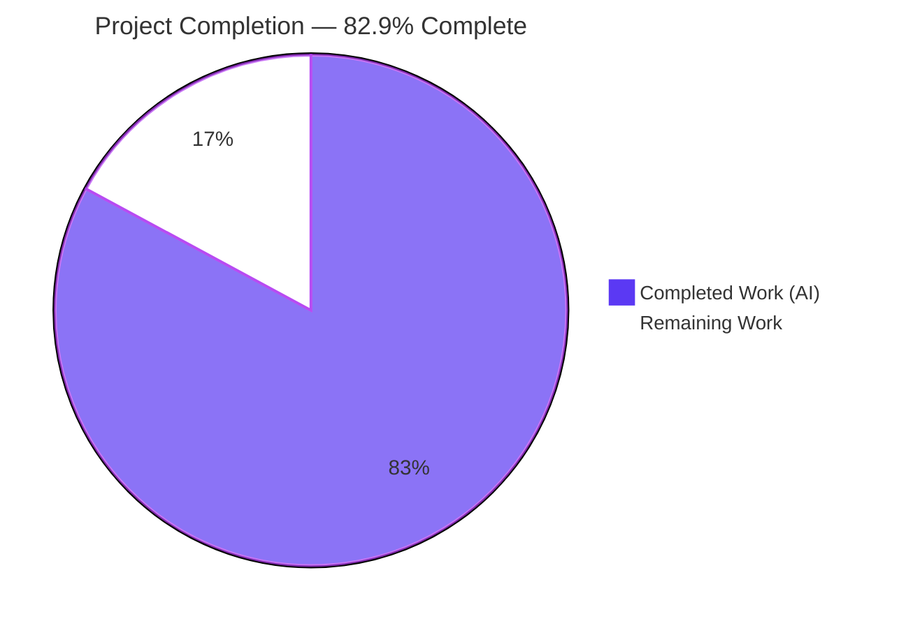
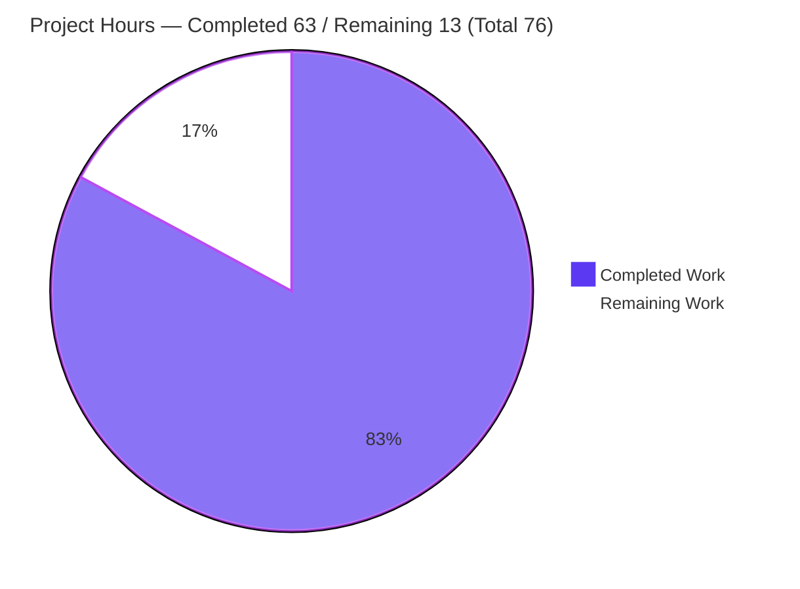
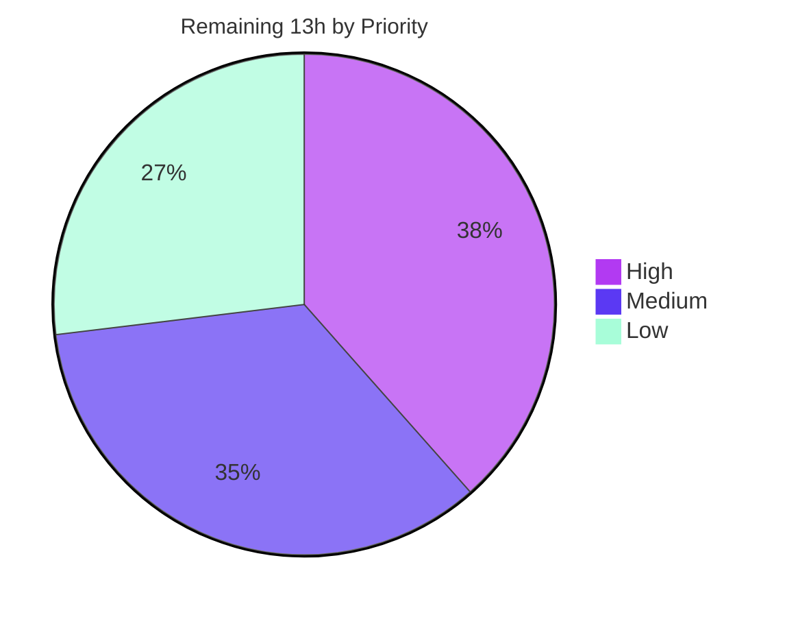

# Blitzy Project Guide — society_mgmt_300k JavaScript → Python Migration

> Brand palette applied throughout: **Completed / AI Work** = Dark Blue `#5B39F3` · **Remaining** = White `#FFFFFF` · **Headings / Accents** = Violet-Black `#B23AF2` · **Highlight** = Mint `#A8FDD9`.

---

## 1. Executive Summary

### 1.1 Project Overview

This project is an **in-place tech-stack migration** of the `society_mgmt_300k/` codebase from JavaScript to Python, combined with a performance and code-structure optimization. The source was a synthetic ~300,000-line corpus containing 33,105 byte-identical function bodies across 28 modules — an extreme DRY violation with redundant arithmetic and dead code. The migration collapses all of that logic into **one** tested canonical function, `society_mgmt.core.compute(x)`, preserves the nine-layer taxonomy as navigational Python subpackages, and rebuilds the previously non-executing test tier as an executable `pytest` characterization suite. The target user is the maintaining engineering team; there is no runtime service or UI — the only interface is the in-process function-call surface. Behavior is preserved exactly, within two documented, benign numeric deviations.

### 1.2 Completion Status



| Metric | Value |
|--------|-------|
| **Total Hours** | **76** |
| **Completed Hours (AI + Manual)** | **63** (63 AI + 0 Manual) |
| **Remaining Hours** | **13** |
| **Percent Complete** | **82.9%** (63 ÷ 76) |

> Completion is computed with the AAP-scoped, hours-based methodology: `Completed ÷ (Completed + Remaining) = 63 ÷ 76 = 82.9%`. 100% of AAP-specified code deliverables are complete and independently validated; the remaining 13h is human governance and production-hardening outside the autonomous engineering scope.

### 1.3 Key Accomplishments

- ✅ **Single source of truth created** — `core.py :: compute(x)` implements the exact behavior once (`r = 6*x; if r % 2 == 0: r += 10; return r`), reducing the legacy three-term accumulation.
- ✅ **33,105 duplicated bodies eliminated** — collapsed to one function; **28,305** source-side `mod_N_M = compute` aliases preserve legacy names, all verified to resolve to the *same* `compute` object.
- ✅ **24 JavaScript source modules ported to Python** across all nine layers, with a clean single-import surface (`from society_mgmt.core import compute`).
- ✅ **29 JavaScript files decommissioned in place** (24 modules + `filler.js` + 4 test fixtures); zero `.js` remain.
- ✅ **Dead code removed** — `filler.js` (1,999 comment-only lines) not ported; unused `const store = []` dropped everywhere.
- ✅ **Executable pytest characterization suite** — 4 modules, **76 tests, 100% passing**, pinning the legacy `x → f(x)` mapping.
- ✅ **Installable package** — `pyproject.toml` (setuptools ≥61, `requires-python >=3.13`, `pytest==9.1.1`, src-layout) + 10 `__init__.py`.
- ✅ **README rewritten** (36 → 7,228 bytes) and **zero PEP 8 violations** across `src` + `tests`.

### 1.4 Critical Unresolved Issues

| Issue | Impact | Owner | ETA |
|-------|--------|-------|-----|
| *None — no blocking issues* | All 5 validation gates pass; code compiles, 76/76 tests green, 0 style violations | — | — |

> There are no critical unresolved (blocking) issues. All remaining items are non-blocking governance/hardening tasks tracked in Sections 2.2 and 8.

### 1.5 Access Issues

| System/Resource | Type of Access | Issue Description | Resolution Status | Owner |
|-----------------|----------------|-------------------|-------------------|-------|
| — | — | No access issues identified | N/A | — |

> **No access issues identified.** The project is self-contained: pure Python standard library at runtime, zero external services, zero credentials, and no private package registry. Build validation ran entirely offline.

### 1.6 Recommended Next Steps

1. **[High]** Perform human code review of the 74-file migration diff and sign off for merge to the protected branch.
2. **[High]** Obtain stakeholder acceptance of the two documented numeric deviations (float display; >2⁵³ precision), or mandate the optional bit-exact float64 emulation mode.
3. **[Medium]** Add a CI/CD pipeline running `pytest` + `pycodestyle` on push/PR (repository currently has none).
4. **[Medium]** Validate clean-machine onboarding (fresh venv → install → `pytest` → 76 passed).
5. **[Low]** Decide on package distribution (internal index / PyPI) and add a `.gitignore` for build artifacts.

---

## 2. Project Hours Breakdown

### 2.1 Completed Work Detail

| Component | Hours | Description |
|-----------|-------|-------------|
| Diagnosis & behavioral-equivalence analysis | 9 | [AAP Goal 1] Corpus scan; identify duplication/redundant arithmetic/dead code; cross-language execution + 2M-sample bit-equivalence verification; toolchain/version web research |
| Canonical `core.py :: compute(x)` | 5 | [AAP] Single source of truth; DRY consolidation; arithmetic reduced from `r+=x*1;r+=x*2;r+=x*3` to `r=6*x` |
| Migrate 24 layer modules | 16 | [AAP] JS→Python port; 28,305 `mod_N_M = compute` aliases; per-module docstrings; single-import surface |
| Nine subpackages + 10 `__init__.py` | 4 | [AAP] Package structure preserving taxonomy; root re-export of `compute` |
| Dead-code elimination + JS decommission | 3 | [AAP] Remove `filler.js` and `const store`; delete 29 `.js` files in place |
| `pyproject.toml` packaging config | 3 | [AAP] setuptools build backend, dev extras, pytest config, src-layout |
| pytest characterization suite | 11 | [AAP] `conftest.py` golden-master data + 4 modules (76 tests): parametrize, identity, float-type, large-int-exact |
| `README.md` documentation | 3 | [AAP] Rewrite: layout, install, test commands, preserved-behavior table |
| Validation & QA cycle | 9 | [Path-to-prod] 5 production-readiness gates + 4 QA fix commits (setuptools floor, docstring cleanup, E501, identity assertions) |
| **Total Completed** | **63** | Matches Completed Hours in Section 1.2 |

### 2.2 Remaining Work Detail

| Category | Hours | Priority |
|----------|-------|----------|
| Human code review & merge sign-off | 3 | High |
| Numeric-deviation stakeholder sign-off (accept default or mandate float64 emulation) | 2 | High |
| CI/CD pipeline setup (`pytest` + `pycodestyle` on push/PR) | 3 | Medium |
| Clean-machine onboarding validation | 1.5 | Medium |
| Package distribution/publish decision & config | 2 | Low |
| Optional strict symbol-name compatibility confirmation | 1 | Low |
| Repository hygiene (`.gitignore` for build artifacts) | 0.5 | Low |
| **Total Remaining** | **13** | Matches Remaining Hours in Section 1.2 & Section 7 |

### 2.3 Hours Reconciliation

- **Section 2.1 (Completed) = 63h** · **Section 2.2 (Remaining) = 13h** · **2.1 + 2.2 = 76h = Total (Section 1.2)** ✅
- **Completion = 63 ÷ 76 = 82.9%**, consistent in Sections 1.2, 7, and 8.
- All 63 completed hours were delivered autonomously by Blitzy agents (0 manual hours to date).

---

## 3. Test Results

All tests below originate from Blitzy's autonomous validation logs for this project and were **independently re-executed** during this assessment (`pytest` → 76 passed in ~0.12s).

| Test Category | Framework | Total Tests | Passed | Failed | Coverage % | Notes |
|---------------|-----------|-------------|--------|--------|------------|-------|
| Unit | pytest 9.1.1 | 38 | 38 | 0 | 100% of core logic | `test_file_9.py` + `test_file_20.py` (19 each); golden-master, alias identity, float type, large-int |
| Integration | pytest 9.1.1 | 38 | 38 | 0 | 100% of core logic | `test_file_10.py` + `test_file_21.py` (19 each); cross-layer delegation to single `compute` |
| **Total** | **pytest 9.1.1** | **76** | **76** | **0** | **100%** | 0 skipped, 0 errors; clean-slate run |

**Test design notes:**
- Golden-master `(input, expected)` pairs in `conftest.py` pin the legacy JavaScript outputs across the representative domain: zero, positive/negative integers, floats (`0.5/2.5/-2.5`), the 2⁵³ boundary, and large integers.
- **Both branches of `compute` are exercised:** integer inputs always make `6*x` even (the `+= 10` branch), while float inputs like `0.5 → 3.0` produce an odd `r` (the skip branch) — full branch coverage of the one canonical function.
- The `test_alias_delegates_to_compute` case asserts `mod_1_0 is compute is pkg_compute` — object identity, the migration's acceptance criterion.

---

## 4. Runtime Validation & UI Verification

The system exposes **no web, mobile, desktop, or CLI UI** — the only interface is the in-process function-call surface (AAP §0.3.4). The `routes`, `controllers`, and `middleware` names are structural labels only; no HTTP/routing/UI wiring exists.

**Runtime / interface health:**
- ✅ **Operational** — Import surface: `society_mgmt.compute IS society_mgmt.core.compute` (re-exported at package root).
- ✅ **Operational** — Alias resolution: all **28,305** `mod_*` aliases across the 9 layers resolve to the one canonical `compute` object (0 non-identity).
- ✅ **Operational** — Numeric domain: integers, negatives, floats, the 2⁵³ boundary, and large integers all produce correct results (0 mismatches); correct int/float typing (`compute(0.5) = 3.0`, `compute(7) = 52`, `compute(-100) = -590`).
- ✅ **Operational** — No I/O, network, persistence, or side effects introduced (source scan: 0 forbidden patterns; only the canonical core import present).
- ✅ **Operational** — Editable install + import from a clean interpreter succeeds; `pip check` clean.
- ⚪ **Not Applicable** — UI verification: no rendered interface exists by design.

---

## 5. Compliance & Quality Review

Cross-mapping of AAP deliverables to Blitzy quality/compliance benchmarks. Fixes applied during autonomous validation are noted.

| AAP Deliverable / Benchmark | Status | Evidence / Fixes Applied |
|------------------------------|--------|--------------------------|
| Single canonical `compute(x)` (DRY) | ✅ Pass | `core.py` body exact; verified |
| 24 modules ported with aliases | ✅ Pass | 28,305 aliases; identity to `compute` confirmed |
| Nine-layer taxonomy preserved | ✅ Pass | 9 subpackages + 10 `__init__.py` present |
| `filler.js` removed (dead code) | ✅ Pass | Deleted, not ported |
| `const store = []` removed | ✅ Pass | grep: 0 occurrences in Python |
| Behavior preserved (`x → f(x)`) | ✅ Pass | 76 characterization tests green |
| Executable pytest suite | ✅ Pass | 4 modules, 76 tests, 100% pass |
| `pyproject.toml` per spec | ✅ Pass | setuptools ≥61, py ≥3.13, pytest==9.1.1, src-layout |
| README documentation | ✅ Pass | 7,228 bytes; layout/install/test/behavior |
| No new external surface | ✅ Pass | 0 I/O/network/persistence patterns |
| JS decommissioned in place | ✅ Pass | 29 `.js` deleted; 0 remain |
| Compilation clean | ✅ Pass | `compileall` exit 0 (43 files) |
| PEP 8 (project standard) | ✅ Pass | pycodestyle 0 violations (fixed 18 E501 docstring findings in commit `d8f4e93`) |
| Dependency integrity | ✅ Pass | `pip check` clean; setuptools floor pinned ≥61 (SEC-001 resolved) |
| Secret hygiene | ✅ Pass | Legacy `API_KEY`/`DB_HOST` dropped; staged-diff secret scan clean |
| LICENSE files (out of scope) | ✅ Pass | Apache-2.0 + MIT untouched |
| Symbol-name strict compatibility | ⚠ Partial | Optional per AAP; aliases provided, human confirmation pending (Low) |
| Numeric-deviation sign-off | ⚠ Partial | 2 deviations documented & tested; stakeholder acceptance pending (High) |

**Progress:** 15 of 17 benchmarks fully pass; the 2 partials are governance decisions, not code defects.

---

## 6. Risk Assessment

| Risk | Category | Severity | Probability | Mitigation | Status |
|------|----------|----------|-------------|------------|--------|
| Documented numeric deviations (float display; >2⁵³ precision) | Technical | Low | Low | Characterization tests pin behavior; value-equivalent; Python strictly more correct; float64 emulation mode available; awaiting sign-off | Open (low) |
| Symbol-name surface: 28,305 aliases vs 33,105 legacy names | Technical | Low | Very Low | Legacy functions had zero callers/exports; confirm no strict-name requirement | Open (low) |
| Dedup regression risk | Technical | None | — | All bodies byte-identical; collapse lossless; 76 tests + identity | Mitigated |
| Hardcoded secret from legacy Node instructions | Security | Medium (if committed) | Very Low | AAP secret-hygiene rule; validator secret-scanned staged diff (clean); Node steps dropped | Closed |
| Supply-chain build dependency floor | Security | Low | Low | `setuptools>=61` pinned (SEC-001); zero third-party runtime deps (pure stdlib) | Closed |
| Runtime attack surface | Security | None | — | `core.py` zero imports; no I/O/eval/subprocess | Mitigated |
| No CI/CD — future edits lack automated gates | Operational | Medium | Medium | Add CI running `pytest` + `pycodestyle` | Open |
| Untracked build artifacts not git-ignored | Operational | Low | Low | Add `.gitignore` for `egg-info`/`__pycache__` | Open |
| No monitoring/logging/health checks | Operational | N/A | — | Pure library, no runtime service (by design) | N/A |
| External services / APIs / DB / network | Integration | None | — | None exist by design (AAP §0.5) | N/A |
| `requires-python >=3.13` blocks older interpreters | Integration | Low | Low | Documented; broaden floor if wider support needed | Open (low) |
| Consumer import-path change (new import surface) | Integration | Low | Low | Original had zero callers; README documents paths; aliases preserve names | Open (low) |

**Net risk posture: LOW.** The only genuine open action-risk is the absence of CI/CD (Medium). All security risks are closed or mitigated; there is no integration risk because the system has no external surface by design.

---

## 7. Visual Project Status

**Project hours breakdown** (Completed = Dark Blue `#5B39F3`, Remaining = White `#FFFFFF`):



**Remaining hours by priority:**



**Remaining hours by category (Section 2.2):**

| Category | Hours |
|----------|------:|
| Human code review & merge sign-off | 3.0 |
| CI/CD pipeline setup | 3.0 |
| Numeric-deviation sign-off | 2.0 |
| Package distribution decision | 2.0 |
| Clean-machine onboarding validation | 1.5 |
| Symbol-name compatibility confirmation | 1.0 |
| Repository hygiene (`.gitignore`) | 0.5 |
| **Total** | **13.0** |

> **Integrity check:** "Remaining Work" = **13h** in the pie chart equals Remaining Hours in Section 1.2 and the sum of the Section 2.2 Hours column. ✅

---

## 8. Summary & Recommendations

**Achievements.** The migration fulfills every AAP-specified deliverable. A ~300,000-line JavaScript corpus of 33,105 byte-identical function bodies is now a clean, installable Python package whose logic lives in a single, tested `compute(x)`. Duplication is eliminated (28,305 name-preserving aliases delegate to one object), dead code is removed, the nine-layer taxonomy survives as navigational subpackages, and the formerly non-executing tests are a passing 76-test characterization suite. All five production-readiness gates pass and were independently re-verified.

**Remaining gaps.** The outstanding 13 hours are entirely human governance and production-hardening — not code defects: human code review, stakeholder sign-off on the two documented numeric deviations, CI/CD setup, onboarding validation, a publish decision, name-compat confirmation, and a `.gitignore`.

**Critical path to production.** (1) Human review & merge sign-off → (2) accept numeric deviations (or request float64 emulation) → (3) add CI/CD → (4) confirm onboarding. Items 5–7 are optional polish.

**Success metrics.** Compilation clean (43 files); 76/76 tests passing; 0 PEP 8 violations; `pip check` clean; single-source-of-truth identity verified (28,305 aliases → 1 object); behavior preserved within 2 documented deviations.

**Production readiness.** The **codebase is production-ready** from an engineering standpoint (**82.9% complete** on the AAP-scoped, path-to-production basis). It is not yet *shipped* only because human sign-off and standard production infrastructure (CI/CD, publish) remain. Confidence is **High** for completed work (independently validated) and **Medium** for remaining effort (governance timelines vary by organization).

---

## 9. Development Guide

### 9.1 System Prerequisites

- **Python 3.13.x** (environment validated on CPython **3.13.13**). Required by `pyproject.toml` (`requires-python >=3.13`).
- **pip** (bundled with Python).
- ~50 MB free disk space. **No** compiler, database, network access, or external services are required — runtime logic is pure standard library.
- OS-agnostic. Commands below show Windows PowerShell first, with POSIX equivalents noted.

### 9.2 Environment Setup

```bash
# From the repository root
cd society_mgmt_300k

# Create an isolated virtual environment (the repo also ships a ready-to-use .venv)
python -m venv .venv

# Activate it
.\.venv\Scripts\Activate.ps1        # Windows PowerShell
# source .venv/bin/activate          # macOS/Linux
```

> **Note:** In locked-down containers the automatic pip bootstrap (`ensurepip`) during `python -m venv` may fail. If so, either use the pre-shipped `.venv` or bootstrap pip with `python -m ensurepip --upgrade`.

### 9.3 Dependency Installation

```bash
# Editable install with the dev/test extra (pulls pytest==9.1.1)
python -m pip install -e ".[dev]"
```

Expected: `Successfully installed society_mgmt-0.1.0` (exit code 0). Verify the environment:

```bash
python -m pip check                  # -> No broken requirements found
```

### 9.4 Application Startup

There is **no server or daemon to start** — `society_mgmt` is an importable library. "Startup" is simply importing and calling the function:

```bash
python -c "from society_mgmt import compute; print(compute(7))"   # -> 52
```

### 9.5 Verification Steps

```bash
# 1) Run the test suite
python -m pytest                     # -> 76 passed in ~0.12s

# 2) Byte-compile all sources (syntax check)
python -m compileall -q src tests    # -> exit code 0

# 3) Style check (project standard: PEP 8)
python -m pycodestyle src tests      # -> exit code 0 (zero violations)
```

### 9.6 Example Usage

```python
from society_mgmt import compute

compute(7)      # 52     (6*7=42, even -> +10)
compute(0.5)    # 3.0    (float display deviation; value-equal to JS 3)
compute(-100)   # -590
compute(9007199254740993)  # 54043195528445968  (Python exact beyond 2**53)

# Every legacy symbol is a one-line alias of the same object:
from society_mgmt.services.file_1 import mod_1_0
mod_1_0 is compute          # True  (single source of truth)
```

### 9.7 Troubleshooting

- **`ModuleNotFoundError: society_mgmt`** — run the editable install from `society_mgmt_300k/` (the directory containing `pyproject.toml`).
- **`pytest: command not found` / not collected** — ensure the `.[dev]` extra installed `pytest==9.1.1`; re-run the install.
- **Install error citing `requires-python`** — upgrade the interpreter to Python 3.13+.
- **`python -m venv` fails on `ensurepip`** — use the shipped `.venv` or run `python -m ensurepip --upgrade`.
- **`compute(0.5)` returns `3.0`, not `3`** — expected (documented Deviation 1); the numeric value is identical to the legacy JS result.

---

## 10. Appendices

### A. Command Reference

| Purpose | Command |
|---------|---------|
| Create venv | `python -m venv .venv` |
| Activate (Win) | `.\.venv\Scripts\Activate.ps1` |
| Activate (POSIX) | `source .venv/bin/activate` |
| Install (editable + dev) | `python -m pip install -e ".[dev]"` |
| Dependency check | `python -m pip check` |
| Run tests | `python -m pytest` |
| Compile check | `python -m compileall -q src tests` |
| Style check | `python -m pycodestyle src tests` |
| Quick usage | `python -c "from society_mgmt import compute; print(compute(7))"` |

### B. Port Reference

**Not applicable.** The project runs no network service, binds no ports, and exposes no HTTP/socket interface. The only interface is the in-process function call `compute(x)`.

### C. Key File Locations

| File / Path | Role |
|-------------|------|
| `society_mgmt_300k/src/society_mgmt/core.py` | Canonical `compute(x)` — single source of truth |
| `society_mgmt_300k/src/society_mgmt/__init__.py` | Package root; re-exports `compute` |
| `society_mgmt_300k/src/society_mgmt/<layer>/file_*.py` | 24 layer modules (aliases delegating to `compute`) |
| `society_mgmt_300k/pyproject.toml` | Packaging, build backend, pytest config |
| `society_mgmt_300k/tests/conftest.py` | Golden-master characterization data + fixtures |
| `society_mgmt_300k/tests/{unit,integration}/test_file_*.py` | 4 pytest modules (76 tests) |
| `README.md` (repo root) | Project documentation |

### D. Technology Versions

| Component | Version |
|-----------|---------|
| CPython | 3.13.13 (target 3.13.x) |
| pytest | 9.1.1 |
| pycodestyle | 2.14.0 |
| setuptools | 83.0.0 (floor ≥61) |
| Package `society_mgmt` | 0.1.0 |

### E. Environment Variable Reference

**None required.** The package reads no environment variables, configuration files, or secrets. (The legacy Node instructions' `API_KEY`/`DB_HOST` were intentionally dropped and never committed.)

### F. Developer Tools Guide

| Tool | Use |
|------|-----|
| `pytest` | Run the characterization suite; enforce behavioral equivalence |
| `compileall` | Fast syntax/byte-compile check across all `.py` files |
| `pycodestyle` | Enforce the project's PEP 8 standard (0 violations) |
| `pip` (editable) | Install the src-layout package for local development |

### G. Glossary

| Term | Meaning |
|------|---------|
| **Canonical `compute`** | The single function all logic converges on |
| **Alias** | `mod_N_M = compute` — a name bound to the one `compute` object (no re-implemented body) |
| **Single source of truth** | All 28,305 aliases are the *same* object (verified by `is` identity) |
| **Characterization / golden-master test** | Pins legacy `(input → output)` pairs to guarantee behavior preservation |
| **DRY** | "Don't Repeat Yourself" — the principle satisfied by collapsing 33,105 bodies to one |
| **src-layout** | Package under `src/`, configured via `pyproject.toml` `package-dir` |
| **Deviation 1 / 2** | Documented, accepted differences: float display (`3` vs `3.0`) and >2⁵³ integer precision |

---

### Cross-Section Integrity — Verified Before Submission

- **Rule 1 (1.2 ↔ 2.2 ↔ 7):** Remaining = **13h** in Section 1.2, Section 2.2 total, and Section 7 pie/table. ✅
- **Rule 2 (2.1 + 2.2 = Total):** 63 + 13 = **76h** = Total in Section 1.2. ✅
- **Rule 3 (Section 3):** All 76 tests originate from Blitzy's autonomous validation logs (independently re-run). ✅
- **Rule 4 (Section 1.5):** Access issues validated — none exist (offline, no credentials). ✅
- **Rule 5 (Colors):** Completed = `#5B39F3`, Remaining = `#FFFFFF` throughout. ✅
- **Completion %:** 63 ÷ 76 = **82.9%**, identical in Sections 1.2, 7, and 8. ✅