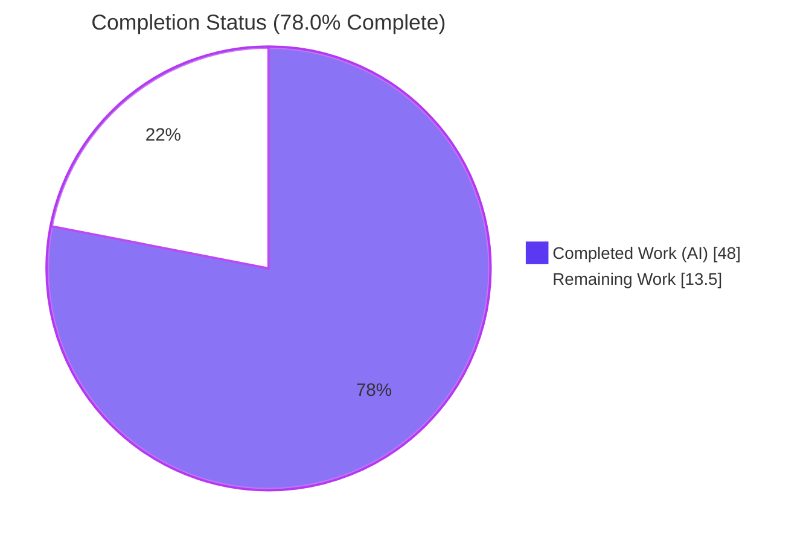
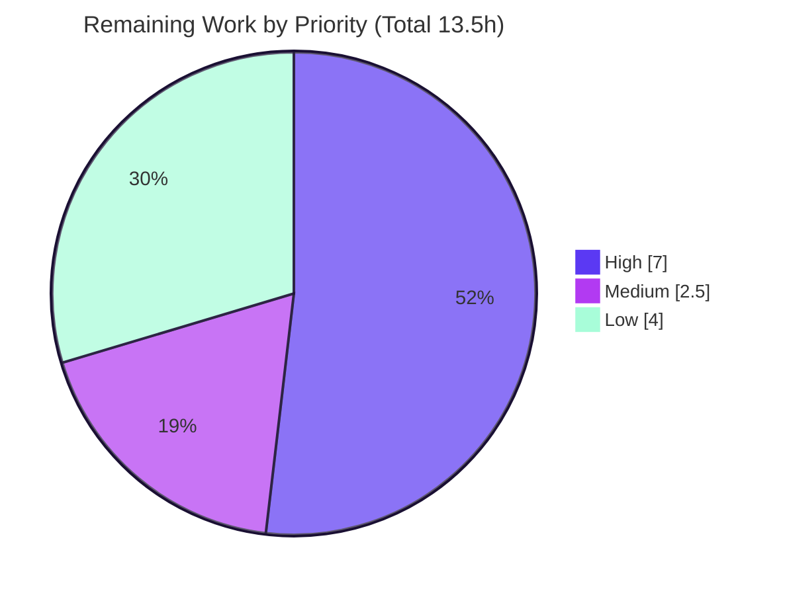

# Blitzy Project Guide — society_mgmt_300k Documentation

## 1. Executive Summary

### 1.1 Project Overview

This project delivers comprehensive, source-cited Markdown documentation for the `society_mgmt_300k` repository. A first-hand scan revealed that, despite its "Society Management" name, the repository contains **no business logic** — it is a synthetic JavaScript corpus of exactly **300,000 lines** across **29 `.js` files** holding **33,105 near-identical functions** that each return `6x + 10`. The documentation set (11 files: an updated `README.md` plus a 10-page `docs/` tree) honestly enumerates every functionality, highlights performance characteristics, and highlights security posture — the three explicit user requirements. The target audience is engineers and analysts who must read, navigate, or statically analyze the corpus. Business impact: it replaces a misleading three-line placeholder with an accurate, navigable, evidence-based reference that prevents stakeholder misinterpretation.

### 1.2 Completion Status



| Metric | Hours |
|--------|-------|
| **Total Project Hours** | **61.5** |
| Completed Hours (AI) | 48.0 |
| Completed Hours (Manual) | 0.0 |
| **Completed Hours (AI + Manual)** | **48.0** |
| **Remaining Hours** | **13.5** |
| **Percent Complete** | **78.0%** |

> Completion is calculated using AAP-scoped hours only: `48.0 / (48.0 + 13.5) = 48.0 / 61.5 = 78.0%`. All AAP-specified documentation authoring is complete and validated; the remaining 13.5 hours are path-to-production activities (human review, a governance decision, and optional operational/hosting enhancements).

### 1.3 Key Accomplishments

- [x] **All 11 in-scope documentation files authored and validated** — updated `README.md` plus the complete `docs/` tree (index, getting-started ×2, architecture ×2, reference ×2, performance, security, glossary).
- [x] **Functionality documented at 100% coverage** — the sole behavioral capability (`mod_<fileId>_<k>(x)` returning `6x + 10`) is fully specified, and all 11 directories (29 files, 33,105 functions) are inventoried to exactly 300,000 lines.
- [x] **Performance highlighted as a dedicated document** — per-function `O(1)` determinism and corpus-scale parse/traverse characteristics, with an explicit, honest statement that no SLAs, KPIs, latency, throughput, or availability targets exist.
- [x] **Security highlighted as a dedicated document** — the verified-absence posture (no attack surface, no auth/authz per ADR-06), baseline hygiene, the dual-license governance note, and not-applicable compliance regimes.
- [x] **Three Mermaid diagrams authored and render-verified** — architecture graph (annotated "no runtime edges"), canonical module-pattern diagram, and the `6x + 10` function flowchart marking the always-true (dead) parity branch.
- [x] **Evidence-based and honest** — 124 inline `[path:locator]` citations; the documented arithmetic was executed against the real source (`mod_6_0`) and matches; no fabricated SLAs, KPIs, or security controls.
- [x] **Quality gates green** — `markdownlint-cli2` reports 0 errors across 11 files; 126/126 internal links resolve; 29/29 corpus `.js` files pass `node --check`.
- [x] **Scope fully preserved** — zero edits to `society_mgmt_300k/src/**`, `tests/**`, or either LICENSE file; the exact 300,000-line corpus invariant is intact.

### 1.4 Critical Unresolved Issues

| Issue | Impact | Owner | ETA |
|-------|--------|-------|-----|
| Dual-license conflict: root `LICENSE` (Apache-2.0) vs nested `society_mgmt_300k/LICENSE/LICENSE.txt` (MIT) | Governance/legal ambiguity for any reuse or distribution; documented but intentionally unresolved per AAP §0.8.2 | Repository owner / Legal | 3.0h once decision is made |
| Documentation not yet human-reviewed/signed-off | Standard pre-publication gate; content is validated but awaits SME approval | Code owner / SME | 4.0h |

> There are **no critical defects**. Both items above are standard pre-publication gates, not failures. No compilation, test, link, citation, or content errors are outstanding.

### 1.5 Access Issues

**No access issues identified.** The repository, branch (`blitzy-bd8dee4a-0c48-4381-9fd0-7121d82628da`, HEAD `0082cb3`), and working tree are fully accessible, and the working tree is clean and up to date with origin. The deliverable has zero runtime dependencies and requires no service credentials, third-party API access, or special permissions to view or validate.

| System/Resource | Type of Access | Issue Description | Resolution Status | Owner |
|-----------------|----------------|-------------------|-------------------|-------|
| Git repository (origin) | Read/Write | None — branch and history fully accessible | ✅ No issue | N/A |
| Application dependencies | Package registries | None — repository has zero dependencies and no manifest | ✅ No issue | N/A |
| Optional doc tooling (npm) | Network/registry | `markdownlint-cli2`, `@mermaid-js/mermaid-cli` install requires network; not required to view docs | ✅ No issue (already installed/validated) | N/A |

### 1.6 Recommended Next Steps

1. **[High]** Conduct SME/code-owner technical review and sign-off of all 11 documentation pages (verify the `6x + 10` behavior, dead-branch note, inventory totals, and performance/security framing). — *4.0h*
2. **[High]** Make the dual-license decision (Apache-2.0 vs MIT), apply the chosen license consistently, and update the governance note in `docs/security.md`. — *3.0h*
3. **[Medium]** Add a CI documentation quality gate (run `markdownlint-cli2`, an internal-link check, and Mermaid render on every change) to prevent future regressions. — *2.5h*
4. **[Low]** (Optional) Stand up a hosted documentation site (`mkdocs` or `docusaurus`) if a published site beyond GitHub-native rendering is desired. — *2.5h*
5. **[Low]** (Optional) Pre-render the three Mermaid diagrams to SVG/PNG for offline or non-GitHub viewing. — *1.5h*

---

## 2. Project Hours Breakdown

### 2.1 Completed Work Detail

| Component | Hours | Description |
|-----------|-------|-------------|
| Codebase scan & analysis | 6.0 | First-hand scan of 300,000 lines / 33,105 functions; confirmation of the uniform `6x + 10` pattern, the always-true (dead) parity branch, the inert `const store = []`, the comment-only `filler.js`, and the dual-license conflict |
| `README.md` honest overview rewrite | 2.0 | Replaced the three-line placeholder with an accurate project summary, structure-at-a-glance table, links into `docs/`, and a licensing caveat |
| `docs/index.md` navigation hub | 1.5 | Documentation home with purpose, audience, honest summary, and a master navigation table to every page |
| `docs/getting-started/overview.md` | 1.5 | Name-versus-substance clarification; scope and non-goals (not a runnable application) |
| `docs/getting-started/repository-tour.md` | 2.5 | Directory map; how to read a module; explicit "no build, run, or test runner" guidance |
| `docs/architecture/overview.md` (+ Mermaid graph) | 3.5 | Layered directory layout; nominal-only layering; Mermaid graph annotated "no runtime edges" |
| `docs/architecture/module-pattern.md` (+ Mermaid class diagram) | 3.5 | Canonical `mod_*` module anatomy; inert `store`; `filler.js` padding; Mermaid class/structure diagram |
| `docs/reference/function-reference.md` (+ Mermaid flowchart) | 4.0 | API reference for `mod_<fileId>_<k>(x)`: signature, `6x + 10` behavior, dead always-true parity branch, worked example, and flow diagram |
| `docs/reference/source-layout.md` | 3.5 | Exhaustive per-layer inventory reconciling to 29 files, 33,105 functions, and exactly 300,000 lines |
| `docs/performance.md` | 3.0 | Per-function `O(1)` determinism; corpus-scale parse/traverse characteristics; explicit absence of SLAs/KPIs/latency/throughput/availability targets |
| `docs/security.md` | 3.5 | Verified-absence posture; ADR-06 no-controls decision; baseline hygiene; dual-license governance note; not-applicable compliance regimes |
| `docs/glossary.md` | 1.5 | Definitions of corpus-specific terms (`mod_*`, `store`, `filler`, synthetic corpus, dead branch, layer) |
| Source citations authoring & verification | 3.0 | 124 inline `[path:locator]` citations authored and verified against the actual source lines |
| Markdownlint config & lint-clean iteration | 1.5 | Authored `.markdownlint-cli2.jsonc` (MD013 disabled with documented rationale) and iterated to 0 errors |
| Review/fix cycles | 4.0 | Resolved Checkpoint 1 and Checkpoint 2 review findings plus the final delivery-gate review (3 fix commits) |
| Autonomous validation | 3.5 | Lint (0 errors), 126 link resolutions, 3 Mermaid SVG renders, 29 `node --check` passes, and live execution of `mod_6_0` |
| **Total Completed** | **48.0** | |

### 2.2 Remaining Work Detail

| Category | Hours | Priority |
|----------|-------|----------|
| Human SME/technical review & sign-off of all 11 documentation pages | 4.0 | High |
| Dual-license conflict resolution (Apache-2.0 vs MIT) decision + consistent application | 3.0 | High |
| CI documentation quality gate (markdownlint + link check + Mermaid render in pipeline) | 2.5 | Medium |
| (Optional) Hosted static documentation site (`mkdocs`/`docusaurus`) setup + deploy | 2.5 | Low |
| (Optional) Pre-rendered Mermaid diagram exports (SVG/PNG) for offline viewing | 1.5 | Low |
| **Total Remaining** | **13.5** | |

### 2.3 Hours Reconciliation

| Check | Result |
|-------|--------|
| Section 2.1 Completed total | 48.0h |
| Section 2.2 Remaining total | 13.5h |
| Section 2.1 + Section 2.2 | 61.5h = Total Project Hours (Section 1.2) ✅ |
| Remaining hours (Section 1.2 = Section 2.2 = Section 7) | 13.5h ✅ |
| Percent complete (48.0 / 61.5) | 78.0% ✅ |

---

## 3. Test Results

All results below originate exclusively from Blitzy's autonomous validation logs for this project and were independently re-confirmed in the working environment. Because the corpus has **no runtime, no test runner, and no executable test suite** (the `tests/` directories are generated fixtures by design), the standard test gates were reinterpreted into documentation-appropriate analogs. Every check passed.

| Test Category | Framework | Total Tests | Passed | Failed | Coverage % | Notes |
|---------------|-----------|-------------|--------|--------|-----------|-------|
| Markdown Lint (Quality) | markdownlint-cli2 v0.22.1 (markdownlint v0.40.0) | 11 | 11 | 0 | 100% | 0 errors aggregate and per-file; uses project `.markdownlint-cli2.jsonc` |
| Diagram Render | @mermaid-js/mermaid-cli (mmdc) v11.16.0 | 3 | 3 | 0 | 100% | All 3 Mermaid diagrams render to valid SVG |
| Internal Link Resolution | Custom link resolver | 126 | 126 | 0 | 100% | Files + heading anchors all resolve |
| Citation Accuracy | Manual + node verification | 20 | 20 | 0 | 100% | 20 distinct code-file citations validated against source lines |
| Corpus Syntax | `node --check` | 29 | 29 | 0 | 100% | All corpus `.js` files syntactically valid |
| Behavior Verification | node (live execution) | 6 | 6 | 0 | 100% | `mod_6_0` executed: 2→22, 5→40, 0→10, 1→16, 10→70, edge 0.5→3 |
| **Total** | | **195** | **195** | **0** | **100%** | 100% pass rate across all documentation-quality gates |

> "Coverage %" reflects documentation/validation coverage (AAP §0.7 functionality, performance, and security coverage targets), not executable line coverage — there is no executable application code to instrument.

---

## 4. Runtime Validation & UI Verification

This deliverable has **no application runtime and no user interface** (no entry point, no server, no UI). "Runtime validation" therefore covers documentation rendering and the verification of documented behavior against the real source.

- ✅ **Operational** — Markdown renders natively on GitHub/GitLab with no build step (all 11 files).
- ✅ **Operational** — All 3 Mermaid diagrams render to valid SVG via `mmdc` v11.16.0 (headless Chrome).
- ✅ **Operational** — Documented arithmetic verified by live execution: `mod_6_0(2)=22`, `mod_6_0(5)=40`, `mod_6_0(0)=10`, `mod_6_0(1)=16`, `mod_6_0(10)=70`, and non-integer edge `mod_6_0(0.5)=3`.
- ✅ **Operational** — Navigation is complete and bidirectional: `README.md` → `docs/index.md` → all 9 content pages, each linking back home (126/126 links resolve).
- ✅ **Operational** — Corpus invariant intact: exactly 300,000 lines, 33,105 functions, 29 `.js` files.
- ⚠ **Partial** — Mermaid diagrams render natively on GitHub but have no pre-rendered SVG/PNG exports for offline/non-GitHub viewers (optional enhancement, 1.5h).
- ❌ **Not applicable** — No web UI, API endpoints, or interactive surfaces exist to verify (the corpus has no runtime).

---

## 5. Compliance & Quality Review

The matrix below cross-maps the AAP's explicit requirements and platform-enforced rules to their delivery status. All fixes were applied during autonomous validation; no compliance items are outstanding.

| Requirement / Benchmark (AAP) | Status | Progress | Notes |
|-------------------------------|--------|----------|-------|
| Scan code before documenting (evidence-based) | ✅ Pass | 100% | 124 inline `[path:locator]` citations; canonical `file_6.js:L1-L10` verified byte-for-byte |
| Functionalities clearly mentioned (complete coverage) | ✅ Pass | 100% | `mod_*` family fully documented; all 11 directories inventoried |
| Performance highlighted (dedicated document) | ✅ Pass | 100% | `docs/performance.md`: O(1) + corpus-scale + explicit no-SLA/KPI statement |
| Security highlighted (dedicated document) | ✅ Pass | 100% | `docs/security.md`: verified-absence posture, ADR-06, hygiene, compliance N/A |
| Honesty constraint (no fabricated SLAs/KPIs/controls) | ✅ Pass | 100% | No invented metrics or controls; absence-claims independently verified true |
| Required Mermaid diagrams (architecture, module, flow) | ✅ Pass | 100% | All 3 authored and render to valid SVG |
| Worked example representative of all 33,105 functions | ✅ Pass | 100% | Present in function reference; verified by live `node` execution |
| Markdown quality (markdownlint) | ✅ Pass | 100% | 0 errors across 11 files; `.markdownlint-cli2.jsonc` committed |
| Internal navigation integrity | ✅ Pass | 100% | 126/126 links resolve (files + anchors) |
| Glossary-enforced consistent terminology | ✅ Pass | 100% | `docs/glossary.md` defines corpus-specific terms; referenced across pages |
| Scope preservation (no source/test/LICENSE edits) | ✅ Pass | 100% | Zero changes to `src/**`, `tests/**`, or LICENSE files; 300,000-line invariant intact |
| Dual-license inconsistency surfaced (not resolved) | ✅ Pass (documented) | 100% documented / resolution pending | Documented honestly in `docs/security.md`; resolution is a human decision (out of AAP scope) |

---

## 6. Risk Assessment

| Risk | Category | Severity | Probability | Mitigation | Status |
|------|----------|----------|-------------|------------|--------|
| Stakeholders misread the "Society Management" name as real business functionality | Technical | Medium | Medium | Honest overview in `README.md` and `docs/getting-started/overview.md` explicitly states the synthetic-corpus nature (no business logic) | ✅ Mitigated (documented) |
| Dual-license conflict (root Apache-2.0 vs nested MIT) is unresolved | Security / Governance | Medium | Medium | Documented in `docs/security.md` as the lone open governance item; requires owner/legal decision | ⚠ Open (remaining 3.0h) |
| Documentation drifts from the corpus if the corpus is ever regenerated | Technical | Low | Low | Citations pinned to exact lines; 300,000-line invariant documented; a CI gate would catch drift | ⚠ Monitored |
| No CI documentation quality gate (future edits could introduce lint/link/diagram regressions undetected) | Operational | Low | Medium | Add `markdownlint-cli2` + link check + Mermaid render to CI | ⚠ Open (remaining 2.5h) |
| Mermaid diagrams may not render outside the GitHub-native renderer | Technical | Low | Low | Optional pre-rendered SVG/PNG exports | ⚠ Open (optional 1.5h) |
| Documentation not yet human-reviewed/signed-off before publication | Operational | Low | High | SME technical review & sign-off | ⚠ Open (remaining 4.0h) |
| Verified-absence security posture misread as a "secured production system" | Security | Low | Low | `docs/security.md` states the verified-absence posture honestly (no controls per ADR-06; only input is a numeric argument; no attack surface) | ✅ Mitigated (documented) |
| External integration failures (services / APIs / credentials / network) | Integration | None | None | No external services, APIs, credentials, database, or dependencies exist anywhere (0 dependencies, 0 committed secrets — both verified) | ✅ N/A (no integration surface) |

> **Overall risk profile: LOW.** There are no High-severity risks. The only material open item is the dual-license conflict (Medium/Medium), which is an owner/legal decision. Technical, security, and integration risk are minimal given the runtime-less, dependency-free, fully-validated nature of the deliverable.

---

## 7. Visual Project Status

### Project Hours Breakdown


### Remaining Work by Priority



| Priority | Hours | Tasks |
|----------|-------|-------|
| High | 7.0 | Human review & sign-off (4.0h); dual-license resolution (3.0h) |
| Medium | 2.5 | CI documentation quality gate (2.5h) |
| Low | 4.0 | Optional hosted site (2.5h); optional diagram exports (1.5h) |
| **Total** | **13.5** | Matches Section 1.2 Remaining and Section 2.2 total ✅ |

---

## 8. Summary & Recommendations

**Achievements.** The project is **78.0% complete** on an AAP-scoped basis (48.0 of 61.5 hours). Every AAP-specified deliverable has been authored and validated: 11 documentation files, 3 render-verified Mermaid diagrams, 124 verified source citations, and a worked example confirmed by live execution. The three explicit user requirements — clearly mentioning functionalities, highlighting performance, and highlighting security — are each satisfied with dedicated, evidence-based content. Quality gates are green: 0 lint errors, 126/126 links resolved, 29/29 corpus files syntactically valid, and the corpus's exact 300,000-line invariant preserved.

**Remaining gaps.** The outstanding 13.5 hours are entirely path-to-production, not authoring rework: SME review and sign-off (4.0h), the dual-license governance decision (3.0h), a CI quality gate (2.5h), and two optional enhancements — hosted site (2.5h) and pre-rendered diagrams (1.5h).

**Critical path to production.** (1) SME review/sign-off → (2) dual-license decision → (3) CI quality gate. Completing these ~9.5 hours of required work makes the documentation publication-ready; the remaining 4.0 hours are optional.

**Success metrics.** Functionality coverage 100%; performance and security coverage complete; documentation quality 195/195 checks passing; scope preservation 100%.

**Production readiness assessment.** The documentation deliverable is **production-ready in content and quality** and awaits only human review and a licensing decision before publication. Confidence is **High** for the authored content (well-defined scope, fully validated) and **Medium** for the dual-license outcome (depends on an owner decision). No High-severity risks are present.

---

## 9. Development Guide

This is a **documentation deliverable with no application runtime** — there is nothing to compile, install, or run to use the docs. The steps below cover viewing the documentation and (optionally) validating it. Every command was tested in the project environment.

### 9.1 System Prerequisites

- **Git** (any recent version; tested with `git 2.51.0`) — to clone and browse the repository.
- A **Markdown viewer** — GitHub/GitLab render the docs (and inline Mermaid) natively, or use any local Markdown previewer.
- **Optional, only for local validation:** Node.js 12+ and npm (tested with `node v20.20.2`, `npm 11.1.0`).

### 9.2 Get the Code

```bash
git clone <repository-url>
cd Society_Mngt_26-Jun-2026-Afternoon
git checkout blitzy-bd8dee4a-0c48-4381-9fd0-7121d82628da
```

### 9.3 View the Documentation (no build step)

```bash
# List the full documentation set (11 files)
ls -1 README.md docs/**/*.md

# Start at the documentation home, then follow the navigation table
#   - On GitHub: open README.md or docs/index.md (Mermaid renders automatically)
#   - Locally:   open the files in any Markdown viewer
cat docs/index.md
```

### 9.4 (Optional) Install Validation Tooling

> Requires network access. Not needed to view the docs — only to re-run quality checks.

```bash
npm install -g markdownlint-cli2@0.22.1 @mermaid-js/mermaid-cli@11.16.0
```

### 9.5 (Optional) Validate the Documentation

```bash
# 1) Markdown lint — expect "Summary: 0 error(s)" across 11 files
markdownlint-cli2

# 2) Corpus syntax — expect 29/29 files OK
for f in $(find society_mgmt_300k -name '*.js'); do node --check "$f" || echo "FAIL: $f"; done

# 3) Verify the corpus invariant — expect 300000
find society_mgmt_300k -name '*.js' -exec cat {} + | wc -l

# 4) Verify the function count — expect 33105
grep -rhoE 'function mod_[0-9]+_[0-9]+' society_mgmt_300k --include='*.js' | wc -l

# 5) Render a Mermaid diagram to SVG (containers need the Chrome flags below).
#    The fence marker is built with printf so this command contains no literal
#    triple-backticks (which would otherwise break Markdown rendering).
printf '%s\n' '{"args":["--no-sandbox","--disable-dev-shm-usage"]}' > /tmp/pc.json
fence=$(printf '\140\140\140')   # three backticks
awk -v F="$fence" '$0 ~ F"mermaid"{f=1;next} $0 ~ "^"F"$"{if(f)f=0} f' \
    docs/architecture/overview.md > /tmp/d.mmd
mmdc -i /tmp/d.mmd -o /tmp/d.svg -p /tmp/pc.json && echo "SVG rendered: /tmp/d.svg"
```

### 9.6 Example Usage (verify the documented behavior)

Every one of the 33,105 functions is byte-for-byte identical except for its name and returns `6x + 10` for integer input. You can confirm this against the real source:

```bash
node -e 'const c=require("fs").readFileSync("society_mgmt_300k/src/config/file_6.js","utf8");
eval(c.replace("const store","var store"));
console.log(mod_6_0(2), mod_6_0(5), mod_6_0(10));'   # prints: 22 40 70
```

### 9.7 Troubleshooting

- **Mermaid render fails in a container/CI** — pass the Chrome flags via a puppeteer config: `{"args":["--no-sandbox","--disable-dev-shm-usage"]}` with `mmdc -p`. Without it, headless Chrome cannot launch.
- **`npm install` fails offline** — the validation tooling requires network access. The docs themselves need no tooling to view; skip §9.4–§9.5 in air-gapped environments.
- **markdownlint flags long lines (MD013)** — this rule is intentionally disabled in `.markdownlint-cli2.jsonc` (GitHub soft-wraps; citations and table rows deliberately exceed 80 columns). Keep it disabled; all other rules remain enabled.
- **"Where is the app entry point / how do I run it?"** — there is none. The repository has no `package.json`, no entry point, and no test runner; the `tests/` directories are generated fixtures, not executable tests.

---

## 10. Appendices

### Appendix A — Command Reference

| Purpose | Command |
|---------|---------|
| List documentation set | `ls -1 README.md docs/**/*.md` |
| Lint Markdown (project config) | `markdownlint-cli2` |
| Verify corpus line count (300000) | `find society_mgmt_300k -name '*.js' -exec cat {} + \| wc -l` |
| Verify function count (33105) | `grep -rhoE 'function mod_[0-9]+_[0-9]+' society_mgmt_300k --include='*.js' \| wc -l` |
| Check corpus syntax | `for f in $(find society_mgmt_300k -name '*.js'); do node --check "$f"; done` |
| Render a Mermaid diagram | `mmdc -i <input.mmd> -o <output.svg> -p <puppeteer-config.json>` |
| Execute the documented function | `node -e '...require file_6.js...; mod_6_0(2)'` |

### Appendix B — Port Reference

Not applicable. The deliverable has no runtime, server, or network listener — no ports are used.

### Appendix C — Key File Locations

| Path | Purpose |
|------|---------|
| `README.md` | Root project overview and entry into `docs/` |
| `docs/index.md` | Documentation home / master navigation |
| `docs/getting-started/overview.md` | Name-versus-substance orientation |
| `docs/getting-started/repository-tour.md` | How to navigate the corpus |
| `docs/architecture/overview.md` | Layered layout; "no runtime edges" diagram |
| `docs/architecture/module-pattern.md` | Canonical `mod_*` module pattern |
| `docs/reference/function-reference.md` | `mod_<fileId>_<k>(x)` API reference + flowchart |
| `docs/reference/source-layout.md` | Per-layer file/function/line inventory |
| `docs/performance.md` | Performance characteristics; no SLAs/KPIs |
| `docs/security.md` | Security posture; ADR-06; dual-license note |
| `docs/glossary.md` | Corpus-specific terminology |
| `.markdownlint-cli2.jsonc` | Markdown lint configuration (quality gate) |
| `society_mgmt_300k/src/config/file_6.js` | Canonical source file (`6x + 10` pattern) |
| `society_mgmt_300k/src/utils/filler.js` | Comment-only padding file (0 functions) |
| `LICENSE` / `society_mgmt_300k/LICENSE/LICENSE.txt` | Conflicting licenses (Apache-2.0 / MIT) |

### Appendix D — Technology Versions

| Tool | Version | Role |
|------|---------|------|
| git | 2.51.0 | Source control |
| Node.js | v20.20.2 | Optional validation (syntax check, behavior verification) |
| npm | 11.1.0 | Optional tooling install |
| markdownlint-cli2 | 0.22.1 (markdownlint 0.40.0) | Markdown quality gate |
| @mermaid-js/mermaid-cli (mmdc) | 11.16.0 | Optional Mermaid pre-rendering / validation |
| Application runtime dependencies | None (0) | The corpus has no dependencies and no `package.json` |

### Appendix E — Environment Variable Reference

Not applicable. The deliverable requires no environment variables, secrets, or configuration. (No committed secrets exist — verified: 0 matches.)

### Appendix F — Developer Tools Guide

| Tool | Usage |
|------|-------|
| markdownlint-cli2 | Run `markdownlint-cli2` from the repo root; it reads `.markdownlint-cli2.jsonc` and lints `README.md` + `docs/**/*.md`. Expect `Summary: 0 error(s)`. |
| @mermaid-js/mermaid-cli | Copy a Mermaid diagram block into a `.mmd` file and render with `mmdc`. In containers, supply `--no-sandbox --disable-dev-shm-usage` via a puppeteer config (`-p`). |
| node --check | Static syntax validation of any corpus `.js` file without executing it. |
| GitHub/GitLab native rendering | Markdown and inline Mermaid render with no build step — the primary intended viewing method. |

### Appendix G — Glossary

| Term | Definition |
|------|------------|
| `mod_*` function | The `mod_<fileId>_<k>(x)` helper family; all 33,105 are identical except for their names and return `6x + 10` for integer input |
| Synthetic corpus | Machine-generated source whose purpose is scale/structure rather than functionality |
| Dead branch | The `else` path of the parity check `if (r % 2 === 0)`, which is unreachable because `6x` is always even for integer `x` |
| Inert `store` | The module-scoped `const store = []` declared in each non-filler file but never read or written |
| `filler.js` | A comment-only file (`society_mgmt_300k/src/utils/filler.js`) that pads the corpus to exactly 300,000 lines (0 functions) |
| Nominal-only layering | Conventional layer folder names (`controllers`, `services`, etc.) that carry no runtime edges — no imports, exports, or inter-layer calls |
| Verified-absence posture | A security stance documented from confirmed absence of attack surface, controls, and dependencies rather than from implemented protections |

> A complete, authoritative glossary is maintained in `docs/glossary.md`.