# Technical Specification

# 1. Introduction

## 1.1 Executive Summary

The repository documented in this Technical Specification is published under the banner name **`Society_Mngt_26-Jun-2026-Afternoon`** and organizes all implementation assets inside a single project directory, **`society_mgmt_300k`**. The root `README.md` contains only this title (36 bytes total) and provides no description, dependency list, build instructions, or runtime guidance.

**Project overview.** The `society_mgmt_300k` project is laid out as a conventional layered JavaScript application: its `src/` tree is divided into nine architecture-oriented namespaces (`controllers`, `services`, `models`, `routes`, `domain`, `repositories`, `middleware`, `config`, and `utils`), and its `tests/` tree is split into `unit/` and `integration/`. Despite this familiar shape, direct inspection of every file shows that the codebase is a **synthetic, generated source corpus**: each module consists only of a bank of uniform, deterministic arithmetic helper functions plus one unused module-scoped `const store = []` binding. There is no inter-module wiring, no web or runtime framework, no persistence layer, and no external dependency. In aggregate the corpus totals **exactly 300,000 lines of JavaScript** — a figure mirrored in the `300k` suffix of the project directory name.

**Core business problem (nominal).** The repository name and the per-file header comment `// mod_N - society module` indicate an *intended* problem domain of housing-society / community management. However, no functionality belonging to that domain is implemented anywhere in the code — there are no members, tenants, billing, maintenance, complaints, or any other society-management concepts present. The intended business problem is therefore nominal only; the delivered artifact is a structural code corpus rather than an operational society-management system.

**Key stakeholders and users.** Because the repository defines no user interface, authentication, roles, or API surface, no application end-user personas can be derived from the code. The observable consumers of the repository in its current form are engineering and tooling audiences that work with source structure — for example parsing, static-analysis, symbol-indexing, and code-graph pipelines — for which the regular, import-free module layout is well suited.

**Expected business impact and value proposition.** As implemented, the repository exposes no runnable behavior, so no operational or financial business impact can be evidenced from the code. Its demonstrable value lies in being a large, deterministic, and precisely sized (300,000-line) JavaScript corpus with a clean, predictable directory taxonomy — an asset for exercising documentation, traversal, and analysis workflows rather than for delivering community-management features.

The table below summarizes the repository's objectively verifiable characteristics as observed during inspection.

| Attribute | Observed Value |
|---|---|
| Repository banner name | `Society_Mngt_26-Jun-2026-Afternoon` (from `README.md`) |
| Primary project directory | `society_mgmt_300k/` |
| Implementation language | JavaScript (29 `.js` files) |
| Total source size | Exactly 300,000 lines |
| Module files | 28 (`mod_0`–`mod_27`) plus 1 comment-only filler file |
| Function definitions | 33,105, all uniform arithmetic stubs |
| Inter-module wiring / dependencies | None observed (no `require`, `import`, `export`, or `module.exports`) |
| Licensing | Root: Apache-2.0 (`LICENSE`); subproject: MIT (`society_mgmt_300k/LICENSE/LICENSE.txt`) |

## 1.2 System Overview

This overview describes the repository as it actually exists, distinguishing the *nominal* intent implied by its naming from the *as-implemented* reality established through direct file inspection. All statements below are grounded in observed files; where an expected element is absent, that absence is stated explicitly rather than assumed to exist.

### 1.2.1 Project Context

**Business context and market positioning.** The repository's naming — `Society_Mngt_26-Jun-2026-Afternoon` at the root and `society_mgmt_300k` for the project — together with the header comment `// mod_N - society module` on every module places the artifact, by intent, in the housing-society / community-management space. No market-facing collateral, product description, requirements document, or domain specification accompanies this intent; the root `README.md` carries the title alone. Consequently, the repository is best characterized as a synthetic source corpus that *borrows* the society-management label rather than a product positioned within that market.

**Current system limitations.** There is no evidence in the repository that it replaces or upgrades a prior system (no migration scripts, changelogs, versioned APIs, or legacy adapters are present). The relevant "limitations" are therefore the gaps of the current artifact itself relative to its nominal domain:

| Current-State Gap | Observation |
|---|---|
| No domain functionality | Zero society-management concepts (members, tenants, billing, maintenance, notices, etc.) appear in any file |
| No executable application | No entry point, HTTP server, framework, or `module.exports`/`require` wiring exists |
| No persistence | The only data structure is an unused `const store = []` per module; no database or storage layer |
| No configuration/runtime inputs | No `package.json`, config files, `.env`, or `process.env` usage |

**Integration with the existing enterprise landscape.** The repository defines no integration surface. Inspection found no network calls (`fetch`/`http`), no environment-driven connection settings, no message brokers, and no third-party SDKs. Each `.js` file is fully self-contained, importing nothing and exporting nothing, so the project neither depends on nor exposes interfaces to any external enterprise system.

### 1.2.2 High-Level Description

**Primary system capabilities.** The only capability present across the corpus is the evaluation of uniform, deterministic arithmetic helper functions. Every function accepts a single numeric parameter `x`, accumulates `x·1 + x·2 + x·3` into a local variable, and adds a fixed bonus of `10` when the intermediate sum is even, before returning the result. The canonical shape — identical across all 33,105 functions — is:

```javascript
function mod_0_0(x){ let r=0; r+=x*1; r+=x*2; r+=x*3; if(r%2===0){r+=10} return r; }
```

These helpers are pure and side-effect-free: no I/O, no shared-state mutation, no asynchronous control flow, and no external interaction.

**Major system components.** The `src/` tree is partitioned into nine conventionally named namespaces, and `tests/` into two. The names imply a classic layered architecture, but each folder contains only `mod_*` stub modules of the shape shown above. The following diagram depicts the repository's structural composition.

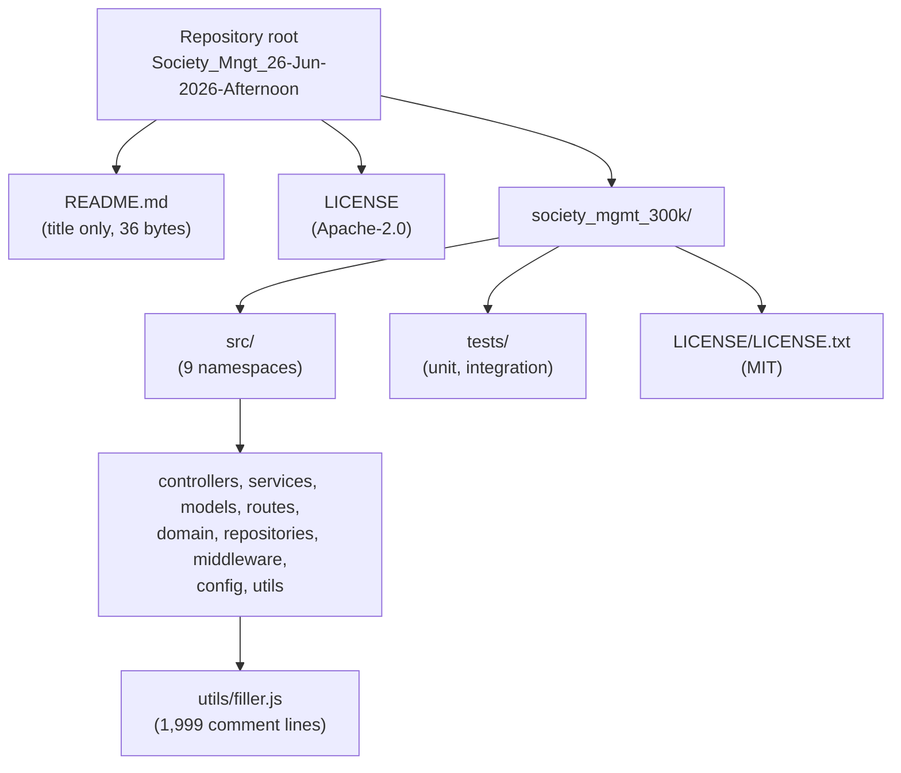

The composition of each source namespace is summarized below (file counts observed on disk).

| Namespace (`src/…`) | Files | Observed Content |
|---|---|---|
| `controllers/` | 3 | `mod_*` arithmetic stubs; no request handling |
| `services/` | 3 | `mod_*` arithmetic stubs; no business logic |
| `models/` | 3 | `mod_*` arithmetic stubs; no data schema |
| `routes/` | 3 | `mod_*` arithmetic stubs; no route registration |
| `domain/` | 2 | `mod_*` arithmetic stubs; no domain entities |
| `repositories/` | 2 | `mod_*` arithmetic stubs; no persistence access |
| `middleware/` | 3 | `mod_*` arithmetic stubs (incl. the 6,347-line `file_27.js`) |
| `config/` | 2 | `mod_*` arithmetic stubs; no configuration values |
| `utils/` | 4 | 3 `mod_*` stub files plus `filler.js` (comment-only) |

The `tests/` tree mirrors this pattern: `tests/unit/` (2 files) and `tests/integration/` (2 files) contain the same `mod_*` stub modules and include no assertion framework, test runner, mocks, or `import` statements — they are static fixtures rather than an executable test suite.

**Core technical approach.** The implementation approach is characterized by:

- **Plain, top-level function declarations** with no ES module or CommonJS boundaries (no `import`/`export`/`require`/`module.exports` anywhere in the corpus).
- **A single repeated template** applied uniformly: a `// mod_N - society module` header, an unused `const store = []`, and a sequence of `mod_N_M(x)` arithmetic helpers.
- **Deterministic, dependency-free code** with no framework, no persistence, no configuration, and no runtime I/O.
- **Deliberate size engineering**: 27 modules are exactly 10,802 lines (1,200 functions each) and `middleware/file_27.js` is 6,347 lines (705 functions); `utils/filler.js` then supplies 1,999 comment-only lines (labeled `// filler 298001` through `// filler 299999`) that pad the corpus to a round **300,000** lines.

### 1.2.3 Success Criteria

The repository contains no requirements document, acceptance criteria, service-level objectives, or metrics definitions. Consequently, no business-defined measurable objectives, critical success factors, or KPIs can be sourced from it, and none are invented here. What *can* be verified objectively are the structural properties of the corpus itself, which serve as the only evidence-based analog to "success criteria" for this artifact.

| Verifiable Property | Observed Measurement |
|---|---|
| Total corpus size | Exactly 300,000 lines of JavaScript |
| Structural regularity | 28 `mod_*` modules following one identical template |
| Function uniformity | 33,105 functions, all behaviorally identical arithmetic stubs |
| Dependency isolation | 0 imports/exports/requires; every file self-contained |
| Licensing declared | Apache-2.0 (root) and MIT (subproject) both present |

Because the repository is not a runnable application, conventional KPIs such as availability, latency, throughput, or user-adoption metrics are not defined and cannot be measured against the current code.

## 1.3 Scope

This section bounds what the repository — and therefore this Technical Specification — actually covers. Scope is defined against observed evidence: in-scope items are those present in the codebase, while out-of-scope items are those a housing-society management system would normally include but which are demonstrably absent here.

### 1.3.1 In-Scope Elements

**Core features and functionalities (as present).** The must-have, and in fact only, capability delivered by the repository is a large, uniform library of deterministic arithmetic helper functions organized into an application-style directory taxonomy.

| In-Scope Element | Evidence / Location |
|---|---|
| Synthetic JavaScript corpus (300,000 lines, 29 `.js` files) | `society_mgmt_300k/src/`, `society_mgmt_300k/tests/` |
| Layered directory taxonomy (9 source namespaces) | `society_mgmt_300k/src/{controllers,services,models,routes,domain,repositories,middleware,config,utils}/` |
| Uniform module anatomy (header comment, unused `store`, `mod_N_M` stubs) | e.g. `society_mgmt_300k/src/controllers/file_0.js` |
| Deterministic arithmetic helpers returning `x·1 + x·2 + x·3 (+10 if even)` | All 28 `mod_*` modules |
| Comment-only line-padding mechanism | `society_mgmt_300k/src/utils/filler.js` |
| Static test fixtures (unit and integration) | `society_mgmt_300k/tests/unit/`, `society_mgmt_300k/tests/integration/` |
| Licensing artifacts | `LICENSE` (Apache-2.0), `society_mgmt_300k/LICENSE/LICENSE.txt` (MIT) |

**Primary user workflows.** No end-user workflows exist, because there is no interface or executable application. The only "workflow" the code supports is programmatic invocation of an individual `mod_N_M(x)` helper by a host that has loaded the module; there is no orchestration connecting modules to one another.

**Essential integrations.** None. Every module is self-contained with zero imports/exports; there are no runtime integrations to include in scope.

**Key technical requirements (as observed).** The corpus requires only a standard JavaScript parser or runtime capable of loading top-level function declarations. There are no build steps, package manifests, environment variables, or third-party libraries required to read or statically analyze the files.

**Implementation boundaries.**

| Boundary Dimension | In-Scope Definition (from evidence) |
|---|---|
| System boundary | A single self-contained project directory (`society_mgmt_300k/`); no external processes or services |
| User groups covered | None as application users; the practical audience is source/tooling consumers |
| Geographic / market coverage | None defined (no locale, i18n, region, or currency artifacts) |
| Data domains included | None (no schemas or entities; the per-module `store` array is unused) |

### 1.3.2 Out-of-Scope Elements

**Explicitly excluded / absent capabilities.** Every capability normally associated with a society-management platform is absent from the repository and is therefore out of scope for this specification of the current codebase.

| Out-of-Scope / Absent Area | Notes |
|---|---|
| Society-management domain features | No member/tenant management, billing, dues, maintenance, complaints, notices, visitor logs, or facility booking |
| Persistence / database | No storage layer, ORM, queries, or connections; `store` arrays are never used |
| HTTP/API/runtime layer | No web server, routing, controllers-in-effect, or `app.listen`; folder names are structural only |
| Authentication & authorization | No identity, roles, sessions, tokens, or access control |
| User interface | No frontend, templates, or client assets |
| External integrations | No third-party SDKs, payment gateways, email/SMS, or message brokers |
| Configuration & secrets | No `package.json`, config files, or `.env`/`process.env` usage |
| Executable tests & CI/CD | `tests/` contains static fixtures only; no assertions, runner, or pipeline files |
| Build & packaging | No dependency manifest, lockfile, bundler, or `Dockerfile` |
| Asynchronous / concurrent processing | No `async`/`await`, Promises, timers, or event handling |

**Future phase considerations.** The repository contains no roadmap, milestone plan, or phased-delivery documentation. Any evolution from the current synthetic corpus toward the nominally implied society-management system would require introducing the entire out-of-scope list above (domain modeling, persistence, an API/runtime layer, authentication, a UI, integrations, and configuration). Such work is neither present nor scheduled anywhere in the repository and is documented here only to bound expectations, not to assert a committed plan.

**Integration points not covered.** Because no integration surface exists, all conventional integration points are out of scope, including database connections, message queues, payment/billing gateways, notification (email/SMS) providers, and identity/authentication providers.

**Unsupported use cases.** Running the repository as a functioning society-management application, executing the `tests/` files as an automated assertion suite, persisting or querying any data, and serving any network request are all unsupported by the code as it currently stands.

## 1.4 References

The following repository files and folders were inspected as evidence for this Introduction section. Paths are given relative to the repository root. No external (web) sources were required.

**Files**

- `README.md` — Established the repository banner/title `Society_Mngt_26-Jun-2026-Afternoon` and confirmed the root document contains only the title.
- `LICENSE` — Confirmed the root project is distributed under the Apache License 2.0.
- `society_mgmt_300k/LICENSE/LICENSE.txt` — Confirmed the subproject is distributed under the MIT License ("Copyright (c) 2026").
- `society_mgmt_300k/src/controllers/file_0.js` — Representative module; established the canonical anatomy (header comment, unused `const store = []`, 1,200 identical `mod_0_*` arithmetic stubs, no imports/exports).
- `society_mgmt_300k/src/services/file_1.js` — Corroborated the identical `mod_N` template across a second namespace.
- `society_mgmt_300k/src/middleware/file_27.js` — The one off-size module (6,347 lines, 705 functions) contributing to the exact 300,000-line total.
- `society_mgmt_300k/src/utils/filler.js` — Established the comment-only padding mechanism (1,999 lines labeled `// filler 298001`–`299999`).
- `society_mgmt_300k/tests/integration/file_10.js` — Representative integration fixture; confirmed test files reuse the `mod_N` stub pattern with no assertions or `import`/`export`.
- `society_mgmt_300k/tests/unit/file_9.js` — Representative unit fixture; corroborated the same static-fixture nature.

**Folders**

- `society_mgmt_300k/` — Primary project directory; contains `src/`, `tests/`, and `LICENSE/`.
- `society_mgmt_300k/src/` — Source tree partitioned into nine namespaces: `config/`, `controllers/`, `domain/`, `middleware/`, `models/`, `repositories/`, `routes/`, `services/`, `utils/`.
- `society_mgmt_300k/tests/` — Test tree partitioned into `unit/` and `integration/` fixture corpora.

**Repository-wide verification**

- Whole-corpus inspection confirmed: exactly 300,000 lines across 29 `.js` files; 33,105 uniform arithmetic functions; zero occurrences of `require`, `import`, `export`, `module.exports`, `class`, `async`/`await`, `http`/`express`/`router`, `process.env`, or `console`; and zero society-management domain terms outside the per-file `// mod_N - society module` header comments. No `package.json`, configuration files, `Dockerfile`, CI files, or hidden files (other than `.git`) were found.

# 2. Product Requirements

## 2.1 Feature Catalog Overview

The `society_mgmt_300k` project carries the nominal branding of a housing-society management platform, but direct inspection establishes that it is a **synthetic, generated JavaScript source corpus** rather than an operational application (see **1.1 Executive Summary** and **1.2 System Overview**). The repository contains **no requirements document, roadmap, backlog, issue tracker, or acceptance-criteria artifact of any kind** — the root `README.md` holds only the project title (36 bytes), and no `package.json`, design note, or product specification accompanies the code. Consequently, the features cataloged in this section are **not** transcribed from a stated product specification; they are reverse-engineered exclusively from directly observed, independently verified behaviors and structural properties of the codebase.

To honor the evidence-only mandate, this catalog documents solely the *corpus-structural* capabilities that are demonstrably present in the source tree. It does **not** document any society-management business capability, because none is implemented in the code — an absence established in **1.3 Scope** and re-verified here through whole-corpus inspection.

### 2.1.1 Feature Identification Approach

Because no authoritative requirements source exists inside the repository, the following conventions govern the metadata assigned throughout Section 2. These conventions are stated explicitly so that every value in the catalog remains traceable to observed evidence rather than to assumption.

| Metadata Field | Derivation Rule (evidence-based) |
|---|---|
| Priority (Critical/High/Medium/Low) | Inferred from each capability's centrality to the artifact's evident purpose (a precisely sized, uniform code corpus). It does **not** originate from any requirements document, since none exists. |
| Status | Recorded as **Completed** only in the sense of *present-and-verifiable in the repository*. No Proposed/Approved/In-Development work is documented anywhere in the code or history. |
| Complexity | Assessed from the observed implementation itself (function shape, uniformity, and structural regularity). |
| Requirement Priority (Must/Should/Could-Have) | Reflects whether removing the requirement would change the corpus's observed identity (Must), degrade it (Should), or leave it materially intact (Could). |

The repository's version history consists of a single commit (`Add files via upload`), confirming a one-shot, bulk-generated corpus with no incremental feature evolution to track.

### 2.1.2 Feature Summary Catalog

Five discrete, testable, corpus-structural features were identified. Each is fully self-contained; none implements domain logic.

| Feature ID | Feature Name | Category | Priority |
|---|---|---|---|
| F-001 | Deterministic Arithmetic Helper Computation | Core Computation / Runtime Behavior | Critical |
| F-002 | Uniform Generated Module Template | Code Structure / Generation Pattern | High |
| F-003 | Layered Source Directory Taxonomy | Repository Organization / Architecture | Medium |
| F-004 | Deterministic Corpus Line-Count Sizing | Corpus Engineering / Sizing | High |
| F-005 | Static Test Fixture Corpus | Test Assets / Fixtures | Medium |

All five features are present and verifiable in the delivered code, so each carries the same status and evidence anchor:

| Feature ID | Status | Primary Evidence Anchor |
|---|---|---|
| F-001 | Completed (as-observed) | Canonical body in `society_mgmt_300k/src/controllers/file_0.js` |
| F-002 | Completed (as-observed) | All 28 `mod_*` modules (uniform 2-line preamble) |
| F-003 | Completed (as-observed) | `society_mgmt_300k/src/` nine namespaces |
| F-004 | Completed (as-observed) | 300,000-line total; `society_mgmt_300k/src/utils/filler.js` |
| F-005 | Completed (as-observed) | `society_mgmt_300k/tests/unit/`, `society_mgmt_300k/tests/integration/` |

### 2.1.3 Explicitly Absent Feature Classes

The following capability classes — which a functioning housing-society management system would ordinarily provide — are **entirely absent** from the repository and are therefore excluded from this catalog. They are listed to bound expectations, consistent with **1.3.2 Out-of-Scope Elements**. Absence was verified by whole-corpus text search returning zero matches.

| Absent Capability Class | Evidence of Absence (whole-corpus verification) |
|---|---|
| Member / tenant / resident management | Zero occurrences of any such domain term outside the 28 `// mod_N - society module` header comments |
| Billing, dues, payments, ledger/accounting | No domain terms, no numeric-money logic, no persistence |
| Maintenance requests, complaints, notices, visitor logs, facility booking | No domain terms, no data structures, no handlers |
| Authentication, authorization, roles, sessions | Zero identity/access constructs anywhere |
| Persistence / database | Only an unused `const store = []` per module; zero `store.`/`store[` references |
| HTTP / API / routing runtime | Zero `http`, `express`, `router`, `app.listen`, `fetch` occurrences |
| User interface / client assets | No frontend, templates, or static assets |
| External integrations & configuration | Zero third-party SDKs, no `process.env`, no `package.json`, no config/secret files |

Because none of these classes exists, Section 2 documents only the five corpus-structural features above. The remainder of Section 2 provides each feature's full catalog entry (**2.2**), its testable functional requirements (**2.3**), the relationships among features (**2.4**), implementation considerations (**2.5**), and a requirements traceability matrix (**2.6**).

## 2.2 Feature Catalog

This subsection provides the full catalog entry for each of the five identified features. Every entry records metadata, a four-part description (overview, business value, user benefits, technical context), and its dependencies. All statements are grounded in the observed code; where a conventional field has no applicable content (for example, external dependencies), that is stated plainly rather than populated speculatively.

### 2.2.1 F-001 — Deterministic Arithmetic Helper Computation

| Attribute | Value |
|---|---|
| Unique ID | F-001 |
| Feature Name | Deterministic Arithmetic Helper Computation |
| Feature Category | Core Computation / Runtime Behavior |
| Priority Level | Critical |
| Status | Completed (as-observed) |

**Overview.** F-001 is the single executable behavior present anywhere in the corpus. Each of the 33,105 functions is named `mod_N_M(x)` and computes an identical weighted sum: it initializes an accumulator to zero, adds `x*1`, `x*2`, and `x*3` (arithmetically equal to `6x`), adds a fixed bonus of `10` when the accumulated result is even, and returns the accumulator. The canonical form is:

```javascript
function mod_0_0(x){ let r=0; r+=x*1; r+=x*2; r+=x*3; if(r%2===0){r+=10} return r; }
```

All 33,105 function bodies are byte-identical after name substitution, confirming a single behavior replicated across the entire tree.

**Business Value.** The repository documents no business case. The observable value — consistent with the audience identified in **1.1 Executive Summary** — is that a large bank of pure, deterministic functions provides a stable, reproducible computational workload for exercising code-analysis, parsing, symbol-indexing, and documentation pipelines. Determinism makes outputs exactly reproducible, which is useful for regression baselining of such tooling.

**User Benefits.** No application end-users exist (there is no UI or API). For the practical consumers — engineering and tooling audiences — the benefit is behavior that is side-effect-free and trivial to reason about and to assert against.

**Technical Context.** The function is pure: no I/O, no shared-state mutation (the module-scoped `store` array is never touched), no asynchronous control flow, and no external dependency. For integer inputs the return value is always `6x + 10`, because `6x` is always even; for non-integer inputs where `6x` is odd (e.g., `x = 0.5` → `3`), the bonus does not apply and the return value is `6x`.

| Dependency Type | Detail |
|---|---|
| Prerequisite Features | None — F-001 is atomic |
| System Dependencies | Any ECMAScript-capable parser/runtime able to evaluate top-level function declarations and the `+`, `*`, `%`, and `===` operators; no specific engine version is required |
| External Dependencies | None (zero third-party libraries; verified zero `require`/`import`) |
| Integration Requirements | A host must load the enclosing module and invoke `mod_N_M(x)` with a numeric argument by its global identifier; no export mechanism is provided |

### 2.2.2 F-002 — Uniform Generated Module Template

| Attribute | Value |
|---|---|
| Unique ID | F-002 |
| Feature Name | Uniform Generated Module Template |
| Feature Category | Code Structure / Generation Pattern |
| Priority Level | High |
| Status | Completed (as-observed) |

**Overview.** F-002 is the standardized file template applied identically to all 28 module files. Every module begins with a header comment of the form `// mod_N - society module`, declares a module-scoped `const store = [];`, and then declares a contiguous bank of `mod_N_M(x)` functions (each an instance of F-001). The two-line preamble was confirmed identical across every namespace and both test folders.

**Business Value.** The uniform template makes the corpus predictable and mechanically parseable — every file shares the same shape, enabling deterministic traversal, symbol extraction, and code-graph construction with minimal special-casing.

**User Benefits.** Tooling consumers receive a regular, easily tokenized grammar: one header comment, one placeholder binding, and a fixed sequence of identically shaped functions per file.

**Technical Context.** There are no module-system boundaries anywhere — zero `import`, `export`, `require`, or `module.exports`. Functions are plain top-level declarations. The `store` binding is declared but never referenced (verified zero `store.`/`store[` reads or writes), making it an inert placeholder that hints at a persistence layer that was never implemented.

| Dependency Type | Detail |
|---|---|
| Prerequisite Features | F-001 (the template's function bank is composed of F-001 computations) |
| System Dependencies | A JavaScript parser/runtime capable of loading top-level declarations |
| External Dependencies | None |
| Integration Requirements | Consumers reference functions by their global `mod_N_M` identifiers; no packaging, bundling, or module resolution is involved |

### 2.2.3 F-003 — Layered Source Directory Taxonomy

| Attribute | Value |
|---|---|
| Unique ID | F-003 |
| Feature Name | Layered Source Directory Taxonomy |
| Feature Category | Repository Organization / Architecture |
| Priority Level | Medium |
| Status | Completed (as-observed) |

**Overview.** The `src/` tree is partitioned into nine conventionally named namespaces — `config`, `controllers`, `domain`, `middleware`, `models`, `repositories`, `routes`, `services`, and `utils` — mirroring a classic layered application architecture. Each namespace contains between two and four module files.

**Business Value.** The taxonomy provides a realistic, familiar directory shape for exercising architecture-aware tooling (layering analysis, code graphs, module inventories) without the complexity or fragility of real inter-layer wiring.

**User Benefits.** Consumers can navigate the corpus by recognizable role names; the namespace names serve as routing signals for locating specific files.

**Technical Context.** The namespace of a module bears **no** functional relationship to its contents: a `controllers/` file and a `repositories/` file contain the same arithmetic stubs. The module index `N` (`file_N.js` declares `mod_N`) is distributed across namespaces without any semantic grouping — for example, `mod_5`, `mod_16`, and `mod_27` all reside under `middleware/`. The layering is therefore purely nominal.

| Dependency Type | Detail |
|---|---|
| Prerequisite Features | F-002 (the taxonomy organizes F-002 template modules into folders) |
| System Dependencies | A filesystem or traversal layer able to represent nested directories |
| External Dependencies | None |
| Integration Requirements | None — the taxonomy is static directory structure with no runtime resolution between layers |

### 2.2.4 F-004 — Deterministic Corpus Line-Count Sizing

| Attribute | Value |
|---|---|
| Unique ID | F-004 |
| Feature Name | Deterministic Corpus Line-Count Sizing |
| Feature Category | Corpus Engineering / Sizing |
| Priority Level | High |
| Status | Completed (as-observed) |

**Overview.** The corpus is engineered to total **exactly 300,000 lines** — a figure mirrored in the `300k` suffix of the `society_mgmt_300k` directory name. Twenty-seven module files are exactly 10,802 lines (1,200 functions each), `src/middleware/file_27.js` is 6,347 lines (705 functions), and `src/utils/filler.js` supplies 1,999 comment-only lines to reach the round total. The arithmetic ties out exactly: 27 × 10,802 + 6,347 + 1,999 = 300,000.

**Business Value.** A precisely and reproducibly sized corpus is a valuable fixed-size benchmark input for measuring the performance and scaling behavior of parsing, indexing, and documentation pipelines, because the input magnitude is known and constant.

**User Benefits.** Deterministic size means measurements taken against the corpus are comparable run-to-run and across tools.

**Technical Context.** The filler mechanism consists of sequential comment lines labeled `// filler 298001` through `// filler 299999` in `src/utils/filler.js`; these carry no executable code and exist purely to pad the corpus to the exact line target once the module content is accounted for.

| Dependency Type | Detail |
|---|---|
| Prerequisite Features | F-002 (module content supplies the bulk of the line total); the filler padding provides the final exact adjustment |
| System Dependencies | A line-counting or parsing utility to observe/verify the total |
| External Dependencies | None |
| Integration Requirements | None — sizing is a static property of the committed files |

### 2.2.5 F-005 — Static Test Fixture Corpus

| Attribute | Value |
|---|---|
| Unique ID | F-005 |
| Feature Name | Static Test Fixture Corpus |
| Feature Category | Test Assets / Fixtures |
| Priority Level | Medium |
| Status | Completed (as-observed) |

**Overview.** The `tests/` tree is split into `unit/` (`file_9.js` → `mod_9`, `file_20.js` → `mod_20`) and `integration/` (`file_10.js` → `mod_10`, `file_21.js` → `mod_21`). Each fixture file is an instance of the F-002 template containing 1,200 identical `mod_N_M` functions.

**Business Value.** The tree provides a labeled unit-versus-integration corpus for exercising test-discovery and test-parsing tooling, without the overhead of maintaining an executable suite.

**User Benefits.** Consumers obtain a conventional, recognizable test-tree shape to traverse alongside the source tree.

**Technical Context.** These files are **static fixtures, not an executable test suite**. There is no assertion library, runner, mock, or import anywhere in `tests/` (verified zero `assert`/`describe`/`it`/`expect`/`jest`/`mocha`/`chai`). Executing them as automated tests is therefore unsupported, consistent with **1.3.2 Out-of-Scope Elements**.

| Dependency Type | Detail |
|---|---|
| Prerequisite Features | F-002 (fixtures reuse the module template verbatim) |
| System Dependencies | A JavaScript parser/runtime; an external test runner would be required to *execute* them, but none is provided in the repository |
| External Dependencies | None |
| Integration Requirements | None — the fixtures are not wired to any runner, discovery mechanism, or assertion framework |

## 2.3 Functional Requirements

This subsection decomposes each feature into discrete, testable functional requirements using the identifier scheme `F-XXX-RQ-YYY`. Because the repository defines no performance SLAs, security controls, or compliance obligations, those fields are reported honestly as "none defined in the repository" wherever that is the case rather than being populated with assumed values. Every acceptance criterion below is directly verifiable against the committed code.

### 2.3.1 F-001 — Deterministic Arithmetic Helper Computation

**Requirement Details**

| Requirement ID | Description | Priority | Complexity |
|---|---|---|---|
| F-001-RQ-001 | Accumulate the weighted sum `r = x*1 + x*2 + x*3` | Must-Have | Low |
| F-001-RQ-002 | Add a fixed bonus of `10` when the accumulated sum is even | Must-Have | Low |
| F-001-RQ-003 | Accept exactly one parameter `x` and return a single numeric value | Must-Have | Low |
| F-001-RQ-004 | Behave as a pure, deterministic function (no I/O, state mutation, or async) | Must-Have | Low |

**Acceptance Criteria**

| Requirement ID | Acceptance Criteria (verifiable) |
|---|---|
| F-001-RQ-001 | For any numeric `x`, the pre-bonus accumulator equals `6x` (e.g., `x=2` → 12, `x=-4` → -24) |
| F-001-RQ-002 | `x=2` returns 22 (sum 12 is even → +10); `x=0.5` returns 3 (sum 3 is odd → no bonus) |
| F-001-RQ-003 | Signature is `mod_N_M(x)`; integer inputs return `6x + 10` (e.g., `x=1`→16, `x=10`→70) |
| F-001-RQ-004 | Repeated calls with identical `x` yield identical results; the module `store` array is never modified; no `async`/`await`/Promise present |

**Technical Specifications**

| Aspect | Specification |
|---|---|
| Input Parameters | A single positional argument `x`, used directly in numeric operations; no type guard or coercion check exists in code |
| Output / Response | A single `Number` returned via `return r`; equals `6x + 10` for integer `x`, or `6x` when `6x` is odd |
| Performance Criteria | Constant-time O(1) work (three additions, one modulo, at most one addition); no benchmark or SLA defined in the repository |
| Data Requirements | None — the function reads only its argument; no persistence, configuration, or external data is accessed |

**Validation Rules**

| Rule Type | Specification |
|---|---|
| Business Rules | The `+10` bonus applies if and only if `r % 2 === 0`; this is the sole conditional in the corpus |
| Data Validation | None implemented — inputs are neither type-checked nor range-checked; non-numeric input would follow standard JavaScript coercion, which the code does not guard |
| Security Requirements | None defined; the function performs no I/O and exposes no injection, authentication, or authorization surface |
| Compliance Requirements | None functional; redistribution is governed by the subproject MIT license |

### 2.3.2 F-002 — Uniform Generated Module Template

**Requirement Details**

| Requirement ID | Description | Priority | Complexity |
|---|---|---|---|
| F-002-RQ-001 | Begin each module file with the header comment `// mod_N - society module` | Must-Have | Low |
| F-002-RQ-002 | Declare a module-scoped `const store = [];` placeholder | Should-Have | Low |
| F-002-RQ-003 | Provide a contiguous bank of `mod_N_M(x)` functions numbered from 0 | Must-Have | Low |
| F-002-RQ-004 | Contain no module-system wiring (import/export/require/module.exports) | Must-Have | Low |

**Acceptance Criteria**

| Requirement ID | Acceptance Criteria (verifiable) |
|---|---|
| F-002-RQ-001 | Line 1 of every one of the 28 module files matches `// mod_N - society module`, where `N` equals the file's module index |
| F-002-RQ-002 | Line 2 of every module file is `const store = [];`; the identifier is never subsequently read or written (zero `store.`/`store[`) |
| F-002-RQ-003 | Functions are named `mod_N_0` … `mod_N_(K-1)` (e.g., `file_0.js` → `mod_0_0`..`mod_0_1199`), each body byte-identical to the canonical form |
| F-002-RQ-004 | Whole-corpus search returns zero `import`, `export`, `require`, and `module.exports` occurrences |

**Technical Specifications**

| Aspect | Specification |
|---|---|
| Input Parameters | Not applicable — F-002 is a structural template, not an invocable routine |
| Output / Response | A parseable `.js` module exposing global `mod_N_M` function symbols |
| Performance Criteria | None defined; file sizes are fixed (10,802 lines for a 1,200-function module) |
| Data Requirements | The only data structure is the unused `store` array; no schema, record, or field is defined |

**Validation Rules**

| Rule Type | Specification |
|---|---|
| Business Rules | Exactly one module per file; the header index `N` equals the file's module number and prefixes every function name in that file |
| Data Validation | None — the template performs no validation |
| Security Requirements | None; no secrets, credentials, dynamic code evaluation, or external calls are present |
| Compliance Requirements | Subproject files are distributed under the MIT license (`society_mgmt_300k/LICENSE/LICENSE.txt`) |

### 2.3.3 F-003 — Layered Source Directory Taxonomy

**Requirement Details**

| Requirement ID | Description | Priority | Complexity |
|---|---|---|---|
| F-003-RQ-001 | Provide nine conventionally named source namespaces under `src/` | Must-Have | Low |
| F-003-RQ-002 | Place exactly one module (`mod_N`) in each `file_N.js` source file | Should-Have | Low |
| F-003-RQ-003 | Distribute module files across namespaces as observed | Could-Have | Low |

**Acceptance Criteria**

| Requirement ID | Acceptance Criteria (verifiable) |
|---|---|
| F-003-RQ-001 | `src/` contains `config`, `controllers`, `domain`, `middleware`, `models`, `repositories`, `routes`, `services`, and `utils` |
| F-003-RQ-002 | Each `file_N.js` declares exactly one module `mod_N`; `utils/filler.js` is the sole non-module source file |
| F-003-RQ-003 | Per-namespace file counts are config 2, controllers 3, domain 2, middleware 3, models 3, repositories 2, routes 3, services 3, utils 4 (incl. `filler.js`) |

**Technical Specifications**

| Aspect | Specification |
|---|---|
| Input Parameters | Not applicable — F-003 is a static directory structure |
| Output / Response | A navigable nine-namespace source tree |
| Performance Criteria | None defined |
| Data Requirements | None |

**Validation Rules**

| Rule Type | Specification |
|---|---|
| Business Rules | Namespace names are organizational labels only; no functional constraint ties a module's content to the namespace it resides in |
| Data Validation | None |
| Security Requirements | None |
| Compliance Requirements | MIT license applies to the subproject tree |

### 2.3.4 F-004 — Deterministic Corpus Line-Count Sizing

**Requirement Details**

| Requirement ID | Description | Priority | Complexity |
|---|---|---|---|
| F-004-RQ-001 | The corpus shall total exactly 300,000 lines across all `.js` files | Must-Have | Medium |
| F-004-RQ-002 | `utils/filler.js` shall consist solely of sequential `// filler NNNNNN` comment lines | Should-Have | Low |
| F-004-RQ-003 | Twenty-seven modules shall be 10,802 lines each; `middleware/file_27.js` shall be 6,347 lines | Should-Have | Medium |

**Acceptance Criteria**

| Requirement ID | Acceptance Criteria (verifiable) |
|---|---|
| F-004-RQ-001 | Concatenated line count of all 29 `.js` files equals exactly 300,000 |
| F-004-RQ-002 | `filler.js` contains 1,999 lines labeled `// filler 298001` … `// filler 299999` and zero executable statements |
| F-004-RQ-003 | Per-file counts verify 27 × 10,802 + 6,347 = 298,001 module lines; adding 1,999 filler lines reaches 300,000 |

**Technical Specifications**

| Aspect | Specification |
|---|---|
| Input Parameters | Not applicable — sizing is a static property of the committed files |
| Output / Response | A corpus whose aggregate line count equals the round 300,000 target reflected in the directory name |
| Performance Criteria | None defined; the size is fixed and does not vary at runtime |
| Data Requirements | None |

**Validation Rules**

| Rule Type | Specification |
|---|---|
| Business Rules | The aggregate total must equal exactly 300,000 lines (the `300k` naming contract) |
| Data Validation | Verifiable by any line-counting utility over the `.js` files |
| Security Requirements | None |
| Compliance Requirements | None functional |

### 2.3.5 F-005 — Static Test Fixture Corpus

**Requirement Details**

| Requirement ID | Description | Priority | Complexity |
|---|---|---|---|
| F-005-RQ-001 | Provide `unit/` and `integration/` fixture folders under `tests/` | Must-Have | Low |
| F-005-RQ-002 | Populate fixtures with F-002-template modules containing no test harness | Should-Have | Low |

**Acceptance Criteria**

| Requirement ID | Acceptance Criteria (verifiable) |
|---|---|
| F-005-RQ-001 | `tests/unit/` contains `file_9.js` and `file_20.js`; `tests/integration/` contains `file_10.js` and `file_21.js` |
| F-005-RQ-002 | Each fixture is a 1,200-function `mod_N` module; whole-tree search returns zero `assert`/`describe`/`it`/`expect`/`jest`/`mocha`/`chai` and zero imports |

**Technical Specifications**

| Aspect | Specification |
|---|---|
| Input Parameters | Not applicable — fixtures are static parseable modules |
| Output / Response | Parseable fixture modules arranged in a conventional test-tree layout |
| Performance Criteria | None defined |
| Data Requirements | None |

**Validation Rules**

| Rule Type | Specification |
|---|---|
| Business Rules | Fixtures mirror `src/` modules verbatim; the unit-versus-integration classification is expressed by folder placement only |
| Data Validation | None |
| Security Requirements | None |
| Compliance Requirements | MIT license applies |

## 2.4 Feature Relationships

A critical qualification governs this entire subsection: the five features relate to one another **only compositionally** — that is, in how the corpus is assembled from a single reusable unit — and **not through any runtime interaction**. As established in **1.2 System Overview**, there is zero inter-module wiring anywhere in the codebase: no module imports, calls, or depends on another at execution time (verified zero `require`/`import`/`export`/`module.exports`, and zero cross-module references). The relationships documented below therefore describe *structural composition*, not data flow or control flow. Only relationships that are directly evident in the source tree are recorded; none are inferred.

### 2.4.1 Feature Dependency Map

The dependency map is strictly a build-time/compositional hierarchy rooted in the atomic computation (F-001) and radiating outward through the module template (F-002).

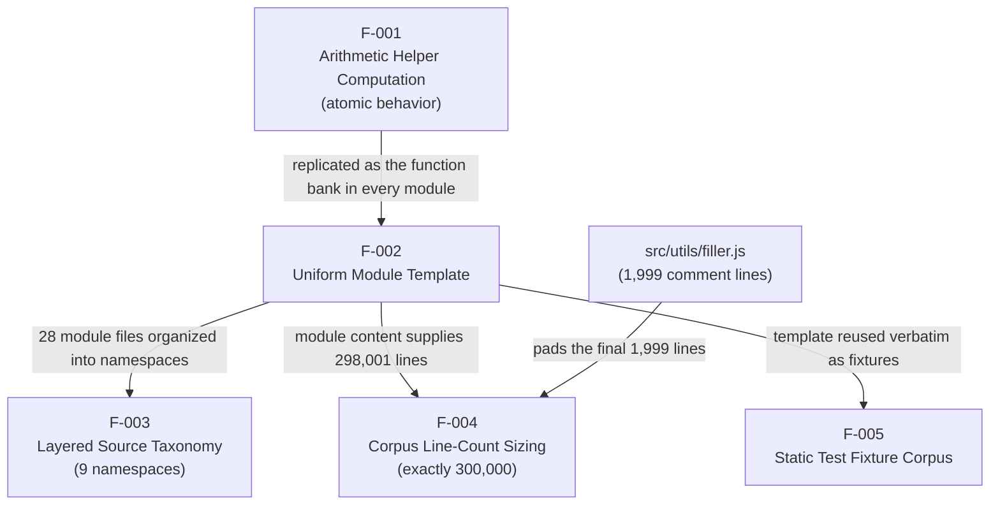

Read top-down: F-001 is the atomic unit with no prerequisites; F-002 embeds it; F-003, F-004, and F-005 each build on the F-002 modules (with `filler.js` providing F-004's final line adjustment). There are no cycles and no lateral runtime edges.

### 2.4.2 Integration Points

The repository exposes essentially no integration surface. The table records each conventional integration category against its observed state.

| Integration Category | Observed State |
|---|---|
| Inter-module function calls | None — no module references any function defined in another module |
| Module system (import/export) | None — modules are plain top-level declarations with no export mechanism |
| External systems / APIs / network | None — zero `http`, `fetch`, SDK, or network constructs |
| Only usable surface | A host JavaScript parser or runtime loads a single module file and invokes a `mod_N_M(x)` symbol by its global identifier |

### 2.4.3 Shared Components

"Shared" here means *replicated identically* across files, **not** referenced from a common location — there is no shared library, base class, or imported helper anywhere in the corpus. Each occurrence is a standalone copy.

| Shared Element | Nature of Sharing | Owning Feature |
|---|---|---|
| Canonical arithmetic body (`let r=0; …; return r`) | Byte-identical body replicated across all 33,105 functions | F-001 |
| Module preamble (`// mod_N` header + `const store = []`) | Identical two-line preamble in all 28 module files | F-002 |
| `mod_N_M` naming convention | Uniform identifier scheme applied corpus-wide | F-002 |

### 2.4.4 Common Services

There are **no common services**. The corpus contains no runtime service, no shared utility module invoked by others, and no dependency-injected or singleton component. Notably, the `src/utils/` namespace — despite its conventional name — provides no utilities to other namespaces; its files (`file_4.js`, `file_15.js`, `file_26.js`) are the same standalone arithmetic stubs, and `filler.js` is comment-only. The per-module `const store = []` binding is not a shared data service either: it is declared in each module in isolation and never read or written. Consequently, no feature consumes a service provided by another feature.

## 2.5 Implementation Considerations

This subsection records the technical constraints, performance and scalability characteristics, security implications, and maintenance requirements observed for each feature. Because the corpus is deliberately uniform, several considerations recur across features; each is nonetheless stated per feature for completeness. Where the repository defines no requirement of a given kind, that is reported as "none defined" rather than inferred.

### 2.5.1 F-001 — Deterministic Arithmetic Helper Computation

| Consideration | Detail |
|---|---|
| Technical Constraints | Behavior is fixed at generation time — no parameters, configuration, or extensibility points. The accumulator form (`r+=x*1; r+=x*2; r+=x*3`) is arithmetically equivalent to `6x` but expressed verbosely; no input validation is present |
| Performance Requirements | Constant-time O(1) execution per call (three additions, one modulo, at most one addition). No latency, throughput, or SLA target is defined anywhere in the repository |
| Scalability Considerations | The single behavior does not grow in algorithmic complexity; "scale" is purely additive (more identical functions), so there are no computational-scaling concerns — only corpus-size effects on consuming tools |
| Security Implications | No I/O and no external surface means no injection, authentication, or authorization risk. The absence of input validation is a robustness note, not an exploitable surface, given the function never touches external state |
| Maintenance Requirements | Any change to the behavior would require regenerating all 33,105 identical copies, since no shared definition exists — maximum change-amplification. The code is trivial to reason about but maximally redundant |

### 2.5.2 F-002 — Uniform Generated Module Template

| Consideration | Detail |
|---|---|
| Technical Constraints | No module-system boundaries; functions occupy the module/global scope. The distinct `mod_N` prefix per file prevents identifier collisions within the corpus. The `const store = []` binding is dead code |
| Performance Requirements | No runtime cost beyond parsing; parse time scales with file size (10,802 lines for a 1,200-function module). No performance target is defined |
| Scalability Considerations | The template scales by mechanical replication — adding modules is a copy-and-renumber operation with no coupling to break. The only practical bound observed is the F-004 line-count target |
| Security Implications | No secrets, credentials, dynamic `eval`, or external calls. Global-scope declarations could theoretically collide if concatenated with unrelated global code, but the `mod_N` prefixing avoids collisions within this corpus |
| Maintenance Requirements | Uniformity favors automated regeneration over hand-editing; the unused `store` binding and the identical function bodies carry no functional value and would be regenerated wholesale on any change |

### 2.5.3 F-003 — Layered Source Directory Taxonomy

| Consideration | Detail |
|---|---|
| Technical Constraints | Namespace names are decorative; no build tooling, index/barrel files, or lint rules enforce layering, and no dependency direction exists between layers |
| Performance Requirements | Not applicable — the taxonomy is a static directory structure with no execution cost |
| Scalability Considerations | Adding namespaces or files is trivial because there is no inter-layer coupling to preserve |
| Security Implications | Not applicable — the directory structure exposes no runtime surface |
| Maintenance Requirements | Because layer names do not reflect their contents (a `controllers/` file holds the same stubs as a `repositories/` file), the taxonomy can mislead maintainers who expect conventional roles; it must be documented as nominal only |

### 2.5.4 F-004 — Deterministic Corpus Line-Count Sizing

| Consideration | Detail |
|---|---|
| Technical Constraints | The exact 300,000-line total is a hard contract; any edit to a module or to `filler.js` changes the count and must be rebalanced. `src/utils/filler.js` is the designated adjustment mechanism |
| Performance Requirements | A larger corpus lengthens parse/index time for consuming tools; the 300,000-line magnitude is itself the deliberate, fixed benchmark size (no separate target is defined) |
| Scalability Considerations | Sizing is fixed by design; targeting a different total would require regenerating module counts and filler length rather than incremental edits |
| Security Implications | Not applicable — line count is an inert structural property |
| Maintenance Requirements | Fragile to manual editing: inserting or removing lines breaks the round total, so changes should be applied via regeneration rather than by hand |

### 2.5.5 F-005 — Static Test Fixture Corpus

| Consideration | Detail |
|---|---|
| Technical Constraints | The fixtures are not executable as tests; becoming a functioning suite would require an external runner and real assertions. Currently they support parse/traversal only |
| Performance Requirements | Identical parse cost to the equivalent `src/` modules (1,200 functions per file); no performance target is defined |
| Scalability Considerations | Adding fixtures is a mechanical copy operation, mirroring F-002 |
| Security Implications | Not applicable — fixtures perform no I/O and are not wired to any runner |
| Maintenance Requirements | Must be documented as static fixtures to prevent the misconception that `tests/` contains an executable suite; no CI pipeline or runner in the repository depends on them |

## 2.6 Requirements Traceability Matrix

This subsection provides bidirectional traceability from features to their requirements, from requirements to the source evidence that substantiates them, and from both to related Technical Specification sections. Every entry is anchored in a file, folder, or whole-corpus verification observed during inspection.

### 2.6.1 Feature-to-Requirement-to-Evidence Matrix

| Feature | Requirement IDs | Primary Evidence | Related Sections |
|---|---|---|---|
| F-001 | F-001-RQ-001 … RQ-004 | `society_mgmt_300k/src/controllers/file_0.js` (canonical body) | 1.2.2, 2.2.1, 2.3.1 |
| F-002 | F-002-RQ-001 … RQ-004 | All 28 `mod_*` modules; e.g. `src/services/file_1.js` | 1.2.2, 2.2.2, 2.3.2 |
| F-003 | F-003-RQ-001 … RQ-003 | `society_mgmt_300k/src/` (nine namespaces) | 1.2.2, 2.2.3, 2.3.3 |
| F-004 | F-004-RQ-001 … RQ-003 | 300,000-line total; `src/utils/filler.js`; `src/middleware/file_27.js` | 1.1, 2.2.4, 2.3.4 |
| F-005 | F-005-RQ-001 … RQ-002 | `society_mgmt_300k/tests/unit/`, `society_mgmt_300k/tests/integration/` | 1.3.1, 2.2.5, 2.3.5 |

### 2.6.2 Requirement Verification Matrix

Each requirement is testable by the verification approach shown, against the cited evidence location.

| Requirement ID | Verification Approach | Evidence Location |
|---|---|---|
| F-001-RQ-001 | Evaluate a `mod_N_M` function; confirm pre-bonus sum equals `6x` | `src/controllers/file_0.js` |
| F-001-RQ-002 | Confirm `+10` applies only when the sum is even (`x=2`→22, `x=0.5`→3) | `src/controllers/file_0.js` |
| F-001-RQ-003 | Confirm single-parameter signature and numeric return | Any `mod_*` module |
| F-001-RQ-004 | Re-invoke with identical input; confirm no state change and no async | Whole-corpus search (0 `async`/`await`/Promise) |
| F-002-RQ-001 | Inspect line 1 of each module file | All 28 `mod_*` modules |
| F-002-RQ-002 | Inspect line 2; grep for `store` reads/writes | All 28 modules (0 `store.`/`store[`) |
| F-002-RQ-003 | Enumerate function names and compare bodies | `src/controllers/file_0.js` (`mod_0_0`..`mod_0_1199`) |
| F-002-RQ-004 | Whole-corpus search for module wiring | 0 `import`/`export`/`require`/`module.exports` |
| F-003-RQ-001 | List `src/` subfolders | `society_mgmt_300k/src/` |
| F-003-RQ-002 | Map each `file_N.js` to its `mod_N` header | `society_mgmt_300k/src/` + `filler.js` |
| F-003-RQ-003 | Count files per namespace | `society_mgmt_300k/src/*/` |
| F-004-RQ-001 | Sum line counts of all `.js` files | Whole corpus (= 300,000) |
| F-004-RQ-002 | Inspect `filler.js` content and labels | `src/utils/filler.js` (298001–299999) |
| F-004-RQ-003 | Measure per-file line counts | 27 files @ 10,802; `file_27.js` @ 6,347 |
| F-005-RQ-001 | List `tests/` subfolders and files | `tests/unit/`, `tests/integration/` |
| F-005-RQ-002 | Search fixtures for test-harness constructs | `tests/` (0 assertions/runner/imports) |

### 2.6.3 Assumptions, Constraints, and Requirement Versioning

**Assumptions.**

- The term "feature" in this section denotes a *corpus-structural capability*, because the repository implements no application (society-management) features (see **1.3 Scope**).
- Priority and Status values are inferred from each capability's centrality to the artifact's evident purpose; they do not originate from any requirements document, since none exists in the repository (see **2.1.1**).

**Constraints.**

- No performance SLAs, security controls, or compliance obligations are defined anywhere in the repository; requirements of those kinds are recorded as "none defined."
- The exact 300,000-line total (F-004) and the uniform module template (F-002) are hard structural contracts; hand-edits that violate them would break the artifact's defining properties.
- The `tests/` fixtures (F-005) are non-executable; no assertion framework, runner, or CI pipeline exists to exercise them.

**Requirement Versioning.** All 15 requirements are baseline version 1.0, derived from the repository state at its single commit (`Add files via upload`). The repository has no tags, branches with divergent content, changelog, or prior revisions, so there is no requirement-version history to track beyond this baseline.

**Related Process Flowcharts and Specifications.** The compositional dependency flow among features is depicted in **2.4.1 Feature Dependency Map**. The computation behavior underlying F-001 is specified with worked examples in **2.3.1**. Broader system context is provided in **1.2 System Overview**, and in-scope/out-of-scope boundaries in **1.3 Scope**.

## 2.7 References

The following repository files and folders were inspected as evidence for Section 2. Paths are relative to the repository root. No external (web) sources were required.

**Files**

- `README.md` — Confirmed the repository contains only the project title, with no requirements document, roadmap, or feature specification (basis for the "no authoritative requirements source" statement in 2.1).
- `LICENSE` — Established the root-level Apache License 2.0 compliance context.
- `society_mgmt_300k/LICENSE/LICENSE.txt` — Established the subproject MIT license referenced in the Validation Rules (2.3) and dependency entries (2.2).
- `society_mgmt_300k/src/controllers/file_0.js` — Canonical evidence for F-001 (arithmetic body `mod_0_0`..`mod_0_1199`) and F-002 (header + unused `store` + function bank).
- `society_mgmt_300k/src/services/file_1.js` — Corroborated the identical F-002 template in a second namespace.
- `society_mgmt_300k/src/models/file_2.js`, `society_mgmt_300k/src/routes/file_3.js`, `society_mgmt_300k/src/utils/file_4.js`, `society_mgmt_300k/src/middleware/file_5.js`, `society_mgmt_300k/src/config/file_6.js`, `society_mgmt_300k/src/repositories/file_7.js`, `society_mgmt_300k/src/domain/file_8.js` — Confirmed the uniform two-line preamble and `mod_N` mapping across every remaining namespace (F-002, F-003).
- `society_mgmt_300k/src/middleware/file_27.js` — The single off-size module (6,347 lines, 705 functions `mod_27_0`..`mod_27_704`); evidence for F-004 per-file sizing.
- `society_mgmt_300k/src/utils/filler.js` — Established the comment-only line-padding mechanism (`// filler 298001`–`299999`, 1,999 lines) for F-004.
- `society_mgmt_300k/tests/unit/file_9.js` — Representative unit fixture (`mod_9`); evidence for F-005.
- `society_mgmt_300k/tests/integration/file_10.js` — Representative integration fixture (`mod_10`); evidence for F-005.

**Folders**

- `society_mgmt_300k/` — Primary project directory (`src/`, `tests/`, `LICENSE/`).
- `society_mgmt_300k/src/` — Source tree with the nine namespaces underpinning F-003: `config/`, `controllers/`, `domain/`, `middleware/`, `models/`, `repositories/`, `routes/`, `services/`, `utils/`.
- `society_mgmt_300k/tests/` — Test tree partitioned into `unit/` and `integration/` fixture folders (F-005).

**Whole-corpus verification**

- Aggregate inspection across all 29 `.js` files confirmed: exactly 300,000 lines; 33,105 uniform `mod_N_M` functions with byte-identical bodies; 27 modules at 10,802 lines plus `file_27.js` at 6,347 plus `filler.js` at 1,999; `const store = []` declared in all 28 modules with zero references; and zero occurrences of `require`, `import`, `export`, `module.exports`, `class`, `async`, `await`, `http`, `express`, `router`, `process.env`, `console`, `fetch`, `Promise`, or any test-harness construct (`assert`/`describe`/`it`/`expect`/`jest`/`mocha`/`chai`). These verifications substantiate the acceptance criteria and validation rules throughout 2.3 and 2.6.
- Repository history: a single commit (`Add files via upload`) confirmed the one-shot generated nature of the corpus and the version-1.0 requirement baseline noted in 2.6.3.

**Cross-referenced Technical Specification sections**

- `1.1 Executive Summary`, `1.2 System Overview`, `1.3 Scope`, `1.4 References` — Retrieved to reconcile the feature set with the established system characterization and scope boundaries.

# 3. Technology Stack

## 3.1 Programming Languages

**JavaScript is the sole and exclusive implementation language of the repository.** All 29 executable source files carry the `.js` extension, and direct inspection confirms each one is plain, standards-only JavaScript with no transpilation layer. No alternative or companion programming language is present anywhere in the tree: there are no TypeScript (`.ts`/`.tsx`), JSX, Python, Java, Go, Swift, Kotlin, Objective-C, or shell sources, and no shebang (`#!`) lines that would designate an interpreter target. This confirms, from the technology-stack perspective, the single-language characterization established in Sections 1.1 and 1.2 of this specification.

The complete language footprint of the repository is therefore one programming language (JavaScript) plus two non-executable artifact classes — Markdown documentation and plain-text license notices — that contain no code.

**Language inventory by component.** The `society_mgmt_300k` project applies the same language uniformly across every layered namespace and both test corpora; the only non-JavaScript files are the root banner and the two license notices.

| Component / Path | Files | Language | Role (as observed) |
|---|---|---|---|
| `society_mgmt_300k/src/controllers/` | 3 | JavaScript | Arithmetic stub modules (`mod_*`) |
| `society_mgmt_300k/src/services/` | 3 | JavaScript | Arithmetic stub modules (`mod_*`) |
| `society_mgmt_300k/src/models/` | 3 | JavaScript | Arithmetic stub modules (`mod_*`) |
| `society_mgmt_300k/src/routes/` | 3 | JavaScript | Arithmetic stub modules (`mod_*`) |
| `society_mgmt_300k/src/middleware/` | 3 | JavaScript | Arithmetic stub modules (incl. `file_27.js`) |
| `society_mgmt_300k/src/domain/` | 2 | JavaScript | Arithmetic stub modules (`mod_*`) |
| `society_mgmt_300k/src/repositories/` | 2 | JavaScript | Arithmetic stub modules (`mod_*`) |
| `society_mgmt_300k/src/config/` | 2 | JavaScript | Arithmetic stub modules (`mod_*`) |
| `society_mgmt_300k/src/utils/` | 4 | JavaScript | 3 stub modules + `filler.js` (comment-only) |
| `society_mgmt_300k/tests/unit/` | 2 | JavaScript | Static fixtures (`mod_*`) |
| `society_mgmt_300k/tests/integration/` | 2 | JavaScript | Static fixtures (`mod_*`) |
| `README.md` | 1 | Markdown (non-code) | Title-only banner |
| `LICENSE` (root) | 1 | Plain text (non-code) | Apache-2.0 notice |
| `society_mgmt_300k/LICENSE/LICENSE.txt` | 1 | Plain text (non-code) | MIT notice |

There is no per-component language variation: a file in `controllers/` uses exactly the same language and constructs as one in `repositories/` or `tests/integration/`. The directory taxonomy is nominal only (as documented in Section 2.5.3) and introduces no second language, template dialect, or markup layer.

**ECMAScript version baseline.** The corpus is written in a deliberately narrow subset of the language. The constructs actually exercised are block-scoped declarations (`const`, `let`), top-level `function` declarations, a single `if` conditional, strict equality (`===`), and the arithmetic/compound-assignment operators (`*`, `%`, `+=`). A representative, complete function body is:

```javascript
function mod_2_0(x){ let r=0; r+=x*1; r+=x*2; r+=x*3; if(r%2===0){r+=10} return r; }
```

The presence of block-scoped `const`/`let` sets the **minimum language baseline at ECMAScript 2015 (ES6)**; every other construct in the corpus predates ES2015 and imposes no higher requirement. No feature is used that would raise the baseline beyond ES2015, and the code executes in non-strict ("sloppy") mode because no `"use strict"` directive appears in any file.

| ECMAScript Feature | Present in Corpus | Baseline Implication |
|---|---|---|
| Block-scoped `const` / `let` | Yes (`const` ×28, `let` ×33,105) | ES2015 (ES6) — the effective minimum |
| Strict equality `===` | Yes (×33,105; zero loose `==`) | Pre-ES2015 |
| `function` declarations, `if`, `return` | Yes (×33,105 each) | Pre-ES2015 |
| Arithmetic `*` / `%` / compound `+=` | Yes | Pre-ES2015 |
| Arrow functions, template literals, `class`, `async`/`await`, destructuring | No | Not required |
| `"use strict"` directive | No | Executes in sloppy mode |

**No language or runtime version is pinned anywhere in the repository.** There is no `package.json` `engines` field, `.nvmrc`, `.node-version`, `tsconfig.json`, or Babel/TypeScript configuration, so no specific Node.js or browser-engine version is declared or required. The only defensible version statement is the ES2015 source-language floor derived directly from the syntax in use.

**Selection rationale.** The repository contains no README guidance, architecture decision record, or design note stating why JavaScript was selected, so no first-party decision rationale exists to report. On the available evidence, the choice is consistent with the artifact's observed nature as a synthetic, analysis-oriented source corpus (as characterized in Sections 1.1 and 1.2): plain `.js` files require no compilation or build step to be read, parsed, or statically analyzed; they are supported by ubiquitous, mature parsers and tooling; and the uniform, import-free module layout is well suited to the parsing, static-analysis, and symbol-indexing workflows those sections identify as the corpus's practical use. These are objective fit-for-purpose characteristics of the observed code, not a documented design decision.

**Constraints and dependencies.**

- **Runtime constraint:** Any standards-compliant JavaScript engine or parser that supports ES2015 block scoping can load the files. No other language runtime, SDK, or toolchain is required to read or parse the corpus (consistent with the "Key technical requirements" recorded in Section 1.3.1).
- **Zero language-level dependencies:** Every file imports nothing and exports nothing — there are no `require`, `import`, `export`, or `module.exports` statements in the entire corpus — so the language surface is fully self-contained and free of inter-file coupling.
- **No host-API coupling:** The code invokes no Node.js or browser APIs (`process`, `console`, `window`, `document`, `fetch`, timers, etc. are entirely absent), which keeps the JavaScript engine-agnostic and portable across any conforming host.
- **Determinism and purity:** Every function is a pure, synchronous, single-parameter numeric routine with no shared-state mutation, I/O, or asynchronous control flow, so the language usage carries no concurrency, event-loop, or side-effect constraints.

## 3.2 Frameworks & Libraries

**No application framework or third-party library is present in the repository.** Every source file is authored against the intrinsic JavaScript language alone: there are no framework imports, no library calls, and no framework-provided base classes, decorators, or lifecycle hooks anywhere in the corpus. This is corroborated by whole-corpus inspection showing zero `require`, `import`, `export`, or `module.exports` statements, which means no framework or library could be loaded even if one were installed. The layered folder names (`controllers/`, `services/`, `routes/`, `middleware/`, `repositories/`, `models/`, `domain/`, `config/`, `utils/`) evoke a conventional framework-style architecture, but no framework backs them — the taxonomy is nominal only, as established in Section 2.5.3.

Because the prompt calls for core frameworks with versions and supporting libraries, the table below enumerates the framework/library categories a reader might expect (both from a conventional layered application and from the project's default technology stack) and records, with evidence, that none is present.

| Framework / Library Category | Commonly Expected Examples | Present? | Evidence of Absence |
|---|---|---|---|
| Web / server framework | Express, Koa, Fastify, Hapi, NestJS | No | No `require`/`import`; no `app.listen`, router, or `http` usage |
| Frontend / UI framework | React, Angular, Vue | No | No JSX/`.tsx`; no `document`/`window` DOM APIs; no client assets |
| Test framework / runner | Jest, Mocha, Jasmine, Chai, Vitest | No | `tests/` files contain no `describe`/`it`/`expect`/`assert` and no runner config (see Section 2.5.5) |
| ORM / data-mapper | Sequelize, Mongoose, Prisma, TypeORM | No | No imports; no schemas/models; the `store` array is unused |
| HTTP / networking client | axios, node-fetch, got | No | No `fetch`, `http`, or client `require`/`import` |
| Utility / helper library | Lodash, Underscore, Ramda, Moment/Day.js | No | No imports; functions use only language operators (not even `Math`/`JSON`) |
| AI / orchestration framework | LangChain | No | Absent — no imports, SDK calls, or model wiring |
| Build / bundler / transpiler | webpack, Rollup, Vite, Babel | No | No bundler or transpiler config files (see Section 3.6) |

**Core frameworks and versions.** None — there is no core framework to version. Because the repository declares no dependency manifest, there are no framework or library version numbers to record anywhere in the tree.

**Supporting libraries.** None. The functions rely exclusively on built-in language operators (`*`, `%`, `+=`, `===`) and do not even reference the JavaScript standard built-in objects such as `Math`, `JSON`, `Date`, or `Array` methods, so there is no runtime-library dependency of any kind — third-party or standard-library.

**Compatibility requirements.** With zero declared dependencies, there are **no inter-library version-compatibility constraints to manage** — no peer-dependency ranges, no framework/plugin version matrices, and no transitive-dependency resolution. The only compatibility requirement is the ES2015 source-language floor documented in Section 3.1, which any conforming JavaScript engine satisfies.

**Justification.** The absence of frameworks and libraries is a direct and consistent property of the artifact's design rather than an omission to be corrected: the corpus implements no runtime behavior beyond pure, self-contained arithmetic helpers (Section 2.5.1) and therefore needs no HTTP layer, ORM, UI runtime, or utility toolkit. This dependency-free construction is also what makes the code portable and analysis-friendly (Sections 1.1–1.3). Adopting any of the frameworks in the project's default technology stack would require first introducing a module system, a dependency manifest, and runtime wiring — none of which exists today.

## 3.3 Open Source Dependencies

**The repository declares and vendors zero open-source dependencies.** There is no dependency manifest, no lockfile, no `node_modules/` directory, and no vendored third-party source anywhere in the tree. Consequently there are no third-party or open-source libraries to identify, no package versions to pin, and no package registry from which anything is resolved. This is the same conclusion reached in Section 1.3.2 ("No `package.json`, config files") and Section 2.5.2 (no external calls or SDKs) — restated here specifically in dependency-management terms.

| Dependency Artifact | Present? | Evidence |
|---|---|---|
| Dependency manifest (`package.json`) | No | Not found anywhere in the repository |
| Lockfile (`package-lock.json`, `yarn.lock`, `pnpm-lock.yaml`) | No | No lockfile of any tool present |
| Installed / vendored packages (`node_modules/`, `vendor/`) | No | No vendored third-party source in the tree |
| Registry configuration (`.npmrc`, scoped registries) | No | No registry endpoint referenced |
| Declared runtime dependencies | No (0) | No manifest and no `require`/`import` to resolve |
| Declared development dependencies | No (0) | No manifest; no linters/formatters/test runners configured |

**Third-party / open-source libraries identified.** None. Because no code performs `require`/`import` and no manifest lists dependencies, there is nothing to enumerate — the corpus consumes no open-source packages, either at runtime or as development tooling.

**Package dependencies, registries, and versions.** None are declared. There is no npm (or Yarn/pnpm) manifest, so there are no dependency version ranges, no resolved/locked versions, and no configured registry (public npm registry or private). No transitive dependency graph exists.

**License artifacts vs. dependency licenses.** The only open-source-license artifacts in the repository are the project's own **outbound** declarations — the root `LICENSE` (Apache License 2.0) and `society_mgmt_300k/LICENSE/LICENSE.txt` (MIT License, "Copyright (c) 2026"). These state the terms under which this repository is distributed; they are **not** inbound license notices for consumed dependencies (of which there are none). The dual Apache-2.0/MIT declaration is documented consistently in Sections 1.1 and 1.3.1.

**Security implications.** The complete absence of open-source dependencies eliminates the external software supply-chain attack surface entirely: there are no transitive packages that could carry known vulnerabilities (CVEs), no risk of dependency-confusion or typosquatting, and no lockfile-integrity concerns, because nothing is fetched from any registry. The trade-off, stated factually, is that there is no dependency manifest for software-composition-analysis tooling (for example `npm audit` or automated dependency scanners) to target — though with zero dependencies there is correspondingly nothing for such tooling to scan. This aligns with the broader security observation in Section 2.5 that the corpus exposes no external surface.

## 3.4 Third-Party Services

**The repository integrates with no third-party services of any kind.** It defines no external API clients, no authentication or identity providers, no monitoring or observability agents, and no cloud-platform SDKs. This is grounded in direct evidence: the corpus contains no networking calls (`fetch`/`http`), no SDK imports (no `require`/`import` at all), no environment-driven configuration (`process.env` never appears), and no `.env` or credential files. Section 1.2.1 reaches the identical conclusion — "The repository defines no integration surface."

| Service Category | Commonly Expected / Default-Stack Examples | Present? | Evidence of Absence |
|---|---|---|---|
| External API / integration | Payment gateways, email/SMS, webhooks | No | No HTTP client, `fetch`, or SDK; no outbound calls |
| Authentication / identity | Auth0, OAuth/OIDC, JWT, sessions | No | No identity, token, session, or access-control code (Section 1.3.2) |
| Monitoring / observability / logging | Datadog, Sentry, Prometheus, OpenTelemetry | No | No APM/metrics agent; not even `console` logging is used |
| Cloud platform / services | AWS (S3, Lambda), GCP, Azure | No | No cloud SDK, no service endpoints, no cloud credentials or config |
| Messaging / streaming | Kafka, RabbitMQ, SQS, PubSub | No | No broker client or queue configuration |
| Secrets / configuration source | `.env`, Vault, cloud secret managers | No | No `process.env` usage and no `.env`/secrets files |

**External APIs and integrations.** None. Every module is fully self-contained; there is no request/response code, no API contract, and no client library through which an external service could be reached.

**Authentication services.** None. No authentication provider (such as the Auth0 service named in the project's default technology stack), no OAuth/OIDC flow, no token issuance or validation, and no session handling exist anywhere in the code — consistent with the "Authentication & authorization: absent" entry in Section 1.3.2.

**Monitoring tools.** None. There is no application-performance-monitoring agent, error-tracking SDK, metrics exporter, or structured logging. The corpus produces no telemetry, and because there is no runnable application (Section 1.2), there is nothing emitting logs or metrics to observe.

**Cloud services.** None. No cloud-provider SDK or CLI configuration is present, and none of the cloud components in the default technology stack (for example AWS) appear in the tree. There are no storage buckets, serverless handlers, managed queues, or infrastructure endpoints referenced by the code.

**Integration requirements between components and external services.** There are none to document. Every function is invoked directly in-process by a hypothetical host that has loaded the module (Section 1.3.1); there is no inter-service protocol, authentication handshake, connection string, or data-exchange format. Introducing any third-party service would first require adding a module system, a dependency manifest, and configuration/secrets handling — none of which the repository currently contains.

## 3.5 Databases & Storage

**The repository has no database, no caching layer, and no storage service.** It contains no database driver, ORM/ODM, connection string, query, schema definition, or migration. There is no persistence of any kind, and no data leaves the scope of an individual function call. This restates, in storage terms, the "No persistence" finding of Section 1.2.1 and the "Persistence / database: absent" entry of Section 1.3.2.

| Storage Concern | Commonly Expected / Default-Stack Examples | Present? | Evidence |
|---|---|---|---|
| Primary database | MongoDB (default stack), PostgreSQL, MySQL | No | No driver/ODM/ORM, connection, or query anywhere |
| Secondary database | Any relational or NoSQL store | No | No secondary datastore referenced |
| Caching solution | Redis, Memcached, in-process cache | No | No cache client or cache API usage |
| Object / file storage | S3, blob storage, local filesystem | No | No filesystem or storage-SDK I/O |
| In-memory state | `const store = []` (per module) | Declared, unused | 28 declarations, 0 references (dead code) |
| Schema / migrations | Migration tool, schema/DDL files | No | No schema or migration artifacts |

**Primary and secondary databases.** None. No database of any category (relational, document, key-value, graph, time-series) is connected or configured. In particular, the MongoDB datastore named in the project's default technology stack does not appear anywhere in the code — there is no Mongo (or any other) client, URI, or collection reference.

**Data persistence strategies.** There is no persistence strategy because there is no persisted data. Every function is a pure, stateless computation that accepts a numeric argument and returns a numeric result (Section 2.5.1); nothing is written to, or read from, a durable or in-memory store between calls.

**The `store` placeholder.** Each of the 28 module files declares one module-scoped `const store = [];` immediately after its header comment. This is the only data-structure declaration in the corpus, yet it is never referenced: whole-corpus inspection finds 28 declarations and **zero** reads or writes of `store`. It is inert dead code — not an in-memory database, cache, or buffer — a characterization also recorded in Sections 1.2.1 and 2.5.2.

**Caching solutions.** None. There is no caching library, no memoization of the arithmetic helpers, and no cache-invalidation logic. Given the O(1), deterministic nature of every function (Section 2.5.1), no caching layer is present or needed.

**Storage services.** None. The corpus performs no file, object, or blob I/O; it reads no configuration from disk and writes no output. There are no upload/download paths, no temp-file handling, and no storage-service credentials.

**Security implications.** With no datastore, cache, or storage service, there is no data at rest to protect, no personally identifiable information handled, and no database connection strings or storage credentials to secure or leak. Consistent with Section 2.5.1, the absence of any persistence or external state removes the corresponding data-security and injection attack surface entirely.

## 3.6 Development & Deployment

This sub-section documents the tooling used to develop, build, package, and deploy the repository. Consistent with the synthetic-corpus characterization established in Sections 1.2 and 1.3 — and with the null results recorded in 3.2 through 3.5 — the evidence establishes a deliberately minimal footprint. Version control is the only development-support tool present in the repository; there is no build system, containerization, CI/CD pipeline, or infrastructure-as-code tooling of any kind. The prompt's default deployment stack (Docker for containerization, Terraform for infrastructure-as-code, GitHub Actions for CI/CD) is treated strictly as a non-applicable fallback: none of these artifacts appear anywhere in the repository and none are documented as used.

The table below summarizes each conventional development-and-deployment concern against what the repository actually contains. All "No" rows are grounded in the confirmed absence of the corresponding configuration files across the entire tree (excluding `.git/`).

| Development / Deployment Concern | Present in Repository? | Evidence |
| --- | --- | --- |
| Version control | Yes — Git only | `.git/` directory with a 2-commit history |
| Build system / compiler / bundler | No | No `package.json` scripts, `Makefile`, or webpack/rollup/vite/esbuild/parcel config |
| Transpiler | No | No Babel config (`.babelrc`, `babel.config.*`); source needs no transpilation |
| Package / dependency manager | No | No `package.json` or lockfile (see 3.3) |
| Linter / formatter | No | No `.eslintrc*`, `.prettierrc*` |
| Type tooling | No | No `tsconfig*.json`, no `*.d.ts` (plain JavaScript, not TypeScript — see 3.1) |
| Editor configuration | No | No `.editorconfig` |
| Runtime-version pinning | No | No `.nvmrc`, `.node-version`, or `engines` field |
| Containerization | No | No `Dockerfile`, `docker-compose.y*ml`, `.dockerignore`, or Kubernetes/Helm manifests |
| CI/CD pipeline | No | No `.github/workflows/`, `.gitlab-ci.yml`, or other CI definitions |
| Infrastructure as Code | No | No Terraform (`*.tf`), CloudFormation, Pulumi, or Ansible |
| Test runner / harness | No | Tests are static fixtures with no runner (see 2.5 and 3.2) |
| Distribution / packaging config | No | No registry or publish configuration |
| Licensing artifacts | Yes | Root `LICENSE` (Apache-2.0); `society_mgmt_300k/LICENSE/LICENSE.txt` (MIT) |

**Development Tools.** Git is the only development tool with any footprint in the repository. The `.git/` history contains exactly two commits — `87d531e` ("Initial commit") and `32093d3` ("Add files via upload"), on branch `06-Jul-2026-Br2`. The second commit message indicates the corpus was bulk-uploaded rather than authored incrementally, which is consistent with the uniform, generated nature of the source documented in Section 2 (F-002, F-004). Beyond version control, the repository carries no editor/IDE settings (`.editorconfig`), no linter or formatter configuration (`.eslintrc*`, `.prettierrc*`), no language-service or type configuration (`tsconfig*.json`, `*.d.ts`), and no runtime-version pin (`.nvmrc`, `.node-version`). No version numbers can be recorded for these categories because no such tools are declared.

**Build System.** There is no build system, and none is required. The source is plain ES2015+ JavaScript (Section 3.1) that a compliant engine parses directly, so there is nothing to compile, transpile, or bundle. Evidence for the absence includes: no `package.json` (and therefore no npm/yarn/pnpm build scripts), no `Makefile`, no bundler configuration (webpack/rollup/vite/esbuild/parcel), and no Babel configuration. The one non-source file inside the tree that might imply a build step, `src/utils/filler.js`, is comment-only and inert (it exists solely to pad the corpus to exactly 300,000 lines per F-004) and thus imposes no build requirement. No build-tool versions exist to document.

**Containerization.** No containerization is present. There is no `Dockerfile`, `docker-compose.yml`/`docker-compose.yaml`, `.dockerignore`, or any Kubernetes/Helm manifest. The prompt's default containerization technology (Docker) does not appear in the repository.

**CI/CD.** No continuous-integration or continuous-deployment automation is present. There is no `.github/workflows/` directory, no `.gitlab-ci.yml`, and no CircleCI/Travis/Jenkins/Azure Pipelines configuration. The prompt's default CI/CD technology (GitHub Actions) does not appear in the repository, and the 2-commit git history contains no automation artifacts. Because there are no executable tests (the `tests/` tree holds static fixtures, per Section 2.5), there is also no test stage to automate.

**Infrastructure as Code (IaC).** No infrastructure-as-code tooling is present. There are no Terraform files (`*.tf`), CloudFormation templates, Pulumi programs, or Ansible playbooks. The prompt's default IaC technology (Terraform) does not appear in the repository. This is consistent with Section 3.4: because the corpus provisions and consumes no cloud services or external infrastructure, there is nothing for an IaC layer to describe.

**Minimal Runtime and Toolchain Requirement.** The single prerequisite for consuming this corpus is a standards-compliant JavaScript parser or engine capable of loading top-level function declarations (per Section 1.3). No specific engine or version is mandated or bundled — there is no `.nvmrc`, `.node-version`, or `engines` field to pin one. Because the code uses only the ES2015 block-scoped declarations (`const`, `let`) and the strict-equality arithmetic subset documented in 3.1, and invokes no Node.js or browser host APIs, any ES2015-compliant engine (for example, a modern browser JavaScript engine or a Node.js runtime) can parse and execute it. The repository itself neither includes nor requires a particular runtime distribution.

**Licensing and Distribution Artifacts.** The only distribution-governance artifacts are the two license files: the root `LICENSE` (Apache License 2.0) and `society_mgmt_300k/LICENSE/LICENSE.txt` (MIT License, "Copyright (c) 2026"). As noted in 3.3, these are outbound license grants for this repository's own source, not inbound dependency licenses. There is no packaging or publishing configuration (no `package.json` metadata, no registry configuration), so the corpus is not set up for package distribution; it is consumed directly as source.

**Security Implications.** The absence of a build/CI/CD/IaC toolchain removes entire categories of operational risk: there are no pipeline secrets, deployment credentials, or automated build steps that could be tampered with, and no container base images that would carry their own CVE surface. Combined with the findings in 3.3 (no third-party dependencies) and 3.4 (no external services), the deployment surface is effectively empty. The git history contains only source and license text, with no embedded secrets or credentials (consistent with Section 2.5).

**Integration Requirements.** There are no build-time or deploy-time integrations between components. Each module file is self-contained with zero import/export wiring (Section 2.4), so the only integration point is a host JavaScript engine loading a single module file and invoking a `mod_N_M(x)` symbol. No component depends on another component being built, containerized, or deployed first.

The following diagram summarizes the effective technology stack. It distinguishes what is actually present in the repository, the single external host the source relies on to run, and the conventional stack layers that are deliberately absent.

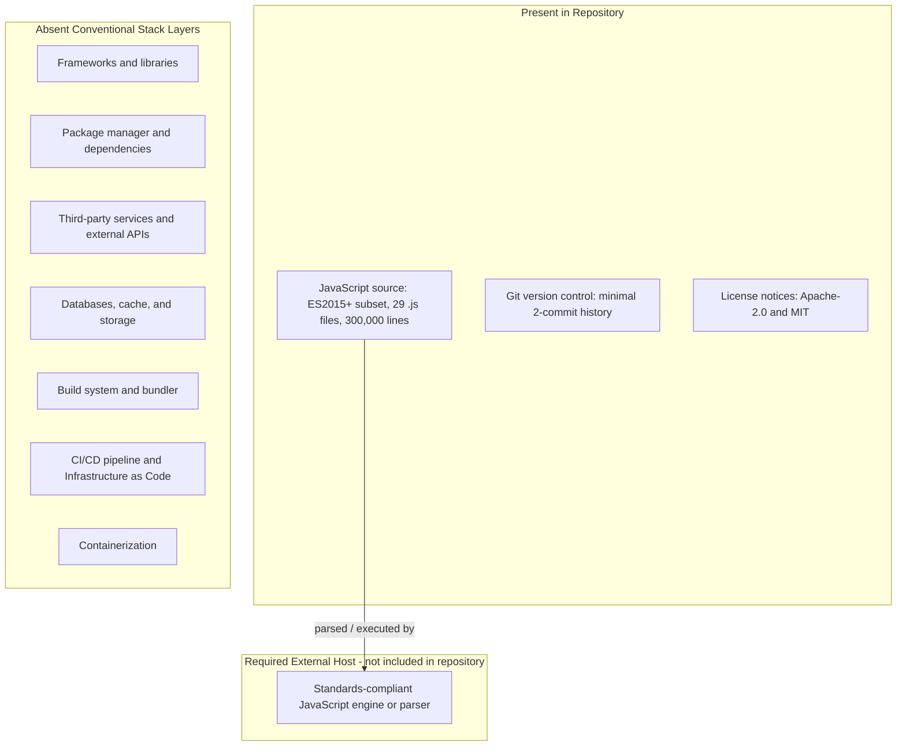


## 3.7 References

The following repository files, folders, and previously authored specification sections were inspected as evidence for the technology-stack determinations in 3.1 through 3.6. Every claim in this section — including the explicit absences — is grounded in these artifacts.

**Repository files examined**

- `README.md` — Root readme; contains only the title `# Society_Mngt_26-Jun-2026-Afternoon`, establishing the nominal project name with no technology guidance.
- `LICENSE` — Root license file; Apache License 2.0. Establishes the outbound license for the repository (3.3, 3.6).
- `society_mgmt_300k/LICENSE/LICENSE.txt` — MIT License ("Copyright (c) 2026"); the subproject's outbound license artifact (3.3, 3.6).
- `society_mgmt_300k/src/controllers/file_0.js` — Canonical generated module (`mod_0`): `// mod_N - society module` header, unused `const store = []`, and 1,200 identical arithmetic functions. Established the ES2015+ language subset, sloppy mode, and strict-equality usage (3.1) and the absence of frameworks/imports/exports (3.2).
- `society_mgmt_300k/src/middleware/file_27.js` — Smallest module (`mod_27`, 705 functions / 6,347 lines); confirmed the uniform template holds at a different size and contributed to the 300,000-line accounting.
- `society_mgmt_300k/src/utils/filler.js` — Comment-only file (1,999 lines of `// filler NNNNNN`); confirmed there is no build/asset-processing step and that padding is inert (3.6).

**Repository folders examined**

- `society_mgmt_300k/` — Project directory; contains `src/`, `tests/`, and `LICENSE/`. Confirmed there is no `package.json`, lockfile, `Dockerfile`, CI, or IaC at the project root (3.3, 3.4, 3.5, 3.6).
- `society_mgmt_300k/src/` — Source tree of nine nominal namespaces (`config`, `controllers`, `domain`, `middleware`, `models`, `repositories`, `routes`, `services`, `utils`). Confirmed all 28 module files follow the identical template with no libraries, services, database drivers, or storage clients (3.2, 3.4, 3.5).
- `society_mgmt_300k/tests/` — Contains `unit/` and `integration/` fixtures that are additional instances of the same template; confirmed the absence of a test runner/harness (3.2, 3.6).
- `.git/` — Version-control metadata; 2-commit history (`87d531e` "Initial commit", `32093d3` "Add files via upload") on branch `06-Jul-2026-Br2`. Established that Git is the only development tool present and that no CI/CD automation exists (3.6).

**Repository-wide verification performed**

- Full-corpus inspection of all 29 `.js` files (exactly 300,000 lines, 33,105 identical functions) confirming the language-construct inventory (`const`, `let`, `function`, `if`, `return`, `===`) and the zero-count of framework/runtime/dependency constructs (`require`, `import`, `export`, `module.exports`, `class`, `async`/`await`, `=>`, `console`, `process`, `window`, `document`, `fetch`, `Promise`, `Math`, `JSON`, `new`) — supporting 3.1 through 3.5.
- Tree-wide check for build, container, CI/CD, IaC, and toolchain-hint files (`package.json`, lockfiles, `Dockerfile`, `docker-compose.*`, `.github/workflows/`, `*.tf`, `Makefile`, `tsconfig*.json`, `.eslintrc*`, `.prettierrc*`, `.babelrc`, `.nvmrc`, `.node-version`, `.editorconfig`, `*.d.ts`) — all confirmed absent, supporting 3.6.

**Cross-referenced specification sections**

- `1.1 Executive Summary` — Confirmed the synthetic-corpus identity and dual Apache-2.0/MIT licensing.
- `1.2 System Overview` — Confirmed the "nominal intent vs. as-implemented reality" framing and the absence of application, persistence, configuration, and integration.
- `1.3 Scope` — Confirmed the in-scope/out-of-scope boundaries, including the minimal "standards-compliant JS parser/engine" runtime requirement referenced in 3.6.
- `2.4 Feature Relationships` — Confirmed that modules are self-contained with zero wiring and that the only integration point is a host engine invoking a `mod_N_M(x)` symbol (3.6).
- `2.5 Implementation Considerations` — Confirmed the security posture (no `eval`/dynamic code, no secrets, no external surface) reflected in 3.3 through 3.6, and the static-fixture nature of the `tests/` tree.


# 4. Process Flowchart

## 4.1 System Workflows

This section documents the process and workflow behavior of the repository **exactly as implemented**, applying the same "nominal intent versus as-implemented reality" discipline used throughout this specification. Every diagram and statement is grounded in observed code; wherever a workflow that a housing-society platform would normally contain is absent, that absence is stated explicitly and never fabricated.

The controlling fact for the entire section — established by direct inspection and corroborated by **1.2 System Overview**, **1.3 Scope**, and **2.2 Feature Catalog** — is that the repository is a *synthetic 300,000-line JavaScript corpus* whose single executable behavior is the deterministic arithmetic helper `mod_N_M(x)` (Feature **F-001**). There is no HTTP layer, no persistence, no inter-module wiring, no asynchronous processing, and no error-handling machinery anywhere in the tree (`society_mgmt_300k/src/`, `society_mgmt_300k/tests/`). Consequently, the "processes" documented here are (a) the one genuine runtime process — evaluating a helper function — and (b) explicit, evidence-based statements of the workflow categories that do not exist.

> **Scope note.** The society-management domain processes implied by the repository name (member onboarding, dues/billing, maintenance requests, notices, visitor logs, facility booking) are **not present in any file** and are therefore out of scope for the current codebase per **1.3.2 Out-of-Scope Elements**. No user interface, API, or orchestration layer exists to sequence such processes.

### 4.1.1 High-Level System Workflow

The only end-to-end workflow supported by the codebase is the programmatic invocation of a single helper function by an external host that has loaded one of the `mod_N` modules. As **1.3.1** states, "the only 'workflow' the code supports is programmatic invocation of an individual `mod_N_M(x)` helper by a host that has loaded the module; there is no orchestration connecting modules to one another." The repository provides **no entry point** (no `index.js`, `server.js`, `app.js`, or `package.json` `main`), so the initiating host is necessarily external to the repository.

The diagram below uses swim lanes to separate the three participants in this workflow: the external **Host / Caller**, the **module scope** of a single `file_N.js` (Feature **F-002**), and the **function scope** of the invoked `mod_N_M(x)` helper (Feature **F-001**). The single decision diamond is the parity check that is the sole conditional in the entire corpus.

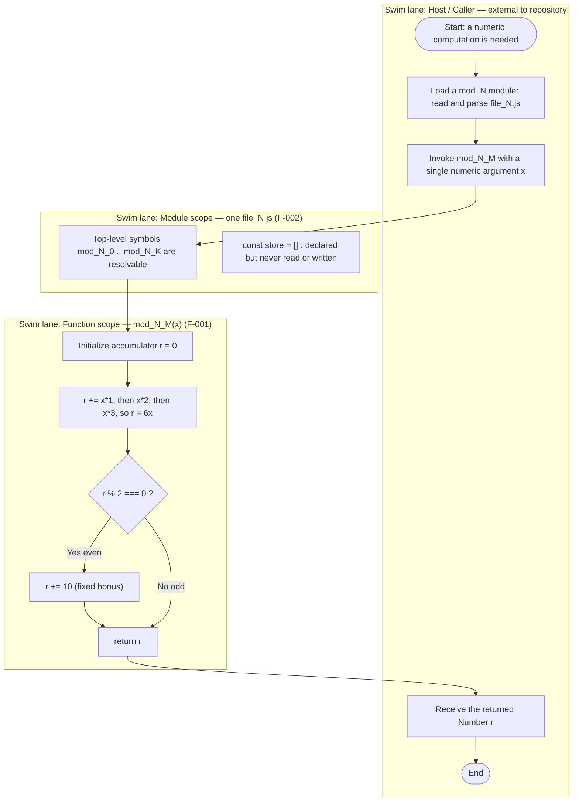

**Reading the diagram.** Control originates outside the repository, crosses the system boundary when the host loads a module, and enters the function scope on invocation. Within the function scope, the process is a fixed, linear accumulation (`r += x*1; r += x*2; r += x*3`) followed by one decision (`r % 2 === 0`) that conditionally adds the fixed bonus of `10`, after which the value is returned to the caller. The module-scoped `const store = []` is drawn as an isolated node with no inbound or outbound edges precisely because it is never referenced at runtime (verified: zero `store.`/`store[` occurrences, consistent with **F-002-RQ-002**). No other module participates: there are no imports, so the workflow never spans more than one `file_N.js`.

**Timing.** Each helper performs constant-time O(1) work — three multiplications, three additions, one modulo, and at most one further addition — as recorded for **F-001** in **2.3.1**. The repository defines no service-level agreement, latency budget, or throughput target (see 4.2.1).

### 4.1.2 Core Business Process Flows

**End-to-end user journeys.** There are **no end-user journeys** because the repository contains no user interface, no API, and no executable application (**1.3.2**). No actor can register, authenticate, submit a form, or trigger a multi-step business transaction. The only "actor" is a programmatic host that calls a function symbol, as depicted in 4.1.1.

**Per-feature process mapping.** The catalog in **2.2 Feature Catalog** defines five features. Only one of them (**F-001**) is a *runtime process*; the remaining four are *static structural properties* of the corpus and therefore have no executable flow to diagram. This is stated explicitly rather than inventing process flows for them:

| Feature | Nature | Runtime process flow? |
|---|---|---|
| F-001 Deterministic Arithmetic Helper Computation | Executable behavior | Yes — the flow diagrammed below |
| F-002 Uniform Generated Module Template | Static file structure | No — a parse-time shape, not a process |
| F-003 Layered Source Directory Taxonomy | Static directory layout | No — organizational only |
| F-004 Deterministic Corpus Line-Count Sizing | Static size property (300,000 lines) | No — a build-time/authoring artifact |
| F-005 Static Test Fixture Corpus | Static fixtures (no runner) | No — not executable (2.2.5) |

**Detailed process flow for the sole core feature (F-001).** The following flowchart expands the function-scope lane from 4.1.1 into the complete, evidence-based process for `mod_N_M(x)`, with explicit start and end points, each process step, and the single decision diamond. It also annotates the two facts that shape the flow: no input validation is performed on `x`, and there is no error path (see 4.3.2).

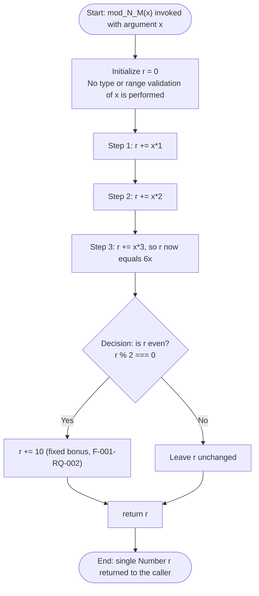

**System interactions and decision points.** The single system interaction is the synchronous, in-process function call shown above; there is no cross-component or cross-process interaction. The single decision point across the whole 300,000-line corpus is `r % 2 === 0`, which the functional requirements describe as "the sole conditional in the corpus" (**2.3.1**). For integer inputs `6x` is always even, so the bonus always applies and the result is `6x + 10`; for non-integer inputs where `6x` is odd (for example `x = 0.5` → `3`), the bonus is skipped and the result is `6x`.

**Error-handling paths.** There are none within this process. The function contains no `try`/`catch`/`throw` and performs no validation, so no branch of the flow leads to an error state, retry, or recovery step. The complete (empty) error-handling picture is documented in 4.3.2.

### 4.1.3 Integration Workflows

The repository defines **no integration surface whatsoever**. As **1.2.1** records, inspection "found no network calls (`fetch`/`http`), no environment-driven connection settings, no message brokers, and no third-party SDKs," and "each `.js` file is fully self-contained, importing nothing and exporting nothing." Each requested integration-workflow category is therefore reported as absent, with the supporting evidence:

| Requested Integration Workflow | Status in Repository | Evidence |
|---|---|---|
| Data flow between systems | Absent — single self-contained project, no external systems | No imports/exports; no network or DB clients (1.2.1, 1.3.2) |
| API interactions | Absent — no HTTP server, routes, or clients | Zero `http`/`express`/`router`/`req`/`res`/`fetch` in the corpus (1.3.2) |
| Event processing flows | Absent — no event emitters, listeners, or queues | Zero `emit`/`on`/queue/broker constructs; no async primitives |
| Batch processing sequences | Absent — no schedulers, jobs, or bulk pipelines | Zero `cron`/`setInterval`/`setTimeout`; no job runner |

**The only interaction that exists.** The single "integration" is a host JavaScript parser/runtime loading a `mod_N` module and invoking one of its `mod_N_M` symbols in-process. The sequence diagram below models that lone interaction and explicitly notes the participants that do **not** exist (network, database, queue, external service).

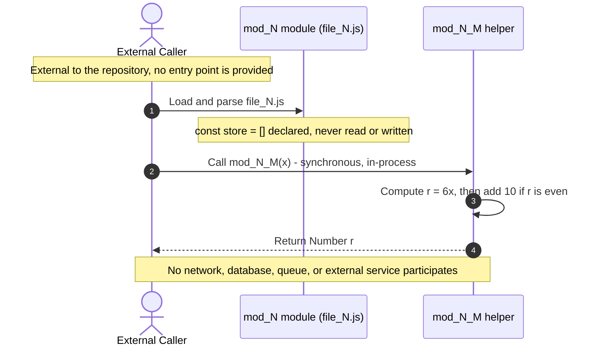

Because there is no orchestration connecting modules (**1.2.1**, **1.3.1**), there is no multi-service choreography, no request/response fan-out, no publish/subscribe topology, and no batch window to document. The interaction is fully synchronous and terminates as soon as the single return value is produced.

## 4.2 Flowchart Requirements and Validation Rules

This section evaluates the repository against the standard flowchart-element checklist (start/end points, process steps, decision diamonds, system boundaries, user touchpoints, error states/recovery, timing/SLA) and against the standard validation checklist (business rules, data validation, authorization, regulatory compliance). Each element is reported as present or absent strictly on the basis of observed code.

### 4.2.1 Workflow Elements, Decision Points, and SLA Considerations

Because the corpus contains a single runtime process (the `mod_N_M(x)` computation, **F-001**), the flowchart-element inventory is small and fully enumerable. The table below maps every required element to its as-implemented reality.

| Flowchart Element | Present? | As-Implemented Detail (evidence) |
|---|---|---|
| Start point | Yes | Invocation of `mod_N_M(x)` by an external host (4.1.1) |
| Process steps | Yes | Three linear accumulation steps: `r += x*1; r += x*2; r += x*3` |
| Decision diamonds | Yes — exactly one | `r % 2 === 0` — "the sole conditional in the corpus" (**2.3.1**) |
| End point | Yes | `return r` — a single `Number` returned to the caller |
| System boundaries | One (logical) | The module scope of a single `file_N.js`; crossed when a host loads the module. No process, network, or service boundary exists |
| User touchpoints | None | No UI, API, or interactive surface (**1.3.2**) |
| Error states / recovery paths | None | No `try`/`catch`/`throw`; no validation branch (4.3.2) |
| Timing / SLA considerations | O(1) work; no SLA | Constant-time arithmetic; "no benchmark or SLA defined in the repository" (**2.3.1**) |

The following annotated flowchart labels each node with its flowchart-element category and encloses the process in its single logical system boundary. The two element categories that do not exist (user touchpoints and error/recovery paths) are shown as isolated flags rather than omitted, so the inventory is complete and unambiguous.

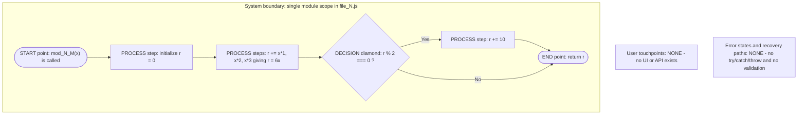

**Decision-point catalog.** Documenting every decision point (as required) is straightforward because there is exactly one, replicated verbatim inside all 33,105 functions:

| ID | Location | Condition | True branch | False branch |
|---|---|---|---|---|
| DP-1 (bonus/parity) | Inside every `mod_N_M(x)` | `r % 2 === 0` | `r += 10`, then `return r` | `return r` unchanged |

**Timing and SLA.** Each helper performs a fixed, constant-time sequence (three multiplications, three additions, one modulo, at most one further addition), so its cost is O(1) and independent of input magnitude. The repository defines **no** latency budget, throughput target, availability objective, or other service-level agreement; **1.2.3** explicitly notes that "conventional KPIs such as availability, latency, throughput, or user-adoption metrics are not defined and cannot be measured against the current code." No timing constraint is therefore attached to any step in the flow.

### 4.2.2 Validation Rules

The validation surface mirrors the per-feature "Validation Rules" tables in **2.3 Functional Requirements**. Each required validation dimension is reported below with its supporting evidence; three of the four dimensions are absent by construction.

| Validation Dimension | Rule as Implemented | Evidence |
|---|---|---|
| Business rules (per step) | Exactly one: the fixed bonus of `10` is added **if and only if** `r % 2 === 0` at decision point DP-1. No pre-conditions, post-conditions, or other step-level rules exist | **F-001-RQ-002**; "the sole conditional in the corpus" (**2.3.1**) |
| Data validation requirements | None implemented — the argument `x` is neither type-checked nor range-checked; there is no guard before it is used in arithmetic | "Data Validation — None implemented" (**2.3.1**) |
| Authorization checkpoints | None — no identity, roles, sessions, tokens, or access control anywhere | "No authentication & authorization" (**1.3.2**); "no injection, authentication, or authorization surface" (**2.3.1**) |
| Regulatory compliance checks | None functional — no PII handling, financial, or regulatory logic; the only compliance artifacts are licenses (Apache-2.0 root, MIT subproject) | "Compliance Requirements — None functional; redistribution is governed by the subproject MIT license" (**2.3.1**) |

**Behavior in the absence of data validation.** Because no type or range guard exists, the function relies entirely on JavaScript's default operator coercion. Direct execution of the canonical function confirms the following representative outcomes: integer inputs return `6x + 10` (for example `2 → 22`, `10 → 70`, `-4 → -14`); values that coerce to `0` such as `null` and `[]` return `10`; a numeric string such as `"5"` coerces and returns `40`; and inputs that coerce to `NaN` such as `undefined`, `{}`, and `"abc"` return `NaN`. In every case the function **returns a value and never throws** — there is no validation branch and therefore no rejection path. This coercion behavior is a property of the JavaScript language, not of any validation logic implemented in the repository; its interaction with error handling is examined in 4.3.2.

## 4.3 Technical Implementation Flows

This section documents the state-management and error-handling behavior that underpins the process flows above. In both areas the repository's implementation is minimal: the helper functions are pure and stateless, and no error-handling machinery exists. Each dimension is reported with its supporting evidence.

### 4.3.1 State Management

**State transitions.** The `mod_N_M(x)` helper is a pure, deterministic function whose only "state" is the transient local accumulator `r` that lives for the duration of a single invocation. There is no persistent state machine, no session, and no object lifecycle. The requirement **F-001-RQ-004** captures this directly: the function must "behave as a pure, deterministic function (no I/O, state mutation, or async)," and repeated calls with identical `x` yield identical results. The diagram below models the transient lifecycle of one invocation; note that the terminal transition retains no state.

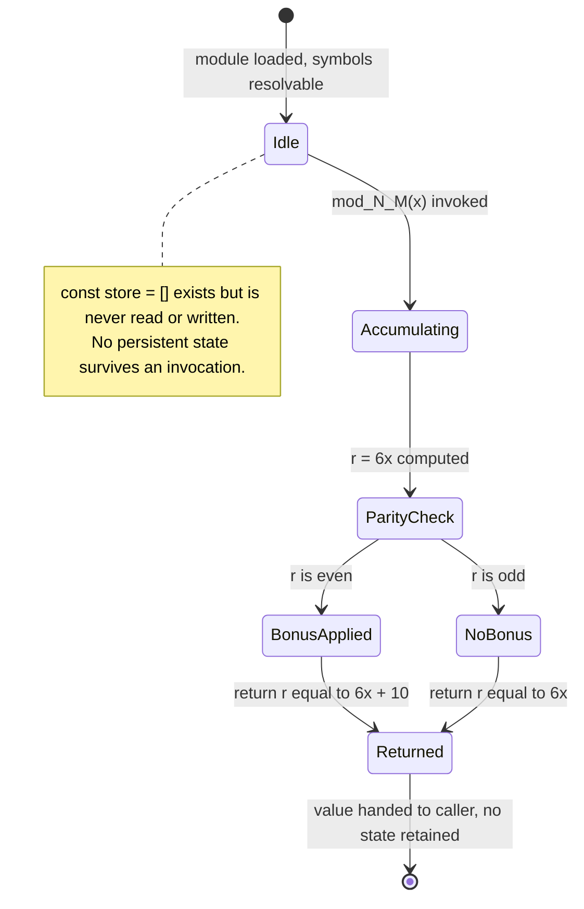

**State-management dimensions.** The four requested dimensions are enumerated below; three are absent by construction.

| Dimension | Status | Evidence |
|---|---|---|
| State transitions | Transient only — local accumulator `r` within one call; no persistent state machine | `mod_N_M(x)` purity (**F-001-RQ-004**) |
| Data persistence points | None — `const store = []` is declared but never read or written; no database or file I/O | **F-002-RQ-002**; "no persistence" (**1.2.1**) |
| Caching requirements | None — no memoization or cache layer; every call recomputes from scratch (results are reproducible, but nothing is stored) | No cache constructs anywhere in the corpus (**1.3.2**) |
| Transaction boundaries | None — no multi-step atomic operation, rollback, or ACID scope; a single synchronous call is the entire unit of work | No transactional or async primitives (**1.3.2**) |

The inert `store` binding is the corpus's only hint at an intended persistence layer, but because it is never touched it introduces no state, no persistence point, and no transaction boundary. Each invocation is fully independent, so there is no shared mutable state to synchronize, cache, or roll back.

### 4.3.2 Error Handling Flows

The repository implements **no error handling of any kind**. There is no `try`, `catch`, or `throw` anywhere in the 300,000-line corpus, and there is no validation branch that could reject input. The functional requirements confirm that the security/error surface is empty: the function "performs no I/O and exposes no injection, authentication, or authorization surface" (**2.3.1**). Each requested error-handling capability is therefore reported as absent:

| Error-Handling Capability | Status | Evidence |
|---|---|---|
| Retry mechanisms | None — no loop, backoff, or re-invocation logic | No `for`/`while`/timer constructs; synchronous single call |
| Fallback processes | None — no alternate path or default-value substitution on failure | Single linear flow; no `catch` branch |
| Error notification flows | None — no logging, alerting, or error channel | Zero `console`, `throw`, or emitter constructs (**1.2.1**) |
| Recovery procedures | None — no compensating action, rollback, or cleanup | No transactional/stateful scope to recover (4.3.1) |

**How the code behaves at the "error" boundary.** Because there is no validation and no exception path, malformed input never produces an error; it is silently coerced by the JavaScript engine and a value is always returned. The flowchart below illustrates these language-level outcomes.

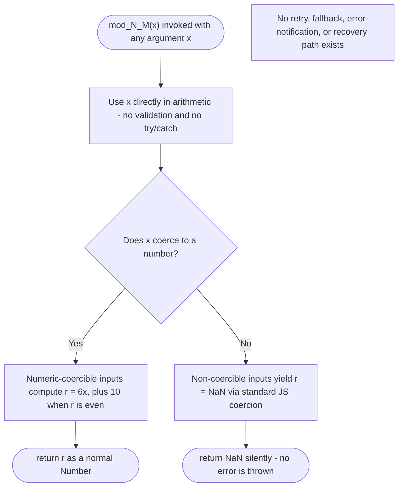

**Important caveat.** The diamond above models JavaScript's implicit coercion *outcomes*; it is **not** an explicit branch in the source. The code contains no input-type check — the only real conditional is the parity test DP-1 (4.2.1). Direct execution confirms the two outcomes: numeric-coercible inputs return a normal `Number` (for example `null → 10`, `"5" → 40`, `2 → 22`), while non-coercible inputs return `NaN` (for example `undefined`, `{}`, and `"abc"`), in all cases **without throwing**. Consequently there are no error states to notify on and nothing to recover from; the "recovery procedure" for a `NaN` result would necessarily live in the external caller, not in this repository.

## 4.4 References

**Repository files and folders inspected as evidence for this section**

- `README.md` — confirmed the project is identified by title only ("Society_Mngt_26-Jun-2026-Afternoon"), with no runtime or workflow documentation.
- `LICENSE` — root Apache-2.0 license; the only root-level compliance artifact.
- `society_mgmt_300k/` — the main project container; established the two-branch `src/` + `tests/` layout with no entry point or manifest.
- `society_mgmt_300k/src/` — established the nine nominal layered namespaces (`controllers`, `services`, `models`, `routes`, `domain`, `repositories`, `middleware`, `config`, `utils`) that carry no functional wiring between layers.
- `society_mgmt_300k/src/controllers/file_0.js` — read directly to confirm the canonical `mod_N_M(x)` function body and the unused `const store = []`; representative of the "controller" layer having no request handling.
- `society_mgmt_300k/src/routes/file_3.js` — read directly to confirm the "route" layer contains identical arithmetic stubs and no HTTP route registration.
- `society_mgmt_300k/src/middleware/file_5.js` and `society_mgmt_300k/src/middleware/file_27.js` — confirmed uniformity of the template and the 705-function outlier module.
- `society_mgmt_300k/src/utils/filler.js` — confirmed comment-only line padding (`// filler 298001` … `// filler 299999`) with zero executable code.
- `society_mgmt_300k/tests/` (`unit/`, `integration/`) — confirmed static fixtures with no runner, assertions, or imports (basis for the "no executable workflow" statements).
- `society_mgmt_300k/LICENSE/LICENSE.txt` — MIT license for the subproject; the sole non-`.js` file inside the project and the only compliance artifact referenced in 4.2.2.

Whole-corpus verification (all 28 `.js` modules under `society_mgmt_300k/src/` and `society_mgmt_300k/tests/`) confirmed zero occurrences of `import`/`export`/`require`/`module.exports`, `async`/`await`/`Promise`, `http`/`express`/`router`/`req`/`res`, database/cache/queue clients, `setTimeout`/`setInterval`/`cron`, `class`/`try`/`catch`/`throw`/`new`, and event constructs — the evidentiary basis for the absence of integration, state, and error-handling workflows.

**Technical Specification cross-references**

- `1.2 System Overview` — synthetic-corpus framing, canonical function, purity, "no orchestration connecting modules," and the note that conventional KPIs/SLAs are undefined (1.2.3).
- `1.3 Scope` — "No end-user workflows exist"; the only workflow is invoking a single helper; the Out-of-Scope table enumerating absent persistence, HTTP/API, auth, integrations, async processing.
- `2.2 Feature Catalog` — feature identifiers F-001 through F-005 and the fact that only F-001 is an executable behavior.
- `2.3 Functional Requirements` — requirement IDs (F-001-RQ-001/002/003/004, F-002-RQ-002) and the per-feature Validation Rules tables (business rule = `+10` bonus iff `r % 2 === 0`; data validation, security, and compliance "none").

**Verification tooling**

- [tool] Node.js v22.23.1 — executed the canonical `mod_N_M` function against representative inputs (`2`, `1`, `10`, `-4`, `0`, `0.5`, `"5"`, `null`, `undefined`, `"abc"`, `[]`, `{}`, `NaN`) to confirm that no validation is performed, that non-numeric inputs follow standard coercion, and that the function never throws.

# 5. System Architecture

## 5.1 High-Level Architecture

This section documents the architecture of the repository **as it is actually implemented**, applying the same "nominal intent versus as-implemented reality" discipline used throughout this specification (see **1.2 System Overview** and **4.1 System Workflows**). Every architectural claim below is grounded in direct file inspection of `society_mgmt_300k/`; wherever an architectural element that a conventional platform would contain is absent, that absence is stated explicitly and never inferred to exist.

The single controlling fact for the entire section is that the artifact is a **synthetic ~300,000-line JavaScript corpus** whose only executable behavior is the deterministic arithmetic helper `mod_N_M(x)` (Feature **F-001**). There is no application runtime, no process model, no inter-module wiring, no persistence, and no external interface anywhere in the tree.

### 5.1.1 System Overview

**Overall architectural style and rationale.** The repository presents two intentionally distinct architectural views that must not be conflated:

- **Nominal (intended) view — a layered / MVC-style application.** The `src/` tree is partitioned into nine conventionally named namespaces (`controllers/`, `services/`, `models/`, `routes/`, `domain/`, `repositories/`, `middleware/`, `config/`, `utils/`) that, by naming alone, evoke a classic n-tier Node.js application. This taxonomy is Feature **F-003** and, as established in **3.2 Frameworks & Libraries**, it is *nominal only* — no framework backs it.
- **As-implemented (realized) view — a flat set of isolated, stateless pure-function modules.** Each `file_N.js` is a fully self-contained module (Feature **F-002**) that imports nothing, exports nothing, and calls no other module. The realized architecture is therefore not layered at all at runtime; it is a **decoupled collection of 28 standalone modules** plus one comment-only padding module, with **zero edges** between them.

The rationale for this style is dictated by *generation*, not by application design. As recorded in **3.6 Development & Deployment**, the source was bulk-uploaded as a generated artifact engineered for exact size (Feature **F-004**, 300,000 lines) and structural uniformity (Feature **F-002**). The architecture optimizes for deterministic parse-ability, traversal, and static analysis rather than for serving requests, persisting data, or integrating with other systems.

**Key architectural principles and patterns (as observed).** The following principles are directly evidenced by the code and are the only patterns actually present:

- **Uniform template / code-generation pattern (F-002):** every module repeats one identical template — a `// mod_N - society module` banner, an unused `const store = []`, and a bank of `mod_N_M(x)` helpers.
- **Pure, stateless computation (F-001):** all 33,105 functions are side-effect-free, synchronous, single-argument, and referentially transparent; identical inputs always yield identical outputs.
- **Strict module isolation / zero coupling:** whole-corpus inspection returns zero occurrences of `require`, `import`, `export`, or `module.exports`, so no module depends on or is depended upon by another.
- **Separation of concerns by directory name only (F-003):** concerns are separated organizationally (folder names) but not behaviorally (every namespace contains the same arithmetic stubs).
- **Determinism and fixed sizing (F-004):** the corpus is padded by `utils/filler.js` to hit exactly 300,000 lines.
- **Convention-over-configuration taken to its limit:** there is no configuration at all — no `package.json`, no environment inputs, no runtime settings.

**System boundaries and major interfaces.** The repository *is* the system boundary; the entire artifact lives inside the single `society_mgmt_300k/` project folder and reaches nothing outside it.

- **The only interface is the JavaScript function-call surface.** A host that has loaded a `file_N.js` may invoke one of its `mod_N_M(x)` symbols in-process and receive a numeric return value.
- **There is no entry point.** There is no `index.js`, `server.js`, `app.js`, or `package.json` `main`; the initiating **Host / Caller is therefore external to the repository** (consistent with **4.1.1**).
- **There are no external interfaces of any kind:** no network sockets, HTTP endpoints, database connections, message queues, filesystem I/O, CLI, or environment variables were found anywhere in the corpus.

### 5.1.2 Core Components

The architecturally significant building blocks are the arithmetic helper function, the source module that hosts a bank of those helpers, the layered source tree that groups the modules, the comment-only padding module that fixes the corpus size, and the static test-fixture tree. Because the requested five attributes exceed the four-column table limit, the components are documented across two tables keyed on the same **Component** name.

*Table 5.1.2-A — Responsibilities and dependencies*

| Component | Primary Responsibility | Key Dependencies |
|---|---|---|
| Arithmetic Helper Function `mod_N_M(x)` (F-001) | Compute a single deterministic value: `r = 6x`, then `+10` when `r` is even; return `r` | None — uses only intrinsic JS operators (`*`, `+=`, `%`, `===`); no libraries or runtime APIs |
| Source Module `file_N.js` (F-002) | Host one banner, one unused `const store = []`, and a bank of `mod_N_M` helpers (1,200 per module; 705 in `middleware/file_27.js`) | None — no `require`/`import`; self-contained; declares the F-001 helpers it contains |
| Layered Source Tree `src/` (F-003) | Organize the 25 source modules into nine nominal namespaces | Contains F-002 modules; no runtime dependency (grouping is directory-only) |
| Corpus Padding `utils/filler.js` (F-004) | Provide 1,999 comment-only lines (`// filler 298001`…`299999`) that pad the corpus to exactly 300,000 lines | None — inert, contains no executable code |
| Static Test Fixtures `tests/` (F-005) | Provide `unit/` and `integration/` corpora that are additional instances of the F-002 template | Reuse the F-002 template; no test runner, assertions, mocks, or imports |

*Table 5.1.2-B — Integration points and critical considerations*

| Component | Integration Points | Critical Considerations |
|---|---|---|
| Arithmetic Helper Function `mod_N_M(x)` (F-001) | In-process synchronous call from an external host; returns a `Number` | No input validation; non-numeric input propagates JS coercion/`NaN` rather than throwing; O(1) work |
| Source Module `file_N.js` (F-002) | Loaded/parsed by a host JavaScript engine; exposes top-level function symbols | `const store = []` is declared but never read or written (F-002-RQ-002) — it is not a data store |
| Layered Source Tree `src/` (F-003) | None at runtime — namespaces are not wired together | Folder names imply layering that does not exist behaviorally; do not treat as an execution topology |
| Corpus Padding `utils/filler.js` (F-004) | None — never loaded or referenced by any module | Purely an authoring/sizing artifact; imposes no build or runtime requirement |
| Static Test Fixtures `tests/` (F-005) | None — not discovered or executed by any runner | Not an executable test suite; structurally identical to `src/` modules |

The diagram below depicts the realized composition and the single runtime interaction. Note the deliberate absence of any edge between modules and the dead-end `store` node, which reflects that the placeholder array is declared but never consumed.

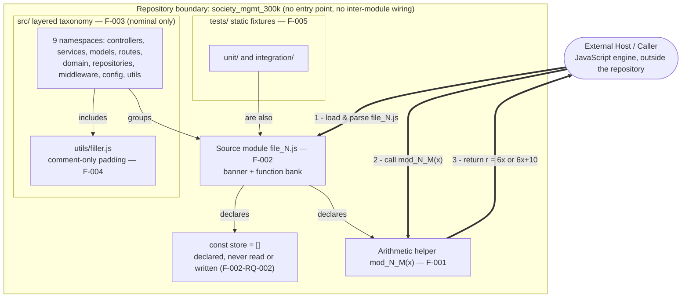

### 5.1.3 Data Flow Description

**Primary data flow.** The only data flow in the system is a single, synchronous, in-process function call. A numeric argument `x` enters an `mod_N_M(x)` helper, is transformed once, and a single `Number` result leaves the helper as its return value. As documented in **4.1.1**, control originates outside the repository, crosses the system boundary when the host loads a module, enters the function scope on invocation, and returns immediately. **No data flows between components:** because there are no imports or exports, a value produced by one helper is never routed to another module.

**Integration patterns and protocols.** There is no messaging, request/response, publish/subscribe, or event-streaming pattern. The sole "protocol" is the JavaScript in-language function-call convention (pass one argument, receive one return value). There is no serialization format (no JSON, XML, or protobuf), because nothing is transmitted beyond the process.

**Data transformation points.** Exactly one transformation exists, and it is identical in all 33,105 helpers: the accumulation `r += x*1; r += x*2; r += x*3` (equivalent to `r = 6x`), followed by the single conditional `if (r % 2 === 0) { r += 10 }`. This parity check is the only decision point in the entire 300,000-line corpus. For integer inputs `6x` is always even, so the result is `6x + 10`; for non-integer inputs where `6x` is odd (for example `x = 0.5 → 3`), the bonus is skipped and the result is `6x`.

**Key data stores and caches.** There are **none**. The only data structure in the corpus is the module-scoped `const store = []`, which is declared in every module but is never read from or written to (F-002-RQ-002); it is a vestigial placeholder, not a store. There is no in-memory cache, no session state, no database, and no file persistence — confirmed by the absence of any ORM/driver, cache client, or filesystem call (see **3.5 Databases & Storage**). Consequently, the system holds no state across calls: every invocation is independent and idempotent.

### 5.1.4 External Integration Points

The repository defines **no external integration surface whatsoever**. As recorded in **1.2.1** and **4.1.3**, inspection found no network calls, no environment-driven connection settings, no message brokers, and no third-party SDKs; every `.js` file is fully self-contained. The table below enumerates the external-system categories a reader might expect (both from a conventional housing-society platform and from a default technology stack) and records, with evidence, that none is present. No service-level agreement is defined for any category because the repository declares none anywhere.

| Candidate External System / Category | Integration Type & Protocol/Format | SLA Requirement | Status (Evidence) |
|---|---|---|---|
| HTTP / REST API consumers | Request/response over HTTP; JSON | None defined | **Absent** — no `http`/`express`/`router`/`req`/`res`/`fetch` in the corpus |
| Relational / NoSQL databases | Driver/ORM connection; SQL or BSON | None defined | **Absent** — no `mongoose`/`sequelize`/`pg`/`mysql`/`redis`; `store` array unused |
| Caches / message brokers | Client protocol (Redis, AMQP, Kafka) | None defined | **Absent** — no cache or queue client of any kind |
| SaaS / payment / email / SMS providers | Vendor SDK over HTTPS | None defined | **Absent** — no SDK imports, no `fetch`/`axios`, no API keys |
| Identity providers (OAuth / SSO / SAML) | OIDC/SAML token exchange | None defined | **Absent** — no authentication or authorization code |
| Cloud services / object storage | Cloud SDK; HTTPS | None defined | **Absent** — no cloud SDK, no `process.env`, no credentials |
| Package registries (npm, etc.) | Dependency manifest resolution | None defined | **Absent** — no `package.json` or lockfile (see **3.3**) |

Because there is no orchestration connecting modules, there is no multi-service choreography, no request fan-out, no publish/subscribe topology, and no batch window to document. The only interaction that exists is a host JavaScript engine loading a single module and invoking one `mod_N_M(x)` symbol in-process, as depicted in Section 5.1.2.

## 5.2 Component Details

    This section details each architecturally significant component identified in Section 5.1. Because the artifact is a synthetic corpus rather than a running application, the conventional attributes (purpose, technologies, interfaces, persistence, scaling) are documented against what each component *actually* is, and any attribute that does not apply is marked as such rather than invented. The components map one-to-one onto the features catalogued in **2.2 Feature Catalog** (F-001 through F-005).

### 5.2.1 Arithmetic Helper Function `mod_N_M(x)` (F-001)

**Purpose and responsibilities.** This is the only runtime component in the repository — the single unit of executable behavior. Each helper accepts one numeric argument, accumulates `x*1 + x*2 + x*3` (equivalent to `6x`), adds a fixed bonus of `10` when the accumulated value is even, and returns the result. There are **33,105 instances** of this function across the corpus, and every one is byte-identical after name normalization.

**Technologies and frameworks used.** Intrinsic ECMAScript only, at the ES2015 source floor documented in **3.1 Programming Languages**. The body uses nothing but the block-scoped declarations `let`/`const`, the arithmetic operators `*` and `+=`, the modulo operator `%`, and strict equality `===`. It references **no framework, no library, and not even a standard built-in object** such as `Math`, `JSON`, or `Date` (confirmed in **3.2**). A canonical instance is:

```javascript
function mod_0_0(x){ let r=0; r+=x*1; r+=x*2; r+=x*3; if(r%2===0){r+=10} return r; }
```

**Key interfaces and APIs.** The public surface is the function symbol itself: signature `mod_N_M(x) → Number`, synchronous and in-process. It takes a single positional argument and performs **no input validation** — non-numeric input follows standard JavaScript coercion (for example `null → 10`, `undefined → NaN`) rather than raising an error. There is no HTTP, RPC, or event interface.

**Data persistence requirements.** None. The function is pure and stateless: it reads no external state, mutates nothing (the module-scoped `store` array is never touched), performs no I/O, and holds nothing between calls.

**Scaling considerations.** Each call is **O(1)** constant-time work — three multiplications, three additions, one modulo, and at most one further addition (see **4.1.1**). Because the helpers are stateless and side-effect-free, they are inherently idempotent and embarrassingly parallel; however, since the repository provides no runtime, there is no throughput, concurrency, or service-scaling dimension to manage. The only scaling axis that actually exists is **source-corpus scale** — the 33,105 identical copies contribute to the fixed 300,000-line total (F-004), a parse-time/authoring concern rather than an execution concern.

The state-transition diagram below models the complete evaluation lifecycle of a single helper, including its one decision point and its return to a reusable, stateless idle condition.

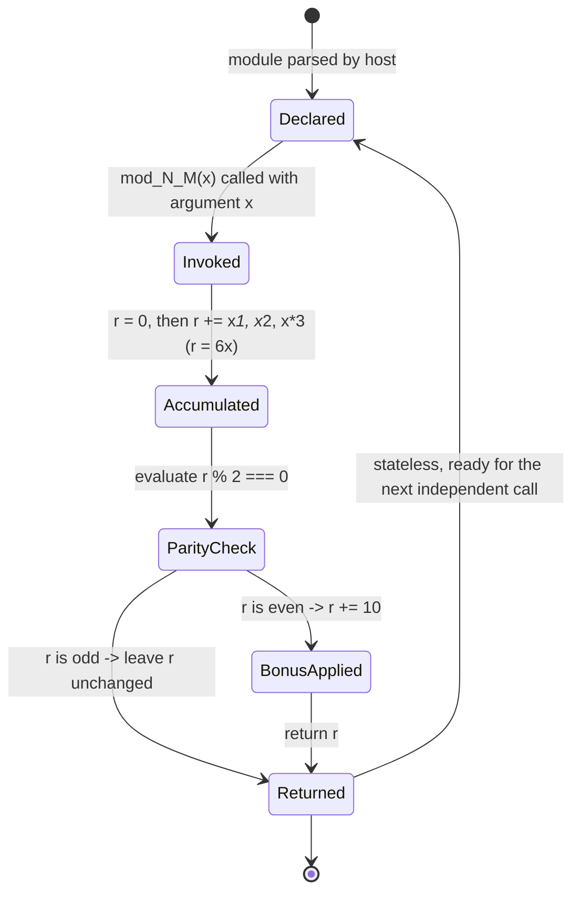

The sequence diagram below models a single invocation, including the parity branch and the explicit non-participation of any external actor.

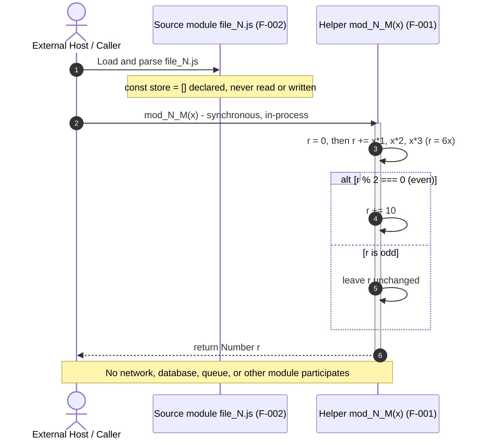

### 5.2.2 Source Module `file_N.js` (F-002)

**Purpose and responsibilities.** The source module is the unit of packaging: each `file_N.js` bundles one `// mod_N - society module` banner, one module-scoped `const store = []`, and a bank of `mod_N_M(x)` helpers. The template is uniform across all 28 modules — 27 modules contain exactly 1,200 helpers (10,802 lines), and `middleware/file_27.js` contains 705 helpers (6,347 lines).

**Technologies and frameworks used.** A plain `.js` text file consisting of top-level function declarations. It uses **no module system** — there is no `require`, `import`, `export`, or `module.exports` — so the module boundary is purely lexical/file-based, not a CommonJS or ES-module boundary.

**Key interfaces and APIs.** When a host JavaScript engine parses a module, its top-level symbols `mod_N_0 … mod_N_(K-1)` become resolvable in that scope; the module exposes them implicitly rather than through an export list. There is no initialization routine, constructor, or lifecycle hook.

**Data persistence requirements.** None. The `const store = []` array is the module's only data structure, and it is **declared but never read or written** (F-002-RQ-002) — it is a vestigial placeholder, not persistence.

**Scaling considerations.** Capability is added by adding more identical modules, not by growing an existing one; the per-module function count is fixed by generation. The module carries no runtime footprint of its own beyond being parsed by a host.

### 5.2.3 Layered Source Taxonomy `src/` (F-003)

**Purpose and responsibilities.** This component organizes the 25 source modules into nine conventionally named namespaces, giving the corpus the *appearance* of a layered application. The 28 module indices (`mod_0`…`mod_27`) are distributed across the eleven folders (nine `src/` namespaces plus the two `tests/` folders) in a round-robin fashion — for example `controllers/` holds `mod_0`, `mod_11`, `mod_22`; `services/` holds `mod_1`, `mod_12`, `mod_23`; `middleware/` holds `mod_5`, `mod_16`, `mod_27`.

**Technologies and frameworks used.** Filesystem directories only. No framework interprets these names, and no configuration maps a folder to a role (contrast with a framework that would auto-route `controllers/`); the taxonomy is nominal, as established in **3.2** and **2.5.3**.

**Key interfaces and APIs.** None at runtime. The taxonomy provides directory paths useful for traversal, static analysis, and human navigation, but the folders are not wired to one another and are not discovered by any loader.

**Data persistence requirements.** None — a directory layout stores no data.

**Scaling considerations.** Purely organizational: additional modules are slotted into the existing namespaces. There is no execution topology to scale, because the namespaces never call each other.

The component-interaction diagram below makes the defining architectural fact explicit — the namespaces are mutually isolated with **zero inter-module edges**, and the external host interacts with exactly one selected module at a time.

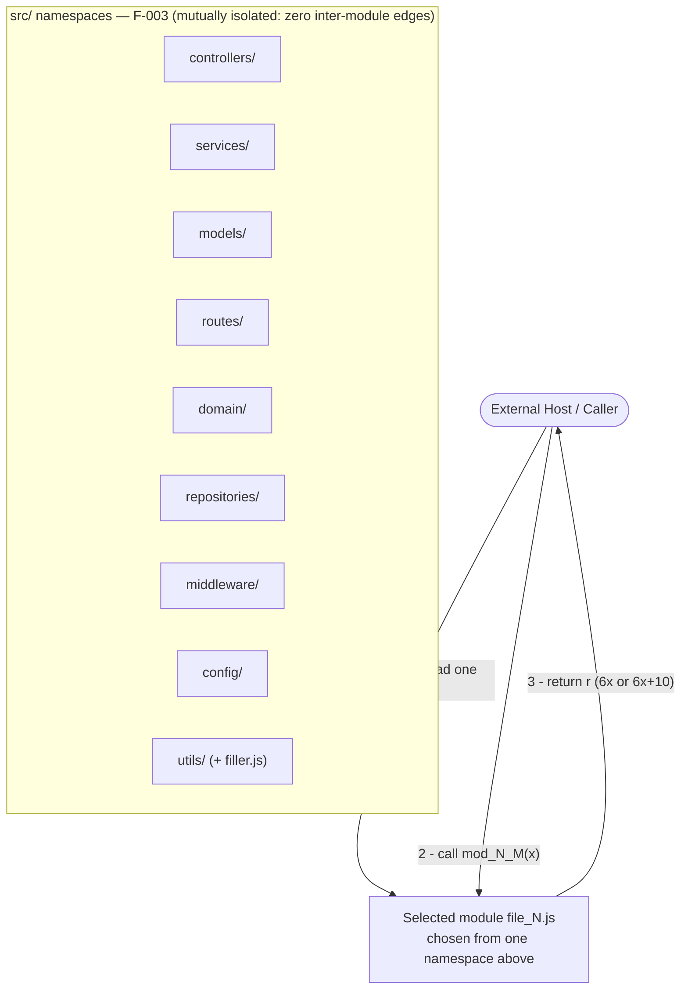

### 5.2.4 Corpus Padding `utils/filler.js` (F-004) and Static Test Fixtures `tests/` (F-005)

These two components are non-executable structural artifacts and are documented together.

**Purpose and responsibilities.**
- `utils/filler.js` (F-004) exists solely to pad the corpus to a round **300,000 lines**: it contributes 1,999 comment-only lines labeled `// filler 298001` through `// filler 299999`, complementing the 298,001 lines contributed by the 28 modules.
- `tests/` (F-005) provides `unit/` and `integration/` corpora — four files that are additional instances of the F-002 module template placed under a test-shaped directory tree.

**Technologies and frameworks used.**
- `filler.js` contains only `//` line comments and no executable JavaScript.
- The test fixtures use the identical plain-JavaScript template as `src/` and pull in **no test framework** — no Jest, Mocha, Jasmine, or Chai, and no `describe`/`it`/`expect`/`assert` (see **3.2**).

**Key interfaces and APIs.** None for either. `filler.js` is never loaded or referenced by any module, and the test fixtures are never discovered or executed by any runner (there is no CI stage, per **3.6**).

**Data persistence requirements.** None for either component.

**Scaling considerations.** `filler.js` is the corpus's **sizing lever** — its comment count is what pins the total to exactly 300,000 lines, so it scales inversely with the module line-count to preserve that invariant. The test fixtures scale only as a static fixture corpus; they add no executable coverage.

## 5.3 Technical Decisions

This section documents the technical decisions that are **evidenced by the artifact itself** and analyzes their tradeoffs. Because the repository ships no design document, requirements specification, or ADR log, the "decisions" recorded here are inferred strictly from observable structural facts (folder taxonomy, module template, absence of wiring/persistence/security). Where a conventional decision category (communication protocol, storage engine, caching tier, security mechanism) has no corresponding implementation, that is reported as a deliberate *omission* with its rationale and tradeoff, not fabricated.

### 5.3.1 Architecture Style Decision and Tradeoffs

**Decision.** The artifact adopts a **nominal layered directory taxonomy layered over a flat set of mutually isolated, stateless pure-function modules**. The nine `src/` namespaces provide the appearance of an n-tier application (F-003), while the realized units are 28 self-contained `file_N.js` modules (F-002) that never reference one another.

**Rationale (evidence-based).** This style is consistent with a corpus that was *generated and bulk-uploaded* (single "Add files via upload" commit, per **3.6**) and engineered for exact size (F-004) and uniformity (F-002). Optimizing for deterministic parse-ability and static-analysis friendliness — rather than for runtime execution — explains the combination of recognizable architectural folder names with completely decoupled, dependency-free module contents.

**Tradeoffs.** The following table weighs the consequences of this style.

| Dimension | Benefit of the Chosen Style | Cost / Limitation |
|---|---|---|
| Simplicity & portability | Zero dependencies; any ES2015 engine can parse it; no build step | Not runnable as an application; no entry point exists |
| Coupling & analyzability | Perfect isolation — each module is independently parseable | No composability, reuse, or cross-module behavior |
| Determinism & uniformity | 33,105 identical helpers → highly predictable for tooling | Massive duplication; the taxonomy misleads about behavior |
| Operational surface | No framework/CVE/supply-chain surface (see **3.6**) | No operational capability at all (no service, data, or API) |

The decision tree below traces how the artifact's evident goal resolves into each observed omission. Every branch resolves "No", which is why the conventional application layers are absent.

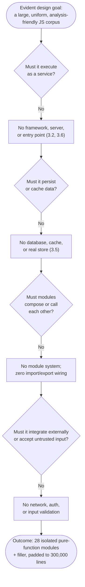

### 5.3.2 Communication, Storage, Caching, and Security Decisions

Each of the following decision areas resolves to a deliberate omission that is directly supported by whole-corpus inspection.

- **Communication pattern.** The only communication mechanism is the **in-process, synchronous JavaScript function call** (`mod_N_M(x)` → `Number`). There is no inter-process communication, HTTP, RPC, message queue, or event bus, because there is no multi-component runtime to connect. *Tradeoff:* the simplest possible interaction model, at the cost of any distribution, asynchrony, or fan-out capability.
- **Data storage solution.** **No storage engine is selected.** The only data structure is the per-module `const store = []`, which is never read or written (F-002-RQ-002). Pure computation of `6x (+10)` needs no persistence. *Tradeoff:* zero storage-operations surface, but no ability to retain or query any data (see **3.5 Databases & Storage**).
- **Caching strategy.** **No caching is implemented, and none is warranted.** Each helper is O(1) and referentially transparent, so memoization would add memory and complexity for no latency benefit; the artifact also has no runtime in which a cache could live. *Tradeoff:* nothing to invalidate or warm, but equally no cache-assisted throughput (which is moot without a runtime).
- **Security mechanism.** **No security controls are present** — no authentication, authorization, input validation, secret handling, transport security, or dependency trust management (see **5.4.3**). The rationale is that the artifact exposes no attack surface: there is no server to reach, no data to protect, no credentials, and no trust boundary at runtime. *Tradeoff:* the empty attack surface is a genuine security benefit for the artifact as shipped, but the helpers provide **no guardrails** (no validation, no `try`/`catch`) should they ever be embedded in a context that feeds them untrusted input.

The summary table consolidates these decisions.

| Decision Area | Observed Choice | Primary Rationale (Evidence-Based) |
|---|---|---|
| Communication | In-process synchronous function call only | No multi-component runtime exists to connect (4.1.3) |
| Data storage | None (`store` placeholder unused) | Pure stateless computation needs no persistence (3.5) |
| Caching | None | Deterministic O(1) helpers gain nothing; no runtime host |
| Security | None (no authn/authz/validation) | No network, data, or trust boundary → empty attack surface |

### 5.3.3 Architecture Decision Records (ADRs)

The repository contains no formal ADR log; the register below reconstructs the implicit decisions from observed evidence and records their status as **Accepted (as-built)**, since each is realized in the shipped corpus. Consequences are stated in terms of the tradeoffs analyzed above.

| ADR | Decision | Status | Key Consequences |
|---|---|---|---|
| ADR-01 | Use a layered directory taxonomy (`controllers/`, `services/`, …) with **no backing framework** | Accepted (as-built) | Familiar navigation and analysis structure; folder names do not reflect runtime behavior (nominal only) |
| ADR-02 | Omit any module system — **no `import`/`export`/`require`** | Accepted (as-built) | Perfect module isolation and zero coupling; no composability, reuse, or entry point |
| ADR-03 | Implement one **uniform pure-function template** (`mod_N_M(x)` returning `6x`/`6x+10`) | Accepted (as-built) | Fully deterministic and analyzable; 33,105-fold duplication with no functional variety |
| ADR-04 | Exclude **persistence, caching, and all external integrations** | Accepted (as-built) | No infrastructure or supply-chain surface (3.4–3.6); no data or integration capability |
| ADR-05 | Omit **authentication, authorization, input validation, and error handling** | Accepted (as-built) | Empty attack surface as shipped; no runtime guardrails if ever fed untrusted input |
| ADR-06 | Fix the corpus at **exactly 300,000 lines** using `utils/filler.js` padding (F-004) | Accepted (as-built) | Predictable, benchmark-friendly size; filler lines are inert dead weight |
| ADR-07 | Apply **dual licensing** — Apache-2.0 at root, MIT for the subproject | Accepted (as-built) | Permissive downstream reuse; two license notices must be reconciled by consumers |

## 5.4 Cross-Cutting Concerns

Cross-cutting concerns are documented here **exactly as implemented**. For a synthetic, non-executing corpus, most conventional cross-cutting mechanisms are absent; each is reported with its supporting evidence rather than assumed. The two genuinely applicable concerns — computational performance characteristics and source-level resilience — are documented with the observable facts that do exist.

### 5.4.1 Monitoring, Observability, Logging, and Tracing

**No monitoring, observability, logging, or tracing capability is present in the repository.** Whole-corpus inspection returns **zero occurrences of `console.`**, and there is no logging library, no metrics/telemetry SDK (no Prometheus, OpenTelemetry, or StatsD client), no distributed-tracing instrumentation, and no health-check or heartbeat endpoint. This is consistent with the absence of any runtime to observe (there is no process, server, or entry point). The only "observability" available is **static**: reading the source, computing line counts, and inspecting version history.

| Concern | Status | Evidence |
|---|---|---|
| Application logging | Absent | Zero `console.*`; no logging library imported |
| Metrics / telemetry | Absent | No metrics SDK; no counters, gauges, or exporters |
| Distributed tracing | Absent | No trace/span instrumentation; nothing to correlate |
| Health checks / uptime | Absent | No endpoint or runtime process to probe |

### 5.4.2 Error Handling

**No error-handling machinery exists.** Inspection confirms **zero occurrences of `try`, `catch`, `throw`, or `finally`** across the entire corpus, and the helpers perform no input validation. There is therefore no exception handling, no retry logic, no fallback path, no circuit breaker, and no error-notification or recovery flow anywhere.

The consequence is that a helper **never raises an error by design**. Because the sole conditional is the parity check, invalid input is not rejected — it propagates through standard JavaScript coercion. For example, a non-numeric argument yields `NaN` silently (the `NaN % 2 === 0` test is `false`, so the bonus is skipped and `NaN` is returned) rather than throwing. This is *language-default behavior, not implemented error handling*.

The following diagram makes the (empty) error-handling picture explicit: the only branch in the function is the parity decision, and there is no error branch to any recovery, retry, or notification step.

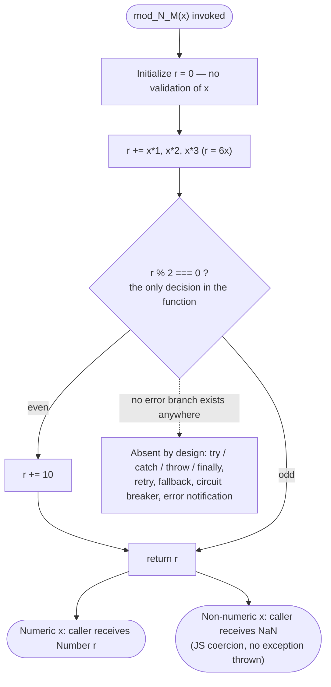

### 5.4.3 Authentication and Authorization

**No authentication or authorization framework is present.** There is no identity concept, no user or role model, no credential handling, no token or session management, no access-control checks, and no secret storage (there is not even a `process.env` reference). This follows directly from the artifact having no protected resource, no network interface, and no users to authenticate.

| AuthN/AuthZ Concern | Status | Evidence |
|---|---|---|
| Authentication (identity) | Absent | No login, tokens, sessions, or identity provider integration |
| Authorization (access control) | Absent | No roles, permissions, or policy checks; no protected resource |
| Secret / credential management | Absent | No `process.env`, config, or secret store; git history holds no secrets (3.6) |

### 5.4.4 Performance and Service-Level Considerations

**No service-level agreements, latency budgets, throughput targets, or availability objectives are defined anywhere in the repository** (consistent with **4.1.1** and **2.3.1**). Because the artifact is not a runnable service, conventional runtime SLAs cannot be sourced from it and none are invented. What can be stated objectively are the algorithmic properties of the one executable component and the corpus-scale properties relevant to tooling.

- **Per-call performance:** each `mod_N_M(x)` performs **O(1) constant-time** work — three multiplications, three additions, one modulo, and at most one further addition — with no allocation, I/O, or blocking (see **5.2.1**).
- **Determinism:** identical inputs always produce identical outputs, so performance is uniform and jitter-free across all 33,105 helpers.
- **Corpus-scale consideration:** the only "at scale" cost is **parsing and traversing the fixed 300,000-line corpus** (F-004) by a host engine or analysis tool — a one-time authoring/tooling concern, not a runtime throughput concern.
- **Absent:** there are no load tests, benchmarks, performance budgets, or capacity plans in the repository.

| Performance Property | Observed Value | Notes |
|---|---|---|
| Per-call time complexity | O(1) constant time | Fixed arithmetic; no loops or recursion |
| Runtime SLA / latency / throughput | None defined | Not a service; no targets exist (4.1.1) |
| Corpus size | Exactly 300,000 lines | Parse/traversal cost is a tooling concern (F-004) |

### 5.4.5 Disaster Recovery and Resilience

**The repository defines no disaster-recovery procedure, backup policy, high-availability topology, failover, or replication** — there is no runtime or data plane for such mechanisms to protect, and no RTO/RPO is stated. The resilience posture is instead a property of the artifact's nature and its version control:

- **Source recoverability via version control.** As documented in **3.6 Development & Deployment**, the subject source is tracked in **Git** (branch `06-Jul-2026-Br2`), with the corpus captured as a bulk upload. Version control is the sole recovery mechanism and it protects only the source text, which is fully reconstructable from history.
- **Statelessness eliminates data-loss risk.** Because every helper is pure and stateless and the `store` placeholder is unused, there is **no runtime state or persisted data to lose**; recovery of "data" is therefore not applicable.
- **Determinism enables trivial reproducibility.** Given the same source, any ES2015-compliant engine reproduces identical results, so there is no environment-specific state to restore.
- **Zero dependencies removes external failure modes.** With no third-party libraries, services, databases, or network calls (see **3.3–3.5**), there is no dependency-availability, supply-chain, or connectivity failure mode to plan around.

| DR / Resilience Concern | Status | Basis |
|---|---|---|
| Backup / restore of source | Provided by Git version control | Source is fully recoverable from history (3.6) |
| Runtime data recovery (RTO/RPO) | Not applicable | No runtime state or persisted data exists |
| High availability / failover | Absent | No service or runtime to make highly available |
| Dependency / connectivity failure | Not applicable | Zero external dependencies or network calls (3.3–3.5) |

## 5.5 References

All architectural claims in Section 5 are grounded in direct inspection of the repository and cross-referenced against previously authored specification sections. No external web sources were required.

**Repository files and folders inspected**

- `society_mgmt_300k/` - the primary application tree (`src/`, `tests/`, `LICENSE/`); confirmed no `package.json`, config, `.env`, Dockerfile, or CI files anywhere.
- `society_mgmt_300k/src/` - the layered source taxonomy (F-003); nine namespaces `controllers/`, `services/`, `models/`, `routes/`, `domain/`, `repositories/`, `middleware/`, `config/`, `utils/` holding 25 `.js` modules.
- `society_mgmt_300k/src/controllers/file_0.js` - canonical module read; established the `// mod_N - society module` banner, unused `const store = []`, and the byte-identical `mod_N_M(x)` helper body (F-001, F-002).
- `society_mgmt_300k/src/utils/file_15.js` - confirmed the identical template in a second namespace.
- `society_mgmt_300k/src/services/file_1.js` and `society_mgmt_300k/src/services/file_12.js` - confirmed the two byte-size variants differ only by module-number digit count (1,200 helpers each; `mod_N_1199` terminal function).
- `society_mgmt_300k/src/middleware/file_27.js` - the smaller module (705 helpers, 6,347 lines) that breaks the uniform 1,200-per-module count.
- `society_mgmt_300k/src/utils/filler.js` - comment-only padding (F-004); 1,999 lines labeled `// filler 298001`…`// filler 299999`; zero functions.
- `society_mgmt_300k/tests/` - static fixture tree (F-005); `unit/` and `integration/` folders.
- `society_mgmt_300k/tests/unit/file_9.js` - confirmed the test fixtures reuse the same module template with no runner or assertions.
- `society_mgmt_300k/LICENSE/LICENSE.txt` - MIT License (subproject).
- `LICENSE` - root Apache License 2.0.
- `README.md` - root landing document containing only the title `Society_Mngt_26-Jun-2026-Afternoon`.

**Whole-corpus verification performed**

- Absence checks (grep, all counts = 0): `require`, `import`, `export`, `module.exports`, `class`, `async`, `await`, `new Promise`, arrow `=>`, `express`/`http`/`fetch`/`axios`, `mongoose`/`sequelize`/`pg`/`mysql`/`redis`, `app.get`/`app.post`/`router`, `process.env`, `console.`, `try`/`catch`/`throw`/`finally`; `store` array never read or written.
- Size checks: total 300,000 lines across 29 `.js` files; per-file function counts (1,200 per full module, 705 in `middleware/file_27.js`, 0 in `filler.js`); 33,105 identical helper bodies.

**Cross-referenced Technical Specification sections**

- `1.2 System Overview` - canonical "synthetic corpus / nominal-vs-as-implemented" framing, structural composition, 300,000-line total, and absence of runtime/persistence/integration.
- `2.2 Feature Catalog` - feature identifiers F-001 through F-005 used as component labels throughout Section 5.
- `2.3 Functional Requirements` - `mod_N_M(x)` computation requirements (F-001-RQ-002 bonus) and the "sole conditional in the corpus" (2.3.1).
- `2.5 Implementation Considerations` - confirmation that the layered taxonomy is nominal only (2.5.3).
- `3.1 Programming Languages` - the ES2015 source-language floor and engine-agnostic subset.
- `3.2 Frameworks & Libraries` - confirmation that no framework or library is present.
- `3.3 Open Source Dependencies` - confirmation of zero third-party dependencies.
- `3.4 Third-Party Services` - confirmation of no external services or integrations.
- `3.5 Databases & Storage` - confirmation of no database, cache, or persistence.
- `3.6 Development & Deployment` - Git-only version control (branch `06-Jul-2026-Br2`, bulk-upload history), absence of build/CI/IaC/containerization, dual licensing, and empty deployment surface.
- `4.1 System Workflows` - the single in-process invocation workflow, O(1) per-call timing, and absence of orchestration/integration workflows (4.1.1, 4.1.3).
- `4.2 Flowchart Requirements and Validation Rules` - confirmation that no SLA/latency/throughput target is defined (4.2.1).

# 6. SYSTEM COMPONENTS DESIGN

## 6.1 Core Services Architecture

### 6.1.1 Applicability Determination

**Core Services Architecture is not applicable for this system.**

The subject artifact, `society_mgmt_300k/`, is a **synthetic corpus of exactly 300,000 lines of JavaScript**, not a runnable, service-oriented, or distributed application. It contains no microservices, no independently deployable service components, and no distributed runtime of any kind. This determination applies the same "nominal intent versus as-implemented reality" discipline used throughout **5. System Architecture**, and every point below is grounded in whole-corpus inspection of the 29 `.js` files.

The following facts establish the absence of any core services architecture:

- **No service processes and no runtime.** There is no entry point (no `index.js`, `server.js`, `app.js`, or `package.json` `main`), no server, and no long-running process to host a service. The initiating Host/Caller is external to the repository (see **5.1.1 System Overview**).
- **No inter-module wiring.** Whole-corpus inspection returns **zero** occurrences of `require`, `import`, `export`, and `module.exports`; the 28 module files are mutually isolated with zero edges between them (see **5.1.1** and ADR-02 in **5.3.3**).
- **No network or inter-process communication.** There are **zero** occurrences of `http`, `express`, `listen(`, `fetch(`, `axios`, `grpc`, or `socket`; the only interaction that exists is an in-process synchronous JavaScript function call (see **5.3.2**).
- **No distributed infrastructure.** There are **zero** occurrences of message-broker or cache clients (`kafka`, `rabbit`, `amqp`, `redis`), and no service registry, load balancer, or API gateway anywhere in the tree (see **5.1.4 External Integration Points**).
- **No orchestration or deployment topology.** Git is the only tooling present; there is no containerization, CI/CD, or infrastructure-as-code (see **3.6 Development & Deployment**).

The nine `src/` namespaces — `controllers/`, `services/`, `models/`, `routes/`, `domain/`, `repositories/`, `middleware/`, `config/`, and `utils/` — evoke a layered or microservice-style application by naming alone, but this taxonomy is **nominal only** (Feature F-003). The `services/` folder does not contain runtime services; it holds the same deterministic arithmetic stubs (`mod_N_M(x)`) found in every other namespace. The realized system is a decoupled collection of standalone modules with no composition — it is not even a conventional single-process monolith, because a monolith still requires an entry point and internal wiring, both of which are absent. As documented in **5.3.1**, the architecture-style decision tree resolves every branch — "Must it execute as a service?", "Must modules compose or call each other?", and "Must it integrate externally?" — to **No**.

The three areas requested for this section are therefore each not applicable, as summarized below and detailed with evidence in **6.1.2** through **6.1.4**.

*Table 6.1.1-1: Applicability of Core Services Architecture areas*

| Prompt Area | Applicable? | Basis (Evidence) |
|---|---|---|
| Service Components (6.1.2) | Not applicable | No services or processes; zero inter-module wiring; in-process function call only (5.1.4, 5.3.2) |
| Scalability Design (6.1.3) | Not applicable | No runtime to scale; fixed static corpus; no orchestrator or autoscaler (3.6, 5.4.4) |
| Resilience Patterns (6.1.4) | Not applicable | No runtime or data plane; no failover or replication; Git is the only recovery path (5.4.5) |

Sections **6.1.2**–**6.1.4** record each constituent concern of the three areas as not applicable with its supporting evidence, and include the requested Mermaid diagrams (service interaction, scalability architecture, and resilience patterns) for completeness and for explicit contrast with what a conventional distributed platform would provide.

### 6.1.2 Service Components

Because the artifact exposes no services, every service-component concern requested for this section is not applicable. Each is recorded below with the specific evidence that establishes its absence, followed by a labeled diagram of the single interaction that does exist.

*Table 6.1.2-1: Service-component concerns (all not applicable)*

| Concern | Status | Evidence / Basis |
|---|---|---|
| Service boundaries & responsibilities | Not applicable | No deployable services exist; the only boundary is the repository itself. The nine `src/` namespaces are nominal (F-003) and all contain identical `mod_N_M(x)` stubs (**5.1.1**, **5.1.2**) |
| Inter-service communication patterns | Not applicable | Zero `require`/`import`/`export`; the sole mechanism is an in-process synchronous function call — no HTTP, RPC, message queue, or event bus (**5.3.2**) |
| Service discovery mechanisms | Not applicable | No services to register or resolve; no registry, DNS-based discovery, or config server (there is not even a `process.env` reference) |
| Load balancing strategy | Not applicable | No network endpoints, replicas, or traffic to distribute; no load balancer, reverse proxy, or gateway (**5.1.4**) |
| Circuit breaker patterns | Not applicable | No remote or cross-service calls to protect; zero dependency clients; no breaker library present |
| Retry & fallback mechanisms | Not applicable | No fallible I/O to retry; zero `try`/`catch`/`throw`; the helpers never fail by design (**5.4.2**) |

The diagram below labels the realized interaction model. Only the in-process call path exists; the conventional distributed components a reader might expect are grouped as explicitly absent, with no connections because they are not present in the repository.

*Diagram 6.1.2-1: Realized service-interaction model — a single in-process function call, with conventional distributed service components shown as absent.*

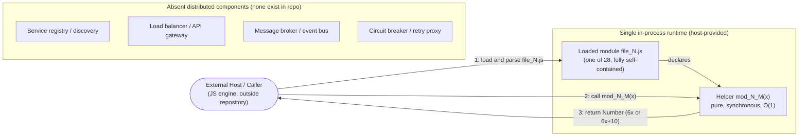

As recorded in **5.1.4 External Integration Points**, no external integration surface exists and no service-level agreement is defined for any category. Consequently there is no multi-service choreography, request fan-out, or publish/subscribe topology to document — the only "communication" is a host engine invoking a single `mod_N_M(x)` symbol in-process and receiving one `Number` in return (**5.3.2**).

### 6.1.3 Scalability Design

The artifact is not a runnable service, so runtime scaling concerns do not apply. The only scale-related property that exists is the **fixed corpus size** (Feature F-004) — exactly 300,000 lines across 29 files (27 modules of 10,802 lines, `src/middleware/file_27.js` of 6,347 lines, and `src/utils/filler.js` of 1,999 comment-only lines). This is a static authoring and tooling property, not a runtime capacity concern (see **5.4.4 Performance and Service-Level Considerations**).

*Table 6.1.3-1: Scalability concerns (all not applicable)*

| Concern | Status | Evidence / Basis |
|---|---|---|
| Horizontal scaling approach | Not applicable | No process or replica set exists; no orchestrator (no containerization, CI/CD, or IaC — **3.6**) |
| Vertical scaling approach | Not applicable | No running process to which CPU or memory could be allocated |
| Auto-scaling triggers & rules | Not applicable | No metrics or telemetry are emitted (**5.4.1**) and no scaler exists to consume them; no thresholds defined |
| Resource allocation strategy | Not applicable | No runtime resources are requested or reserved; no configuration (there is no `process.env`) |
| Performance optimization | Optimal by construction (nothing to tune) | Each helper is O(1) constant-time and referentially transparent; caching would add cost for no benefit (**5.3.2**, **5.4.4**) |
| Capacity planning guidelines | Not applicable | No load, throughput, or availability targets, benchmarks, or capacity plans exist anywhere (**5.4.4**) |

The one objective statement that can be made about "scale" is that the corpus is fixed at exactly 300,000 lines, so the only cost that grows with the artifact is a one-time **parse and traversal** by a host engine or static-analysis tool. Because every one of the 33,105 helpers is pure and stateless, a host that ever required more compute throughput could run any number of independent copies with zero coordination; however, the repository itself provides **no orchestrator, autoscaler, resource policy, or capacity plan** to do so. The diagram below labels this static-artifact model and the scaling infrastructure that is absent.

*Diagram 6.1.3-1: Scalability architecture — a fixed static corpus parsed by host-provided compute, with all runtime scaling infrastructure shown as absent.*

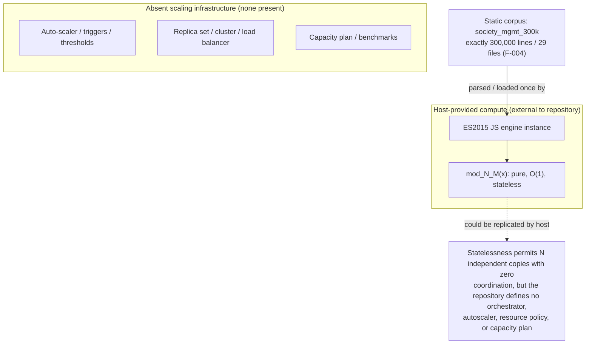

In short, there is nothing to scale horizontally or vertically because there is no runtime; the artifact's only "scaling" dimension is its fixed line count, and its computational cost per invocation is constant and already minimal (**5.4.4**).

### 6.1.4 Resilience Patterns

With no runtime, no data plane, and no external dependencies, conventional resilience patterns have nothing to protect and are therefore absent (consistent with **5.4.5 Disaster Recovery and Resilience**). Each requested concern is recorded below as not applicable with its evidence.

*Table 6.1.4-1: Resilience-pattern concerns (all not applicable at runtime)*

| Concern | Status | Basis / Evidence |
|---|---|---|
| Fault tolerance mechanisms | Not applicable | No process or dependency can fail at runtime; zero `try`/`catch`/`throw`; helpers never raise by design (**5.4.2**) |
| Disaster recovery procedures | Not applicable at runtime; source recoverable via Git | No DR runbook, RTO, or RPO; the subject source is tracked in Git and is fully reconstructable (**3.6**, **5.4.5**) |
| Data redundancy approach | Not applicable | No persisted data or state to replicate; the `store` array is declared but never read or written (F-002-RQ-002, **3.5**) |
| Failover configuration | Not applicable | No service instances, clusters, or standby nodes exist to fail over between (**5.1.4**) |
| Service degradation policies | Not applicable | No service tiers or graceful-degradation paths; no load-shedding, timeouts, bulkheads, or circuit breakers |

The helpers cannot fail by design: the only control-flow construct in the entire corpus is a single parity check, and there is no validation, exception handling, or I/O that could throw. The canonical body illustrates this — it contains no `try`/`catch`/`throw` and always returns a value:

```javascript
function mod_N_M(x){ let r=0; r+=x*1; r+=x*2; r+=x*3; if(r%2===0){r+=10} return r; }
```

Rather than runtime resilience, the artifact's posture is a property of its **nature and version control**, as established in **5.4.5**:

- **Statelessness eliminates data-loss risk.** Every helper is pure and stateless and the `store` placeholder is unused, so there is no runtime state or persisted data to lose.
- **Determinism enables trivial reproducibility.** Given the same source, any ES2015-compliant engine reproduces identical results, so there is no environment-specific state to restore.
- **Zero dependencies removes external failure modes.** With no third-party libraries, services, databases, or network calls (see **3.3**–**3.5**), there is no dependency-availability, supply-chain, or connectivity failure mode to plan around.
- **Git version control is the sole recovery mechanism.** The source (branch `06-Jul-2026-Br2`) is fully recoverable from history, but this protects only the source text — not any runtime, because none exists (**3.6**).

The diagram below labels the realized source-level resilience posture against the runtime resilience mechanisms that are absent.

*Diagram 6.1.4-1: Resilience pattern implementation — source-level recoverability and statelessness (realized) versus absent runtime resilience mechanisms.*

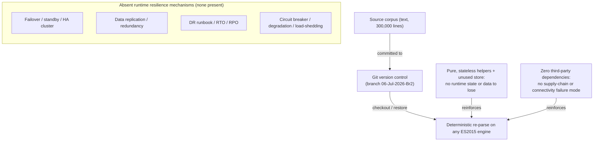

In summary, no fault-tolerance, disaster-recovery, redundancy, failover, or degradation machinery exists because there is no service or data to protect; the artifact's resilience reduces to source recoverability via Git plus the inherent robustness of stateless, dependency-free, deterministic code (**5.4.5**).

### 6.1.5 References

**Repository files and folders examined for this section**

- `society_mgmt_300k/` - the entire project tree (`src/`, `tests/`, `LICENSE/`); established that the artifact is the whole system boundary with no external surface
- `society_mgmt_300k/src/` - the nine nominal namespaces (`controllers/`, `services/`, `models/`, `routes/`, `domain/`, `repositories/`, `middleware/`, `config/`, `utils/`); confirmed the layered folder taxonomy is name-only
- `society_mgmt_300k/src/controllers/file_0.js` - representative module (mod_0): banner, unused `const store = []`, and 1,200 identical `mod_0_M(x)` helpers
- `society_mgmt_300k/src/services/file_1.js` - a `services/` namespace module identical in form, confirming `services/` hosts arithmetic stubs rather than runtime services
- `society_mgmt_300k/src/middleware/file_27.js` - the single smaller module (6,347 lines, 705 functions), part of the exact 300,000-line total
- `society_mgmt_300k/src/utils/filler.js` - 1,999 comment-only padding lines (`// filler 298001`…`299999`); confirmed inert
- `society_mgmt_300k/tests/` - `unit/` and `integration/` static fixtures with no test runner, assertions, or imports
- `society_mgmt_300k/LICENSE/LICENSE.txt` - subproject MIT license; `LICENSE` (repo root) - Apache-2.0; `README.md` (repo root) - title-only banner

**Whole-corpus verification (terminal inspection)**

- Exactly **300,000 lines** across 29 `.js` files; **33,105 functions** with a byte-identical body (`r += x*1; r += x*2; r += x*3; if(r%2===0){r+=10}; return r;`)
- **Zero** occurrences across the corpus of: `require`, `import`, `export`, `module.exports`, `http`, `express`, `listen(`, `fetch(`, `axios`, `grpc`, `socket`, `kafka`, `rabbit`, `amqp`, `redis`, `process.env`, `setInterval`, `setTimeout`, `async`, `await`, `Promise`, `try`, `catch` — establishing the absence of services, networking, orchestration, concurrency, and error handling

**Cross-referenced Technical Specification sections**

- **1.2 System Overview** - framing of the repository as a synthetic source corpus
- **1.3 Scope** - confirmation that no end-user workflows, runtime, or integrations are in scope
- **3.5 Databases & Storage** - no database, cache, or persistence; `store` is unused
- **3.6 Development & Deployment** - Git-only version control; no containerization, CI/CD, or IaC; ES2015 engine is the only runtime need
- **5.1 High-Level Architecture** - nominal-vs-realized architecture, absence of an entry point, and the "no external integration / no SLA" enumeration (5.1.4)
- **5.3 Technical Decisions** - architecture-style decision tree (5.3.1), in-process-call communication decision (5.3.2), and ADR-02/04/05 (5.3.3)
- **5.4 Cross-Cutting Concerns** - no monitoring (5.4.1), no error handling (5.4.2), no SLA or capacity plan (5.4.4), and no disaster recovery, failover, or replication (5.4.5)

## 6.2 Database Design

### 6.2.1 Applicability Determination

**Database Design is not applicable to this system.**

The subject artifact, `society_mgmt_300k/`, is a synthetic corpus of exactly 300,000 lines of JavaScript that performs no data persistence of any kind. It defines no database, no schema, no data model, no object/relational mapping, no query, no migration, and no caching or storage layer. This determination restates, in database terms, the "No persistence" finding of **Section 1.2.1**, the persistence/database "absent" scope entry of **Section 1.3**, and the storage analysis of **Section 3.5**; every point below is grounded in whole-corpus inspection of the 29 `.js` files.

The following facts establish the total absence of a database:

- **No datastore of any category.** Whole-corpus inspection returns **zero** occurrences of any relational, document, key-value, graph, or time-series client, driver, ORM, or ODM (no `mongoose`, `sequelize`, `typeorm`, `prisma`, `knex`, `pg`, `mysql`, `sqlite`, or `redis`) and **zero** SQL keywords (`SELECT`, `INSERT`, `PRIMARY KEY`, `FOREIGN KEY`). The MongoDB datastore named in the project's default technology stack does not appear anywhere in the code (**Section 3.5**).
- **No connection or configuration.** There is no connection string, URI, datasource, credential, or `process.env` reference, and no `package.json`, `.env`, YAML, or any configuration file in the tree from which a datastore could be wired (**Section 1.2.1**).
- **No schema or migrations.** There are no DDL files, schema definitions, entity/model classes, or migration scripts anywhere; the `models/` namespace defines no data schema (**Section 1.2.2**).
- **The only data structure is dead code.** Each of the 28 module files declares one module-scoped `const store = [];` and never reads or writes it — **28 declarations, 0 references**. It is an unused in-memory array, not a database, cache, or buffer (Feature **F-002**, **Section 2.5.2**).
- **No I/O.** There is no file, network, or process I/O anywhere — zero `fs`, `http`, `fetch`, `async`, `await`, or `Promise` — so no data is ever read from or written to any store, durable or in-memory (**Section 1.2.2**).

The nine `src/` namespaces — including `models/`, `repositories/`, and `config/`, whose names most strongly imply persistence — are **nominal only** (Feature **F-003**). The `repositories/` folder contains no data-access logic, `models/` defines no entities, and `config/` holds no connection settings; all three contain the same deterministic arithmetic stubs (`mod_N_M(x)`) found in every other namespace (**Sections 1.2.2, 2.5.3**). Because there is no persisted data, there is no schema to model, no index or constraint to define, no partition or replica to configure, no migration to version, and no query to optimize.

The four areas requested for this section are therefore each not applicable, as summarized below and detailed with evidence in **Sections 6.2.2 through 6.2.5**. The requested Mermaid diagrams — an entity-relationship diagram, a data-flow diagram, and a replication-architecture diagram — are included in those sub-sections for completeness and to contrast the realized artifact with what a conventional persistence layer would provide.

*Table 6.2.1-1: Applicability of Database Design areas*

| Prompt Area | Applicable? | Basis (Evidence) |
|---|---|---|
| Schema Design (6.2.2) | Not applicable | No datastore, schema, entities, indexes, partitions, or replicas; only an unused `store` array (3.5, 2.5.2) |
| Data Management (6.2.3) | Not applicable | No migrations, versioned data, archives, storage/retrieval, or cache; `store` is never read or written (1.2.1, 3.5) |
| Compliance Considerations (6.2.4) | Not applicable | No data at rest, no PII, no credentials; nothing to retain, protect, audit, or access-control (3.5, 5.4.5) |
| Performance Optimization (6.2.5) | Not applicable | No queries, connections, replicas, or batches to tune; helpers are O(1) and stateless (5.4.4, 2.5.1) |

### 6.2.2 Schema Design

Because the corpus persists no data, there is no database schema to design. Every schema-design concern requested for this section — entity relationships, data models, indexing, partitioning, replication, and backup — is not applicable. Each is recorded below with the specific evidence that establishes its absence.

*Table 6.2.2-1: Schema-design concerns (all not applicable)*

| Concern | Status | Evidence / Basis |
|---|---|---|
| Entity relationships | Not applicable | No entities exist; `models/` and `domain/` define no schema, classes, or relations — only `mod_N_M(x)` stubs (1.2.2) |
| Data models & structures | Not applicable | The sole data-structure declaration is an unused `const store = []` (dead code); no records, documents, or fields are defined (2.5.2) |
| Indexing strategy | Not applicable | No tables or collections to index; zero index declarations in the corpus |
| Partitioning approach | Not applicable | No dataset to partition, shard, or range; no partition keys or sharding logic present |
| Replication configuration | Not applicable | No datastore to replicate; no primary/replica, WAL, or oplog configuration exists (5.4.5) |
| Backup architecture | Not applicable | No data at rest to back up; the only recoverable asset is the source text via Git (3.6, 5.4.5) |

**Entity relationships and data models.** A conventional society-management schema would model entities such as members, units, dues, and maintenance requests; none of these — nor any other entity — exist in the repository (**Section 1.2.1**). The `models/`, `domain/`, and `repositories/` namespaces that would normally host such definitions contain only the uniform arithmetic helper `mod_N_M(x)` and declare no classes, no object schemas, and no relationships (**Section 1.2.2**).

**The `store` placeholder is the only data structure.** The single data-structure declaration in the entire corpus is a module-scoped `const store = [];`, present once in each of the 28 module files. Whole-corpus inspection finds **28 declarations and zero reads or writes**, so it is inert dead code rather than a persisted or in-memory entity (Feature **F-002**, **Section 2.5.2**). The entity-relationship diagram below depicts this single placeholder honestly: it is the only "structure" present, it has no persisted attributes, no primary key, and no relationships, and it is never populated.

*Diagram 6.2.2-1: Entity-relationship diagram — the sole in-memory `store` placeholder (unused dead code). No persisted entities, keys, or relationships exist.*

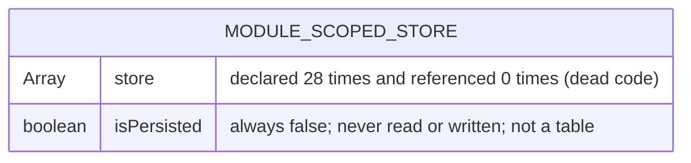

**Indexes and constraints.** Because no tables, collections, or entities are declared, the complete inventory of indexes and constraints is empty. The table below documents that inventory in full.

*Table 6.2.2-2: Complete index and constraint inventory*

| Object | Category | Present? |
|---|---|---|
| Primary keys | Constraint | None — no tables or collections declared |
| Foreign keys | Constraint | None — no entities or relations declared |
| Unique / check / not-null | Constraint | None — no columns or fields declared |
| Primary / secondary / composite indexes | Index | None — no `CREATE INDEX` or schema index declarations |

**Partitioning, replication, and backup.** With no datastore, there is no partitioning or sharding, no replication topology, and no data-backup architecture. No primary/replica configuration, write-ahead-log shipping, or oplog exists (**Section 5.4.5**). The only recoverable asset is the source text itself, which is versioned in Git (branch `06-Jul-2026-Br2`); this protects the source, not any runtime data, because no data exists (**Sections 3.6, 5.4.5**). The diagram below contrasts the absent database-replication topology with the realized source-level redundancy — the only form of redundancy present.

*Diagram 6.2.2-2: Replication architecture — absent database replication topology versus the realized Git-based source redundancy.*

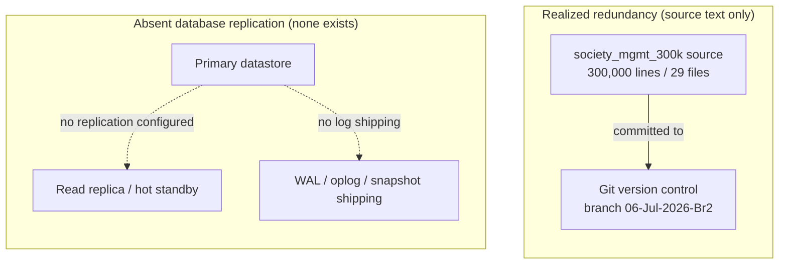

### 6.2.3 Data Management

No data is created, stored, versioned, archived, or cached anywhere in the corpus, so every data-management concern is not applicable. Each is recorded below with its supporting evidence.

*Table 6.2.3-1: Data-management concerns (all not applicable)*

| Concern | Status | Evidence / Basis |
|---|---|---|
| Migration procedures | Not applicable | No schema or datastore to migrate; no migration tool or scripts; Git is the only tooling present (3.6) |
| Versioning strategy | Not applicable | No data to version; only source text is versioned, via Git branch `06-Jul-2026-Br2` (3.6) |
| Archival policies | Not applicable | No data is produced or retained, so there is nothing to archive, tier, or expire (1.2.1) |
| Data storage & retrieval | Not applicable | No read/write path exists; the `store` array is never populated or queried (2.5.2) |
| Caching policies | Not applicable | No cache client, memoization, or invalidation; O(1) helpers make caching pointless (3.5, 5.4.4) |

**Storage and retrieval mechanisms.** The only "data" that moves through the system is the single numeric argument `x` passed to a helper function and the single numeric value it returns. Each helper `mod_N_M(x)` computes `r = x*1 + x*2 + x*3` and adds `10` when `r` is even, then returns `r`; it reads no store, writes no store, and holds no state between calls (**Sections 1.2.2, 2.5.1**). There is therefore no storage-and-retrieval mechanism to document — nothing is durably or transiently stored, and nothing is retrieved. The data-flow diagram below shows this realized flow and marks the persistence steps that are absent.

*Diagram 6.2.3-1: Data-flow diagram — a stateless in-process computation; no persistence read or write occurs.*

```mermaid
flowchart LR
    CALLER(["External host / caller<br/>(JS engine, outside repository)"])
    FN["mod_N_M(x)<br/>pure, synchronous, O(1)"]
    RESULT(["Returned Number<br/>(no side effect)"])
    CALLER -->|"1: pass numeric x"| FN
    FN -->|"2: return r"| RESULT
    subgraph ABSENTIO["Absent persistence steps (none occur)"]
        direction TB
        WRITE["Write / insert to datastore"]
        READ["Read / query from datastore"]
        CACHE["Cache lookup / populate"]
    end
    FN -.->|"no write"| WRITE
    FN -.->|"no read"| READ
    FN -.->|"no cache access"| CACHE
```

**Migration, versioning, and archival.** There is no schema, dataset, or datastore, so there are no migration procedures, no data-versioning strategy, and no archival or tiering policy. The repository contains no migration tool or scripts (whole-corpus inspection finds zero `migrat*` references), and the only versioning that exists applies to the source text through Git, not to any data (**Sections 3.6, 5.4.5**). Because the helpers produce no output that is retained, there is nothing to archive, expire, or purge (**Section 1.2.1**).

**Caching policies.** No caching layer exists — there is no cache client, no memoization of the arithmetic helpers, and no cache-invalidation logic (**Section 3.5**). Given that every helper is deterministic and runs in constant time (**Section 5.4.4**), a cache would add cost and complexity for no measurable benefit and is intentionally absent.

### 6.2.4 Compliance Considerations

Compliance controls for a database govern data that is stored, accessed, and processed. Because this artifact stores, accesses, and processes no data, there is no data-compliance surface, and every concern in this area is not applicable. The absence of a datastore removes the corresponding data-at-rest, privacy, and access-control obligations entirely (**Section 3.5**).

*Table 6.2.4-1: Compliance concerns (all not applicable)*

| Concern | Status | Evidence / Basis |
|---|---|---|
| Data retention rules | Not applicable | No data is persisted, so there is nothing to retain, expire, or delete (1.2.1, 3.5) |
| Backup & fault tolerance | Not applicable at data layer | No data to back up and no runtime to fail; source is recoverable via Git only (5.4.5) |
| Privacy controls | Not applicable | No personal or sensitive data is collected, stored, or processed; no PII fields exist (3.5) |
| Audit mechanisms | Not applicable | No data events to audit; zero logging/tracing; no audit tables or trails (5.4.1) |
| Access controls | Not applicable | No datastore, accounts, roles, or credentials to authorize; no authn/authz in code (5.3.3, 5.4) |

**Data retention and privacy.** No records of any kind are created or stored, so no data-retention schedule, right-to-erasure workflow, or data-classification policy applies (**Sections 1.2.1, 3.5**). The corpus handles no personally identifiable information, no financial data, and no sensitive attributes — there are no member, resident, payment, or contact fields anywhere — so there is no privacy control (masking, encryption at rest, tokenization, or consent tracking) to implement or document (**Section 3.5**).

**Backup, fault tolerance, and audit.** There is no data layer to back up and no runtime to make fault-tolerant; disaster recovery reduces to source recoverability through Git, as established in **Section 5.4.5**. No audit mechanism exists because there are no data-access or data-mutation events to record: the corpus emits no logs, traces, or metrics and defines no audit tables or change-data-capture streams (**Section 5.4.1**).

**Access controls.** With no datastore, there are no database accounts, roles, grants, row- or column-level security policies, or connection credentials to manage. The code implements no authentication or authorization of any kind, consistent with the decision to omit those concerns recorded in **Section 5.3.3**; the artifact exposes no data interface that access control could protect (**Section 5.4**).

### 6.2.5 Performance Optimization

Database performance optimization tunes how queries, connections, and data volumes are handled at a persistence layer. This artifact has no persistence layer, no queries, and no connections, so every optimization technique in this area is not applicable. The only performance property that exists is intrinsic to the arithmetic helpers themselves: each executes in constant O(1) time and is referentially transparent, so there is nothing at the data layer to optimize (**Sections 2.5.1, 5.4.4**).

*Table 6.2.5-1: Performance-optimization concerns (all not applicable)*

| Concern | Status | Evidence / Basis |
|---|---|---|
| Query optimization patterns | Not applicable | No queries exist; zero SQL/ORM calls; nothing to plan, index, or profile (3.5) |
| Caching strategy | Not applicable | No cache layer; deterministic O(1) helpers gain nothing from caching (3.5, 5.4.4) |
| Connection pooling | Not applicable | No datastore connections to pool; zero `pool`/`connect` references in the corpus (3.5) |
| Read/write splitting | Not applicable | No reads or writes and no replicas; nothing to route to a primary or replica (5.4.5) |
| Batch processing approach | Not applicable | No datasets, jobs, or bulk operations; no scheduler, cron, or batch window (5.4.4) |

**Query optimization and connection pooling.** There are no queries to optimize — no SQL, no ORM query builder, and no query planner — and no database connections to pool or reuse; whole-corpus inspection finds zero `pool` and zero `connect` references (**Section 3.5**). The conventional levers of database performance (index selection, query rewriting, prepared statements, connection reuse) have no subject in this repository.

**Caching, read/write splitting, and batch processing.** No caching strategy is defined or needed: the helpers are deterministic and constant-time, so a cache would add overhead without benefit (**Sections 3.5, 5.4.4**). There is no read/write splitting because there are no reads, writes, or replicas to route between (**Section 5.4.5**). There is no batch-processing approach because the corpus defines no datasets, bulk operations, scheduled jobs, or batch windows — the only computation is a single synchronous per-call evaluation with no queue, cursor, or chunking (**Section 5.4.4**).

**The realized performance profile.** The one objective performance statement that can be made concerns the arithmetic helpers, not a datastore: each `mod_N_M(x)` performs three additions, one modulo test, and at most one further addition, making it constant-time and allocation-free, with no latency, throughput, or availability target defined anywhere in the repository (**Sections 2.5.1, 5.4.4**). Because the functions are pure and hold no state, they require no data-layer tuning at all.

### 6.2.6 References

**Repository files and folders examined for this section**

- `society_mgmt_300k/` - the full project tree; established that the artifact is the entire system boundary with no datastore, connection, or storage service
- `society_mgmt_300k/src/models/` - files `file_2.js`, `file_13.js`, `file_24.js`; confirmed no entities, schemas, classes, or data structures are defined despite the namespace name
- `society_mgmt_300k/src/repositories/` - files `file_7.js`, `file_18.js`; confirmed no data-access or repository-pattern logic — only `mod_N_M(x)` arithmetic stubs
- `society_mgmt_300k/src/config/` - files `file_6.js`, `file_17.js`; confirmed no connection strings, datasource, or database configuration
- `society_mgmt_300k/src/domain/` - files `file_8.js`, `file_19.js`; confirmed no domain entities or relationships
- `society_mgmt_300k/src/controllers/file_0.js` - representative module (mod_0): header comment, unused `const store = []`, and identical arithmetic helpers
- `society_mgmt_300k/src/services/file_1.js` - representative `services/` module; confirmed identical arithmetic stubs, no data logic
- `society_mgmt_300k/src/utils/filler.js` - 1,999 comment-only padding lines; confirmed inert, no code or data
- `society_mgmt_300k/tests/` - `unit/` and `integration/` static fixtures; confirmed no test runner, assertions, or data setup
- `README.md` (root, title only), `LICENSE` (root, Apache-2.0), and `society_mgmt_300k/LICENSE/LICENSE.txt` (MIT) - the only non-`.js` artifacts; contain no schema, data, or storage configuration

**Whole-corpus verification (terminal inspection)**

- Exactly **300,000 lines** across **29 `.js` files**; **33,105** byte-identical arithmetic functions `mod_N_M(x)`
- `const store = []` appears in all **28** module files and is referenced **0** times (dead code)
- **Zero** occurrences across the corpus of every persistence indicator searched: `require`, `import`, `export`, `module.exports`, `process.env`, `fs`, `http`, `fetch`, `async`, `await`, `Promise`, `mongoose`, `sequelize`, `prisma`, `redis`, `pool`, `connect`, `migrat`, `SELECT`, `INSERT`, `PRIMARY KEY`, `FOREIGN KEY` — establishing the absence of any database, driver, ORM, connection, migration, or cache

**Cross-referenced Technical Specification sections**

- **1.2 System Overview** - the "No persistence" gap (1.2.1) and the synthetic-corpus framing (1.2.2)
- **1.3 Scope** - persistence/database recorded as absent and out of scope
- **2.5 Implementation Considerations** - `store` as dead code (F-002, 2.5.2), nominal namespaces (F-003, 2.5.3), pure O(1) stateless helpers (F-001, 2.5.1)
- **3.5 Databases & Storage** - no database, caching layer, or storage service; MongoDB (default stack) absent from code
- **3.6 Development & Deployment** - Git-only tooling (branch `06-Jul-2026-Br2`); no migration, build, or containerization
- **5.3 Technical Decisions** - decision to exclude persistence, caching, and authn/authz (ADR-04/ADR-05, 5.3.3)
- **5.4 Cross-Cutting Concerns** - no monitoring/logging/audit (5.4.1), no SLA or capacity plan (5.4.4), and disaster recovery via Git source recovery only (5.4.5)

No web sources were used for this section.

## 6.3 Integration Architecture

### 6.3.1 Applicability Determination

**Integration Architecture is not applicable for this system.**

The subject artifact, `society_mgmt_300k/`, is a **synthetic corpus of exactly 300,000 lines of JavaScript** (Feature F-004) whose only executable behavior is the deterministic arithmetic helper `mod_N_M(x)` (Feature F-001). It defines **no integration surface of any kind** — no inbound or outbound API, no message broker or event bus, no third-party SDK, and no external service contract. This determination applies the same "nominal intent versus as-implemented reality" discipline used throughout **5. System Architecture** and **6.1 Core Services Architecture**, and every point below is grounded in whole-corpus inspection of the 29 `.js` files.

The following facts, verified across the entire corpus, establish the absence of any integration architecture:

- **No network or transport layer.** Whole-corpus inspection returns **zero** occurrences of `http`, `https`, `express`, `fastify`, `koa`, `listen(`, `createServer`, `fetch`, `axios`, `grpc`, `soap`, or `websocket`. Nothing in the repository can send or receive a request (see **5.1.4 External Integration Points**).
- **No inter-module wiring.** There are **zero** occurrences of `require`, `import`, `export`, or `module.exports`; the 28 module files are mutually isolated with no edges between them, so not even an *internal* integration exists (see **5.1.1 System Overview**).
- **No messaging or streaming.** There are **zero** occurrences of `kafka`, `rabbitmq`, `amqp`, `redis`, `EventEmitter`, `.emit(`, `.on(`, `stream`, `pipe(`, `cron`, or `schedule`, and no `async`/`await`/`Promise` — there is no event, queue, stream, or batch machinery.
- **No external dependencies or configuration.** There is no `package.json`, lockfile, `.env`, or any manifest; `process.env` never appears, so there are no credentials, endpoints, or connection strings (see **3.3 Open Source Dependencies** and **3.4 Third-Party Services**).
- **No API contract, auth, or gateway.** There is no protocol specification, authentication or authorization code, rate limiter, versioning scheme, or API gateway anywhere in the tree (see **5.4.3** and **6.1**).

The nine `src/` namespaces — `controllers/`, `services/`, `models/`, `routes/`, `domain/`, `repositories/`, `middleware/`, `config/`, and `utils/` — carry names that evoke an integrated, request-serving application (particularly `routes/`, `controllers/`, `middleware/`, and `config/`). This taxonomy is **nominal only** (Feature F-003): the `routes/` and `middleware/` folders contain the same deterministic arithmetic stubs (`mod_N_M(x)`) found in every other namespace, not route tables, handlers, or interceptors. The only interaction the artifact supports is an external **Host / Caller** loading one `file_N.js` module and invoking a single `mod_N_M(x)` symbol **in-process**, receiving one `Number` in return.

Because no external system, protocol, or asynchronous channel exists, the three areas requested for this section — **API Design**, **Message Processing**, and **External Systems** — are each not applicable. They are recorded in **6.3.2** through **6.3.4** with their supporting evidence and are accompanied by the requested Mermaid diagrams (integration flow, API architecture, and message flow) for explicit contrast with what a conventional integrated platform would provide.

*Table 6.3.1-1: Applicability of Integration Architecture areas*

| Prompt Area | Applicable? | Basis (Evidence) |
|---|---|---|
| API Design (6.3.2) | Not applicable | No HTTP/REST/GraphQL/RPC server or client; zero `http`/`express`/`listen(`/`fetch`/`axios`; no protocol, auth, rate limiting, versioning, or docs (5.1.4, 5.4.3) |
| Message Processing (6.3.3) | Not applicable | No broker, queue, event bus, or stream; zero `kafka`/`rabbit`/`amqp`/`redis`, `.emit`/`.on`, `stream`, `cron`, `async`/`await` (5.1.4, 5.4.2) |
| External Systems (6.3.4) | Not applicable | No third-party SDK, legacy adapter, API gateway, or service contract; no `package.json`, `process.env`, or `.env` (3.4, 5.1.4) |

The diagram below labels the single realized interaction — an in-process function call — against the external integration channels that a reader might expect and that are entirely absent from the repository.

*Diagram 6.3.1-1: Integration flow — the only realized interaction (in-process function call) versus the absent external integration channels.*

```mermaid
flowchart LR
    Caller(["External Host / Caller<br/>(JS engine, outside repository)"])
    subgraph REPO["Repository boundary: society_mgmt_300k (no integration surface)"]
        direction TB
        MOD["Module file_N.js<br/>(self-contained; no import/export)"]
        FN["Helper mod_N_M(x)<br/>pure, synchronous, O(1)"]
        MOD -->|"declares"| FN
    end
    Caller -->|"1: load and parse file_N.js"| MOD
    Caller -->|"2: in-process call mod_N_M(x)"| FN
    FN -->|"3: return Number (6x or 6x+10)"| Caller
    subgraph ABSENT["Absent integration channels (none exist in repo)"]
        direction TB
        HTTPX["Inbound/outbound HTTP, REST, GraphQL API"]
        MQX["Message queue, event bus, stream"]
        EXTX["Third-party SDK, webhook, cloud service"]
        GWX["API gateway, legacy adapter"]
    end
```

### 6.3.2 API Design

Because the artifact exposes no application programming interface — no network endpoint and no exported module symbol — every API-design concern requested for this section is not applicable. The only programmatic surface that exists is the **in-language JavaScript function-call convention**: a host that has loaded a `file_N.js` module may call one `mod_N_M(x)` symbol and receive a `Number`. There is no protocol, no authentication, no authorization, no rate limiting, no versioning scheme, and no API documentation anywhere in the corpus.

The `routes/`, `controllers/`, and `middleware/` namespaces — the folders whose names most strongly imply an HTTP API tier — contain only the identical arithmetic stubs (`mod_N_M(x)`); no route table, request handler, or interceptor is defined (Feature F-003, nominal taxonomy). Each concern is recorded below with the specific evidence that establishes its absence.

*Table 6.3.2-1: API-design concerns (all not applicable)*

| API Concern | Status | Evidence / Basis |
|---|---|---|
| Protocol specifications | Not applicable | No server or client; zero `http`/`https`/`express`/`fastify`/`koa`/`listen(`/`createServer`/`graphql`/`grpc`/`websocket`; the only "protocol" is the JS function-call convention (5.1.3) |
| Authentication methods | Not applicable | No login, token, session, or credential handling; zero `oauth`/`jwt`/`bearer`/`api_key`; `process.env` never appears (5.4.3) |
| Authorization framework | Not applicable | No roles, permissions, scopes, or policy checks; there is no protected resource to guard (5.4.3) |
| Rate limiting strategy | Not applicable | No throttle, quota, or limiter; no request pipeline or middleware executes at runtime (5.4.1) |
| Versioning approach | Not applicable | No API surface to version; no `/v1` routes, media-type versioning, or schema registry is present |
| Documentation standards | Not applicable | No OpenAPI/Swagger, API Blueprint, or endpoint documentation; no manifest; root `README.md` is title-only |

The single realized "contract" is implicit and is not expressed in any API artifact: for a numeric argument `x`, the helper returns `r = 6x`, plus `10` when `r` is even (see **5.1.3 Data Flow Description**). The table below records the one function-call surface using the input/output framing an API reference would use, purely to make the contrast explicit.

*Table 6.3.2-2: The sole programmatic surface (in-process function call)*

| Attribute | Value |
|---|---|
| Invocation mechanism | In-process synchronous JavaScript function call (no transport) |
| Request / input | A single argument `x` (expected numeric); no validation is performed |
| Response / output | A single `Number` `r` = `6x`, or `6x + 10` when `r` is even |
| Error / status model | None; the helper never throws — non-numeric input yields `NaN` via JS coercion (5.4.2) |

The diagram below labels this single function-call surface against the API infrastructure that a conventional service would expose and that is entirely absent here.

*Diagram 6.3.2-1: API architecture — the realized in-process function-call surface versus absent API infrastructure.*

```mermaid
flowchart TB
    Caller(["External Host / Caller<br/>(loads module in-process)"])
    subgraph REALIZED["Realized programmatic surface — one JS function symbol"]
        direction TB
        SYM["mod_N_M(x): one numeric arg in, one Number out"]
        CONTRACT["Implicit contract: r = 6x, then +10 when r is even"]
        SYM -->|"defines"| CONTRACT
    end
    Caller -->|"synchronous in-process call"| SYM
    subgraph ABSENTAPI["Absent API infrastructure (none present in repo)"]
        direction TB
        PROTO["Protocol layer: HTTP/REST, GraphQL, gRPC"]
        AUTHN["Authentication: OAuth/OIDC, JWT, sessions"]
        AUTHZ["Authorization: roles, scopes, policies"]
        RL["Rate limiting, throttling, quotas"]
        VER["Versioning: /v1, media types, schema registry"]
        DOCS["Documentation: OpenAPI / Swagger"]
    end
```

### 6.3.3 Message Processing

The artifact performs no asynchronous or message-driven processing of any kind. Whole-corpus inspection confirms **zero** occurrences of event, queue, stream, batch, scheduling, or concurrency primitives, so there is no event processing, no message queue, no stream pipeline, no batch flow, and no message-level error handling to document. Every one of the 33,105 helpers is a **pure, synchronous, single-argument function** (Feature F-001); the only data movement in the entire system is the synchronous passing of one argument into a helper and the return of one `Number`.

*Table 6.3.3-1: Message-processing concerns (all not applicable)*

| Message-Processing Concern | Status | Evidence / Basis |
|---|---|---|
| Event processing patterns | Not applicable | No emitter/listener/handler; zero `EventEmitter`/`.emit(`/`.on(`/`addEventListener`; no callbacks or publish/subscribe |
| Message queue architecture | Not applicable | No broker or queue client; zero `kafka`/`rabbitmq`/`amqp`/`redis`/`sqs`/`pubsub`; no producer or consumer code |
| Stream processing design | Not applicable | No streaming; zero `stream`/`pipe(`/`createReadStream`; no windowing, aggregation, or backpressure |
| Batch processing flows | Not applicable | No scheduler or job; zero `cron`/`schedule`/`batch`/`worker`/`setInterval`/`setTimeout`; no batch window (5.1.4) |
| Error handling strategy | Not applicable | No exception handling; zero `try`/`catch`/`throw`/`finally`; helpers never raise — invalid input yields `NaN` via JS coercion (5.4.2) |

Because there is no concurrency and no I/O, there is also no delivery guarantee, no ordering or idempotency concern, no dead-letter or retry path, and no backpressure to manage. The `const store = []` declared in every module (Feature F-002-RQ-002) is never read or written, so it is not a buffer, mailbox, or queue — it holds no messages. The diagram below labels the sole synchronous data movement against the messaging fabric that a conventional event-driven system would provide and that is absent here.

*Diagram 6.3.3-1: Message flow — the sole synchronous in-process value movement versus the absent messaging fabric.*

```mermaid
flowchart LR
    subgraph SYNC["Realized data movement — synchronous, in-process, no messaging"]
        direction LR
        VIN["Argument x (Number)"]
        VFN["mod_N_M(x): r = 6x, then +10 if even"]
        VOUT["Return value r (Number)"]
        VIN -->|"passed by value on call"| VFN
        VFN -->|"returned to caller"| VOUT
    end
    subgraph ABSENTMSG["Absent messaging fabric (none present in repo)"]
        direction TB
        QUE["Message queue / topic (Kafka, RabbitMQ, SQS)"]
        EVB["Event bus / emitter-listener"]
        STP["Stream processor / pipeline"]
        BAT["Batch scheduler / cron / worker"]
        DLQ["Dead-letter queue / retry / error handler"]
    end
```

### 6.3.4 External Systems

The repository connects to no external systems. There is no third-party integration, no legacy-system interface, no API gateway, and no external service contract anywhere in the tree — a finding corroborated by **3.4 Third-Party Services** ("The repository integrates with no third-party services of any kind") and **5.1.4 External Integration Points** ("The repository defines no external integration surface whatsoever"). Each requested concern is recorded below with its evidence.

*Table 6.3.4-1: External-system concerns (all not applicable)*

| External-System Concern | Status | Evidence / Basis |
|---|---|---|
| Third-party integration patterns | Not applicable | No SDK, HTTP client, or adapter; no `fetch`/`axios`, vendor SDK, or API key; no payment/email/SMS/SaaS integration (3.4) |
| Legacy system interfaces | Not applicable | No file/FTP/DB/queue bridge and no SOAP/XML/ETL connector; zero `soap`/`ftp`/database-driver references (5.1.4) |
| API gateway configuration | Not applicable | No gateway, reverse proxy, or ingress; no route table, rate policy, or upstream config; no gateway manifest exists (6.1) |
| External service contracts | Not applicable | No OpenAPI/WSDL/protobuf/Avro schema, DTO, or interface definition; no SLA is defined for any category (5.1.4) |

**External dependencies.** The section prompt requires that all external dependencies be documented; the objective finding is that **there are none**. The repository declares no dependency manifest, imports no library, and references no external endpoint or credential. The table below enumerates each dependency category a reader might expect and records, with evidence, that none is present (consistent with **3.3 Open Source Dependencies** and **3.4 Third-Party Services**).

*Table 6.3.4-2: External dependencies (none present)*

| Dependency Category | Present? | Evidence of Absence |
|---|---|---|
| Runtime package dependencies | No | No `package.json`/lockfile; zero `require`/`import`; only intrinsic JS operators (`*`, `+=`, `%`, `===`) are used (3.3) |
| External APIs / SaaS providers | No | No HTTP client, SDK, or endpoint; no outbound call; no API key or webhook (3.4) |
| Message brokers / streaming platforms | No | No Kafka/RabbitMQ/AMQP/Redis/SQS client or configuration |
| Identity / secrets providers | No | No OAuth/OIDC/SAML; `process.env`, `.env`, and credential stores are all absent (5.4.3) |

The only "integration" that exists is an external **Host / Caller** loading a single module in-process and invoking one `mod_N_M(x)` helper — no external system, network hop, broker, or gateway participates. The sequence diagram below labels this sole end-to-end flow.

*Diagram 6.3.4-1: Integration sequence — the only end-to-end flow, entirely in-process with no external participant.*

```mermaid
sequenceDiagram
    participant Host as External Host / Caller (outside repo)
    participant Mod as Module file_N.js (in-process)
    participant Fn as Helper mod_N_M(x)
    Note over Host,Fn: The only interaction that exists is fully in-process, with no external system
    Host->>Mod: load and parse file_N.js
    Host->>Fn: call mod_N_M(x)
    Fn->>Fn: compute r = 6x, then +10 if r is even
    Fn-->>Host: return Number r
    Note over Host,Fn: No external system, network hop, broker, or gateway participates
```

### 6.3.5 References

**Repository files and folders examined for this section**

- `society_mgmt_300k/` - the entire project tree; established that the artifact is the whole system boundary with no external integration surface
- `society_mgmt_300k/src/` - the nine nominal namespaces (`controllers/`, `services/`, `models/`, `routes/`, `domain/`, `repositories/`, `middleware/`, `config/`, `utils/`); confirmed that `routes/`, `controllers/`, and `middleware/` contain arithmetic stubs, not an API tier
- `society_mgmt_300k/src/routes/file_3.js` - representative `routes/` module (mod_3): banner, unused `const store = []`, and identical `mod_3_M(x)` helpers — no route table or endpoint
- `society_mgmt_300k/src/controllers/file_0.js` - representative `controllers/` module (mod_0); no request handler or response object
- `society_mgmt_300k/src/middleware/file_5.js` and `society_mgmt_300k/src/middleware/file_27.js` - `middleware/` modules (mod_5, mod_27); no interceptor, authentication, or rate-limiter logic (`file_27.js` is the single smaller module, 6,347 lines / 705 functions)
- `society_mgmt_300k/src/config/file_6.js` - `config/` module (mod_6); no connection string, endpoint, or credential
- `society_mgmt_300k/src/services/file_1.js` - `services/` module (mod_1); no service client or outbound call
- `society_mgmt_300k/src/repositories/file_7.js` - `repositories/` module (mod_7); no data-access logic or external adapter
- `society_mgmt_300k/src/utils/filler.js` - 1,999 comment-only padding lines (`// filler 298001`…`299999`); confirmed inert
- `society_mgmt_300k/tests/` - `unit/` and `integration/` static fixtures; no test runner, HTTP mock, or integration harness
- `README.md` (repo root) - title-only banner; `LICENSE` (repo root) - Apache-2.0; `society_mgmt_300k/LICENSE/LICENSE.txt` - subproject MIT license

**Whole-corpus verification (terminal inspection)**

- Exactly **300,000 lines** across 29 `.js` files; **33,105 functions** with a byte-identical body (`r += x*1; r += x*2; r += x*3; if(r%2===0){r+=10}; return r;`)
- **Zero** occurrences across the corpus of: `require`, `import`, `export`, `module.exports`, `http`, `https`, `express`, `fastify`, `koa`, `listen(`, `createServer`, `fetch`, `axios`, `grpc`, `soap`, `websocket` — establishing the absence of any API or transport
- **Zero** occurrences of: `kafka`, `rabbitmq`, `amqp`, `redis`, `EventEmitter`, `.emit(`, `.on(`, `stream`, `pipe(`, `cron`, `schedule`, `batch`, `worker`, `async`, `await`, `Promise`, `setInterval`, `setTimeout` — establishing the absence of messaging, streaming, and batch processing
- **Zero** occurrences of: `oauth`, `jwt`, `bearer`, `api_key`, `process.env` — and no `package.json`, lockfile, or `.env` — establishing the absence of authentication, external dependencies, and configuration
- Git branch `06-Jul-2026-Br2`; the corpus was captured as a bulk upload ("Add files via upload")

**Cross-referenced Technical Specification sections**

- **1.2 System Overview** - framing of the repository as a synthetic source corpus with no integration surface
- **3.3 Open Source Dependencies** - no dependency manifest, registry, or third-party library
- **3.4 Third-Party Services** - "no third-party services of any kind"; no external API, identity, monitoring, or cloud integration
- **5.1 High-Level Architecture** - the in-process function-call interface (5.1.3) and the "no external integration / no SLA" enumeration (5.1.4)
- **5.4 Cross-Cutting Concerns** - no monitoring/logging (5.4.1), no error handling (5.4.2), and no authentication/authorization (5.4.3)
- **6.1 Core Services Architecture** - "not applicable"; no services, inter-service communication, service discovery, load balancer, or API gateway

## 6.4 Security Architecture

### 6.4.1 Applicability Determination

**Detailed Security Architecture is not applicable for this system.**

The subject artifact, `society_mgmt_300k/`, is a synthetic corpus of exactly **300,000 lines of JavaScript across 29 `.js` files** (Feature F-004) whose only executable behavior is the deterministic arithmetic helper `mod_N_M(x)` (Feature F-001). It defines **no authentication, no authorization, and no data-protection mechanism of any kind**, because it has no runtime, no network surface, no persisted data, no users, and no external dependencies to secure. This determination restates, in security terms, the "No security controls are present" finding of **5.3.2**, the "no authentication or authorization framework is present" finding of **5.4.3**, and the out-of-scope enumeration of **1.3.2**. Every point below is grounded in whole-corpus inspection of the 29 `.js` files, following the same "nominal intent versus as-implemented reality" discipline used throughout **5. System Architecture** and **6.1–6.3**.

The following facts, verified across the entire corpus, establish that there is no security surface to architect:

- **No identity, credential, or session concept.** Whole-corpus inspection returns **zero** occurrences of `login`, `password`, `credential`, `session`, `cookie`, `token`, `jwt`, `oauth`, `oidc`, or `saml`. There is no user, account, directory, or identity provider anywhere (**5.4.3**, **6.3.4**).
- **No access-control concept.** There are **zero** occurrences of `role`, `permission`, `rbac`, `acl`, `authoriz`, or `authentic`; no policy check guards any operation, and there is no protected resource to guard (**5.4.3**, **6.2.4**).
- **No cryptography or transport security.** There are **zero** occurrences of `crypto`, `bcrypt`, `hash`, `hmac`, `cipher`, `aes`, `rsa`, `tls`, `ssl`, `https`, `encrypt`, or `decrypt`. Nothing is hashed, signed, encrypted, or transmitted (**6.2.4**, **6.3.2**).
- **No secrets, configuration, or dependencies to trust.** `process.env` never appears; there is no `.env`, `package.json`, or configuration file, and there are **zero** `require`/`import`/`export` statements — so there are no credentials, keys, connection strings, or third-party libraries whose trust would need managing (**3.3**, **3.4**, **5.4.3**).
- **No runtime, network, or data plane.** The 28 module files are mutually isolated (no wiring), expose no server or endpoint (zero `http`/`https`/`listen(`), and persist nothing — the per-module `const store = []` is declared 28 times and never read or written (Feature F-002). There is therefore **no attack surface**: no server to reach, no data to exfiltrate, and no trust boundary at runtime (**5.3.2**, **6.1**, **6.2**).

This posture is a **deliberate, recorded design decision, not an oversight**. As documented in **5.3.3**, **ADR-05** accepts the omission of "authentication, authorization, input validation, and error handling," and **ADR-04** excludes persistence, caching, and all external integrations; **5.3.2** states plainly that "the artifact exposes no attack surface: there is no server to reach, no data to protect, no credentials, and no trust boundary at runtime." **1.3.2 Scope** correspondingly lists authentication & authorization, configuration & secrets, and identity/authentication providers as explicitly out of scope / absent.

Because there is no runtime, data, or network to protect, the three areas requested for this section — **Authentication Framework**, **Authorization System**, and **Data Protection** — are each not applicable, as summarized below and detailed with evidence and the required Mermaid diagrams in **6.4.2** through **6.4.4**. The standard security practices that govern the artifact as shipped, and those that would apply if it ever evolved into a runnable system, are documented in **6.4.5**.

*Table 6.4.1-1: Applicability of Security Architecture areas*

| Requested Area | Applicable? | Basis (Evidence) |
|---|---|---|
| Authentication Framework (6.4.2) | Not applicable | No identity, credential, MFA, session, or token code; zero `password`/`token`/`session`/`oauth`/`jwt` occurrences (5.4.3, ADR-05) |
| Authorization System (6.4.3) | Not applicable | No roles, permissions, or policy checks; zero `role`/`permission`/`rbac`/`acl`; no protected resource exists (5.4.3, 6.2.4) |
| Data Protection (6.4.4) | Not applicable | No data at rest or in transit; zero `crypto`/`encrypt`/`tls`/`ssl`; no PII and no network hop (6.2.4, 6.3.2) |

**Security zones.** A conventional security-zone model partitions a system into trust zones — a public edge/DMZ, an application tier, a protected data tier, and an identity plane — separated by enforced boundaries. This artifact has exactly **one zone**, the static source repository itself, and **no enforced boundary of any kind**: an external host loads a module and invokes a helper entirely in-process, with no network hop, no authentication gate, and no privilege transition. The diagram below depicts this single realized zone honestly and groups the conventional zones that are absent for explicit contrast.

*Diagram 6.4.1-1: Security zone model — the single realized static zone versus the trust zones and boundaries that are absent from the repository.*

```mermaid
flowchart TB
    Caller(["External Host / Caller<br/>(JS engine, outside the repository)"])
    subgraph REPO["Repository boundary: society_mgmt_300k (single static zone)"]
        direction TB
        MODS["28 self-contained module files<br/>no import/export, no network, no I/O"]
        FN["Helpers mod_N_M(x): pure, synchronous, O(1)"]
        MODS -->|"declare"| FN
    end
    Caller -->|"in-process load and call<br/>no network hop, no auth gate"| MODS
    subgraph ABSENTZONES["Absent security zones and boundaries (none exist in repo)"]
        direction TB
        DMZ["Public edge / DMZ / WAF / reverse proxy"]
        SEG["Network segmentation / trust boundary"]
        DATAZONE["Protected data tier / secrets vault"]
        IDZONE["Identity / authentication plane"]
    end
```

Because the entire artifact resides in a single zone with no boundary to cross, there is no zone-transition control, no ingress/egress filtering, and no privilege escalation path to document. The sub-sections that follow record each requested security concern as not applicable with its supporting evidence, and each includes the requested Mermaid diagram for contrast with what a conventional secured platform would provide.

### 6.4.2 Authentication Framework

**No authentication framework is present in this system.** There is no concept of a user, principal, or identity anywhere in the corpus; nothing establishes *who* is calling a helper, and nothing needs to, because a helper simply executes when invoked and returns a number. Whole-corpus inspection returns **zero** occurrences of `login`, `password`, `credential`, `session`, `cookie`, `token`, `jwt`, `oauth`, `oidc`, `saml`, `authentic`, or `process.env`, confirming that identity management, multi-factor authentication, session management, token handling, and password policies are all absent (consistent with **5.4.3** and **6.3.2**, and recorded as **ADR-05** in **5.3.3**).

The security control matrix below records each authentication concern requested for this section as not applicable, with the specific evidence that establishes its absence.

*Table 6.4.2-1: Authentication control matrix (all controls not applicable)*

| Authentication Concern | Status | Evidence / Basis |
|---|---|---|
| Identity management | Not applicable | No user, account, or principal model; no identity store or directory; zero `login`/`user`-identity constructs (5.4.3, 1.3.2) |
| Multi-factor authentication (MFA) | Not applicable | No primary authentication exists to augment; no OTP, TOTP, WebAuthn, push, or SMS factor; zero `mfa`/`otp`/`2fa` references |
| Session management | Not applicable | No session, cookie, or state between calls; helpers are pure and stateless; the `store` array is unused (F-002, 6.2.3) |
| Token handling | Not applicable | No token issuance, validation, refresh, or revocation; zero `jwt`/`oauth`/`oidc`/`bearer`; no signing key exists (6.3.2, 6.3.4) |
| Password policies | Not applicable | No password field, hashing, salting, complexity, rotation, or lockout policy; zero `password`/`bcrypt`/`hash` occurrences (5.4.3) |

**Identity, MFA, and sessions.** No mechanism identifies or challenges a caller. There is no login flow, no credential verification, no second-factor challenge, and no session lifecycle (creation, timeout, renewal, or invalidation). Because every `mod_N_M(x)` helper is pure and holds no state between invocations, there is nothing for a session to represent (**6.2.3**, **5.4.2**).

**Token handling and password policies.** No token is ever created, parsed, signed, or verified, and there is no signing secret or key material anywhere (`process.env` and any `.env`/config file are absent — **6.3.4**). Likewise, no password is stored, hashed, or validated, so password-strength, rotation, history, and account-lockout policies have no subject in this repository.

**Authentication flow.** The realized "authentication flow" is that there is none: an external host loads a module and calls a helper, which executes **unconditionally** and returns a value. No credential check, MFA challenge, session establishment, or token validation precedes execution. The diagram below labels this realized path and groups the authentication controls that a conventional system would insert before execution and that are entirely absent here.

*Diagram 6.4.2-1: Authentication flow — the realized unconditional in-process invocation versus the absent authentication controls.*

```mermaid
flowchart TB
    START(["External Host / Caller invokes mod_N_M(x)"])
    NOGATE["No authentication gate present<br/>execution is unconditional"]
    EXEC["Helper computes r = 6x, then +10 if r is even"]
    RET(["Return Number r to caller"])
    START --> NOGATE --> EXEC --> RET
    subgraph ABSENTAUTHN["Absent authentication controls (none exist in repo)"]
        direction TB
        IDENT["Identity resolution / user directory"]
        CRED["Credential / password verification"]
        MFA["Multi-factor (MFA) challenge"]
        SESS["Session establishment and management"]
        TOK["Token issuance and validation (JWT / OIDC)"]
    end
```

In short, there is no identity to manage, no factor to verify, no session to maintain, no token to handle, and no password to govern — the authentication framework is not applicable to this artifact as shipped. Standard authentication practices that would be introduced if the artifact ever became a runnable, user-facing system are documented as forward-looking recommendations in **6.4.5**.

### 6.4.3 Authorization System

**No authorization system is present in this system.** Authorization presupposes an authenticated principal, a protected resource, and a policy that decides whether the principal may act on the resource — none of which exist here. Whole-corpus inspection returns **zero** occurrences of `role`, `permission`, `rbac`, `acl`, `authoriz`, `scope`, `grant`, or `policy`, and there is no protected resource to guard: every `mod_N_M(x)` helper is a public, side-effect-free function that any caller may invoke with identical results. This restates in authorization terms the findings of **5.4.3** and **6.2.4** and the **ADR-05** decision recorded in **5.3.3**.

The security control matrix below records each authorization concern requested for this section as not applicable, with the evidence that establishes its absence.

*Table 6.4.3-1: Authorization control matrix (all controls not applicable)*

| Authorization Concern | Status | Evidence / Basis |
|---|---|---|
| Role-based access control (RBAC) | Not applicable | No roles, groups, or role assignments; zero `role`/`rbac` occurrences; no principal to bind a role to (5.4.3) |
| Permission management | Not applicable | No permissions, scopes, grants, or entitlements; zero `permission`/`scope`/`grant`; nothing is gated (6.2.4) |
| Resource authorization | Not applicable | No protected resource, record, or endpoint; helpers are public pure functions; no ownership or ACL model exists |
| Policy enforcement points (PEP/PDP) | Not applicable | No policy engine, guard, interceptor, or middleware executes at runtime; the `middleware/` namespace holds arithmetic stubs only (F-003, 6.3.2) |
| Audit logging | Not applicable | No access decisions to record; zero `audit` and zero `console.*`; no logging, tracing, or audit trail exists anywhere (5.4.1) |

**RBAC, permissions, and resource authorization.** There is no role model, no permission or scope catalog, and no resource whose access could be authorized. The nominal `middleware/` and `routes/` namespaces — the folders whose names most strongly imply an authorization tier — contain only the identical `mod_N_M(x)` stubs, not guards, interceptors, or route policies (Feature F-003; corroborated by **6.3.2**). No ownership, tenancy, row-level, or attribute-based rule constrains any operation.

**Policy enforcement points.** There is no policy enforcement point (PEP) and no policy decision point (PDP): no code intercepts an invocation, evaluates a policy, and permits or denies it. Because the modules are mutually isolated with zero wiring (no `import`/`require`/`export`), there is not even an internal choke point at which a policy could be applied (**6.1**, **6.3.1**).

**Audit logging.** No authorization or access-decision events are produced or recorded. As established in **5.4.1**, the corpus emits **zero** `console.*` output and integrates no logging, metrics, or tracing library, so there is no audit trail, no tamper-evident log, and no access log of any kind. This is consistent with the absence of any decision to audit.

**Authorization flow.** The realized "authorization flow" is that a helper runs for any caller with no decision or enforcement step in between. The diagram below labels this realized path and groups the authorization controls a conventional system would apply — role resolution, permission evaluation, resource-level checks, a policy engine, and audit logging — all of which are absent here.

*Diagram 6.4.3-1: Authorization flow — the realized unconditional execution (no PDP/PEP) versus the absent authorization controls.*

```mermaid
flowchart TB
    REQ(["Caller requests mod_N_M(x) execution"])
    NOPEP["No policy enforcement point (PEP)<br/>and no policy decision point (PDP)"]
    RUN["Helper runs for any caller<br/>no role, permission, or resource check"]
    OUT(["Return Number r"])
    REQ --> NOPEP --> RUN --> OUT
    subgraph ABSENTAUTHZ["Absent authorization controls (none exist in repo)"]
        direction TB
        ROLE["Role resolution (RBAC)"]
        PERM["Permission / scope evaluation"]
        RES["Resource-level authorization"]
        POL["Policy engine (PDP / PEP)"]
        AUD["Audit logging of access decisions"]
    end
```

In short, there are no roles, no permissions, no protected resources, no enforcement points, and no audit trail — the authorization system is not applicable to this artifact as shipped. Standard authorization practices that would be introduced if the artifact ever exposed protected resources are documented as forward-looking recommendations in **6.4.5**.

### 6.4.4 Data Protection

**Data protection is not applicable to this system because the artifact processes, stores, and transmits no data.** The only data that ever exists is the single numeric argument `x` passed into a helper and the single `Number` it returns; nothing is persisted, nothing crosses a network, and no personal, financial, or otherwise sensitive information is present anywhere. Whole-corpus inspection returns **zero** occurrences of `crypto`, `bcrypt`, `hash`, `hmac`, `cipher`, `aes`, `rsa`, `tls`, `ssl`, `https`, `encrypt`, `decrypt`, `mask`, `kms`, or `vault`. This restates in data-protection terms the persistence and compliance findings of **6.2** (no datastore) and **6.2.4** (no data-at-rest, privacy, or access-control obligations).

The security control matrix below records each data-protection concern requested for this section as not applicable, with the evidence that establishes its absence.

*Table 6.4.4-1: Data-protection control matrix (all controls not applicable)*

| Data-Protection Concern | Status | Evidence / Basis |
|---|---|---|
| Encryption standards | Not applicable | No data at rest or in transit to encrypt; zero `crypto`/`aes`/`rsa`/`cipher`; no algorithm, mode, or cipher suite is configured (6.2.4) |
| Key management | Not applicable | No keys, certificates, or secrets exist; zero `kms`/`vault`/`process.env`; no key generation, storage, rotation, or escrow (6.3.4) |
| Data masking rules | Not applicable | No data records or fields to mask, tokenize, or redact; zero `mask`; no PII, PHI, or cardholder data present (6.2.4) |
| Secure communication | Not applicable | No network transport; the only interaction is an in-process function call; zero `https`/`tls`/`ssl`; no channel to secure (6.3.1, 6.3.2) |
| Compliance controls | Not applicable | No data-compliance surface (retention, erasure, classification); only licensing governance applies, documented in 6.4.5 (6.2.4, ADR-07) |

**Encryption and key management.** There is nothing to protect cryptographically. No data is written to disk, cached, or transmitted, so there is no encryption-at-rest or encryption-in-transit requirement, and no cryptographic algorithm, key, certificate, or key-management service is configured. Because `process.env`, `.env`, and all configuration files are absent (**6.3.4**), there is no key material or secret to store, rotate, or escrow in the first place.

**Data masking and secure communication.** No dataset, record, or field exists to mask, tokenize, redact, or pseudonymize; the corpus handles no member, resident, payment, or contact data (**6.2.4**). Communication security is likewise not applicable: the only interaction the artifact supports is an external host invoking a helper **in-process**, with no HTTP, TLS, or any network hop to secure (**6.3.1**, **6.3.2**).

**Compliance requirements.** Data-compliance obligations attach to systems that collect, store, or process regulated data. Because this artifact does none of these, the common regulatory frameworks have no subject here. The table below documents each framework a reader might expect and records, with evidence, that it does not apply. (The compliance requirement that *does* apply — open-source license governance — is documented in **6.4.5**.)

*Table 6.4.4-2: Data-compliance / regulatory requirements (none apply to the data layer)*

| Regulatory / Compliance Framework | Applicable? | Basis (Evidence) |
|---|---|---|
| GDPR / general data privacy | Not applicable | No personal data collected, stored, or processed; no PII fields, consent, or erasure workflow (6.2.4) |
| PCI DSS | Not applicable | No cardholder or payment data; no payment flow, storage, or integration (3.4, 6.3.4) |
| HIPAA | Not applicable | No protected health information; no health or clinical data domain exists (1.3.2) |
| SOC 2 / ISO 27001 operational controls | Not applicable | No runtime service, data, or operational process to attest; no logging or monitoring exists (5.4.1) |

In short, there is no data at rest, no data in transit, no keys, no maskable fields, and no regulated data — data protection is not applicable to this artifact as shipped. The forward-looking encryption, key-management, and secure-transport practices that would apply if the artifact ever handled real data are documented as recommendations in **6.4.5**.

### 6.4.5 Standard Security Practices and Compliance Requirements

Because a detailed security architecture is not applicable (**6.4.1**), this sub-section documents the **standard security practices that apply instead**: first the practices the artifact already satisfies by its nature, then the licensing/governance compliance it is actually subject to, and finally the industry-standard baseline controls that would be introduced if the artifact ever evolved into a runnable, data-handling system.

**Inherent security posture (practices satisfied by construction).** The artifact's greatest security property is the absence of an attack surface. As **5.3.2** records, "the empty attack surface is a genuine security benefit for the artifact as shipped." The observable, evidence-based properties below constitute the effective security baseline of the corpus as delivered.

*Table 6.4.5-1: Inherent security posture (evidence-based)*

| Property | Security Benefit | Evidence |
|---|---|---|
| Zero third-party dependencies | No supply-chain or known-CVE attack surface; nothing to patch | No `package.json`/lockfile; zero `require`/`import` (3.3, 3.6) |
| No network or runtime surface | No remotely reachable endpoint; no remote attack surface | Zero `http`/`https`/`listen(`; in-process call only (6.1, 6.3) |
| Statelessness / no persistence | No data-at-rest exposure and no data-loss risk; no PII | Pure helpers; `store` declared but unused (6.2, F-002) |
| No secrets in code or history | No credential, key, or connection-string leakage | Zero `process.env`/`.env`; no secrets in Git history (5.4.3, 3.6) |
| Deterministic, pure functions | No dynamic code execution; fully reproducible and auditable | Zero `eval`/`new Function`/`async`; byte-identical bodies (2.5, 5.4.4) |
| Git version control | Source integrity, provenance, and recoverability | Branch `06-Jul-2026-Br2`; source fully reconstructable (3.6, 5.4.5) |

**The one security caveat.** The helpers implement **no input validation and no error handling** (`ADR-05`, **5.3.2**, **5.4.2**): a non-numeric argument silently yields `NaN` via JavaScript coercion rather than being rejected. As **5.3.2** cautions, the helpers "provide no guardrails … should they ever be embedded in a context that feeds them untrusted input." This is not a runtime vulnerability for the artifact as shipped (it has no runtime), but it is the single practice a consumer must add before embedding these functions in any input-facing context.

**Compliance requirements (governance that does apply).** The only compliance obligations the repository is actually subject to are **open-source license terms** — a dual-license arrangement recorded as **ADR-07** in **5.3.3**. There are no data-privacy or regulatory obligations, because no regulated data exists (**6.4.4**).

*Table 6.4.5-2: Applicable compliance (licensing/governance) requirements*

| Compliance Requirement | Obligation | Source |
|---|---|---|
| Apache License 2.0 (repository root) | Preserve copyright, license, and NOTICE; state modifications; observe patent-grant terms | `LICENSE` (root); ADR-07 (5.3.3) |
| MIT License (subproject) | Preserve the copyright and permission notice in all copies of the subproject | `society_mgmt_300k/LICENSE/LICENSE.txt`; ADR-07 |
| Dual-license reconciliation | Downstream consumers must observe both notices for their respective file trees | 5.3.3 (ADR-07 consequence) |

**Forward-looking baseline controls (not implemented).** The controls below are the standard security practices that would be introduced **only if** the artifact evolved toward the nominally implied society-management system (the entire out-of-scope list in **1.3.2**). They are documented for completeness and to guide any future work; **none is present in the current codebase**, and each is marked accordingly.

*Table 6.4.5-3: Recommended baseline controls for any future runnable evolution*

| Security Domain | Recommended Standard Baseline | Current Status |
|---|---|---|
| Transport security | TLS 1.2+/HTTPS for all network communication | Not implemented; no network layer exists (6.3) |
| Authentication | OIDC/OAuth 2.0 or signed sessions; password hashing (bcrypt/Argon2); MFA | Not implemented (6.4.2) |
| Authorization | RBAC with least privilege; centralized policy enforcement point | Not implemented (6.4.3) |
| Data at rest | AES-256 encryption; PII masking/tokenization | Not implemented (6.4.4) |
| Key & secret management | Managed KMS/secret store; no secrets committed to source | Not implemented; no secrets exist today (6.3.4) |
| Input validation & error handling | Validate and normalize inputs; structured error handling | Not implemented (ADR-05, 5.4.2) |
| Supply-chain & web hardening | Dependency scanning (SCA); security headers, CORS, CSRF protection | Not implemented; zero dependencies today (3.3) |
| Audit & monitoring | Centralized, tamper-evident audit logging; security monitoring and alerting | Not implemented; no logging exists (5.4.1) |

In summary, the standard security practices that apply to this artifact today are source-governance practices — license compliance, version-control integrity, a zero-dependency footprint, and secret-free source — all of which are satisfied. Full application-security controls (authentication, authorization, encryption, key management, auditing) are not applicable to the artifact as shipped and would be adopted per the baseline above only if the system were extended to serve users and handle real data.

### 6.4.6 References

**Repository files and folders examined for this section**

- `society_mgmt_300k/` - the entire project tree; established that the artifact is the whole system boundary with no security surface, trust boundary, or protected resource
- `society_mgmt_300k/src/` - the nine nominal namespaces (`controllers/`, `services/`, `models/`, `routes/`, `domain/`, `repositories/`, `middleware/`, `config/`, `utils/`); confirmed the security-suggestive folders (`middleware/`, `routes/`, `controllers/`, `config/`) contain arithmetic stubs, not guards, policies, or configuration
- `society_mgmt_300k/src/middleware/file_5.js` and `society_mgmt_300k/src/middleware/file_27.js` - `middleware/` modules; confirmed no interceptor, authentication, authorization, or rate-limiting logic (`file_27.js` is the single smaller module, 6,347 lines / 705 functions)
- `society_mgmt_300k/src/config/file_6.js` and `society_mgmt_300k/src/config/file_17.js` - `config/` modules; confirmed no secrets, keys, credentials, or connection strings
- `society_mgmt_300k/src/controllers/file_0.js` - representative module (mod_0): banner, unused `const store = []`, and identical `mod_0_M(x)` helpers; no credential, session, or token handling
- `society_mgmt_300k/src/routes/file_3.js` - `routes/` module; confirmed no route table, policy, or policy enforcement point
- `society_mgmt_300k/src/services/file_1.js` - `services/` module; confirmed no identity, authentication, or authorization service
- `society_mgmt_300k/src/utils/filler.js` - 1,999 comment-only padding lines (`// filler 298001`…`299999`); confirmed inert
- `society_mgmt_300k/tests/` - `unit/` and `integration/` static fixtures; confirmed no security tests, auth mocks, or assertions
- `LICENSE` (repository root, Apache-2.0), `society_mgmt_300k/LICENSE/LICENSE.txt` (subproject, MIT), and `README.md` (root, title-only banner) - the governance artifacts that establish the applicable licensing-compliance requirements

**Whole-corpus verification (terminal inspection)**

- Exactly **300,000 lines** across **29 `.js` files**; **33,105** byte-identical arithmetic helpers `mod_N_M(x)`; `const store = []` declared **28** times and referenced **0** additional times (dead code)
- **Zero** occurrences of every authentication primitive: `login`, `password`, `credential`, `session`, `cookie`, `token`, `jwt`, `oauth`, `oidc`, `saml`, `authentic` — establishing the absence of identity management, MFA, sessions, tokens, and password policies
- **Zero** occurrences of every authorization primitive: `role`, `permission`, `rbac`, `acl`, `authoriz`, `scope`, `grant`, `policy`, `audit` — establishing the absence of RBAC, permissions, resource authorization, policy enforcement points, and audit logging
- **Zero** occurrences of every data-protection primitive: `crypto`, `bcrypt`, `hash`, `hmac`, `cipher`, `aes`, `rsa`, `tls`, `ssl`, `https`, `encrypt`, `decrypt`, `mask`, `kms`, `vault` — establishing the absence of encryption, key management, masking, and secure communication
- **Zero** occurrences of `process.env` and no `.env`, `package.json`, or configuration file; **zero** `require`/`import`/`export` — establishing the absence of secrets, keys, dependencies, and inter-module wiring
- Root `LICENSE` = Apache License 2.0; subproject `LICENSE/LICENSE.txt` = MIT (Copyright (c) 2026); Git branch `06-Jul-2026-Br2`

**Cross-referenced Technical Specification sections**

- **1.3 Scope** - authentication & authorization, configuration & secrets, and identity/authentication providers recorded as out of scope / absent (1.3.2)
- **3.3 Open Source Dependencies** - zero dependencies; no supply-chain or CVE surface
- **3.4 Third-Party Services** - no third-party, identity, or monitoring service integrations
- **5.3 Technical Decisions** - ADR-04 (exclude persistence, caching, integrations), ADR-05 (omit authentication, authorization, input validation, error handling), ADR-07 (dual licensing); 5.3.2 "No security controls are present … the artifact exposes no attack surface"
- **5.4 Cross-Cutting Concerns** - no logging/audit (5.4.1), no error handling (5.4.2), no authentication/authorization and no secret storage (5.4.3), disaster recovery via Git only (5.4.5)
- **6.1 Core Services Architecture** - no services, load balancer, or API gateway to secure
- **6.2 Database Design** - no datastore; no data-at-rest, privacy, audit, or access-control obligations (6.2.4)
- **6.3 Integration Architecture** - no authentication methods or authorization framework (6.3.2); no identity or secrets providers (6.3.4)

No web sources were used for this section.

## 6.5 Monitoring and Observability

### 6.5.1 Monitoring and Observability Applicability Determination

Monitoring and observability are documented here **exactly as implemented**, following the same "nominal intent versus as-implemented reality" discipline applied throughout **5. System Architecture** and **6.1–6.4**. The conclusion is stated up front and then substantiated with whole-corpus evidence.

**Detailed Monitoring Architecture is not applicable for this system.**

The subject artifact, `society_mgmt_300k/`, is a synthetic corpus of exactly **300,000 lines of JavaScript across 29 `.js` files** (Feature F-004) whose only executable behavior is the pure, deterministic arithmetic helper `mod_N_M(x)` (Feature F-001). It has **no runtime process, no server, no network surface, no persisted state, and no external dependencies**, so there is nothing to instrument, no signal to emit, and no live system to observe. A dedicated monitoring-and-observability architecture — metrics pipelines, log aggregation, distributed tracing, alerting, and dashboards — presupposes a running system that produces telemetry, and none of those preconditions exist here.

The following facts, verified by whole-corpus inspection of all 29 `.js` files, establish that there is no observable runtime and no telemetry to collect:

- **No logging of any kind.** Whole-corpus inspection returns **zero** occurrences of `console.*` and **zero** references to any logging library (`winston`, `pino`, `bunyan`, `log4js`, `morgan`, or a `logger` abstraction). Nothing writes a log line (consistent with **5.4.1**).
- **No metrics or telemetry.** There are **zero** occurrences of any metrics or telemetry SDK (`prometheus`, `prom-client`, `opentelemetry`, `statsd`, `datadog`, `micrometer`) and no counters, gauges, histograms, or exporters. No metric is ever recorded or published.
- **No distributed tracing.** There are **zero** occurrences of `trace`, `span`, `correlationId`, or any tracing backend client (`jaeger`, `zipkin`, `x-ray`). There is nothing to correlate, because there is no request, no call chain, and no inter-module wiring (zero `require`/`import`/`export`).
- **No health checks, alerting, dashboards, or APM.** There are **zero** occurrences of `health`, `healthz`, `readiness`, `liveness`, `heartbeat`, or `uptime`; **zero** alerting/error-tracking clients (`sentry`, `alertmanager`, `pagerduty`, `opsgenie`, `rollbar`, `bugsnag`); and **zero** dashboard/APM tools (`grafana`, `kibana`, `newrelic`, `appdynamics`, `dynatrace`, `splunk`, `cloudwatch`).
- **No runtime to observe and nowhere to configure monitoring.** There are **zero** occurrences of `http`, `express`, `listen(`, `process.env`, `async`, `await`, `setInterval`, or `setTimeout`, and there is no `package.json`, `.env`, YAML/JSON config, `Dockerfile`, or CI/CD definition (per **3.6**). The `src/config/` namespace (`file_6.js`, `file_17.js`) contains only the same `mod_N_M(x)` arithmetic stubs (Feature F-003), not monitoring configuration.

This posture is a deliberate, recorded characteristic of the artifact rather than a gap: **5.4.1 Cross-Cutting Concerns** already documents the absence of monitoring, observability, logging, and tracing, and **6.4.5** lists "security monitoring and alerting" as a forward-looking control that is explicitly "not implemented." Because there is no runtime, the three areas requested for this section — **Monitoring Infrastructure**, **Observability Patterns**, and **Incident Response** — are each not applicable, as summarized below and detailed with evidence in **6.5.2** through **6.5.4**. The *basic* monitoring and verification practices that do apply to the artifact as shipped — Git version tracking and static/structural integrity verification — are documented in **6.5.5**, and the industry-standard observability stack that would be introduced only if the artifact ever became a runnable service is noted there as forward-looking guidance.

*Table 6.5.1-1: Applicability of Monitoring and Observability areas*

| Requested Area | Applicable? | Basis (Evidence) |
|---|---|---|
| Monitoring Infrastructure (6.5.2) | Not applicable | No telemetry emitted; zero logging/metrics/tracing/dashboard clients; no runtime or config to host collectors (5.4.1, 3.6) |
| Observability Patterns (6.5.3) | Not applicable | No process to probe; no health endpoint, performance/business metric, runtime SLA, or capacity signal (5.4.1, 5.4.4) |
| Incident Response (6.5.4) | Not applicable | No runtime incident can occur; helpers never fail by design (zero `try`/`catch`/`throw`); no alerting or on-call tooling (5.4.2) |

**Realized monitoring architecture.** The only genuine "observability" available for this artifact is **static**: reading the source, computing its line and function counts, verifying the canonical helper body, and inspecting the Git version history (branch `06-Jul-2026-Br2`, per **3.6**). No telemetry is emitted when a host invokes a helper — the call is a pure, in-process computation that returns a `Number` and leaves no trace. The diagram below labels this realized static-verification model and groups the conventional runtime telemetry stack that a reader might expect, shown as absent because none of it is present in the repository.

*Diagram 6.5.1-1: Monitoring architecture — the realized static source artifact plus its only genuine observability (Git history and static verification), contrasted with the runtime telemetry stack that is absent from the repository.*

```mermaid
flowchart TB
    Caller(["External Host / Caller<br/>(JS engine, outside the repository)"])
    subgraph REPO["Repository society_mgmt_300k (static source artifact)"]
        direction TB
        SRC["29 .js files / 300,000 lines (F-004)"]
        FN["Helpers mod_N_M(x): pure, synchronous, O(1)"]
        SRC -->|"declare"| FN
    end
    subgraph STATIC["Realized observability (static only)"]
        direction TB
        GIT["Git version history<br/>(branch 06-Jul-2026-Br2)"]
        VERIFY["Static verification: line and function counts,<br/>canonical-body check, filler range"]
    end
    subgraph ABSENT["Absent runtime monitoring and observability stack (none present)"]
        direction TB
        MET["Metrics collector / exporter<br/>(Prometheus, StatsD)"]
        LOG["Log aggregator<br/>(ELK, Fluentd, Splunk)"]
        TRACE["Tracing backend<br/>(Jaeger, Zipkin, OpenTelemetry)"]
        ALERT["Alert manager / on-call routing"]
        DASH["Dashboards (Grafana, Kibana)"]
    end
    Caller -->|"load and invoke in-process; no telemetry emitted"| FN
    SRC -->|"tracked by"| GIT
    SRC -->|"inspected by"| VERIFY
```

In short, there is no runtime to monitor and no telemetry to observe; the artifact's entire "observability" surface is the static, deterministic source text and its version history. The sub-sections that follow record each requested monitoring, observability, and incident-response concern as not applicable with its supporting evidence, and include the remaining required diagrams (dashboard layout in **6.5.2** and alert flow in **6.5.4**) for explicit contrast with what a conventional observability platform would provide.

### 6.5.2 Monitoring Infrastructure

Because the artifact emits no telemetry and has no runtime to instrument, every monitoring-infrastructure concern requested for this section is not applicable. Each is recorded below with the specific whole-corpus evidence that establishes its absence, and the sub-section closes with the required dashboard-layout diagram.

*Table 6.5.2-1: Monitoring-infrastructure concerns (all not applicable)*

| Concern | Status | Evidence / Basis |
|---|---|---|
| Metrics collection | Not applicable | Zero metrics/telemetry SDK (`prometheus`/`prom-client`/`opentelemetry`/`statsd`/`datadog`); no counters, gauges, or exporters (5.4.1) |
| Log aggregation | Not applicable | Zero `console.*` and no logging library; nothing writes a log line, so there is nothing to ship or aggregate (5.4.1) |
| Distributed tracing | Not applicable | Zero `trace`/`span`/`correlationId`; no request or call chain to correlate; zero inter-module wiring (6.1, 6.3) |
| Alert management | Not applicable | Zero alerting/error-tracking clients (`sentry`/`alertmanager`/`pagerduty`/`opsgenie`); no signal source and no rule engine |
| Dashboard design | Not applicable | Zero dashboard/APM tools (`grafana`/`kibana`/`newrelic`); no metric or log stream to visualize |

#### 6.5.2.1 Metrics Collection

**No metrics collection exists.** No counter, gauge, histogram, summary, or timer is defined anywhere in the corpus, and no metrics client or exporter is imported — whole-corpus inspection returns **zero** occurrences of `prometheus`, `prom-client`, `opentelemetry`, `statsd`, `datadog`, `micrometer`, and `telemetry`. The 33,105 helpers perform only arithmetic (three multiplications, three additions, one modulo, and at most one further addition) and neither record nor publish any measurement. Because there is no runtime process and no scrape endpoint (zero `http`/`listen(`), there is nothing for a collector such as Prometheus to poll and nothing for a push gateway to receive. The only quantities that can be *counted* for this artifact are static properties of the source text — its line count and function count — which are obtained by inspecting the files, not by any in-code instrumentation. Those static measures are cataloged as the artifact's genuine, evidence-based metrics in **6.5.3.2** and **6.5.5**.

#### 6.5.2.2 Log Aggregation

**No log aggregation exists, because no log is ever produced.** Whole-corpus inspection returns **zero** occurrences of `console.*` and no reference to any logging framework (`winston`, `pino`, `bunyan`, `log4js`), request logger (`morgan`), or `logger` abstraction (consistent with **5.4.1**). With no log line emitted at any severity, there is nothing to collect, forward, parse, index, or retain, and consequently no log-shipping agent (`fluentd`, `logstash`, `fluent-bit`, `filebeat`) and no centralized log store (`elasticsearch`, `splunk`, `cloudwatch` logs) appears anywhere in the tree. Structured logging, log levels, log rotation, and retention policies are therefore all not applicable. As noted in **6.4.3**, there is likewise no audit log: no access-decision or security event is recorded because none occurs.

#### 6.5.2.3 Distributed Tracing

**No distributed tracing exists.** Tracing correlates a unit of work as it traverses multiple services or components, which presupposes both a request and inter-component communication. This artifact has neither: the 28 module files are mutually isolated with **zero** `require`/`import`/`export` wiring (**6.1**), and the only interaction that exists is a single in-process synchronous function call (**6.3**). Whole-corpus inspection returns **zero** occurrences of `trace`, `span`, `correlationId`, and of any tracing backend or SDK (`jaeger`, `zipkin`, `x-ray`, `opentelemetry`). There is no trace context to create, no span to record, and no propagation header to inject or extract, so trace sampling, context propagation, and span export are all not applicable.

#### 6.5.2.4 Alert Management

**No alert management exists.** Alerting requires a signal source (metrics or logs), a rule or threshold engine that evaluates that signal, and a notification channel — none of which are present. Whole-corpus inspection returns **zero** occurrences of any alerting or error-tracking client (`sentry`, `alertmanager`, `pagerduty`, `opsgenie`, `rollbar`, `bugsnag`), and, as established in **6.5.2.1**–**6.5.2.2**, there is no metric or log to evaluate in the first place. Crucially, the helpers **never fail by design**: the only control-flow construct in the entire corpus is a single parity check, and there are **zero** occurrences of `try`, `catch`, and `throw` (**5.4.2**), so no runtime error, exception, or degradation condition can arise to alert on. The only threshold-like conditions that can be defined for this artifact are **static corpus-integrity invariants** — for example, any deviation from exactly 300,000 lines or 33,105 functions, or any function body that no longer matches the canonical form. Those conditions are documented as the *Static Integrity Threshold Matrix* in **6.5.5** and are evaluated by manual or static verification, not by a runtime alert manager.

#### 6.5.2.5 Dashboard Design

**No dashboard exists and none can be populated**, because there is no metric, log, or trace stream to visualize; whole-corpus inspection returns **zero** occurrences of any dashboard or APM tool (`grafana`, `kibana`, `newrelic`, `appdynamics`, `dynatrace`). The only information a maintainer can meaningfully review is the set of **static, verifiable properties of the corpus** (its size, function inventory, determinism, and version provenance). The diagram below sketches — for illustration and contrast only — the layout that such a static-integrity view would take (the genuinely observable properties grouped on the left), alongside the conventional runtime dashboard panels that are absent. It is a conceptual layout of verifiable facts, **not an implemented dashboard**; no rendering tool, data source, or dashboard definition exists in the repository.

*Diagram 6.5.2-1: Dashboard layout — a conceptual static-integrity view of the artifact's verifiable properties (left) contrasted with the absent runtime observability dashboards (right). No dashboard is implemented in the repository.*

```mermaid
flowchart TB
    subgraph STATICVIEW["Conceptual static-integrity view (NOT an implemented dashboard)"]
        direction TB
        P1["Panel: Corpus size<br/>300,000 lines / 29 files (F-004)"]
        P2["Panel: Function inventory<br/>33,105 helpers / 1 canonical body"]
        P3["Panel: Determinism check<br/>mod_0_0(7) = 52 (stable, pure)"]
        P4["Panel: Version provenance<br/>Git branch 06-Jul-2026-Br2 / 2 commits"]
    end
    subgraph ABSENTDASH["Absent runtime dashboards (none present in repository)"]
        direction TB
        D1["Service health / uptime panel"]
        D2["Latency and throughput (RED/USE) panels"]
        D3["Error-rate and active-alert panels"]
        D4["Business-KPI panels"]
    end
```

In summary, there is no metric to collect, no log to aggregate, no trace to correlate, no signal to alert on, and no stream to display — the entire monitoring infrastructure is not applicable to this artifact as shipped. The static properties that a maintainer can still verify are treated as the artifact's genuine observability surface in **6.5.3** and **6.5.5**.

### 6.5.3 Observability Patterns

Observability patterns describe how a running system exposes its internal state — through health probes, performance and business metrics, service-level indicators, and capacity signals. Because this artifact has no running system, each pattern is not applicable at runtime; the only genuinely observable characteristics are **static and algorithmic** (the fixed corpus properties and the deterministic behavior of the one helper). Each requested pattern is recorded below with its evidence, and the SLA requirements are documented explicitly in **6.5.3.4**.

*Table 6.5.3-1: Observability-pattern concerns (all not applicable at runtime)*

| Concern | Status | Evidence / Basis |
|---|---|---|
| Health checks | Not applicable | No process or endpoint to probe; zero `health`/`healthz`/`readiness`/`liveness` (5.4.1) |
| Performance metrics | Static/algorithmic only | No runtime metric emitted; per-call work is O(1) and deterministic (5.4.4) |
| Business metrics | Not applicable | No business domain implemented; society-management features are nominal only (1.3.2, 2.x) |
| SLA monitoring | Not applicable | No runtime SLA defined; only correctness/integrity guarantees are verifiable (5.4.4) |
| Capacity tracking | Not applicable | No runtime resource to track; only fixed corpus size is a scale dimension (6.1.3) |

#### 6.5.3.1 Health Checks

**No health checks exist.** There is no liveness, readiness, or startup probe and no health endpoint, because there is no process or server to probe — whole-corpus inspection returns **zero** occurrences of `health`, `healthz`, `readiness`, `liveness`, `heartbeat`, `uptime`, and of the `http`/`express`/`listen(` primitives that a probe endpoint would require. A helper does not "run" as a service; it is invoked in-process by an external host and returns immediately (**6.1**). The only meaningful analog to a health check for a static source artifact is **confirming that the source is present and well-formed** — that the expected 29 `.js` files exist, that the corpus totals exactly 300,000 lines, and that each helper still matches the canonical body. That confirmation is a one-time static verification (documented in **6.5.5**), not a periodic liveness probe against a live endpoint.

#### 6.5.3.2 Performance Metrics

**No runtime performance metrics are emitted or collected** (there is no metrics client and no process to measure — **6.5.2.1**). What *can* be stated objectively are the algorithmic performance properties of the single executable component and the static scale of the corpus, all of which are observable by inspection rather than by instrumentation. These are the artifact's genuine, evidence-based performance metrics, consistent with **5.4.4**.

*Table 6.5.3-2: Objective performance metrics (observed statically, not runtime-collected)*

| Metric | Observed Value | Source / Basis |
|---|---|---|
| Per-call time complexity | O(1) constant time | Fixed arithmetic; no loops or recursion (5.4.4) |
| Per-call side effects / I/O | None (pure function) | No allocation, I/O, or blocking; `store` unused (5.4.4, F-002) |
| Output determinism | Identical input → identical output | Verified: `mod_0_0(7)=52` stable over repeated calls (F-001) |
| Computed output | `6x`, or `6x+10` when `6x` is even | Verified via engine: 1→16, 2→22, 10→70, -4→-14 (F-001) |
| Runtime metrics emitted per call | 0 | Zero metrics/telemetry SDK in corpus (6.5.2.1) |

The only "at scale" cost is the one-time **parse and traversal** of the fixed 300,000-line corpus by a host engine or analysis tool, which is an authoring/tooling concern rather than a runtime throughput metric (**5.4.4**, **6.1.3**). No load test, benchmark, latency percentile (p50/p95/p99), or throughput figure exists anywhere in the repository, and none is invented here.

#### 6.5.3.3 Business Metrics

**No business metrics exist**, because no business functionality is implemented. Although the repository is nominally labeled a "society management" system, Sections **1.3.2** and **2.x** establish that none of the corresponding domain features — member/resident management, billing or dues, maintenance requests, complaints, notices, visitor logs, facility booking — is present; the nine `src/` namespaces are a nominal taxonomy only (Feature F-003). There is therefore no business event to count, no funnel or conversion to track, and no domain KPI (e.g., active members, invoices raised, tickets resolved) to compute or display. The sole executable behavior, `mod_N_M(x)`, is a domain-agnostic arithmetic helper (Feature F-001) that produces no business-meaningful signal. Any business-metrics layer would be introduced only if the artifact evolved into the runnable system its naming implies (see the forward-looking guidance in **6.5.5** and **6.4.5**).

#### 6.5.3.4 SLA Monitoring

**No service-level agreements, objectives, or indicators (SLA/SLO/SLI) are defined anywhere in the repository, and none can be monitored at runtime** because the artifact is not a runnable service (consistent with **5.4.4** and the "no SLA" enumeration in **5.1.4**). Conventional service-level dimensions — availability, latency, throughput, and error rate — have no subject here: there is no process to be available, no request path to time, no load to sustain, and (per **5.4.2**) no error condition to rate, since the helpers never throw. No availability target such as "99.9% uptime," latency budget, or throughput floor is stated in the code or documentation, and inventing one would contradict the evidence.

The table below documents the SLA requirements explicitly. The first four rows record the runtime SLA dimensions as not applicable; the final two rows record the only guarantees that *are* enforceable for this artifact — **functional correctness** of the helper and **structural integrity** of the corpus — both of which are verifiable **statically** rather than monitored against a live service.

*Table 6.5.3-3: SLA / service-level requirements (runtime SLAs not applicable; correctness/integrity guarantees are static)*

| Service-Level Dimension | Requirement / Target | Status & Basis |
|---|---|---|
| Availability (uptime) | None defined | Not applicable — no service or process to be available (5.4.4, 5.1.4) |
| Latency / response time | None defined | Not applicable — no request path; per-call work is O(1) (5.4.4) |
| Throughput | None defined | Not applicable — no service handling load; fixed static corpus (6.1.3) |
| Error rate | None defined | Not applicable — helpers never throw; zero `try`/`catch`/`throw` (5.4.2) |
| Functional correctness (verifiable guarantee) | Deterministic output per F-001-RQ-001/002 | Verified statically, not a runtime SLA (see 6.5.5) |
| Corpus integrity (verifiable guarantee) | Exactly 300,000 lines / 33,105 helpers | Verified statically per F-004 (see 6.5.5 threshold matrix) |

#### 6.5.3.5 Capacity Tracking

**No capacity tracking exists.** There is no running process consuming CPU, memory, disk, or network, so there is no utilization to sample and no saturation to track, and — as detailed in **6.1.3** — there is no autoscaler, resource policy, capacity plan, or threshold defined anywhere (no `process.env`, no orchestrator, no containerization per **3.6**). The only capacity-related property that exists is the **fixed corpus size** (Feature F-004): exactly 300,000 lines across 29 files. This is a static authoring dimension whose only downstream "capacity" implication is the one-time memory and time a host engine or static-analysis tool spends parsing the corpus — not a runtime capacity signal that grows with user load. Because every helper is pure and stateless, a host that ever needed more compute could run any number of independent copies with zero coordination, but the repository itself provides no mechanism, metric, or plan to do so (**6.1.3**).

In summary, health checks, business metrics, SLA monitoring, and capacity tracking are all not applicable at runtime; the only genuinely observable characteristics are the artifact's static scale and its deterministic per-call behavior, both captured objectively above and reused as the basis for the verification practices in **6.5.5**.

### 6.5.4 Incident Response

Incident response governs how a running system detects, routes, escalates, resolves, and learns from operational incidents. This artifact has **no runtime in which an incident could occur**: the helpers never fail by design (the only control-flow construct is a parity check, with **zero** `try`/`catch`/`throw` — **5.4.2**), and there are no services, dependencies, or network calls that could degrade or become unavailable (**5.4.5**). Consequently every incident-response concern requested for this section is not applicable, as recorded below with its evidence. The sub-section closes with the required alert-flow diagram, which depicts the only realized detection path — manual, static verification during Git-based change review — contrasted with the absent automated incident pipeline.

*Table 6.5.4-1: Incident-response concerns (all not applicable)*

| Concern | Status | Evidence / Basis |
|---|---|---|
| Alert routing | Not applicable | No alert source and no router; zero `alertmanager`/`pagerduty`/`opsgenie`; no runtime signal to route (6.5.2.4) |
| Escalation procedures | Not applicable | No on-call rotation, severity tier, or acknowledgment SLA; no runtime failure to escalate (5.4.2) |
| Runbooks | Not applicable | No operational documentation in the subject tree (README is title-only); no service to operate (3.6) |
| Post-mortem processes | Not applicable | No incident record, template, or tracker; Git history is the only change record (3.6) |
| Improvement tracking | Not applicable | Zero `TODO`/`FIXME` markers; no issue tracker, backlog, or CI quality gate (3.6) |

#### 6.5.4.1 Alert Routing

**No alert routing exists.** Routing requires both an alert source and a routing/notification engine, and neither is present — whole-corpus inspection returns **zero** occurrences of `alertmanager`, `pagerduty`, `opsgenie`, `sentry`, and `rollbar`, and (per **6.5.2**) there is no metric, log, or trace stream from which an alert could originate. There are no severity labels, routing keys, notification channels (email, Slack, SMS, webhook), or receiver configurations anywhere in the repository. The only condition that could ever warrant attention is a **static-integrity discrepancy** — for example, a code change that makes the corpus deviate from its expected size or canonical form — and such a discrepancy is surfaced by a maintainer reading a Git diff, not routed automatically by an alerting system (see the diagram at the end of this sub-section and the threshold matrix in **6.5.5**).

#### 6.5.4.2 Escalation Procedures

**No escalation procedures exist.** There is no on-call rotation, no tiered responder model (L1/L2/L3), no severity classification (SEV1–SEV4), and no acknowledgment- or resolution-time target defined anywhere in the repository. Escalation presupposes an incident that must be handed off if unresolved within a time window; because the artifact has no runtime and no failure mode (**5.4.2**, **5.4.5**), there is no incident to acknowledge, time-box, or escalate. No paging schedule, rotation calendar, or escalation policy artifact is present (consistent with the "no CI/CD, no operational tooling" finding of **3.6**).

#### 6.5.4.3 Runbooks

**No operational runbooks exist.** The subject working tree contains no operational or troubleshooting documentation of any kind: aside from the license files, the only Markdown file is the root `README.md`, which is a **title-only banner** (36 bytes: `# Society_Mngt_26-Jun-2026-Afternoon`), and there is no `docs/` folder, wiki, or ops guide in the tree. This is expected, because there is no service to start, stop, scale, fail over, back up, or restore — there is no runtime operational task to document (**6.1**, **3.6**). The one operational-style procedure that *is* meaningful for this artifact — **verifying corpus integrity** (confirming the 300,000-line total, the 33,105-function inventory, and the canonical helper body) — is documented as a basic practice in **6.5.5**. It is a source-verification step, not a runtime incident runbook.

#### 6.5.4.4 Post-Mortem Processes

**No post-mortem or incident-review process is defined or evidenced.** There is no incident-review template, no blameless-post-mortem document, and no incident tracker in the repository. Because no incident can occur at runtime, there is no incident timeline, root-cause analysis, or corrective-action record to maintain. The only historical record that exists for the subject corpus is its **Git version history** on branch `06-Jul-2026-Br2` (the corpus was captured as a bulk upload, per **3.6**), which records *what* source changed but is not an incident-management or post-mortem process.

#### 6.5.4.5 Improvement Tracking

**No improvement-tracking process exists.** Whole-corpus inspection returns **zero** `TODO`, `FIXME`, `HACK`, or `XXX` markers — the only comment forms in the entire corpus are the module banner `// mod_N - society module` (28 occurrences) and the filler comments `// filler NNNNNN` (1,999 occurrences) — so there is no in-code backlog of improvements. There is no issue tracker, no project board, no changelog, and no CI quality gate or error-budget policy in the subject repository (**3.6**). Continuous-improvement loops — such as acting on SLO error-budget burn or on post-mortem action items — are not applicable because there is no operational baseline, SLO, or incident stream to improve against (**6.5.3.4**). The only mechanism that tracks change to the corpus is Git commit history.

*Diagram 6.5.4-1: Alert flow — the only realized detection-and-response path (manual static verification during Git-based change review) contrasted with the absent automated incident-response pipeline. No automated alerting is implemented in the repository.*

```mermaid
flowchart TD
    START(["Source change committed to Git<br/>(branch 06-Jul-2026-Br2)"])
    REVIEW["Maintainer performs static verification<br/>(line count, function count, canonical body)"]
    CHECK{"Do all corpus-integrity<br/>invariants hold?"}
    OK(["Accept: corpus integrity intact —<br/>no action required"])
    ANOMALY["Integrity anomaly identified<br/>(e.g., line count != 300,000)"]
    ACTION["Investigate via Git diff/history;<br/>correct or revert the change"]
    START --> REVIEW --> CHECK
    CHECK -->|"yes"| OK
    CHECK -->|"no"| ANOMALY --> ACTION
    subgraph ABSENTIR["Absent automated incident-response pipeline (none present)"]
        direction TB
        AR["Alert routing (Alertmanager / PagerDuty)"]
        ESC["On-call escalation policy / rotation"]
        PAGE["Paging and notification channels"]
        AUTO["Automated remediation / rollback"]
    end
```

In summary, there is no alert to route, no incident to escalate, no service to run from a runbook, no incident to review post-hoc, and no operational baseline against which to track improvement — incident response is not applicable to this artifact as shipped. The only realized "response" workflow is a maintainer verifying source integrity when the corpus changes, which is documented as a basic practice in **6.5.5**.

### 6.5.5 Basic Monitoring and Verification Practices

Because a detailed monitoring architecture is not applicable (**6.5.1**), this sub-section documents the **basic practices that apply instead** — the monitoring-adjacent practices actually available for a static, deterministic source artifact — and then, for completeness, the standard observability stack that would be introduced only if the artifact ever became a runnable service.

**Basic practices that apply (evidence-based).** For this artifact, "monitoring" reduces to **verifying that the source has not changed unexpectedly and still behaves deterministically.** Three practices provide that assurance today: Git version control (change tracking and provenance), static structural verification (confirming the corpus's exact size and canonical form), and deterministic-output verification (re-executing the canonical helper to confirm its result). All three are lightweight, require no runtime, and are grounded in the observable facts established earlier in this section.

*Table 6.5.5-1: Basic monitoring and verification practices (applicable to the artifact as shipped)*

| Practice | What It Provides | Basis |
|---|---|---|
| Git version control | Change tracking, provenance, and full source recoverability | Branch `06-Jul-2026-Br2`; corpus captured via bulk upload (3.6, 5.4.5) |
| Static structural verification | Confirms corpus size, file/function inventory, and canonical form (integrity) | Line/function counts and canonical-body check (F-002, F-004) |
| Deterministic-output verification | Confirms functional correctness by re-executing the helper | `mod_0_0(7)=52`, stable and pure (F-001, 6.5.3.2) |
| Manual review of Git diffs | Human detection of any deviation before a change is accepted | Change-review path in 6.5.4.1 |

**Static Integrity Threshold Matrix.** Because no runtime metric or alert threshold exists (**6.5.2.4**), the only meaningful "thresholds" for this artifact are the **exact structural invariants of the corpus**. Any deviation from an expected value is an integrity anomaly that a maintainer would detect during static verification (**6.5.4.1**) and then investigate or revert. Every value in the matrix below was confirmed by whole-corpus inspection, and the reference canonical body is:

```javascript
function mod_N_M(x){ let r=0; r+=x*1; r+=x*2; r+=x*3; if(r%2===0){r+=10} return r; }
```

*Table 6.5.5-2: Static Integrity Threshold Matrix — the artifact's only evidence-based "alert thresholds"*

| Verifiable Invariant | Expected Value | Anomaly Condition (fails verification) |
|---|---|---|
| Total source lines | Exactly 300,000 | Any total other than 300,000 |
| Total `.js` files | 29 | Any count other than 29 |
| Total helper functions | 33,105 | Any count other than 33,105 |
| Distinct normalized function bodies | 1 (the canonical body) | More than one distinct body, or any body deviating from canonical |
| Standard module size | 10,802 lines / 1,200 functions (×27 files) | Any standard module with a different size |
| Smaller module (`middleware/file_27.js`) | 6,347 lines / 705 functions | A size other than 6,347 / 705 |
| Filler padding (`utils/filler.js`) | 1,999 comment lines (`// filler 298001`…`299999`) | Missing filler, extra code, or a broken label range |
| `store` placeholder usage | Declared 28 times, referenced 0 times | Any read or write of `store` |
| Deterministic output | `mod_0_0(7) = 52` (stable, pure) | Any differing or non-reproducible output |

**Forward-looking observability baseline (not implemented).** The capabilities below are the industry-standard observability practices that would be introduced **only if** the artifact evolved into the runnable society-management system its naming implies (the out-of-scope evolution noted in **1.3.2** and the forward-looking security-monitoring control in **6.4.5**). **None is present in the current codebase**, and each is marked accordingly; they are recorded here purely to guide any future work.

*Table 6.5.5-3: Standard observability capabilities for any future runnable evolution*

| Capability | Standard Baseline (if ever runnable) | Current Status |
|---|---|---|
| Metrics | Prometheus/OpenTelemetry counters, gauges, histograms + scrape endpoint | Not implemented (6.5.2.1) |
| Logging | Structured logs at defined levels + centralized aggregation (ELK/Splunk) | Not implemented (6.5.2.2) |
| Tracing | OpenTelemetry spans with context propagation + backend (Jaeger/Zipkin) | Not implemented (6.5.2.3) |
| Health checks | Liveness/readiness probes on an HTTP endpoint | Not implemented (6.5.3.1) |
| Alerting & on-call | Alertmanager/PagerDuty routing with escalation and SLO error budgets | Not implemented (6.5.4) |
| Dashboards | Grafana RED/USE and SLO dashboards over the metric/log streams | Not implemented (6.5.2.5) |

In summary, the basic monitoring practices that genuinely apply to this artifact are **source-integrity and determinism verification backed by Git version control** — all satisfiable statically and all grounded in the observable facts above. A full observability stack (metrics, logs, traces, health probes, alerting, and dashboards) is not applicable to the artifact as shipped and would be adopted per the baseline above only if the system were extended to run and serve users.

### 6.5.6 References

**Repository files and folders examined for this section**

- `society_mgmt_300k/` - the entire project tree (`src/`, `tests/`, `LICENSE/`); established that the artifact is the whole system boundary, with no runtime, telemetry, or observable process
- `society_mgmt_300k/src/` - the nine nominal namespaces (`controllers/`, `services/`, `models/`, `routes/`, `domain/`, `repositories/`, `middleware/`, `config/`, `utils/`); confirmed none contains monitoring, logging, tracing, health-check, or alerting code
- `society_mgmt_300k/src/config/file_6.js` and `society_mgmt_300k/src/config/file_17.js` - the `config/` namespace; confirmed these are ordinary `mod_6`/`mod_17` arithmetic modules (banner + unused `const store = []` + 1,200 helpers each), holding no monitoring, alerting, or telemetry configuration
- `society_mgmt_300k/src/controllers/file_0.js` - representative module (mod_0); source of the canonical helper body used as the determinism and integrity reference
- `society_mgmt_300k/src/middleware/file_27.js` - the single smaller module (6,347 lines / 705 functions); confirmed no interceptor, health probe, or instrumentation logic
- `society_mgmt_300k/src/utils/filler.js` - 1,999 comment-only padding lines (`// filler 298001`…`299999`); confirmed inert and part of the exact 300,000-line total
- `society_mgmt_300k/tests/` - `unit/` and `integration/` static fixtures; confirmed no monitoring tests, health-check assertions, or telemetry harness
- `README.md` (repository root) - title-only banner (36 bytes); confirmed no operational or runbook documentation
- `LICENSE` (repository root, Apache-2.0) and `society_mgmt_300k/LICENSE/LICENSE.txt` (subproject, MIT) - the only non-source artifacts in the tree

**Whole-corpus verification (terminal inspection)**

- Exactly **300,000 lines** across **29 `.js` files**; **33,105** byte-identical arithmetic helpers `mod_N_M(x)`; per-file sizing verified (27 modules of 10,802 lines / 1,200 functions, `middleware/file_27.js` of 6,347 lines / 705 functions, `utils/filler.js` of 1,999 comment-only lines)
- **Zero** occurrences of every monitoring/observability primitive scanned: `console`, `logger`, `winston`, `pino`, `bunyan`, `log4js`, `morgan`, `prometheus`, `prom-client`, `opentelemetry`, `statsd`, `datadog`, `micrometer`, `telemetry`, `metric`, `trace`, `span`, `correlationId`, `jaeger`, `zipkin`, `x-ray`, `health`, `healthz`, `readiness`, `liveness`, `heartbeat`, `uptime`, `sentry`, `alertmanager`, `pagerduty`, `opsgenie`, `rollbar`, `bugsnag`, `grafana`, `kibana`, `newrelic`, `appdynamics`, `dynatrace`, `splunk`, `cloudwatch`, `fluentd`, `logstash`, `instrument`, `observability`, `dashboard`, `alert` — establishing the absence of logging, metrics, tracing, health checks, alerting, dashboards, and APM
- **Zero** occurrences of runtime/wiring primitives: `require`, `import`, `export`, `module.exports`, `http`, `express`, `listen(`, `process.env`, `async`, `await`, `Promise`, `setInterval`, `setTimeout`, `try`, `catch`, `throw` — establishing that there is no runtime to observe and no error condition to alert on
- **Zero** `TODO`/`FIXME`/`HACK`/`XXX` markers; the only comment forms are `// mod_N - society module` (28) and `// filler NNNNNN` (1,999)
- **Determinism** verified by re-execution: `mod_0_0(7) = 52`, stable over repeated calls; representative outputs `1→16, 2→22, 10→70, -4→-14`
- No `package.json`, `.env`, YAML/JSON config, `Dockerfile`, CI/CD definition, or `docs/` folder in the subject working tree; Git branch `06-Jul-2026-Br2`, working tree clean

**Cross-referenced Technical Specification sections**

- **1.3 Scope** - no runtime, integrations, or operational tooling in scope; society-management domain is nominal only (1.3.2)
- **3.4 Third-Party Services** - no monitoring, APM, or error-tracking service integrations
- **3.6 Development & Deployment** - Git-only version control (branch `06-Jul-2026-Br2`); no CI/CD, containerization, or IaC; ES2015 engine is the only runtime need
- **5.1 High-Level Architecture** - the "no external integration / no SLA" enumeration (5.1.4)
- **5.4 Cross-Cutting Concerns** - no monitoring/observability/logging/tracing (5.4.1), no error handling (5.4.2), no SLA/latency/throughput/capacity plan (5.4.4), disaster recovery via Git only (5.4.5)
- **6.1 Core Services Architecture** - no services or runtime to monitor (6.1); no autoscaler, capacity plan, or scaling metrics (6.1.3)
- **6.4 Security Architecture** - no audit logging (6.4.3); "security monitoring and alerting" recorded as a forward-looking, not-implemented control (6.4.5)

No web sources were used for this section.

## 6.6 Testing Strategy

### 6.6.1 Testing Strategy Applicability

**Detailed Testing Strategy is not applicable for this system.**

The subject artifact, `society_mgmt_300k/`, is a **synthetic corpus of exactly 300,000 lines of JavaScript**, not a runnable, service-oriented, or user-facing application. It exposes no application runtime, no entry point, no inter-module wiring, no persistence, and no external interface (established in **5.1 High-Level Architecture** and **6.1 Core Services Architecture**). The only executable behavior in the entire tree is a single pure, deterministic arithmetic helper, `mod_N_M(x)` (Feature **F-001**), replicated across 33,105 byte-identical function bodies. There is consequently no business logic, integration surface, data plane, or interactive layer against which a conventional multi-layer test strategy could be exercised.

This determination applies the same "nominal intent versus as-implemented reality" discipline used throughout Sections 5 and 6, and every point below is grounded in whole-corpus inspection of the 29 `.js` files.

The following facts — verified by direct inspection and consistent with **3.6 Development & Deployment** — establish that comprehensive testing is not applicable:

- **No test framework, runner, or assertion library exists.** Whole-corpus search returns **zero** occurrences of `describe`, `it`, `test`, `expect`, `assert`, `beforeEach`, `afterEach`, or any harness identifier (`jest`, `mocha`, `chai`, `jasmine`, `sinon`, `supertest`, `cypress`, `playwright`, `selenium`). Section **3.6** records the same result in its stack table: *"Test runner / harness: No — Tests are static fixtures with no runner."*
- **No package manifest or dependency graph exists.** There is no `package.json`, lockfile, or `node_modules/` anywhere in the tree, so there are no declared test dependencies, no `scripts.test`, and no way for a package manager to discover or launch a test command.
- **The `tests/` directory holds static fixtures, not executable tests (Feature F-005).** Its four files are structurally identical to the `src/` modules — a `// mod_N - society module` banner, an unused `const store = []`, and a bank of `mod_N_M(x)` helpers — with **zero** `require`/`import`/`export` statements and **zero** assertions. They define arithmetic functions but never invoke or verify them.
- **No CI/CD, coverage tooling, or automation exists.** There is no `.github/workflows/`, `.gitlab-ci.yml`, `Makefile`, or coverage configuration (`.nycrc`, Istanbul/`nyc`, or similar), and the Git history contains only two commits (`87d531e` "Initial commit" and `32093d3` "Add files via upload") — an uploaded corpus with no iterative test development.
- **The code has no failure modes to test for.** Every helper is pure, synchronous, O(1), and side-effect-free, with no I/O, no validation, and no `try`/`catch`/`throw` (see **6.1.4**). It cannot throw; non-numeric input silently follows JavaScript coercion to `NaN` rather than raising.

Per the section directive, the remainder of Section 6.6 therefore documents **only a basic unit-testing baseline** appropriate to the corpus's pure deterministic functions, and records each remaining conventional testing layer (integration, end-to-end), test-automation concern, and quality-metric concern as *not applicable* with its supporting evidence. Where a "recommended baseline" is described, it denotes the minimal approach that *would* suit the corpus if a check were introduced; it is **not** a claim that any such tooling is currently present.

#### 6.6.1.1 Applicability Matrix

The table below records each testing concern requested by the section prompt against the artifact's verified reality.

*Table 6.6.1-1: Applicability of testing layers and concerns*

| Testing Concern | Applicable? | Basis (Evidence) |
|---|---|---|
| Unit testing | Basic baseline only | Pure, deterministic `mod_N_M(x)` helpers (F-001) are trivially unit-testable, but no framework, runner, or assertion exists in the repo |
| Integration testing | Not applicable | Zero inter-module wiring (no `require`/`import`/`export`); no services, DB, or external calls to integrate (**6.1.2**, **5.1.4**) |
| End-to-end testing | Not applicable | No entry point, HTTP server, CLI, or UI; nothing to drive end-to-end (**5.1.1**) |
| Test automation / CI-CD | Not applicable | No `package.json`, no `.github/workflows/`, no runner to trigger (**3.6**) |
| Code-coverage measurement | Not applicable (none configured) | No coverage tool present; the fixtures execute nothing to instrument |
| Performance testing | Not applicable | Each helper is O(1) constant-time; no throughput/latency targets defined anywhere (**5.4.4**) |
| Security testing | Not applicable | No I/O, network, auth, secrets, or third-party dependencies — no attack surface or supply-chain to scan (**3.3**, **6.4**) |
| Flaky-test management | Not applicable | Determinism eliminates non-determinism by construction (F-001) |

#### 6.6.1.2 Current Test-Corpus Reality

The repository does contain a `tests/` tree, but it is organizational only. Both branches (`unit/` and `integration/`) are populated with additional instances of the uniform module template (F-002/F-005), verified to contain no assertions, no runner, and no imports. Each file declares an unused `const store = []` on line 2 and then 1,200 arithmetic helpers.

*Table 6.6.1-2: `tests/` corpus inventory (verified counts)*

| Path | Files | Functions | Nature (as observed) |
|---|---|---|---|
| `society_mgmt_300k/tests/unit/` | `file_9.js`, `file_20.js` | 2,400 (1,200 each) | Static fixtures — `mod_9_*` / `mod_20_*`; no assertions/runner |
| `society_mgmt_300k/tests/integration/` | `file_10.js`, `file_21.js` | 2,400 (1,200 each) | Static fixtures — `mod_10_*` / `mod_21_*`; no assertions/runner |
| **Total** | **4** | **4,800** | Non-executable arithmetic fixtures (F-005) |

The distinction between the `unit/` and `integration/` folders is naming only: both hold the same deterministic arithmetic stubs and neither performs any verification. This mirrors the nominal `src/` taxonomy documented in **5.1.1** (Feature F-003).

#### 6.6.1.3 Test Environment Architecture

Because the corpus has no runtime, no external dependencies, and no build step, the "test environment" reduces to a single standards-compliant JavaScript engine (ES2015 baseline per **3.1**) reading plain `.js` files from a local filesystem checkout. No CI runners, test databases, external-service sandboxes, or browser grids exist in the repository. The diagram below labels the only environment that exists against the conventional test-environment components that are absent.

*Diagram 6.6.1-1: Test environment architecture — the minimal local parse/execute environment (present) versus conventional test infrastructure (absent).*

```mermaid
flowchart TB
    DEV(["Developer / Analyst<br/>external to repository"])
    subgraph LOCAL["Local Environment - the only environment that exists"]
        direction TB
        ENGINE["ES2015 JavaScript engine or parser<br/>e.g. Node.js or a browser engine"]
        FS["Local filesystem checkout: society_mgmt_300k/"]
        SRCN["src/ : 24 modules + utils/filler.js"]
        UNITN["tests/unit/ : file_9.js, file_20.js"]
        INTEGN["tests/integration/ : file_10.js, file_21.js"]
        ENGINE -->|"parse / load one file"| FS
        FS --> SRCN
        FS --> UNITN
        FS --> INTEGN
    end
    DEV -->|"manually invokes engine"| ENGINE
    subgraph ABSENT["Absent test-environment components - none present in repo"]
        direction TB
        CI["CI/CD runners and pipelines"]
        TDB["Test / staging databases"]
        EXT["External-service sandboxes and mocks"]
        GRID["Browser grid / device farm"]
    end
```

**Resource requirements for test execution.** Consistent with the O(1), dependency-free nature of the helpers (**5.4.4**), the resource footprint to load and exercise any single fixture is negligible: a single-threaded parse of one `.js` file (each ≤ 10,802 lines) by any ES2015 engine, with no memory beyond the parsed function table, no network, no disk writes, and no concurrent processes. No specialized hardware, containers, or service dependencies are required or defined anywhere in the repository.

### 6.6.2 Testing Approach

Of the three conventional testing layers, only **unit testing** has any meaningful (basic) applicability to this artifact, because the sole executable behavior is the pure function `mod_N_M(x)` (F-001). Integration and end-to-end testing are not applicable, for the evidence-based reasons recorded in **6.6.2.2** and **6.6.2.3**. This ordering is consistent with the applicability matrix in **6.6.1.1**.

#### 6.6.2.1 Unit Testing

Unit testing is the one layer that maps to the code. Each `mod_N_M(x)` helper is pure, synchronous, single-argument, and referentially transparent (F-001), so it is an ideal unit-testing target: identical input always yields identical output, with no setup, teardown, or isolation required. However, **no unit-testing tooling is currently present** in the repository (no framework, no runner, no assertions — see **6.6.1**). The table below documents each requested unit-testing aspect as the *current state* against the *recommended minimal baseline* appropriate to pure, dependency-free functions.

*Table 6.6.2-1: Unit-testing aspects — current state vs. recommended baseline*

| Aspect | Current State (verified) | Recommended Basic Baseline |
|---|---|---|
| Frameworks & tools | None — no `jest`/`mocha`/`chai`; no `package.json` | Node.js built-in `node:test` + `node:assert` (zero install; ES2015-compatible) |
| Test organization | `tests/unit/` holds non-executing fixtures (`file_9.js`, `file_20.js`) | One spec file per source module, mirroring the `src/` path |
| Mocking strategy | Not present and not needed | None — helpers have zero dependencies, I/O, or shared state to stub |
| Coverage requirements | None configured | Sample-based: exercising a few helpers covers the byte-identical body of all 33,105 |
| Naming conventions | Functions named `mod_N_M`; no test names exist | `mod_<module>_<index> returns 6x (+10 when even)` per assertion |
| Test data management | Input `x`; output fully determined by `x` | A small table of `(x, expected)` pairs; no fixtures/DB needed |

**Frameworks and tools.** No test framework or assertion library is declared or vendored anywhere in the tree. Because the source is plain ES2015 JavaScript that any compliant engine parses directly (**3.1**), the lightest viable baseline requires no third-party install: Node.js's built-in `node:test` runner and `node:assert` module, or even a bare `console.assert`, are sufficient. Adopting a heavier framework would add dependency surface for no functional gain.

**Test organization structure.** The existing `tests/unit/` and `tests/integration/` split (F-005) is organizational only and contains no assertions. A baseline suite would place one spec per module, mirroring the nominal `src/` layout, so that `src/controllers/file_0.js` maps to a `file_0` unit spec, and so on.

**Mocking strategy.** Not applicable. Each helper is a pure numeric function with **no** collaborators, dependencies, I/O, timers, or global state (confirmed by zero `require`/`import`, zero `process`/`console`/`fetch`). There is nothing to mock, stub, spy, or fake; test doubles would serve no purpose.

**Code-coverage requirements.** None are configured (no `nyc`/Istanbul). Because all 33,105 function bodies are byte-identical, executing a small representative sample exercises the single real code path — the parity branch `if (r % 2 === 0)` — so line/branch coverage of that one path is achievable with a handful of assertions rather than exhaustive per-function tests.

**Test naming conventions.** The corpus itself names functions `mod_N_M`; no test names exist. A baseline convention would describe the module under test and the expected contract, e.g., an assertion labeled to state that `mod_9_0(x)` returns `6x`, plus `10` when `6x` is even.

**Test data management.** The output is a total function of the single input `x`, so "test data" is simply a list of `(x, expected)` pairs. No fixtures, seed data, factories, or databases are needed. Representative pairs derived from the verified contract include those in the table below.

*Table 6.6.2-2: Representative unit test data for `mod_N_M(x)`*

| Input `x` | Intermediate `6x` | Expected result | Rationale |
|---|---|---|---|
| `2` | `12` (even) | `22` | Integer path: `6x` even, `+10` applied |
| `1` | `6` (even) | `16` | Integer path: `6x` even, `+10` applied |
| `0.5` | `3` (odd) | `3` | Non-integer where `6x` is odd: bonus skipped |
| `-4` | `-24` (even) | `-14` | Negative integer: `6x` even, `+10` applied |

A minimal, framework-free assertion illustrates the pattern (against a helper actually present in `tests/unit/file_9.js`):

```javascript
// baseline unit check for a pure helper (no framework required)
const r = mod_9_0(2);                 // 6*2 = 12 is even -> +10
console.assert(r === 22, "mod_9_0(2) should equal 22");
```

The diagram below shows the baseline unit-test **execution flow** for these helpers. It reflects that no runner exists today: the flow is the minimal load-invoke-compare loop a developer would perform manually or wire into `node:test`.

*Diagram 6.6.2-1: Baseline unit-test execution flow for the deterministic helpers.*

```mermaid
flowchart TB
    START(["Start baseline unit check - manual, no runner present"])
    LOAD["Load a module or fixture file, e.g. tests/unit/file_9.js"]
    PICK["Select helper mod_N_M and a sample input x"]
    CALL["Invoke helper mod_N_M with input x, in-process"]
    EXPECT["Compute expected value: r = 6x, plus 10 when 6x is even"]
    CMP{"actual === expected ?"}
    PASS["Record PASS"]
    FAIL["Record FAIL"]
    MORE{"More helpers or inputs ?"}
    DONE(["Emit pass and fail summary"])
    START --> LOAD --> PICK --> CALL --> EXPECT --> CMP
    CMP -->|"yes"| PASS
    CMP -->|"no"| FAIL
    PASS --> MORE
    FAIL --> MORE
    MORE -->|"yes"| PICK
    MORE -->|"no"| DONE
```

The next diagram shows the **test data flow** through a single helper — the one transformation and one decision that exist in the entire corpus (**5.1.3**). This is what any unit assertion verifies.

*Diagram 6.6.2-2: Test data flow through a single `mod_N_M(x)` helper.*

```mermaid
flowchart LR
    IN(["Test input: numeric x"])
    ACC["Accumulate r = x*1 + x*2 + x*3, so r = 6x"]
    PAR{"r % 2 === 0 ?"}
    BONUS["Add bonus: r = r + 10"]
    OUT(["Return Number r: 6x+10 for integer x; 6x when 6x is odd"])
    IN --> ACC --> PAR
    PAR -->|"even"| BONUS --> OUT
    PAR -->|"odd"| OUT
```

#### 6.6.2.2 Integration Testing

**Integration testing is not applicable.** Integration tests verify the boundaries between collaborating components, services, or systems — but this artifact has no such boundaries. Whole-corpus inspection returns **zero** `require`, `import`, `export`, or `module.exports`, so the 28 module files are mutually isolated with no edges between them (**5.1.1**, **6.1.2**). There are no services, no HTTP/RPC endpoints, no message brokers, no databases, and no external APIs to integrate (**5.1.4**, **6.1.2**). The `tests/integration/` folder (`file_10.js`, `file_21.js`) is a naming label only: its files are the same standalone arithmetic fixtures as `tests/unit/`, with no cross-module calls, no harness, and no assertions.

*Table 6.6.2-3: Integration-testing concerns (all not applicable)*

| Concern | Status | Basis (Evidence) |
|---|---|---|
| Service integration approach | Not applicable | No services or processes exist; only an in-process function call (**6.1.2**) |
| API testing strategy | Not applicable | No HTTP/REST/GraphQL/RPC surface; zero `http`/`express`/`fetch` (**5.1.4**) |
| Database integration testing | Not applicable | No database, ORM, or driver; the `store` array is declared but never used (**6.2**, **3.5**) |
| External-service mocking | Not applicable | No third-party services or SDKs to stub (**3.4**) |
| Test environment management | Not applicable | No multi-component environment to provision (see **6.6.1.3**) |

#### 6.6.2.3 End-to-End Testing

**End-to-end (E2E) testing is not applicable.** E2E tests drive a fully assembled, running system through a user-facing interface. This artifact has **no entry point** (no `index.js`/`server.js`/`app.js`/`package.json` `main`), no HTTP server, no CLI, and no user interface of any kind (**5.1.1**, **6.1.1**). There is nothing to launch, navigate, or click, so E2E scenarios, UI automation, and cross-browser matrices have no target. Because every helper is O(1) and constant-time with no I/O, there is also no meaningful performance workload to model, and the repository defines no latency, throughput, or availability targets anywhere (**5.4.4**).

*Table 6.6.2-4: End-to-end-testing concerns (all not applicable)*

| Concern | Status | Basis (Evidence) |
|---|---|---|
| E2E test scenarios | Not applicable | No runnable application or user journey exists (**5.1.1**, **1.3**) |
| UI automation approach | Not applicable | No UI, DOM, or rendered surface; zero `window`/`document` references |
| Test data setup / teardown | Not applicable | No persistent state or environment to seed or reset (`store` unused) |
| Performance testing requirements | Not applicable | O(1) helpers; no SLA, throughput, or latency target defined (**5.4.4**) |
| Cross-browser testing strategy | Not applicable | No browser-delivered UI; engine-agnostic ES2015 source only (**3.1**) |

### 6.6.3 Test Automation

**No test automation exists in the repository.** This is consistent with **3.6 Development & Deployment**, which records the absence of any CI/CD pipeline, build system, and test runner. There is no `.github/workflows/`, `.gitlab-ci.yml`, CircleCI/Travis/Jenkins/Azure configuration, and no `package.json` `scripts.test`, so there is nothing to trigger, schedule, parallelize, or report on. The two-commit Git history (`87d531e`, `32093d3`) contains no automation artifacts. Each requested automation concern is recorded below with its supporting evidence and, where useful, the minimal baseline that would apply.

*Table 6.6.3-1: Test-automation concerns — status and basis*

| Automation Concern | Status | Basis / Baseline |
|---|---|---|
| CI/CD integration | Not present | No `.github/workflows/`, `.gitlab-ci.yml`, or any CI config (**3.6**) |
| Automated test triggers | Not present | No pipeline and no runner to trigger on push/PR/schedule |
| Parallel test execution | Not present (trivially parallel if added) | Pure, stateless helpers need zero coordination to run in parallel (**6.1.3**) |
| Test reporting | Not present | No runner emits results; no JUnit/TAP/HTML report is produced |
| Failed-test handling | Not applicable | No executing tests to fail; deterministic helpers never throw (**6.1.4**) |
| Flaky-test management | Not applicable | Determinism eliminates flakiness by construction (F-001) |

**CI/CD integration and automated triggers.** None exist. Were a baseline introduced, the lightest path would be a single CI job running the built-in `node:test` runner (per **6.6.2.1**) on push and pull request; no build, transpile, or container step is required because the source runs directly on any ES2015 engine (**3.1**).

**Parallel test execution.** Nothing is parallelized today. If a suite were added, parallelization would be trivial and safe: every helper is pure, stateless, and side-effect-free, so any number of independent test workers could run without shared-state contention or ordering constraints (the same statelessness property noted for horizontal replication in **6.1.3**). There is, however, no orchestration or worker pool defined in the repository.

**Test reporting and failed-test handling.** No results are produced because nothing executes. A baseline `node:test` run would emit TAP output that CI could surface, but no reporting format, dashboard, or notification flow is configured anywhere. There is no failed-test-handling policy because there are no executing tests and, by design, the helpers cannot fail at runtime — the only control-flow construct is a parity check, and there is no `try`/`catch`/`throw` in the corpus (**6.1.4**).

**Flaky-test management.** Not applicable. Flakiness arises from non-determinism (timing, concurrency, network, shared state, randomness). None of those exist here: the helpers are pure and synchronous with no I/O, timers, randomness, or external calls, so identical inputs always produce identical outputs (F-001). Any assertion written against them is stable by construction.

**Security testing requirements.** Automated security testing is **not applicable** to this artifact, and this is corroborated by **6.4 Security Architecture**. There is no attack surface to exercise: no network endpoints, no request handling, no authentication/authorization, no secrets, no filesystem or database access, and no dynamic code execution (`eval`/`Function`) anywhere in the corpus. Software-composition analysis (SCA) has nothing to scan because there are **zero** third-party dependencies and no `package.json`/lockfile (**3.3**). Static application security testing (SAST), dynamic testing (DAST), and dependency/CVE scanning therefore have no meaningful target; the security posture reduces to the inherent safety of pure, dependency-free, deterministic code plus source recoverability via Git (**6.1.4**).

### 6.6.4 Quality Metrics

**No quality metrics, thresholds, or quality gates are defined anywhere in the repository.** There is no coverage configuration, no performance budget, no CI pipeline to enforce a gate, and no requirements document that states a target (consistent with **5.4.4** and **3.6**). The values below therefore describe *recommended baselines* proportionate to a synthetic corpus of pure functions; none is currently implemented or enforced.

*Table 6.6.4-1: Quality metrics — status and recommended baseline*

| Metric | Current Status | Recommended Baseline |
|---|---|---|
| Code-coverage target | None configured | Cover the single parity branch; sampling suffices for 33,105 identical bodies |
| Test success-rate requirement | None defined | 100% for any assertion written — outputs are deterministic (F-001) |
| Performance test threshold | None defined | Not meaningful — helpers are O(1), constant-time (**5.4.4**) |
| Quality gates | None (no CI to gate) | Optional: block merge on any failed `node:test` assertion |
| Documentation requirements | README is title-only | Keep this Technical Specification as the authoritative reference |

**Code-coverage targets.** No coverage tool or target exists. Because all 33,105 function bodies are byte-identical, the only real code path is the parity branch `if (r % 2 === 0)`. A baseline goal of exercising both sides of that branch (one even-`6x` input and one odd-`6x` input, per **6.6.2-2**) provides full *behavioral* coverage of the corpus's logic with a handful of assertions; a numeric percentage over 33,105 duplicate functions would be misleading and is not warranted.

**Test success-rate requirements.** None are defined. If a baseline suite were written, the expected success rate is 100%: the functions are pure and deterministic, so a correctly specified assertion always passes and never flakes (**6.6.3**). Any failure would indicate a divergence from the verified contract `r = 6x` (`+10` when `6x` is even), not intermittent behavior.

**Performance test thresholds.** Not applicable. Each helper performs a fixed three-term accumulation and one comparison — O(1), constant-time work with no allocation, I/O, or waiting (**5.4.4**). There is no latency, throughput, or resource threshold to define or measure, and the repository sets none.

**Quality gates.** None exist, because there is no CI/CD pipeline to host them (**3.6**). The only gate that would be meaningful in a baseline setup is a merge check that fails when any `node:test` assertion fails; the repository neither defines nor enforces such a gate today.

**Documentation requirements.** The repository's own documentation is minimal: `README.md` contains only the project title, and the two `LICENSE` files (root Apache-2.0; `society_mgmt_300k/LICENSE/LICENSE.txt` MIT) are the only other non-code artifacts. There is no test plan, coverage report, or contributor guide in the tree. This Technical Specification is therefore the authoritative description of the artifact's (non-)testing posture; any future basic unit checks should be documented alongside the code they verify.

### 6.6.5 References

**Repository files and folders examined for this section**

- `society_mgmt_300k/` - the entire project tree; confirmed the artifact is the whole system boundary with no runtime, entry point, or external surface
- `society_mgmt_300k/tests/` - the top-level test area; established it holds only `unit/` and `integration/` static fixtures (Feature F-005), with no runner, assertions, or configuration files
- `society_mgmt_300k/tests/unit/file_9.js` - unit fixture (`mod_9`); verified 1,200 functions, 10,802 lines, unused `const store = []` on line 2, and zero assertions/imports
- `society_mgmt_300k/tests/unit/file_20.js` - unit fixture (`mod_20`); verified 1,200 functions, structurally identical to `file_9.js`
- `society_mgmt_300k/tests/integration/file_10.js` - "integration" fixture (`mod_10`); verified 1,200 functions with no cross-module calls, harness, or assertions
- `society_mgmt_300k/tests/integration/file_21.js` - "integration" fixture (`mod_21`); verified identical fixture form
- `society_mgmt_300k/src/` - the nine nominal namespaces; confirmed the `tests/` fixtures are structurally identical to `src/` modules
- `society_mgmt_300k/src/controllers/file_0.js` - representative source module (`mod_0`); established the canonical helper body and unused `store`
- `society_mgmt_300k/src/middleware/file_27.js` - the single smaller module (6,347 lines, 705 functions), part of the exact 300,000-line total
- `society_mgmt_300k/src/utils/filler.js` - 1,999 comment-only padding lines; confirmed inert (no functions)
- `society_mgmt_300k/LICENSE/LICENSE.txt` - subproject MIT license; `LICENSE` (repo root) - Apache-2.0; `README.md` (repo root) - title-only banner

**Whole-corpus verification (terminal inspection)**

- Exactly **300,000 lines** across **29** `.js` files; **33,105** functions with a byte-identical body (`r += x*1; r += x*2; r += x*3; if(r%2===0){r+=10}; return r;`)
- The four `tests/` files each contain exactly **1,200 functions / 10,802 lines** (4,800 fixture functions total) and declare an unused `const store = []`
- **Zero** occurrences across the corpus of test-harness/framework identifiers (`describe`, `it`, `test`, `expect`, `assert`, `beforeEach`, `afterEach`, `jest`, `mocha`, `chai`, `sinon`, `supertest`, `cypress`, `playwright`, `selenium`) and of wiring keywords (`require`, `import`, `export`, `module.exports`) — establishing the absence of an executable test suite
- **No** `package.json`, lockfile, `node_modules/`, `.github/workflows/`, `.gitlab-ci.yml`, `Makefile`, coverage config (`.nycrc`/Istanbul), or `Dockerfile` anywhere in the tree (excluding `.git/`)
- Git history: two commits — `87d531e` "Initial commit" and `32093d3` "Add files via upload" — on branch `06-Jul-2026-Br2`

**Cross-referenced Technical Specification sections**

- **3.1 Programming Languages** - JavaScript-only, ES2015 baseline, engine-agnostic; no runtime version pinned
- **3.3 Open Source Dependencies** - zero third-party dependencies (nothing for SCA to scan)
- **3.6 Development & Deployment** - Git-only tooling; explicit "Test runner / harness: No" and "CI/CD pipeline: No"; no build system
- **5.1 High-Level Architecture** - no entry point, zero inter-module wiring, single in-process data flow (5.1.3)
- **5.4 Cross-Cutting Concerns** - no SLA/performance targets (5.4.4); no error handling (5.4.2)
- **6.1 Core Services Architecture** - the applicability-determination pattern mirrored here; statelessness/determinism and absence of runtime failure modes (6.1.3, 6.1.4)
- **6.2 Database Design** - no database, ORM, or persistence; `store` array unused
- **6.4 Security Architecture** - no attack surface, secrets, or dynamic code execution (basis for the security-testing not-applicable finding)

# 7. User Interface Design

## 7.1 No User Interface Required

**No user interface required.**

The repository under specification (`society_mgmt_300k/`) defines no user interface of any kind — there is no web front-end, mobile UI, desktop GUI, command-line interface, or server-rendered view. This is a verified property of the artifact rather than an omission in this document. As established in **1.2 System Overview** and **5.1 High-Level Architecture**, the project is a synthetic ~300,000-line JavaScript corpus whose only executable behavior is a bank of pure, deterministic arithmetic helper functions (`mod_N_M(x)`, Feature **F-001**). **1.3 Scope** explicitly places the user interface out of scope ("No frontend, templates, or client assets") and records that "No end-user workflows exist, because there is no interface or executable application."

Accordingly, this section carries only the determination above together with the evidence that supports it; the topics a UI design section would otherwise document (core UI technologies, use cases, interaction boundaries, schemas, screens, user interactions, and visual design) are each not applicable, as itemized in Section 7.1.2.

### 7.1.1 Basis for Determination

A repository-wide inspection of `society_mgmt_300k/` found no presentation-layer artifact of any type. The complete file inventory contains only JavaScript modules, licensing files, and a title-only README:

```text
File-type inventory (excluding .git):
  29  .js    - source/test modules (identical arithmetic stubs mod_N_M(x))
   1  .md    - README (title line only)
   1  .txt   - society_mgmt_300k/LICENSE/LICENSE.txt (MIT)
   1  (none) - root LICENSE (Apache-2.0)

Presentation / UI artifacts found: 0
  searched: .html .htm .css .scss .sass .less .jsx .tsx .ts .vue .svelte
            .ejs .pug .jade .hbs .handlebars .mustache .njk .twig .blade.php
            images (.png/.jpg/.jpeg/.gif/.svg/.ico/.webp)
            fonts (.woff/.woff2/.ttf/.eot) .xml .storyboard .xib manifest.json
```

The following observations, each grounded in direct code inspection, establish the absence of every layer a user interface would require:

- **No UI framework or client runtime.** Whole-corpus inspection returns zero occurrences of React, Vue, Angular, Svelte, or jQuery, and zero references to any DOM or browser API (`window`, `document`, `navigator`, `addEventListener`, `localStorage`). This is independently recorded in **3.2 Frameworks & Libraries** ("Frontend / UI framework — No; no JSX/`.tsx`; no `document`/`window` DOM APIs; no client assets").
- **No server-rendered views.** There is no templating engine (EJS, Pug, Handlebars, Mustache, Twig, Blade) and no view-rendering call (`res.render`, `sendFile`, `text/html`), because there is no web server at all — no Express/Koa/Fastify, no `http` module, and no `app.listen` (see **5.1 High-Level Architecture**).
- **No client/server interaction surface.** There are no HTTP endpoints, no `fetch`/`axios` calls, no WebSocket or GraphQL clients, and no `req`/`res` handling anywhere in the corpus.
- **Layered folder names are structural only.** The `routes/`, `controllers/`, and `middleware/` directories evoke a request-handling backend that might serve a UI, but the words *route*, *controller*, *handler*, *middleware*, *request*, and *response* never appear inside any `.js` file — they exist solely as directory labels (Feature **F-003**, described as "nominal only" in **5.1 High-Level Architecture**).

### 7.1.2 Applicability of Required UI Topics

Because no user interface exists, each topic this section would ordinarily document is not applicable. The table records the evidence-based status of every required topic.

| Required UI Topic | Applicability | Evidence of Absence |
|---|---|---|
| Core UI technologies | Not applicable | No UI framework, DOM API, stylesheet, or client bundle anywhere in the corpus (**3.2**) |
| UI use cases | Not applicable | No interface or executable application; no end-user workflows exist (**1.3**) |
| UI / backend interaction boundaries | Not applicable | No web server, HTTP endpoints, or client calls; the only interface is the in-process JavaScript function call (**5.1**) |
| UI schemas / data contracts | Not applicable | No forms, request/response DTOs, or serialized payloads; the per-module `store` array is declared but never used |
| Screens required | Not applicable | No screen/view/page/layout/template files exist to enumerate (see Section 7.1.3) |
| User interactions | Not applicable | No inputs, buttons, events, or navigation; the sole invocation is a host calling `mod_N_M(x)` in-process |
| Visual design considerations | Not applicable | No styling, layout, theming, imagery, internationalization, or accessibility artifacts |

### 7.1.3 Screens Reference

The section prompt requires referencing the actual UI screens present in the repository. A repository-wide search for screen, view, page, layout, and template files across `society_mgmt_300k/src/` and `society_mgmt_300k/tests/` returned **no such files**. There are therefore no UI screens to catalog, diagram, or annotate. Consistent with **1.3 Scope**, the practical audience for this artifact is not an application end-user but a source/tooling consumer ("the practical audience is source/tooling consumers").

Should the project later evolve toward the society-management system implied by its naming, adding a user interface would be entirely net-new work — requiring, at minimum, a front-end framework or a server-side templating layer, an HTTP/API interaction boundary, and view/screen assets — none of which exists in the current codebase (**1.3 Scope**, "Future phase considerations").

## 7.2 References

The determination in this section is grounded in direct inspection of the repository and corroborated by previously documented sections of this specification.

**Repository files and folders examined as evidence:**

- `society_mgmt_300k/` - the sole project directory; whole-directory inspection established that the entire file inventory is JavaScript modules plus licensing/README files, with zero presentation-layer artifacts.
- `society_mgmt_300k/src/` - the layered source tree (`controllers/`, `services/`, `models/`, `routes/`, `domain/`, `repositories/`, `middleware/`, `config/`, `utils/`); confirmed to contain only arithmetic stub modules and no UI, template, or client code.
- `society_mgmt_300k/src/routes/file_3.js` - representative "routes" module; confirmed to contain no HTTP routing or request handling, only `mod_3_M(x)` arithmetic functions.
- `society_mgmt_300k/src/controllers/file_0.js` - representative "controller" module; confirmed to contain no request/response handling or view rendering, only `mod_0_M(x)` arithmetic functions.
- `society_mgmt_300k/src/utils/filler.js` - comment-only padding file; confirmed to contain no executable or UI code.
- `society_mgmt_300k/tests/` - `unit/` and `integration/` fixture folders; confirmed to hold no UI test artifacts.
- `society_mgmt_300k/tests/unit/file_9.js`, `society_mgmt_300k/tests/integration/file_10.js` - representative test fixtures; confirmed to follow the same arithmetic-stub template with no UI content.
- `README.md` - root readme; contains only the project title, no UI documentation.
- `LICENSE` - root Apache-2.0 license; no bearing on UI (established licensing only).
- `society_mgmt_300k/LICENSE/LICENSE.txt` - subproject MIT license; no bearing on UI (established licensing only).

**Cross-referenced Technical Specification sections:**

- `1.2 System Overview` - confirmed the artifact is a synthetic JavaScript corpus with no executable application, entry point, HTTP server, or framework.
- `1.3 Scope` - explicitly placed the user interface out of scope ("No frontend, templates, or client assets") and established that no interface or end-user workflows exist.
- `3.2 Frameworks & Libraries` - confirmed the absence of any frontend/UI framework, DOM APIs, and client assets.
- `5.1 High-Level Architecture` - confirmed there is no external interface and that the only interface is the in-process JavaScript function-call surface, with no entry point.

# 8. Infrastructure

## 8.1 Infrastructure Applicability Assessment

This section documents infrastructure **exactly as implemented**, applying the same "nominal intent versus as-implemented reality" discipline used throughout this specification (see **1.2 System Overview**, **5.1 High-Level Architecture**, and **6.5 Monitoring and Observability**). The determination is stated up front and then substantiated with whole-repository evidence; wherever a conventional infrastructure element is absent, that absence is stated explicitly and never inferred to exist.

### 8.1.1 System Classification

The subject artifact, `society_mgmt_300k/`, is a **synthetic, non-deployable JavaScript source corpus** — neither a runnable application nor a published library. The following facts, verified by whole-repository inspection and consistent with Sections **1.2**, **1.3**, **3.6**, and **5.1**, establish its nature.

*Table 8.1.1-1: System classification evidence*

| Classification Attribute | Observed Reality | Evidence |
|---|---|---|
| Artifact type | Static source corpus — exactly 300,000 lines across 29 `.js` files | `society_mgmt_300k/src/`, `society_mgmt_300k/tests/` |
| Executable behavior | One pure arithmetic helper `mod_N_M(x)`; 33,105 byte-identical copies | e.g. `src/controllers/file_0.js` (F-001) |
| Entry point / runtime process | None — no `index.js`/`server.js`/`main`, no `.listen()` | Whole-corpus grep: 0 server primitives |
| Inter-module wiring | None — 0 `require`/`import`/`export`/`module.exports` | Whole-corpus grep (5.1.1) |
| Persistence / network / external deps | None — `store` array unused; no I/O, no SDKs, no `process.env` | Sections 3.3–3.5, 5.1.4 |
| Build / packaging manifest | None — no `package.json` or lockfile | Section 3.6 |

Because there is no runnable unit, no persisted state, no network surface, and no external dependency, **there is nothing to provision, deploy, containerize, orchestrate, or operate**. The nine `src/` namespaces (`controllers/`, `services/`, `models/`, `routes/`, `domain/`, `repositories/`, `middleware/`, `config/`, `utils/`) evoke a deployable n-tier application by naming alone, but each contains only the same inert arithmetic stubs — the Feature **F-003** taxonomy is nominal only (per **5.1.1**), and `src/config/` in particular holds ordinary `mod_N_M(x)` modules rather than any deployment configuration.

### 8.1.2 Applicability Determination

**Detailed Infrastructure Architecture is not applicable for this system.**

The repository is a standalone, static source artifact consumed directly by a host JavaScript engine or a static-analysis tool; it is not delivered, hosted, or run as a service. Deployment infrastructure — target compute environments, cloud accounts, container images, orchestration clusters, CI/CD pipelines, infrastructure-as-code, and monitoring stacks — presupposes a build output and a running process that must be placed somewhere and operated. Neither precondition exists here:

- **No deployable output.** The source is plain ES2015+ JavaScript that needs no compilation, bundling, or packaging (Section **3.6**); there is no artifact to publish and no `package.json`/registry configuration that would make it installable.
- **No running process to host.** Whole-corpus inspection returns zero server/network primitives (`http`, `express`, `.listen(`, `createServer`) and zero `process.env`, so nothing binds a port, reads configuration, or serves traffic (Sections **5.1.4**, **6.5.1**).
- **No infrastructure definitions.** The repository contains no `Dockerfile`/`docker-compose`, no Kubernetes/Helm manifests, no Terraform/CloudFormation/Pulumi/Ansible, and no CI/CD workflow files anywhere in the tree (Section **3.6**).

Accordingly, per the output requirements for this section, the remainder of Section 8 documents **only the minimal build and distribution requirements that genuinely apply** (Section **8.2**) and then records each requested infrastructure domain — Deployment Environment (**8.3**), Cloud Services (**8.4**), Containerization (**8.5**), Orchestration (**8.6**), CI/CD Pipeline (**8.7**), and Infrastructure Monitoring (**8.8**) — as *not applicable*, each with its supporting evidence and, where useful, forward-looking guidance that would apply only if the artifact ever evolved into the runnable system its naming implies. This posture is a deliberate, recorded characteristic of the artifact, mirroring the equivalent determinations already made in **3.6 Development & Deployment** and **6.5 Monitoring and Observability**.

### 8.1.3 Applicability of Requested Infrastructure Domains

The table below records every infrastructure domain requested for this section against what the repository actually contains. Every "Not applicable" / "Not present" row is grounded in the confirmed absence of the corresponding artifacts across the entire tree (excluding `.git/`).

*Table 8.1.3-1: Applicability of requested infrastructure domains*

| Requested Domain | Applicable? | Basis (Evidence) | Documented In |
|---|---|---|---|
| Build & Distribution | Applies (minimal) | Plain ES2015+ source; no build step; Git VCS; Apache-2.0/MIT licenses | 8.2 |
| Deployment Environment | Not applicable | No runtime/process to host; no `process.env`; no region/locale artifacts (5.1.4) | 8.3 |
| Cloud Services | Not applicable | No cloud SDK, account, credential, or `process.env` (3.4, 5.1.4) | 8.4 |
| Containerization | Not applicable | No `Dockerfile`/`docker-compose`/`.dockerignore` (3.6) | 8.5 |
| Orchestration | Not applicable | No Kubernetes/Helm manifests; no services to schedule (3.6, 6.1) | 8.6 |
| CI/CD Pipeline | Not present | No `.github/workflows` or any CI config; 2-commit bulk upload (3.6) | 8.7 |
| Infrastructure Monitoring | Not applicable | No telemetry/metrics/logs; no runtime to monitor (6.5) | 8.8 |

The diagram below is the **infrastructure architecture as realized**: a version-controlled static source artifact consumed in-process by an external host, contrasted with the conventional deployment infrastructure that is entirely absent from the repository. It is a topology of what exists, not an implemented deployment; no cloud, container, orchestration, pipeline, or monitoring component is present in the tree.

```mermaid
flowchart TB
    Dev(["Developer / Static-analysis tool<br/>(outside the repository)"])
    Host(["Host JavaScript engine — ES2015+<br/>(not bundled in the repository)"])
    subgraph REPO["Version-controlled repository: society_mgmt_300k (static source artifact)"]
        direction TB
        SRC["src/: 24 modules + filler.js across 9 namespaces"]
        TST["tests/: unit + integration fixtures (4 modules)"]
        LIC["LICENSE: Apache-2.0 (root), MIT (subproject)"]
        GIT["Git history: branch 06-Jul-2026-Br2, 2 commits, clean tree"]
        SRC --> GIT
        TST --> GIT
    end
    subgraph ABSENT["Conventional deployment infrastructure — NONE present"]
        direction TB
        CLOUD["Cloud accounts / regions / VPC"]
        CONT["Container images / registry"]
        ORCH["Orchestration cluster (Kubernetes)"]
        CICD["CI/CD pipeline"]
        IAC["Infrastructure as Code (Terraform)"]
        MON["Monitoring / telemetry / alerting"]
    end
    Dev -->|"clone and read source"| SRC
    Dev -->|"load module, call mod_N_M(x)"| Host
    Host -->|"parse / execute in-process (no network, no telemetry)"| SRC
```

In short, the entire "infrastructure" surface of this artifact is a Git-tracked source tree plus the license notices that govern it; everything a deployment specification would normally describe is not applicable, and each domain is recorded as such with evidence in the sub-sections that follow.

## 8.2 Build and Distribution Requirements

Because a detailed deployment architecture is not applicable (Section **8.1.2**), this sub-section documents the **only infrastructure-adjacent concerns that genuinely apply** to the artifact as shipped: how the source is composed, how it is built (it is not), what it depends on (nothing), how it is distributed and licensed, and the modest resources and negligible cost required to hold and analyze it. All figures below are verified by direct inspection and are consistent with **3.6 Development & Deployment**.

### 8.2.1 Source Composition and Organization

The distributable unit is the `society_mgmt_300k/` source tree plus the two license notices. It contains exactly **29 `.js` files totaling 300,000 lines** organized into the layered taxonomy summarized below.

*Table 8.2.1-1: Source composition by location*

| Location | Files | Content | Approx. Size |
|---|---|---|---|
| `society_mgmt_300k/src/` (9 namespaces) | 25 | 24 `mod_*` modules + `utils/filler.js` (comment padding) | 2.7 MB |
| `society_mgmt_300k/tests/` (`unit/`, `integration/`) | 4 | Static `mod_*` fixture modules (no runner/assertions) | 460 KB |
| `society_mgmt_300k/LICENSE/LICENSE.txt` | 1 | MIT license text (subproject) | < 2 KB |
| Repository root (`README.md`, `LICENSE`) | 2 | Title-only banner; Apache-2.0 license | ~12 KB |

The 28 `mod_*` modules follow one uniform sizing pattern (Feature **F-004**), and `utils/filler.js` pads the corpus to an exact round total. These fixed sizes are the artifact's only "capacity" dimension (per **6.5.3.5**).

*Table 8.2.1-2: Module sizing (fixed corpus, 300,000 lines total)*

| Module Group | Files | Lines Each | Functions Each |
|---|---|---|---|
| Standard modules | 27 | 10,802 | 1,200 |
| Smaller module (`src/middleware/file_27.js`) | 1 | 6,347 | 705 |
| Filler (`src/utils/filler.js`) | 1 | 1,999 | 0 (comment-only) |

### 8.2.2 Build Process

**No build process exists, and none is required.** The source is plain ES2015+ JavaScript (Section **3.1**) that a compliant engine parses directly, so there is nothing to compile, transpile, bundle, or minify. The absence is evidenced by the lack of any build tooling anywhere in the tree — no `package.json` scripts, no `Makefile`, no bundler configuration (webpack/rollup/vite/esbuild/parcel), and no Babel configuration (Section **3.6**). The one non-source file inside the tree, `src/utils/filler.js`, is comment-only and inert; it imposes no build step. The single toolchain prerequisite is therefore a standards-compliant JavaScript engine capable of loading top-level function declarations; no specific engine or version is mandated or bundled (there is no `.nvmrc`, `.node-version`, or `engines` field to pin one), and the deterministic behavior was confirmed on a modern engine (for example, `mod_0_0(7)` returns `52`, per **6.5.3.2**).

### 8.2.3 Dependency Management and External Dependencies

**There is no dependency-management surface.** The repository declares no runtime, build, or development dependencies: it contains no `package.json`, lockfile, or registry configuration, and whole-corpus inspection returns zero `require`/`import` statements (Sections **3.3**, **5.1.1**). Every helper uses only intrinsic JavaScript operators (`*`, `+=`, `%`, `===`), so no package resolution, version pinning, or vulnerability management is needed. The only genuine external dependency is a host runtime — supplied by the consumer, not bundled in the repository.

*Table 8.2.3-1: External dependencies (documented per output requirement)*

| Dependency Category | Present in Repository? | Evidence / Basis |
|---|---|---|
| Runtime libraries / packages | None | 0 `require`/`import`; no `package.json`/lockfile (3.3) |
| Build / dev tooling | None | No bundler, transpiler, `Makefile`, or scripts (3.6) |
| Third-party services / external APIs | None | 0 SDKs, 0 `fetch`/`http`/`axios` (3.4, 5.1.4) |
| Host JavaScript engine (prerequisite, external) | Required — not bundled | ES2015+ engine; supplied by the consumer (3.6) |

A direct consequence, noted in **3.6**, is that the supply-chain and CVE surface is effectively empty: with zero third-party dependencies there are no transitive packages to audit, patch, or pin.

### 8.2.4 Distribution and Licensing

**The corpus is distributed and consumed directly as source.** There is no packaging or publishing configuration (no `package.json` metadata, no registry configuration), so the artifact is not set up for package-manager distribution; a consumer obtains it by cloning or copying the source tree (Section **3.6**). Change tracking and provenance are provided by **Git** — the only development-support tool present — on branch `06-Jul-2026-Br2` with a two-commit history (`87d531e` "Initial commit", `32093d3` "Add files via upload") and a clean working tree, indicating the corpus was captured as a bulk upload rather than authored incrementally.

Licensing is the only distribution-governance artifact, and two outbound license grants apply (these govern this repository's own source, not inbound dependencies, per **3.3**).

*Table 8.2.4-1: Licensing and distribution artifacts*

| Artifact | License | Location |
|---|---|---|
| Root repository | Apache License 2.0 | `LICENSE` (repository root) |
| `society_mgmt_300k` subproject | MIT License ("Copyright (c) 2026") | `society_mgmt_300k/LICENSE/LICENSE.txt` |

Ongoing distribution maintenance therefore reduces to routine version control: committing changes to Git, preserving both license files on redistribution, and re-running the static integrity checks described in Section **8.8** after any change.

### 8.2.5 Resource Sizing Guidelines and Cost Estimates

The only resource a consumer needs is a commodity developer or static-analysis workstation able to hold and parse a ~4 MB source tree; there is no server, cluster, or cloud footprint to size. The guidelines below are derived from the measured on-disk sizes (source tree 3.2 MB; whole repository including `.git` 3.9 MB) and the O(1) per-call complexity documented in **6.5.3.2**.

*Table 8.2.5-1: Resource sizing guidelines*

| Resource | Minimum | Recommended | Basis |
|---|---|---|---|
| Disk (working copy) | ~4 MB | ~10 MB (with Git history) | 3.2 MB source + 692 KB `.git` |
| Memory (parse/analyze) | ~256 MB | 2 GB+ | Largest file ~113 KB; corpus 300,000 lines |
| CPU | Any single modern core | Any | Parse/traverse only; per-call work is O(1) |
| Runtime engine | ES2015-compliant JS engine | Node.js LTS or a modern browser engine | No engine bundled or pinned (3.6) |

Because the artifact provisions and consumes no infrastructure, its **recurring infrastructure cost is $0**. The only real expenditure is the workstation the consumer already owns and negligible storage; there are no cloud, compute, network, container-registry, pipeline, monitoring, or software-license fees.

*Table 8.2.5-2: Infrastructure cost estimate*

| Cost Category | Estimated Cost | Frequency | Basis |
|---|---|---|---|
| Cloud compute / hosting | $0 | n/a | No runtime or service (8.3, 8.4) |
| Container registry / build minutes | $0 | n/a | No containers or CI/CD (8.5, 8.7) |
| Source storage (~4 MB) | ~$0 (negligible) | One-time | 3.9 MB repository footprint |
| Runtime engine license | $0 | n/a | ES2015 engines are free / open source |
| Monitoring / observability | $0 | n/a | No telemetry emitted (8.8) |

The diagram below shows the **realized distribution-and-consumption workflow** (obtain source → review licenses → verify integrity → parse/analyze → invoke a helper in-process), standing in for the "deployment workflow" required by this section, contrasted with the conventional build-and-deploy pipeline that does not exist for this artifact.

```mermaid
flowchart LR
    A(["Obtain source<br/>(git clone / copy tree)"])
    B{"Review licenses<br/>(Apache-2.0 root, MIT subproject)"}
    C["Static verification<br/>(300,000 lines, 29 files, canonical body)"]
    D["Parse in JS engine or<br/>static-analysis tool"]
    E(["Invoke mod_N_M(x) in-process<br/>→ numeric result"])
    A --> B --> C --> D --> E
    subgraph ABSENTFLOW["Absent build-and-deploy pipeline — NONE present"]
        direction TB
        F["Compile / bundle / package artifact"]
        G["Publish image or package to registry"]
        H["Provision and deploy to an environment"]
    end
```

In summary, the artifact requires no build, has no dependencies to manage, is distributed as license-governed source under Git version control, and imposes only a few megabytes of storage and a free JavaScript engine — with zero recurring infrastructure cost.

## 8.3 Deployment Environment (Not Applicable)

A deployment environment presupposes a runnable unit that must be placed on target compute and operated. As established in **8.1.2**, this artifact has no such unit — no runtime process, no server, no persisted state, and no network surface — so **the deployment-environment concerns requested for this section (target-environment assessment and environment management) are not applicable**. Each is recorded below with its supporting evidence, and the required environment-promotion flow diagram is included to contrast the realized version-control flow with the conventional dev/staging/prod promotion that does not exist.

### 8.3.1 Target Environment Assessment

There is **no target environment** to assess. The source is consumed in-process by a host JavaScript engine that the consumer already runs (Section **8.2.3**); nothing is provisioned, sized for load, placed in a region, or subjected to a compliance regime. The table below records each requested assessment dimension.

*Table 8.3.1-1: Target-environment assessment (all not applicable at runtime)*

| Assessment Dimension | Requirement / Reality | Status | Basis |
|---|---|---|---|
| Environment type (on-prem/cloud/hybrid/multi-cloud) | No target environment; consumed in-process by a host engine | Not applicable | No runtime or service (8.1.2, 5.1.4) |
| Geographic distribution | None; no multi-region or locality need | Not applicable | No locale/i18n/region/currency artifacts (1.3.1) |
| Compute & memory | No runtime compute; parse-time only | Not applicable (runtime) | O(1) per call; workstation-only need (8.2.5) |
| Storage | ~4 MB source tree | Minimal, source-only | 3.9 MB repository footprint (8.2.5) |
| Network | No sockets, ports, or endpoints | Not applicable | 0 HTTP/socket primitives (5.1.4) |
| Compliance & regulatory | Only outbound license terms | Not applicable (functional) | No data/PII/auth; MIT + Apache-2.0 (1.3, 6.4) |

**Network architecture.** A network-architecture diagram is **not applicable**: whole-corpus inspection found no sockets, no HTTP server or client, no ports, and no endpoints of any kind (Section **5.1.4**). The artifact opens no connection and exposes no network surface, so there is no topology — no VPC, subnet, load balancer, firewall, or ingress/egress path — to diagram.

**Scalability.** Because every helper is pure and stateless (Feature **F-001**), a consumer that ever needed more throughput could invoke any number of independent copies with zero coordination; however, the repository itself provides no mechanism, metric, or plan to scale, since there is no running service (per **6.1.3**). Scale here is a static authoring dimension — the fixed 300,000-line corpus size — not a runtime capacity requirement.

### 8.3.2 Environment Management

There are **no environments to manage** and therefore no infrastructure-as-code, configuration-management, or promotion machinery. The only management practice that genuinely applies is Git-based source version control, which also serves as the artifact's disaster-recovery mechanism.

*Table 8.3.2-1: Environment-management concerns*

| Concern | Approach in Repository | Status | Basis |
|---|---|---|---|
| Infrastructure as Code (IaC) | None | Not applicable | No Terraform/CloudFormation/Pulumi/Ansible (3.6) |
| Configuration management | None | Not applicable | No config files, `.env`, or `process.env` (5.1.4, 6.5.1) |
| Environment promotion (dev/staging/prod) | None; single source tree tracked in one Git branch | Not applicable | No environments to promote across (3.6) |
| Backup & disaster recovery | Git version control (full source recoverability) | Applies (source only) | Branch `06-Jul-2026-Br2`, clean tree (5.4.5, 6.5.5) |

**Backup and disaster recovery.** Disaster recovery reduces entirely to **source recoverability via Git**: the exact 300,000-line corpus can be restored from version history at any time, and there is no stateful data store, database, cache, or running service to back up or fail over (consistent with **5.4.5**). Conventional recovery objectives (RPO/RTO) are not defined because there is no live state to lose; the only meaningful recovery target is reconstituting the byte-exact source, which Git satisfies. Maintenance of this posture is limited to committing changes and re-verifying corpus integrity (Section **8.8**).

The diagram below is the required **environment-promotion flow**. It shows that promotion collapses to a version-control change flow — there is no dev → staging → production progression, because no such environments exist.

```mermaid
flowchart LR
    subgraph REALIZED["Realized change flow (version control only)"]
        direction LR
        C1(["Edit source locally"])
        C2["Static integrity verification<br/>(line/function counts, canonical body)"]
        C3(["Commit to Git branch 06-Jul-2026-Br2"])
        C1 --> C2 --> C3
    end
    subgraph ABSENTENV["Absent environment promotion — NONE present"]
        direction LR
        D1["Development"]
        D2["Staging"]
        D3["Production"]
        D1 -.->|"no promotion path"| D2
        D2 -.->|"no promotion path"| D3
    end
```

In summary, there is no environment to assess, size, distribute, or promote across; environment management is limited to Git version control, which doubles as the artifact's only disaster-recovery mechanism.

## 8.4 Cloud Services (Not Applicable)

**The system uses no cloud services, so this section is not applicable and is skipped.** The artifact is static source consumed in-process (Section **8.1.2**); it neither provisions nor calls any cloud resource. Whole-corpus inspection found no cloud SDK (`aws-sdk`, `@google-cloud`, `azure`), no account, credential, or endpoint configuration, no `process.env`, and no `fetch`/`http` calls of any kind (Sections **3.4 Third-Party Services**, **5.1.4**). No cloud provider is selected, implied, or required.

*Table 8.4-1: Cloud-services concerns (all not applicable)*

| Cloud Concern | Status | Basis (Evidence) |
|---|---|---|
| Provider selection & justification | Not applicable | No cloud SDK, account, or credential (3.4, 5.1.4) |
| Core services & versions | Not applicable | Zero managed-service usage; 0 SDK imports |
| High-availability design | Not applicable | No service or process to make highly available (8.3.1) |
| Cost optimization | Not applicable | Recurring infrastructure cost is $0 (8.2.5) |
| Security & compliance | Not applicable | No cloud attack surface, credentials, or PII (6.4) |

A cloud provider and services would be selected only if the artifact were extended into the runnable society-management system its naming implies (the out-of-scope evolution noted in **1.3.2**); none is chosen here, and none is invented.

## 8.5 Containerization (Not Applicable)

**The system uses no containers, so this section is not applicable and is skipped.** Containerization packages a runnable process and its dependencies into an image; this artifact has neither a runnable process nor any dependencies (Sections **8.1.2**, **8.2.3**). The repository contains no `Dockerfile`, `docker-compose.yml`/`.yaml`, or `.dockerignore` anywhere in the tree, and no container base image is referenced (Section **3.6**).

*Table 8.5-1: Containerization concerns (all not applicable)*

| Containerization Concern | Status | Basis (Evidence) |
|---|---|---|
| Container platform selection | Not applicable | No `Dockerfile`/`docker-compose`/`.dockerignore` (3.6) |
| Base image strategy | Not applicable | No image referenced; nothing to package |
| Image versioning approach | Not applicable | No image is built; source is versioned via Git (8.2.4) |
| Build optimization techniques | Not applicable | No build step exists to optimize (8.2.2) |
| Security scanning requirements | Not applicable | No image or dependency layer to scan; empty CVE surface (3.6) |

Because there are no third-party dependencies and no runtime, containerization would add operational surface (a base image with its own CVE exposure) without any packaging benefit; it would be considered only if the artifact became a deployable service.

## 8.6 Orchestration (Not Applicable)

**The system does not require orchestration, so this section is not applicable and is skipped.** Orchestration schedules, scales, and heals running service instances across a cluster; this artifact runs no service and defines no deployable unit (Section **8.1.2**). The repository contains no Kubernetes manifests, Helm charts (`Chart.yaml`/`values.yaml`), or any scheduler configuration, and there is no autoscaler, resource policy, or capacity plan anywhere in the tree (Sections **3.6**, **6.1.3**).

*Table 8.6-1: Orchestration concerns (all not applicable)*

| Orchestration Concern | Status | Basis (Evidence) |
|---|---|---|
| Orchestration platform selection | Not applicable | No Kubernetes/Helm or scheduler config (3.6) |
| Cluster architecture | Not applicable | No cluster; no service instances to place (8.3.1) |
| Service deployment strategy | Not applicable | No deployable service unit exists (8.1.2) |
| Auto-scaling configuration | Not applicable | No autoscaler, metric, or replica concept (6.1.3) |
| Resource allocation policies | Not applicable | No requests/limits; no runtime resource to allocate |

As noted in **8.3.1**, the pure, stateless helpers could in principle be replicated with zero coordination if a runnable service were ever built, but the repository provides no orchestration mechanism, policy, or metric to do so today, and none is invented here.

## 8.7 CI/CD Pipeline (Not Present)

**No continuous-integration or continuous-deployment automation is present in the repository.** There is no `.github/workflows/` directory, no `.gitlab-ci.yml`, and no CircleCI/Travis/Jenkins/Azure Pipelines configuration anywhere in the tree, and the two-commit Git history contains no automation artifacts (Section **3.6**). Because there is nothing to build (Section **8.2.2**) and nothing to deploy (Section **8.1.2**), both the build pipeline and the deployment pipeline are documented below as *not present*, each with evidence; the only realized change-control practice — a Git commit followed by manual static-integrity verification — stands in for a pipeline and is detailed in **6.5.4** and **8.8**.

### 8.7.1 Build Pipeline

There is no automated build pipeline, and there is no build to automate. The source is plain ES2015+ JavaScript consumed directly; no compilation, dependency resolution, or artifact packaging occurs.

*Table 8.7.1-1: Build-pipeline stages (all not present)*

| Build-Pipeline Stage | Status | Basis (Evidence) |
|---|---|---|
| Source-control triggers | Not present | No `.github/workflows`, `.gitlab-ci.yml`, or webhook config (3.6) |
| Build environment requirements | Not present | No build step or `package.json` scripts (8.2.2) |
| Dependency management | Not present | No `package.json`/lockfile; zero dependencies (8.2.3) |
| Artifact generation & storage | Not present | No artifact produced; source is the deliverable (8.2.4) |
| Quality gates | Not present (automated) | No linter, type check, or test runner; `tests/` are static fixtures (2.5, 3.6) |

The only "quality gate" available is manual: verifying that the corpus still totals exactly 300,000 lines across 29 files and that every helper matches the canonical body — the Static Integrity Threshold Matrix of **6.5.5**, evaluated by inspection rather than by an automated CI stage.

### 8.7.2 Deployment Pipeline

There is no deployment pipeline because there is no deployable unit and no target environment (Sections **8.1.2**, **8.3**). Progressive-delivery strategies, promotion workflows, and post-deployment validation have no subject here.

*Table 8.7.2-1: Deployment-pipeline concerns (all not present)*

| Deployment-Pipeline Concern | Status | Basis (Evidence) |
|---|---|---|
| Deployment strategy (blue-green/canary/rolling) | Not present | Nothing to deploy; no service unit (8.1.2) |
| Environment promotion workflow | Not present | No dev/staging/prod environments (8.3.2) |
| Rollback procedures | Git revert of source (source only) | Branch `06-Jul-2026-Br2`; no deployment to roll back (8.2.4) |
| Post-deployment validation | Not present | No deployment; static verification is the analog (6.5.5) |
| Release management | Informal — Git history only | Two-commit history; no changelog or release tags (3.6) |

The only recovery action that applies is a **Git revert** of an unwanted source change, and the only release record is the Git commit history itself. A conventional CI/CD pipeline (source triggers, build, test gates, artifact registry, and staged deployment with rollback) would be introduced only if the artifact evolved into a runnable, deployable service; it is deliberately absent from the artifact as shipped.

## 8.8 Infrastructure Monitoring (Not Applicable)

Infrastructure monitoring observes the health, utilization, and cost of *running* infrastructure. This artifact has no running infrastructure and no runtime process (Section **8.1.2**), so **every infrastructure-monitoring area requested for this section is not applicable**. This is consistent with the fuller determination in **6.5 Monitoring and Observability**, where whole-corpus inspection returned zero occurrences of any logging, metrics, tracing, health-check, alerting, dashboard, or APM client — there is nothing to instrument and no signal to collect.

*Table 8.8-1: Infrastructure-monitoring areas (all not applicable)*

| Infrastructure-Monitoring Area | Status | Basis (Evidence) |
|---|---|---|
| Resource monitoring (CPU/memory/disk/network) | Not applicable | No runtime process consuming resources; static corpus only (6.5.3.5) |
| Performance metrics collection | Not applicable (runtime) | No metrics SDK; per-call work is O(1); only static properties observable (6.5.3.2) |
| Cost monitoring & optimization | Not applicable | Recurring infrastructure cost is $0; nothing to meter (8.2.5) |
| Security monitoring | Not applicable | No runtime, network, or telemetry; recorded as not-implemented control (6.4.5) |
| Compliance auditing | Not applicable (functional) | No data/PII or access decisions; no audit log (6.4.3, 1.3) |

**Basic practices that do apply.** For a static, deterministic source artifact, "monitoring" reduces to verifying that the source has not changed unexpectedly and still behaves deterministically. Three lightweight, runtime-free practices provide that assurance and are detailed in **6.5.5**: **Git version control** (change tracking and provenance on branch `06-Jul-2026-Br2`), **static structural verification** (confirming the exact 300,000-line / 29-file / 33,105-function inventory and the canonical helper body via the Static Integrity Threshold Matrix), and **deterministic-output verification** (re-executing the helper, e.g. `mod_0_0(7) = 52`).

**Security and compliance specifics.** There is no security monitoring or alerting to configure — the artifact opens no network connection, holds no credential, and emits no security event (a "security monitoring and alerting" capability is recorded in **6.4.5** as a forward-looking control that is explicitly not implemented, and **6.4.3** confirms there is no audit log because no access decision occurs). Compliance auditing likewise reduces to a single documentation duty: preserving the two outbound license notices — Apache-2.0 (root) and MIT (`society_mgmt_300k/LICENSE/LICENSE.txt`) — whenever the source is redistributed (Section **8.2.4**). A full resource/performance/cost/security monitoring stack would be introduced only if the artifact became a runnable, deployed service, per the forward-looking observability baseline in **6.5.5**.

## 8.9 References

**Repository files and folders examined for this section**

- `society_mgmt_300k/` - the entire project tree; established that the system boundary is a static, non-deployable source corpus with no runtime, no deployable unit, and no infrastructure artifacts
- `society_mgmt_300k/src/` - the nine nominal namespaces (`controllers/`, `services/`, `models/`, `routes/`, `domain/`, `repositories/`, `middleware/`, `config/`, `utils/`); confirmed none contains deployment, configuration, or infrastructure code — only `mod_N_M(x)` arithmetic stubs
- `society_mgmt_300k/src/config/file_6.js`, `society_mgmt_300k/src/config/file_17.js` - the `config/` namespace; confirmed ordinary arithmetic modules, not deployment/monitoring configuration
- `society_mgmt_300k/src/controllers/file_0.js` - representative module; source of the canonical helper body and the "no server / no wiring" evidence
- `society_mgmt_300k/src/middleware/file_27.js` - the single smaller module (6,347 lines / 705 functions); confirmed no interceptor or infrastructure logic
- `society_mgmt_300k/src/utils/filler.js` - 1,999 comment-only padding lines; confirmed inert and imposing no build requirement
- `society_mgmt_300k/tests/` - `unit/` and `integration/` static fixtures; confirmed no test runner, CI stage, or deployment harness
- `society_mgmt_300k/LICENSE/LICENSE.txt` - MIT license (subproject), "Copyright (c) 2026"
- `README.md` (repository root) - title-only banner (`# Society_Mngt_26-Jun-2026-Afternoon`)
- `LICENSE` (repository root) - Apache License 2.0

**Whole-repository verification (terminal inspection)**

- Confirmed exactly **300,000 lines across 29 `.js` files**; **33,105** byte-identical `mod_N_M(x)` helpers; per-file sizing (27 modules of 10,802 lines / 1,200 functions, `middleware/file_27.js` of 6,347 lines / 705 functions, `utils/filler.js` of 1,999 comment-only lines)
- Confirmed the **absence of every infrastructure artifact** across the tree (excluding `.git/`): no `package.json`/lockfile, no `Dockerfile`/`docker-compose`/`.dockerignore`, no `*.tf`/CloudFormation/Pulumi/Ansible, no Kubernetes/Helm (`Chart.yaml`/`values.yaml`), no `.github/workflows` or any CI config, no `Makefile`/`*.sh`, and no `.env`/`tsconfig`/`.npmrc`/`.nvmrc`
- Confirmed **zero** runtime/wiring/network signals: `require`/`import`/`export`/`module.exports`, `http`/`express`/`.listen(`/`createServer`, database/cache/queue/cloud SDKs, `process.env`, and `async`/`await`/`Promise`/`fs`/`path`
- Measured sizes: source tree **3.2 MB** (`src` 2.7 MB, `tests` 460 KB); whole repository including `.git` **3.9 MB** (`.git` 692 KB)
- Git: branch `06-Jul-2026-Br2`, **two commits** (`87d531e` "Initial commit", `32093d3` "Add files via upload"), clean working tree
- Determinism reconfirmed by execution: `mod(7) = 52`, `mod(1) = 16`, `mod(10) = 70`

**Cross-referenced Technical Specification sections**

- **1.2 System Overview** - synthetic source-corpus framing; no entry point, persistence, or configuration
- **1.3 Scope** - system boundary is a single project directory; build/packaging/Docker/CI-CD explicitly out of scope; no geographic/market coverage
- **3.4 Third-Party Services** - no external or cloud services
- **3.6 Development & Deployment** - Git-only version control; no build system, containerization, CI/CD, or IaC; Apache-2.0 + MIT licenses; ES2015 engine is the only runtime need
- **5.1 High-Level Architecture** - the repository is the system boundary; no external integration surface; no SLA defined
- **6.1 Core Services Architecture** - no services or runtime; no autoscaler, resource policy, or capacity plan
- **6.4 Security Architecture** - no audit log (6.4.3); "security monitoring and alerting" recorded as a not-implemented, forward-looking control (6.4.5)
- **6.5 Monitoring and Observability** - the "Detailed Monitoring Architecture is not applicable" determination; static verification practices; Static Integrity Threshold Matrix; forward-looking observability baseline

No web sources were used for this section.

# 9. Appendices

## 9.1 Additional Technical Information

This appendix consolidates supplementary technical reference data for the `society_mgmt_300k` corpus that is verified by direct repository inspection and referenced, in summary form, throughout Sections 1 through 8. It is provided as a single-place reference; where a topic receives its primary treatment elsewhere, that section is cross-referenced rather than repeated. Every figure below was reconfirmed against the source tree and is consistent with **1.2 System Overview**, **3.1 Programming Languages**, **6.4 Security Architecture**, and **8.2 Build and Distribution Requirements**. A small number of details recorded here — the complete per-file module-to-namespace mapping, the two module byte-size variants, and the abbreviated form of the subproject MIT notice — are documented for the first time in this appendix.

### 9.1.1 Complete Module Inventory and Corpus Derivation

The corpus comprises exactly **29 `.js` files totaling 300,000 lines and 33,105 functions**. Each source file is named `file_<N>.js` and declares a single module `mod_<N>`; its first line is the banner `// mod_<N> - society module`. Modules are distributed across the eleven source and test locations **cyclically by module index** (location index = `N mod 11`). Because indices run `0`–`27` (28 modules), the first five buckets in the cycle receive three modules each and the remainder receive two; `src/utils/` additionally holds the comment-only `filler.js`.

*Table 9.1.1-1: Module distribution by location (module index N)*

| Location | Module Indices (N) | Files |
|---|---|---|
| `src/controllers/` | 0, 11, 22 | 3 |
| `src/services/` | 1, 12, 23 | 3 |
| `src/models/` | 2, 13, 24 | 3 |
| `src/routes/` | 3, 14, 25 | 3 |
| `src/utils/` | 4, 15, 26 (+ `filler.js`) | 4 |
| `src/middleware/` | 5, 16, 27 | 3 |
| `src/config/` | 6, 17 | 2 |
| `src/repositories/` | 7, 18 | 2 |
| `src/domain/` | 8, 19 | 2 |
| `tests/unit/` | 9, 20 | 2 |
| `tests/integration/` | 10, 21 | 2 |

The 27 standard modules are uniform at 10,802 lines and 1,200 functions each; `src/middleware/file_27.js` (`mod_27`) is the sole smaller module, and `src/utils/filler.js` is comment-only. The exact line and function totals derive as shown below.

*Table 9.1.1-2: Corpus line-count and function-count derivation*

| Component | Files | Lines | Functions |
|---|---|---|---|
| Standard modules (all `mod_*` except `mod_27`) | 27 | 291,654 | 32,400 |
| Smaller module `src/middleware/file_27.js` (`mod_27`) | 1 | 6,347 | 705 |
| Comment padding `src/utils/filler.js` | 1 | 1,999 | 0 |
| **Total** | **29** | **300,000** | **33,105** |

The arithmetic ties out exactly: 27 × 10,802 = 291,654 lines and 27 × 1,200 = 32,400 functions for the standard modules; adding `file_27.js` (6,347 lines / 705 functions) and `filler.js` (1,999 comment lines, labeled `// filler 298001` through `// filler 299999`) yields the round 300,000-line total and 33,105 functions (Feature F-004; cf. **1.2.2**, **8.2.1**).

### 9.1.2 File-Size Variants

Although the 27 standard modules are identical in line count, function count, and behavior, they occur on disk in **two distinct byte sizes**. The difference arises solely from the number of digits in the module index, which is repeated across the banner and all 1,200 `mod_<N>_<M>` function identifiers in each file.

*Table 9.1.2-1: On-disk byte sizes by module group*

| File Group | Module Index | Size (bytes) |
|---|---|---|
| Single-digit-index modules | `mod_0`–`mod_9` | 112,934 |
| Double-digit-index modules | `mod_10`–`mod_26` | 114,135 |
| Smaller module (`src/middleware/file_27.js`) | `mod_27` | 66,910 |
| Comment padding (`src/utils/filler.js`) | n/a | 33,983 |

The 1,201-byte difference between the two standard variants is attributable entirely to the extra digit present in each two-digit module number; the executable content is otherwise identical. This byte-level distinction is recorded here for completeness and is not material to any behavior described elsewhere in this specification.

### 9.1.3 Canonical Helper Function Reference

Every one of the 33,105 functions is byte-identical after name normalization: the corpus contains exactly **one distinct function body** (Feature F-001). Its canonical normalized form — the same representation used in **1.2.2** — is:

```javascript
function mod_N_M(x){ let r=0; r+=x*1; r+=x*2; r+=x*3; if(r%2===0){r+=10} return r; }
```

In source, this body is laid out across nine physical lines per function (eight statement lines plus one trailing blank line), which is why each 1,200-function module occupies 2 + (1,200 × 9) = 10,802 lines. The computation accumulates `r = x·1 + x·2 + x·3 = 6x`, then adds a fixed bonus of `10` when `r` is even (`r % 2 === 0`). For any integer `x`, `6x` is always even, so the result is `6x + 10`; for a non-integer `x` whose `6x` is odd (for example `x = 0.5`, giving `3`), the bonus is skipped and the result is `6x`. The helper performs no input validation and contains no error handling, so it never throws (cf. **2.3**, **5.4.2**). The observed input-domain behavior is summarized below.

*Table 9.1.3-1: Input-domain behavior of `mod_N_M(x)`*

| Input Class | Example x | Result r | Behavior |
|---|---|---|---|
| Integer (any sign) | 10 | 70 | Returns 6x + 10 (6x is even) |
| Zero and zero-coercing values | 0, null, [] | 10 | Coerces to 0, returns 0 + 10 |
| Non-integer with odd 6x | 0.5 | 3 | Returns 6x, bonus skipped |
| Numeric string / boolean | "5", true | 40, 16 | JS numeric coercion, then 6x + 10 |
| Non-numeric (undefined, {}, "abc", NaN) | "abc" | NaN | Coerces to NaN; propagates, no bonus, no throw |

### 9.1.4 Language-Construct and Tooling Census

The corpus uses a deliberately minimal ES2015 subset and no runtime, browser, or Node.js host APIs (**3.1**). The table below records the exact language constructs present and their whole-corpus counts.

*Table 9.1.4-1: Language constructs present (whole-corpus counts)*

| Construct | Role in the code | Occurrences |
|---|---|---|
| `const` | the unused module-scoped `store` array | 28 |
| `let` | the accumulator variable `r` | 33,105 |
| `function` | the helper declarations `mod_N_M` | 33,105 |
| `if (…)` | the sole `r % 2 === 0` parity check | 33,105 |
| `return` | the single return per function | 33,105 |

The only operators used anywhere are `*`, `+=`, `%`, and `===`. The following common constructs were verified to occur **zero** times across all 29 files: `var`, arrow functions (`=>`), `require` / `import` / `export` / `module.exports`, `class`, `async` / `await` / `Promise`, `try` / `catch` / `throw`, `for` / `while`, `new`, `console`, and `process.env`. No file declares `"use strict"`, so all modules execute in sloppy mode. The source is therefore engine-agnostic vanilla JavaScript requiring only a standards-compliant ES2015 engine (**3.1**, **8.2.2**).

### 9.1.5 Licensing, Metadata, and Sizing Notes

The repository declares two outbound licenses (recorded as ADR-07 in **5.3.3**; see also **8.2.4**): the repository root is governed by the **Apache License 2.0** (`LICENSE`, 11,357 bytes of the full standard text), and the `society_mgmt_300k` subproject is governed by the **MIT License** (`society_mgmt_300k/LICENSE/LICENSE.txt`, "Copyright (c) 2026"). A detail not noted elsewhere in this specification: the subproject MIT notice is an **abbreviated 65-byte stub**. It contains the title `MIT License`, the line `Copyright (c) 2026`, and the opening `Permission is hereby granted...`, but omits the remainder of the canonical MIT permission and warranty-disclaimer text. Consumers relying on the subproject's MIT grant should be aware that the notice as shipped is truncated.

The measured metadata and sizing figures below consolidate values referenced across **3.6**, **8.2.1**, and **8.2.5**.

*Table 9.1.5-1: Repository metadata and sizing quick reference*

| Metric | Value | Source |
|---|---|---|
| Root `README.md` | 36 bytes; the title `# Society_Mngt_26-Jun-2026-Afternoon` only | repository root |
| Source tree `society_mgmt_300k/` | 3.2 MB (`src/` ≈ 2.7 MB, `tests/` ≈ 460 KB) | on-disk `du`; 8.2.1 |
| Whole repository incl. `.git` | 3.9 MB (`.git` ≈ 692 KB) | on-disk `du`; 8.2.5 |
| Version control | Git; branch `06-Jul-2026-Br2`; two-commit history; clean working tree | 3.6, 8.2.4 |

These figures confirm that the artifact is distributed and consumed directly as a few megabytes of license-governed source, with no build output, packaging metadata, or runtime footprint of its own (**8.2**).

## 9.2 Glossary

The following terms are defined as they are used within this Technical Specification and as grounded in the observed `society_mgmt_300k` corpus. Where a term names a conventional software concept that is present only as a label in this repository, the definition notes that it is nominal.

*Table 9.2-1: Glossary of terms*

| Term | Definition (as used in this document) |
|---|---|
| Applicability determination | The recurring sub-section device (e.g., 6.1.1, 6.2.1, 6.4.1) that first decides whether a requested architecture area applies to this artifact and, when it does not, states so explicitly with supporting evidence. |
| As-implemented reality | The verifiable behavior of the code as established by direct file inspection, used in deliberate contrast to the *nominal intent* implied by naming. |
| Attack surface | The set of points through which an external party could interact with a system. Documented as empty here because there is no runtime, network endpoint, or persisted data (6.4). |
| Canonical function body | The single, byte-identical function definition shared by all 33,105 helpers; the reference form appears in 1.2.2 and 9.1.3. |
| CommonJS / ES modules | The two JavaScript module systems, using `require`/`module.exports` and `import`/`export` respectively. Neither is used; the corpus defines no module boundaries (1.2.2). |
| Constant time (O(1)) | A cost that does not grow with input size. Each helper performs a fixed number of arithmetic steps regardless of the value of `x` (5.4.4). |
| Controller (namespace) | The `src/controllers/` layer, which conventionally handles inbound requests; here it contains only arithmetic stubs (nominal only). |
| Corpus / Synthetic corpus | A body of source code. "Synthetic" denotes machine-generated, uniform content produced to meet a structural target (exactly 300,000 lines) rather than to implement functionality. |
| Dead code | Code that is present but never executed or referenced. The per-module `const store = []` is declared 28 times and never read or written (Feature F-002). |
| Deterministic | Producing the same output for the same input every time, with no randomness or external state. All helpers are deterministic (for example, `mod_0_0(7)` always returns `52`). |
| Domain (namespace) | The `src/domain/` layer, which conventionally holds business entities; here it contains arithmetic stubs only, with no domain model. |
| ECMAScript (ES2015 / ES6) | The standardized specification underlying JavaScript. The corpus targets the ES2015 baseline, using `const`/`let` and strict equality `===` (3.1). |
| Filler / Padding | Comment-only lines (`src/utils/filler.js`, `// filler 298001`…`299999`) that carry no code and exist solely to pad the corpus to exactly 300,000 lines (Feature F-004). |
| Fixture (test fixture) | A static test asset. The files under `tests/` are structural fixtures identical to `src/` modules, containing no assertions or test runner (Feature F-005). |
| Host / Caller | The external JavaScript engine, outside the repository, that would load a module and invoke a helper; the only actor in any documented interaction (5.1, 6.4). |
| In-process invocation | A direct, synchronous function call within the same process, as opposed to a network or inter-process call; the only interaction the artifact supports (5.3.2). |
| Layered architecture (MVC-style) | An organization separating responsibilities into layers (controllers, services, models, etc.). Present here only as folder names — the nominal taxonomy (Feature F-003). |
| Middleware (namespace) | The `src/middleware/` layer, which conventionally holds request-pipeline interceptors; here arithmetic stubs only. It contains the sole smaller module, `file_27.js`. |
| Model (namespace) | The `src/models/` layer, which conventionally defines data schemas or entities; here arithmetic stubs only, with no schema. |
| Module (`mod_N`) | A single source file `file_<N>.js` that declares the module `mod_<N>` via a banner comment — a self-contained bank of helper functions with no imports or exports. |
| Monolith / Monolithic | A single-deployment-unit application (contrast with microservices). The artifact is neither; it is a non-executing source collection (6.1). |
| Namespace | A named source folder under `src/` used to organize modules; the nine namespaces are organizational labels only (1.2.2). |
| Nominal intent | The purpose implied by naming (the "society management" label and the layer folder names), as opposed to the as-implemented reality of arithmetic stubs. |
| Provenance | The recorded origin and history of the source, established here by Git (branch `06-Jul-2026-Br2`, bulk-upload history) (3.6, 8.2.4). |
| Pure function | A function whose output depends only on its inputs and which produces no side effects; every helper is pure (1.2.2). |
| Repository (pattern / namespace) | The `src/repositories/` layer, which conventionally provides data-access logic; here arithmetic stubs only, with no persistence access. (Distinct from "repository" meaning the Git source tree.) |
| Route (namespace) | The `src/routes/` layer, which conventionally registers endpoints; here arithmetic stubs only, with no route registration. |
| Service (namespace) | The `src/services/` layer, which conventionally holds business logic; here arithmetic stubs only. |
| Side-effect-free | Performing no I/O, no shared-state mutation, and no external interaction; a property of every helper (1.2.2). |
| Sloppy mode / strict mode | JavaScript's default (non-strict) execution semantics versus the stricter semantics enabled by a `"use strict"` directive. The corpus contains no such directive, so it runs in sloppy mode (3.1, 9.1.4). |
| Stub / Placeholder | Minimal code standing in for a real implementation; every helper is an arithmetic stub rather than domain logic. |
| Traceability matrix | A table mapping requirements to their supporting evidence and verification, used in 2.6 to tie features to source facts. |
| Type coercion | JavaScript's automatic conversion of a value to another type during an operation; it explains helper behaviors such as `"5" → 40` and `undefined → NaN` (9.1.3). |

## 9.3 Acronyms

The tables below expand the acronyms and abbreviations that appear throughout this Technical Specification, grouped by theme for readability. Many of these acronyms appear specifically in the context of documenting that the corresponding capability is *absent* or *not applicable* to this synthetic corpus; the brief context column indicates where each is discussed.

*Table 9.3-1: General computing, language, and documentation acronyms*

| Acronym | Expanded Form | Context in this document |
|---|---|---|
| API | Application Programming Interface | No HTTP/REST API is exposed (5.1.4, 6.3) |
| CLI | Command-Line Interface | No command-line or other interface exists (7) |
| DOM | Document Object Model | No browser/DOM APIs are used (3.2, 7) |
| ES2015 / ES6 | ECMAScript (2015, 6th edition) | The language baseline of the source (3.1) |
| I/O | Input/Output | Helpers perform none; they are side-effect-free (1.2.2) |
| JS | JavaScript | The sole programming language of the corpus (3.1) |
| JSON | JavaScript Object Notation | Data/config format; no `.json` config is present (3.6) |
| KPI | Key Performance Indicator | None defined; not a runnable application (1.2.3) |
| LOC | Lines of Code | The corpus totals exactly 300,000 LOC (1.2) |
| MVC | Model-View-Controller | The nominal layered pattern implied by folder names (5.1) |
| NaN | Not a Number | Result of passing non-numeric input to a helper (9.1.3) |
| SDK | Software Development Kit | No third-party SDK is integrated (3.4) |
| SLA | Service-Level Agreement | None defined for any category (5.1.4, 5.4.4) |
| UI | User Interface | No user interface of any kind is present (7) |
| VCS | Version Control System | Git is the only development tool present (3.6) |
| YAML | YAML Ain't Markup Language | Configuration format; none present in the tree (3.6) |

*Table 9.3-2: Architecture, integration, and operations acronyms*

| Acronym | Expanded Form | Context in this document |
|---|---|---|
| ADR | Architecture Decision Record | Records design decisions such as ADR-04/05/07 (5.3.3) |
| AMQP | Advanced Message Queuing Protocol | No messaging/queueing is present (6.3) |
| APM | Application Performance Monitoring | No APM or telemetry is present (6.5) |
| CI/CD | Continuous Integration / Continuous Delivery (or Deployment) | No pipeline exists (3.6, 8.7) |
| CVE | Common Vulnerabilities and Exposures | Empty CVE surface given zero dependencies (3.3, 6.4.5) |
| DR | Disaster Recovery | Recovery is via Git only; no formal procedure (5.4.5) |
| ERD | Entity-Relationship Diagram | Data modeling; not applicable, no datastore (6.2) |
| gRPC | gRPC Remote Procedure Call (high-performance RPC framework) | Not present (6.1) |
| HA | High Availability | No HA topology or failover exists (5.4.5, 6.1) |
| IaC | Infrastructure as Code | No IaC (Terraform/Helm/etc.) is present (3.6, 8) |
| IdP | Identity Provider | No identity provider is integrated (6.3.4) |
| IPC | Inter-Process Communication | None; the only surface is an in-process call (5.3.2) |
| LTS | Long-Term Support | Node.js LTS suggested as a recommended host engine (8.2.5) |
| ODM | Object-Document Mapper | No ODM is present (3.5) |
| ORM | Object-Relational Mapper | No ORM is present (3.5) |
| RPC | Remote Procedure Call | None; only in-process function calls occur (5.3.2) |
| RPO | Recovery Point Objective | None defined (5.4.5) |
| RTO | Recovery Time Objective | None defined (5.4.5) |
| SaaS | Software as a Service | No SaaS integration exists (5.1.4) |
| SCA | Software Composition Analysis | Recommended if dependencies are ever added (6.4.5) |

*Table 9.3-3: Security, identity, and compliance acronyms*

| Acronym | Expanded Form | Context in this document |
|---|---|---|
| 2FA | Two-Factor Authentication | No authentication exists (6.4.2) |
| ACL | Access Control List | No access-control model exists (6.4.3) |
| AES | Advanced Encryption Standard | No encryption is performed (6.4.4) |
| CORS | Cross-Origin Resource Sharing | Recommended web hardening for any future service (6.4.5) |
| CSRF | Cross-Site Request Forgery | Recommended protection for any future service (6.4.5) |
| DMZ | Demilitarized Zone (network trust zone) | No network zones or boundaries exist (6.4.1) |
| GDPR | General Data Protection Regulation | Not applicable; no personal data processed (6.4.4) |
| HIPAA | Health Insurance Portability and Accountability Act | Not applicable; no health data (6.4.4) |
| HMAC | Hash-based Message Authentication Code | No message authentication is performed (6.4.4) |
| HTTP / HTTPS | Hypertext Transfer Protocol (Secure) | No server or network transport exists (6.3, 6.4) |
| ISO 27001 | International Organization for Standardization standard 27001 (information security management) | Not attested (6.4.4) |
| JWT | JSON Web Token | No token issuance or validation occurs (6.4.2) |
| KMS | Key Management Service | No keys or secrets exist to manage (6.4.4) |
| MFA | Multi-Factor Authentication | No authentication to augment (6.4.2) |
| MIT | Massachusetts Institute of Technology (as in the MIT License) | Subproject license (8.2.4, 9.1.5) |
| OAuth | Open Authorization | No authorization delegation is present (6.4.2) |
| OIDC | OpenID Connect | No identity federation is present (6.4.2) |
| OTP | One-Time Password | No one-time-password factor exists (6.4.2) |
| PCI DSS | Payment Card Industry Data Security Standard | Not applicable; no payment data (6.4.4) |
| PDP | Policy Decision Point | No policy engine executes (6.4.3) |
| PEP | Policy Enforcement Point | No enforcement point executes (6.4.3) |
| PHI | Protected Health Information | None present (6.4.4) |
| PII | Personally Identifiable Information | None present (6.4.4) |
| RBAC | Role-Based Access Control | No roles or permissions exist (6.4.3) |
| RSA | Rivest–Shamir–Adleman (public-key algorithm) | No asymmetric cryptography is used (6.4.4) |
| SAML | Security Assertion Markup Language | No federated authentication is present (6.4.2) |
| SOC 2 | System and Organization Controls 2 | Not attested; no runtime service (6.4.4) |
| SSL | Secure Sockets Layer | No transport security exists (6.4.4) |
| SSO | Single Sign-On | No single sign-on is present (6.4) |
| TLS | Transport Layer Security | None today; recommended for any future transport (6.4.4, 6.4.5) |
| TOTP | Time-based One-Time Password | No time-based factor exists (6.4.2) |
| WAF | Web Application Firewall | No edge protection exists (6.4.1) |

## 9.4 References

The evidence for this Appendices section was gathered by direct inspection of the repository and by cross-referencing the previously authored sections of this Technical Specification.

**Repository files and folders examined**

- `README.md` (repository root) - established the title-only banner (`# Society_Mngt_26-Jun-2026-Afternoon`, 36 bytes) used in the metadata reference
- `LICENSE` (repository root) - established the root Apache License 2.0 grant (11,357 bytes of full standard text)
- `society_mgmt_300k/` - the project tree; established the overall composition, sizing, and 300,000-line total
- `society_mgmt_300k/src/` - the nine namespaces (`controllers/`, `services/`, `models/`, `routes/`, `domain/`, `repositories/`, `middleware/`, `config/`, `utils/`); established the module-to-namespace distribution map (Table 9.1.1-1)
- `society_mgmt_300k/src/controllers/file_0.js` - representative canonical module (`mod_0`); source of the verbatim canonical function body and the nine-lines-per-function layout
- `society_mgmt_300k/src/middleware/file_27.js` - the sole smaller module (`mod_27`, 6,347 lines / 705 functions, 66,910 bytes)
- `society_mgmt_300k/src/utils/filler.js` - 1,999 comment-only padding lines (`// filler 298001`…`299999`, 33,983 bytes) that pad the corpus to 300,000 lines
- `society_mgmt_300k/tests/` - `unit/` and `integration/` static fixtures; confirmed they are structurally identical `mod_*` modules
- `society_mgmt_300k/LICENSE/LICENSE.txt` - the subproject MIT License; established the abbreviated 65-byte truncated notice detail (9.1.5)

**Whole-corpus verification (terminal inspection)**

- File/module/namespace mapping and per-file line, function, and byte counts across all 29 `.js` files; confirmed the 112,934-byte vs 114,135-byte module size variants and the corpus derivation (27 × 10,802 + 6,347 + 1,999 = 300,000 lines; 27 × 1,200 + 705 = 33,105 functions)
- Canonical function body confirmed byte-identical after name normalization (one distinct body); `const store = []` declared 28 times with zero further references
- Input-domain behavior verified with a JavaScript engine (for example, `10 → 70`, `0.5 → 3`, `"5" → 40`, `"abc" → NaN`); the helper never throws
- Language-construct census confirming the constructs present (`const`, `let`, `function`, `if`, `return`) and the zero-occurrence absence of module, class, async, error-handling, loop, and host-API constructs; no `"use strict"` directive
- On-disk sizing via `du` (source tree 3.2 MB; whole repository including `.git` 3.9 MB; `.git` 692 KB)

**Cross-referenced Technical Specification sections**

- **1.2 System Overview** - canonical function representation, structural composition, per-namespace file counts, and the KPI/success-criteria framing
- **2.3 Functional Requirements** - the helper computation and its no-validation behavior
- **2.6 Requirements Traceability Matrix** - source of the "traceability matrix" glossary term
- **3.1 Programming Languages** - the ES2015 language baseline and sloppy-mode characterization
- **3.3 Open Source Dependencies**, **3.4 Third-Party Services**, **3.5 Databases & Storage** - the zero-dependency, no-SDK, and no-ORM/ODM findings underlying several acronym entries
- **3.6 Development & Deployment** - Git-only version control, the dual-license declaration, and the absence of build/CI/CD/IaC tooling
- **5.1 High-Level Architecture** - the Host/Caller actor and the absent external-integration points
- **5.3 Technical Decisions** - ADR-04, ADR-05, and ADR-07, and the in-process-call decision
- **5.4 Cross-Cutting Concerns** - no error handling, O(1) per-call cost, and the DR/RTO/RPO findings
- **6.1 Core Services Architecture** - the applicability-determination pattern and monolith/microservices framing
- **6.2 Database Design** - the ERD and no-datastore findings
- **6.3 Integration Architecture** - the absence of messaging, identity providers, and RPC frameworks
- **6.4 Security Architecture** - the primary source for the security, identity, and compliance acronym set (Table 9.3-3) and the security-zone/attack-surface glossary terms
- **6.5 Monitoring and Observability** - the absence of APM and telemetry
- **7.1 No User Interface Required** - the absence of UI, CLI, and DOM concerns
- **8.2 Build and Distribution Requirements** - source composition, module sizing, licensing/distribution, and resource-sizing/cost figures

**Web sources**

- None. All content in this section is grounded in direct repository inspection and cross-references to other sections of this Technical Specification.

