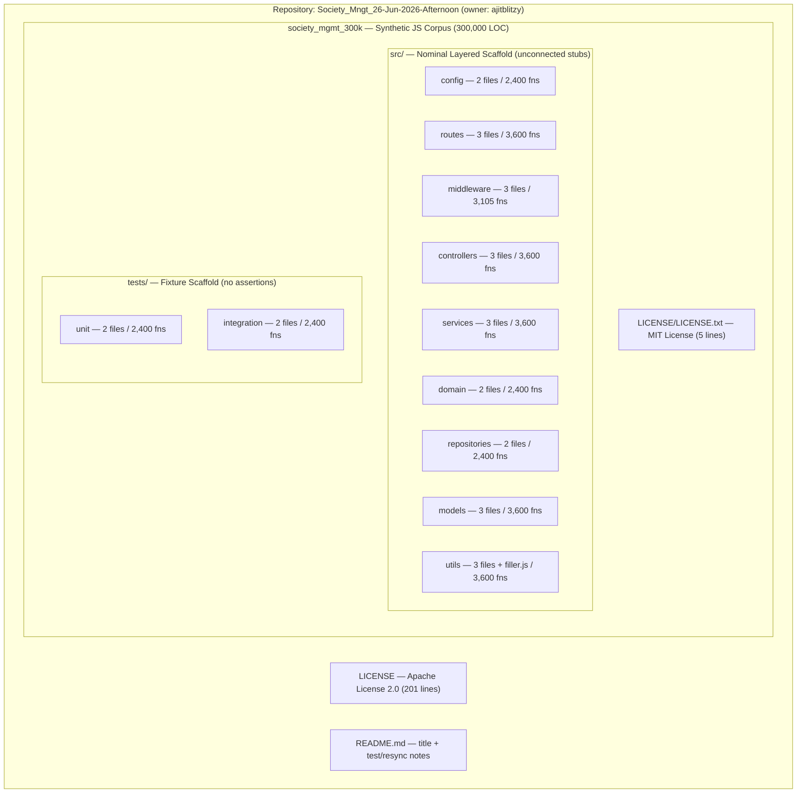
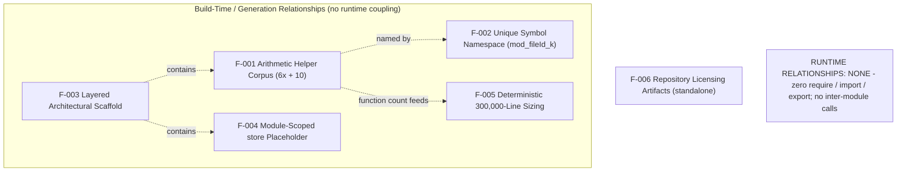
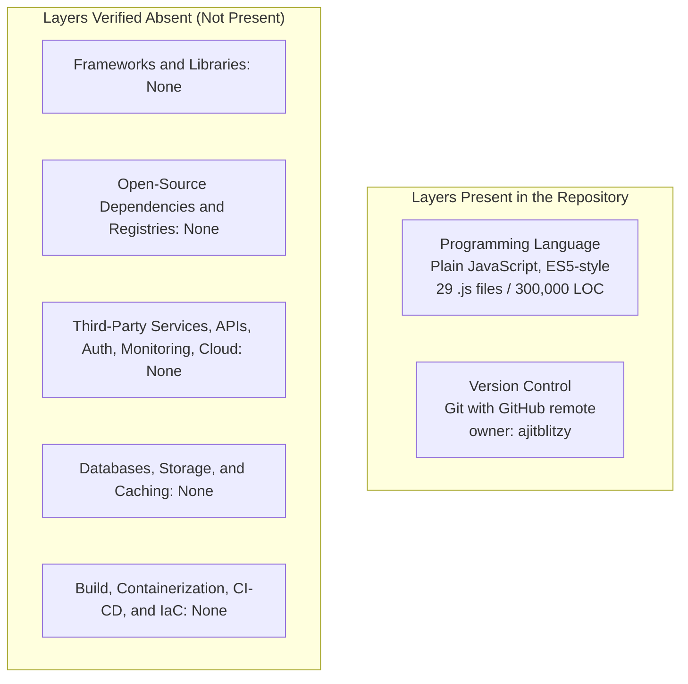
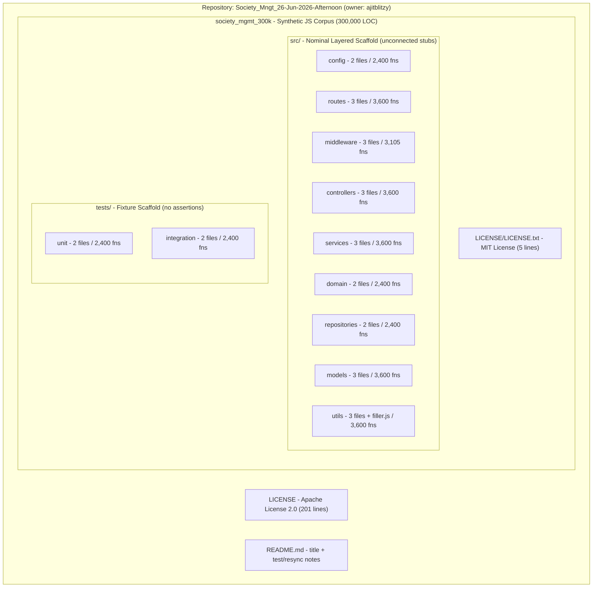
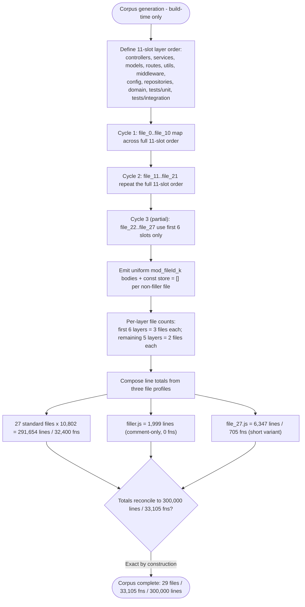
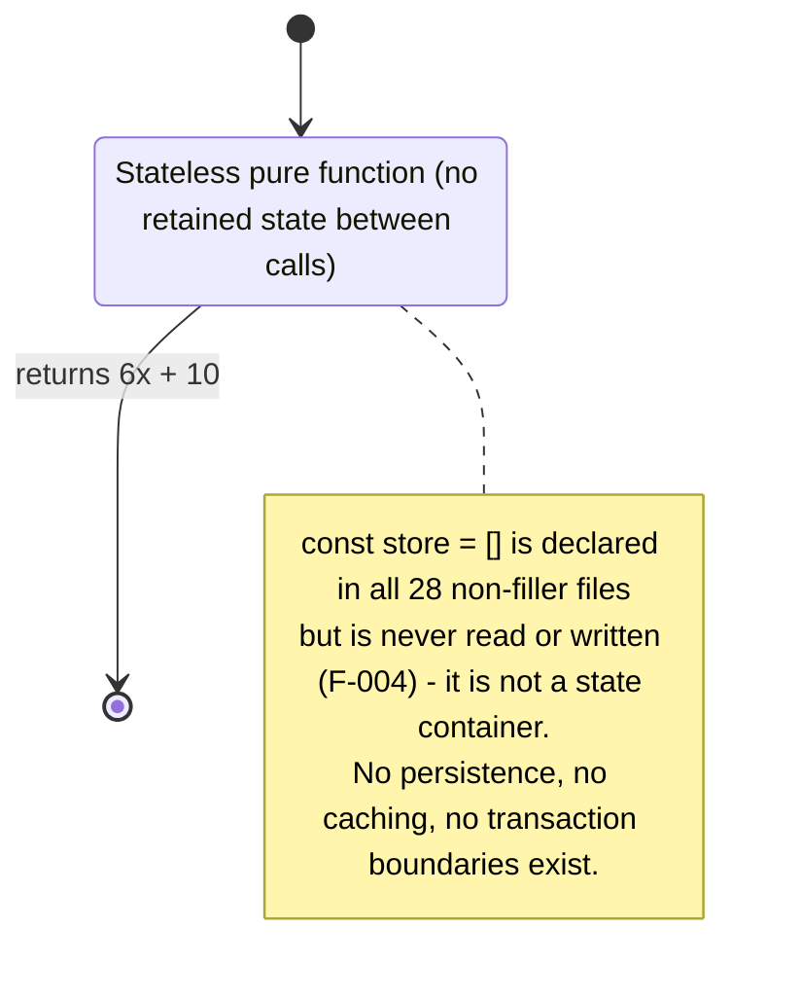
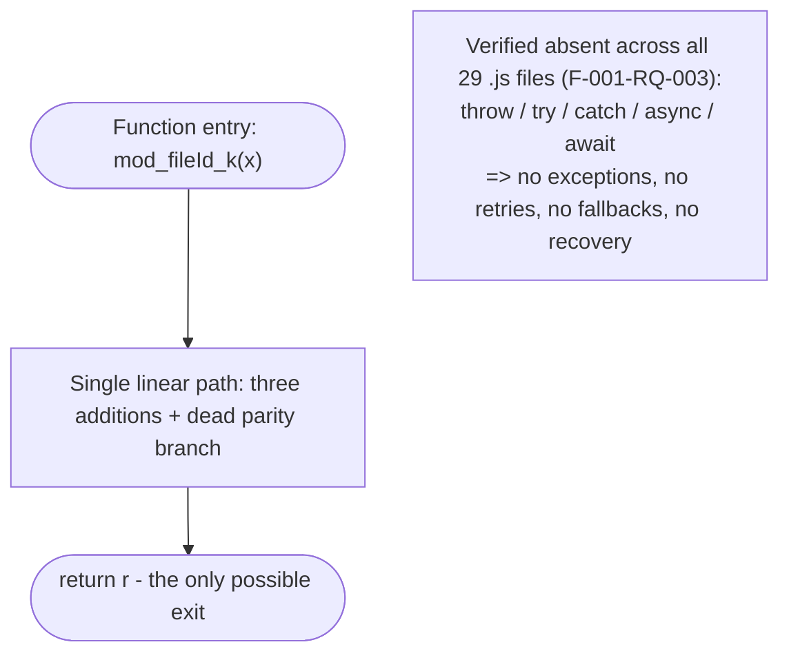
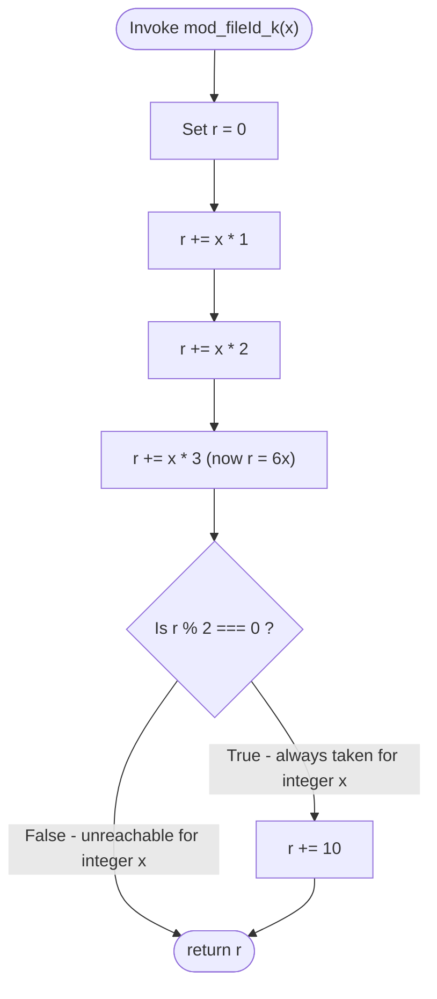
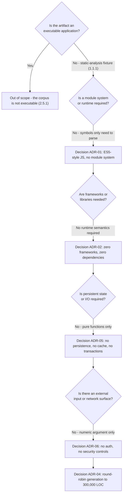
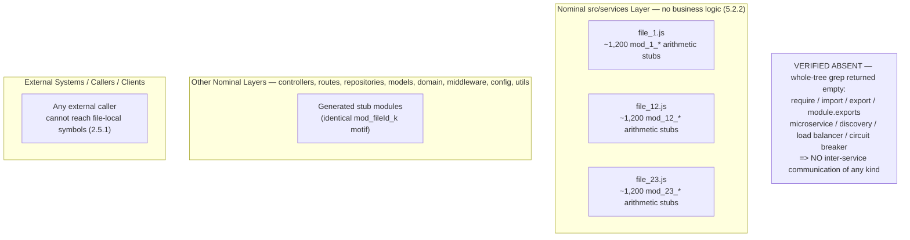

# Technical Specification

# 1. Introduction

This Technical Specification documents the `Society_Mngt_26-Jun-2026-Afternoon` repository (version-control owner `ajitblitzy`). In keeping with evidence-based documentation principles, every statement in this Introduction is grounded exclusively in artifacts observed within the repository — file contents, directory structure, version-control metadata, and indexer summaries — and no business attributes have been inferred, assumed, or fabricated.

A single, high-confidence finding frames the entire document and must be read first: **the repository is a synthetic JavaScript code corpus, not a working software product.** Despite a name that evokes a "society management" application, the codebase implements no society-management functionality whatsoever. This characterization is triangulated across three independent verification methods — direct reading of file contents, the repository's own indexer summaries at every directory depth, and semantic searches that returned zero results for business logic, application components, and build or entry-point artifacts. Wherever the prescribed section structure calls for business attributes (problem statements, stakeholders, success metrics, integrations, or market positioning), those attributes are explicitly recorded as **not defined in the repository** rather than invented.

> **Reader Advisory.** The naming, folder taxonomy, and per-file header comments of this repository superficially resemble a layered backend application. They are nominal labels only. The repository contains no runtime, no dependencies, no persistence, no API surface, and no executable entry point. It is best understood as a synthetic, layered-architecture JavaScript corpus sized to exactly 300,000 lines and intended for static analysis and traversal.

## 1.1 EXECUTIVE SUMMARY

### 1.1.1 Project Overview

The repository `Society_Mngt_26-Jun-2026-Afternoon` contains a single top-level project namespace: the folder `society_mgmt_300k`. The `300k` suffix encodes the corpus's defining quantitative property — the namespace comprises **exactly 300,000 lines of JavaScript**, verified by line count. The repository's own indexer characterizes the project, verbatim, as a *"synthetic JavaScript project corpus organized for analysis and traversal,"* and observes that the source tree is *"intended more for symbol density and static traversal than for a conventional production app."*

The table below summarizes the project at a glance, distinguishing verifiable facts from attributes that the codebase does not define.

| Aspect | Finding |
|---|---|
| Repository / owner | `Society_Mngt_26-Jun-2026-Afternoon` / `ajitblitzy` |
| Project namespace | `society_mgmt_300k` (single top-level folder) |
| Nature | Synthetic JavaScript corpus, not a production application |
| Size | 300,000 lines across 29 `.js` files; 33,105 generated functions |
| Business problem | Not defined in the repository |
| Stakeholders / users | Not defined in the repository |
| Value proposition | Not defined; demonstrable use is static-analysis / traversal fixture |

### 1.1.2 Core Problem Context

No business problem statement is defined in the repository. There are no requirements documents, user personas, business rules, or domain entities of any kind. The only narrative artifact, the root `README.md`, contains the repository title followed by two annotations: *"This line is added to test tech spec resync"* and *"Another line to block the 3rd project."* These strings strongly indicate that the repository functions as a **test or benchmark fixture for a documentation / technical-specification generation pipeline**, rather than as a deliverable application addressing a real business need.

### 1.1.3 Key Stakeholders and Users

No stakeholders, user personas, or user groups are defined anywhere in the repository. The codebase contains no roles, no access tiers, and no actor definitions. The single identity attribute available is the version-control owner, `ajitblitzy`, recorded in the Git configuration. All other stakeholder and end-user attributes are **not defined in the repository**.

### 1.1.4 Expected Impact and Value Proposition

No business value proposition, return-on-investment model, or expected business impact is defined in the repository. The corpus's only demonstrable utility is as a structured, high-volume input for static analysis, code traversal, and documentation-tooling exercises — consistent with its self-described purpose of supporting "symbol density and static traversal." Any business-level value statement would be fabrication and is therefore explicitly omitted.

## 1.2 SYSTEM OVERVIEW

### 1.2.1 Project Context

#### Business Context and Market Positioning

No business context or market positioning exists in the repository. The "society management" domain is implied solely by two surface signals: the repository name and the per-file header comment `// mod_<n> - society module` that appears at the top of every `.js` file. No corresponding domain implementation — members, units, billing, complaints, visitors, notices, or meetings — accompanies these labels. The domain framing is therefore a label without substance.

#### Current System Limitations

The repository does not replace or upgrade any pre-existing system, and no migration or legacy context is present. As an artifact in its own right, the corpus exhibits the following structural limitations relative to a conventional application:

- **No executable entry point** — there is no `index.js`, `app.js`, `server.js`, or `main.js`.
- **No runtime or framework** — there are no `require`/`import`/`module.exports` statements and no Node, Express, or comparable framework usage.
- **No dependency manifest** — there is no `package.json`, lockfile, or any other manifest anywhere in the tree.
- **No inter-module wiring** — modules neither import nor invoke one another.

Consequently, the system cannot be built, started, packaged, or executed as an application.

#### Integration with the Enterprise Landscape

No integrations exist. The codebase declares no external dependencies, contains no database drivers, connection strings, ORM, or SQL, exposes no API endpoints, and includes no messaging or third-party service connectors. There is no enterprise-landscape integration surface of any kind to document.

### 1.2.2 High-Level Description

#### Primary System Capabilities

The corpus's actual, verifiable content is a large population of deterministic, side-effect-free helper functions. Across the namespace there are **33,105 functions** named in the pattern `mod_<fileId>_<k>`, each accepting a single numeric input and computing a trivial arithmetic result. Each function sums the input multiplied by one, two, and three — equivalent to six times the input — and then conditionally adds ten when the running total is even.

A behavioral nuance is worth recording, as it underscores the placeholder nature of the code: because six times any integer is always even, the parity condition is always satisfied. Each function therefore effectively returns *six-times-input-plus-ten* unconditionally, and the parity branch is dead, always-true logic. In addition, every non-filler file declares a module-level array named `store` that is never read or written, serving purely as a placeholder symbol. There are no other capabilities present.

#### Major System Components

At the structural level, `society_mgmt_300k` is organized as a classic **layered backend scaffold**. The folder taxonomy suggests the canonical layering `config → routes → middleware → controllers → services → domain → repositories → models`, with `utils` as a cross-cutting concern and a parallel `tests` tree (`unit`, `integration`). This layering is **nominal only**: each folder contains generated stub modules with no imports/exports, no classes, no shared state, no API routes, and no inter-layer calls. The diagram below therefore depicts containment and grouping but deliberately draws **no edges between layers**, because no such connections exist in the codebase.



The per-layer composition of the namespace is as follows. The "Notes" column records the indexer's characterization of each layer, confirming that the conventional responsibilities implied by the folder names are absent.

| Layer (folder) | Files | Functions | Notes |
|---|---|---|---|
| `src/config` | 2 | 2,400 | No configuration object present |
| `src/middleware` | 3 | 3,105 | `file_27.js` is a short variant (705 fns / 6,347 lines) |
| `src/models` | 3 | 3,600 | No schema or fields |
| `src/controllers` | 3 | 3,600 | Not conventional controller endpoints |
| `src/routes` | 3 | 3,600 | No route definitions |
| `src/domain` | 2 | 2,400 | No domain entities |
| `src/services` | 3 | 3,600 | No business logic |
| `src/repositories` | 2 | 2,400 | No data access |
| `src/utils` | 3 (+ `filler.js`) | 3,600 | `filler.js` is comment-only padding (0 fns) |
| `tests/unit` | 2 | 2,400 | No assertions or test runner code |
| `tests/integration` | 2 | 2,400 | No assertions or test runner code |
| **Total** | **29** | **33,105** | **300,000 lines total** |

#### Core Technical Approach

The technical approach is uniform, minimal, and self-contained. The repository consists entirely of plain JavaScript files that repeat a single code motif, padded with a comment-only filler module to reach the precise line-count target. The verified line-count arithmetic is: 27 standard files at 10,802 lines each (291,654), plus `utils/filler.js` at 1,999 lines and `middleware/file_27.js` at 6,347 lines, totaling exactly 300,000 lines. The complete technology profile is summarized below.

| Attribute | Finding | Evidence |
|---|---|---|
| Language | JavaScript (plain `.js`; no TypeScript) | 29 `.js` files; extension scan |
| Runtime / framework | None | No `require`/`import`/`module.exports`; empty semantic search |
| Dependencies | None (zero external) | No `package.json`, lockfile, or any manifest |
| Database / persistence | None | No drivers, connection strings, ORM, or SQL |
| Build / CI / deployment | None | No `Dockerfile`, `docker-compose`, `.github`, `.env`, or build scripts |
| Entry point | None | No `index/app/server/main.js` |
| Version control | Git (remote: `Society_Mngt_26-Jun-2026-Afternoon`) | `.git/config` (token redacted) |

### 1.2.3 Success Criteria

#### Measurable Objectives

No business or product success objectives are defined in the repository. The single inherent, verifiable quantitative target embodied by the corpus is its **size** — the `300k` namespace target of 300,000 lines — which the codebase meets exactly via the line-count composition described in Section 1.2.2. All other measurable objectives are **not defined in the repository**.

#### Critical Success Factors

No critical success factors are defined in the repository. There are no acceptance criteria, no quality gates, and no operational readiness conditions present in any file.

#### Key Performance Indicators (KPIs)

No KPIs, service-level agreements (SLAs), or performance/availability targets are defined anywhere in the repository. Because no functional or business behavior exists to measure, no indicators can be derived from the codebase, and none are invented here.

## 1.3 SCOPE

### 1.3.1 In-Scope Elements

#### Core Features and Functionalities

The in-scope elements are limited to what the repository actually contains: a structural scaffold and a body of trivial, deterministic functions, together with two license documents.

| In-Scope Element | Description | Evidence |
|---|---|---|
| Layered-architecture scaffold | 29 `.js` files across 9 `src` layers and 2 `tests` layers | `society_mgmt_300k/src`, `.../tests` |
| Generated helper functions | 33,105 deterministic `mod_<n>_<k>` functions computing `6x + 10` | All non-filler `.js` files |
| Filler padding | Comment-only module used to reach the 300,000-line target | `src/utils/filler.js` (lines 298001–299999) |
| License documents | Two distinct license files (see Section 1.3.3) | root `LICENSE`; `.../LICENSE/LICENSE.txt` |

#### Implementation Boundaries

The implementation boundaries reflect a fully self-contained artifact with no external surface, no defined audience, and no data domains.

| Boundary Dimension | Defined Scope |
|---|---|
| System boundary | The single `society_mgmt_300k` namespace; no external interfaces or runtime |
| User groups covered | None defined in the repository |
| Geographic / market coverage | None defined in the repository |
| Data domains included | None; no models with fields, no persistence, no entities |

### 1.3.2 Out-of-Scope Elements

#### Excluded Capabilities

The following capabilities are verified absent from the repository and are therefore explicitly out of scope. They are listed so that stakeholders do not assume their presence based on the repository's name or folder taxonomy.

| Excluded Capability | Verification |
|---|---|
| Society-management features (members, units, billing, payments, complaints, visitors, notices, meetings) | Not present; semantic search returned empty |
| Authentication / authorization | Not present |
| API endpoints, request/response handling | Not present (routes/controllers are stubs) |
| Database, persistence, queries, data models with fields | Not present (models/repositories/domain are stubs) |
| External integrations, third-party services, messaging, configuration values | Not present |
| Build, packaging, deployment, runtime execution | Not present (no manifest, entry point, or CI) |
| Real test assertions, coverage, or runners | Not present (no `describe`/`it`/`expect`/`assert`) |

#### Future-Phase and Unsupported Considerations

The repository defines no roadmap, no future-phase considerations, and no deferred features. Because there is no functioning application, there are likewise no supported use cases to enumerate, and consequently every conventional application use case is unsupported. No integration points are planned or stubbed for later activation.

### 1.3.3 Repository Context Observations

#### Licensing Inconsistency

The repository contains two different and conflicting license documents at two locations. This inconsistency is recorded here as a factual repository-context observation; resolving the intended licensing posture is outside the scope of this Introduction.

| Location | License | Length |
|---|---|---|
| Root `/LICENSE` | Apache License 2.0 (full text) | 201 lines |
| `society_mgmt_300k/LICENSE/LICENSE.txt` | MIT License ("Copyright (c) 2026") | 5 lines |

## 1.4 REFERENCES

### 1.4.1 Files Examined

- `/LICENSE` — Root legal terms; identified as Apache License 2.0 (201 lines).
- `/README.md` — Primary identity signal; repository title plus two test/resync annotation lines.
- `society_mgmt_300k/LICENSE/LICENSE.txt` — MIT License (5 lines); evidence of the licensing inconsistency.
- `society_mgmt_300k/src/config/file_6.js`, `file_17.js` — Confirmed `mod_*` stub pattern; "no configuration object."
- `society_mgmt_300k/src/middleware/file_5.js`, `file_16.js`, `file_27.js` — Stub pattern; `file_27.js` is the short variant (705 fns / 6,347 lines).
- `society_mgmt_300k/src/models/file_2.js`, `file_13.js`, `file_24.js` — Stub pattern; no schema or fields.
- `society_mgmt_300k/src/controllers/file_0.js`, `file_11.js`, `file_22.js` — Stub pattern; "not conventional controller endpoints."
- `society_mgmt_300k/src/routes/file_3.js`, `file_14.js`, `file_25.js` — Stub pattern; no route definitions.
- `society_mgmt_300k/src/domain/file_8.js`, `file_19.js` — Stub pattern; no domain entities.
- `society_mgmt_300k/src/services/file_1.js`, `file_12.js`, `file_23.js` — Stub pattern; no business logic.
- `society_mgmt_300k/src/repositories/file_7.js`, `file_18.js` — Stub pattern; no data access.
- `society_mgmt_300k/src/utils/file_4.js`, `file_15.js`, `file_26.js` — Stub pattern (cross-cutting layer).
- `society_mgmt_300k/src/utils/filler.js` — Comment-only padding (lines 298001–299999); 0 functions.
- `society_mgmt_300k/tests/unit/file_9.js`, `file_20.js` — Fixtures with no assertions/runners.
- `society_mgmt_300k/tests/integration/file_10.js`, `file_21.js` — Fixtures with no assertions/runners.

### 1.4.2 Folders Explored

- `/` (root) — README, LICENSE, and the `society_mgmt_300k` namespace; no root-level executable code, manifest, or CI.
- `society_mgmt_300k/` — Project namespace; "synthetic JavaScript project corpus."
- `society_mgmt_300k/src/` — Nine layer folders enumerated, with full file/function inventory and the repeated arithmetic motif.
- `society_mgmt_300k/tests/` — `unit` and `integration` fixture layers; no assertions or runners.
- `society_mgmt_300k/src/config/` — Depth-3 retrieval; "no configuration object."
- `society_mgmt_300k/src/controllers/` — Depth-3 retrieval; "not conventional controller endpoints."
- `society_mgmt_300k/LICENSE/` — Inner license folder containing the MIT `LICENSE.txt`.

### 1.4.3 Searches and Retrievals Performed

- **Semantic searches (3, all empty):** business logic (members/billing/payments/complaints/auth); backend service/API component modules; application entry point/build/deployment config — confirming the absence of real functionality.
- **Cross-section retrievals (`get_tech_spec_section`):** None performed; the provided list of relevant Technical Specification sections was empty (`[]`), so no headings were available to retrieve.
- **Web searches:** None performed; the repository is fully self-contained and no real-time or external information was required to document this section.

# 2. Product Requirements

This section decomposes the `society_mgmt_300k` namespace into discrete, individually testable features. A foundational caveat governs the entire section and must be read before the catalog: the repository `Society_Mngt_26-Jun-2026-Afternoon` is a **synthetic JavaScript corpus** rather than a functioning product (per §1.1.1), and it therefore contains **no conventional product requirements** — no user stories, no business rules, no domain features, and no acceptance criteria authored as such. A broad semantic search for product requirements, feature specifications, business rules, user stories, and acceptance criteria returned empty.

Consequently, the features documented here are the **verifiable structural and computational properties of the corpus itself**, each grounded in direct evidence from the source tree and cross-referenced to the Introduction (§1.1–§1.3). No society-management capability (members, units, billing, complaints, visitors, notices, meetings, authentication, APIs, persistence) is documented as a feature, because §1.2.1 and §1.3.2 verify that none exists; the "society management" theme is a label present only in the repository name and the per-file header comment `// mod_<n> - society module`, with no corresponding implementation.

## 2.1 INTERPRETATION FRAMEWORK AND DOCUMENTATION BASIS

### 2.1.1 Absence of Conventional Product Requirements

The repository was exhaustively examined (full filesystem traversal, indexer summaries, and semantic search) and found to contain none of the artifacts from which product requirements are normally derived. There are no requirements documents, no acceptance criteria, no business rules, no domain entities, no API, no configuration values, and no executable behavior beyond a single trivial arithmetic motif. This finding is consistent with §1.1.2, which characterizes the repository as functioning as a **test or benchmark fixture for a documentation/technical-specification generation pipeline** rather than as a deliverable application, and with §1.2.3, which records that no business or product success objectives, critical success factors, or KPIs are defined.

Because no functional or business behavior exists to measure, the requirements in this section can only be framed against the corpus's verifiable static and computational properties. No requirement below has been invented; each traces to direct evidence (see §2.6).

### 2.1.2 Operational Definition of "Feature" for This Corpus

For the purposes of this section, a "feature" is defined as a **discrete, verifiable, and individually testable structural or computational property** of the corpus. Six such features are catalogued. They derive exclusively from the in-scope elements enumerated in §1.3.1 — the layered scaffold, the generated helper functions, the filler padding, and the license documents — plus two cross-cutting structural properties (the unique symbol namespace and the unused `store` placeholder) that are verifiable across the corpus.

### 2.1.3 Explicitly Excluded Feature Domains

To prevent the repository's name and folder taxonomy from being misread as evidence of capability, the following domains are explicitly excluded from the feature catalog. Each was verified absent (zero keyword occurrences across all `.js` files and/or empty semantic search), consistent with §1.3.2.

| Excluded Domain | Verification Basis |
|---|---|
| Society-management features (members, units, billing, complaints, visitors, notices, meetings) | Not present; semantic search empty (§1.3.2) |
| Authentication / authorization, roles, access tiers | Not present; no actor definitions (§1.1.3, §1.3.2) |
| API endpoints, routing, request/response handling | Not present; routes/controllers are stubs (§1.2.1, §1.3.2) |
| Database, persistence, ORM, SQL, data models with fields | Not present; models/repositories/domain are stubs (§1.3.2) |
| External integrations, messaging, third-party services, configuration | Not present; zero external dependencies (§1.2.1) |
| Build, packaging, deployment, runtime, CI | Not present; no manifest or entry point (§1.2.2) |
| Real test assertions, coverage, runners | Not present; no `describe`/`it`/`expect`/`assert` (§1.3.2) |

### 2.1.4 Assumptions, Constraints, and Requirement Versioning

The following assumptions and constraints qualify every requirement in this section:

- **Static-verification constraint** — Because the corpus has no runtime, entry point, or test runner (§1.2.2), all requirements are verified by **static analysis** (line/function counts, keyword scans, file/layer mapping, and direct content inspection) rather than by execution.
- **Numeric-input assumption** — Each helper function assumes a single numeric argument `x`. No input validation exists; the parity-branch behavior described below holds specifically for **integer** inputs, mirroring the verified evidence.
- **No-fabrication constraint** — Only evidence-grounded properties are documented. Any requirement not traceable to a file, folder, or count in §2.6 has been omitted.
- **Generated-artifact assumption** — The corpus is a regularly generated artifact; the exact counts (300,000 lines; 33,105 functions) are treated as the authoritative target/state.
- **Requirement versioning** — All requirements in this section are baselined at **version 1.0**, derived from the repository state encoded by the namespace name and date context (`Society_Mngt_26-Jun-2026-Afternoon`). Any regeneration of the corpus that changes line or function counts would require re-baselining the affected requirements.

## 2.2 FEATURE CATALOG

### 2.2.1 Feature Catalog Summary

The table below enumerates the six catalogued features. All features carry a **Status of Completed**, because the corpus is a fixed, fully generated artifact with no roadmap or deferred work (§1.3.2).

| Feature ID | Feature Name | Category | Priority |
|---|---|---|---|
| F-001 | Deterministic Arithmetic Helper Function Corpus | Computational Content / Core Corpus | Critical |
| F-002 | Unique Module-Function Symbol Namespace | Symbol & Naming Structure | High |
| F-003 | Layered Architectural Scaffold | Architectural Organization | High |
| F-004 | Module-Scoped `store` Placeholder Declaration | Placeholder Artifact | Low |
| F-005 | Deterministic 300,000-Line Corpus Sizing | Corpus Sizing & Padding | Critical |
| F-006 | Repository Licensing Artifacts | Repository Governance Artifact | Low |

### 2.2.2 F-001: Deterministic Arithmetic Helper Function Corpus

#### Feature Metadata

| Attribute | Value |
|---|---|
| Unique ID | F-001 |
| Feature Name | Deterministic Arithmetic Helper Function Corpus |
| Feature Category | Computational Content / Core Corpus |
| Priority Level | Critical |
| Status | Completed |

#### Description

**Overview** — This is the sole computational capability of the corpus. Across the namespace there are **33,105 functions** named `mod_<fileId>_<k>`, each accepting a single numeric input and computing a trivial arithmetic result. Every function initializes an accumulator to zero, adds the input multiplied successively by one, two, and three (yielding six times the input), then conditionally adds ten when the accumulator is even, and returns the accumulator. Because six times any integer is always even, the parity condition is always satisfied for integer inputs; each function therefore effectively returns **six-times-input-plus-ten unconditionally**, and the parity branch is dead, always-true logic (§1.2.2). Every one of the 33,105 functions is byte-for-byte identical except for its name. The functions are synchronous, pure, deterministic, and side-effect-free, with no recursion, no loops, no I/O, no shared state, and no error handling. The computation is illustrated in Figure 2.1.

**Value in Context** — No business value is defined (§1.1.4). The feature's only demonstrable utility is to provide high-density, uniform symbols for static-analysis and code-traversal exercises, consistent with the corpus's self-described purpose of supporting "symbol density and static traversal."

**Consumer Benefit** — No end users or personas are defined (§1.1.3). The implicit consumer is documentation/static-analysis tooling, which benefits from a large population of predictable, identical function bodies.

**Technical Context** — Plain ES5-style JavaScript with no module system; functions are file-local and not externally importable (§1.2.1). The function bodies contain no async, OOP, or error-handling constructs.


*Figure 2.1 — F-001 computation flow. This is the only behavioral flow that exists in the corpus; no other process flowcharts are referenced because no other behavioral flows exist.*

#### Dependencies

| Dependency Type | Detail |
|---|---|
| Prerequisite Features | None — F-001 is the foundational content of the corpus |
| System Dependencies | A JavaScript parser/engine would be required to evaluate a function; none is bundled and no runtime exists in the repository (§1.2.2) |
| External Dependencies | None — zero external dependencies; no `package.json`, lockfile, or manifest (§1.2.1) |
| Integration Requirements | None — modules neither import nor invoke one another (§1.2.1) |

### 2.2.3 F-002: Unique Module-Function Symbol Namespace

#### Feature Metadata

| Attribute | Value |
|---|---|
| Unique ID | F-002 |
| Feature Name | Unique Module-Function Symbol Namespace |
| Feature Category | Symbol & Naming Structure |
| Priority Level | High |
| Status | Completed |

#### Description

**Overview** — Every function in the corpus is named according to the pattern `mod_<fileId>_<k>`, where `fileId` identifies the source file (0–27) and `k` is the per-file function index. Names are globally unique across the 33,105 functions; standard files index `k` from 0 to 1199 (1,200 functions), while the short-variant `file_27.js` indexes `k` from 0 to 704 (705 functions).

**Value in Context** — No business value is defined. The unique, regular naming scheme is the primary enabler of the "symbol density" property that makes the corpus useful as a static-analysis fixture (§1.1.4).

**Consumer Benefit** — Provides deterministic, collision-free symbols for tooling that indexes or traverses the corpus.

**Technical Context** — Names are the only attribute that distinguishes otherwise byte-for-byte-identical function bodies (§1.2.2). Each file also carries a header comment `// mod_<n> - society module`.

#### Dependencies

| Dependency Type | Detail |
|---|---|
| Prerequisite Features | F-001 (the functions that are named) |
| System Dependencies | None |
| External Dependencies | None |
| Integration Requirements | None — names are not exported or referenced across modules (§1.2.1) |

### 2.2.4 F-003: Layered Architectural Scaffold

#### Feature Metadata

| Attribute | Value |
|---|---|
| Unique ID | F-003 |
| Feature Name | Layered Architectural Scaffold |
| Feature Category | Architectural Organization |
| Priority Level | High |
| Status | Completed |

#### Description

**Overview** — The namespace is organized as a classic layered backend scaffold: nine `src` layers (`config`, `routes`, `middleware`, `controllers`, `services`, `domain`, `repositories`, `models`, `utils`) plus a parallel `tests` tree (`unit`, `integration`). This layering is **nominal only** — each folder contains generated stub modules with no imports/exports, no classes, no shared state, no API routes, and no inter-layer calls (§1.2.2). The 29 `.js` files are distributed across the layers via a round-robin generation pattern (detailed in §2.4.2).

**Value in Context** — No business value is defined. The scaffold provides a recognizable directory taxonomy for traversal exercises while deliberately omitting the responsibilities the folder names imply.

**Consumer Benefit** — Offers a familiar layered structure for tooling that walks a conventional backend tree.

**Technical Context** — The folder taxonomy suggests the canonical layering `config → routes → middleware → controllers → services → domain → repositories → models` with `utils` as a cross-cutting concern, but no such connections exist; the §1.2.2 containment diagram intentionally draws no edges between layers.

#### Dependencies

| Dependency Type | Detail |
|---|---|
| Prerequisite Features | None — the scaffold is the container into which F-001/F-002/F-004 are generated |
| System Dependencies | A filesystem capable of representing the directory tree |
| External Dependencies | None |
| Integration Requirements | None — no inter-layer wiring (§1.2.2) |

### 2.2.5 F-004: Module-Scoped `store` Placeholder Declaration

#### Feature Metadata

| Attribute | Value |
|---|---|
| Unique ID | F-004 |
| Feature Name | Module-Scoped `store` Placeholder Declaration |
| Feature Category | Placeholder Artifact |
| Priority Level | Low |
| Status | Completed |

#### Description

**Overview** — Every non-filler file (all 28 numbered files) declares a module-level array named `store` via `const store = []`. This array is **never read or written** anywhere in the corpus; it serves purely as a placeholder symbol (§1.2.2).

**Value in Context** — No business value is defined. The declaration contributes to symbol density and reinforces the placeholder nature of the code.

**Consumer Benefit** — Provides an additional uniform, file-scoped symbol for static indexing.

**Technical Context** — The placeholder is one of the few distinct line shapes in the corpus alongside the arithmetic motif lines; its presence is verifiable by a count of exactly 28 occurrences and the absence of any `store.`, `store[`, or `store=` usage.

#### Dependencies

| Dependency Type | Detail |
|---|---|
| Prerequisite Features | None (but co-located with F-001 in every non-filler module) |
| System Dependencies | None |
| External Dependencies | None |
| Integration Requirements | None — the placeholder is never referenced (§1.2.2) |

### 2.2.6 F-005: Deterministic 300,000-Line Corpus Sizing

#### Feature Metadata

| Attribute | Value |
|---|---|
| Unique ID | F-005 |
| Feature Name | Deterministic 300,000-Line Corpus Sizing |
| Feature Category | Corpus Sizing & Padding |
| Priority Level | Critical |
| Status | Completed |

#### Description

**Overview** — The corpus meets a precise size target of **exactly 300,000 lines** of JavaScript, encoded by the `300k` suffix in the namespace name (§1.1.1). The target is reached by composing 27 standard files at 10,802 lines each (291,654 lines), plus the comment-only `src/utils/filler.js` at 1,999 lines, plus the short-variant `src/middleware/file_27.js` at 6,347 lines, totaling exactly 300,000 (§1.2.2). The filler module contains comment-only padding (lines `// filler 298001` through `// filler 299999`) and zero functions, while `file_27.js` is a short variant carrying 705 functions used to tune the totals.

**Value in Context** — This is the corpus's single inherent, verifiable quantitative target (§1.2.3). It is the defining property of the artifact as a high-volume static-analysis fixture (§1.1.4).

**Consumer Benefit** — Guarantees a predictable, exact corpus size for benchmarking traversal and documentation tooling.

**Technical Context** — Two complementary mechanisms achieve the target: a comment-only padding module (`filler.js`) and a short code-bearing variant (`file_27.js`). Together with the 27 uniform standard files, these reconcile to both the 300,000-line and the 33,105-function totals (§1.2.2).

#### Dependencies

| Dependency Type | Detail |
|---|---|
| Prerequisite Features | F-001 (the standard files' function bodies supply the bulk of the line count) |
| System Dependencies | A filesystem and a line-counting capability for verification |
| External Dependencies | None |
| Integration Requirements | None |

### 2.2.7 F-006: Repository Licensing Artifacts

#### Feature Metadata

| Attribute | Value |
|---|---|
| Unique ID | F-006 |
| Feature Name | Repository Licensing Artifacts |
| Feature Category | Repository Governance Artifact |
| Priority Level | Low |
| Status | Completed |

#### Description

**Overview** — The repository contains two distinct and conflicting license documents: the root `/LICENSE` holds the full Apache License 2.0 (201 lines), while `society_mgmt_300k/LICENSE/LICENSE.txt` holds the MIT License (5 lines, "Copyright (c) 2026"). This licensing inconsistency is recorded as a factual repository-context observation in §1.3.3.

**Value in Context** — No business value is defined. The artifacts are governance documents rather than behavioral capabilities; they are catalogued because §1.3.1 lists license documents as an in-scope element.

**Consumer Benefit** — Provides the legal-terms documents present in the repository; however, the inconsistency means the governing license is ambiguous.

**Technical Context** — The two documents reside at two locations and differ in both license family and length; resolving the intended licensing posture is outside the scope of this specification (§1.3.3).

#### Dependencies

| Dependency Type | Detail |
|---|---|
| Prerequisite Features | None |
| System Dependencies | None |
| External Dependencies | None |
| Integration Requirements | None |

## 2.3 FUNCTIONAL REQUIREMENTS

Each feature's requirements are presented as a **Requirement Details** table and an **Acceptance Criteria** table. Technical specifications and validation rules are consolidated into cross-feature matrices in §2.3.7 and §2.3.8 to avoid redundancy, since these dimensions are largely uniform across the synthetic corpus.

### 2.3.1 F-001 Functional Requirements

| Requirement ID | Description | Priority | Complexity |
|---|---|---|---|
| F-001-RQ-001 | Each function accumulates the input multiplied by one, two, and three (resulting in six times the input) | Must-Have | Low |
| F-001-RQ-002 | Each function conditionally adds ten when the accumulator is even (always-true parity branch for integer input) | Must-Have | Low |
| F-001-RQ-003 | Each function returns the accumulator synchronously with no side effects (pure, deterministic) | Must-Have | Low |
| F-001-RQ-004 | The corpus contains exactly 33,105 such functions | Must-Have | Low |

| Requirement ID | Acceptance Criteria |
|---|---|
| F-001-RQ-001 | For any numeric input, the accumulated value before the parity step equals six times the input, verifiable by inspecting the three additive statements and by evaluating sampled integer inputs |
| F-001-RQ-002 | The function body contains the conditional adding ten when the accumulator is even; for every integer input the condition evaluates true, so the returned value equals six-times-input-plus-ten |
| F-001-RQ-003 | A static scan of every function body returns zero occurrences of I/O, async, throw, loops, or external references; identical inputs yield identical outputs |
| F-001-RQ-004 | An aggregate `function ` count across all `.js` files equals exactly 33,105 |

### 2.3.2 F-002 Functional Requirements

| Requirement ID | Description | Priority | Complexity |
|---|---|---|---|
| F-002-RQ-001 | Every function is named per the pattern `mod_<fileId>_<k>` | Must-Have | Low |
| F-002-RQ-002 | Function names are globally unique; `fileId` ranges 0–27, `k` ranges 0–1199 (0–704 for `file_27.js`) | Must-Have | Low |

| Requirement ID | Acceptance Criteria |
|---|---|
| F-002-RQ-001 | A scan of all function declarations confirms every name matches the `mod_<fileId>_<k>` pattern |
| F-002-RQ-002 | No duplicate function names exist; per-file index ranges match 1,200 functions for standard files and 705 for `file_27.js` |

### 2.3.3 F-003 Functional Requirements

| Requirement ID | Description | Priority | Complexity |
|---|---|---|---|
| F-003-RQ-001 | The namespace provides nine `src` layer folders and two `tests` layer folders | Must-Have | Low |
| F-003-RQ-002 | The 29 `.js` files are distributed across layers via a round-robin pattern, yielding the per-layer file counts in §1.2.2 | Should-Have | Medium |

| Requirement ID | Acceptance Criteria |
|---|---|
| F-003-RQ-001 | The directory tree contains `src/{config, routes, middleware, controllers, services, domain, repositories, models, utils}` and `tests/{unit, integration}` |
| F-003-RQ-002 | The file-to-layer mapping matches the verified round-robin assignment (§2.4.2), producing 3 files each for controllers/services/models/routes/utils/middleware and 2 files each for config/repositories/domain/tests-unit/tests-integration |

### 2.3.4 F-004 Functional Requirements

| Requirement ID | Description | Priority | Complexity |
|---|---|---|---|
| F-004-RQ-001 | Each non-filler file declares a module-scoped array via `const store = []` | Should-Have | Low |
| F-004-RQ-002 | The `store` array is never read or written anywhere in the corpus | Should-Have | Low |

| Requirement ID | Acceptance Criteria |
|---|---|
| F-004-RQ-001 | A count of `const store = []` declarations equals exactly 28 (one per non-filler file) |
| F-004-RQ-002 | A scan returns zero usages of `store.`, `store[`, or `store=` (assignment) beyond the initial declaration |

### 2.3.5 F-005 Functional Requirements

| Requirement ID | Description | Priority | Complexity |
|---|---|---|---|
| F-005-RQ-001 | The corpus totals exactly 300,000 lines across all `.js` files | Must-Have | Low |
| F-005-RQ-002 | `src/utils/filler.js` provides comment-only padding (lines 298001–299999) and contains zero functions | Must-Have | Low |
| F-005-RQ-003 | `src/middleware/file_27.js` is a short variant of 6,347 lines and 705 functions that tunes the totals | Should-Have | Low |

| Requirement ID | Acceptance Criteria |
|---|---|
| F-005-RQ-001 | An aggregate line count across all `.js` files equals exactly 300,000; arithmetic reconciles as 291,654 + 1,999 + 6,347 |
| F-005-RQ-002 | `filler.js` contains only comment lines numbered `// filler 298001` through `// filler 299999` and zero function declarations (1,999 lines) |
| F-005-RQ-003 | `file_27.js` measures 6,347 lines and 705 functions, distinct from the 10,802-line / 1,200-function standard-file profile |

### 2.3.6 F-006 Functional Requirements

| Requirement ID | Description | Priority | Complexity |
|---|---|---|---|
| F-006-RQ-001 | The root `/LICENSE` contains the full Apache License 2.0 (201 lines) | Could-Have | Low |
| F-006-RQ-002 | The inner `LICENSE/LICENSE.txt` contains the MIT License (5 lines) | Could-Have | Low |

| Requirement ID | Acceptance Criteria |
|---|---|
| F-006-RQ-001 | The root `/LICENSE` file is present and contains Apache License 2.0 text spanning 201 lines |
| F-006-RQ-002 | `society_mgmt_300k/LICENSE/LICENSE.txt` is present and contains MIT License text ("Copyright (c) 2026", 5 lines) |

### 2.3.7 Consolidated Technical Specifications Matrix

Performance criteria are uniform across all features and are therefore stated once: each helper function executes in **O(1) constant time** (fixed arithmetic, no loops/recursion), and **no performance criteria or SLAs are defined anywhere** in the repository (§1.2.3). The matrix below records input/output and data characteristics per feature.

| Feature | Input Parameters | Output / Response | Data Requirements |
|---|---|---|---|
| F-001 | Single numeric argument `x` per function | Numeric result (six-times-input-plus-ten for integer input) | None — no persistent or shared data; no I/O |
| F-002 | None (naming is a static property) | Globally unique symbol names | None — names embedded in source only |
| F-003 | None (static directory structure) | 11 layer folders with distributed files | None — filesystem structure only |
| F-004 | None (static declaration) | Empty array bound to `store` (unused) | None — never read or written |
| F-005 | None (static composition) | Exactly 300,000 lines; 33,105 functions | None — line/function counts only |
| F-006 | None (static documents) | Two license text files | None — text documents only |

### 2.3.8 Consolidated Validation Rules Matrix

Across all features there are **no security requirements** (no I/O, network, authentication, or external input path beyond the numeric argument) and **no compliance requirements** defined in the repository, except that F-006 surfaces an unresolved licensing question. These uniform findings are reflected below.

| Feature | Business & Data Validation Rules | Security Requirements | Compliance Requirements |
|---|---|---|---|
| F-001 | No input validation present; behavior specified for integer input; parity branch is dead always-true logic | None — no attack surface beyond the numeric argument | None defined |
| F-002 | Names must match `mod_<fileId>_<k>` and be unique | None | None defined |
| F-003 | Folder set and per-layer file counts must match §1.2.2 | None | None defined |
| F-004 | `store` must be declared and must remain unreferenced | None | None defined |
| F-005 | Line/function totals must reconcile exactly to 300,000 / 33,105 | None | None defined |
| F-006 | Both license files must be present | None | Licensing inconsistency unresolved (Apache 2.0 vs MIT) — see §1.3.3 |

## 2.4 FEATURE RELATIONSHIPS

This subsection documents only relationships that are clearly evident in the source code; no relationships are inferred or imagined.

### 2.4.1 Runtime Dependency Analysis

**No runtime relationships exist.** Modules do not import, export, reference, or call one another — there are zero occurrences of `require`, `import`, `export`, or `module.exports` across the corpus (§1.2.1). There is consequently no runtime dependency graph, no shared service, and no integration point between any features. F-001's functions cannot be invoked from outside their declaring module because the symbols are file-local and not exported.

### 2.4.2 Build-Time Generation Relationships

The only relationships that are evident are **build-time/generation** relationships introduced when the corpus was produced. The clearest of these is a **round-robin distribution** of files across an 11-slot layer order: `controllers, services, models, routes, utils, middleware, config, repositories, domain, tests/unit, tests/integration`.

| Generation Cycle | Files | Layer Assignment |
|---|---|---|
| Cycle 1 | file_0 … file_10 | Full 11-slot order (controllers → tests/integration) |
| Cycle 2 | file_11 … file_21 | Same 11-slot order repeats |
| Cycle 3 (partial) | file_22 … file_27 | First 6 slots only (controllers, services, models, routes, utils, middleware) |

The partial third cycle (stopping at `file_27`) explains the per-layer file counts: the first six layers receive **three files each**, while `config`, `repositories`, `domain`, `tests/unit`, and `tests/integration` receive **two files each**. The resulting per-layer composition matches the §1.2.2 inventory and totals 29 files / 33,105 functions.

### 2.4.3 Shared Components and Common Services

There are **no shared components and no common services** in any runtime sense. The only *shared elements* are structural sameness produced by the generator: every non-filler module embeds the identical F-001 arithmetic motif and the F-004 `store` placeholder, and every function name follows the F-002 pattern. These are **generation patterns, not runtime dependencies** — no module consumes another's symbols.

### 2.4.4 Feature Dependency Map

Figure 2.2 depicts the build-time/structural relationships among features and emphasizes the complete absence of runtime coupling. Solid containment and dotted generation edges represent how features co-occur in the generated source; no edge represents a runtime call.



*Figure 2.2 — Feature dependency map. F-006 is standalone (governance artifact). The dashed edges denote generation-time co-occurrence only; the corpus has no runtime dependency graph.*

## 2.5 IMPLEMENTATION CONSIDERATIONS

### 2.5.1 Technical Constraints

The corpus is plain ES5-style JavaScript with **no module system**, which means symbols are file-local and not externally importable (§1.2.1). Functions therefore cannot be invoked from outside their declaring module as written. There is no executable entry point, runtime, or framework (§1.2.2), so none of the features can be built, started, packaged, or executed as an application. Verification of every requirement in this section is constrained to **static analysis**.

### 2.5.2 Performance Requirements

Each F-001 function is O(1) constant-time arithmetic, and no performance criteria, SLAs, or availability targets are defined anywhere in the repository (§1.2.3). The only performance-adjacent property is **corpus scale**: the exact 300,000-line / 33,105-function size (F-005), which is relevant to the time and memory characteristics of tools that parse or traverse the corpus rather than to any application behavior.

### 2.5.3 Scalability Considerations

Scalability in the conventional sense is **not applicable** — there is no runtime, server, or data path. The only "scale" property is the 300,000-line target (F-005), which is met exactly via the filler padding and short-variant composition (§1.2.2). Any change to corpus scale is a generation concern, not a runtime concern.

### 2.5.4 Security Implications

There is **no attack surface**: no I/O, no network, no authentication/authorization, no data handling, and no external input path beyond the numeric argument passed to a helper function (§1.3.2). Consequently, no feature carries security requirements. The single governance-level concern is the F-006 **licensing inconsistency** (Apache 2.0 at the root versus MIT inner), recorded in §1.3.3, which is a legal/compliance ambiguity rather than a software-security risk.

### 2.5.5 Maintenance Requirements

The corpus is highly regular and generated, which makes it straightforward to regenerate but yields several maintenance observations:

- **Dead logic (F-001)** — The parity branch is always-true for integer input, making the conditional dead/redundant logic (§1.2.2).
- **Unused placeholder (F-004)** — The module-scoped `store` array is declared but never used in any of the 28 non-filler files.
- **Licensing inconsistency (F-006)** — The conflicting Apache 2.0 and MIT documents constitute an open repository-context issue (§1.3.3).
- **Testability limitation** — The `tests/` tree provides no assertions or runners (§1.3.2); acceptance criteria can be framed only against the deterministic `6x+10` output and the corpus's static counts, not against any product behavior.

## 2.6 REQUIREMENTS TRACEABILITY MATRIX

### 2.6.1 Requirement-to-Evidence Traceability

| Requirement ID | Verification Evidence | Tech-Spec Cross-Reference |
|---|---|---|
| F-001-RQ-001/002/003 | `src/services/file_1.js`, `src/controllers/file_0.js`, all non-filler `.js` files (identical motif) | §1.2.2 |
| F-001-RQ-004 | Aggregate `function ` count = 33,105 across all `.js` | §1.1.1, §1.2.2 |
| F-002-RQ-001/002 | Function-name scans across all files; `fileId` 0–27, `k` 0–1199 (0–704 for file_27) | §1.2.2, §1.4.1 |
| F-003-RQ-001 | `society_mgmt_300k/src` (9 layers), `society_mgmt_300k/tests` (2 layers) | §1.2.2, §1.3.1 |
| F-003-RQ-002 | Verified file-to-layer round-robin mapping; per-layer table | §1.2.2 |
| F-004-RQ-001/002 | `const store = []` count = 28; no `store` usage | §1.2.2 |
| F-005-RQ-001 | Aggregate line count = 300,000 (291,654 + 1,999 + 6,347) | §1.1.1, §1.2.2, §1.2.3 |
| F-005-RQ-002 | `src/utils/filler.js` (lines 298001–299999; 0 functions) | §1.2.2, §1.3.1, §1.4.1 |
| F-005-RQ-003 | `src/middleware/file_27.js` (6,347 lines / 705 functions) | §1.2.2, §1.4.1 |
| F-006-RQ-001 | Root `/LICENSE` (Apache 2.0, 201 lines) | §1.3.3, §1.4.1 |
| F-006-RQ-002 | `society_mgmt_300k/LICENSE/LICENSE.txt` (MIT, 5 lines) | §1.3.3, §1.4.1 |

### 2.6.2 Feature-to-Specification Traceability

| Feature ID | Requirement IDs | Related Tech-Spec Section(s) |
|---|---|---|
| F-001 | F-001-RQ-001 … F-001-RQ-004 | §1.1.1, §1.2.2 (Primary Capabilities) |
| F-002 | F-002-RQ-001, F-002-RQ-002 | §1.2.2, §1.4.1 |
| F-003 | F-003-RQ-001, F-003-RQ-002 | §1.2.2 (Major Components), §1.3.1 |
| F-004 | F-004-RQ-001, F-004-RQ-002 | §1.2.2 |
| F-005 | F-005-RQ-001 … F-005-RQ-003 | §1.1.1, §1.2.2 (Core Technical Approach), §1.2.3 |
| F-006 | F-006-RQ-001, F-006-RQ-002 | §1.3.1, §1.3.3 |

## 2.7 REFERENCES

### 2.7.1 Files Examined

- `/README.md` — Repository title plus two test/resync annotation lines; identity signal for the fixture purpose.
- `/LICENSE` — Apache License 2.0 (201 lines); evidence for F-006-RQ-001.
- `society_mgmt_300k/LICENSE/LICENSE.txt` — MIT License (5 lines, "Copyright (c) 2026"); evidence for F-006-RQ-002 and the licensing inconsistency.
- `society_mgmt_300k/src/services/file_1.js` — Cross-confirmed the exact `6x + 10` motif and the `store` placeholder; evidence for F-001 and F-004.
- `society_mgmt_300k/src/controllers/file_0.js` — Confirmed motif and header comment; evidence for F-001 and F-002.
- `society_mgmt_300k/src/middleware/file_27.js` — Short variant (6,347 lines / 705 functions); evidence for F-005-RQ-003 and F-002-RQ-002.
- `society_mgmt_300k/src/utils/filler.js` — Comment-only padding (lines 298001–299999, 0 functions); evidence for F-005-RQ-002.
- All 29 `.js` files (aggregate analysis) — Line counts, function counts, header comments, unique-line profile, keyword-absence scans, function-name ranges, and file-to-layer mapping; evidence for F-001 through F-005.

### 2.7.2 Folders Explored

- `society_mgmt_300k/` — Project namespace; synthetic JavaScript corpus boundary.
- `society_mgmt_300k/src/` — Nine layer folders (`config`, `routes`, `middleware`, `controllers`, `services`, `domain`, `repositories`, `models`, `utils`); evidence for F-003.
- `society_mgmt_300k/tests/` — `unit` and `integration` fixture layers (no assertions/runners); evidence for F-003 and the testability limitation.
- `society_mgmt_300k/src/services/`, `society_mgmt_300k/src/controllers/`, `society_mgmt_300k/tests/unit/` — Depth-3 per-file characterization confirming the uniform stub pattern.
- `society_mgmt_300k/LICENSE/` — Inner license folder; evidence for F-006.

### 2.7.3 Cross-References and Searches Performed

- **Technical Specification sections retrieved** (via `get_tech_spec_section`): §1.1 Executive Summary, §1.2 System Overview, §1.3 Scope, §1.4 References — used to establish synthetic-corpus framing, verified counts, scope boundaries, and the licensing inconsistency.
- **Semantic search**: A broad search for product requirements, feature specifications, business rules, user stories, and acceptance criteria returned empty, confirming the absence of conventional requirement artifacts (§1.4.3).
- **Web searches**: None performed. The repository is fully self-contained and requires no real-time or external information to document this section (consistent with §1.4.3).
- **Related process flowcharts**: The only behavioral flow is the F-001 computation (Figure 2.1); no other process flowcharts are referenced because no other behavioral flows exist in the corpus.

# 3. Technology Stack

This section documents the **actual, verified technology stack** of the repository `Society_Mngt_26-Jun-2026-Afternoon` and its single project namespace `society_mgmt_300k`. It is grounded exclusively in direct evidence from the source tree and cross-referenced to the Introduction (§1.1–§1.4) and Implementation Considerations (§2.5).

A governing caveat applies to the entire section and must be read first. Per §1.1.1, the repository is a *"synthetic JavaScript project corpus organized for analysis and traversal,"* and per §1.1.2 its `README.md` annotations indicate it functions as a **test/benchmark fixture for a documentation/technical-specification generation pipeline** rather than a deliverable application. Accordingly, the technology stack is **deliberately minimal**: a single programming language (plain JavaScript) under Git version control, with no runtime, no frameworks, no dependencies, no services, no databases, and no build or deployment tooling.

The documentation methodology is evidence-based and triangulated across three independent sources — bash ground-truth file inventory, structured repository-traversal tooling, and the existing Technical Specification — with absences confirmed by both whole-tree pattern searches and a broad semantic search that returned empty. Where a conventional stack would list a component, this section records either the verified component or an explicit, evidenced **"Not Present"** determination, so that stakeholders do not infer technologies that the corpus does not contain.

> **Important scope clarification.** A conventional default technology stack — AWS, Docker, Terraform, GitHub Actions, Python, Flask, Auth0, MongoDB, Langchain, React, TypeScript, TailwindCSS, React-Native, Swift, Kotlin, Objective-C, and ElectronJS — was actively searched for and **verified absent** from this repository. None of these technologies appear anywhere in the tree and they are therefore **not** part of this system's stack. They are noted here only to forestall incorrect assumptions.

---

## 3.1 PROGRAMMING LANGUAGES

### 3.1.1 Language Inventory by Component

The repository uses **exactly one programming language: plain JavaScript**. A file-extension scan of the complete tree (depth 3, leaf-level) yields **29 `.js` files** plus **one `.txt` file** (the inner MIT license), with no other source, configuration, or markup languages present anywhere. Critically, there are **no TypeScript (`.ts`/`.tsx`), no JSX (`.jsx`), and no JSON files** in the repository — the language is plain `.js` only, as recorded in the §1.2.2 technology profile table.

Because the source tree is a uniform corpus rather than a multi-platform application, the "language by platform/component" breakdown collapses to a single entry: every layer of the nominal scaffold (`config`, `routes`, `middleware`, `controllers`, `services`, `domain`, `repositories`, `models`, `utils`, and the `tests/unit` and `tests/integration` trees) is implemented in the same plain JavaScript.

| Component / Layer | Language | File Count | Notes |
|---|---|---|---|
| `src/config`, `src/routes`, `src/middleware`, `src/controllers`, `src/services`, `src/domain`, `src/repositories`, `src/models`, `src/utils` | Plain JavaScript | 24 `.js` (+ `filler.js`) | Generated `mod_*` stub modules |
| `tests/unit`, `tests/integration` | Plain JavaScript | 4 `.js` | Fixture stubs, no assertions |
| **Total source language** | **JavaScript only** | **29 `.js`** | No TypeScript, JSX, or JSON |

### 3.1.2 Dialect, Feature Usage, and Code Motif

The dialect is **ES5-style JavaScript with no module system**, as documented in §2.5.1. The language features actually exercised by the corpus are minimal: `const` and `let` declarations, function declarations, basic arithmetic, and a single `if` statement. The representative code motif (observed in `society_mgmt_300k/src/controllers/file_0.js`) declares a module-scoped `const store = []`, followed by functions named `mod_<fileId>_<k>` that accept a single numeric argument and sum the input multiplied by one, two, and three before conditionally adding ten when the running total is even.

A behavioral nuance reinforces the placeholder nature of the language usage: per §1.2.2, because six times any integer is always even, the parity branch is always satisfied, so each function effectively returns `6x + 10` unconditionally and the conditional is dead, always-true logic. Notably, the `"use strict"` directive is **absent everywhere** (whole-tree grep returned empty), confirming the loose ES5-style posture.

### 3.1.3 Selection Rationale, Version Constraints, and Dependencies

No language-selection criteria, coding standards, or style guides are documented anywhere in the repository. The "selection" of plain JavaScript is most accurately characterized as the **generation format of the corpus** rather than an engineering decision, consistent with the corpus's self-described purpose of maximizing *"symbol density and static traversal"* (§1.1.1).

There are **no language-version declarations or constraints** of any kind:

- **No `.nvmrc` and no `.node-version`** — confirmed absent by whole-tree search.
- **No `engines` field** — there is no `package.json` in which such a field could exist (§1.2.1).
- **No `tsconfig.json`** — TypeScript is not used, so no compiler target/version is pinned.

The only dependency the language imposes is a JavaScript parser capable of reading ES5 syntax for **static analysis**; the corpus cannot be executed because there is no runtime or entry point (§2.5.1). Consequently, no minimum/maximum language-runtime version can be reported, and none is invented here.

---

## 3.2 FRAMEWORKS & LIBRARIES

### 3.2.1 Framework and Library Inventory

**Finding: None. The repository contains zero frameworks and zero libraries.** The §1.2.2 technology profile table records the runtime/framework attribute as **None**, supported by the absence of any `require`/`import`/`module.exports` statements and by an empty semantic search. There is consequently no "core framework with version" and no "supporting library" to enumerate.

### 3.2.2 Verified Absence of Common Frameworks

A whole-tree grep across all 29 `.js` files returned **completely empty** for every module and framework signal, providing strong negative evidence:

| Signal Searched | Result | Implication |
|---|---|---|
| `require(`, `import`, `export`, `module.exports` | Empty | No module system; no Node/CommonJS/ESM usage (§2.5.1) |
| `class` | Empty | No object-oriented framework constructs |
| `async`, `await`, `Promise` | Empty | No asynchronous runtime model |
| `fetch(`, `http`, `axios` | Empty | No HTTP client/server framework |

Per §1.2.1, there is *"no Node, Express, or comparable framework usage."* Mapping this against the conventional default stack: **no backend framework** (no Flask, no Express), **no frontend or UI framework** (no React, no React-Native), and **no AI/orchestration framework** (no Langchain) are present. Each was searched for and verified absent.

### 3.2.3 Compatibility Requirements and Justification

Because no frameworks or libraries are present, there are **no compatibility requirements** to satisfy (no peer-dependency matrices, no framework-version alignment, no polyfill targets). Likewise, **no version numbers can be reported**, because no frameworks or libraries — and no manifest in which versions could be declared — exist in the repository.

The justification for this empty layer follows directly from the corpus's purpose: a static-traversal fixture requires only parseable symbols, not an executable framework. Introducing a framework would add runtime semantics the corpus is explicitly not designed to exercise (§1.2.2, §2.5.1).

---

## 3.3 OPEN SOURCE DEPENDENCIES

### 3.3.1 Dependency Manifest and Lockfile Status

**Finding: None. There are zero external/open-source dependencies.** Per §1.2.1, *"there is no `package.json`, lockfile, or any other manifest anywhere in the tree,"* and the §1.2.2 profile records dependencies as **None (zero external)**. A broad semantic search for any "build configuration, dependency manifest, package definition, or environment settings file" returned **empty (`[]`)**.

A targeted manifest search across the entire repository confirmed the absence of every common ecosystem manifest and lockfile:

| Ecosystem | Manifest / Lockfile Searched | Result |
|---|---|---|
| Node.js / npm | `package.json`, `package-lock.json`, `yarn.lock`, `pnpm-lock.yaml` | Not present |
| Python | `requirements.txt`, `Pipfile`, `pyproject.toml` | Not present (see §3.3.3) |
| Java / JVM | `pom.xml`, `build.gradle` | Not present |
| Go / Rust / Ruby / PHP / .NET | `go.mod`, `Cargo.toml`, `Gemfile`, `composer.json`, `*.csproj` | Not present |

### 3.3.2 Package Registries

Because no manifests or lockfiles exist, **no package registries are referenced** anywhere in the repository — there is no use of npm, PyPI, Maven Central, crates.io, RubyGems, Packagist, or any private registry. There are therefore no registry URLs, scopes, authentication tokens, or pinned package versions to document.

### 3.3.3 Environment vs. Repository Boundary (Distractor Clarification)

For accuracy and to prevent a known false positive, this specification explicitly distinguishes the **repository** from the **tooling/agent environment** in which it was analyzed. A `requirements.txt` file exists at the host path `/app/`, but that file belongs to the **analysis tooling environment, not to the repository**, whose root resides at `/tmp/blitzy/Society_Mngt_26-Jun-2026-Afternoon/...`. It must **not** be treated as a project dependency manifest. Within the repository boundary itself, the dependency count remains exactly **zero**.

---

## 3.4 THIRD-PARTY SERVICES

### 3.4.1 External APIs and Integrations

**Finding: None. No external integrations of any kind exist.** Per the §1.2.1 enterprise-landscape assessment, *"No integrations exist. The codebase declares no external dependencies, contains no database drivers, connection strings, ORM, or SQL, exposes no API endpoints, and includes no messaging or third-party service connectors."* The §1.3.2 out-of-scope table independently verifies that external integrations, third-party services, and messaging are **Not present**, and that API endpoints / request-response handling are **Not present** (routes and controllers are stubs).

### 3.4.2 Authentication and Authorization Services

No authentication or authorization service is present. Per §1.3.2, authentication/authorization is **Not present**, and §2.5.4 confirms there is *"no authentication/authorization"* surface in the corpus. Mapping against the default stack, **no Auth0 integration** and no OAuth, JWT, SAML, or session-management mechanism of any kind exists.

### 3.4.3 Monitoring, Observability, and Cloud Services

No monitoring, observability, logging-aggregation, or cloud-platform service is integrated. There are **no cloud SDKs or configuration** for any provider — confirming, against the default stack, the absence of **AWS** (and likewise GCP/Azure) credentials, clients, or infrastructure references. The only "external" surface noted anywhere in the corpus is the single numeric argument passed to each helper function, which §2.5.4 characterizes as carrying *"no I/O, no network ... and no data handling."* There are therefore no service endpoints, API keys, webhooks, or third-party telemetry agents to document.

---

## 3.5 DATABASES & STORAGE

### 3.5.1 Primary and Secondary Databases

**Finding: None. There is no persistence layer of any kind.** The §1.2.2 technology profile records database/persistence as **None**, with the evidence *"No drivers, connection strings, ORM, or SQL."* The §1.3.2 out-of-scope table confirms that database, persistence, queries, and data models with fields are **Not present** because the `models`, `repositories`, and `domain` folders are stubs.

Mapping against the default stack, **no MongoDB instance** — and no other relational or non-relational database (PostgreSQL, MySQL, SQLite, DynamoDB, etc.) — is present. The `src/models`, `src/repositories`, and `src/domain` folders exist **by name only** (a nominal layered scaffold); per the §1.2.2 layer table, models have *"No schema or fields,"* repositories have *"No data access,"* and domain has *"No domain entities."*

### 3.5.2 Persistence Strategy, Caching, and Storage Services

There is **no data-persistence strategy**, **no caching solution** (no Redis or Memcached), and **no object/blob storage service** (no S3 or equivalent). No connection pooling, migration tooling, ORM/ODM, or query layer exists, consistent with the §1.2.1 finding of zero database drivers or connection strings.

### 3.5.3 The `store` Placeholder Symbol

The only data-like symbol anywhere in the corpus is an **unused, module-scoped `const store = []`** array declared at the top of every non-filler file. Per §1.2.2 and §2.5.5 (maintenance observation F-004), this array *is never read or written* and serves purely as a placeholder symbol across the 28 non-filler files. It does not constitute a storage mechanism, an in-memory cache, or a persistence strategy; it is dead declaration only and is recorded here solely to explain the single storage-adjacent token a reader may encounter in the source.

---

## 3.6 DEVELOPMENT & DEPLOYMENT

### 3.6.1 Version Control and Source Hosting

The **only confirmed development tool in the repository is Git**, with a **GitHub** remote. The §1.2.2 technology profile records version control as **Git**, evidenced by `.git/config`. The remote resolves to `github.com/ajitblitzy/Society_Mngt_26-Jun-2026-Afternoon.git` (access token redacted), and the repository owner is `ajitblitzy` (§1.1.3). No specific Git client version is pinned by the repository; the tool is the standard distributed VCS.

### 3.6.2 Build System and Containerization

**Finding: None for both.** There is no build system and no containerization:

- **Build system — None.** No `Makefile`, no `*.config.js` (e.g., webpack/rollup/vite), no build scripts, and — because there is no `package.json` — no npm `scripts` block (§1.2.2).
- **Containerization — None.** No `Dockerfile` and no `docker-compose.yml` exist (§1.2.2 records the absence of `Dockerfile` and `docker-compose`). Against the default stack, **Docker is not used**.

Per §2.5.1, *"There is no executable entry point, runtime, or framework, so none of the features can be built, started, packaged, or executed as an application,"* which is the root reason no build/packaging tooling is present.

### 3.6.3 CI/CD and Infrastructure as Code

**Finding: None for both.**

- **CI/CD — None.** There is no `.github/` directory and therefore no GitHub Actions workflows, and no other CI configuration (e.g., GitLab CI, CircleCI, Jenkins). The §1.2.2 profile explicitly notes the absence of `.github`. Against the default stack, **GitHub Actions is not configured**.
- **Infrastructure as Code — None.** No Terraform, CloudFormation, Pulumi, or equivalent IaC files were found. Against the default stack, **Terraform is not used**.

Per §1.3.2, build, packaging, deployment, and runtime execution are **Not present** (no manifest, entry point, or CI).

### 3.6.4 Linting, Formatting, and Environment Configuration

No quality-tooling or environment configuration is present. Targeted searches returned empty for all of the following:

| Tooling Category | Files Searched | Result |
|---|---|---|
| Linting / formatting | `.eslintrc`, `.babelrc`, `.prettierrc`, `.editorconfig` | Not present |
| Environment / secrets | `.env*` | Not present |
| VCS ignore rules | `.gitignore` (and `.blitzyignore`) | Not present |
| TypeScript config | `tsconfig.json` | Not present |

The absence of `.gitignore` and any ignore-rule file (including a `.blitzyignore`) means no portion of the tree is excluded from analysis, reinforcing the completeness of the inventory.

### 3.6.5 Testing Tooling

No testing framework or runner is present. The `tests/unit` and `tests/integration` folders contain **fixture stubs with no assertions and no runners**: per §1.3.2 and §2.5.5, there are no `describe`/`it`/`expect`/`assert` constructs, and no Jest, Mocha, Jasmine, or comparable test framework exists. As §2.5.5 notes, acceptance criteria can be framed only against the deterministic `6x + 10` output and the corpus's static counts, not against any product behavior.

---

## 3.7 CONSOLIDATED STACK, INTEGRATION, AND GOVERNANCE

### 3.7.1 Technology Stack Matrix

The following matrix consolidates the six required stack concerns, recording the verified status, any applicable version, and the supporting evidence. It aligns directly with the §1.2.2 technology profile table while expanding it to the section-prompt taxonomy.

| Stack Concern | Component | Status | Version | Primary Evidence |
|---|---|---|---|---|
| Programming Languages | Plain JavaScript (ES5-style) | **Present** | No declared version (no `.nvmrc`/`engines`); ES5-style syntax | 29 `.js` files; §1.2.2 |
| Frameworks & Libraries | — | **None** | Not applicable | No `require`/`import`/`module.exports`; §1.2.2 |
| Open-Source Dependencies | — | **None** | Not applicable | No `package.json`/lockfile; empty `[]` semantic search; §1.2.1 |
| Third-Party Services (APIs / Auth / Monitoring / Cloud) | — | **None** | Not applicable | No connectors or endpoints; §1.2.1, §1.3.2, §2.5.4 |
| Databases & Storage (incl. caching) | — | **None** | Not applicable | No drivers/ORM/SQL/connection strings; §1.2.2 |
| Development & Deployment | Git + GitHub remote | **Present** | No version pinned by repository | `.git/config`; §1.2.2 |
| Build / Containerization / CI-CD / IaC | — | **None** | Not applicable | No `Dockerfile`/`docker-compose`/`.github`/Terraform; §1.2.2 |

### 3.7.2 Stack Topology Diagram

The diagram below depicts the technology stack as two strata: the **layers present in the repository** (a single language layer plus version control) and the **layers verified absent**. Following the convention established by the §1.2.2 system diagram — which deliberately draws no edges because no inter-component connections exist — this diagram is **containment-only with no edges**, accurately reflecting that the present layers have no integration relationships with one another or with any absent layer.



### 3.7.3 Component Integration Requirements

There are **no integration requirements between components**, because there are no connected components to integrate. Per §1.2.1, the modules neither import nor invoke one another (no inter-module wiring), and per §2.5.1 the ES5-style symbols are file-local and not externally importable. The two present elements of the stack interact only in the trivial sense that Git versions the JavaScript files; there is no runtime coupling, no service-to-service contract, no data-access binding, and no API boundary. Any future integration would require introducing a module system, a runtime, and at least one of the currently absent layers — none of which is present or stubbed for later activation (§1.3.2).

### 3.7.4 Security Implications of the Stack

The minimal stack yields a correspondingly minimal security posture. Per §2.5.4, *"There is no attack surface: no I/O, no network, no authentication/authorization, no data handling, and no external input path beyond the numeric argument passed to a helper function. Consequently, no feature carries security requirements."* The security implications of the technology choices follow directly:

- **No dependency supply-chain risk** — with zero open-source dependencies and no package registries (§3.3), there is no transitive-dependency or registry-compromise exposure.
- **No secrets or credential exposure** — no `.env`, connection strings, API keys, or auth tokens exist in the tree (§3.4, §3.6.4); the only redacted secret is the Git remote token, which is environment-level rather than committed application configuration.
- **No network or data-handling exposure** — the absence of services, databases, and I/O (§3.4, §3.5) means there is no data-at-rest or data-in-transit surface to protect.

### 3.7.5 Licensing and Compliance Considerations

The single governance-level concern associated with the stack is a **licensing inconsistency**, recorded in §1.3.3 and reiterated in §2.5.4/§2.5.5 as open issue F-006. The repository contains two conflicting license documents:

| Location | License | Length |
|---|---|---|
| Root `/LICENSE` | Apache License 2.0 (full text) | 201 lines |
| `society_mgmt_300k/LICENSE/LICENSE.txt` | MIT License ("Copyright (c) 2026") | 5 lines |

This dual-license conflict is a **legal/compliance ambiguity rather than a software-security risk** (§2.5.4). Resolving the intended licensing posture is outside the scope of the Technology Stack section, but it is flagged here because license terms are a cross-cutting governance attribute of any technology stack and may affect downstream redistribution or reuse of the corpus.

---

## 3.8 REFERENCES

### 3.8.1 Files Examined

- `society_mgmt_300k/src/controllers/file_0.js` — Source of the verified `mod_*` `6x + 10` code motif and the unused `const store = []`; confirmed no imports/exports (basis for §3.1.2, §3.5.3).
- `society_mgmt_300k/src/utils/filler.js` — Comment-only padding module (lines 298001–299999, 0 functions); confirms the corpus contains no hidden build/dependency logic.
- `README.md` (repository root) — Title plus two test-fixture annotations; establishes the documentation-pipeline fixture nature framing the entire stack section.
- `LICENSE` (repository root) — Apache License 2.0 (201 lines); basis for the §3.7.5 licensing-inconsistency observation.
- `society_mgmt_300k/LICENSE/LICENSE.txt` — MIT License (5 lines); the conflicting inner license.
- `.git/config` (via `git remote`) — Confirms Git/GitHub as the sole development tool and the `ajitblitzy` owner (basis for §3.6.1).
- **Whole-tree pattern-match target set (all 29 `.js` files)** — Confirmed zero `require`/`import`/`export`/`module.exports`/`class`/`async`/`await`/`Promise`/`fetch`/`http`/`axios`/`use strict` (basis for §3.1–§3.2).
- **Manifest/config search target set (entire repository)** — Confirmed zero `package.json`, lockfiles, `Dockerfile`, `docker-compose.yml`, `*.yml`/`*.yaml`, `.env*`, `tsconfig.json`, `*.config.js`, `Makefile`, `.nvmrc`, `.node-version`, `.editorconfig`, `.gitignore`, and ESLint/Babel/Prettier configs (basis for §3.3, §3.6).

### 3.8.2 Folders Explored

- `society_mgmt_300k/src/` and its nine layer subfolders (`config`, `controllers`, `domain`, `middleware`, `models`, `repositories`, `routes`, `services`, `utils`) — Confirmed all layers are plain-JavaScript `mod_*` stubs with no framework, database, or service code.
- `society_mgmt_300k/tests/` (`unit`, `integration`) — Confirmed fixture stubs with no assertions or test-runner tooling (basis for §3.6.5).
- `society_mgmt_300k/LICENSE/` — Inner license folder containing the MIT `LICENSE.txt`.
- Repository root `/` — Confirmed no root-level manifest, build script, CI configuration, or ignore file.

### 3.8.3 Technical Specification Cross-References

- `1.1 EXECUTIVE SUMMARY` — Project nature (synthetic corpus / pipeline fixture), size, and owner; framing for the minimal-stack determination.
- `1.2 SYSTEM OVERVIEW` — The complete technology profile table (language, runtime/framework, dependencies, database, build/CI/deploy, entry point, version control) and the containment-only diagram convention.
- `1.3 SCOPE` — In-scope/out-of-scope verification of absent integrations, authentication, databases, APIs, and build/deployment; licensing-inconsistency record.
- `1.4 REFERENCES` — Corroborating file/folder inventory matching the ground-truth file enumeration.
- `2.5 IMPLEMENTATION CONSIDERATIONS` — Technical constraints (ES5, no module system, no runtime), the no-attack-surface security finding, and the F-004/F-006 maintenance observations.

# 4. Process Flowchart

This section documents the process and workflow architecture of the `society_mgmt_300k` namespace within the `Society_Mngt_26-Jun-2026-Afternoon` repository. Unlike a conventional application specification, where this section would enumerate business processes, user journeys, integration flows, and state machines, the present corpus is a **synthetic JavaScript benchmark fixture with no executable runtime** (§1.1, §1.2.1, §2.4.1). The repository has no entry point, no module system, no inter-module wiring, no I/O, and no external surface; consequently, the overwhelming majority of process artifacts that this section would ordinarily diagram **do not exist** in the codebase.

In strict adherence to the specification's **no-fabrication constraint** (§2.1.4), this section does not invent workflows to satisfy a template. Instead, it (a) precisely documents the **single behavioral flow** that does exist — the trivial arithmetic computation `6x + 10` performed by every one of the 33,105 helper functions (F-001, Figure 2.1); (b) documents the only legitimate multi-step *procedure*, namely the **build-time generation process** that produced the corpus (§2.4.2); (c) reuses the **static containment view** as the honest analogue of a "high-level system workflow" (§1.2.2); and (d) provides explicit, evidence-grounded **Not-Applicable** analyses — with degenerate illustrative diagrams — for error handling, integration sequences, and state transitions. Every claim below traces to a file, folder, requirement ID, or count enumerated in §2.6 and the source sections cited inline.

## 4.1 SCOPE, INTERPRETATION, AND NOTATION

### 4.1.1 Documentation Basis and the No-Fabrication Constraint

The repository was exhaustively examined (full filesystem traversal, indexer summaries, and semantic search) and found to contain **none of the artifacts from which process flows are normally derived** — no requirements documents, no business rules, no domain entities, no API, no configuration, and no executable behavior beyond a single arithmetic motif (§2.1.1). A broad semantic search for "business process workflow, state transitions, request handling, and error handling logic" returned an **empty result**, independently confirming that no workflow, process-orchestration, or error-handling content exists.

Three principles from §2.1.4 govern every diagram and statement in this section:

- **Static-verification constraint** — Because the corpus has no runtime, entry point, or test runner (§1.2.2), all process claims are verified by static analysis (keyword scans, function/line counts, and direct content inspection) rather than by execution.
- **No-fabrication constraint** — Only evidence-grounded flows are diagrammed. Where a conventional flow would normally appear but does not exist in the code, this section documents its **absence** rather than fabricating a plausible-looking diagram.
- **Numeric-input assumption** — The sole behavioral flow assumes a single numeric argument `x`; no input validation exists, and the documented parity behavior holds specifically for integer inputs.

### 4.1.2 Required-Diagram Applicability Matrix

The section prompt requests five categories of diagram. The table below records, for each, whether a faithful diagram is feasible and what this section actually presents. This matrix derives from the feasibility assessment grounded in §1.2.1, §1.2.2, §2.2.2, §2.4.1, and §2.5.

| Required Diagram | Feasible? | What This Section Presents | Evidence |
|---|---|---|---|
| High-level system workflow | Partial | Static **containment** view with **no edges** between layers — not a runtime workflow (§4.2.2) | §1.2.2 |
| Detailed process flow (per core feature) | Only one | **F-001 computation flow** (`6x + 10`) — the sole behavioral flow (§4.3.1) | §2.2.2, Figure 2.1 |
| Error-handling flowchart | No | Degenerate **single-path** diagram documenting verified absence of `throw`/`try`/`catch` (§4.7.1) | F-001-RQ-003, §2.2.2 |
| Integration sequence diagram | No | **Null-integration** sequence documenting absence of cross-module/cross-system calls (§4.2.3) | §1.2.1, §2.4.1 |
| State transition diagram | No | Degenerate **stateless** state diagram; the `store` placeholder is never used (§4.6.1) | F-004, §2.4.3 |
| Build-time generation flow (supplemental) | Yes | Round-robin distribution + sizing reconciliation — the only multi-step procedure (§4.4.1) | §2.4.2 |

### 4.1.3 Notation Conventions, Swim Lanes, and the Actor Model

All diagrams are authored in Mermaid.js. Flowcharts use rounded terminators (`([...])`) for start/end points, rectangles for process steps, and diamonds (`{...}`) for decision points; dashed edges (used only in the build-time map of §4.4.2) denote **generation-time co-occurrence, not runtime calls**.

The prompt's request for **swim lanes partitioned by actor or system is Not Applicable** to this corpus. The repository defines **no actors, roles, access tiers, or distinct interacting systems** (§2.1.3, §1.3.2): there are no end users or personas (§1.1.3 via §2.2.2), no authentication/authorization (§2.1.3), and no external systems, services, or APIs (§1.2.1, §2.4.1). With a single, file-local computational participant and no boundaries to cross, lane partitions would convey no information. Where a partition is conceptually meaningful — distinguishing **build-time generation** from the (empty) **runtime** — this distinction is rendered through labeling and the absence of edges rather than through actor lanes.

## 4.2 SYSTEM WORKFLOWS

### 4.2.1 Core Business Processes — Verified Absence

#### Excluded Business Domains and User Journeys

No business processes, end-to-end user journeys, or system interactions exist in the repository. The "society management" domain is implied **solely** by the repository name and the per-file header comment `// mod_<n> - society module`; no corresponding domain implementation accompanies these labels, making the framing "a label without substance" (§1.2.1). Each of the following domains was verified absent (zero keyword occurrences and/or empty semantic search), per §2.1.3 and §1.3.2:

| Domain Normally Yielding a Workflow | Status in Corpus |
|---|---|
| Society-management features (members, units, billing, payments, complaints, visitors, notices, meetings) | Not present; semantic search empty |
| Authentication / authorization, roles, access tiers | Not present; no actor definitions |
| API endpoints, routing, request/response handling | Not present; routes/controllers are stubs |
| Database, persistence, ORM, SQL, data models with fields | Not present; models/repositories/domain are stubs |
| External integrations, messaging, third-party services, configuration | Not present; zero external dependencies |
| Build, packaging, deployment, runtime, CI | Not present; no manifest or entry point |

Because no functional or business behavior exists, there are correspondingly **no user touchpoints**, no system-to-system interactions, and no multi-actor sequences to flowchart in this subsection.

#### Decision Points, System Interactions, and Error Paths

The corpus contains exactly **one decision point** across its entire 300,000-line extent: the parity check `if (r % 2 === 0)` inside each F-001 function (§1.2.2, §2.2.2). This is detailed in §4.3.2. There are **no system-interaction decision points** (no routing, no dispatch, no orchestration) and **no error-handling decision branches** anywhere in the codebase — a static scan returns zero occurrences of `throw`, `try`, `catch`, `async`, and `await` (F-001-RQ-003). Branch-keyword verification confirms the corpus uses only `if` (one per function) with **no** `else`, `switch`, `for`, or `while` constructs.

### 4.2.2 High-Level System Workflow — Static Containment View

The honest analogue of a "high-level system workflow" for this corpus is a **static containment and grouping diagram**. As §1.2.2 states explicitly, the layered taxonomy (`config → routes → middleware → controllers → services → domain → repositories → models`, with `utils` cross-cutting) is **nominal only**: each folder holds generated stub modules with no imports/exports, no classes, no shared state, no routes, and no inter-layer calls. The diagram below therefore deliberately draws **no edges between layers, because no such connections exist** (§1.2.2, §2.4.1, F-003). It depicts where code lives, not how control or data flows — because no control or data flows.



*Figure 4.1 — High-level static containment view (reproduced from §1.2.2). The intentional absence of inter-node edges is itself the most important architectural fact: there is no runtime workflow connecting these layers.* The composition totals **29 `.js` files / 33,105 functions / 300,000 lines** (§1.2.2).

### 4.2.3 Integration Workflows — Verified Absence

#### Data Flow Between Systems

No integration workflows exist. The codebase declares no external dependencies, contains no database drivers, connection strings, ORM, or SQL, exposes no API endpoints, and includes no messaging or third-party connectors (§1.2.1). There is, accordingly, **no data flow between systems** — and indeed no data, since no model carries fields and no persistence exists (§1.3.2, §2.3.7). Ground-truth keyword scans confirm zero occurrences of `require`, `import`, `export`, `module.exports`, `router`, `fetch`, and `Promise`, consistent with §2.4.1's finding that **"no runtime relationships exist."**

#### API Interactions, Event Processing, and Batch Sequences

There are no API interactions, no event-processing flows, and no batch-processing sequences. Modules neither import nor invoke one another, and F-001's functions are file-local and not externally importable (§2.4.1, §2.5.1). The diagram below is a **degenerate "null-integration" sequence** that documents this absence honestly: the only computational participant is a single file-local function, and every conventional integration channel is annotated as nonexistent.

```mermaid
sequenceDiagram
    participant Ext as External System (none in corpus)
    participant Mod as mod_fileId_k (file-local symbol)
    Note over Ext,Mod: No module system; symbols are not exported or importable (F-002, 2.5.1)
    Ext->>Mod: invoke(x) - cannot occur, no import/require/export
    Mod->>Mod: r = 6x; parity branch always true; r += 10
    Mod-->>Ext: numeric result - no cross-system channel exists
    Note over Ext,Mod: Zero APIs, DB drivers, queues, fetch, or network calls (1.2.1, 2.4.1)
```

*Figure 4.2 — Null-integration sequence. All inter-system messaging is shown as non-occurring; the corpus has no integration surface (§1.2.1, §2.4.1).*

## 4.3 SOLE BEHAVIORAL PROCESS FLOW (F-001)

### 4.3.1 End-to-End Computation Flow

Feature **F-001 (Deterministic Arithmetic Helper Function Corpus)** is the **only behavioral capability** in the corpus and therefore the only "detailed process flow" that can be diagrammed (§2.2.2). Across the namespace, **33,105 functions** named `mod_<fileId>_<k>` each accept a single numeric input, initialize an accumulator to zero, add the input multiplied successively by one, two, and three (yielding six times the input), conditionally add ten when the accumulator is even, and return the accumulator (F-001-RQ-001 through F-001-RQ-004). Every one of the 33,105 function bodies is **byte-for-byte identical except for its name**. Figure 4.3 reproduces the canonical flow from §2.2.2 (originally Figure 2.1).


*Figure 4.3 — F-001 computation flow (reproduced from Figure 2.1, §2.2.2). This is the only behavioral flow that exists in the corpus.*

### 4.3.2 Process Steps, Start/End Points, and the Single Decision Diamond

Mapping the flow to the prompt's flowchart-element checklist:

| Flowchart Element | Presence in F-001 | Detail |
|---|---|---|
| **Start point** | Yes | Function invocation `mod_<fileId>_<k>(x)` with a single numeric argument |
| **Process steps** | Yes (three) | Additive accumulations `r += x*1`, `r += x*2`, `r += x*3` → accumulator equals `6x` |
| **Decision diamond** | Yes (exactly one) | `if (r % 2 === 0)` — the **only decision point in the entire 300,000-line corpus** |
| **End point** | Yes | `return r` — the single, unconditional exit |
| **System boundaries** | None | No external systems, I/O, or module edges (§1.2.1, §2.4.1) |
| **User touchpoints** | None | No actors, UI, or request entry (§2.1.3) |
| **Error states / recovery** | None | No `throw`/`try`/`catch`; single linear path (F-001-RQ-003) |

The single decision diamond is **dead, always-true logic**: because six times any integer is always even, the parity condition is satisfied for every integer input, so the `False` branch is unreachable and each function **effectively returns `6x + 10` unconditionally** (§1.2.2, §2.2.2, §2.5.5). This is recorded as a maintenance observation (dead/redundant conditional) in §2.5.5 and as the only "business rule" (a degenerate one) in §2.3.8.

### 4.3.3 Timing, SLA, and Purity Considerations

The flow is **synchronous, pure, deterministic, and side-effect-free**, with no recursion, no loops, no I/O, no shared state, and no error handling (§2.2.2, F-001-RQ-003). With respect to the prompt's timing/SLA requirement:

- **Per-invocation timing** — Each function executes in **O(1) constant time** (fixed arithmetic, no loops or recursion) (§2.3.7, §2.5.2).
- **SLAs / availability targets** — **None are defined anywhere in the repository.** No performance criteria, latency budgets, throughput targets, or availability objectives exist, because there is no functional or business behavior to measure (§1.2.3, §2.3.7, §2.5.2).
- **Only timing-adjacent property** — The corpus **scale** (exactly 300,000 lines / 33,105 functions, F-005) affects the parse-and-traverse time of static-analysis tooling, not any application runtime (§2.5.2).

## 4.4 BUILD-TIME GENERATION PROCESS

### 4.4.1 Round-Robin Layer Distribution and Sizing Reconciliation

Since no runtime process exists, the only legitimate **multi-step procedure** to diagram is the **build-time generation** that produced the corpus (§2.4.2). This is explicitly a generation pattern, **not a runtime flow**. Files are distributed across an **11-slot layer order** — `controllers, services, models, routes, utils, middleware, config, repositories, domain, tests/unit, tests/integration` — in a round-robin across three cycles, and the precise 300,000-line target is reconciled from three file profiles (§2.4.2, F-005, §1.2.2).



*Figure 4.4 — Build-time generation procedure (grounded in §2.4.2 and F-005). The partial third cycle (stopping at `file_27`) is what yields three files for the first six layers and two files for the remaining five.*

The line arithmetic reconciles exactly: **291,654 + 1,999 + 6,347 = 300,000** (F-005-RQ-001, §1.2.2), and the function arithmetic reconciles as **32,400 + 705 = 33,105** (the 27 standard files contribute 1,200 functions each; `file_27.js` contributes 705; `filler.js` contributes 0).

### 4.4.2 Generation-Time Feature Co-Occurrence

There are **no shared components or common services** in any runtime sense; the only shared elements are **structural sameness produced by the generator** (§2.4.3). Figure 4.5 reproduces the feature dependency map from §2.4.4 (originally Figure 2.2). Every edge denotes **generation-time co-occurrence only** — dashed, never a runtime call.


*Figure 4.5 — Feature dependency map (reproduced from Figure 2.2, §2.4.4). F-006 is standalone; dashed edges denote generation-time co-occurrence only.*

### 4.4.3 Build-Time Sequencing and the Absence of Runtime Edges

The generation procedure of Figure 4.4 is the **only sequence with a defined ordering** in the documentation set, and that ordering is **build-time** (cycle 1 → cycle 2 → partial cycle 3 → emit → size → verify). Once generation completes, the artifact is **static and inert**: there is no subsequent runtime sequence, no scheduler, no event loop, and no batch job. This distinction must be preserved by readers — the existence of a generation procedure does **not** imply any runtime process, consistent with §2.4.1's unequivocal statement that no runtime relationships exist.

## 4.5 VALIDATION RULES AND CHECKPOINTS

This subsection addresses the prompt's "Validation Rules" requirement (business rules, data validation, authorization checkpoints, regulatory compliance). The consolidated finding from §2.3.8 is that, across all features, there are **no security requirements** and **no compliance requirements** beyond a single licensing ambiguity.

### 4.5.1 Business Rules at Each Step

The only "business rule" present at any process step is the **dead, always-true parity branch** in F-001 (`if (r % 2 === 0) r += 10`), which is degenerate logic rather than a genuine business constraint (§2.3.8, §2.5.5). No pricing rules, eligibility rules, workflow-transition rules, or domain invariants exist, because no business domain is implemented (§2.1.3, §1.3.2).

### 4.5.2 Data Validation Requirements

**No input validation exists.** Each helper function assumes a single numeric argument `x` and performs no type checks, range checks, null checks, or sanitization (§2.1.4, §2.3.8). The documented behavior holds specifically for integer inputs (the numeric-input assumption of §2.1.4). There are no data-validation checkpoints because there is no data layer, no schema, and no persistence (§1.3.2, §2.3.7).

### 4.5.3 Authorization Checkpoints and Regulatory Compliance Checks

- **Authorization checkpoints — None.** The corpus defines no authentication, authorization, roles, or access tiers, and no actors against whom to authorize (§2.1.3, §2.3.8, §1.3.2). There is no attack surface beyond the numeric argument passed to a function (§2.5.4).
- **Regulatory compliance checks — None defined.** The single governance-level concern is **not** a runtime compliance check but the **F-006 licensing inconsistency**: the root `/LICENSE` contains the Apache License 2.0 (201 lines) while `society_mgmt_300k/LICENSE/LICENSE.txt` contains the MIT License (5 lines, "Copyright (c) 2026") (§2.3.8, §1.3.3, §2.5.4, F-006-RQ-001/RQ-002). This is a legal/compliance ambiguity recorded as a repository-context observation, not a process-level compliance gate.

## 4.6 TECHNICAL IMPLEMENTATION — STATE MANAGEMENT

### 4.6.1 State Transitions — Not Applicable

**No state machine exists**, so a conventional state-transition diagram is Not Applicable. F-001 functions are **pure and stateless**, returning `6x + 10` with no retained state between invocations (§2.2.2, §2.5.1). Figure 4.6 renders this honestly as a degenerate single-state model.



*Figure 4.6 — Degenerate state model. The corpus has no states to transition between; the lone `store` placeholder is inert (F-004, §2.4.3).*

### 4.6.2 Data Persistence, Caching, and Transaction Boundaries

All three are **Not Applicable**:

- **Data persistence points — None.** There are no database drivers, connection strings, ORM, or SQL anywhere in the corpus (§1.2.1); models, repositories, and the domain layer are stubs with no fields (§1.3.2).
- **Caching requirements — None.** There is no cache layer and no runtime to cache against; the only "scale" property is the static 300,000-line size (§2.5.2, §2.5.3).
- **Transaction boundaries — None.** With no data layer and no operations that mutate shared state, there are no transactions, no commit/rollback semantics, and no isolation concerns (§2.5.1–§2.5.3).

### 4.6.3 The Unused `store` Placeholder

The closest artifact to a state container is the module-scoped array declared via `const store = []` in every non-filler file (F-004). It is, however, a **pure placeholder**: a count confirms **exactly 28** declarations (one per non-filler file), and a scan returns **zero** usages of `store.`, `store[`, or `store=` beyond the initial declaration (F-004-RQ-001, F-004-RQ-002, §2.2.5). It is therefore never read or written and contributes no state to any process (§2.4.3, §2.5.5).

## 4.7 TECHNICAL IMPLEMENTATION — ERROR HANDLING

### 4.7.1 Error-Handling Posture — Verified Absence

**No error handling exists anywhere in the corpus.** A static scan returns **zero occurrences** of `throw`, `try`, `catch`, `async`, and `await` (F-001-RQ-003, §2.2.2). Each function exposes a **single linear execution path** with exactly one exit (`return r`) and no error branches. Figure 4.7 documents this posture; the standalone annotation node records the verified absence rather than implying any error path.



*Figure 4.7 — Error-handling posture. The corpus has exactly one control-flow path and no exception mechanics (F-001-RQ-003, §2.5.4).*

### 4.7.2 Retry, Fallback, and Recovery Procedures — Not Applicable

Because no operation can fail (no I/O, no network, no external input path beyond a numeric argument), there are **no retry mechanisms, no fallback processes, and no recovery procedures** (§2.5.4). The security analysis in §2.5.4 confirms there is **no attack surface and no data handling**, which is the same structural reason no failure modes — and hence no recovery flows — exist.

### 4.7.3 Error Notification Flows — Not Applicable

There are **no error notification flows**: no logging framework, no alerting, no monitoring hooks, no message queues, and no external sinks to which an error could be reported (§1.2.1, §2.4.1, §2.5.4). No `console`, logger, or notification construct participates in any function body (§2.2.2).

## 4.8 REQUIRED-DIAGRAM COVERAGE AND TRACEABILITY

### 4.8.1 Diagram Inventory and Feasibility Outcomes

The table below inventories every diagram produced in this section, mapping each to the prompt's required categories and to its supporting evidence. Where a category could not be satisfied with a genuine workflow, this section produced an evidence-grounded **degenerate or absence** diagram, consistent with the no-fabrication discipline (§2.1.4).

| Figure | Title | Required Category Satisfied | Nature | Primary Evidence |
|---|---|---|---|---|
| Figure 4.1 | High-level static containment view | High-level system workflow | Static containment (no edges) | §1.2.2, F-003 |
| Figure 4.2 | Null-integration sequence | Integration sequence diagram | Absence-documenting | §1.2.1, §2.4.1 |
| Figure 4.3 | F-001 computation flow | Detailed process flow | Sole real behavioral flow | §2.2.2, F-001 |
| Figure 4.4 | Build-time generation procedure | (Supplemental) Multi-step procedure | Build-time, not runtime | §2.4.2, F-005 |
| Figure 4.5 | Feature dependency map | (Supplemental) Relationship map | Generation-time co-occurrence | §2.4.4 |
| Figure 4.6 | Degenerate stateless model | State transition diagram | Absence-documenting | F-004, §2.4.3 |
| Figure 4.7 | Error-handling posture | Error-handling flowchart | Absence-documenting | F-001-RQ-003, §2.5.4 |

### 4.8.2 Cross-Reference Index to Related Requirements

For readers integrating this section with the rest of the specification, the following cross-references anchor each process claim to its governing requirement and source section:

| Topic in This Section | Related Requirement(s) | Source Section(s) |
|---|---|---|
| Sole behavioral flow (`6x + 10`); dead parity branch | F-001-RQ-001 … RQ-004 | §2.2.2, §2.3.1, §2.5.5 |
| Unique symbol namespace `mod_<fileId>_<k>` | F-002-RQ-001, RQ-002 | §2.2.3, §2.3.2 |
| Nominal layered scaffold; no inter-layer edges | F-003-RQ-001, RQ-002 | §1.2.2, §2.2.4, §2.3.3 |
| Unused `store` placeholder; no state container | F-004-RQ-001, RQ-002 | §2.2.5, §2.3.4, §2.4.3 |
| Build-time round-robin generation; 300,000-line sizing | F-005-RQ-001 … RQ-003 | §2.4.2, §2.2.6, §2.3.5 |
| Licensing inconsistency (only compliance item) | F-006-RQ-001, RQ-002 | §1.3.3, §2.3.8, §2.5.4 |
| No runtime relationships / integrations | — | §1.2.1, §2.4.1 |
| No SLAs; O(1) timing | — | §1.2.3, §2.3.7, §2.5.2 |
| No error handling / state / persistence | — | §2.5.1–§2.5.4 |

#### References

**Technical Specification Sections Consulted**
- `1.2 SYSTEM OVERVIEW` — Source of the static containment diagram (Figure 4.1), the per-layer composition totals, the line-count arithmetic, the technology profile (no runtime/manifest/entry point), and the "no edges between layers" framing.
- `1.3 SCOPE` — In-scope elements (scaffold, generated functions, filler, licenses) and the verified out-of-scope absences (society features, auth, APIs, DB, integrations, build/deploy, real tests); licensing inconsistency (§1.3.3).
- `2.1 INTERPRETATION FRAMEWORK AND DOCUMENTATION BASIS` — No-fabrication, static-verification, and numeric-input constraints (§2.1.4); explicitly excluded feature domains (§2.1.3); basis for the absence analyses.
- `2.2 FEATURE CATALOG` — F-001 computation flow reproduced as Figure 4.3 (originally Figure 2.1); all six features (F-001–F-006) and their "None" dependencies; the unused `store` placeholder (F-004).
- `2.3 FUNCTIONAL REQUIREMENTS` — Requirement IDs and acceptance criteria cited throughout §4.3–§4.8; consolidated technical-specification matrix (O(1), no SLAs, §2.3.7) and validation-rules matrix (no security/compliance, no input validation, §2.3.8).
- `2.4 FEATURE RELATIONSHIPS` — "No runtime relationships exist" (§2.4.1); build-time round-robin generation (§2.4.2) basis for Figure 4.4; feature dependency map reproduced as Figure 4.5 (originally Figure 2.2); absence of shared components (§2.4.3).
- `2.5 IMPLEMENTATION CONSIDERATIONS` — Static-only constraints (§2.5.1), O(1) timing and absence of SLAs (§2.5.2), scalability N/A (§2.5.3), no attack surface (§2.5.4), and maintenance observations on dead logic, unused `store`, and licensing (§2.5.5).

**Repository Artifacts Referenced as Evidence**
- `society_mgmt_300k/src/` — Nine nominal layers (`config`, `routes`, `middleware`, `controllers`, `services`, `domain`, `repositories`, `models`, `utils`) of unconnected stub modules; basis for the containment view and round-robin distribution.
- `society_mgmt_300k/tests/` — `unit` and `integration` fixture layers with no assertions or runner; basis for the absence of real test workflows.
- `society_mgmt_300k/src/controllers/file_0.js` — Representative standard file (`mod_0_0` … `mod_0_1199`, 1,200 functions; unused `store`); basis for the F-001 flow and the uniform-body finding.
- `society_mgmt_300k/src/middleware/file_27.js` — Short-variant file (705 functions / 6,347 lines) referenced in the generation/sizing procedure (Figure 4.4).
- `society_mgmt_300k/src/utils/filler.js` — Comment-only padding module (lines `// filler 298001`–`// filler 299999`, 0 functions, 1,999 lines) referenced in the sizing reconciliation.
- `LICENSE` (root) and `society_mgmt_300k/LICENSE/LICENSE.txt` — Conflicting Apache 2.0 / MIT documents underpinning the only compliance observation (F-006, §4.5.3).

**Web Searches Performed**
- None. This section documents a self-contained internal corpus; all evidence was sourced from the Technical Specification sections and repository artifacts listed above. No external information was required or retrieved.

# 5. System Architecture

This section documents the system architecture of the `society_mgmt_300k` corpus contained in the `Society_Mngt_26-Jun-2026-Afternoon` repository (owner: `ajitblitzy`). The single most important architectural fact — one that governs the interpretation of every subsection below — is that this artifact is **not a functioning application**. It is a synthetic JavaScript corpus organized for static analysis and traversal, whose source tree is intended for symbol density rather than for a conventional production app (§1.1.1). The "society management" domain and the "layered architecture" are **nominal labels only**: there is no runtime, no inter-module wiring, no data, no integrations, and no behavior beyond a single trivial arithmetic function repeated 33,105 times (§1.2.1, §1.2.2).

Accordingly, this architecture documentation deliberately departs from the typical pattern of describing live components, data flows, and integration contracts. The defining architectural characteristic of this system is the **intentional absence of connections**. Every "Not Applicable" or "None" verdict recorded below is an evidence-backed architectural finding — verified through whole-tree keyword scans and first-hand file inspection — not an omission. Where a conventional system would expose runtime relationships, this corpus exposes only **build-time generation relationships**, and those are documented faithfully.

## 5.1 High-Level Architecture

### 5.1.1 System Overview

#### Architectural Style and Rationale

At the structural level, `society_mgmt_300k` is organized as a classic **layered backend scaffold**. The folder taxonomy suggests the canonical layering `config → routes → middleware → controllers → services → domain → repositories → models`, with `utils` as a cross-cutting concern and a parallel `tests` tree (`unit`, `integration`) (§1.2.2). This is the most accurate name for the style, but it must be qualified immediately: **the layering is nominal only**. Each folder contains generated stub modules with no imports/exports, no classes, no shared state, no API routes, and no inter-layer calls (§1.2.2, §2.4.1).

The rationale for adopting an empty layered scaffold follows directly from the corpus's purpose. A static-traversal fixture requires only parseable symbols, not an executable framework; introducing a runtime framework would add execution semantics the corpus is explicitly not designed to exercise (§3.2.3). The layered folder names therefore serve as an **organizational and symbol-distribution device** — a way to spread 33,105 generated functions across a recognizable directory structure — rather than as a separation-of-concerns boundary with enforced runtime contracts.

#### Key Architectural Principles and Patterns

The corpus embodies a small, consistent set of architectural principles, all of which are oriented toward static-analysis suitability rather than runtime behavior:

- **Uniformity by generation** — Every non-filler module embeds a byte-for-byte identical arithmetic motif (Feature F-001); only the module identifier and function-name prefix vary. This was confirmed first-hand across three independently sampled layers (`src/controllers/file_0.js`, `src/utils/file_4.js`, and `tests/unit/file_9.js`), corroborating the specification's claim that all 33,105 function bodies are identical.
- **Symbol-namespace uniqueness** — Functions follow the deterministic `mod_<fileId>_<k>` naming pattern (Feature F-002), guaranteeing collision-free symbol density for traversal (§2.4.3).
- **Determinism and purity** — The sole behavioral flow is synchronous, pure, deterministic, and side-effect-free, with no recursion, loops, I/O, shared state, or error handling (§4.3.3).
- **Deliberate decoupling** — No edges exist between any layers. This is the central pattern: the architecture is intentionally edge-less (§1.2.2, §2.4.1).
- **Deterministic sizing** — The corpus targets exactly 300,000 lines (Feature F-005), met precisely through filler padding and a short-variant module (§1.2.2).

#### System Boundaries and Major Interfaces

The system boundary is the single `society_mgmt_300k` namespace; there are no external interfaces and no runtime (§1.3.1). A critical technical constraint shapes the (non-)interface surface: the corpus is plain ES5-style JavaScript with **no module system**, which means symbols are file-local and not externally importable (§2.5.1). Functions therefore cannot be invoked from outside their declaring module as written — there is no public API, no exported symbol set, and no callable boundary of any kind. The only identity attribute that crosses the repository boundary is the Git/GitHub remote, which versions the files but imposes no runtime coupling (§3.7.3).

### 5.1.2 Core Components

The only behavioral "component" in any runtime sense is the function corpus itself (Feature F-001). The remaining items are **generation-time features** — naming, scaffolding, sizing, an inert placeholder, and governance artifacts — that co-occur in the generated source but participate in no runtime relationship (§2.4.4). Per the four-column constraint, the table below merges "Integration Points" into "Critical Considerations," because all integration points resolve to "None" (§5.1.4).

| Component (Feature) | Primary Responsibility | Key Dependencies | Critical Considerations |
|---|---|---|---|
| F-001 — Arithmetic Helper Corpus | Sole behavioral capability: 33,105 pure functions computing `6x + 10` | None — file-local symbols, no imports | Dead always-true parity branch; not externally invocable; **integration points: none** |
| F-002 — Unique Symbol Namespace | Provides collision-free `mod_<fileId>_<k>` names for traversal | F-001 (names its functions) | Build-time naming only; no runtime role |
| F-003 — Layered Scaffold | Nominal 11-layer folder taxonomy acting as containers | None — no inter-layer wiring | Layering is nominal; **no edges between layers** |
| F-004 — `store` Placeholder | Inert module-scoped array declared in 28 non-filler files | None | Declared but never read or written; **not a state container** |
| F-005 — 300,000-Line Sizing | Deterministic corpus size target | `filler.js`, `file_27.js` short variant | Generation concern, not runtime scale |
| F-006 — Licensing Artifacts | Standalone governance documents | None (standalone) | Conflicting Apache-2.0 vs MIT licenses; legal ambiguity |

### 5.1.3 Data Flow Description

**No data flows exist, and there is no data to flow.** The codebase declares no external dependencies, contains no database drivers, connection strings, ORM, or SQL, exposes no API endpoints, and includes no messaging or third-party connectors (§1.2.1, §4.2.3). There is accordingly no data flow between systems — and indeed no data, since no model carries fields and no persistence exists (§1.3.2, §4.6.2).

Ground-truth keyword scans confirm zero occurrences of `require`, `import`, `export`, `module.exports`, `router`, `fetch`, and `Promise` across the corpus, consistent with the finding that no runtime relationships exist (§4.2.3, §2.4.1). The following characterize the (absent) data architecture:

- **Inter-module flow** — None. Modules neither import nor invoke one another; the ES5-style symbols are file-local and not externally importable (§2.4.1, §2.5.1).
- **Data transformation points** — The only transformation is the in-function arithmetic of F-001: an accumulator is initialized to zero, the input is added multiplied by one, two, and three (yielding `6x`), ten is added when the accumulator is even, and the accumulator is returned (§4.3.1). This is intra-function only; no value crosses a module boundary.
- **Key data stores** — None. There are no databases, drivers, connection strings, ORM, or SQL anywhere in the corpus (§4.6.2).
- **Caches** — None. There is no cache layer and no runtime to cache against (§4.6.2).

The honest analogue of a "data flow" diagram for this corpus is the null-integration sequence in §5.2.6, which depicts every conventional integration channel as non-occurring.

### 5.1.4 External Integration Points

There are **no integration requirements between components, because there are no connected components to integrate** (§3.7.3). Rather than omit this table, the architecture explicitly records the verified-absent status of each integration category so that stakeholders do not infer integrations from the repository's name or folder taxonomy. The five-column integration template collapses to a three-column "verified absence" matrix, because System Name, Integration Type, Data Exchange Pattern, Protocol/Format, and SLA all resolve to "None" for every category.

| Integration Category | Verified Status | Evidence |
|---|---|---|
| Third-party services / external APIs | None present | No connectors or endpoints (§3.4, §3.7.1) |
| Authentication / identity providers | None present | No auth/authz constructs or actors (§1.3.2, §2.5.4) |
| Databases / storage / caching | None present | No drivers, ORM, SQL, or connection strings (§3.5, §4.6.2) |
| Messaging / event streaming / queues | None present | Zero `Promise`/`fetch`/queue usage (§4.2.3) |
| Monitoring / observability sinks | None present | No logger, `console`, or alerting (§4.7.3) |
| Cloud / IaC / external infrastructure | None present | No Terraform, Docker, or CI (§3.6.2, §3.6.3) |

Any future integration would require introducing a module system, a runtime, and at least one of the currently absent layers — none of which is present or stubbed for later activation (§3.7.3, §1.3.2).

## 5.2 Component Details

### 5.2.1 F-001 — Deterministic Arithmetic Helper Function Corpus

#### Purpose and Responsibilities

Feature F-001 is the **only behavioral capability** in the corpus and therefore the only component with a "detailed process flow" (§4.3.1). Across the namespace, 33,105 functions named `mod_<fileId>_<k>` each accept a single numeric input and compute a trivial arithmetic result. A documented behavioral nuance underscores its placeholder nature: the single decision diamond — the parity check `if (r % 2 === 0)` — is **dead, always-true logic**, because six times any integer is always even. The False branch is unreachable for integer input, so each function effectively returns `6x + 10` unconditionally (§4.3.2, §1.2.2). This is the only decision point in the entire 300,000-line corpus (§4.2.1).

#### Technologies and Frameworks

The implementation technology is uniform across every component: **plain ES5-style JavaScript with no module system** (§3.1.2). The language features actually exercised are minimal — `const`/`let` declarations, function declarations, basic arithmetic, and a single `if` statement (§3.1.2). The `"use strict"` directive is absent everywhere (whole-tree grep returned empty), confirming the loose ES5-style posture (§3.1.2). No frameworks and no libraries are present anywhere in the repository (§3.2.1).

#### Key Interfaces and APIs

There is **no public interface and no API**. Because the dialect uses no module system, every `mod_<fileId>_<k>` symbol is file-local and cannot be imported or invoked from outside its declaring module (§2.5.1, §2.4.1). The only "interface" is the in-process function signature — a single numeric argument returning a numeric result — which is unreachable across any module or system boundary.

#### Data Persistence Requirements

None. There are no database drivers, connection strings, ORM, or SQL anywhere in the corpus; models, repositories, and the domain layer are stubs with no fields (§4.6.2). The closest artifact to a state container is the module-scoped `const store = []` declared in every non-filler file (Feature F-004), but a count confirms exactly 28 declarations with zero usages of `store.`, `store[`, or `store=` beyond the declaration — it is an inert placeholder, never read or written (§4.6.3).

#### Scaling Considerations

Scalability in the conventional sense is **not applicable** — there is no runtime, server, or data path (§2.5.3). Each function executes in O(1) constant time (fixed arithmetic, no loops or recursion) (§4.3.3). The only "scale" property is the deterministic 300,000-line / 33,105-function size (F-005), which affects the parse-and-traverse time and memory characteristics of static-analysis tooling, not any application behavior (§2.5.2, §2.5.3). Any change to corpus scale is a generation concern, not a runtime concern (§2.5.3).

### 5.2.2 Nominal Layer Containers (F-003 Scaffold)

The 11 layer folders are containers for identical stub modules; they differ only by name, file count, and generation slot (§2.4.3). The indexer's per-layer characterization confirms that the conventional responsibilities implied by each folder name are absent. The composition below totals 29 files / 33,105 functions / 300,000 lines (§1.2.2).

| Layer (folder) | Files / Functions | Indexer Characterization |
|---|---|---|
| `src/config` | 2 / 2,400 | No configuration object present |
| `src/middleware` | 3 / 3,105 | `file_27.js` is a short variant (705 fns / 6,347 lines) |
| `src/models` | 3 / 3,600 | No schema or fields |
| `src/controllers` | 3 / 3,600 | Not conventional controller endpoints |
| `src/routes` | 3 / 3,600 | No route definitions |
| `src/domain` | 2 / 2,400 | No domain entities |
| `src/services` | 3 / 3,600 | No business logic |
| `src/repositories` | 2 / 2,400 | No data access |
| `src/utils` | 3 (+ `filler.js`) / 3,600 | `filler.js` is comment-only padding (0 fns) |
| `tests/unit` | 2 / 2,400 | No assertions or runner code |
| `tests/integration` | 2 / 2,400 | No assertions or runner code |

The line-count composition is verified to total exactly 300,000: 27 standard files at 10,802 lines each (291,654), plus `utils/filler.js` at 1,999 lines and `middleware/file_27.js` at 6,347 lines (§1.2.2).

### 5.2.3 Component Interaction Diagram

The honest analogue of a component-interaction diagram is a **static containment and grouping view**. It depicts where code lives, not how control or data flows — because no control or data flows (§4.2.2). The diagram deliberately draws **no edges between layers**, because no such connections exist in the codebase (§1.2.2). This intentional edge-less property is itself the headline architectural finding.


*Figure 5.1 — High-level static containment view (reproduced from §1.2.2 / Figure 4.1). The intentional absence of inter-node edges is the most important architectural fact: there is no runtime workflow connecting these layers.*

### 5.2.4 Behavioral Process Flow

The diagram below renders the sole behavioral flow (F-001). It is the only "detailed process flow" the corpus supports (§4.3.1). Note the single parity decision diamond, which is always taken for integer input.



*Figure 5.2 — F-001 computation flow (reproduced from §4.3.1 / Figure 4.3). This is the only behavioral flow that exists in the corpus; the parity branch is dead, always-true logic, so each function effectively returns `6x + 10`.*

### 5.2.5 State Transition Diagram

**No state machine exists**, so a conventional state-transition diagram is Not Applicable. F-001 functions are pure and stateless, returning `6x + 10` with no retained state between invocations (§4.6.1). The diagram renders this honestly as a degenerate single-state model.


*Figure 5.3 — Degenerate state model (reproduced from §4.6.1 / Figure 4.6). The corpus has no states to transition between; the lone `store` placeholder is inert.*

### 5.2.6 Sequence Diagram for Key Flows

There are no API interactions, no event-processing flows, and no batch-processing sequences (§4.2.3). The diagram below is a degenerate **null-integration sequence** that documents this absence honestly: the only computational participant is a single file-local function, and every conventional integration channel is annotated as nonexistent.

```mermaid
sequenceDiagram
    participant Ext as External System (none in corpus)
    participant Mod as mod_fileId_k (file-local symbol)
    Note over Ext,Mod: No module system; symbols are not exported or importable (F-002, 2.5.1)
    Ext->>Mod: invoke(x) - cannot occur, no import/require/export
    Mod->>Mod: r = 6x; parity branch always true; r += 10
    Mod-->>Ext: numeric result - no cross-system channel exists
    Note over Ext,Mod: Zero APIs, DB drivers, queues, fetch, or network calls (1.2.1, 2.4.1)
```

*Figure 5.4 — Null-integration sequence (reproduced from §4.2.3 / Figure 4.2). All inter-system messaging is shown as non-occurring; the corpus has no integration surface.*

## 5.3 Technical Decisions

### 5.3.1 Architecture Style Decision and Tradeoffs

The architecture style decision is to adopt a **nominal layered scaffold with no module system**, prioritizing static-traversal suitability over executability. The supporting negative evidence is exceptionally strong: a whole-tree grep across all 29 `.js` files returned completely empty for `require(`, `import`, `export`, `module.exports` (no module system), `class` (no OO constructs), `async`/`await`/`Promise` (no async runtime model), and `fetch(`/`http`/`axios` (no HTTP client/server framework) (§3.2.2, §4.2.1). There are also no language-version declarations or constraints of any kind: no `.nvmrc`, no `.node-version`, no `engines` field (no `package.json`), and no `tsconfig.json` (§3.1.3).

| Decision Dimension | Choice | Primary Tradeoff |
|---|---|---|
| Architecture style | Nominal layered scaffold (edge-less) | Maximizes symbol density; sacrifices all executability |
| Language dialect | Plain ES5-style JavaScript, no module system | Trivially parseable; symbols not importable across files |
| Communication pattern | None (no runtime coupling) | Zero integration cost; no service contracts possible |
| Data/storage/caching | None | No persistence concerns; no data capability |
| Security controls | None | No attack surface; no protective capability |

### 5.3.2 Technology Stack Decision Matrix

The consolidated stack matrix records the verified status of each stack concern. It is the authoritative basis for the "decisions not made" recorded as ADRs in §5.3.5 (§3.7.1).

| Stack Concern | Status | Evidence |
|---|---|---|
| Programming Language — Plain JavaScript (ES5-style) | **Present** (no declared version) | 29 `.js` files; §1.2.2 |
| Frameworks & Libraries | **None** | No `require`/`import`/`module.exports`; §3.2.1 |
| Open-Source Dependencies | **None** | No `package.json`/lockfile; §3.3 |
| Third-Party Services (APIs / Auth / Monitoring / Cloud) | **None** | No connectors or endpoints; §3.4 |
| Databases & Storage (incl. caching) | **None** | No drivers/ORM/SQL/connection strings; §3.5 |
| Version Control — Git + GitHub remote | **Present** (no version pinned) | `.git/config`; §3.6.1 |
| Build / Containerization / CI-CD / IaC | **None** | No `Dockerfile`/`docker-compose`/`.github`/Terraform; §3.6 |

The stack topology is rendered as two strata — present versus verified-absent — and, following the §1.2.2 convention, is containment-only with no edges, accurately reflecting that the present layers have no integration relationships (§3.7.2).


*Figure 5.5 — Stack topology diagram (reproduced from §3.7.2). Containment-only with no edges; present layers have no integration relationships with one another or with any absent layer.*

### 5.3.3 Communication, Storage, Caching, and Security Decisions

These four decisions all resolve to "None required," each for a structural reason:

- **Communication pattern → none.** There is no runtime coupling, no service-to-service contract, no data-access binding, and no API boundary (§3.7.3). Modules neither import nor invoke one another (§2.4.1).
- **Data storage → none.** No drivers, connection strings, ORM, or SQL exist; models, repositories, and domain are stubs with no fields (§4.6.2). Consequently, **transaction boundaries → none**: with no data layer and no operations that mutate shared state, there are no transactions, commit/rollback semantics, or isolation concerns (§4.6.2).
- **Caching → none.** There is no cache layer and no runtime to cache against (§4.6.2).
- **Security mechanism → none required.** There is no attack surface: no I/O, no network, no authentication/authorization, no data handling, and no external input path beyond the numeric argument passed to a helper function (§2.5.4). With zero dependencies there is no supply-chain risk, and with no `.env`, connection strings, API keys, or auth tokens there is no committed-secret exposure; the only redacted secret is the environment-level Git remote token (§3.7.4).

### 5.3.4 Build-Time Generation Decision

The most defensible genuine "design" of the corpus is its generation strategy. The only relationships that are evident are **build-time/generation** relationships, the clearest of which is a **round-robin distribution** of files across an 11-slot layer order: `controllers, services, models, routes, utils, middleware, config, repositories, domain, tests/unit, tests/integration` (§2.4.2).

| Generation Cycle | Files | Layer Assignment |
|---|---|---|
| Cycle 1 | file_0 … file_10 | Full 11-slot order (controllers → tests/integration) |
| Cycle 2 | file_11 … file_21 | Same 11-slot order repeats |
| Cycle 3 (partial) | file_22 … file_27 | First 6 slots only (controllers → middleware) |

The partial third cycle (stopping at `file_27`) explains the per-layer file counts: the first six layers receive three files each, while `config`, `repositories`, `domain`, `tests/unit`, and `tests/integration` receive two files each (§2.4.2). The feature dependency map below depicts these build-time/structural relationships and emphasizes the complete absence of runtime coupling; dashed edges denote generation-time co-occurrence only (§2.4.4).


*Figure 5.6 — Feature dependency map (reproduced from §2.4.4 / Figure 2.2). F-006 is standalone; the dashed edges denote generation-time co-occurrence only. The corpus has no runtime dependency graph.*

### 5.3.5 Architecture Decision Records (ADRs)

The following ADRs capture the architecturally significant decisions — most of which are decisions *not* to include a capability, justified by the corpus's fixture purpose. All are recorded as **Accepted** except the licensing decision, which remains an **Open Issue**.

| ADR | Decision Summary | Status |
|---|---|---|
| ADR-01 | Use plain ES5-style JavaScript with no module system | Accepted |
| ADR-02 | Include zero frameworks and zero open-source dependencies | Accepted |
| ADR-03 | Adopt a nominal layered scaffold with no runtime wiring | Accepted |
| ADR-04 | Generate files via round-robin distribution to a 300,000-line target | Accepted |
| ADR-05 | Provide no persistence, caching, or transaction layer | Accepted |
| ADR-06 | Implement no authentication, authorization, or security controls | Accepted |
| ADR-07 | Ship dual, conflicting license documents | Open Issue |

**ADR-01 — No module system.** *Context:* The corpus must be trivially parseable for static traversal. *Decision:* Use ES5-style syntax with no `require`/`import`/`export`; omit `"use strict"` everywhere (§3.1.2). *Consequences:* Symbols are file-local and not importable; the corpus cannot be executed, only analyzed (§2.5.1).

**ADR-02 — Zero frameworks/dependencies.** *Context:* A static-traversal fixture requires only parseable symbols, not an executable framework. *Decision:* Introduce no frameworks or libraries and no manifest (§3.2.3). *Consequences:* No compatibility matrices, no supply-chain risk, and no runtime semantics to exercise (§3.2.3, §3.7.4).

**ADR-03 — Nominal layered scaffold.** *Context:* Symbols must be distributed across a recognizable structure. *Decision:* Use canonical backend layer names as containers without any inter-layer calls (§1.2.2). *Consequences:* The taxonomy is descriptive only; no separation-of-concerns boundary is enforced at runtime (§4.2.2).

**ADR-04 — Round-robin generation.** *Context:* The corpus must reach exactly 300,000 lines / 33,105 functions deterministically. *Decision:* Distribute files round-robin across 11 layer slots over three cycles (the third partial), padding with `filler.js` and a short-variant `file_27.js` (§2.4.2, §1.2.2). *Consequences:* Per-layer file counts are an artifact of the generation cadence, not of functional need.

**ADR-05 — No data/cache layer.** *Context:* No business data exists. *Decision:* Omit all persistence, caching, and transactions (§4.6.2). *Consequences:* No data-at-rest or data-in-transit surface; the `store` placeholder remains inert (§4.6.3, §3.7.4).

**ADR-06 — No security controls.** *Context:* There is no attack surface beyond a numeric function argument. *Decision:* Implement no authentication, authorization, or input validation (§2.5.4). *Consequences:* No feature carries security requirements; security posture is minimal by construction (§3.7.4).

**ADR-07 — Dual licensing (Open).** *Context:* Two license documents exist at two locations — root `/LICENSE` is Apache License 2.0 (201 lines) and `society_mgmt_300k/LICENSE/LICENSE.txt` is MIT ("Copyright (c) 2026", 5 lines) (§3.7.5, §1.3.3). *Decision:* Unresolved. *Consequences:* A legal/compliance ambiguity — not a software-security risk — that may affect downstream redistribution or reuse (§3.7.5).

### 5.3.6 Decision Tree

The decision tree below traces how the corpus's fixture purpose drives each architectural decision to "None" or "Not Applicable." It synthesizes the verified findings of §3.1–§3.7 and §2.5 into a single rationale path.



*Figure 5.7 — Architectural decision tree. Each branch resolves toward absence because the corpus is a static-traversal fixture, not an executable application.*

## 5.4 Cross-Cutting Concerns

### 5.4.1 Monitoring, Observability, Logging, and Tracing

There are **no monitoring, observability, logging, or tracing facilities** in the corpus. There are no error notification flows: no logging framework, no alerting, no monitoring hooks, no message queues, and no external sinks to which an event could be reported (§4.7.3). No `console`, logger, or notification construct participates in any function body (§4.7.3). Because the corpus has no runtime and emits no telemetry, there is no observability surface to instrument.

### 5.4.2 Error Handling

**No error handling exists anywhere in the corpus.** A static scan returns zero occurrences of `throw`, `try`, `catch`, `async`, and `await` (§4.7.1). Each function exposes a single linear execution path with exactly one exit (`return r`) and no error branches (§4.7.1). Because no operation can fail — there is no I/O, no network, and no external input path beyond a numeric argument — there are no retry mechanisms, no fallback processes, and no recovery procedures (§4.7.2). Branch-keyword verification confirms the corpus uses only a single `if` per function, with no `else`, `switch`, `for`, or `while` constructs (§4.2.1).


*Figure 5.8 — Error-handling posture (reproduced from §4.7.1 / Figure 4.7). The corpus has exactly one control-flow path and no exception mechanics; the standalone annotation node records the verified absence rather than implying an error path.*

### 5.4.3 State Management

State management is **Not Applicable**. F-001 functions are pure and stateless, with no retained state between invocations (§4.6.1). The only state-container-like artifact is the module-scoped `const store = []` declared in all 28 non-filler files (F-004); it is verified inert, with zero usages beyond declaration, and contributes no state to any process (§4.6.3). No persistence, caching, or transaction boundaries exist (§4.6.2). The corresponding degenerate state model is rendered in §5.2.5.

### 5.4.4 Authentication and Authorization

There is **no authentication or authorization framework**, and none is required. The codebase defines no roles, no access tiers, and no actor definitions (§1.1.3), and authentication/authorization is explicitly enumerated among the excluded capabilities (§1.3.2). This follows directly from the security analysis: there is no attack surface and no external input path beyond a numeric function argument, so no feature carries security requirements (§2.5.4).

### 5.4.5 Performance Requirements and SLAs

No performance criteria, latency budgets, throughput targets, or availability objectives (SLAs) are defined anywhere in the repository, because there is no functional or business behavior to measure (§4.3.3, §1.2.3). No KPIs are defined either (§1.2.3). The only performance-adjacent property is **corpus scale**: the exact 300,000-line / 33,105-function size (F-005), which is relevant to the time and memory characteristics of tools that parse or traverse the corpus rather than to any application behavior (§2.5.2). Each F-001 function is O(1) constant-time arithmetic (§2.5.2).

### 5.4.6 Disaster Recovery and Deployment

There is **no runtime to recover and no application to deploy**; the only operational facility is Git version control (§3.6.1). The supporting findings are:

- **Containerization — None.** No `Dockerfile` and no `docker-compose.yml` exist (§3.6.2).
- **CI/CD — None.** There is no `.github/` directory and no other CI configuration (§3.6.3).
- **Infrastructure as Code — None.** No Terraform, CloudFormation, Pulumi, or equivalent IaC files were found (§3.6.3).
- **Build/packaging — None.** With no executable entry point, runtime, or framework, none of the features can be built, started, packaged, or executed as an application (§2.5.1, §3.6.2).

Disaster recovery is therefore limited to source recovery from the Git/GitHub remote (`github.com/ajitblitzy/Society_Mngt_26-Jun-2026-Afternoon.git`, token redacted) (§3.6.1). The absence of `.gitignore` and any ignore-rule file (including `.blitzyignore`) means no portion of the tree is excluded from version control, reinforcing the completeness of the recoverable inventory (§3.6.4).

## 5.5 References

### 5.5.1 Repository Files Examined (First-Hand)

- `society_mgmt_300k/src/controllers/file_0.js` — First-hand verification of the canonical F-001 motif (`// mod_0` header, `const store=[]`, `mod_0_k(x)` returning `6x+10` via a dead parity branch).
- `society_mgmt_300k/src/utils/file_4.js` — Verified utils-layer uniformity (`// mod_4`, `mod_4_k`), confirming cross-layer identical function bodies.
- `society_mgmt_300k/tests/unit/file_9.js` — Verified that the test tree uses the identical stub pattern (`// mod_9`, `mod_9_k`) rather than real assertions or a runner.
- `society_mgmt_300k/src/utils/filler.js` — Verified comment-only padding (1,999 lines, 0 executable statements) used to reach the line-count target.

### 5.5.2 Repository Folders Explored

- `/` (root) — Top-level inventory: `README.md`, `LICENSE` (Apache 2.0), `society_mgmt_300k`.
- `society_mgmt_300k/` — Project namespace: `src`, `tests`, `LICENSE/` (inner MIT).
- `society_mgmt_300k/src/` — Nine nominal layer folders with full file-to-layer mapping and function counts.
- `society_mgmt_300k/tests/` — `unit` and `integration` fixture subtrees.
- `society_mgmt_300k/src/controllers/` and `society_mgmt_300k/src/utils/` — Depth-3 enumeration of `file_*.js` and `filler.js`.
- `society_mgmt_300k/tests/unit/` — Depth-3 enumeration of `file_9.js`, `file_20.js`.

### 5.5.3 Technical Specification Sections Cross-Referenced

- `1.1 EXECUTIVE SUMMARY` — Corpus nature, owner, size, and fixture-purpose framing.
- `1.2 SYSTEM OVERVIEW` — Layered-scaffold description, per-layer inventory, technology profile, line-count arithmetic, and containment diagram (Figure 5.1).
- `1.3 SCOPE` — In/out-of-scope elements, system boundary, excluded capabilities, and licensing inconsistency.
- `2.4 FEATURE RELATIONSHIPS` — Runtime-dependency absence, round-robin generation cycles, and feature dependency map (Figure 5.6).
- `2.5 IMPLEMENTATION CONSIDERATIONS` — Technical constraints, performance, scalability, security, and maintenance observations.
- `3.1 PROGRAMMING LANGUAGES` — Single language (plain ES5 JS), dialect/feature usage, and version-constraint absence.
- `3.2 FRAMEWORKS & LIBRARIES` — Zero frameworks/libraries and the negative-evidence grep grid.
- `3.6 DEVELOPMENT & DEPLOYMENT` — Git/GitHub only; no build, CI/CD, IaC, containerization, linting, or testing tooling.
- `3.7 CONSOLIDATED STACK, INTEGRATION, AND GOVERNANCE` — Stack matrix (Figure 5.5), integration absence, security implications, and licensing conflict.
- `4.2 SYSTEM WORKFLOWS` — Static containment view and null-integration sequence diagram (Figure 5.4).
- `4.3 SOLE BEHAVIORAL PROCESS FLOW (F-001)` — Computation flowchart (Figure 5.2), decision/exit mapping, and timing/SLA/purity analysis.
- `4.6 TECHNICAL IMPLEMENTATION — STATE MANAGEMENT` — Degenerate state model (Figure 5.3) and the inert `store` placeholder.
- `4.7 TECHNICAL IMPLEMENTATION — ERROR HANDLING` — Verified error-handling absence and error-posture diagram (Figure 5.8).

### 5.5.4 External Web Searches

- None performed. The repository is a fully self-contained, internally enumerable fixture; no external or time-sensitive information was required to document its architecture.

# 6. SYSTEM COMPONENTS DESIGN

## 6.1 Core Services Architecture

# 6. SYSTEM COMPONENTS DESIGN

## 6.1 CORE SERVICES ARCHITECTURE

**Core Services Architecture is not applicable for this system.**

The repository `society_mgmt_300k` is a **synthetic, static-analysis JavaScript corpus**, not a runnable or deployable application. It has no executable runtime, no module system, no services, no inter-module or inter-process communication, no network surface, no databases or caches, and no deployment or orchestration layer. A Core Services Architecture presupposes a set of independently executing, communicating, and individually scalable service components; none of those preconditions are satisfied here. Every sub-topic requested by this section — service components, inter-service communication, service discovery, load balancing, circuit breakers, retry/fallback, horizontal and vertical scaling, auto-scaling, resource allocation, capacity planning, fault tolerance, disaster recovery, data redundancy, failover, and service degradation — therefore resolves to **None / Not Applicable**.

This determination is consistent with the architectural style recorded in §5.1.1 (an intentionally **edge-less nominal layered scaffold**), the component analysis in §5.2.1 (which explicitly records "Scaling Considerations … not applicable"), and the system overview in §1.2.1 (no runtime, framework, or entry point). The remainder of this section documents the determination against each requested pillar so that reviewers can confirm every topic was deliberately evaluated rather than omitted, and renders the required diagrams as honest "verified-absence" views in keeping with the convention established in Section 5.

### 6.1.1 Applicability Determination

#### 6.1.1.1 Determination Criteria and Rationale

A system qualifies for a Core Services Architecture only when it exhibits a set of structural preconditions: at minimum an executable runtime that hosts service processes, a module or interface system through which components expose and consume capabilities, a communication channel (network, IPC, or in-process invocation) between components, and a deployment substrate on which instances run. `society_mgmt_300k` satisfies **none** of these preconditions because its purpose is to serve as a static-traversal fixture — a large, parseable population of symbols — rather than an executable application (§5.1.1, §5.3.1). As recorded in the architecture-style decision, the corpus deliberately maximizes symbol density while sacrificing all executability (§5.3.1, ADR-01/ADR-03).

The corpus is plain ES5-style JavaScript with **no module system**, which means every symbol is file-local and not externally importable; functions cannot be invoked from outside their declaring module as written (§2.5.1, §5.1.1). There is no executable entry point — no `index.js`, `app.js`, `server.js`, or `main.js` — so none of the features can be built, started, packaged, or executed as an application (§1.2.1). Because there is nothing to run, there is nothing to decompose into services, nothing to communicate, and nothing to scale or fail over.

#### 6.1.1.2 Evidentiary Basis

The determination rests on first-hand, whole-tree static analysis corroborated by ten Technical Specification sections. The table below maps each architectural precondition for a services architecture to its verified status in the corpus, following the three-column "verified absence" pattern used throughout Section 5.

| Architectural Precondition | Verified Status | Evidence (§ref) |
|---|---|---|
| Executable runtime / process model | Absent — no entry point, runtime, or framework | §1.2.1, §2.5.1 |
| Module system (import/export of symbols) | Absent — grep empty for `require`/`import`/`export`/`module.exports` | §5.1.3, §5.3.1 |
| Network / server surface | Absent — grep empty for `express`/`http`/`.listen`/`fetch`/`axios` | §5.1.4, §3.2.2 |
| Inter-component invocation | Absent — modules neither import nor invoke one another | §2.4.1, §5.1.3 |
| Data / messaging backbone | Absent — no DB drivers, ORM, SQL, queues, or `Promise`/`fetch` | §5.1.4, §4.6.2 |
| Deployment / orchestration layer | Absent — no `Dockerfile`, `docker-compose`, `.github/`, or IaC | §5.4.6, §3.6.2 |

A broad semantic search for "inter-service communication, service discovery, load balancing, circuit breaker, retry, failover, or scaling implementations" returned an empty result set, confirming that no such implementations exist under any naming convention (§5.1.4). It is essential to read the folder taxonomy correctly: although the namespace contains a `src/services` directory, that directory is a **nominal container only**. It holds exactly three generated files — `file_1.js`, `file_12.js`, and `file_23.js` — each of which contains roughly 1,200 near-identical arithmetic stubs (`mod_<fileId>_<k>`) with no business logic, no orchestration, and no imports or exports (§5.2.2). The indexer characterizes this layer plainly as having "no business logic" (§5.2.2). Stakeholders must not infer a service architecture from the repository's "society management" name or from the presence of conventionally named `services/`, `controllers/`, or `routes/` folders; these are organizational and symbol-distribution devices, not separation-of-concerns boundaries with enforced runtime contracts (§5.1.1, ADR-03).

### 6.1.2 Service Components Assessment

There are **no service components** in this system. The single behavioral capability present is Feature F-001, a corpus of 33,105 pure functions that each compute `6x + 10`; these are file-local, synchronous, side-effect-free, O(1) functions that neither import, export, nor reference one another (§5.2.1, §2.4.1). With no callable boundary of any kind — no public API, no exported symbol set, and no network channel — the conventional service-component concerns each resolve to absence, as summarized below.

| Required Topic | Determination | Evidence (§ref) |
|---|---|---|
| Service boundaries / responsibilities | Not applicable — single nominal namespace; edge-less layer folders | §5.1.1, §1.2.2 |
| Inter-service communication patterns | None — modules neither import nor invoke one another | §5.1.3, §5.3.3 |
| Service discovery mechanisms | None — no runtime, registry, or network | §5.1.4 |
| Load balancing strategy | None — no servers, traffic, or runtime | §5.1.4, §5.4.6 |
| Circuit breaker patterns | None — no I/O calls that could fail | §5.4.2 |
| Retry and fallback mechanisms | None — zero `throw`/`try`/`catch`/`async`/`await` | §5.4.2, §4.7 |

#### 6.1.2.1 Service Boundaries and Communication

The system boundary is the single `society_mgmt_300k` namespace, and there are no internal service boundaries within it. The layered folder taxonomy (`config → routes → middleware → controllers → services → domain → repositories → models`, plus `utils` and a parallel `tests` tree) is nominal only: each folder contains generated stub modules with no inter-layer calls, and the architecture deliberately draws no edges between layers (§5.1.1, §1.2.2). Because the dialect uses no module system, there is no communication pattern to document — no service-to-service contract, no data-access binding, and no API boundary (§5.3.3). The communication-pattern decision is recorded explicitly as "None (no runtime coupling)" in the technical-decisions matrix (§5.3.1).

#### 6.1.2.2 Discovery, Load Balancing, and Resilience Primitives

Service discovery, load balancing, circuit breakers, and retry/fallback are all primitives that operate over runtime communication channels. Since no such channels exist, none of these primitives is present or required. The verified-absence integration matrix records third-party services, authentication/identity providers, databases/storage/caching, messaging/event-streaming/queues, monitoring/observability sinks, and cloud/IaC infrastructure as uniformly "None present" (§5.1.4). Error handling — the substrate on which circuit breakers, retries, and fallbacks are built — is entirely absent: a static scan returns zero occurrences of `throw`, `try`, `catch`, `async`, and `await`, and each function exposes a single linear path with exactly one exit (`return r`) and no error branches (§5.4.2). Consequently there are no retry mechanisms, no fallback processes, and no recovery procedures anywhere in the corpus (§5.4.2, §4.7).

#### 6.1.2.3 Service Interaction Diagram (Verified Absence)

The honest analogue of a service-interaction diagram is a **null-interaction view**, adapted from the null-integration sequence in §5.2.6 (Figure 5.4). It depicts where the nominal `services` modules live and renders the deliberate absence of every inter-component channel. No edges appear because no control or data flows exist between modules, peer layers, or external callers.



*Figure 6.1 — Service interaction (intentional absence). Adapted from §5.2.6 / Figure 5.4. The deliberate lack of edges between the nominal `services` modules, peer layers, and any external caller is the headline finding: there is no service-to-service communication, discovery, or load-balancing surface.*

### 6.1.3 Scalability Design Assessment

Scalability in the conventional runtime sense is **not applicable** because there is no runtime, server, or data path to scale (§2.5.3, §5.2.1). The only "scale" property the corpus possesses is its deterministic static size — exactly 300,000 lines across 29 `.js` files and 33,105 functions — which is a **generation-time** concern affecting the parse-and-traverse time and memory characteristics of static-analysis tooling, not application throughput (§5.4.5, §2.5.2). The requested scalability dimensions are assessed below.

| Required Topic | Determination | Evidence (§ref) |
|---|---|---|
| Horizontal / vertical scaling approach | Not applicable — no runtime, server, or data path | §2.5.3, §5.2.1 |
| Auto-scaling triggers and rules | None — no runtime to scale | §2.5.3, §5.4.6 |
| Resource allocation strategy | None — no deployable workload | §5.4.6 |
| Performance optimization techniques | None — each function is O(1); no SLAs/KPIs defined | §5.4.5, §2.5.2 |
| Capacity planning guidelines | Not applicable — only "scale" is the static 300,000-LOC corpus (generation-time) | §2.5.2, §2.5.3, §5.4.5 |

#### 6.1.3.1 Scaling Approach and Resource Allocation

There is no horizontal or vertical scaling approach because there is no deployable workload and no instances to replicate or resize (§5.2.1). Auto-scaling triggers and rules cannot exist without a runtime metric source or an orchestrator, both of which are absent (§5.4.6). Resource allocation is likewise undefined: with no `Dockerfile`, `docker-compose.yml`, CI configuration, or Infrastructure-as-Code files, there is no provisioning target to allocate resources against (§5.4.6, §3.6.2). Any change to corpus scale is achieved by re-running the build-time generation process — adjusting file counts, the short-variant module, and the `filler.js` padding to hit the line-count target — not by adjusting any runtime allocation (§2.5.3).

#### 6.1.3.2 Performance and Capacity Planning

No performance criteria, latency budgets, throughput targets, availability objectives (SLAs), or KPIs are defined anywhere in the repository, because there is no functional or business behavior to measure (§5.4.5, §1.2.3). Each F-001 function is O(1) constant-time arithmetic with no loops, recursion, or I/O (§2.5.2). Capacity planning in the application sense is therefore not applicable; the only capacity-adjacent guideline is that consumers of the corpus — static-analysis and traversal tools — should be provisioned to parse a fixed 300,000-line / 33,105-function input, a build-time property rather than a runtime one (§2.5.2, §5.4.5).

#### 6.1.3.3 Scalability Architecture Diagram (Verified Absence)

The honest analogue of a scalability-architecture diagram is a two-stratum view, adapted from the stack-topology diagram in §5.3.2 (Figure 5.5): present static-corpus properties versus verified-absent runtime scalability concerns. As in the source figure, the diagram is containment-only with no edges, reflecting that no scaling relationships exist.

```mermaid
flowchart TD
    subgraph PresentScale["Present — Static Corpus Properties"]
        Corpus["Static corpus<br/>29 .js files / 33,105 functions / 300,000 LOC"]
        BigO["Every function: O(1) constant-time arithmetic (6x + 10)<br/>no loops, no recursion, no I/O"]
        GenLever["Only 'scale' lever = generation-time LOC target (F-005)<br/>affects static-analysis parse/traverse cost, not runtime throughput"]
    end
    subgraph AbsentScale["Verified Absent — Runtime Scalability Concerns"]
        Horiz["Horizontal scaling / replicas: None"]
        Vert["Vertical scaling: None"]
        AutoS["Auto-scaling triggers and rules: None"]
        Cap["Resource allocation and capacity planning: None"]
    end
```

*Figure 6.2 — Scalability architecture (intentional absence). Adapted from §5.3.2 / Figure 5.5. The only "scale" property is the static, generation-time line-count target; all runtime scalability concerns are verified absent.*

### 6.1.4 Resilience Patterns Assessment

There are **no resilience patterns** in this system, because resilience patterns protect a running system against operational failure and `society_mgmt_300k` has no runtime to fail. With no I/O, no network, and no external input path beyond a numeric function argument, no operation can fail in the first place, so there is nothing to make fault-tolerant (§5.4.2, §2.5.4). The requested resilience dimensions are assessed below.

| Required Topic | Determination | Evidence (§ref) |
|---|---|---|
| Fault tolerance mechanisms | None — no error handling; single linear path, one exit per function | §5.4.2, §4.7 |
| Disaster recovery procedures | Source recovery from Git/GitHub remote only — no runtime to recover | §5.4.6 |
| Data redundancy approach | None — no databases, storage, ORM, SQL, or caching | §5.3.3, §5.1.4 |
| Failover configurations | None — no runtime, replicas, or instances | §5.4.6, §5.1.4 |
| Service degradation policies | None — no services to degrade | §5.1.4, §5.4.2 |

#### 6.1.4.1 Fault Tolerance, Failover, and Degradation

Fault tolerance is absent by construction. No error handling exists anywhere in the corpus; the whole-tree scan for `throw`, `try`, `catch`, `async`, and `await` is empty, and each function uses a single `if` with no `else`, `switch`, `for`, or `while` constructs, yielding exactly one linear execution path and one exit (§5.4.2, §4.2.1). Failover configurations require redundant runtime instances to fail over to, and none exist — there is no runtime, no replicas, and no instances (§5.4.6, §5.1.4). Service degradation policies require services whose quality can be reduced under load; with no services and no load, there is nothing to degrade (§5.1.4, §5.4.2).

#### 6.1.4.2 Disaster Recovery and Data Redundancy

Disaster recovery is limited to **source recovery from version control**: there is no runtime to recover and no application to deploy, and the only operational facility is the Git/GitHub remote (§5.4.6). The absence of `.gitignore` and any ignore-rule file (including `.blitzyignore`) means no portion of the tree is excluded from version control, which reinforces the completeness of the recoverable inventory (§5.4.6). Data redundancy is not applicable because there is no data: the corpus contains no database drivers, connection strings, ORM, SQL, storage, or caching, and the models, repositories, and domain layers are stubs with no fields (§5.3.3, §5.1.4). The closest artifact to a state container — the module-scoped `const store = []` declared in all 28 non-filler files (Feature F-004) — is verified inert, never read or written, and therefore holds nothing to replicate or recover (§5.4.3).

#### 6.1.4.3 Resilience Pattern Diagram (Verified Absence)

The honest analogue of a resilience-pattern diagram is the error-handling posture view, adapted from §5.4.2 (Figure 5.8). It shows the single linear execution path and uses standalone annotation nodes to record the verified absence of every resilience mechanism, rather than implying any error or recovery path that does not exist.

```mermaid
flowchart TD
    Entry(["Function entry: mod_fileId_k(x)"]) --> Linear["Single linear path:<br/>r = 6x, dead always-true parity branch, r += 10"]
    Linear --> Exit(["return r — the only possible exit"])
    Resilience["VERIFIED ABSENT across all 29 .js files:<br/>throw / try / catch / async / await<br/>=> no fault tolerance, no retry, no fallback,<br/>no failover, no service degradation"]
    Recovery["Disaster recovery scope = source recovery from<br/>Git / GitHub remote ONLY<br/>(no Docker, CI/CD, IaC, replicas, or runtime to recover)"]
```

*Figure 6.3 — Resilience patterns (intentional absence). Adapted from §5.4.2 / Figure 5.8. The corpus has exactly one control-flow path and no exception mechanics; the standalone annotation nodes record verified absence rather than implying any resilience or recovery path.*

### 6.1.5 Conditions for Future Applicability

This section would become applicable only if the repository's fundamental purpose changed from a static-analysis fixture to an executable application. Per the high-level architecture analysis, any future integration or service decomposition would first require introducing a module system, a runtime, and at least one of the currently absent layers (persistence, network, or messaging) — none of which is present or stubbed for later activation (§5.1.4, §3.7.3). Concretely, a minimum viable services architecture would require: (1) adopting a module system to make symbols importable (reversing ADR-01); (2) introducing a runtime and at least one framework (reversing ADR-02); (3) adding a persistence or messaging backbone (reversing ADR-05); and (4) adding a deployment substrate such as containers and CI/CD (currently absent per §5.4.6). Until those foundational decisions are revisited, the service-components, scalability, and resilience determinations recorded above remain "None / Not Applicable."

### 6.1.6 References

#### 6.1.6.1 Repository Artifacts Examined

- `society_mgmt_300k/src/services/` — Nominal "services" layer; contains only `file_1.js`, `file_12.js`, and `file_23.js` (generated arithmetic stubs with no business logic, imports, or exports). Primary evidence that no service components exist.
- `society_mgmt_300k/src/` — Nine nominal layer folders (`config`, `routes`, `middleware`, `controllers`, `services`, `domain`, `repositories`, `models`, `utils`) with no direct files; confirms the edge-less layered scaffold.
- `society_mgmt_300k/src/controllers/file_0.js` — Sampled first-hand; confirms the uniform `mod_<fileId>_<k>` arithmetic motif (`6x + 10`) shared across every layer.
- `society_mgmt_300k/src/utils/filler.js` — Comment-only padding module (1,999 lines, 0 functions); confirms the deterministic line-count sizing is a generation concern, not runtime scale.
- `society_mgmt_300k/` (project root) and repository root — Contain `README.md`, `LICENSE`, `src/`, `tests/`, and `LICENSE/` only; confirm the absence of `package.json`, `Dockerfile`, `docker-compose`, `.github/`, IaC, `.env`, and any `.blitzyignore`/`.gitignore`.

#### 6.1.6.2 Technical Specification Sections Cross-Referenced

- `§1.2 SYSTEM OVERVIEW` — No runtime/framework/entry point; layer composition; nominal edge-less scaffold; no KPIs/SLAs.
- `§1.3 SCOPE` — Excluded capabilities (API endpoints, databases, integrations, authentication, deployment).
- `§2.4 FEATURE RELATIONSHIPS` — Modules neither import nor invoke one another (no runtime coupling).
- `§2.5 IMPLEMENTATION CONSIDERATIONS` — Technical constraints (no module system/runtime); "Scalability … not applicable"; no attack surface; O(1) functions.
- `§3.2 FRAMEWORKS & LIBRARIES` / `§3.4 THIRD-PARTY SERVICES` / `§3.5 DATABASES & STORAGE` — Zero frameworks, third-party services, and databases/storage/caching.
- `§3.6 DEVELOPMENT & DEPLOYMENT` — No containerization, CI/CD, or IaC.
- `§4.7 ERROR HANDLING` — No `throw`/`try`/`catch`/`async`/`await`; single linear path; no retry/fallback/recovery.
- `§5.1 High-Level Architecture` — Edge-less nominal scaffold; verified-absence integration matrix; empty semantic search for distributed-systems constructs.
- `§5.2 Component Details` — F-001 detail; "Scaling Considerations: not applicable"; nominal `services` layer with no business logic; degenerate diagrams (Figures 5.1–5.4).
- `§5.3 Technical Decisions` — Communication/storage/caching/security all "None"; stack topology (Figure 5.5); ADR-01 through ADR-06.
- `§5.4 Cross-Cutting Concerns` — No monitoring; no error handling (Figure 5.8); no SLAs; disaster recovery limited to Git; no Docker/CI/IaC.

#### 6.1.6.3 Web Searches

- None performed. This section documents internal, repository-specific architecture facts that require no external or real-time information; all determinations are grounded in first-hand code inspection and the cross-referenced Technical Specification sections above.

## 6.2 Database Design

**Database Design is not applicable to this system.**

The repository `society_mgmt_300k` is a synthetic, static-analysis JavaScript corpus — exactly 300,000 lines across 29 `.js` files and 33,105 functions — that contains **no persistence layer of any kind** (§3.5.1, §1.2.2). There is no database (relational or non-relational), no ORM/ODM, no SQL, no connection string or connection pool, no caching solution, no object/blob storage service, and no data model that declares fields (§3.5.1, §3.5.2). The directories that conventionally house a data tier — `src/models`, `src/repositories`, and `src/domain` — exist **by name only**: the indexer characterizes them as having "No schema or fields," "No data access," and "No domain entities," respectively (§1.2.2, §3.5.1). Because there is no data and no store, every sub-topic requested by this section — entity relationships, data models and structures, indexing, partitioning, replication, backup, migration, versioning, archival, storage/retrieval, caching, retention, privacy, audit, access control, query optimization, connection pooling, read/write splitting, and batch processing — resolves to **None / Not Applicable**.

This determination is consistent with the persistence finding in §3.5 ("There is no persistence layer of any kind"), the state-management finding in §4.6.2 (data persistence, caching, and transaction boundaries all Not Applicable), the data-flow analysis in §5.1.3 ("No data flows exist, and there is no data to flow"), and the verified-absence integration matrix in §5.1.4, which records "Databases / storage / caching" as "None present." The remainder of this section documents the determination against each requested pillar so that reviewers can confirm every topic was deliberately evaluated rather than omitted, and renders the required schema (ERD), data-flow, and replication diagrams as honest **"verified-absence" views** in keeping with the convention established in Section 5 and the adjacent §6.1 (Core Services Architecture).

### 6.2.1 Applicability Determination

#### 6.2.1.1 Determination Criteria and Rationale

A system qualifies for a Database Design only when it exhibits a set of structural preconditions: at minimum a **storage engine or persistence target**, one or more **data models that declare fields**, a **data-access mechanism** (driver, ORM/ODM, or query layer) that reads and writes those models, and a **connection/configuration surface** that binds the application to the store. `society_mgmt_300k` satisfies **none** of these preconditions because its purpose is to serve as a static-traversal fixture — a large, parseable population of symbols — rather than an executable, data-bearing application (§1.2.1, §1.3.1).

The corpus is plain ES5-style JavaScript with no module system and no dependency manifest; there is no `package.json`, no lockfile, and no database driver or connection string anywhere in the tree (§1.2.1, §1.2.2). The sole behavioral capability (Feature F-001) is a population of pure, side-effect-free functions that each compute `6x + 10` from a single numeric argument and return it; no function reads from or writes to any store, file, socket, or external system (§5.2.1, §5.1.3). Because nothing is persisted, queried, indexed, replicated, or cached, there is no schema to design and no data lifecycle to govern. Stakeholders must not infer a data tier from the repository's "society management" name or from the presence of conventionally named `models/`, `repositories/`, and `domain/` folders; these are organizational and symbol-distribution devices, not data structures (§1.2.1, §1.3.2).

#### 6.2.1.2 Evidentiary Basis

The determination rests on first-hand, whole-tree static analysis corroborated by eight Technical Specification sections. The table below maps each architectural precondition for a database design to its verified status in the corpus, following the three-column "verified absence" pattern used throughout Section 5 and Section 6.1.

| Persistence Precondition | Verified Status | Evidence (§ref) |
|---|---|---|
| Storage engine (RDBMS / NoSQL / file store) | Absent — no MongoDB, PostgreSQL, MySQL, SQLite, DynamoDB, etc. | §3.5.1 |
| Data models with declared fields | Absent — `src/models` has "No schema or fields" | §1.2.2, §3.5.1 |
| Data-access layer (ORM / ODM / driver / query API) | Absent — `src/repositories` has "No data access" | §3.5.1, §3.5.2 |
| Domain entities | Absent — `src/domain` has "No domain entities" | §1.2.2, §3.5.1 |
| Connection string / pool / datasource config | Absent — no drivers or connection strings | §1.2.1, §3.5.2 |
| Caching tier (Redis / Memcached) | Absent — no cache layer and no runtime | §3.5.2, §4.6.2 |
| Migration / schema-versioning tooling | Absent — no migration tooling or ORM | §3.5.2 |

A broad semantic search for "database persistence layer, data access repository, ORM models, schema definitions, and storage connection configuration" returned an **empty result set**, confirming that no persistence implementation exists under any alternate naming convention. This is independently corroborated by the verified-absence integration matrix in §5.1.4, which records "Databases / storage / caching" as "None present," with the evidence "No drivers, ORM, SQL, or connection strings."

### 6.2.2 Schema Design Assessment

There is **no schema to design** because there are no entities, no tables or collections, and no fields. The single behavioral capability is a corpus of pure arithmetic functions that neither declare nor manipulate any data structure beyond a transient numeric accumulator (§5.2.1, §5.1.3). The requested schema-design dimensions are assessed below.

| Required Element | Determination | Evidence (§ref) |
|---|---|---|
| Entity relationships | None — no entities exist to relate | §3.5.1, §1.3.1 |
| Data models and structures | None — models are stubs with no fields | §1.2.2, §5.2.2 |
| Indexing strategy | Not applicable — no tables or collections to index | §3.5.1, §3.5.2 |
| Partitioning approach | Not applicable — no data store to partition | §3.5.1 |
| Replication configuration | None — no database or storage to replicate | §5.1.4, §6.1.4.2 |
| Backup architecture | None — disaster recovery limited to Git source recovery | §5.4.6, §6.1.4.2 |

#### 6.2.2.1 Entities, Data Models, and Structures

The three folders that would carry a data model in a conventional layered backend are present in name only. `src/models` comprises 3 files / 3,600 functions and declares no schema or fields; `src/repositories` comprises 2 files / 2,400 functions and implements no data access; and `src/domain` comprises 2 files / 2,400 functions and defines no domain entities (§1.2.2, §5.2.2). Each of these files repeats the identical arithmetic-stub motif found in every other layer — a header comment, an inert `const store = []` declaration, and a long sequence of `mod_<fileId>_<k>` functions — and contains no class, interface, field declaration, or relationship (§5.2.1, §5.2.2). With no attributes and no entities, there are no relationships (1:1, 1:N, or N:M), no aggregates, and no value objects to model; the data domains included in scope are explicitly recorded as "None; no models with fields, no persistence, no entities" (§1.3.1).

#### 6.2.2.2 Indexing, Constraints, Partitioning, Replication, and Backup

The output requirements direct that **all indexes and constraints be documented**; the complete and accurate documentation is that **none exist**, because there are no tables, collections, columns, or fields against which an index or constraint could be defined (§3.5.1, §1.2.2). The table below records the conventional schema-governance artifacts and their verified-absent status.

| Schema Artifact / Constraint | Verified Status | Evidence (§ref) |
|---|---|---|
| Primary keys | None — no tables or collections exist | §3.5.1 |
| Foreign keys / referential integrity | None — no relationships exist | §3.5.1, §1.3.1 |
| Unique / check / not-null constraints | None — no columns or fields exist | §1.2.2, §3.5.1 |
| Secondary / composite indexes | None — nothing to index | §3.5.2 |
| Partitioning / sharding keys | None — no data store to partition | §3.5.1 |
| Replication topology | None — no database to replicate | §5.1.4, §6.1.4.2 |
| Backup / snapshot schedule | None — DR via Git source recovery only | §5.4.6 |

Partitioning presupposes a data store large enough to split across physical or logical boundaries; with no store, partitioning is not applicable (§3.5.1). Replication presupposes at least one writable primary whose changes propagate to one or more replicas; because there is no database, driver, or connection string, there is nothing to replicate (§5.1.4, §6.1.4.2). Backup architecture presupposes recoverable data state; the only recoverable artifact is the source itself, and disaster recovery is therefore limited to source recovery from the Git/GitHub remote, with no `.gitignore` or `.blitzyignore` excluding any path from the recoverable inventory (§5.4.6, §6.1.4.2).

#### 6.2.2.3 Entity-Relationship Diagram (Verified Absence)

The honest analogue of an entity-relationship diagram is a **null-schema view**: there are no entities to place and no relationships to draw. Following the verified-absence convention established in Section 5 and §6.1, the diagram below is containment-only with no edges, depicting the three nominal data layers and annotating the absence of every schema construct rather than fabricating entities that do not exist.

```mermaid
flowchart TD
    subgraph DataLayers["Nominal Data Layers — declared by name only (3.5.1)"]
        Models["src/models<br/>3 files / 3,600 fns<br/>No schema or fields"]
        Repositories["src/repositories<br/>2 files / 2,400 fns<br/>No data access"]
        Domain["src/domain<br/>2 files / 2,400 fns<br/>No domain entities"]
    end
    subgraph SchemaConstructs["Verified Absent — Relational / Document Schema Constructs"]
        Entities["Entities / Tables / Collections: None"]
        Fields["Fields / Columns / Attributes: None"]
        Keys["Primary keys / Foreign keys: None"]
        Indexes["Indexes / Unique / Check constraints: None"]
        Rels["Entity relationships (1:1, 1:N, N:M): None"]
    end
    Absence["VERIFIED ABSENT — whole-tree grep returned empty:<br/>CREATE/ALTER TABLE, Schema(), defineModel, PRIMARY/FOREIGN KEY<br/>=> no ERD can be drawn; there are no entities to relate (3.5, 1.3.1)"]
```

*Figure 6.4 — Entity-relationship diagram (intentional absence). Adapted from the verified-absence convention of §5.2.3 / Figure 5.1. The three nominal data layers carry no schema, fields, keys, indexes, or relationships; the standalone annotation node records verified absence rather than implying any entity or association.*

### 6.2.3 Data Management Assessment

Data management governs the lifecycle of stored data — how it is migrated, versioned, archived, written, read, and cached. Because no data is stored, **none of these lifecycle concerns applies** (§4.6.2, §5.1.3). The requested data-management dimensions are assessed below.

| Required Element | Determination | Evidence (§ref) |
|---|---|---|
| Migration procedures | None — no migration tooling, ORM, or schema | §3.5.2 |
| Versioning strategy | Git source versioning only — no schema/data versioning | §5.4.6 |
| Archival policies | None — no data to archive | §3.5.1, §4.6.2 |
| Storage and retrieval mechanisms | None — `store` placeholder never read or written | §3.5.3, §4.6.3 |
| Caching policies | None — no cache layer and no runtime | §3.5.2, §4.6.2 |

#### 6.2.3.1 Migration, Versioning, and Archival

There are no migration procedures because there is no schema to evolve and no migration tooling, ORM/ODM, or query layer present anywhere in the corpus (§3.5.2). Schema and data versioning are likewise undefined; the only versioning facility in the repository is **Git source control**, which versions the files themselves but imposes no runtime coupling and tracks no schema migrations (§5.4.6). Archival policies presuppose accumulated data whose access frequency declines over time; with no persisted records, there is nothing to age, tier, or archive, and no transaction boundaries within which data could be committed (§3.5.1, §4.6.2).

#### 6.2.3.2 Storage, Retrieval, and the `store` Placeholder

The only data-like symbol anywhere in the corpus is the module-scoped `const store = []` array declared at the top of every non-filler file. A count confirms **exactly 28 declarations** — one per non-filler file — and a scan returns **zero usages** of `store.`, `store[`, or `store=` beyond the initial declaration; it is never read or written (§3.5.3, §4.6.3). It therefore does not constitute a storage mechanism, an in-memory cache, or a persistence strategy — it is dead declaration only, recorded here solely to explain the single storage-adjacent token a reader may encounter in the source (§3.5.3). Consequently there is no storage path to write to and no retrieval path to read from, and no caching policy of any kind, because there is neither a cache layer nor a runtime to cache against (§5.1.3, §4.6.2).

#### 6.2.3.3 Data Flow Diagram (Verified Absence)

The honest analogue of a data-flow diagram is a view of the **only transformation that exists** — the intra-function arithmetic of F-001 — paired with explicit annotation of every absent data-architecture element. No value crosses a module boundary, no store is read or written, and the `store` placeholder participates in no flow (§5.1.3, §4.6.3).

```mermaid
flowchart TD
    subgraph InProcess["Only Transformation — Intra-Function Arithmetic (F-001, 5.1.3)"]
        InArg["Numeric argument x<br/>(sole input; not read from any store)"]
        Compute["Compute r = 6x;<br/>dead always-true parity branch; r += 10"]
        OutVal["Numeric return value<br/>(not written to any store)"]
        InArg --> Compute
        Compute --> OutVal
    end
    subgraph DataArchitecture["Verified Absent — Data Architecture (5.1.3)"]
        Stores["Key data stores / databases: None"]
        Caches["Caches (Redis / Memcached): None"]
        InterModule["Inter-module data flow: None — file-local symbols"]
        Persist["Persistence read / write paths: None"]
    end
    StoreNote["store placeholder: const store = [] in 28 files, 0 usages;<br/>never read or written (F-004) => not part of any data flow"]
```

*Figure 6.5 — Data flow (intentional absence). Adapted from the null-integration sequence of §5.2.6 / Figure 5.4. The only transformation is intra-function arithmetic; no value crosses a module boundary, and every conventional data store, cache, and persistence path is verified absent.*

### 6.2.4 Compliance Considerations Assessment

Data-compliance controls protect stored or transmitted data; with no data, no PII, and no attack surface, **none of these controls is present or required** (§5.4.4, §1.3.2). The requested compliance dimensions are assessed below.

| Required Element | Determination | Evidence (§ref) |
|---|---|---|
| Data retention rules | None — no data is stored | §3.5.1, §4.6.2 |
| Backup and fault tolerance | DR = Git source recovery only; no error handling | §5.4.6, §5.4.2 |
| Privacy controls | None — no data, no PII, no attack surface | §5.4.4 |
| Audit mechanisms | None — no logging, monitoring, or tracing | §5.4.1 |
| Access controls | None — no authentication or authorization | §5.4.4, §1.3.2 |

#### 6.2.4.1 Retention, Privacy, and Access Controls

Data-retention rules govern how long records are kept and when they are purged; because no records are stored, there is no retention obligation to define (§3.5.1, §4.6.2). Privacy controls — encryption at rest/in transit, masking, tokenization, consent tracking — operate over personal or sensitive data; the corpus stores no data, declares no fields, and exposes no attack surface beyond a numeric function argument, so no feature carries privacy requirements (§5.4.4). Access controls are likewise absent: there is no authentication or authorization framework, no roles, no access tiers, and no actor definitions, and authentication/authorization is explicitly enumerated among the excluded capabilities (§5.4.4, §1.3.2).

#### 6.2.4.2 Audit Mechanisms, Backup, and Fault Tolerance

Audit mechanisms require a logging, monitoring, or tracing facility that records data access and mutation events; the corpus has **no monitoring, observability, logging, or tracing facilities**, and no `console`, logger, or notification construct participates in any function body (§5.4.1). There is therefore no audit trail and no observability surface to instrument. Backup and fault tolerance follow the same posture documented in §6.1.4: there is no error handling anywhere in the corpus (a static scan returns zero occurrences of `throw`, `try`, `catch`, `async`, and `await`), so there is no data-integrity recovery path; and disaster recovery is limited to source recovery from the Git/GitHub remote, with no database backups, snapshots, or replicas to restore (§5.4.2, §5.4.6).

### 6.2.5 Performance Optimization Assessment

Database performance optimization presupposes a query workload, a connection lifecycle, and a read/write traffic profile to tune. Because there is no runtime, no database, and no data path, **all such optimizations are not applicable** (§3.5.2, §5.1.3). The requested performance dimensions are assessed below.

| Required Element | Determination | Evidence (§ref) |
|---|---|---|
| Query optimization patterns | None — no queries exist | §3.5.2, §5.1.3 |
| Caching strategy | None — no cache layer and no runtime | §4.6.2, §3.5.2 |
| Connection pooling | None — no connections to pool | §3.5.2 |
| Read/write splitting | None — no database reads or writes | §3.5.1, §5.1.3 |
| Batch processing approach | None — O(1) functions, no I/O or data path | §5.2.1, §5.4.5 |

#### 6.2.5.1 Query Optimization, Connection Pooling, and Read/Write Splitting

Query optimization patterns — index hints, query plans, prepared statements, denormalization — operate over executable queries; with no SQL, no ORM/ODM, and no query layer of any kind, there are no queries to optimize (§3.5.2, §5.1.3). Connection pooling manages a bounded set of reusable database connections; because there are no connection strings, drivers, or datasources, there are no connections to pool (§3.5.2). Read/write splitting routes reads to replicas and writes to a primary; with no database reads or writes occurring anywhere in the corpus, there is no traffic to split (§3.5.1, §5.1.3).

#### 6.2.5.2 Caching and Batch Processing

There is no caching strategy because there is neither a cache layer nor a runtime to cache against; the only "scale" property of the corpus is its static 300,000-line size, which affects static-analysis tooling rather than any application data path (§4.6.2, §5.4.5). Batch processing — bulk inserts, ETL jobs, scheduled aggregation — presupposes a data path over which records are processed in batches; each F-001 function is O(1) constant-time arithmetic with no loops, recursion, or I/O, so no batch, stream, or bulk-load workload exists, and no performance criteria, latency budgets, throughput targets, or SLAs are defined anywhere in the repository (§5.2.1, §5.4.5).

#### 6.2.5.3 Replication Architecture Diagram (Verified Absence)

The honest analogue of a replication-architecture diagram is a **null-topology view**: there is no primary, no replica, and no failover path. The only form of redundancy in the system is source-level redundancy through Git version control (§5.4.6, §6.1.4.2). The diagram below is containment-only with no edges, recording the verified absence of every replication construct.

```mermaid
flowchart TD
    subgraph SourceRedundancy["Present — Source-Level Redundancy Only (5.4.6)"]
        Git["Git / GitHub remote<br/>versions all 29 .js files<br/>(no .gitignore / .blitzyignore excludes any path)"]
    end
    subgraph ReplicationTopology["Verified Absent — Database Replication Topology"]
        Primary["Primary / writer node: None"]
        Replica["Read replicas / secondaries: None"]
        Failover["Automatic failover / promotion: None"]
        RWSplit["Read / write splitting: None"]
        DataRedun["Data redundancy / sharding: None"]
    end
    Absence["VERIFIED ABSENT — no database, no driver, no connection string<br/>=> nothing to replicate, shard, or fail over (3.5, 5.1.4, 6.1.4.2)"]
```

*Figure 6.6 — Replication architecture (intentional absence). Adapted from the disaster-recovery posture of §6.1.4.3. The only redundancy is source recovery from the Git/GitHub remote; all database replication, read/write splitting, and failover constructs are verified absent.*

### 6.2.6 Conditions for Future Applicability

This section would become applicable only if the repository's fundamental purpose changed from a static-analysis fixture to an executable, data-bearing application. Per the high-level architecture analysis, any future persistence capability would first require introducing a module system, a runtime, and at least one of the currently absent layers — none of which is present or stubbed for later activation (§5.1.4, §1.3.2). Concretely, a minimum viable database design would require: (1) adopting a module system and dependency manifest so a database driver, ORM/ODM, or query layer could be installed and imported (§1.2.1); (2) defining data models with fields and relationships in `src/models` and `src/domain`, which today carry "No schema or fields" and "No domain entities" (§1.2.2); (3) implementing data-access methods in `src/repositories`, which today has "No data access" (§1.2.2); (4) introducing a storage engine, connection configuration, and (optionally) a caching tier (§3.5.1–§3.5.2); and (5) adding migration tooling, backup/replication topology, and the corresponding retention, privacy, audit, and access controls (§3.5.2, §5.4.1, §5.4.4). Until those foundational decisions are revisited, the schema-design, data-management, compliance, and performance determinations recorded above remain "None / Not Applicable."

### 6.2.7 References

#### 6.2.7.1 Repository Artifacts Examined

- `society_mgmt_300k/src/models/file_2.js` — Sampled directly; confirms the data-model layer carries no schema, fields, classes, or entities (only the `mod_<fileId>_<k>` arithmetic motif and an inert `const store = []`). Primary evidence that no data models exist.
- `society_mgmt_300k/src/repositories/file_7.js` — Inspected via official file read; confirms the repository layer implements no data access — no `.save()`, `.find()`, `.query()`, driver, or connection logic.
- `society_mgmt_300k/src/domain/file_8.js` — Sampled directly; confirms the domain layer defines no domain entities or aggregates.
- `society_mgmt_300k/src/config/file_6.js` — Sampled directly; confirms no configuration object, datasource binding, or connection string is present.
- `society_mgmt_300k/src/` — Nine nominal layer folders (including `models`, `repositories`, `domain`); confirms the data tier is a name-only scaffold with no inter-layer wiring.
- `society_mgmt_300k/` (project root) and repository root — Confirm the absence of `package.json`, any lockfile/manifest, `*.sql`, `*.env`, schema files, and any migration directory. Whole-tree, case-insensitive grep returned zero matches for all database driver, ORM/ODM, SQL, connection, and persistence-method patterns, and a broad semantic search for a persistence layer returned an empty result set.

#### 6.2.7.2 Technical Specification Sections Cross-Referenced

- `§1.2 SYSTEM OVERVIEW` — Technology profile (Database / persistence = None; no manifest, drivers, connection strings, ORM, or SQL); per-layer composition table characterizing `models`, `repositories`, and `domain` as stubs.
- `§1.3 SCOPE` — Data domains included = None; database, persistence, queries, and data models with fields enumerated as out-of-scope.
- `§3.5 DATABASES & STORAGE` — Primary evidence: "There is no persistence layer of any kind"; no primary/secondary database, no caching or storage service, no pooling/migration/ORM/query layer; the inert `store` placeholder.
- `§4.6 TECHNICAL IMPLEMENTATION — STATE MANAGEMENT` — Data persistence, caching, and transaction boundaries all Not Applicable; `store` = 28 declarations, zero usages.
- `§5.1 High-Level Architecture` — "No data flows exist"; no key data stores or caches; verified-absence integration matrix recording databases/storage/caching as "None present."
- `§5.2 Component Details` — "Data Persistence Requirements: None"; nominal layer composition table; F-001 as the sole behavioral capability.
- `§5.4 Cross-Cutting Concerns` — No monitoring/logging/tracing (audit), no authentication/authorization (access controls), disaster recovery limited to Git, no error handling (fault tolerance).
- `§6.1 CORE SERVICES ARCHITECTURE` — Authoring-style precedent for the bold "not applicable" determination, three-column verified-absence tables, and verified-absence Mermaid diagrams; data redundancy "None," disaster recovery via Git source recovery only.

#### 6.2.7.3 Web Searches

- None performed. This section documents internal, repository-specific persistence facts that require no external or real-time information; all determinations are grounded in first-hand code inspection and the cross-referenced Technical Specification sections above.

## 6.3 Integration Architecture

**Integration Architecture is not applicable for this system.**

The repository `society_mgmt_300k` is a synthetic, static-analysis JavaScript corpus — exactly 300,000 lines across 29 `.js` files and 33,105 functions — that exposes **no integration surface of any kind** (§1.2.1, §5.1.4). It has no executable runtime, no module system, no network or server surface, no API endpoints, no message queues, streams, or event emitters, no third-party connectors or SDKs, no API gateway, no external service contracts, no legacy-system interfaces, and no external dependencies of any sort (§1.2.1, §3.4.1, §3.7.1). An Integration Architecture presupposes at least one boundary across which the system communicates with another system, service, or component; none of those boundaries exists here, so there is nothing to integrate with and no integration surface to document. Every sub-topic requested by this section — protocol specifications, authentication methods, authorization framework, rate limiting, versioning, and documentation standards (API design); event processing, message queues, stream processing, batch flows, and error handling (message processing); and third-party integration patterns, legacy interfaces, API gateway configuration, and external service contracts (external systems) — therefore resolves to **None / Not Applicable**.

This determination is consistent with the verified-absence External Integration Points matrix in §5.1.4 (which records every integration category as "None present"), the third-party-services finding in §3.4.1 ("No external integrations of any kind exist"), the component-integration finding in §3.7.3 ("There are no integration requirements between components, because there are no connected components to integrate"), the system-overview assessment in §1.2.1 ("No integrations exist"), and the "not applicable" treatment that the adjacent §6.1 (Core Services Architecture) and §6.2 (Database Design) already give to the same class of runtime concern. The remainder of this section documents the determination against each requested pillar so that reviewers can confirm every topic was deliberately evaluated rather than omitted, and renders the required API-architecture, message-flow, and integration-flow diagrams as honest **"verified-absence" views** in keeping with the convention established throughout Section 5 and Section 6.

### 6.3.1 Applicability Determination

#### 6.3.1.1 Determination Criteria and Rationale

A system qualifies for an Integration Architecture only when it exhibits a set of structural preconditions: at minimum an **executable runtime** that can open a network or inter-process channel, a **module or interface system** through which capabilities are exposed and consumed, a **transport protocol** (HTTP/REST, gRPC, messaging, or equivalent) that carries requests and responses, and at least **one external system, service, or dependency** on the other side of that channel. `society_mgmt_300k` satisfies **none** of these preconditions because its purpose is to serve as a static-traversal fixture — a large, parseable population of symbols — rather than an executable, communicating application (§1.2.1, §2.5.1).

The corpus is plain ES5-style JavaScript with **no module system**, which means every symbol is file-local and not externally importable; functions cannot be invoked from outside their declaring module as written, so there is no public API, no exported symbol set, and no callable boundary across which an integration could be established (§2.5.1, §5.1.1). There is no executable entry point — no `index.js`, `app.js`, `server.js`, or `main.js` — and no runtime or framework, so the corpus cannot open a socket, bind a port, issue a request, or consume a message (§1.2.1). Stakeholders must not infer an integration surface from the repository's "society management" name or from the presence of conventionally named `routes/`, `controllers/`, `middleware/`, and `services/` folders; the indexer characterizes these as having "No route definitions," "Not conventional controller endpoints," and "No business logic," respectively — they are organizational and symbol-distribution devices, not request-handling or connector boundaries (§1.2.2, §5.2.2).

#### 6.3.1.2 Evidentiary Basis

The determination rests on first-hand, whole-tree static analysis corroborated by ten Technical Specification sections. The table below maps each architectural precondition for an integration architecture to its verified status in the corpus, following the three-column "verified absence" pattern used throughout Section 5 and Section 6.

| Integration Precondition | Verified Status | Evidence (§ref) |
|---|---|---|
| Executable runtime with a network/IPC surface | Absent — no entry point, server, or runtime | §1.2.1, §2.5.1 |
| Module/interface system exposing consumable capabilities | Absent — grep empty for `require`/`import`/`export`/`module.exports` | §5.1.3, §5.1.1 |
| API endpoint or transport protocol (HTTP/REST/gRPC/messaging) | Absent — `routes`/`controllers` are stubs; no `router`/`http`/`fetch` | §5.1.4, §3.4.1 |
| External system, service, or dependency to integrate with | Absent — zero connectors, SDKs, or endpoints | §3.4.1, §3.7.1 |
| Message/event/queue transport backbone | Absent — zero `Promise`/`fetch`/queue/stream usage | §5.1.3, §5.1.4 |
| API gateway / proxy / deployment substrate | Absent — no gateway, Docker, CI, or IaC | §3.7.3, §5.4.6 |

Exhaustive, case-insensitive keyword scans across all 29 `.js` files returned **zero non-synthetic matches** for every integration-relevant term — including the API-design vocabulary (`http`/`https`, `express`/`fastify`/`koa`, `router`, `endpoint`, `rest`, `graphql`, `grpc`, `soap`, `swagger`/`openapi`, `oauth`, `jwt`, `bearer`, `api-key`, `rate-limit`/`throttle`, `cors`), the message-processing vocabulary (`event`/`emit`, `publish`/`subscribe`, `producer`/`consumer`, `queue`, `stream`, `batch`, `cron`/`schedule`/`worker`, `kafka`/`rabbitmq`/`amqp`/`sqs`/`sns`/`kinesis`/`pubsub`/`nats`), and the external-systems vocabulary (`gateway`, `proxy`, `upstream`/`downstream`, `legacy`, `sdk`, `connector`/`adapter`, `webhook`/`callback`, `third-party`/`external`, `contract`, `wsdl`, `edi`). This is independently corroborated by the broad semantic searches recorded in §5.1.4 and the empty-result integration matrix reproduced there.

### 6.3.2 API Design Assessment

There is **no API** in this system, and therefore no API to design. The single behavioral capability is Feature F-001, a corpus of pure, synchronous, side-effect-free functions that each compute `6x + 10` from a numeric argument and are file-local — they neither import nor export, and cannot be invoked across any module, process, or network boundary (§5.2.1, §2.5.1). Each requested API-design dimension is assessed below.

| API Design Element | Determination | Evidence (§ref) |
|---|---|---|
| Protocol specifications | None — no HTTP/REST/GraphQL/gRPC/SOAP server or client | §5.1.4, §1.2.1 |
| Authentication methods | None — no OAuth/JWT/API-key/Bearer/SAML/session | §3.4.2, §5.4.4 |
| Authorization framework | None — no roles, scopes, access tiers, or actors | §5.4.4, §1.3.2 |
| Rate limiting strategy | None — no runtime, server, or request traffic | §5.1.4, §6.1.2.2 |
| Versioning approach | None — no public interface or contract to version | §5.2.1, §1.3.2 |
| Documentation standards | None — no OpenAPI/Swagger artifacts | §3.4.1, §1.2.2 |

#### 6.3.2.1 Protocol Specifications, Authentication Methods, and Authorization Framework

There is **no API surface** in this system, so there are no protocols to specify and no access controls to enforce. Because the dialect uses no module system, every `mod_<fileId>_<k>` symbol is file-local and cannot be imported or invoked across any module, process, or network boundary; the only "interface" is an in-process function signature — a single numeric argument returning a numeric result — which is unreachable from outside its declaring file (§5.2.1, §2.5.1). No transport protocol of any kind is present: a whole-tree scan finds no HTTP/HTTPS server or client, no REST routing, no GraphQL schema or resolver, no gRPC service definition, and no SOAP/WSDL endpoint (§5.1.4, §3.4.1). The three nominal `src/routes` files (`file_3.js`, `file_14.js`, `file_25.js`) and three nominal `src/controllers` files (`file_0.js`, `file_11.js`, `file_22.js`) contain only the uniform arithmetic-stub motif and are characterized by the indexer as having "No route definitions" and being "Not conventional controller endpoints," respectively (§5.2.2, §1.2.2).

Authentication methods and an authorization framework are likewise absent. The codebase defines no authentication mechanism of any kind — no OAuth, JWT, API key, bearer token, SAML, or session management — and §3.4.2 confirms the absence of any Auth0 or comparable identity-provider integration (§3.4.2, §5.4.4). There is no authorization framework either: the corpus declares no roles, no access tiers, and no actor definitions, and authentication/authorization is explicitly enumerated among the excluded capabilities (§5.4.4, §1.3.2). This follows directly from the security analysis, which records that "there is no attack surface: no I/O, no network, no authentication/authorization, no data handling, and no external input path beyond the numeric argument passed to a helper function" (§2.5.4).

#### 6.3.2.2 Rate Limiting, Versioning Approach, and Documentation Standards

Rate limiting protects a server against excessive request traffic; with no runtime, no server, and no request traffic, there is no traffic to limit and no throttling, quota, or back-pressure mechanism present (§5.1.4, §6.1.2.2). A versioning approach governs the evolution of a published interface contract; because there is no public interface, no exported symbol set, and no API, there is no contract to version, and no `v1`/`v2` namespacing or content-negotiation scheme appears anywhere in the corpus (§5.2.1, §1.3.2). Documentation standards such as OpenAPI/Swagger describe an API's operations, schemas, and responses; with no API to describe, no OpenAPI document, Swagger definition, API blueprint, or equivalent specification artifact exists in the tree (§3.4.1, §1.2.2). The only documentation artifact in the repository is a minimal `README.md` containing the project title and two test/resync note lines, which carries no operational or interface content.

#### 6.3.2.3 API Architecture Diagram (Verified Absence)

The honest analogue of an API-architecture diagram is an **edge-less containment view** of the layers that would conventionally host an API, adapted from the static containment view in §5.2.3 (Figure 5.1). It depicts where the nominal API-adjacent modules live and renders the deliberate absence of every API-design construct. No edges appear because no request, response, or invocation flow exists between the layers or across any boundary (§1.2.2, §5.1.1).

```mermaid
flowchart TD
    subgraph APILayers["Nominal API-Adjacent Layers — declared by name only (5.2.2)"]
        Routes["src/routes — 3 files / 3,600 fns<br/>No route definitions"]
        Controllers["src/controllers — 3 files / 3,600 fns<br/>Not conventional controller endpoints"]
        Middleware["src/middleware — 3 files / 3,105 fns<br/>file_27.js short variant (705 fns)"]
    end
    subgraph APIConstructs["Verified Absent — API Design Constructs"]
        Protocol["HTTP / HTTPS / REST / GraphQL / gRPC / SOAP: None"]
        Authn["Authentication (OAuth / JWT / API-key / Bearer): None"]
        Authz["Authorization (roles / scopes / access tiers): None"]
        RateLimit["Rate limiting / throttling / quotas: None"]
        Versioning["API versioning (v1 / v2 / negotiation): None"]
        ApiDocs["OpenAPI / Swagger documentation: None"]
    end
    Absence["VERIFIED ABSENT — whole-tree grep returned empty:<br/>express/fastify/koa, router, http(s), endpoint, rest, graphql, grpc, soap,<br/>swagger/openapi, oauth, jwt, bearer, api-key, rate-limit/throttle, cors<br/>=> no public API surface; layers carry no edges (1.2.2, 5.1.1)"]
```

*Figure 6.7 — API architecture (intentional absence). Adapted from §5.2.3 / Figure 5.1. The nominal `routes`, `controllers`, and `middleware` layers carry no protocol, authentication, authorization, rate-limiting, versioning, or documentation construct; the standalone annotation node records verified absence rather than implying any request/response path.*

### 6.3.3 Message Processing Assessment

There is **no message-processing capability** of any kind. The sole behavioral flow (F-001) is synchronous, pure, and side-effect-free: each function initializes an accumulator, performs three additions to compute `6x`, conditionally adds ten on an always-true parity branch, and returns the result — it neither emits nor consumes a message, event, or record (§5.2.1, §5.1.3). Each requested message-processing dimension is assessed below.

| Message Processing Element | Determination | Evidence (§ref) |
|---|---|---|
| Event processing patterns | None — no events, emitters, or listeners | §5.2.6, §5.1.3 |
| Message queue architecture | None — no queues or brokers | §5.1.4, §5.4.1 |
| Stream processing design | None — no streams or pipelines | §5.1.4, §5.1.3 |
| Batch processing flows | None — no batch jobs, schedulers, or workers | §5.2.1, §5.4.5 |
| Error handling strategy | None — no `throw`/`try`/`catch`/retry/fallback | §5.4.2, §4.7 |

#### 6.3.3.1 Event, Queue, Stream, and Batch Processing

There is no message-processing surface, and §5.2.6 records explicitly that "there are no API interactions, no event-processing flows, and no batch-processing sequences." The four conventional processing models are each verified absent:

- **Event processing patterns** — None. No event emitters, listeners, publish/subscribe constructs, or event buses are present; a scan for `event`, `emit`, `on(`, `publish`, and `subscribe` returns no matches (§5.2.6, §5.1.3).
- **Message queue architecture** — None. No message broker or queue technology (Kafka, RabbitMQ, AMQP, SQS, SNS, Kinesis, NATS, or comparable) is present, and the verified-absence integration matrix records "Messaging / event streaming / queues" as "None present" (§5.1.4, §5.4.1).
- **Stream processing design** — None. No streaming pipeline, reactive stream, or `stream` construct exists; there is no runtime data path over which records could flow (§5.1.4, §5.1.3).
- **Batch processing flows** — None. No batch job, scheduler, cron entry, or worker process is present; each function is O(1) constant-time arithmetic with no loops, recursion, or I/O, so no scheduled or bulk workload exists (§5.2.1, §5.4.5).

#### 6.3.3.2 Error Handling Strategy

Error handling is the substrate on which message-processing resilience (retries, dead-letter queues, compensating transactions) is built, and it is **entirely absent**. A static scan returns zero occurrences of `throw`, `try`, `catch`, `async`, and `await`, and each function exposes a single linear execution path with exactly one exit (`return r`) and no error branches (§5.4.2, §4.7). Because no operation can fail — there is no I/O, no network, and no external input path beyond a numeric argument — there are no retry mechanisms, no fallback processes, no dead-letter handling, and no recovery procedures anywhere in the corpus (§5.4.2). There is correspondingly no error-notification path: no logging framework, no alerting, no monitoring hooks, and no external sink to which a processing failure could be reported (§5.4.1).

#### 6.3.3.3 Message Flow Diagram (Verified Absence)

The honest analogue of a message-flow diagram is a view of the **only computational path that exists** — the intra-function arithmetic of F-001 — paired with explicit annotation of every absent messaging channel, adapted from the error-handling posture in §5.4.2 (Figure 5.8). No message is emitted or consumed, and no value crosses a module boundary (§5.1.3, §5.4.2).

```mermaid
flowchart TD
    subgraph InProcess["Only Computational Path — Intra-Function (F-001, 5.4.2)"]
        Entry(["Function entry: mod_fileId_k(x)"])
        Linear["Single linear path: r = 6x; dead always-true parity branch; r += 10"]
        Exit(["return r — the only exit; no message emitted or consumed"])
        Entry --> Linear
        Linear --> Exit
    end
    subgraph Channels["Verified Absent — Message Processing Channels"]
        Events["Event emitters / listeners / pub-sub: None"]
        Queues["Message queues / brokers (Kafka/RabbitMQ/SQS/AMQP/NATS): None"]
        Streams["Stream processing pipelines: None"]
        BatchJobs["Batch jobs / schedulers / cron / workers: None"]
        ErrHandling["Retry / fallback / dead-letter / recovery: None"]
    end
    Absence["VERIFIED ABSENT — whole-tree grep returned empty:<br/>event/emit/on(, publish/subscribe, producer/consumer, queue, stream, batch,<br/>cron/schedule/job/worker, kafka/rabbitmq/amqp/sqs/sns/kinesis/pubsub/nats,<br/>throw/try/catch/async/await => no messaging or error-handling surface (5.4.1, 5.4.2)"]
```

*Figure 6.8 — Message flow (intentional absence). Adapted from §5.4.2 / Figure 5.8. The corpus has exactly one synchronous, linear control path with one exit; every event, queue, stream, batch, and error-handling channel is verified absent.*

### 6.3.4 External Systems Assessment

There are **no external systems** connected to this corpus, and no external dependencies on which it relies. The system boundary is the single `society_mgmt_300k` namespace, and the only attribute that crosses that boundary is the Git/GitHub remote, which versions the source files but imposes no runtime coupling, service contract, or API boundary (§5.1.1, §3.7.3). Each requested external-systems dimension is assessed below.

| External Systems Element | Determination | Evidence (§ref) |
|---|---|---|
| Third-party integration patterns | None — no connectors, SDKs, or clients | §3.4.1, §5.1.4 |
| Legacy system interfaces | None — no migration or legacy context | §1.2.1, §1.3.2 |
| API gateway configuration | None — no gateway, proxy, or runtime substrate | §5.1.4, §5.4.6 |
| External service contracts | None — no contracts, WSDL/EDI, or endpoints | §3.4.1, §5.1.4 |

#### 6.3.4.1 Third-Party Integration, Legacy Interfaces, API Gateway, and Service Contracts

The four external-systems concerns are each verified absent:

- **Third-party integration patterns** — None. No connectors, SDKs, client libraries, or service-integration code is present; §3.4.1 records that "no external integrations of any kind exist," and §3.4.3 confirms the absence of any cloud SDK or configuration for AWS, GCP, or Azure, with no service endpoints, API keys, webhooks, or telemetry agents to document (§3.4.1, §3.4.3).
- **Legacy system interfaces** — None. The repository does not replace or upgrade any pre-existing system, and no migration or legacy context is present; there is no adapter, bridge, anti-corruption layer, or data-migration path to a legacy store (§1.2.1, §1.3.2).
- **API gateway configuration** — None. No API gateway, reverse proxy, ingress, or routing tier exists, and there is no runtime or deployment substrate (no `Dockerfile`, `docker-compose`, `.github/`, or IaC) on which a gateway could be configured (§5.1.4, §5.4.6).
- **External service contracts** — None. There are no service contracts, interface definitions, WSDL/EDI documents, or schema agreements; with no endpoints, no protocol, and no counterpart system, there is no contract to define or honor (§3.4.1, §5.1.4).

#### 6.3.4.2 External Dependency Inventory

The output requirements direct that all external dependencies be documented; the complete and accurate inventory is that **there are none**. The corpus declares zero open-source dependencies — there is no `package.json`, lockfile, or any other manifest anywhere in the tree, and a dependency-oriented semantic search returns an empty result set (§3.7.1, §1.2.1). The table below consolidates the external-dependency and integration categories and their verified-absent status, adapting the §5.1.4 External Integration Points matrix.

| Dependency / Integration Category | Verified Status | Evidence (§ref) |
|---|---|---|
| Open-source / package dependencies | None — no `package.json`, lockfile, or manifest | §3.7.1, §1.2.1 |
| Third-party services / external APIs | None present | §3.4.1, §5.1.4 |
| Authentication / identity providers | None present | §3.4.2, §5.4.4 |
| Databases / storage / caching | None present | §3.4.3, §5.1.4 |
| Messaging / event streaming / queues | None present | §5.1.4, §5.4.1 |
| Monitoring / observability sinks | None present | §5.4.1, §5.1.4 |
| Cloud / IaC / external infrastructure | None present | §5.4.6, §3.7.1 |

Consequently there is no dependency supply-chain risk, no transitive-dependency exposure, and no registry-compromise surface, because no package registry or third-party artifact participates in the corpus (§3.7.4). The only secret of any kind associated with the repository is the redacted Git remote token, which is environment-level rather than committed application configuration and is not an application dependency (§3.7.4).

#### 6.3.4.3 Integration Flow and Sequence Diagram (Verified Absence)

The honest analogue of an integration-flow diagram is the **null-integration sequence** reproduced from §5.2.6 (Figure 5.4) and extended with the absent API-gateway hop. It depicts the single file-local function as the only participant capable of computation and annotates every conventional cross-system channel — external system, gateway/proxy, import/invocation, and result delivery — as non-occurring. This sequence diagram also serves as the required "sequence diagram for key flows," accurately representing that the corpus has no key integration flow to depict.

```mermaid
sequenceDiagram
    participant Ext as External System / Third-Party API (none in corpus)
    participant GW as API Gateway / Proxy (none in corpus)
    participant Mod as mod_fileId_k (file-local symbol)
    Note over Ext,Mod: No module system; symbols are not exported or importable (F-002, 2.5.1)
    Ext->>GW: request - cannot occur; no gateway, proxy, or endpoint exists
    GW->>Mod: invoke(x) - cannot occur; no import/require/export or router
    Mod->>Mod: r = 6x; parity branch always true; r += 10
    Mod-->>Ext: numeric result - no cross-system channel exists
    Note over Ext,Mod: Zero APIs, gateways, queues, fetch, webhooks, or network calls (1.2.1, 3.4.1)
```

*Figure 6.9 — Integration flow / null-integration sequence (intentional absence). Adapted from §5.2.6 / Figure 5.4. Every inter-system interaction — external call, gateway routing, module invocation, and result delivery — is shown as non-occurring; the corpus has no integration surface.*

### 6.3.5 Conditions for Future Applicability

This section would become applicable only if the repository's fundamental purpose changed from a static-analysis fixture to an executable, communicating application. Per the high-level architecture analysis, any future integration would first require introducing a module system, a runtime, and at least one of the currently absent layers — none of which is present or stubbed for later activation (§5.1.4, §3.7.3). Concretely, a minimum viable integration architecture would require: (1) adopting a module system and dependency manifest so that a protocol library, HTTP framework, or messaging client could be installed and imported (reversing the no-module-system constraint of §2.5.1); (2) introducing a runtime and at least one framework capable of binding a network port or opening a transport channel (§1.2.1); (3) implementing real request-handling logic in `src/routes` and `src/controllers` (today "No route definitions" / "Not conventional controller endpoints") and connector logic in `src/services` (today "No business logic") (§1.2.2, §5.2.2); (4) adding the corresponding authentication, authorization, rate-limiting, versioning, and API-documentation controls described in §6.3.2; and (5) introducing a deployment substrate — containers, CI/CD, and optionally an API gateway — none of which exists today (§5.4.6). Until those foundational decisions are revisited, the API-design, message-processing, and external-systems determinations recorded above remain "None / Not Applicable."

### 6.3.6 References

#### 6.3.6.1 Repository Artifacts Examined

- `society_mgmt_300k/src/routes/` — Nominal routing layer (`file_3.js`, `file_14.js`, `file_25.js`); confirms "No route definitions." Primary evidence that no API endpoints or protocol surface exist.
- `society_mgmt_300k/src/controllers/file_0.js` — Sampled first-hand; confirms controllers are "Not conventional controller endpoints," carrying only the `mod_<fileId>_<k>` arithmetic motif and an inert `const store = []`.
- `society_mgmt_300k/src/middleware/file_27.js` — Short-variant module (705 functions / 6,347 lines); confirms no middleware, authentication, CORS, or rate-limiting logic.
- `society_mgmt_300k/src/services/file_1.js` — Sampled first-hand; confirms the services layer carries "No business logic" and no connector, SDK, or client code.
- `society_mgmt_300k/tests/integration/file_10.js`, `society_mgmt_300k/tests/integration/file_21.js` — Confirm the "integration" tests contain the same arithmetic stubs, with no assertions, runners, or I/O — they are not real integration tests.
- `society_mgmt_300k/src/` — Nine nominal layer folders (`config`, `routes`, `middleware`, `controllers`, `services`, `domain`, `repositories`, `models`, `utils`); confirms the edge-less scaffold with no inter-layer wiring, imports, or exports.
- `society_mgmt_300k/` (project root) and repository root — Confirm the absence of `package.json`, any lockfile/manifest, `Dockerfile`, `docker-compose`, `.github/`, `.env`, IaC, and `.proto`/`.wsdl` files; no `.gitignore` or `.blitzyignore` excludes any path from analysis.

#### 6.3.6.2 Technical Specification Sections Cross-Referenced

- `§1.2 SYSTEM OVERVIEW` — "No integrations exist"; no runtime/framework/entry point; no legacy or migration context; per-layer characterization of `routes`/`controllers`/`services` as stubs.
- `§1.3 SCOPE` — External integrations, third-party services, messaging, API endpoints, and authentication/authorization enumerated as out-of-scope; no integration points planned or stubbed.
- `§2.5 IMPLEMENTATION CONSIDERATIONS` — No module system (symbols file-local, not importable); no attack surface; static-analysis-only constraint.
- `§3.4 THIRD-PARTY SERVICES` — "No external integrations of any kind exist"; no auth/identity, monitoring, or cloud services; no API keys, webhooks, or telemetry agents.
- `§3.7 CONSOLIDATED STACK, INTEGRATION, AND GOVERNANCE` — Stack matrix (JavaScript + Git only; dependencies and services = None); §3.7.3 "no integration requirements between components"; §3.7.4 no supply-chain or network exposure.
- `§5.1 High-Level Architecture` — §5.1.4 verified-absence External Integration Points matrix (the key reusable table); edge-less layered scaffold; "no data flows exist."
- `§5.2 Component Details` — F-001 as the sole behavioral capability with "no public interface and no API"; §5.2.6 null-integration sequence (Figure 5.4) and §5.2.3 containment view (Figure 5.1), adapted here.
- `§5.4 Cross-Cutting Concerns` — No monitoring/logging/tracing; no error handling (Figure 5.8); no authentication/authorization; disaster recovery limited to Git.
- `§6.1 CORE SERVICES ARCHITECTURE` — Authoring-style precedent for the bold "not applicable" determination, three-column verified-absence tables, future-applicability reversals, and verified-absence Mermaid diagrams (Figures 6.1–6.3).
- `§6.2 Database Design` — Adjacent "not applicable" sibling establishing figure numbering (Figures 6.4–6.6) and the verified-absence documentation convention continued here.

#### 6.3.6.3 Web Searches

- None performed. This section documents internal, repository-specific integration facts that require no external or real-time information; all determinations are grounded in first-hand code inspection and the cross-referenced Technical Specification sections above.

## 6.4 Security Architecture

**Detailed Security Architecture is not applicable for this system.**

The repository `society_mgmt_300k` is a synthetic, static-analysis JavaScript corpus — exactly 300,000 lines across 29 `.js` files and 33,105 functions — that presents **no attack surface of any kind** (§2.5.4, §5.4.4). It has no executable runtime, no module system, no network or server surface, no I/O path, no data, no identities or actors, and no external input beyond the single numeric argument passed to a helper function (§2.5.4, §1.2.1). A Security Architecture presupposes assets to protect, identities to authenticate, resources to authorize, secrets to manage, and a boundary across which untrusted input can reach the system; none of those preconditions exists here, so the corpus carries no security requirements. This is not an inference but an explicitly accepted architectural decision: ADR-06 (Accepted) directs the system to "implement no authentication, authorization, or security controls" (§5.3.5), and §5.4.4 records that "there is no authentication or authorization framework, and none is required." Consequently every pillar requested by this section — the **Authentication Framework** (identity management, multi-factor authentication, session management, token handling, password policies), the **Authorization System** (role-based access control, permission management, resource authorization, policy enforcement points, audit logging), and **Data Protection** (encryption standards, key management, data masking, secure communication, compliance controls) — resolves to **None / Not Applicable**.

This determination is consistent with the security analysis in §2.5.4 ("There is no attack surface… no feature carries security requirements"), the authentication/authorization finding in §5.4.4, the third-party-services finding in §3.4.2 (no Auth0, OAuth, JWT, SAML, or session mechanism), the stack-security finding in §3.7.4 (no supply-chain risk, no committed secrets, no data-at-rest or data-in-transit surface), and the "not applicable" treatment that the adjacent §6.1 (Core Services Architecture), §6.2 (Database Design), and §6.3 (Integration Architecture) already give to the same class of runtime concern. The remainder of this section documents the determination against each requested pillar so that reviewers can confirm every topic was deliberately evaluated rather than omitted; explains the minimal **standard security practices that do apply** to the repository as a version-controlled artifact (§6.4.5); documents the only governance item present — the F-006 licensing inconsistency (§6.4.6); and renders the required authentication-flow, authorization-flow, and security-zone diagrams as honest **"verified-absence" views** in keeping with the convention established throughout Section 5 and Section 6.

### 6.4.1 Applicability Determination

#### 6.4.1.1 Determination Criteria and Rationale

A system qualifies for a dedicated Security Architecture only when it exhibits a set of structural preconditions: at minimum an **attack surface** through which untrusted input can enter (I/O, a network listener, or a user-facing interface), one or more **identities or actors** to authenticate, **resources or operations** to authorize, **data** — at rest or in transit — to protect, and a **secret or key-material** lifecycle to manage. `society_mgmt_300k` satisfies **none** of these preconditions because its purpose is to serve as a static-traversal fixture — a large, parseable population of symbols — rather than an executable, multi-user, data-bearing application (§1.2.1, §2.5.1).

The corpus is plain ES5-style JavaScript with no module system, no executable entry point, and no runtime or framework, so it cannot bind a port, open a socket, accept a request, read a file, or receive any external input other than the numeric argument passed to an in-process function (§1.2.1, §2.5.4). It defines no users, roles, access tiers, or actor definitions; §1.1.3 records that the single identity attribute available anywhere in the repository is the version-control owner, `ajitblitzy`, captured in Git configuration rather than in any application logic. Stakeholders must not infer a security posture from the repository's "society management" name or from the presence of conventionally named `src/config`, `src/middleware`, `src/routes`, and `src/controllers` folders; first-hand inspection confirms these are organizational and symbol-distribution devices that carry only the uniform `6x + 10` arithmetic motif — not configuration, secrets, authentication guards, or access-control logic (§5.2.2, first-hand reads of `src/config/file_6.js` and `src/middleware/file_27.js`).

#### 6.4.1.2 Evidentiary Basis

The determination rests on first-hand, whole-tree static analysis corroborated by ten Technical Specification sections. The table below maps each architectural precondition for a security architecture to its verified status in the corpus, following the three-column "verified absence" pattern used throughout Section 5 and Section 6.

| Security Precondition | Verified Status | Evidence (§ref) |
|---|---|---|
| External input / attack surface (I/O, network, user input) | Absent — only a numeric function argument | §2.5.4, §5.4.4 |
| Identities / actors / users to authenticate | Absent — no roles, tiers, or actor definitions | §1.1.3, §1.3.2 |
| Authorization model (roles / permissions / resources) | Absent — none declared | §5.4.4, §6.3.2.1 |
| Data to protect (at rest / in transit / PII) | Absent — no data, fields, or persistence | §6.2.4.1, §3.7.4 |
| Secrets / keys / credentials in tree | Absent — only env-level redacted Git token | §3.7.4, §3.4.3 |
| Audit / logging / monitoring facility | Absent — no logger, console, or sink | §5.4.1, §6.2.4.2 |

A broad semantic search across all 29 `.js` files for "authentication authorization login security middleware encryption token JWT session password access control role permission" returned an **empty result set**, confirming that no security implementation exists under any naming convention. This is corroborated by two first-hand reads of the layers where security logic conventionally resides: `src/config/file_6.js` — the configuration layer that would hold secrets, keys, and security configuration — contains only the `mod_6_k(x)` arithmetic motif and an inert `const store = []`, with no configuration object, secret, or key; and `src/middleware/file_27.js` — the layer that would hold authentication guards, CORS, rate limiting, and session handling — contains only the `mod_27_k(x)` motif, with no security logic whatsoever. These findings are independently consistent with the verified-absence integration matrix in §5.1.4, which records "Authentication / identity providers" as "None present."

### 6.4.2 Authentication Framework Assessment

There is **no authentication framework** in this system, and therefore nothing to authenticate. The single behavioral capability (Feature F-001) is a corpus of pure, side-effect-free functions that each compute `6x + 10` from a numeric argument; they expose no login surface, accept no credentials, and recognize no identity (§5.2.1, §2.5.4). Each requested authentication-framework dimension is assessed below.

| Authentication Element | Determination | Evidence (§ref) |
|---|---|---|
| Identity management | None — no users, actors, or identities defined | §1.1.3, §1.3.2 |
| Multi-factor authentication | None — no authentication mechanism of any kind | §3.4.2, §5.4.4 |
| Session management | None — no session, OAuth, JWT, or SAML | §3.4.2, §6.3.2.1 |
| Token handling | None — no JWT, bearer, or API-key tokens | §6.3.2.1, §3.4.2 |
| Password policies | None — no credentials and no users | §3.4.2, §1.1.3 |

#### 6.4.2.1 Identity Management, Multi-Factor Authentication, and Session Management

There is no identity-management capability: the corpus declares no users, no user personas, no roles, no access tiers, and no actor definitions, and the only identity attribute that exists anywhere in the repository is the version-control owner `ajitblitzy`, recorded in the Git configuration rather than managed by any application logic (§1.1.3, §1.3.2). Multi-factor authentication presupposes a primary authentication factor to augment; because no authentication mechanism of any kind is present — §3.4.2 confirms there is "no Auth0 integration and no OAuth, JWT, SAML, or session-management mechanism of any kind" — there is no first factor, and therefore no second or additional factor such as a TOTP code, SMS one-time password, push approval, or WebAuthn assertion (§3.4.2, §5.4.4). Session management is likewise absent: there is no session store, cookie, session identifier, or session-lifecycle logic, because there is no runtime to maintain session state and no client with which to establish a session (§6.3.2.1, §3.4.2).

#### 6.4.2.2 Token Handling and Password Policies

Token handling — the issuance, signing, validation, refresh, and revocation of bearer credentials — has no analogue in the corpus: a whole-tree scan finds no JWT, OAuth bearer token, API key, or SAML assertion, and §6.3.2.1 records that "the codebase defines no authentication mechanism of any kind — no OAuth, JWT, API key, bearer token, SAML, or session management" (§6.3.2.1, §3.4.2). There is correspondingly no token-signing key, no token store, and no token-introspection path. Password policies — complexity rules, rotation intervals, history enforcement, lockout thresholds, and hashing algorithms such as bcrypt or argon2 — govern stored user credentials; because the corpus defines no users and stores no credentials, there is no password to set, validate, hash, or rotate, and no policy to enforce (§3.4.2, §1.1.3).

#### 6.4.2.3 Authentication Flow Diagram (Verified Absence)

The honest analogue of an authentication-flow diagram is an **edge-less containment view** of the layers that would conventionally host an authentication flow, adapted from the API-architecture absence view in §6.3.2.3 (Figure 6.7). It depicts where the nominal authentication-adjacent modules live and renders the deliberate absence of every authentication construct. No edges appear because no credential is presented, no identity is verified, and no session or token is issued anywhere in the corpus (§5.4.4, §2.5.4).

```mermaid
flowchart TD
    subgraph AuthLayers["Nominal Authentication-Hosting Layers — declared by name only (5.2.2)"]
        Routes["src/routes — 3 files / 3,600 fns<br/>No route definitions; no login/logout/callback routes"]
        Middleware["src/middleware — 3 files / 3,105 fns<br/>No auth guard, session, or token-verification logic"]
        Controllers["src/controllers — 3 files / 3,600 fns<br/>Not conventional controller endpoints"]
    end
    subgraph AuthConstructs["Verified Absent — Authentication Constructs"]
        IdP["Identity provider / user directory: None"]
        MFA["Multi-factor authentication (TOTP / SMS / WebAuthn): None"]
        Session["Session management / session store: None"]
        Tokens["Token issuance and validation (JWT / bearer / API key): None"]
        Passwords["Credential / password store and hashing (bcrypt / argon2): None"]
    end
    Absence["VERIFIED ABSENT — whole-tree and semantic search returned empty:<br/>oauth, jwt, bearer, saml, session, passport, bcrypt, login, password, mfa, auth<br/>=> no identity to authenticate; layers carry no edges and no auth flow (1.1.3, 3.4.2, 5.4.4)"]
```

*Figure 6.10 — Authentication flow (intentional absence). Adapted from §6.3.2.3 / Figure 6.7. The nominal `routes`, `middleware`, and `controllers` layers carry no identity, MFA, session, token, or credential construct; the standalone annotation node records verified absence rather than implying any authentication exchange.*

### 6.4.3 Authorization System Assessment

There is **no authorization system** in this system, and therefore no subject, resource, or action to authorize. The sole computational path is intra-function arithmetic that takes no access decision and gates no operation (§5.2.1, §5.4.2). Each requested authorization dimension is assessed below.

| Authorization Element | Determination | Evidence (§ref) |
|---|---|---|
| Role-based access control (RBAC) | None — no roles or access tiers | §5.4.4, §1.1.3 |
| Permission management | None — no permissions or scopes | §6.3.2.1, §1.3.2 |
| Resource authorization | None — no resources or endpoints to protect | §6.2.4.1, §6.3.2.1 |
| Policy enforcement points | None — no runtime, middleware, or gateway | §6.3.4.1, §6.1.2.1 |
| Audit logging | None — no logging, monitoring, or tracing | §5.4.1, §6.2.4.2 |

#### 6.4.3.1 Role-Based Access Control, Permission Management, and Resource Authorization

Role-based access control presupposes a set of roles and a mapping from roles to permitted operations; the corpus declares no roles, no access tiers, and no actor definitions, so there is no RBAC, attribute-based access control, or any other access-control model (§5.4.4, §1.1.3). Permission management — scopes, grants, capability tokens, and entitlement records — has no substrate, because there are no operations to gate and no identities to grant them to (§6.3.2.1, §1.3.2). Resource authorization protects addressable resources (endpoints, records, files) against unauthorized access; with no API endpoints, no data, no persisted records, and no files served, there is no resource to protect and no ownership or access check to perform (§6.2.4.1, §6.3.2.1).

#### 6.4.3.2 Policy Enforcement Points and Audit Logging

Policy enforcement points (PEPs) and policy decision points (PDPs) are the runtime interceptors — middleware, guards, filters, or gateways — at which an authorization decision is computed and enforced. The corpus has no runtime, no request pipeline, and no gateway, and first-hand inspection confirms that the `src/middleware` layer (where such guards conventionally live) contains only the `6x + 10` arithmetic motif with no interception logic (§6.3.4.1, §6.1.2.1, first-hand read of `src/middleware/file_27.js`). Audit logging records authentication and authorization events for later review; the corpus has **no monitoring, observability, logging, or tracing facilities**, and no `console`, logger, or notification construct participates in any function body, so there is no audit trail and no decision log to instrument (§5.4.1, §6.2.4.2).

#### 6.4.3.3 Authorization Flow Diagram (Verified Absence)

The honest analogue of an authorization-flow diagram is a view of the **only computational path that exists** — the intra-function arithmetic of F-001 — paired with explicit annotation of every absent authorization construct, adapted from the message-flow absence view in §6.3.3.3 (Figure 6.8). The single path takes no access decision: it neither consults a policy, evaluates a role, nor gates a resource (§5.4.2, §2.5.4).

```mermaid
flowchart TD
    subgraph OnlyPath["Only Computational Path — Intra-Function (F-001, 5.4.2)"]
        Entry(["Function entry: mod_fileId_k(x)"])
        Compute["r = 6x; dead always-true parity branch; r += 10"]
        Exit(["return r — the only exit; no access decision is taken"])
        Entry --> Compute
        Compute --> Exit
    end
    subgraph AuthzConstructs["Verified Absent — Authorization Constructs"]
        Roles["RBAC roles / access tiers: None"]
        Perms["Permissions / scopes / grants: None"]
        PDP["Policy Decision Point (PDP): None"]
        PEP["Policy Enforcement Point (PEP) / guard / interceptor: None"]
        ACL["Resource authorization / ACLs / ownership checks: None"]
        Audit["Authorization audit log / decision trail: None"]
    end
    Absence["VERIFIED ABSENT — whole-tree and semantic search returned empty:<br/>role, permission, scope, policy, access control, guard, can/allow/deny, audit<br/>=> no subject, resource, or action to authorize (1.1.3, 5.4.4, 6.3.2.1)"]
```

*Figure 6.11 — Authorization flow (intentional absence). Adapted from §6.3.3.3 / Figure 6.8. The corpus has exactly one synchronous arithmetic path that takes no access decision; every role, permission, policy decision/enforcement point, resource ACL, and authorization audit construct is verified absent.*

### 6.4.4 Data Protection Assessment

There is **no data to protect** in this system, whether at rest or in transit. The corpus stores no data, declares no fields, persists nothing, and transmits nothing across any channel (§6.2.4.1, §3.7.4). Each requested data-protection dimension is assessed below.

| Data Protection Element | Determination | Evidence (§ref) |
|---|---|---|
| Encryption standards | None — no data at rest or in transit | §3.7.4, §6.2.4.1 |
| Key management | None — no keys or secrets (only env-level Git token) | §3.7.4, §3.4.3 |
| Data masking rules | None — no data, PII, or fields | §6.2.4.1, §1.3.1 |
| Secure communication | None — no network, transport, or protocol | §6.3.2.1, §1.2.1 |
| Compliance controls | None data-related; only licensing ambiguity (F-006) | §6.2.4, §1.3.3 |

#### 6.4.4.1 Encryption Standards, Key Management, and Secure Communication

Encryption standards (AES, RSA, TLS cipher suites) protect data at rest and in transit; §3.7.4 records that "the absence of services, databases, and I/O means there is no data-at-rest or data-in-transit surface to protect," so no encryption-at-rest scheme, field-level encryption, or transport encryption applies (§3.7.4, §6.2.4.1). Key management — generation, storage, rotation, and destruction of cryptographic keys via a KMS, HSM, or secrets vault — presupposes keys to manage; §3.7.4 confirms that "no `.env`, connection strings, API keys, or auth tokens exist in the tree; the only redacted secret is the Git remote token, which is environment-level rather than committed application configuration," and §3.4.3 confirms there are no cloud SDKs, credentials, or service endpoints (§3.7.4, §3.4.3). Secure communication presupposes a network channel to secure; with no runtime, no server, no client, and no transport protocol of any kind, there is no TLS termination, mutual TLS, certificate, or secure-channel negotiation anywhere in the corpus (§6.3.2.1, §1.2.1).

#### 6.4.4.2 Data Masking Rules and Compliance Controls

Data-masking and tokenization rules redact or substitute sensitive fields in logs, displays, or non-production copies; because the corpus declares no fields, stores no records, and handles no personal or sensitive data, there is nothing to mask, tokenize, or redact (§6.2.4.1, §1.3.1). §6.2.4.1 records that "privacy controls — encryption at rest/in transit, masking, tokenization, consent tracking — operate over personal or sensitive data; the corpus stores no data, declares no fields, and exposes no attack surface beyond a numeric function argument, so no feature carries privacy requirements." Data-related compliance controls are addressed in detail in §6.4.6; in summary, no data-protection regulatory obligation attaches, because no personal, financial, or health data is collected, stored, or transmitted, and the only governance item in the repository is the F-006 licensing inconsistency, which is a legal/compliance ambiguity rather than a data-protection or software-security risk (§6.2.4, §1.3.3, §2.5.4).

#### 6.4.4.3 Security Zone Diagram (Verified Absence)

The honest analogue of a security-zone diagram is a **single-boundary containment view**: the only trust boundary is the `society_mgmt_300k` namespace itself, and the only artifact that crosses it is the Git/GitHub remote, which versions the source but imposes no runtime coupling, network path, or traffic flow (§5.1.1, §5.4.6). Following the verified-absence convention, the diagram is containment-only with no edges, recording the absence of every conventional network zone and perimeter control.

```mermaid
flowchart TD
    subgraph Boundary["Sole Trust Boundary — society_mgmt_300k namespace (5.1.1)"]
        Corpus["29 .js files / 300,000 lines / 33,105 pure functions<br/>file-local symbols; no runtime, no open port, no network surface"]
        ConfigNote["src/config and src/middleware: arithmetic stubs only<br/>no secrets, keys, config object, or security material (firsthand: file_6.js, file_27.js)"]
    end
    subgraph CrossingArtifact["Only Boundary-Crossing Artifact — versioning only (5.4.6)"]
        Git["Git / GitHub remote (token redacted, environment-level)<br/>versions all files; imposes no runtime coupling or service contract"]
    end
    subgraph SecurityZones["Verified Absent — Security Zones and Network Controls"]
        DMZ["DMZ / perimeter network: None"]
        Segments["Trusted / untrusted network segments: None"]
        Subnets["Public / private subnets / VPC: None"]
        Perimeter["Firewall / WAF / API gateway / load balancer: None"]
        TLS["TLS termination / mTLS / secure transport: None"]
    end
    Absence["VERIFIED ABSENT — no runtime and no network => no zones to segment;<br/>the only boundary-crossing artifact is source versioning, not traffic (1.2.1, 5.1.1, 3.7.4)"]
```

*Figure 6.12 — Security zones (intentional absence). Adapted from the system-boundary model of §5.1.1 and the replication-absence view of §6.2.5.3 / Figure 6.6. The sole trust boundary is the source namespace; the Git remote is the only boundary-crossing artifact (versioning only), and every DMZ, network segment, subnet, and perimeter control is verified absent.*

### 6.4.5 Standard Security Practices in Effect

Although the corpus carries no security requirements, it is nonetheless a version-controlled software artifact, and a small set of **standard, baseline security practices** apply to it as such. These practices are satisfied largely by absence — there is simply nothing to expose — but they are documented here, in fulfilment of the section prompt's directive to explain which standard practices are followed instead of a full security architecture, so that reviewers can confirm the repository's hygiene posture.

#### 6.4.5.1 Version Control, Secret Hygiene, and Supply-Chain Posture

- **Source integrity and disaster recovery via version control.** The repository's sole operational facility is Git with a GitHub remote; disaster recovery is limited to source recovery from that remote, and there is no `.gitignore` or `.blitzyignore` excluding any path, which keeps the recoverable inventory complete (§5.4.6, §3.6.1).
- **Secret hygiene by absence.** No secrets, `.env` files, connection strings, API keys, or authentication tokens are committed anywhere in the tree; the only secret associated with the repository is the redacted Git remote token, which is environment-level rather than committed application configuration (§3.7.4, §5.3.3).
- **Minimal supply-chain attack surface.** With zero open-source dependencies and no `package.json`, lockfile, or package registry, there is no transitive-dependency or registry-compromise exposure (§3.7.4, ADR-02).
- **Static-analysis-only constraint.** Because the corpus uses no module system, every symbol is file-local and not externally importable; the code cannot be executed, only analyzed, which bounds the practical attack surface to nil (§2.5.1).

#### 6.4.5.2 Security Control Matrix

The matrix below consolidates the conventional security control families against their applicability to this repository, distinguishing the few baseline practices in effect from the controls that are not applicable in the absence of a runtime.

| Security Control Family | Applicability and Posture | Evidence (§ref) |
|---|---|---|
| Network perimeter (firewall / WAF / TLS) | Not applicable — no runtime or network surface | §1.2.1, §3.7.4 |
| Authentication and authorization | Not applicable — no identities or resources | §5.4.4, §1.1.3 |
| Data encryption and key management | Not applicable — no data or keys | §3.7.4, §6.2.4.1 |
| Secret management | In effect — no committed secrets; env-level token only | §3.7.4, §5.3.3 |
| Dependency / supply-chain control | In effect — zero dependencies, no registries | §3.7.4 |
| Source integrity and recovery | In effect — Git/GitHub versioning, full inventory | §5.4.6, §3.6.1 |
| Audit logging and monitoring | Not applicable — no runtime events to log | §5.4.1, §6.2.4.2 |

### 6.4.6 Compliance Considerations

The output requirements direct that compliance requirements be documented. There are **no data-protection compliance obligations**, because the corpus collects, stores, and transmits no data; the only governance item in the entire repository is a licensing inconsistency tracked as open issue F-006 / ADR-07.

#### 6.4.6.1 Data-Protection Regulatory Applicability

Data-protection regulations apply to systems that process personal, financial, or health data. Because the corpus processes none, every major regime is **not applicable**, as summarized below.

| Regulatory Regime | Applicability | Basis (§ref) |
|---|---|---|
| GDPR / CCPA (personal data) | Not applicable — no personal data collected or stored | §6.2.4.1, §1.3.1 |
| HIPAA (health data) | Not applicable — no health data of any kind | §6.2.4.1, §5.4.4 |
| PCI-DSS (cardholder data) | Not applicable — no payment or cardholder data | §6.2.4.1, §3.7.4 |
| SOC 2 (audit / monitoring controls) | Not applicable — no runtime, logging, or audit surface | §5.4.1, §6.2.4.2 |

#### 6.4.6.2 Licensing Governance (Open Issue F-006)

The single governance-level concern in the repository is a dual-license inconsistency, explicitly classified as a legal/compliance ambiguity rather than a software-security risk (§2.5.4, §3.7.5). It is tracked as feature/issue F-006 and decision ADR-07 (status: Open Issue), and arises from two conflicting license documents present in the tree (§1.3.3, §5.3.5).

| License Artifact | License and Scope | Governance Status (§ref) |
|---|---|---|
| Root `/LICENSE` (201 lines) | Apache License 2.0 (full text) | Open Issue F-006 / ADR-07 (§1.3.3) |
| `society_mgmt_300k/LICENSE/LICENSE.txt` (5 lines) | MIT License ("Copyright (c) 2026") | Open Issue F-006 / ADR-07 (§5.3.5) |

Resolution of F-006 is a legal/licensing decision outside the scope of security architecture; it is recorded here because the prompt directs that compliance requirements be documented, and licensing is the only compliance dimension with any open item (§2.5.4, §3.7.5).

### 6.4.7 Conditions for Future Applicability

This section would become applicable only if the repository's fundamental purpose changed from a static-analysis fixture to an executable, multi-user, data-bearing application. Per the high-level architecture analysis, a security architecture would first require introducing the runtime and data foundations that are absent today — none of which is present or stubbed for later activation (§5.1.4, §1.3.2). Concretely, a minimum viable security architecture would require: (1) adopting a module system and dependency manifest so that authentication, cryptography, and access-control libraries could be installed and imported (reversing the no-module-system constraint of §2.5.1 and ADR-02); (2) introducing a runtime and framework capable of accepting external input or binding a network port, which is what creates the attack surface a security architecture defends (reversing ADR-01); (3) implementing real request handling in `src/routes`/`src/controllers` and enforcement guards in `src/middleware`, which today are arithmetic stubs (§6.3.5, first-hand read of `src/middleware/file_27.js`); (4) introducing identities, an authorization model, and data to protect — with the corresponding encryption, key-management, masking, and audit controls (reversing ADR-05 and ADR-06) (§6.2.4, §5.4.4); and (5) provisioning a deployment substrate on which network zones, perimeter controls, and secret management could operate (§5.4.6). Until those foundational decisions — ADR-01, ADR-02, ADR-05, and especially ADR-06 ("implement no authentication, authorization, or security controls") — are revisited, all authentication, authorization, and data-protection determinations recorded above remain **None / Not Applicable** (§5.1.4, §1.3.2).

### 6.4.8 References

#### 6.4.8.1 Repository Artifacts Examined

- `society_mgmt_300k/src/middleware/file_27.js` — Read first-hand (lines 1–60); confirms the middleware layer — where authentication guards, CORS, rate limiting, and session handling conventionally reside — contains only the `mod_27_k(x)` `6x + 10` arithmetic motif and an inert `const store = []`, with no security logic. Primary evidence that no policy enforcement point exists.
- `society_mgmt_300k/src/config/file_6.js` — Read first-hand (lines 1–40); confirms the configuration layer — where secrets, keys, and security configuration conventionally reside — contains only the `mod_6_k(x)` arithmetic motif, with no configuration object, secret, key, or connection string.
- `society_mgmt_300k/src/middleware/` — Three-file layer (`file_5.js`, `file_16.js`, `file_27.js`); confirms the entire middleware tier is arithmetic-only with no authentication, CORS, rate-limiting, or session constructs.
- `society_mgmt_300k/src/` — Nine nominal layer folders (`config`, `middleware`, `routes`, `controllers`, `services`, `domain`, `repositories`, `models`, `utils`); confirms the edge-less scaffold contains no security implementation under any naming convention.
- `society_mgmt_300k/LICENSE/LICENSE.txt` and root `/LICENSE` — The two conflicting license documents (MIT, 5 lines; Apache 2.0, 201 lines) underlying the F-006 licensing inconsistency.
- `society_mgmt_300k/` (project root) and repository root — Confirm the absence of `package.json`, any lockfile/manifest, `.env`, secrets, key material, `.gitignore`, and `.blitzyignore`; a broad semantic search across all 29 `.js` files for security/authentication/encryption terms returned an empty result set.

#### 6.4.8.2 Technical Specification Sections Cross-Referenced

- `§1.1 EXECUTIVE SUMMARY` — §1.1.3: no stakeholders, user personas, roles, access tiers, or actor definitions; the sole identity attribute is the Git owner `ajitblitzy`.
- `§1.2 SYSTEM OVERVIEW` — Synthetic corpus with no runtime, framework, entry point, integrations, database, or API; technology profile.
- `§1.3 SCOPE` — §1.3.2: authentication/authorization, API endpoints, databases, and integrations enumerated as "Not present"; §1.3.3: dual-license inconsistency; §1.3.1: no data domains.
- `§2.5 IMPLEMENTATION CONSIDERATIONS` — §2.5.4: "There is no attack surface… no authentication/authorization… no feature carries security requirements"; F-006 classified as legal rather than security; §2.5.1: no module system / static-analysis-only constraint.
- `§3.4 THIRD-PARTY SERVICES` — §3.4.2: no Auth0, OAuth, JWT, SAML, or session mechanism; §3.4.3: no cloud SDKs, credentials, API keys, webhooks, or telemetry agents.
- `§3.7 CONSOLIDATED STACK, INTEGRATION, AND GOVERNANCE` — §3.7.4: security implications of the stack (no supply-chain risk, no committed secrets, no data-at-rest/in-transit surface); §3.7.5: licensing/compliance.
- `§5.1 High-Level Architecture` — §5.1.1: system boundary = single namespace, only the Git remote crosses; §5.1.4: verified-absence integration matrix recording "Authentication / identity providers: None present."
- `§5.3 Technical Decisions` — §5.3.3: "Security mechanism → none required"; ADR-06 (Accepted): "implement no authentication, authorization, or security controls"; ADR-07 (Open Issue): dual licensing.
- `§5.4 Cross-Cutting Concerns` — §5.4.4: "no authentication or authorization framework, and none is required"; §5.4.1: no logging/monitoring/audit; §5.4.6: disaster recovery via Git source recovery only.
- `§6.1 / §6.2 / §6.3` — Sibling "not applicable" sections establishing the authoring convention, three-column verified-absence tables, verified-absence Mermaid diagrams, and figure numbering (Figures 6.1–6.9); §6.2.4 compliance matrix and §6.3.2.1 authentication/authorization absence statements.

#### 6.4.8.3 Web Searches

- None performed. This section documents internal, repository-specific security facts that require no external or real-time information; all determinations are grounded in first-hand code inspection and the cross-referenced Technical Specification sections above.

## 6.5 Monitoring and Observability

**Detailed Monitoring Architecture is not applicable for this system.**

The repository `society_mgmt_300k` is a synthetic, static-analysis JavaScript corpus — exactly 300,000 lines across 29 `.js` files (plus one `LICENSE.txt`) and 33,105 functions — that emits **no telemetry of any kind** and therefore presents **no observability surface to instrument** (§5.4.1, §1.2.1). It has no executable runtime, no module system, no entry point, no I/O, no network or server surface, and no process that could generate a metric, log line, trace span, or health signal (§1.2.1, §2.5.1). A Monitoring and Observability architecture presupposes a running system that emits signals (metrics, logs, traces, or health responses), a collection-and-aggregation backbone that ingests those signals, an alerting channel that reacts to them, and a set of objectives (SLAs/SLOs/KPIs) against which the signals are evaluated; none of those preconditions exists here. The single most authoritative source states this directly: §5.4.1 records that there are "no monitoring, observability, logging, or tracing facilities in the corpus" and that "because the corpus has no runtime and emits no telemetry, there is no observability surface to instrument." Consequently every sub-topic requested by this section — **Monitoring Infrastructure** (metrics collection, log aggregation, distributed tracing, alert management, dashboard design), **Observability Patterns** (health checks, performance metrics, business metrics, SLA monitoring, capacity tracking), and **Incident Response** (alert routing, escalation procedures, runbooks, post-mortem processes, improvement tracking) — resolves to **None / Not Applicable**.

This determination is consistent with the error-handling finding in §4.7.3 (no logging framework, no alerting, no monitoring hooks, no message queues, and no external sinks), the third-party-services finding in §3.4.3 (no monitoring, observability, logging-aggregation, or cloud-platform service is integrated, and therefore no service endpoints, API keys, webhooks, or telemetry agents), the verified-absence External Integration Points matrix in §5.1.4 (which records "Monitoring / observability sinks" as "None present"), the absence of any KPIs, SLAs, or availability targets in §1.2.3 and §5.4.5, and the "not applicable" treatment that the adjacent §6.1 (Core Services Architecture), §6.2 (Database Design), §6.3 (Integration Architecture), and §6.4 (Security Architecture) already give to the same class of runtime concern. The remainder of this section documents the determination against each requested pillar so that reviewers can confirm every topic was deliberately evaluated rather than omitted; explains the minimal **standard operational and monitoring practices that do apply** to the repository as a version-controlled artifact (§6.5.5); and renders the required monitoring-architecture, dashboard-layout, and alert-flow diagrams as honest **"verified-absence" views** (Figures 6.13–6.15) in keeping with the convention established throughout Section 5 and Section 6.

### 6.5.1 Applicability Determination

#### 6.5.1.1 Determination Criteria and Rationale

A system qualifies for a dedicated Monitoring and Observability architecture only when it exhibits a set of structural preconditions: at minimum an **executable runtime** whose behavior can be observed; **instrumentation points** that emit signals (counters, gauges, histograms, log records, or trace spans); a **collection and aggregation backbone** (a metrics scraper, log shipper, or trace collector) that ingests those signals; an **alerting and notification channel** that reacts when a signal crosses a threshold; and a set of **objectives** (SLAs, SLOs, or KPIs) against which the signals are evaluated. `society_mgmt_300k` satisfies **none** of these preconditions because its purpose is to serve as a static-traversal fixture — a large, parseable population of symbols — rather than an executable, observable application (§1.2.1, §2.5.1).

The corpus is plain ES5-style JavaScript with no module system, no executable entry point, and no runtime or framework, so it cannot run, accept input beyond a single numeric function argument, or emit a single observable event (§1.2.1, §2.5.1). Each `mod_<fileId>_<k>` function is a pure, synchronous, side-effect-free routine that computes `6x + 10` through three additions and a dead, always-true parity branch, then returns a numeric result via its single exit — it neither logs, measures, traces, nor signals anything (§5.4.2, §2.5.2). A first-hand reading of the configuration layer (`src/config/file_17.js`, 10,802 lines) and the middleware layer (`src/middleware/file_27.js`, 6,347 lines, the documented short variant of 705 functions) — the two layers where monitoring configuration, instrumentation, and health-check probes would conventionally reside — confirms they contain only the uniform `6x + 10` arithmetic motif and an inert `const store = []`, with no metrics configuration, no thresholds, no logger, and no instrumentation hook (first-hand reads; corroborates the configuration-layer finding in §6.4). Stakeholders must not infer a monitoring surface from the repository's "society management" name or from the presence of conventionally named `src/config`, `src/middleware`, `src/routes`, `src/controllers`, and `src/services` folders; first-hand inspection confirms these are organizational and symbol-distribution devices that carry only arithmetic stubs — the services layer is characterized as having "no business logic" — not instrumentation, telemetry, or health-check logic (§5.2.2, §1.2.2).

#### 6.5.1.2 Evidentiary Basis

The determination rests on first-hand, whole-tree static analysis corroborated by nine Technical Specification sections. The table below maps each architectural precondition for a monitoring and observability architecture to its verified status in the corpus, following the three-column "verified absence" pattern used throughout Section 5 and Section 6.

| Observability Precondition | Verified Status | Evidence (§ref) |
|---|---|---|
| Executable runtime emitting observable signals | Absent — no entry point, runtime, or framework | §1.2.1, §2.5.1 |
| Metrics instrumentation (counters / gauges / histograms) | Absent — scan empty for `metric`/`prometheus`/`statsd`/`exporter` | §5.4.1, first-hand scan |
| Logging facility (logger / `console` / external sink) | Absent — no `console`, logger, or notification in any function body | §5.4.1, §4.7.3 |
| Trace context / span propagation | Absent — no `trace`/`span`/`otel`/`jaeger`/`zipkin` constructs | §5.4.1, first-hand scan |
| Alerting / notification channel | Absent — no `alert`/`webhook`/PagerDuty/Opsgenie | §4.7.3, §3.4.3 |
| Health-check endpoint or probe | Absent — no `/health`, `liveness`, or `readiness` | §5.1.4, §1.2.1 |
| Defined SLAs / SLOs / KPIs to measure against | Absent — none defined anywhere in the repository | §5.4.5, §1.2.3 |

Exhaustive, case-insensitive keyword scans across all 29 `.js` files returned **zero matches** for every monitoring-relevant term, spanning the logging vocabulary (`console`, `logger`, `winston`, `bunyan`, `pino`, `morgan`), the log-aggregation vocabulary (`fluentd`, `logstash`, `loki`, `splunk`, `elastic`, `kibana`), the metrics vocabulary (`metric`, `prometheus`, `statsd`, `exporter`, `gauge`, `counter`, `histogram`, `latency`, `throughput`, `apdex`), the tracing vocabulary (`trace`, `span`, `telemetry`, `opentelemetry`, `jaeger`, `zipkin`, `correlation-id`), the APM/SaaS vocabulary (`datadog`, `newrelic`, `sentry`, `grafana`, `cloudwatch`, `dynatrace`), the health-check vocabulary (`health`, `healthz`, `liveness`, `readiness`, `heartbeat`, `/status`, `/metrics`), the alerting/incident vocabulary (`alert`, `pagerduty`, `opsgenie`, `notify`, `incident`, `runbook`, `escalat`, `post-mortem`, `mttr`), and the SLA/SLO vocabulary (`sla`, `slo`, `sli`, `uptime`, `availability`). A complementary scan for the runtime and instrumentation constructs that would be prerequisites for any telemetry — `require`, `import`, `module.exports`, `process.`, `setInterval`, `setTimeout`, `Date.now`, `performance.`, `fetch`, `http`, `express` — likewise returned zero occurrences. No dotfiles or configuration files (no `.env`, `.gitignore`, `.blitzyignore`, or monitoring configuration) exist anywhere in the tree. These first-hand findings are independently consistent with the empty-result integration matrix reproduced in §5.1.4 and the third-party-services assessment in §3.4.3.

### 6.5.2 Monitoring Infrastructure Assessment

There is **no monitoring infrastructure** in this system, because there is no runtime to instrument and no signal to collect. The single behavioral capability (Feature F-001) is a corpus of pure, side-effect-free functions that compute `6x + 10` and emit nothing observable (§5.2.1, §5.4.1). Each requested monitoring-infrastructure dimension is assessed below.

| Monitoring Element | Determination | Evidence (§ref) |
|---|---|---|
| Metrics collection | None — no metrics library, process, or timers; no runtime | §5.4.1, §2.5.2 |
| Log aggregation | None — no logger, `console`, sink, or aggregator | §5.4.1, §4.7.3 |
| Distributed tracing | None — no trace, span, OpenTelemetry, or propagation headers | §5.4.1 |
| Alert management | None — no alerting, webhook, PagerDuty, or Opsgenie | §4.7.3, §3.4.3 |
| Dashboard design | None — no Grafana, Kibana, or dashboard artifact | §3.4.3, §5.1.4 |

#### 6.5.2.1 Metrics Collection and Log Aggregation

Metrics collection requires a process that increments counters, samples gauges, or records histograms, and an agent or scraper that exports them; the corpus has no runtime process, no metrics library (no `prom-client`, `statsd`, or exporter appears in any file), and no timing primitive (`Date.now`, `performance.`, `setInterval`, and `setTimeout` are all verified absent), so there is nothing to measure and no mechanism to collect a measurement (§5.4.1, §2.5.2). The only quantity the corpus produces is the deterministic `6x + 10` return value of each O(1) function, which is computed in-process and never recorded, aggregated, or exported (§2.5.2, §5.4.2). Log aggregation requires a logging facility that produces records and a shipper or sink that forwards them to an aggregator; §5.4.1 records that "no `console`, logger, or notification construct participates in any function body," and §4.7.3 confirms there is "no logging framework, no alerting, no monitoring hooks, no message queues, and no external sinks to which an event could be reported" (§5.4.1, §4.7.3). There is therefore no log line to produce, no log volume to aggregate, and no destination (Fluentd, Logstash, Loki, ELK, or Splunk) to which records could be shipped.

#### 6.5.2.2 Distributed Tracing, Alert Management, and Dashboard Design

Distributed tracing correlates a request as it propagates across service boundaries by carrying a trace context (a `traceparent`, `tracestate`, or `x-request-id` header) and emitting spans to a collector; the corpus has no request, no service boundary, no module boundary (every symbol is file-local with no `import`/`export`), and no trace construct of any kind, so a whole-tree scan for `trace`, `span`, `opentelemetry`, `otel`, `jaeger`, and `zipkin` is empty and no span is ever created or propagated (§5.4.1, §2.5.1). Alert management requires a signal source, a threshold evaluator, and a notification destination; with no metrics, logs, or health signals to evaluate and no notification channel — a scan for `alert`, `pagerduty`, `opsgenie`, `webhook`, and `notify` returns nothing, and §3.4.3 confirms "there are therefore no service endpoints, API keys, webhooks, or third-party telemetry agents to document" — there is no alert to raise and no manager to route it (§4.7.3, §3.4.3). Dashboard design presupposes data to visualize and a visualization platform to host the panels; with no metrics store, log index, or trace store, and no Grafana, Kibana, or CloudWatch artifact or configuration anywhere in the tree, there is no dashboard to design and nothing to render on it (§3.4.3, §5.1.4).

#### 6.5.2.3 Monitoring Architecture Diagram (Verified Absence)

The honest analogue of a monitoring-architecture diagram is a view of the **only computational path that exists** — the intra-function arithmetic of F-001 — paired with explicit annotation of every absent monitoring-infrastructure layer, adapted from the error-handling posture in §5.4.2 (Figure 5.8) and the verified-absence views of §6.4. No edges connect the computation to any collection, aggregation, tracing, alerting, or dashboard layer because the function emits no telemetry (§5.4.1, §4.7.3).

```mermaid
flowchart TD
    subgraph OnlyPath["Only Computational Path — Intra-Function (F-001, 5.4.2)"]
        Entry(["Function entry: mod_fileId_k(x)"])
        Compute["r = 6x; dead always-true parity branch; r += 10"]
        Exit(["return r — the only exit; emits no telemetry"])
        Entry --> Compute
        Compute --> Exit
    end
    subgraph AbsentInfra["Verified Absent — Monitoring & Observability Infrastructure"]
        Metrics["Metrics collection (Prometheus / StatsD / exporter): None"]
        Logs["Log aggregation (Fluentd / Logstash / Loki / ELK / Splunk): None"]
        Traces["Distributed tracing (OpenTelemetry / Jaeger / Zipkin): None"]
        Alerts["Alert management (Alertmanager / PagerDuty / Opsgenie): None"]
        Dash["Dashboards (Grafana / Kibana / CloudWatch): None"]
    end
    Absence["VERIFIED ABSENT — whole-tree and extended keyword scans returned empty:<br/>console/logger, metric/prometheus/statsd/exporter, trace/span/otel/jaeger/zipkin,<br/>datadog/newrelic/sentry/grafana/kibana, health/healthz/liveness/readiness,<br/>alert/pagerduty/opsgenie/webhook, sla/slo/sli/uptime<br/>=> no runtime emits telemetry; the in-process path is the only computation (5.4.1, 4.7.3, 3.4.3)"]
```

*Figure 6.13 — Monitoring architecture (intentional absence). Adapted from §5.4.2 / Figure 5.8 and the verified-absence convention of §6.4. The corpus has exactly one synchronous arithmetic path that emits nothing; every metrics-collection, log-aggregation, tracing, alert-management, and dashboard layer is verified absent, and the standalone annotation node records the empty keyword scans rather than implying any telemetry flow.*

### 6.5.3 Observability Patterns Assessment

There are **no observability patterns** in this system, because there is no running behavior to observe and no objective against which to evaluate it. The sole computational flow is intra-function arithmetic with no measurable performance, business, or availability dimension (§5.4.2, §5.4.5). Each requested observability dimension is assessed below.

| Observability Element | Determination | Evidence (§ref) |
|---|---|---|
| Health checks | None — no runtime or endpoint; no liveness/readiness probe | §1.2.1, §5.1.4 |
| Performance metrics | None — each function is O(1); nothing is measured | §5.4.5, §2.5.2 |
| Business metrics | None — no business logic or domain behavior | §1.2.2, §5.2.2 |
| SLA monitoring | None — no SLAs or KPIs are defined | §5.4.5, §1.2.3 |
| Capacity tracking | Not applicable — only "scale" is the static 300k-LOC generation-time size | §5.4.5, §2.5.2 |

#### 6.5.3.1 Health Checks and Performance Metrics

Health checks (liveness and readiness probes, heartbeats, and `/health`, `/healthz`, or `/status` endpoints) verify that a running process is reachable and ready to serve; the corpus has no runtime, no server, and no endpoint, and a scan for `health`, `healthz`, `liveness`, `readiness`, `heartbeat`, and `/ping` returns nothing, so there is no process whose health could be probed and no endpoint to which a probe could be addressed (§1.2.1, §5.1.4). Performance metrics (latency percentiles such as p50/p95/p99, throughput in requests per second, and error rate) measure the runtime behavior of an executing system; each F-001 function is O(1) constant-time arithmetic with no loops, recursion, or I/O, and §5.4.5 records that "no performance criteria, latency budgets, throughput targets, or availability objectives (SLAs) are defined anywhere in the repository, because there is no functional or business behavior to measure" (§5.4.5, §2.5.2). The only performance-adjacent property is corpus scale — the fixed 300,000-line / 33,105-function size — which characterizes the parse-and-traverse cost of static-analysis tooling at generation time, not the runtime latency or throughput of any application (§5.4.5, §2.5.2).

#### 6.5.3.2 Business Metrics, SLA Monitoring, and Capacity Tracking

Business metrics (domain KPIs, transaction counts, conversion rates) measure value delivered by application behavior; the services layer is characterized as having "no business logic," and the corpus defines no domain behavior, no transactions, and no value-bearing operations, so there is no business signal to instrument (§1.2.2, §5.2.2). SLA monitoring compares observed behavior against defined service-level objectives; §1.2.3 records that "no KPIs, service-level agreements (SLAs), or performance/availability targets are defined anywhere in the repository… none are invented here," so there is no objective to monitor and no compliance ratio to compute (§5.4.5, §1.2.3). Capacity tracking forecasts resource demand against a workload; because there is no deployable workload, no host, and no runtime resource (CPU, memory, disk, or network), conventional capacity tracking is not applicable — the only capacity-adjacent guideline is that consumers of the corpus (parsers and traversal tools) should be provisioned to handle a fixed 300,000-line input, which is a build/generation-time property rather than a runtime one (§5.4.5, §2.5.2).

#### 6.5.3.3 Metric Definitions, Alert Thresholds, and SLA Requirements

In fulfilment of the output requirements (metric-definition tables, an alert-threshold matrix, and documented SLA requirements), the tables below enumerate the conventional metric classes, alert conditions, and SLA dimensions that a comparable system would define, and record each as verified-absent. Following the specification convention, the verified-absent status is recorded explicitly rather than omitting the tables. The first table defines the metric classes that would be collected.

| Metric Class | Representative Signals | Determination | Evidence (§ref) |
|---|---|---|---|
| Application performance | Latency p50/p95/p99; throughput (RPS) | None — each function is O(1); no runtime emits them | §5.4.5, §2.5.2 |
| Error / reliability | Error rate; exception count | None — no errors possible; no `throw`/`try`/`catch` | §5.4.2, §4.7.3 |
| Resource saturation | CPU, memory, disk, network utilization | None — no process or host to measure | §5.4.6, §1.2.1 |
| Availability / uptime | Uptime %; success ratio | None — no service to be available | §1.2.3, §5.4.5 |
| Log / event volume | Log lines per second; event counts | None — no logger, `console`, or emitter | §5.4.1, §4.7.3 |
| Business / domain | Domain KPIs; transaction counts | None — no business logic or domain behavior | §1.2.2, §5.2.2 |

The alert-threshold matrix below records the conventional trigger conditions that would route to an on-call responder; every threshold is undefined because there is no signal source and no alerting channel (§4.7.3, §5.4.1).

| Alert Condition | Conventional Trigger | Configured Status | Evidence (§ref) |
|---|---|---|---|
| High error rate | Error ratio above a budgeted percentage | None defined — no errors possible; no metric source | §5.4.2, §4.7.3 |
| Latency SLO breach | p95 latency above a budgeted threshold | None defined — no latency to measure | §5.4.5, §2.5.2 |
| Resource saturation | CPU / memory / disk above a ceiling | None defined — no runtime or host | §5.4.6, §1.2.1 |
| Service unavailable | Liveness / readiness probe failure | None defined — no endpoint or runtime | §5.1.4, §1.2.1 |
| Log / anomaly spike | Error-log rate above a baseline | None defined — no logs are emitted | §5.4.1, §4.7.3 |

The SLA requirements table documents the service-level dimensions that a comparable system would commit to; every target is undefined per §5.4.5 and §1.2.3, with the sole recovery-related practice being source recovery from version control rather than a runtime objective (§5.4.6).

| SLA / SLO Dimension | Conventional Target | Defined Status | Evidence (§ref) |
|---|---|---|---|
| Availability (uptime) | A committed uptime percentage | None defined — no runtime or service | §5.4.5, §1.2.3 |
| Latency (response time) | A bounded p95/p99 response time | None defined — no request path | §5.4.5, §2.5.2 |
| Throughput | A sustained request rate | None defined — no traffic | §5.4.5 |
| Error budget | A maximum tolerated error ratio | None defined — no errors possible | §5.4.2, §1.2.3 |
| Recovery objectives (RTO / RPO) | Bounded recovery time / data loss | Source recovery via Git only; no runtime RTO/RPO | §5.4.6 |

#### 6.5.3.4 Observability Dashboard Layout Diagram (Verified Absence)

The honest analogue of a dashboard-layout diagram is a containment view of the conventional observability panels with every panel unpopulated and every data source verified absent, following the verified-absence convention of §6.4 (Figure 6.12). The diagram is edge-less because no metric, log, or trace exists to feed any panel (§3.4.3, §5.4.1).

```mermaid
flowchart TD
    subgraph Canvas["Conventional Observability Dashboard — Panels (all unpopulated)"]
        Health["Service-health panel (uptime / liveness / readiness): no data source"]
        Perf["Performance panel (latency p50/p95/p99, throughput): no data source"]
        Errs["Error-rate panel (4xx / 5xx / exceptions): no data source"]
        Sat["Saturation panel (CPU / memory / disk / network): no data source"]
        Biz["Business-KPI panel (domain metrics): no data source"]
        Slo["SLA / SLO panel (error budget, availability): no data source"]
    end
    subgraph Feeds["Verified Absent — Dashboard Data Sources"]
        Tsdb["Time-series metrics store (Prometheus / TSDB): None"]
        LogIdx["Log index (Elasticsearch / Loki): None"]
        TraceStore["Trace store (Jaeger / Tempo): None"]
    end
    Absence["VERIFIED ABSENT — no Grafana, Kibana, CloudWatch, or dashboard config in the tree;<br/>no metrics, logs, or traces exist to visualize (3.4.3, 5.4.1, 5.1.4)"]
```

*Figure 6.14 — Observability dashboard layout (intentional absence). Adapted from the verified-absence convention of §6.4 / Figure 6.12. Every conventional panel — service health, performance, error rate, saturation, business KPI, and SLA/SLO — is shown unpopulated, and every backing data source (metrics store, log index, trace store) is verified absent; the standalone annotation node records that no visualization platform or dashboard configuration exists.*

### 6.5.4 Incident Response Assessment

There is **no incident-response capability** in this system, and no incident can occur in the first place. Because the corpus has no runtime, no I/O, and no external input path beyond a numeric argument, and because §5.4.2 records that no error handling exists (zero occurrences of `throw`, `try`, `catch`, `async`, and `await`, with each function exposing a single linear path and exactly one exit), there is no failure to detect, route, or remediate (§4.7.1, §5.4.2). Each requested incident-response dimension is assessed below.

| Incident Response Element | Determination | Evidence (§ref) |
|---|---|---|
| Alert routing | None — no alerts, routing rules, or runtime events | §4.7.3, §5.4.1 |
| Escalation procedures | None — no on-call rota or escalation; no operational runtime | §4.7.3, §3.6.1 |
| Runbooks | None — no operational runtime to operate or recover | §5.4.6, §3.6.1 |
| Post-mortem processes | None — no incidents possible (no runtime, no failures) | §4.7.1, §5.4.2 |
| Improvement tracking | None operational — only governance item is the F-006 license conflict | §6.4.6.2 |

#### 6.5.4.1 Alert Routing and Escalation Procedures

Alert routing maps a triggered alert to the correct responder through routing rules, severity tiers, and on-call schedules; with no alert source, no alert manager, and no notification channel (a scan for `alert`, `pagerduty`, `opsgenie`, `on-call`, and `escalat` is empty), there is no alert to route and no rota to route it to (§4.7.3, §5.4.1). Escalation procedures define how an unacknowledged alert is promoted through successive responder tiers; because there is no operational runtime, no responders are defined and no escalation policy exists. The repository's only operational facility is Git version control, which has no notion of runtime alerting or on-call escalation (§3.6.1, §5.4.6).

#### 6.5.4.2 Runbooks, Post-Mortem Processes, and Improvement Tracking

Runbooks document the operational procedures for diagnosing and remediating a running system; there is no runtime to operate, restart, scale, or recover — there is no `Dockerfile`, `docker-compose.yml`, `.github/` CI directory, or Infrastructure-as-Code file — so there is no operational procedure to capture, and disaster recovery is limited to source recovery from the Git/GitHub remote (§5.4.6, §3.6.1). Post-mortem processes analyze the root cause of a production incident; because no operation can fail and no incident can occur, there is no event to analyze and no MTTR or MTBF to compute (§4.7.1, §5.4.2). Improvement tracking, in the operational sense of action items arising from incidents, has no input; the only governance-level item recorded anywhere in the repository is the F-006 dual-license conflict (Apache-2.0 at the repository root versus MIT in `society_mgmt_300k/LICENSE/LICENSE.txt`), which is a legal/compliance ambiguity tracked as an open issue rather than a monitoring or reliability concern (§6.4.6.2).

#### 6.5.4.3 Alert Flow Diagram (Verified Absence)

The honest analogue of an alert-flow diagram is a sequence in which every hop — from event source, through the alert manager and routing logic, to the on-call/escalation tier and notification channel — is annotated as non-occurring, adapted from the null-integration sequence in §6.3.4.3 (Figure 6.9). No interaction can take place because no runtime emits an event and no alerting components exist (§4.7.3, §5.4.1).

```mermaid
sequenceDiagram
    participant Src as Event / Metric Source (none — no runtime emits events)
    participant AM as Alert Manager (none — no Alertmanager / PagerDuty / Opsgenie)
    participant OnCall as On-Call / Escalation Tier (none — no responders defined)
    participant Notify as Notification Channel (none — no email / SMS / webhook / chat)
    Note over Src,Notify: No runtime, no telemetry, no error path (4.7.3, 5.4.1, 5.4.2)
    Src->>AM: emit alert condition — cannot occur; no metric, log, or health signal exists
    AM->>AM: evaluate threshold — cannot occur; no thresholds are defined (5.4.5)
    AM->>OnCall: route and escalate — cannot occur; no routing rules or on-call rota
    OnCall->>Notify: page / notify — cannot occur; no notification sink
    Note over Src,Notify: Zero alerts, runbooks, escalations, or post-mortems are possible (4.7.1, 5.4.1)
```

*Figure 6.15 — Alert routing and escalation flow (intentional absence). Adapted from §6.3.4.3 / Figure 6.9. Every interaction — event emission, threshold evaluation, routing and escalation, and notification — is shown as non-occurring; the corpus has no event source, no alert manager, no responders, and no notification channel, so no incident-response flow exists.*

### 6.5.5 Standard Operational and Monitoring Practices in Effect

Although the corpus carries no monitoring or observability requirements, it is nonetheless a version-controlled software artifact, and a small set of **standard, baseline operational practices** apply to it as such. These practices are satisfied largely by absence — there is no runtime to observe — but they are documented here, in fulfilment of the section prompt's directive to explain which basic monitoring practices are followed instead of a full monitoring architecture, so that reviewers can confirm the repository's operational posture. This subsection mirrors the "Standard Security Practices in Effect" template of §6.4.5.

#### 6.5.5.1 Deterministic Verification, Corpus Integrity, and Source Recovery

- **Deterministic correctness verification in place of runtime monitoring.** The only checkable operational signals are the deterministic `6x + 10` output of every function and the static corpus counts; acceptance can be framed only against this deterministic output and the corpus's fixed counts, not against any product behavior (§2.5.5 via §3.6.5, §1.2.3). This deterministic-output check is the analogue of a health or validation signal for this artifact.
- **Static corpus-integrity checks.** The exact size — 29 `.js` files, 33,105 functions, and 300,000 lines — is itself a verifiable integrity property; any deviation from these counts is detectable by static-analysis tooling, which is the only consumer of the corpus, and the only capacity concern is provisioning that tooling to parse a fixed 300,000-line input (a generation-time property) (§5.4.5, §2.5.2).
- **Source integrity and disaster recovery via version control.** The repository's sole operational facility is Git with a GitHub remote; disaster recovery is limited to source recovery from that remote, and the absence of `.gitignore` and any ignore-rule file (including `.blitzyignore`) means no portion of the tree is excluded from version control, which keeps the recoverable inventory complete (§5.4.6, §3.6.1).
- **No telemetry by construction.** Because there is no module system, no runtime, and no I/O, nothing emits a signal, so there is — by construction, not by oversight — nothing to collect, aggregate, trace, alert on, or visualize (§2.5.1, §5.4.1).

#### 6.5.5.2 Operational and Observability Control Matrix

The matrix below consolidates the conventional observability control families against their applicability to this repository, distinguishing the few baseline practices in effect from the controls that are not applicable in the absence of a runtime.

| Observability Control Family | Applicability and Posture | Evidence (§ref) |
|---|---|---|
| Metrics collection and dashboards | Not applicable — no runtime telemetry to collect or render | §5.4.1, §3.4.3 |
| Log aggregation | Not applicable — no logger, `console`, or sink | §5.4.1, §4.7.3 |
| Distributed tracing | Not applicable — no spans or context propagation | §5.4.1 |
| Alerting and incident response | Not applicable — no events to alert on; no failures | §4.7.3, §5.4.2 |
| Health checks / probes | Not applicable — no runtime or endpoint | §5.1.4, §1.2.1 |
| Deterministic output verification | In effect — checkable `6x + 10` output | §2.5.5, §1.2.3 |
| Static corpus-integrity checks | In effect — 29 files / 33,105 functions / 300,000 LOC | §5.4.5, §2.5.2 |
| Source integrity and recovery | In effect — Git/GitHub versioning, complete inventory | §5.4.6, §3.6.1 |

Consistent with the regulatory assessment in §6.4.6.1, the SOC 2 family of audit and monitoring controls is **not applicable**, because there is no runtime, logging, or audit surface against which such controls could be assessed (§5.4.1, §6.4.6.1).

### 6.5.6 Conditions for Future Applicability

This section would become applicable only if the repository's fundamental purpose changed from a static-analysis fixture to an executable, observable, deployed application. Per the high-level architecture analysis, a monitoring and observability architecture would first require introducing the runtime and instrumentation foundations that are absent today — none of which is present or stubbed for later activation (§5.1.4, §1.3.2). Concretely, a minimum viable monitoring architecture would require: (1) adopting a module system and dependency manifest so that metrics, logging, and tracing libraries could be installed and imported (reversing the no-module-system constraint of §2.5.1 and the dependency decision recorded in §6.4 as ADR-02); (2) introducing a runtime and framework capable of executing and emitting observable signals (reversing ADR-01); (3) implementing real behavior in the nominal `src/services`, `src/controllers`, and `src/routes` layers and real instrumentation in `src/middleware`, which today are arithmetic stubs (§5.2.2, first-hand reads of `src/middleware/file_27.js` and `src/config/file_17.js`); (4) defining SLAs, SLOs, and KPIs and the metric and threshold definitions that monitor them, which §5.4.5 and §1.2.3 record as deliberately undefined (reversing the no-persistence/no-behavior posture of ADR-05); and (5) provisioning a deployment substrate — containers, CI/CD, and a metrics/log/trace backbone with an alert manager and dashboards — none of which exists today (§5.4.6). Until those foundational decisions are revisited, all monitoring-infrastructure, observability-pattern, and incident-response determinations recorded above remain **None / Not Applicable** (§5.1.4, §1.3.2).

### 6.5.7 References

#### 6.5.7.1 Repository Artifacts Examined

- `society_mgmt_300k/src/config/file_17.js` — Read first-hand (10,802 lines); confirms the configuration layer — where monitoring configuration, metric definitions, thresholds, and sink endpoints would conventionally reside — contains only the `mod_17_k(x)` `6x + 10` arithmetic motif and an inert `const store = []`, with no monitoring configuration, threshold, or logger. Primary evidence that no monitoring config exists even in the configuration tier.
- `society_mgmt_300k/src/middleware/file_27.js` — Read first-hand (6,347 lines; the documented short variant of 705 functions); confirms the middleware layer — where request instrumentation, logging middleware, and health-check probes conventionally reside — contains only the arithmetic motif, with no instrumentation, logging, or health-check logic.
- `society_mgmt_300k/src/` — Nine nominal layer folders (`config`, `controllers`, `domain`, `middleware`, `models`, `repositories`, `routes`, `services`, `utils`); confirms the edge-less scaffold carries no telemetry, instrumentation, or health-check logic under any naming convention, and that `services` carries "no business logic."
- `society_mgmt_300k/tests/` — `tests/unit` and `tests/integration` stub modules; confirms there are no health-check tests, monitoring assertions, runners, or I/O.
- `society_mgmt_300k/LICENSE/LICENSE.txt` — MIT license ("Copyright (c) 2026"); the F-006 dual-license context referenced as the sole governance/improvement-tracking item.
- `society_mgmt_300k/` (project root) and repository root — Confirm the absence of `.env`, `.gitignore`, `.blitzyignore`, any monitoring or dashboard configuration file, `package.json`, `Dockerfile`, `docker-compose.yml`, `.github/`, and IaC; exhaustive whole-tree keyword scans for monitoring, logging, metrics, tracing, alerting, health-check, SLA/SLO, and runtime/instrumentation terms returned zero matches.

#### 6.5.7.2 Technical Specification Sections Cross-Referenced

- `§1.2 SYSTEM OVERVIEW` — No runtime, framework, or entry point; §1.2.2 per-layer characterization of `services` as "no business logic"; §1.2.3 no KPIs, SLAs, or availability targets defined.
- `§2.5 IMPLEMENTATION CONSIDERATIONS` — §2.5.1 no module system / static-analysis-only constraint; §2.5.2 O(1) functions and static 300,000-LOC scale as a generation-time property; §2.5.5 deterministic-output and static-count verification as the only checkable signals.
- `§3.4 THIRD-PARTY SERVICES` — §3.4.3 no monitoring, observability, logging-aggregation, or cloud-platform service integrated; no service endpoints, API keys, webhooks, or telemetry agents.
- `§3.6 DEVELOPMENT & DEPLOYMENT` — §3.6.1 Git as the only confirmed tool; no containerization, CI/CD, or Infrastructure-as-Code.
- `§4.7 TECHNICAL IMPLEMENTATION — ERROR HANDLING` — §4.7.1 single linear path with one exit; §4.7.3 no error-notification flows, no logging framework, no alerting, no monitoring hooks, and no external sinks.
- `§5.1 High-Level Architecture` — §5.1.4 verified-absence External Integration Points matrix recording "Monitoring / observability sinks: None present."
- `§5.2 Component Details` — §5.2.2 nominal layers (including `services`) carry only the arithmetic motif, not instrumentation or telemetry.
- `§5.4 Cross-Cutting Concerns` — §5.4.1 keystone (no monitoring, observability, logging, or tracing; no observability surface to instrument); §5.4.5 no performance criteria, SLAs, or KPIs; §5.4.6 disaster recovery limited to Git source recovery.
- `§6.1 / §6.3 / §6.4` — Sibling "not applicable" sections establishing the bold-determination convention, three-column verified-absence tables, verified-absence Mermaid diagrams, and the figure-numbering chain (Figures 6.1–6.12); §6.4.5 "Standard Security Practices in Effect" template mirrored here; §6.4.6.1 SOC 2 audit/monitoring controls recorded as "Not applicable"; §6.4.6.2 F-006 licensing governance item.

#### 6.5.7.3 Web Searches

- None performed. This section documents internal, repository-specific monitoring and observability facts that require no external or real-time information; all determinations are grounded in first-hand code inspection and the cross-referenced Technical Specification sections above.

## 6.6 Testing Strategy

**Detailed Testing Strategy is not applicable for this system.**

The repository `society_mgmt_300k` is a synthetic, static-analysis JavaScript corpus — exactly 300,000 lines across 29 `.js` files (plus one `LICENSE.txt`) and 33,105 functions — that has **no executable unit under test, no test runner, no assertions, and no automation surface to exercise** (§1.2.1, §3.6.5). It is plain ES5-style JavaScript with no module system, no dependency manifest, no runtime or framework, and no entry point, so its symbols are file-local and not externally importable, and the corpus cannot be built, started, packaged, or executed as an application (§2.5.1, §1.2.2). A Testing Strategy presupposes a runnable or importable unit under test, a test runner that discovers and executes cases, an assertion library that compares expected against actual outcomes, a mocking facility for isolating collaborators, a coverage instrument that records exercised code, and ideally a CI/CD pipeline that triggers all of the above; **none** of those preconditions exists here. The single most authoritative source states this directly: §3.6.5 records that "no testing framework or runner is present" and that the `tests/unit` and `tests/integration` folders contain "fixture stubs with no assertions and no runners," with no Jest, Mocha, Jasmine, or comparable framework, while §2.5.5 records the governing "testability limitation" — the `tests/` tree provides no assertions or runners, and acceptance criteria can be framed only against the deterministic `6x + 10` output and the corpus's static counts, not against any product behavior. Consequently every pillar requested by this section — the **Testing Approach** (unit, integration, and end-to-end testing), **Test Automation** (CI/CD integration, triggers, parallel execution, reporting, and failed/flaky-test handling), and **Quality Metrics** (coverage targets, success-rate requirements, performance thresholds, and quality gates), together with the explicitly required **security testing** — resolves to **None / Not Applicable**.

This determination is consistent with the out-of-scope finding in §1.3.2 ("Real test assertions, coverage, or runners — Not present; no `describe`/`it`/`expect`/`assert`"), the development-tooling findings in §3.6.2–§3.6.4 (no build system, containerization, CI/CD, linting, or environment configuration), the cross-cutting findings in §5.4 (no monitoring, no error handling, no SLAs/KPIs, disaster recovery via Git only), and the "not applicable" treatment that the sibling §6.1 (Core Services Architecture), §6.4 (Security Architecture), and §6.5 (Monitoring and Observability) already give to the same class of runtime concern. The remainder of this section documents the determination against each requested pillar so that reviewers can confirm every topic was deliberately evaluated rather than omitted; documents the minimal **deterministic-verification and corpus-integrity practices that do apply** in lieu of a test suite (§6.6.8); and renders the three required test-execution, test-environment, and test-data-flow diagrams as honest **"verified-absence" views** (Figures 6.16–6.18) in keeping with the convention established throughout Section 5 and Section 6.

### 6.6.1 Applicability Determination

#### 6.6.1.1 Determination Criteria and Rationale

A system qualifies for a dedicated Testing Strategy only when it exhibits a set of structural preconditions: at minimum an **executable or importable unit under test** whose behavior can be invoked; a **test runner** that discovers, schedules, and executes cases; an **assertion mechanism** that compares observed against expected results and yields a pass/fail verdict; a **mocking or test-double facility** for isolating the unit from its collaborators; a **coverage instrument** that records which lines and branches were exercised; and, for automation, a **trigger-and-reporting pipeline** (typically CI/CD) that runs the suite and publishes results. `society_mgmt_300k` satisfies **none** of these preconditions because its purpose is to serve as a static-traversal fixture — a large, parseable population of symbols — rather than an executable, verifiable application (§1.2.1, §2.5.1).

The corpus's only behavioral content is Feature F-001: 33,105 pure, synchronous, side-effect-free `mod_<fileId>_<k>(x)` functions that each compute `6x + 10` through three additions plus a dead, always-true parity branch, then return a numeric result via a single exit (§2.2.2, §5.4.2). Because the dialect uses no module system, these functions cannot be imported or invoked from a test harness as written, so there is no unit to *exercise* (§2.5.1). The `tests/` tree is a nominal scaffold only: it mirrors a conventional test layout (`tests/unit`, `tests/integration`) but its files are generated arithmetic stubs identical in form to the `src` modules. First-hand inspection of `tests/unit/file_9.js` confirms it holds 1,200 `mod_9_*` helpers plus an inert `const store = []`, "with no imports, no exports, no classes, no test assertions," and `tests/integration/file_10.js` shows "no observable integration with external APIs, I/O, or test framework hooks despite the folder name." Stakeholders must therefore not infer a test capability from the presence of `tests/`, `tests/unit`, or `tests/integration` folders; these are organizational and symbol-distribution devices that carry only the uniform `6x + 10` motif, not assertion-based suites (§1.2.2, §2.2.4).

#### 6.6.1.2 Evidentiary Basis

The determination rests on first-hand, whole-tree static analysis corroborated by the Technical Specification sections cross-referenced in §6.6.10.2. The table below maps each architectural precondition for a testing strategy to its verified status in the corpus, following the three-column "verified absence" pattern used throughout Section 5 and Section 6.

| Testing Precondition | Verified Status | Evidence (§ref) |
|---|---|---|
| Executable / importable unit under test | Absent — no module system; symbols are file-local | §2.5.1, §1.2.1 |
| Test runner (discovery + execution) | Absent — no Jest/Mocha/Jasmine/Vitest; tests are stubs | §3.6.5, §1.2.2 |
| Assertion mechanism (expected vs. actual) | Absent — no `describe`/`it`/`expect`/`assert` | §1.3.2, §2.5.5 |
| Mocking / test-double facility | Absent — no module boundary to mock; no `sinon`/`mock`/`stub` | §2.5.1, §3.6.5 |
| Coverage instrumentation | Absent — no `nyc`/`istanbul`/`c8` or coverage config | §3.6.5, §3.6.4 |
| CI/CD trigger and reporting pipeline | Absent — no `.github/`, CI config, or reporter | §3.6.3, §5.4.6 |

Exhaustive, case-insensitive keyword sweeps across all 29 `.js` files returned **zero matches** for every testing-relevant term, spanning the test-framework vocabulary (`describe`, `context`, `it`, `test`, `jest`, `mocha`, `jasmine`, `vitest`, `ava`, `tape`, `qunit`, `karma`), the assertion vocabulary (`expect`, `assert`, `should`, `chai`, `toBe`, `toEqual`, `toMatch`), the mocking vocabulary (`mock`, `stub`, `spy`, `sinon`, `nock`, `fixture`), the lifecycle-hook vocabulary (`beforeEach`, `afterEach`, `beforeAll`, `afterAll`, `setup`, `teardown`), the end-to-end and browser-automation vocabulary (`cypress`, `playwright`, `puppeteer`, `selenium`, `webdriver`, `supertest`), the coverage vocabulary (`coverage`, `nyc`, `istanbul`, `c8`, `codecov`, `coveralls`), and the snapshot vocabulary (`snapshot`). A complementary scan for the runtime and module constructs that would be prerequisites for any executable test — `require`, `import`, and `module.exports` — likewise returned zero occurrences, confirming that even if a framework were dropped in, it would have nothing importable to exercise (§2.5.1, §1.2.2). No test or quality configuration of any kind exists in the tree: there is no `package.json`, no `jest.config`/`.mocharc`/`karma.conf`, no `.nycrc`, no `.github/` workflow, and no `.env`, consistent with the development-tooling findings of §3.6.2–§3.6.4. The absence of `.gitignore` and any `.blitzyignore` means no path is excluded from analysis, so this empty-result inventory is complete (§3.6.4).

### 6.6.2 Test Approach Assessment

There is **no test approach** at any level, because there is no executable unit, no inter-module collaboration, and no running system to drive. The consolidated test-strategy matrix below records each conventional test level against its determination; the per-level subsections that follow assess every requested sub-topic in detail.

| Test Level | Conventional Purpose | Determination | Evidence (§ref) |
|---|---|---|---|
| Unit | Verify a single unit in isolation | None — no runner, assertions, or importable unit | §3.6.5, §2.5.5 |
| Integration | Verify collaboration across modules/services | None — modules never import or invoke one another | §1.2.1, §1.2.2 |
| End-to-end | Verify a user journey through a running system | None — no runtime, UI, or request path | §1.2.1, §1.3.2 |

#### 6.6.2.1 Unit Testing

Unit testing requires an isolated, invocable unit and an assertion that pins its behavior. The nominal unit-test home, `tests/unit`, holds two files (`file_9.js`, `file_20.js`) totaling 2,400 functions; first-hand inspection confirms each contains only the uniform `mod_<fileId>_<k>` arithmetic helpers and an inert `const store = []`, with no imports, no exports, no classes, and no test assertions (§1.2.2, first-hand read of `tests/unit/file_9.js`). Each requested unit-testing dimension resolves to absence as follows.

| Unit-Testing Element | Determination | Evidence (§ref) |
|---|---|---|
| Testing frameworks and tools | None — no Jest, Mocha, Jasmine, or Vitest | §3.6.5 |
| Test organization structure | Nominal `tests/unit` (2 files / 2,400 fns); arithmetic stubs only | §1.2.2, §2.2.4 |
| Mocking strategy | None — no module boundary to mock; no `sinon`/`mock`/`stub` | §2.5.1, §3.6.5 |
| Code coverage requirements | None — no `nyc`/`istanbul`/`c8`; no targets defined | §3.6.5, §1.2.3 |
| Test naming conventions | None — only the `mod_<fileId>_<k>` symbol pattern (F-002) | §2.2.3 |
| Test data management | None — single numeric argument `x`; no fixtures or schema | §1.3.1, §2.2.2 |

In fulfilment of the prompt's directive to "provide example test patterns," the most honest example pattern is the demonstration that the test files contain **no** test pattern. The entire shape of a representative `tests/unit` module is the arithmetic motif itself — not an arrange-act-assert test:

```javascript
// mod_9 - society module
const store = [];
function mod_9_0(x){
 let r=0;
 r+=x*1;
 r+=x*2;
 r+=x*3;
 if(r%2===0){r+=10}
 return r;
}
```

This motif repeats roughly 1,200 times per unit-test file (indices `mod_9_0` through `mod_9_1199`), with the only variation being the function name (§2.2.3). There is no test wrapper (`describe`/`it`), no expected-value comparison (`expect`/`assert`), no arrange-act-assert structure, and no runner entry point; the file is indistinguishable in form from any `src` module. The unit-test tier therefore contributes symbols to the corpus but performs no verification.

#### 6.6.2.2 Integration Testing

Integration testing verifies that independently developed units collaborate correctly across module, service, API, or database boundaries. The corpus has none of these boundaries: every symbol is file-local, modules neither import nor invoke one another, the `routes` and `controllers` layers expose no API endpoints (they are stubs), and there is no database, driver, ORM, or SQL (§1.2.1, §1.3.2). The nominal integration-test home, `tests/integration`, holds two files (`file_10.js`, `file_21.js`) totaling 2,400 functions; first-hand inspection of `file_10.js` confirms 1,200 `mod_10_*` arithmetic helpers with no observable integration with external APIs, I/O, or test-framework hooks. Each requested integration-testing dimension resolves to absence as follows.

| Integration-Testing Element | Determination | Evidence (§ref) |
|---|---|---|
| Service integration approach | None — modules never import or invoke one another | §1.2.1, §1.2.2 |
| API testing strategy | None — no endpoints; routes/controllers are stubs | §1.3.2 |
| Database integration testing | None — no database, driver, ORM, or SQL | §1.2.1, §1.3.2 |
| External service mocking | None — no external dependencies or integrations to mock | §1.2.1, §1.2.2 |
| Test environment management | None — no runtime, build, or deploy environment exists | §3.6.2, §5.4.6 |

#### 6.6.2.3 End-to-End Testing

End-to-end testing drives a fully deployed system through a complete user journey, typically via a browser or an API client. The corpus has no runtime, no user interface, no browser surface, no server, and no request path; the only executable behavior is the static evaluation of a single numeric function argument (§1.2.1, §2.2.2). Each requested end-to-end dimension resolves to absence as follows.

| End-to-End Element | Determination | Evidence (§ref) |
|---|---|---|
| E2E test scenarios | None — no executable behavior beyond a numeric argument | §1.2.1, §2.2.2 |
| UI automation approach | None — no UI or browser surface | §1.2.2, §1.3.2 |
| Test data setup/teardown | None — no data; no setup/teardown hooks | §2.2.5, §3.6.5 |
| Performance testing requirements | None — each function is O(1); no SLAs/KPIs defined | §2.5.2, §5.4.5 |
| Cross-browser testing strategy | None — no UI, browser, or client | §1.2.1, §1.3.2 |

### 6.6.3 Test Automation Assessment

There is **no test automation**, because there is no test to automate and no automation substrate on which to run it. The repository's only operational facility is Git version control; there is no `.github/` directory, no GitHub Actions, GitLab CI, CircleCI, or Jenkins configuration, no build system, and no container or Infrastructure-as-Code artifact on which a pipeline could run (§3.6.3, §5.4.6). Each requested test-automation dimension is assessed across the two subsections below.

#### 6.6.3.1 CI/CD Integration, Triggers, and Parallel Execution

CI/CD integration, automated triggers, and parallel execution all presuppose a runner that a pipeline can invoke and parallelize. With no runner, no pipeline configuration, and no Git hooks anywhere in the tree, none of these mechanisms exists (§3.6.3, §3.6.5).

| Automation Element | Determination | Evidence (§ref) |
|---|---|---|
| CI/CD integration | None — no `.github/`, GitLab CI, CircleCI, or Jenkins | §3.6.3 |
| Automated test triggers | None — no CI, runner, or Git hooks | §3.6.3, §3.6.5 |
| Parallel test execution | None — no runner to parallelize | §3.6.5 |

#### 6.6.3.2 Test Reporting, Failed-Test Handling, and Flaky-Test Management

Reporting, failed-test handling, and flaky-test management operate over the results a runner produces. Because no test executes, no result is emitted, no reporter (JUnit XML, TAP, or HTML) is configured, and no retry or quarantine policy exists. The corpus also contains no error handling of any kind — a static scan returns zero occurrences of `throw`, `try`, `catch`, `async`, and `await` — so there is no failure path even to report on (§5.4.2). Flakiness is impossible by construction: every function is pure and deterministic, returning `6x + 10` for a given integer input on every evaluation (§2.2.2).

| Automation Element | Determination | Evidence (§ref) |
|---|---|---|
| Test reporting | None — no reporter, JUnit XML, or output format | §3.6.5 |
| Failed-test handling | None — no tests run; no error handling exists anywhere | §5.4.2 |
| Flaky-test management | None — no tests; functions are deterministic by construction | §2.2.2 |

#### 6.6.3.3 Test Execution Flow Diagram (Verified Absence)

The honest analogue of a test-execution-flow diagram is a view of the **only verifiable "execution"** the corpus supports — the static evaluation of the deterministic `6x + 10` computation and the generation-time reconciliation that accepts the corpus — paired with explicit annotation of every absent runner, assertion, and reporting stage. It is adapted from the build-time generation procedure of §4.4 (Figure 4.4), whose reconciliation checkpoint is the closest thing to a pass/fail gate in the documentation set, and from the error-handling posture of §5.4.2 (Figure 5.8). No edges connect the computation to any discovery, setup, assertion, teardown, or reporting stage, because no runner exists to orchestrate them (§3.6.5, §2.5.5).

```mermaid
flowchart TD
    subgraph OnlyExec["Only Verifiable 'Execution' — Static Evaluation of F-001 (no runner)"]
        Entry(["Static evaluation: mod_fileId_k(x)"])
        Compute["r = 6x via three additions; dead always-true parity branch; r += 10"]
        Exit(["return r = 6x + 10 — deterministic, hand/static-checkable"])
        Entry --> Compute
        Compute --> Exit
    end
    subgraph IntegrityGate["Generation-Time Reconciliation — analogue of a pass/fail gate (4.4)"]
        Recon{"Totals reconcile to 300,000 lines / 33,105 fns / 28 store decls?"}
        Pass(["Exact by construction — corpus accepted"])
        Recon -->|"Exact by construction"| Pass
    end
    subgraph AbsentPipeline["Verified Absent — Conventional Test Execution Pipeline"]
        Discover["Test discovery / runner bootstrap (Jest / Mocha / Vitest): None"]
        Setup["beforeAll / beforeEach setup hooks: None"]
        Assert["Assertion execution (expect / assert / should): None"]
        Teardown["afterEach / afterAll teardown hooks: None"]
        Report["Reporter / pass-fail tally / coverage output: None"]
    end
    Absence["VERIFIED ABSENT — whole-tree scans returned zero matches for:<br/>describe / it / test / expect / assert / chai / mocha / jest / vitest,<br/>beforeEach / afterEach / setup / teardown, nyc / istanbul / c8 / coverage<br/>=> no runner discovers, executes, asserts, or reports on any file (3.6.5, 2.5.5)"]
```

*Figure 6.16 — Test execution flow (intentional absence). Adapted from §4.4 / Figure 4.4 and §5.4.2 / Figure 5.8. The only verifiable "execution" is the in-process, deterministic `6x + 10` computation, accepted by a generation-time reconciliation rather than by an assertion; every discovery, setup, assertion, teardown, and reporting stage of a conventional test pipeline is verified absent, and the standalone annotation node records the empty keyword scans rather than implying any execution flow.*

### 6.6.4 Test Environment and Resource Requirements

The section prompt directs that test environment needs and the resource requirements for test execution be documented. Both resolve to absence: there is no runtime, build, container, or CI environment to provision, and the only resource-adjacent property is a **generation-time** one — static-analysis tooling must be able to parse a fixed 300,000-line / 33,105-function input — not a runtime test-execution property (§3.6.2–§3.6.3, §2.5.2). A JavaScript parser or engine would be required merely to evaluate a single function by hand, but none is bundled and no runtime exists (§2.2.2).

#### 6.6.4.1 Test Environment Needs and Execution Resources

| Environment / Resource Concern | Determination | Evidence (§ref) |
|---|---|---|
| Local / runner host environment | None — no runtime or framework to host a runner | §1.2.1, §3.6.2 |
| Staging / QA / pre-prod environment | None — no deployable application | §5.4.6, §1.3.2 |
| Test database / seed data store | None — no database or data of any kind | §1.2.1, §1.3.1 |
| Execution compute resources | Generation-time only — parse a fixed 300,000-LOC input | §2.5.2, §1.2.3 |

#### 6.6.4.2 Test Environment Architecture Diagram (Verified Absence)

The honest analogue of a test-environment-architecture diagram is a containment view whose sole boundary is the `society_mgmt_300k` source namespace, with the Git remote as the only external artifact (versioning, not a test environment), and every conventional test-environment layer — runner host, CI agents, staging environment, test database, mock servers, and browser grid — shown as verified absent. It is adapted from the security-zone absence view of §6.4.4.3 (Figure 6.12). The diagram is containment-only with no edges, because no environment provisions or hosts any execution (§3.6.2–§3.6.3, §5.4.6).

```mermaid
flowchart TD
    subgraph SoleBoundary["Sole Boundary — society_mgmt_300k namespace (static source only)"]
        Corpus["29 .js files / 300,000 lines / 33,105 file-local pure functions<br/>tests/unit (2 files, 2,400 fns) + tests/integration (2 files, 2,400 fns):<br/>arithmetic stubs only, no assertions or runners (1.2.2, 3.6.5)"]
    end
    subgraph VersioningOnly["Only External Artifact — versioning, not a test environment (5.4.6)"]
        Git["Git / GitHub remote (token redacted)<br/>recovers source; provisions no runner, agent, or environment"]
    end
    subgraph AbsentEnv["Verified Absent — Conventional Test Environment Layers"]
        Runner["Local / runner host with Node + test framework: None"]
        CIAgents["CI agents / build runners (.github, GitLab CI, Jenkins): None"]
        Staging["Staging / QA / pre-prod environment: None"]
        TestDB["Test database / fixtures / seed data: None"]
        Mocks["Mock / stub servers (nock, sinon, WireMock): None"]
        Grid["Browser grid / device farm (Selenium, Playwright): None"]
    end
    Absence["VERIFIED ABSENT — no package.json, no CI config, no Dockerfile,<br/>no .env, and no test-tool config anywhere in the tree;<br/>there is no runtime to host and no environment to provision (1.2.2, 3.6.2-3.6.3)"]
```

*Figure 6.17 — Test environment architecture (intentional absence). Adapted from §6.4.4.3 / Figure 6.12. The sole boundary is the static source namespace; the Git remote is the only external artifact and serves versioning, not test hosting, while every runner host, CI agent, staging environment, test database, mock server, and browser grid is verified absent.*

### 6.6.5 Test Data Management Assessment

Test data management — the provisioning, isolation, and teardown of the data a test consumes — has no substrate in the corpus. The only "data" anywhere is the single numeric argument `x` passed to a function and the local accumulator `r` it computes; there are no fixtures, factories, seed databases, snapshots, or external data sources (§1.3.1, §2.2.2). The only data-container-shaped symbol is the module-scoped `const store = []` that appears in all 28 non-filler files (Feature F-004); it is verified inert, with 28 declarations and 0 usages, and therefore holds nothing to seed, isolate, or tear down (§5.4.3, §2.2.5).

#### 6.6.5.1 Fixtures, Seed Data, and Setup/Teardown Lifecycle

| Test-Data Element | Determination | Evidence (§ref) |
|---|---|---|
| Fixtures / factories / builders | None — no fixture construct anywhere | §3.6.5, §1.3.1 |
| Seed data / test database | None — no database or persistence | §1.2.1, §1.3.1 |
| Setup / teardown lifecycle hooks | None — no `beforeEach`/`afterEach`/`setup`/`teardown` | §3.6.5 |
| Inert state container (`store`) | Declared but unused — 28 declarations, 0 usages (F-004) | §5.4.3, §2.2.5 |

#### 6.6.5.2 Test Data Flow Diagram (Verified Absence)

The honest analogue of a test-data-flow diagram is an edge-less view in which the only "data" is the single numeric argument flowing intra-function to a discarded return value, with every test-data-management construct — fixtures, seed databases, setup/teardown lifecycle, external data sources, and snapshots — shown as verified absent. It is adapted from the dashboard-absence view of §6.5.3.4 (Figure 6.14). No harness captures the return value, and the inert `store` array holds nothing (§5.4.3, §2.2.5).

```mermaid
flowchart TD
    subgraph OnlyData["Only 'Data' Path — Intra-Function Numeric Argument (F-001)"]
        Arg(["Single numeric argument x (the only input)"])
        Local["In-function accumulator r = 6x + 10 (no shared or persisted state)"]
        Ret(["return r — value discarded; never captured by any harness"])
        Arg --> Local
        Local --> Ret
    end
    subgraph AbsentData["Verified Absent — Test Data Management Constructs"]
        Fixtures["Fixtures / factories / test-data builders: None"]
        SeedDB["Seeded test database / migrations: None"]
        SetupTeardown["Setup / teardown data lifecycle hooks: None"]
        ExtSrc["External data sources / API mocks / files: None"]
        Snapshots["Snapshots / golden files / recorded responses: None"]
    end
    Absence["VERIFIED ABSENT — the inert const store = [] (28 declarations, 0 usages)<br/>is the only data-container-shaped symbol and holds nothing;<br/>no fixture, seed, snapshot, or external feed exists (2.2.5 / F-004, 5.4.3)"]
```

*Figure 6.18 — Test data flow (intentional absence). Adapted from §6.5.3.4 / Figure 6.14. The only data path is the single numeric argument flowing intra-function to a return value that no harness captures; every fixture, seed database, lifecycle hook, external data source, and snapshot is verified absent, and the inert `store` array is recorded as holding nothing.*

### 6.6.6 Quality Metrics Assessment

The output requirements direct that quality metrics be documented. The corpus defines **no acceptance criteria, no quality gates, and no KPIs or SLAs** anywhere; §1.2.3 records that "no critical success factors are defined… there are no acceptance criteria, no quality gates" and that "no KPIs, service-level agreements (SLAs), or performance/availability targets are defined." The only checkable signals are the deterministic `6x + 10` output and the static corpus counts (§2.5.5). Each requested quality-metric dimension is assessed across the two subsections below.

#### 6.6.6.1 Coverage Targets, Success Rate, and Performance Thresholds

| Quality Metric | Conventional Target | Defined Status | Evidence (§ref) |
|---|---|---|---|
| Code coverage target | A minimum line/branch coverage % | None defined — no coverage tool | §3.6.5, §1.2.3 |
| Test success-rate requirement | A minimum pass ratio / green build | None defined — no tests execute | §1.2.3, §2.5.5 |
| Performance test threshold | A latency / throughput budget | None defined — functions are O(1) | §2.5.2, §5.4.5 |

#### 6.6.6.2 Quality Gates and Documentation Requirements

| Quality Metric | Determination | Evidence (§ref) |
|---|---|---|
| Quality gates | None defined — no acceptance criteria or gates | §1.2.3 |
| Test documentation requirements | None defined — only a minimal `README.md` exists | §1.2.2 |
| Governance / compliance note | F-006 dual-license conflict (Apache-2.0 root vs. MIT inner) | §1.3.3, §2.2.7 |

#### 6.6.6.3 Verifiable Quantitative Baseline

While no *quality* gate is defined, the corpus does embody a single deterministic, quantitatively verifiable baseline that static-analysis tooling can assert against — the exact static counts that any regeneration must reproduce. These counts are recorded here as the only objective pass/fail baseline available, reconciling exactly by construction (§4.4.1, §1.2.2).

| Verifiable Count | Expected Value | Evidence (§ref) |
|---|---|---|
| JavaScript source files | 29 `.js` (+ 1 `LICENSE.txt`) | §1.2.2 |
| Total lines (291,654 + 1,999 + 6,347) | 300,000 exactly | §4.4.1, §2.2.6 |
| Total functions (32,400 + 705) | 33,105 exactly | §4.4.1, §1.2.2 |
| Inert `store` declarations | 28 declarations, 0 usages | §5.4.3, §2.2.5 |

### 6.6.7 Security Testing Assessment

The section notes explicitly require that security testing requirements be documented. Security testing presupposes an attack surface to probe; §2.5.4 establishes that the corpus has "no attack surface" — no I/O, no network, no authentication/authorization, no data handling, and no external input path beyond the numeric argument passed to a helper function — and the accepted decision ADR-06 directs the system to "implement no authentication, authorization, or security controls" (§2.5.4, §6.4). Every category of security testing therefore resolves to Not Applicable.

| Security Test Type | Determination | Evidence (§ref) |
|---|---|---|
| SAST (static application security testing) | Not applicable — pure arithmetic; no security-relevant code | §2.5.4, §6.4 |
| DAST / penetration testing | Not applicable — no runtime, network, or attack surface | §2.5.4, §1.2.1 |
| Dependency / SCA scanning | Not applicable — zero dependencies; no manifest | §1.2.2 |
| Secrets scanning | Not applicable — no committed secrets (env-level Git token only) | §6.4 |

The only governance-adjacent item anywhere in the repository is the F-006 dual-license conflict (Apache-2.0 at the root versus MIT in `society_mgmt_300k/LICENSE/LICENSE.txt`), which §2.5.4 classifies as a legal/compliance ambiguity rather than a software-security risk; it is therefore not a security-testing concern (§2.5.4, §1.3.3).

### 6.6.8 Standard Verification and Quality Practices in Effect

Although the corpus carries no testing requirements, it is nonetheless a version-controlled software artifact, and a small set of **standard, baseline verification practices** apply to it as such. These practices are satisfied largely by the corpus's deterministic construction; they are documented here, in fulfilment of the section prompt's directive to document the basic verification approach that is followed instead of a comprehensive testing strategy. This subsection mirrors the "Standard Security Practices in Effect" template of §6.4.5 and the "Standard Operational and Monitoring Practices in Effect" template of §6.5.5.

#### 6.6.8.1 Deterministic Verification, Corpus Integrity, and Source Recovery

- **Deterministic-output verification in place of unit tests.** The only checkable behavioral signal is that every `mod_<fileId>_<k>(x)` returns `6x + 10` for integer `x`; because the parity branch is always-true for integer input and the body is byte-for-byte identical across all functions, correctness is verifiable by static analysis or hand evaluation rather than by an executing assertion (§2.5.5, §2.2.2). This deterministic-output check is the analogue of a unit-level validation signal for this artifact.
- **Static corpus-integrity verification in place of coverage.** The exact size — 29 `.js` files, 33,105 functions, 300,000 lines, and 28 `store` declarations — is itself a verifiable integrity property; any deviation is detectable by the static-analysis tooling that consumes the corpus, and the underlying arithmetic reconciles exactly (291,654 + 1,999 + 6,347 = 300,000 lines; 32,400 + 705 = 33,105 functions) (§4.4.1, §1.2.2).
- **Source integrity and disaster recovery via version control.** The repository's sole operational facility is Git with a GitHub remote; disaster recovery is limited to source recovery from that remote, and the absence of `.gitignore` and any `.blitzyignore` means no portion of the tree is excluded, keeping the recoverable inventory complete (§5.4.6, §3.6.4).
- **No test execution by construction.** Because there is no module system, runtime, or runner, nothing discovers, executes, or asserts on any file — by construction, not by oversight (§2.5.1, §3.6.5).

#### 6.6.8.2 Verification and Quality Control Matrix

The matrix below consolidates the conventional verification control families against their applicability to this repository, distinguishing the few baseline practices in effect from the controls that are not applicable in the absence of a runtime and a runner.

| Quality / Verification Practice | Applicability and Posture | Evidence (§ref) |
|---|---|---|
| Unit / integration / E2E test suites | Not applicable — no runner, assertions, or runtime | §3.6.5, §2.5.5 |
| Code coverage measurement | Not applicable — no instrument; no executing code | §3.6.5, §1.2.3 |
| CI/CD automated test gates | Not applicable — no CI or pipeline | §3.6.3, §5.4.6 |
| Deterministic-output verification | In effect — checkable `6x + 10` output | §2.5.5, §2.2.2 |
| Static corpus-integrity checks | In effect — 29 files / 33,105 fns / 300,000 LOC | §4.4.1, §1.2.2 |
| Source integrity and recovery | In effect — Git/GitHub versioning, complete inventory | §5.4.6, §3.6.4 |

### 6.6.9 Conditions for Future Applicability

This section would become applicable only if the repository's fundamental purpose changed from a static-analysis fixture to an executable, verifiable application. A minimum viable testing strategy would first require introducing the foundations that are absent today — none of which is present or stubbed for later activation (§1.3.2, §5.4.6). Concretely, it would require: (1) adopting a module system and dependency manifest so that a test runner, assertion library, mocking library, and coverage instrument could be installed and imported (reversing the no-module-system constraint of §2.5.1 and ADR-02); (2) introducing a runtime and framework capable of executing the code under test (reversing ADR-01); (3) implementing real behavior in the nominal `src/services`, `src/controllers`, `src/routes`, and `src/repositories` layers — which today are arithmetic stubs — so that there is meaningful behavior to assert against (reversing the no-behavior posture of ADR-05); (4) replacing the arithmetic stubs in `tests/unit` and `tests/integration` with real assertion-based suites; and (5) provisioning a CI/CD pipeline with coverage reporting and quality gates, none of which exists today (§3.6.3, §3.6.5). Until those foundational decisions — ADR-01, ADR-02, and ADR-05 — are revisited, all testing-approach, test-automation, and quality-metric determinations recorded above remain **None / Not Applicable** (§1.3.2, §5.4.6).

### 6.6.10 References

#### 6.6.10.1 Repository Artifacts Examined

- `society_mgmt_300k/tests/unit/file_9.js` — Read and summarized first-hand; 1,200 `mod_9_*` arithmetic helpers plus an inert `const store = []`; "no imports, no exports, no classes, no test assertions." Primary evidence that the nominal unit-test tier contains no tests.
- `society_mgmt_300k/tests/integration/file_10.js` — Read and summarized first-hand; 1,200 `mod_10_*` helpers with no observable integration with external APIs, I/O, or test-framework hooks despite the folder name.
- `society_mgmt_300k/tests/unit/file_20.js` and `society_mgmt_300k/tests/integration/file_21.js` — The remaining two test-tier files; confirm the same arithmetic-stub motif (combined tests tier: 4 files / 4,800 functions).
- `society_mgmt_300k/tests/` — `unit` and `integration` subfolders; confirms the tests tree is a fixture scaffold with no assertions, runners, or I/O hooks.
- `society_mgmt_300k/src/` — Nine nominal layer folders (25 `.js` files / 28,305 functions); confirms that any prospective unit under test would be a file-local arithmetic stub with no importable or invocable boundary.
- `society_mgmt_300k/src/utils/filler.js` — Comment-only padding (1,999 lines, 0 functions); confirms that line-count sizing is a generation concern, not a runtime or test concern.
- `society_mgmt_300k/` (project root) and repository root — Confirm the absence of `package.json`, any test-tool configuration (`jest.config`, `.mocharc`, `karma.conf`, `.nycrc`), `.github/`, `.env`, `.gitignore`, `.blitzyignore`, `Dockerfile`, and CI files; exhaustive keyword sweeps for testing, coverage, mocking, and CI vocabulary returned zero matches.

#### 6.6.10.2 Technical Specification Sections Cross-Referenced

- `§1.2 SYSTEM OVERVIEW` — No runtime, framework, or entry point; per-layer table recording `tests/unit` and `tests/integration` each as "No assertions or test runner code"; full technology profile (no build/CI/deploy); the 300,000-line composition arithmetic.
- `§1.3 SCOPE` — §1.3.2 out-of-scope: "Real test assertions, coverage, or runners — Not present (no `describe`/`it`/`expect`/`assert`)"; §1.3.1 no data domains; §1.3.3 dual-license inconsistency.
- `§2.2 FEATURE CATALOG` — F-001 (deterministic `6x + 10` corpus), F-002 (symbol naming), F-003 (layered scaffold incl. tests tree), F-004 (inert `store`), F-005 (300k sizing), F-006 (licensing artifacts).
- `§2.5 IMPLEMENTATION CONSIDERATIONS` — §2.5.1 no module system / static-analysis-only constraint; §2.5.2 O(1) functions and generation-time scale; §2.5.4 no attack surface (security testing not applicable); §2.5.5 the "Testability limitation" (key primary source).
- `§3.6 DEVELOPMENT & DEPLOYMENT` — §3.6.5 Testing Tooling (key primary source); §3.6.2–§3.6.4 no build system, containerization, CI/CD, linting, or environment configuration.
- `§4.4 BUILD-TIME GENERATION PROCESS` — Generation procedure with the line/function reconciliation checkpoint (Figure 4.4), adapted as the test-execution-flow analogue.
- `§5.4 Cross-Cutting Concerns` — §5.4.2 no error handling (single linear path); §5.4.3 inert `store`; §5.4.5 no performance criteria, SLAs, or KPIs; §5.4.6 disaster recovery via Git only.
- `§6.1 / §6.4 / §6.5` — Sibling "not applicable" sections establishing the bold-determination convention, three-column verified-absence tables, ≤4-column assessment tables, verified-absence Mermaid diagrams, "Standard Practices in Effect," "Conditions for Future Applicability," the References structure, and the figure-numbering chain (Figures 6.1–6.15); ADR-01/ADR-02/ADR-05 cited for future applicability and ADR-06 for security testing.

#### 6.6.10.3 Web Searches

- None performed. This section documents internal, repository-specific testing facts that require no external or real-time information; all determinations are grounded in first-hand code inspection and the cross-referenced Technical Specification sections above.

# 7. User Interface Design

> **No user interface required.**

The `society_mgmt_300k` repository defines no user interface. It is a backend-only, synthetic JavaScript corpus whose sole verifiable content is a population of deterministic arithmetic helper functions distributed across a nominal layered folder taxonomy (§1.2.2). There is no presentation layer, no rendering or view engine, no markup, no styling, no client-side code, no static assets, and not even an HTTP server through which a UI could be delivered. Accordingly, this section records a formal **not-applicable** determination together with the triangulated evidence supporting it and the disposition of each UI documentation topic the specification template would otherwise require.

## 7.1 APPLICABILITY AND SUMMARY FINDING

### 7.1.1 Required Determination

In accordance with the User Interface Design documentation standard — which instructs that a project without a user interface render this section as empty with the note **"No user interface required"** — that note is the operative determination for `society_mgmt_300k`. No UI technologies, use cases, UI/backend interaction boundaries, UI schemas, screens, user interactions, or visual design considerations exist in the repository to document. The section prompt's directive to "find and reference actual UI screens in the repository" yields no results, because no screens, views, templates, or renderable artifacts are present at any path.

### 7.1.2 Architectural Context

The absence of a user interface is a direct and consistent consequence of the system's overall architecture as established elsewhere in this specification:

- Per §1.2.1, the corpus has **no executable entry point**, **no runtime or framework**, and **no dependency manifest**; consequently it "cannot be built, started, packaged, or executed as an application." A user interface presupposes a running application, which does not exist here.
- Per §5.1.1, the corpus is plain ES5-style JavaScript with **no module system**, so symbols are file-local and not externally importable — "there is no public API, no exported symbol set, and no callable boundary of any kind." A UI requires a callable backend boundary to consume; none exists.
- Per §5.1.4, every conventional integration category — including **authentication / identity providers** — resolves to "None present," and the architecture is intentionally **edge-less** with no data flows.

The diagram below depicts the conventional three-tier expectation a reader might infer from the repository's name and folder taxonomy, and explicitly marks the verified status of each tier. The presentation tier — where any user interface would reside — is wholly absent; the application tier exists only as unconnected stubs; and the data tier is absent. The connectors are rendered as non-occurring to reflect that no edges exist between layers (§5.1.3).

```mermaid
flowchart TD
    User["End User<br/>(no user groups defined — §1.3.1)"]

    subgraph PresentationTier["Presentation Tier — ABSENT (this section)"]
        UIFramework["UI / Frontend Framework<br/>None — no React, Vue, Angular (§3.2.2)"]
        Screens["Screens · Views · Templates<br/>None — no .html / .jsx / .vue / .ejs"]
        Assets["Styling · Static Assets<br/>None — no .css / .png / .svg / .ico"]
    end

    subgraph ApplicationTier["Application Tier — NOMINAL STUBS ONLY"]
        HTTPAPI["HTTP Server · Routes · Controllers<br/>None — stubs only (§1.2.1, §1.3.2)"]
    end

    subgraph DataTier["Data Tier — ABSENT"]
        Persistence["Database · Persistence<br/>None (§5.1.4)"]
    end

    User -. "no interaction surface" .-> UIFramework
    Screens -. "no client to server request boundary" .-> HTTPAPI
    HTTPAPI -. "no data flow" .-> Persistence
```

### 7.1.3 Verified-Absence Matrix

The following matrix enumerates every UI-relevant artifact category and records its verified status against the evidence gathered from direct source inspection and corroborating specification sections. This explicit enumeration is provided so that stakeholders do not infer the presence of a UI from the repository's "society management" name or its conventional `src/` folder names.

| UI Artifact Category | Verified Status | Evidence |
|---|---|---|
| Frontend / UI framework (React, React-Native, Vue, Angular) | None present | §3.2.2 — framework signals empty; repo-wide grep for `react`, `angular`, `vue` returned zero |
| Rendering / view engine (`res.render`, `view engine`, `sendFile`) | None present | Content grep returned zero matches |
| Static-asset serving (`express.static`) | None present | Content grep returned zero matches |
| HTTP server (`express`, `fastify`, `koa`, `http`, `createServer`, `listen`) | None present | §3.2.2; HTTP framework grep returned zero |
| HTTP client (`fetch(`, `axios`) | None present | §3.2.2 — "No HTTP client/server framework" |
| Markup files (`.html`, `.htm`) | None present | Repo-wide extension scan returned zero; grep for `<html>`, `<!DOCTYPE>` empty |
| Styling files (`.css`, `.scss`, `.sass`) | None present | Repo-wide extension scan returned zero |
| Component / SFC files (`.jsx`, `.tsx`, `.vue`, `.svelte`) | None present | Repo-wide extension scan returned zero |
| Template files (`.ejs`, `.pug`, `.hbs`, `.handlebars`) | None present | Repo-wide extension scan returned zero |
| Image / icon assets (`.png`, `.jpg`, `.svg`, `.ico`) | None present | Repo-wide extension scan returned zero |
| UI directories (`public/`, `views/`, `templates/`, `client/`, `frontend/`, `web/`, `static/`, `assets/`, `components/`, `pages/`) | None present | Full folder-tree enumeration to depth 3 found no such directories |
| Frontend dependency manifest (`package.json`) | None present | §1.2.1 — "no `package.json`, lockfile, or any other manifest" |
| Defined user groups / audiences | None defined | §1.3.1 — "User groups covered: None defined in the repository" |

## 7.2 DISPOSITION OF UI DOCUMENTATION TOPICS

Each topic the User Interface Design standard requires is addressed below and recorded as **Not Applicable**, with the supporting evidence. These dispositions exhaust the standard's documentation checklist for this section.

### 7.2.1 Core UI Technologies

**Not applicable — no UI technologies are present.** The repository contains zero frameworks and zero libraries of any kind (§3.2.1), and the verified-absence enumeration in §3.2.2 confirms that "no frontend or UI framework (no React, no React-Native)" exists. There is additionally no `class`, no `async`/`await`/`Promise`, and no module system (`require`/`import`/`export`/`module.exports` all return empty), which precludes any client-side rendering runtime, component model, or build pipeline. Because no dependency manifest exists anywhere in the tree (§1.2.1), no frontend dependency (e.g., a CSS framework or component library) could even be declared.

### 7.2.2 UI Use Cases, Screens, and User Interactions

**Not applicable — there are no use cases, screens, or interactions.**

#### Use Cases

No UI use cases exist because no user groups are defined (§1.3.1) and "every conventional application use case is unsupported" (§1.3.2). The "society management" domain — members, units, billing, complaints, visitors, notices, meetings — is "a label without substance" with no corresponding implementation (§1.2.1).

#### Screens

No screens, views, or pages exist. The repository contains no markup, no view templates, no single-file components, and no `views/`, `pages/`, `templates/`, or `public/` directories at any depth (see §7.1.3). The instruction to reference actual UI screens therefore returns an empty set.

#### User Interactions

No user interactions exist. There is no interaction surface to act upon: the corpus exposes "no public API, no exported symbol set, and no callable boundary of any kind" (§5.1.1), and the source files consist exclusively of file-local, side-effect-free arithmetic helpers (§1.2.2) — there are no event handlers, no forms, no navigation, and no input controls.

### 7.2.3 UI/Backend Interaction Boundaries and UI Schemas

**Not applicable — no boundary and no schemas exist.** A UI/backend interaction boundary requires a client tier issuing requests against a backend contract; neither tier is present. The application tier is nominal stubs only — routes and controllers contain "no route definitions" and are "not conventional controller endpoints" (§1.2.2) — and §1.3.2 confirms "API endpoints, request/response handling" are out of scope and "not present." Correspondingly, there are no UI schemas of any form: no view models, no data-transfer objects, no form-validation schemas, and no serialization contracts. This is consistent with the data architecture finding that "no model carries fields and no persistence exists" (§5.1.3), leaving nothing for a UI to bind to or exchange.

### 7.2.4 Visual Design Considerations

**Not applicable — no visual design surface exists.** There are no stylesheets (`.css`/`.scss`/`.sass`), no design tokens, no theming, no layout definitions, no typography or color systems, and no image or icon assets (§7.1.3). Because no markup or rendering layer exists to style, considerations such as responsive design, accessibility conformance, internationalization of UI strings, and visual branding have no artifacts in the repository and are out of scope.

## 7.3 CONDITIONS FOR FUTURE UI APPLICABILITY

### 7.3.1 Prerequisites for Introducing a User Interface

This subsection records — for completeness and forward planning — the structural prerequisites that would have to be introduced before a user interface could be designed or documented. None of these is present or stubbed for later activation (§1.3.2, §5.1.4):

1. **A runtime and module system.** Per §5.1.4, "any future integration would require introducing a module system, a runtime, and at least one of the currently absent layers." A UI cannot exist without an executable application to host or serve it.
2. **A callable backend boundary.** A public API or exported symbol set (currently absent per §5.1.1) would be needed for any client tier to consume.
3. **A presentation layer and delivery mechanism.** At minimum, an HTTP server or static delivery path plus a rendering technology or component framework (all verified absent per §3.2.2 and §7.1.3).
4. **A defined audience and use cases.** User groups and supported use cases (currently "None" per §1.3.1 and §1.3.2) would need to be established to drive screen and interaction design.

### 7.3.2 Documentation Maintenance Guidance

Should the repository evolve to include any presentation-layer artifact — for example, the addition of a `public/`, `views/`, `client/`, or `frontend/` directory, a `package.json` declaring a UI framework, or any `.html`/`.jsx`/`.vue`/`.css` file — this section must be revised from the current not-applicable determination to a full User Interface Design specification covering core UI technologies, use cases, UI/backend interaction boundaries, UI schemas, screens, user interactions, and visual design considerations. Until such artifacts are introduced and verified, the operative determination remains **"No user interface required."**

#### References

**Repository Files and Folders Examined**
- `README.md` (root) — Title plus test/resync notes only; confirmed no UI references.
- `src/routes/file_3.js` — Confirmed filler arithmetic stubs; no route or HTTP definitions.
- `src/controllers/file_0.js` — Confirmed filler stubs; no controller or endpoint logic.
- `src/config/file_6.js` — Confirmed filler stubs; no configuration object.
- `src/utils/filler.js` — Comment-only line-count padding; no UI or other logic.
- `society_mgmt_300k/src/` — Full enumeration of `config`, `routes`, `middleware`, `controllers`, `services`, `domain`, `repositories`, `models`, `utils`; no presentation-layer directories or files at any level.
- `society_mgmt_300k/tests/` — Full enumeration of `unit` and `integration`; no UI fixtures.
- Whole-repository content and extension scans — Verified absence of UI file types (`.html`, `.css`, `.scss`, `.sass`, `.jsx`, `.tsx`, `.vue`, `.ejs`, `.pug`, `.hbs`, `.handlebars`, `.svelte`, image assets) and of rendering/view/HTTP-framework keywords across the JavaScript corpus described in §1.2.2.

**Technical Specification Sections Cross-Referenced**
- `1.2 SYSTEM OVERVIEW` — Established the synthetic-corpus nature; no runtime, framework, entry point, manifest, or API; "society management" is a label without substance.
- `1.3 SCOPE` — "User groups covered: None defined in the repository"; API endpoints, request/response handling, and external integrations explicitly out of scope.
- `3.2 FRAMEWORKS & LIBRARIES` — Explicit verified absence of any frontend/UI framework (no React, no React-Native) and of any HTTP client/server framework.
- `5.1 High-Level Architecture` — No public API, no exported symbol set, no callable boundary; edge-less architecture; no integration points, including no authentication/identity providers.

**Semantic Index Searches (from section research)**
- `search_files("user interface frontend screens components rendering views HTML templates client-side pages")` → empty result.
- `search_folders("frontend user interface web client presentation layer views and UI components")` → empty result.

**Web Searches**
- None performed. This determination concerns only the repository's internal state, which is conclusively established by the sources above; no external information was required.

# 8. Infrastructure

**Detailed Infrastructure Architecture is not applicable for this system.**

The repository `society_mgmt_300k` is a **synthetic, static-analysis JavaScript corpus** — exactly 300,000 lines across 29 `.js` files (plus two license documents) and 33,105 functions — and is **not a buildable, runnable, or deployable application** (§1.2.1, §1.2.2). It has no executable entry point (`index.js`/`app.js`/`server.js`/`main.js`), no runtime or framework, no module system, no dependency manifest, no build system, no containerization, no orchestration, no CI/CD pipeline, no cloud services, no Infrastructure-as-Code, no databases or storage, no network surface, and no monitoring or telemetry (§1.2.1, §3.6, §3.7.1, §5.4.6). A deployment-infrastructure architecture presupposes at minimum a buildable artifact, a deployment substrate (physical/virtual hosts, containers, or serverless functions), a runtime that executes on that substrate, and an operational tooling chain (provisioning, promotion, and monitoring) that manages it; the corpus satisfies **none** of these preconditions. Consequently, every infrastructure pillar requested by this section — Deployment Environment, Cloud Services, Containerization, Orchestration, CI/CD Pipeline, and Infrastructure Monitoring — resolves to **None / Not Applicable**.

The single most authoritative source for this determination is §5.4.6 (Disaster Recovery and Deployment), which records that "there is no runtime to recover and no application to deploy; the only operational facility is Git version control," and enumerates containerization, CI/CD, Infrastructure-as-Code, and build/packaging as uniformly **None**. This conclusion is consistent with the "not applicable" treatment that the adjacent §6.1 (Core Services Architecture) and §6.5 (Monitoring and Observability) already give to the same class of runtime concern, and with the consolidated stack matrix in §3.7.1 (cloud/containers/CI-CD/IaC all **None**).

In keeping with the section prompt's directive for standalone artifacts, the remainder of this section (1) documents the determination against each requested infrastructure pillar so that reviewers can confirm every topic was deliberately evaluated rather than omitted; (2) documents the **minimal build and distribution facts that do apply** — namely Git/GitHub version control and a dual-license governance observation; (3) provides the required cost estimate, resource-sizing guidelines, and external-dependency statement; and (4) renders the four required diagrams (infrastructure architecture, deployment workflow, environment promotion, and network architecture) as honest **"verified-absence" views** (Figures 8.1–8.4), following the convention established throughout Section 5 and Section 6.

## 8.1 Applicability Determination

### 8.1.1 Determination Criteria and Rationale

A system qualifies for a dedicated Infrastructure Architecture only when it exhibits a set of structural preconditions: a **build process** that transforms source into a deployable artifact; a **deployment target** (on-premises hosts, a cloud account, a container platform, or a serverless environment) on which instances run; a **runtime** that executes the artifact and consumes compute, memory, storage, and network resources; and an **operational substrate** (provisioning automation, promotion workflows, and monitoring) that manages the target over its lifecycle. `society_mgmt_300k` satisfies **none** of these preconditions because its purpose is to serve as a static-traversal fixture — a large, parseable population of symbols — rather than an executable, deployable application (§1.2.1, §1.3.1).

The corpus is plain ES5-style JavaScript with no module system, no executable entry point, and no runtime or framework, so per §2.5.1 (quoted in §3.6.2) "there is no executable entry point, runtime, or framework, so none of the features can be built, started, packaged, or executed as an application" (§1.2.1, §3.6.2). Because there is nothing to build, there is no artifact to deploy; because there is no artifact to deploy, there is no environment to provision; and because there is no environment, there is no infrastructure to architect, scale, secure, or monitor. The "society management" name and the canonical layered folder taxonomy (`config → routes → middleware → controllers → services → domain → repositories → models`, plus `utils` and a parallel `tests` tree) are **nominal only** — organizational and symbol-distribution devices that carry only arithmetic stubs, not deployment-bearing components (§1.2.2, §5.4.6). Stakeholders must not infer a deployment topology from these labels.

### 8.1.2 Evidentiary Basis

The determination rests on first-hand, whole-tree static analysis corroborated by the consolidated development-and-deployment findings of §3.6, the cross-cutting disaster-recovery finding of §5.4.6, and the stack matrix of §3.7.1.

#### 8.1.2.1 Infrastructure-Artifact Inventory (Verified Absent)

Exhaustive filesystem scans returned **no infrastructure artifacts of any class**. The table below maps each infrastructure-artifact class to the patterns searched and the verified result, following the "verified absence" pattern used throughout Sections 5 and 6.

| Infrastructure Artifact Class | Patterns Searched | Result |
|---|---|---|
| Containerization | `Dockerfile*`, `docker-compose*` | None found |
| Infrastructure as Code | `*.tf` (Terraform), CloudFormation, Pulumi | None found |
| CI/CD configuration | `.github/`, `*.yml` / `*.yaml`, `Jenkinsfile` | None found |
| Build / dependency manifests | `package.json`, `Makefile`, `*lock*`, `*.toml`, `*.config.js` | None found |
| Scripts / env / settings | `*.sh`, `.env*`, `*.ini`, `*.cfg` | None found |
| VCS ignore rules | `.gitignore`, `.blitzyignore` | None found |

#### 8.1.2.2 Runtime-Signal Scan (Verified Absent)

A complementary grep across all 29 `.js` files for the runtime, network, and environment-configuration constructs that any deployable workload would require — `require(`, `import `, `module.exports`, `express`, `http.createServer`, `.listen(`, `process.env`, `connect(`, `mongoose`, `sequelize`, and `PORT` — returned an **empty result set**. This confirms there is no runtime entry, no listening server, no environment-variable consumption, and no data-tier connectivity anywhere in the corpus (§1.2.1, §5.4.6). The absence of `.gitignore` and any ignore-rule file (including `.blitzyignore`) means no portion of the tree is excluded from version control or analysis, which reinforces the completeness of this negative inventory (§3.6.4, §5.4.6).

### 8.1.3 Scoping Clarification — Out-of-Repository Build-Platform Artifacts

For analytical precision, this section explicitly excludes a `Dockerfile` and a `Makefile` that exist at an `/app/` path **outside the cloned repository**. Those files belong to the **documentation/analysis platform's own runtime environment**, not to `society_mgmt_300k`, and they reference platform-internal concerns (a parameterized base image and a build/artifact registry) that have no relationship to the repository under specification. They are recorded here solely so that reviewers understand why no container or build content appears in this section: the repository itself contains **zero** containerization, cloud, or build files (§3.6.2, §3.6.3, §3.7.1). No platform infrastructure is attributed to, or required by, the corpus.

## 8.2 Deployment Environment Assessment

### 8.2.1 Target Environment Assessment

There is **no target deployment environment** of any kind, because there is no artifact to deploy and no runtime to host (§5.4.6). The table below records each target-environment dimension requested by the section prompt against its verified status.

| Target-Environment Dimension | Determination | Evidence (§ref) |
|---|---|---|
| Environment type (on-prem / cloud / hybrid / multi-cloud) | None — no deployment target of any kind | §5.4.6, §3.7.1 |
| Geographic distribution requirements | None defined in the repository | §1.3.1 |
| Resource requirements (compute / memory / storage / network) | None — no deployable workload or host | §6.1.3, §5.4.6 |
| Compliance / regulatory requirements | None defined; SOC 2 audit controls not applicable | §6.5.5.2, §2.5.4 |

No environment type can be selected because nothing runs; the §1.3.1 implementation boundaries record the system boundary as "the single `society_mgmt_300k` namespace; no external interfaces or runtime," with geographic/market coverage and data domains both "None defined." Resource requirements are undefined because, per §6.1.3, "with no `Dockerfile`, `docker-compose.yml`, CI configuration, or Infrastructure-as-Code files, there is no provisioning target." Compliance and regulatory requirements are likewise absent: consistent with the regulatory assessment carried through §6.5.5.2, the SOC 2 family of audit and monitoring controls is **not applicable** because there is no runtime, logging, or audit surface against which such controls could be assessed; the only cross-cutting governance item is the licensing observation documented in §8.10.2.

### 8.2.2 Environment Management

There is **no environment-management capability**, because there are no environments to manage. Each requested environment-management concern is assessed below.

| Environment-Management Concern | Determination | Evidence (§ref) |
|---|---|---|
| Infrastructure as Code (IaC) approach | None — no Terraform / CloudFormation / Pulumi | §3.6.3, §5.4.6 |
| Configuration management strategy | None — no `.env`, config values, or settings files | §3.6.4, §1.3.2 |
| Environment promotion (dev / staging / prod) | None — no environments exist | §5.4.6 |
| Backup and disaster recovery | Source recovery from the Git/GitHub remote only | §5.4.6 |

There is no Infrastructure-as-Code approach: §3.6.3 records "No Terraform, CloudFormation, Pulumi, or equivalent IaC files were found." There is no configuration-management strategy because the corpus contains no environment or settings files of any kind — §3.6.4 records `.env*`, `.gitignore`, `.eslintrc`/`.babelrc`/`.prettierrc`/`.editorconfig`, and `tsconfig.json` all as "Not present," and the `src/config` layer itself carries "no configuration object" (§1.2.2). There are no dev/staging/prod environments and therefore no promotion strategy. **Backup and disaster recovery are limited to source recovery from the Git/GitHub remote** (`github.com/ajitblitzy/Society_Mngt_26-Jun-2026-Afternoon.git`, token redacted); because no portion of the tree is excluded from version control, the recoverable inventory is complete (§5.4.6). This disaster-recovery posture is documented in full in §8.10.1.

### 8.2.3 Infrastructure Architecture Diagram (Verified Absence)

The honest analogue of an infrastructure-architecture diagram is a **two-stratum, containment-only view**, adapted from the stack-topology diagram in §3.7.2: the infrastructure elements *present* in the repository versus the infrastructure layers *verified absent*. Following that source figure, the diagram draws **no edges**, accurately reflecting that the present elements have no integration relationships with one another or with any absent layer.

```mermaid
flowchart TD
    subgraph Present["Infrastructure Elements Present in the Repository"]
        Corpus["Plain JavaScript Corpus<br/>29 .js files / 300,000 LOC / ~3.2 MB<br/>33,105 functions (compute 6x + 10)"]
        VCS["Version Control<br/>Git with GitHub remote<br/>owner: ajitblitzy"]
    end
    subgraph Absent["Infrastructure Layers Verified Absent (None)"]
        Cloud["Cloud Provider / Region / Account: None"]
        Containers["Containers (Dockerfile / docker-compose): None"]
        Orch["Orchestration (Kubernetes / ECS / Nomad): None"]
        Pipeline["CI/CD Pipeline (.github / Jenkins / GitLab CI): None"]
        IaC["Infrastructure as Code (Terraform / CloudFormation / Pulumi): None"]
        Data["Databases / Storage / Caching: None"]
        Mon["Monitoring / Observability / Alerting: None"]
        Net["Network Surface (servers / ports / load balancers): None"]
    end
```

*Figure 8.1 — Infrastructure architecture (intentional absence). Adapted from §3.7.2. The only infrastructure elements present are the static JavaScript corpus and Git/GitHub version control; every deployable-infrastructure layer — cloud, containers, orchestration, CI/CD, IaC, data, monitoring, and network — is verified absent, and the edge-less layout records that no integration relationship exists between any element.*

## 8.3 Cloud Services Assessment

**The system uses no cloud services, and this subsection is therefore not applicable beyond recording that determination.** No cloud provider is selected or used: the §3.7.1 stack matrix records "Third-Party Services (APIs / Auth / Monitoring / Cloud)" as **None**, and §3.4.3 (cross-referenced in §6.5) confirms "no monitoring, observability, logging-aggregation, or cloud-platform service is integrated… no service endpoints, API keys, webhooks, or telemetry agents." There is consequently no provider to justify, no managed-service versions to pin, no high-availability topology to design, and no cloud cost-optimization strategy to define.

### 8.3.1 Cloud-Service Disposition

| Cloud Concern | Determination | Evidence (§ref) |
|---|---|---|
| Cloud-provider selection and justification | None — no provider selected or used | §3.7.1, §3.4.3 |
| Core managed services (with versions) | None — no service endpoints, keys, or agents | §3.4.3, §1.2.1 |
| High-availability design | Not applicable — no runtime or service to make available | §6.1.3, §5.4.6 |
| Cost optimization strategy | Not applicable — no cloud spend (see §8.9.1) | §5.4.6 |
| Security and compliance considerations | Not applicable — no cloud attack surface | §3.7.4, §2.5.4 |

Per the scoping clarification in §8.1.3, any cloud-platform references observed in the analysis platform's out-of-repository build tooling belong to that platform and are explicitly **not** attributed to `society_mgmt_300k`. The repository's cloud security and compliance posture follows directly from §3.7.4: with zero open-source dependencies there is no supply-chain exposure, with no `.env` or connection strings there is no committed-credential exposure (the only redacted secret is the environment-level Git remote token, not committed application configuration), and with no services or data there is no data-at-rest or data-in-transit surface to protect.

## 8.4 Containerization Assessment

**The system uses no containers, and this subsection is therefore not applicable beyond recording that determination.** Per §3.6.2: "Containerization — None. No `Dockerfile` and no `docker-compose.yml` exist… Against the default stack, Docker is not used." This is independently confirmed by §5.4.6 and by the filesystem inventory in §8.1.2.1.

### 8.4.1 Containerization Disposition

| Containerization Concern | Determination | Evidence (§ref) |
|---|---|---|
| Container platform selection | None — Docker not used; no platform selected | §3.6.2 |
| Base image strategy | None — no `Dockerfile` or base image declared | §3.6.2, §5.4.6 |
| Image versioning approach | None — no image is built or tagged | §3.6.2 |
| Build optimization techniques | None — no image build to optimize | §3.6.2 |
| Security scanning requirements | None — no image artifact to scan | §3.6.2, §3.7.4 |

Because there is no executable entry point, runtime, or framework, there is nothing to containerize: no base image to select, no image to version, no layer cache to optimize, and no image to subject to vulnerability scanning. The reference to a `Dockerfile` flagged in §8.1.3 belongs to the analysis platform and is excluded from this assessment.

## 8.5 Orchestration Assessment

**The system requires no orchestration, and this subsection is therefore not applicable beyond recording that determination.** Per §6.1 (Core Services Architecture), the corpus "has no executable runtime, no module system, no services, no inter-module or inter-process communication, no network surface, no databases or caches, and no deployment or orchestration layer." Orchestration presupposes deployable workloads (typically containers) to schedule and scale; none exists.

### 8.5.1 Orchestration Disposition

| Orchestration Concern | Determination | Evidence (§ref) |
|---|---|---|
| Orchestration platform selection | None — no Kubernetes / ECS / Nomad | §6.1, §5.4.6 |
| Cluster architecture | None — no cluster, nodes, or scheduler | §6.1.3 |
| Service deployment strategy | None — no services or workloads to deploy | §6.1.2 |
| Auto-scaling configuration | None — no runtime metric source or orchestrator | §6.1.3 |
| Resource allocation policies | None — no provisioning target to allocate against | §6.1.3, §5.4.6 |

Auto-scaling and resource-allocation policies are undefined by construction: §6.1.3 records that "auto-scaling triggers and rules cannot exist without a runtime metric source or an orchestrator, both of which are absent," and that "with no `Dockerfile`, `docker-compose.yml`, CI configuration, or Infrastructure-as-Code files, there is no provisioning target to allocate resources against." The only "scale" property the corpus possesses is its deterministic static size — 300,000 lines / 33,105 functions — which is a **generation-time** concern affecting static-analysis parse cost, not a runtime workload to orchestrate (§6.1.3, §5.4.5). This scalability posture is detailed in §8.9.2.

## 8.6 CI/CD Pipeline Assessment

There is **no CI/CD pipeline** in this system. Per §3.6.3: "CI/CD — None. There is no `.github/` directory and therefore no GitHub Actions workflows, and no other CI configuration (e.g., GitLab CI, CircleCI, Jenkins)." The only confirmed development tool is Git with a GitHub remote (§3.6.1). The build and deployment pillars are assessed separately below, followed by documentation of the version-control facility that does apply.

### 8.6.1 Build Pipeline

No build pipeline exists, because there is no build system and nothing to build into a deployable artifact.

| Build-Pipeline Element | Determination | Evidence (§ref) |
|---|---|---|
| Source-control triggers | None — no CI configuration to trigger | §3.6.3 |
| Build environment requirements | None — no `Makefile`, build scripts, or `*.config.js` | §3.6.2 |
| Dependency management | None — zero dependencies; no `package.json` / lockfile | §3.7.1 |
| Artifact generation and storage | None — nothing is compiled, bundled, or packaged | §3.6.2, §2.5.1 |
| Quality gates (lint / test / coverage) | None — no linter, test runner, or assertions | §3.6.4, §3.6.5 |

§3.6.2 records "No `Makefile`, no `*.config.js` (e.g., webpack/rollup/vite), no build scripts, and — because there is no `package.json` — no npm `scripts` block." No quality gates can be enforced: §3.6.4 lists all linting/formatting configuration (`.eslintrc`/`.babelrc`/`.prettierrc`/`.editorconfig`) as "Not present," and §3.6.5 records that the `tests/unit` and `tests/integration` folders are "fixture stubs with no assertions and no runners" — there are no `describe`/`it`/`expect`/`assert` constructs and no Jest, Mocha, or Jasmine framework — so no automated test gate is possible.

### 8.6.2 Deployment Pipeline

No deployment pipeline exists, because no artifact is produced and no environment exists to receive it.

| Deployment-Pipeline Element | Determination | Evidence (§ref) |
|---|---|---|
| Deployment strategy (blue-green / canary / rolling) | None — nothing is deployed | §5.4.6 |
| Environment promotion workflow | None — no dev / staging / prod environments | §5.4.6 |
| Rollback procedures | Git revert/reset of source only — no runtime to roll back | §5.4.6, §3.6.1 |
| Post-deployment validation | None — deterministic `6x + 10` output is the only checkable signal | §6.5.5.1 |
| Release management process | None formal — Git branch/tag movement of source only | §3.6.1 |

There is no blue-green, canary, or rolling deployment because there is no runtime substrate to cut over. "Rollback" and "release management" exist only in the trivial sense available to any version-controlled artifact: reverting or re-tagging source in Git. The closest analogue to post-deployment validation is the deterministic correctness check described in §6.5.5.1 — verifying the `6x + 10` output and the static corpus counts (29 files / 33,105 functions / 300,000 LOC) — which validates the *artifact's integrity*, not the health of any running deployment.

### 8.6.3 Source-Control Facility in Effect

The one infrastructure-adjacent facility that genuinely applies is **Git version control with a GitHub remote** — the repository's sole operational facility (§3.6.1, §5.4.6). Its verified properties are recorded below.

| Attribute | Value |
|---|---|
| Version-control system | Git (standard distributed VCS; no client version pinned by the repository) |
| Remote host | GitHub — `github.com/ajitblitzy/Society_Mngt_26-Jun-2026-Afternoon.git` (access token redacted) |
| Repository owner | `ajitblitzy` |
| Branches | `main`, `26-Jun-2026-Br1` (local); `origin/main`, `origin/26-Jun-2026-Br1` (remote) |
| Credential / interaction settings | `[credential] helper` empty; `interactive = false` |
| Ignore rules | None (no `.gitignore` / `.blitzyignore`) — the complete tree is under version control |

This facility constitutes the entirety of the repository's "infrastructure": it provides source hosting, change history, branch topology, and the disaster-recovery path documented in §8.10.1. It carries no notion of build, deploy, runtime, scaling, or monitoring.

### 8.6.4 Deployment Workflow Diagram (Verified Absence)

The honest analogue of a deployment-workflow diagram shows that the only "deployment" operations available are `git push` (publishing source to the remote) and `git clone`/`git pull` (retrieving source for static analysis), with an explicit annotation that no build, package, deploy, or runtime stage exists (§5.4.6).

```mermaid
flowchart LR
    Dev["Author / Corpus Generator"] -->|"git commit + git push"| Remote["GitHub Remote<br/>Society_Mngt_26-Jun-2026-Afternoon<br/>(owner: ajitblitzy)"]
    Remote -->|"git clone / git pull"| Consumer["Static-Analysis &amp; Traversal Tooling<br/>(the only consumer of the corpus)"]
    Absence["VERIFIED ABSENT — no deployment pipeline exists:<br/>no build, no package, no artifact registry, no deploy stage, no runtime<br/>(no Dockerfile, no .github/, no IaC, no entry point) — 5.4.6, 3.6.2, 3.6.3"]
```

*Figure 8.2 — Deployment workflow (intentional absence). The only "deployment" operations are Git publish (`push`) and Git retrieval (`clone`/`pull`) of source to and from the GitHub remote; the standalone annotation node records that no build, packaging, artifact-storage, deployment, or runtime stage exists between them.*

### 8.6.5 Environment Promotion Flow (Verified Absence)

The honest analogue of an environment-promotion flow records that **no dev/staging/prod environments exist**; the only promotion analogue is Git branch movement (e.g., merging the working branch `26-Jun-2026-Br1` into `main`), which promotes *source revisions*, not deployed environments. No environment configuration, IaC, or promotion gate governs that movement (§5.4.6, §3.6.4).

```mermaid
flowchart LR
    subgraph GitOnly["Only Promotion Analogue — Git Branch Movement (source only)"]
        Branch["Working branch<br/>26-Jun-2026-Br1"]
        Main["Default branch<br/>main"]
        Branch -->|"merge / fast-forward"| Main
    end
    subgraph AbsentEnvs["Verified Absent — Deployment Environments"]
        DevEnv["Development environment: None"]
        StgEnv["Staging environment: None"]
        ProdEnv["Production environment: None"]
    end
    Note["No environment config, IaC, or promotion gates govern movement<br/>(no .env, no Terraform, no CI/CD) — branches version source, not running tiers (5.4.6, 3.6.3)"]
```

*Figure 8.3 — Environment promotion flow (intentional absence). The only promotion analogue is Git branch movement of source revisions; the development, staging, and production environments and all promotion gates are verified absent.*

## 8.7 Infrastructure Monitoring Assessment

There is **no infrastructure monitoring**, because there is no runtime, host, or telemetry surface to observe. Per §6.5, the corpus "emits no telemetry of any kind" and presents "no observability surface to instrument," and per §5.4.1 there are "no monitoring, observability, logging, or tracing facilities in the corpus." Each requested monitoring concern is assessed below.

| Monitoring Concern | Determination | Evidence (§ref) |
|---|---|---|
| Resource monitoring (CPU / memory / disk / network) | None — no host or runtime process to measure | §6.5.2, §1.2.1 |
| Performance metrics collection | None — no runtime emits a metric, log, or trace | §6.5.2, §5.4.1 |
| Cost monitoring and optimization | Not applicable — deployed infrastructure cost is ~$0 (see §8.9.1) | §5.4.6 |
| Security monitoring | None — no attack surface, no audit log, no events | §3.7.4, §2.5.4 |
| Compliance auditing | None — SOC 2 audit/monitoring controls not applicable | §6.5.5.2 |

Resource and performance monitoring cannot exist without a running process: §6.5.2 confirms there is "no metrics library… and no timing primitive," and §5.4.1 confirms "no `console`, logger, or notification construct participates in any function body." Security monitoring is inapplicable because §2.5.4 establishes there is "no attack surface: no I/O, no network, no authentication/authorization, no data handling," leaving no events to detect or audit. Compliance auditing is inapplicable because, consistent with §6.5.5.2, the SOC 2 family of audit and monitoring controls has no runtime, logging, or audit surface to assess. The only checkable signals are the deterministic `6x + 10` output and the static corpus-integrity counts, which serve as the artifact's analogue of a health/validation signal (§6.5.5.1) and are documented in §8.10.

## 8.8 Network Architecture Assessment

**A network architecture is not applicable for this system.** Per §2.5.4 and §6.1, the corpus has no attack surface and no network surface: there are no servers, no listening ports, no load balancers, no ingress or egress paths, and no I/O beyond the single numeric argument passed to a helper function. The runtime-signal scan in §8.1.2.2 confirms this directly — `http.createServer`, `.listen(`, `express`, `connect(`, and `PORT` are all verified absent.

### 8.8.1 Network Disposition Diagram (Verified Absence)

```mermaid
flowchart TD
    subgraph AbsentNet["Network Architecture — Not Applicable (Verified Absent)"]
        Ingress["Ingress / Load Balancer / Reverse Proxy: None"]
        Servers["Application Servers / Listening Ports: None"]
        Segments["Network Segments / VPC / Subnets / Security Groups: None"]
        Egress["Outbound Connections / Service Calls: None"]
    end
    Basis["VERIFIED ABSENT — whole-tree scan empty for<br/>http.createServer / .listen / express / fetch / connect / PORT<br/>=> no servers, no ports, no I/O, no network surface (2.5.4, 6.1, 8.1.2.2)"]
```

*Figure 8.4 — Network architecture (intentional absence). Every conventional network element — ingress/load balancing, application servers and ports, network segmentation, and outbound connectivity — is verified absent; the standalone annotation node records the empty runtime-signal scan that grounds the determination.*

## 8.9 Cost, Sizing, and Dependency Profile

### 8.9.1 Infrastructure Cost Estimate

Because nothing is deployed or run, the **recurring deployed-infrastructure cost is effectively $0**. There is no cloud, compute, storage, network, container, orchestration, CI/CD, or monitoring spend (§5.4.6, §3.7.1). The only costs are the negligible storage of a small Git repository and the on-demand compute consumed by static-analysis tooling when it parses the fixed corpus.

| Cost Category | Estimated Recurring Cost | Basis (§ref) |
|---|---|---|
| Deployed compute (cloud / on-prem servers) | $0 | No runtime, host, or workload (§5.4.6) |
| Container / orchestration platform | $0 | No containers or orchestrator (§3.6.2, §6.1) |
| Managed databases / storage / caching | $0 | No persistence layer (§3.7.1) |
| CI/CD pipeline execution minutes | $0 | No CI/CD configured (§3.6.3) |
| Monitoring / observability / APM | $0 | No telemetry surface (§6.5) |
| Network / egress / load balancing | $0 | No network surface (§2.5.4) |
| Source hosting (Git/GitHub repository storage) | Negligible — ~3.5 MB total repository footprint | Standard Git hosting (§3.6.1) |
| Static-analysis tooling compute (on-demand) | Variable — bounded by a fixed 300,000-LOC / 33,105-function parse | Generation-time parse cost, not runtime (§6.1.3) |

### 8.9.2 Resource Sizing Guidelines

The only resource-sizing guideline that applies is a **generation-time** property: provision static-analysis and traversal tooling to handle the corpus's fixed, deterministic size. No runtime resources are provisioned because there is no deployable workload (§6.1.3, §5.4.5).

| Resource Dimension | Sizing Guideline | Basis (§ref) |
|---|---|---|
| Deployed runtime resources (CPU / memory / disk / network) | None to provision — no deployable workload or host | §6.1.3, §5.4.6 |
| Repository storage | ~3.5 MB total (≈3.2 MB source + ≈300 KB `.git` metadata) | First-hand filesystem metrics |
| Static-analysis tooling input | Fixed: 300,000 lines / 29 `.js` files / 33,105 functions / ≈3.0 MiB of source | §6.1.3, §1.2.2 |
| Per-function execution profile | O(1) constant-time arithmetic; negligible per-call cost | §2.5.2, §6.1.3 |

Capacity planning in the application sense is not applicable; the only capacity-adjacent guideline is that consumers of the corpus — parsers and traversal tools — be provisioned to parse a fixed 300,000-line input, a build/generation-time characteristic rather than a runtime one (§5.4.5, §6.1.3).

### 8.9.3 External Dependencies

The repository has **zero external runtime or build dependencies**. Its sole external touchpoint is the Git/GitHub remote that hosts the source (§3.7.1, §5.4.6).

| Dependency Class | Status | Evidence (§ref) |
|---|---|---|
| Open-source / package dependencies | None (zero) — no `package.json` or lockfile | §3.7.1 |
| Third-party services / APIs / cloud platforms | None — no connectors, endpoints, keys, or agents | §3.4.3, §3.7.1 |
| Container base images / registries | None — no `Dockerfile` | §3.6.2 |
| External infrastructure / IaC providers | None — no Terraform / CloudFormation / Pulumi | §3.6.3 |
| Source-hosting touchpoint | Git/GitHub remote (the sole external touchpoint) | §3.6.1, §5.4.6 |

## 8.10 Standard Build, Distribution, and Maintenance Practices in Effect

Although the corpus carries no deployment-infrastructure requirements, it is nonetheless a version-controlled software artifact, and a small set of **standard baseline practices** apply to it as such. These are documented here in fulfilment of the section prompt's directive to capture the minimal build and distribution requirements that do apply, mirroring the "Standard Practices in Effect" template of §6.5.5.

### 8.10.1 Source Integrity and Disaster Recovery

The repository's sole operational facility is Git with a GitHub remote, and **disaster recovery is limited to source recovery from that remote** (§5.4.6). Because there is no `.gitignore` and no ignore-rule file of any kind (including `.blitzyignore`), no portion of the tree is excluded from version control, which keeps the recoverable inventory complete and verifiable (§5.4.6, §3.6.4). There are no runtime recovery objectives (RTO/RPO) to define because there is no runtime to recover; the recovery scope is the full, exactly-sized source tree (29 files / 300,000 lines), whose integrity is itself a checkable property via the static corpus counts (§6.5.5.1).

### 8.10.2 Licensing and Distribution Governance

The single cross-cutting governance concern relevant to distribution is a **dual-license inconsistency** (open issue F-006, §3.7.5, §1.3.3). The repository contains two conflicting license documents:

| Location | License | Length |
|---|---|---|
| Root `/LICENSE` | Apache License 2.0 (full text) | 201 lines |
| `society_mgmt_300k/LICENSE/LICENSE.txt` | MIT License ("Copyright (c) 2026") | 5 lines |

This is a **legal/compliance ambiguity rather than a software-security risk** (§2.5.4). It is recorded here because license terms are a cross-cutting governance attribute that may affect downstream redistribution or reuse of the corpus, and resolving the intended licensing posture is a prerequisite to any formal distribution of the artifact (§3.7.5).

### 8.10.3 Maintenance Procedures and Control Matrix

Maintenance is limited to source-level operations on a version-controlled artifact — committing changes, branch management, and re-running the build-time generation process to adjust corpus scale (file counts, the short-variant module `middleware/file_27.js`, and the comment-only `utils/filler.js` padding) to hit a desired line-count target (§6.1.3). There are no runtime maintenance procedures (no patching of hosts, no certificate rotation, no scaling operations) because there is no runtime to maintain. The matrix below consolidates each infrastructure control family against its applicability to this repository, distinguishing the baseline practices in effect from controls that are not applicable absent a runtime.

| Infrastructure Control Family | Applicability and Posture | Evidence (§ref) |
|---|---|---|
| Cloud / compute provisioning | Not applicable — no runtime or host | §5.4.6, §3.7.1 |
| Containerization and image management | Not applicable — no `Dockerfile` or image | §3.6.2 |
| Orchestration and auto-scaling | Not applicable — no workload or orchestrator | §6.1.3 |
| CI/CD build and deployment | Not applicable — no `.github/` or build system | §3.6.2, §3.6.3 |
| Infrastructure as Code | Not applicable — no Terraform / CFN / Pulumi | §3.6.3 |
| Infrastructure monitoring and alerting | Not applicable — no telemetry surface | §6.5, §5.4.1 |
| Source integrity and disaster recovery | In effect — Git/GitHub versioning; complete inventory | §5.4.6, §3.6.1 |
| Static corpus-integrity verification | In effect — 29 files / 33,105 functions / 300,000 LOC | §6.5.5.1, §5.4.5 |
| Deterministic output verification | In effect — checkable `6x + 10` result | §6.5.5.1 |
| Licensing / distribution governance | Open item — F-006 dual-license conflict to resolve | §3.7.5, §1.3.3 |

## 8.11 Conditions for Future Applicability

This section would become applicable only if the repository's fundamental purpose changed from a static-analysis fixture to a buildable, deployable application. Per the high-level architecture analysis carried through §5.4.6 and §6.1.5, a minimum-viable infrastructure architecture would first require introducing the foundations that are absent today — none of which is present or stubbed for later activation (§1.3.2). Concretely, it would require: (1) adopting a **module system and dependency manifest** (e.g., `package.json`) so that source can be assembled into a coherent application; (2) introducing an **executable runtime and at least one framework**, plus an entry point, so that there is something to build and run (§1.2.1); (3) adding a **build system** (bundler/transpiler and scripts) to produce a deployable artifact (§3.6.2); (4) adding a **deployment substrate** — containers, a cloud account or on-premises hosts, and Infrastructure-as-Code to provision them (§5.4.6); (5) establishing a **CI/CD pipeline** with source-control triggers, quality gates, and artifact storage (§3.6.3); and (6) standing up a **monitoring and observability backbone** with defined SLAs/SLOs (§6.5.6). Until those foundational decisions are revisited, every deployment-environment, cloud-services, containerization, orchestration, CI/CD, and infrastructure-monitoring determination recorded above remains **None / Not Applicable**.

## 8.12 References

### 8.12.1 Repository Artifacts Examined

- `/.git/config` — Confirms the Git remote (`github.com/ajitblitzy/Society_Mngt_26-Jun-2026-Afternoon.git`, token redacted), branch configuration, and credential/interaction settings (`helper` empty, `interactive = false`). Primary evidence for the source-control facility (§8.6.3).
- `/.git/packed-refs` and `/.git/refs/heads/` — Confirm the branch topology (`main`, `26-Jun-2026-Br1`; remote refs `origin/main`, `origin/26-Jun-2026-Br1`) used in the environment-promotion analogue (Figure 8.3).
- `/README.md` — Title plus two test/resync note lines; corroborates the synthetic, test-artifact nature of the repository.
- `/LICENSE` — Apache License 2.0 (201 lines) at the repository root; one half of the F-006 dual-license observation (§8.10.2).
- `society_mgmt_300k/LICENSE/LICENSE.txt` — MIT License ("Copyright (c) 2026", 5 lines); the conflicting license document (§8.10.2).
- `society_mgmt_300k/src/services/file_1.js` — Representative synthetic module (~1,200 `mod_1_*` arithmetic stubs computing `6x + 10`, plus an inert `const store = []`); confirms the absence of any deployment- or service-bearing logic.
- `society_mgmt_300k/src/utils/filler.js` — Comment-only padding module (lines 298001–299999); confirms the 300,000-line target is a generation-time sizing property, not runtime scale.
- `society_mgmt_300k/src/` — Nine nominal layer folders (`config`, `routes`, `middleware`, `controllers`, `services`, `domain`, `repositories`, `models`, `utils`); confirm the edge-less, unconnected scaffold with no infrastructure artifacts.
- `society_mgmt_300k/tests/` — `tests/unit` and `tests/integration` fixture stubs; confirm the absence of any test runner or CI quality gate.
- `society_mgmt_300k/` (project root) and repository root — Confirm the absence of `package.json`, `Dockerfile`, `docker-compose.yml`, `.github/`, Terraform/CloudFormation/Pulumi, `Makefile`, `.env*`, `.gitignore`, and `.blitzyignore`, together with the repository footprint metrics (≈3.5 MB total; ≈3.2 MB source; ≈300 KB `.git`).
- `/app/Dockerfile` and `/app/Makefile` — **Out-of-repository** artifacts belonging to the analysis/documentation platform's own runtime; explicitly excluded from this section per §8.1.3 and not attributed to the corpus.

### 8.12.2 Technical Specification Sections Cross-Referenced

- `§1.2 SYSTEM OVERVIEW` — No runtime/framework/entry point/manifest/inter-module wiring; technology profile recording Build/CI/deployment as "None"; corpus composition (29 files / 33,105 functions / 300,000 LOC); no KPIs/SLAs.
- `§1.3 SCOPE` — Implementation boundaries (no external interfaces or runtime; geography/data domains "None defined"); out-of-scope list including "Build, packaging, deployment, runtime execution — Not present"; the dual-license observation (§1.3.3).
- `§2.5 IMPLEMENTATION CONSIDERATIONS` — "No executable entry point, runtime, or framework…"; no attack surface; O(1) functions; static 300,000-LOC scale as a generation-time property (cited via §3.6.2, §3.7.4, §6.1.3).
- `§3.4 THIRD-PARTY SERVICES` — No monitoring/observability/logging-aggregation/cloud-platform service integrated; no endpoints, keys, webhooks, or telemetry agents (§3.4.3, cited via §6.5).
- `§3.6 DEVELOPMENT & DEPLOYMENT` — Git/GitHub as the only confirmed tool; no build system, no containerization, no CI/CD, no IaC; no linting/formatting/env/test tooling.
- `§3.7 CONSOLIDATED STACK, INTEGRATION, AND GOVERNANCE` — Stack matrix (cloud/containers/CI-CD/IaC "None"); security implications of the minimal stack; F-006 dual-license conflict.
- `§5.4 Cross-Cutting Concerns` — §5.4.1 (no monitoring/observability/logging/tracing); §5.4.5 (no SLAs/KPIs); §5.4.6 (the keystone Disaster Recovery and Deployment finding — Git-only recovery; containerization/CI-CD/IaC/build all "None").
- `§6.1 Core Services Architecture` — "Not applicable" determination; no orchestration, scaling, auto-scaling, resource allocation, or capacity planning; conditions for future applicability.
- `§6.5 Monitoring and Observability` — "Not applicable" determination; no telemetry surface; standard operational practices in effect (deterministic verification, corpus-integrity checks, Git-based recovery); SOC 2 controls "Not applicable."

### 8.12.3 Web Searches

- None performed. This section documents internal, repository-specific infrastructure facts that require no external or real-time information; the system uses no cloud provider, no versioned managed services, and no external dependencies whose details could be researched. All determinations are grounded in first-hand repository inspection and the cross-referenced Technical Specification sections above, consistent with the no-web-search posture of the sibling "not applicable" sections §6.1 and §6.5.

# 9. Appendices

This section consolidates supplementary reference material that supports the preceding sections of this Technical Specification without re-deriving their authoritative content. A single orienting fact governs every appendix entry: the repository `Society_Mngt_26-Jun-2026-Afternoon` is **not a functioning application**. Its sole namespace, `society_mgmt_300k`, is a *synthetic JavaScript project corpus organized for symbol density and static traversal* that functions as a test/benchmark fixture for a documentation/technical-specification generation pipeline (§1.1, §2.1). Because the corpus contains no business domain, no domain entities, no protocols, and no runtime concepts, the Glossary and Acronyms below are deliberately **document- and corpus-oriented** rather than domain-oriented; several entries appear precisely because their *absence* is a documented finding (§2.1.3, §4.1).

All quantitative values in this section are ground-truth verified against the on-disk repository and reconciled against the body sections; no inconsistencies were identified. Where a topic is treated authoritatively elsewhere, this appendix cross-references the owning section rather than reproducing its full narrative.

## 9.1 ADDITIONAL TECHNICAL INFORMATION

This subsection gathers consolidated reference data that is useful across multiple body sections — verified counts, the file-distribution map, the verified-absence inventory, the identifier schemes, an ADR index, and the licensing/version-control facts. These are reference consolidations; the originating sections remain authoritative.

### 9.1.1 Verified Corpus Composition Reference

The corpus is exactly sized. The following ground-truth-verified totals (obtained via `wc -l` and `grep -c` across the tree) are the authoritative quantitative baseline for the artifact (§1.2.2).

| Metric | Verified Value | Reconciliation |
|---|---|---|
| JavaScript files (`.js`) | 29 | + 1 inner `LICENSE.txt`, + root `LICENSE`, + `README.md` |
| Total lines | 300,000 exactly | 291,654 + 6,347 + 1,999 |
| Total functions (`mod_*`) | 33,105 exactly | 32,400 + 705 + 0 |
| `const store = []` declarations | 28 | every non-filler `.js` file |

All size variation derives from exactly three file profiles. The standard profile dominates; the short variant and the filler module exist only to fine-tune the aggregate to the precise `300k` target (§1.2.2, §4.4).

| File Profile | Count | Lines / Functions (each) |
|---|---|---|
| Standard module | 27 | 10,802 lines / 1,200 functions |
| Short variant — `src/middleware/file_27.js` | 1 | 6,347 lines / 705 functions |
| Filler padding — `src/utils/filler.js` | 1 | 1,999 lines / 0 functions |

The diagram below renders the reconciliation as a single-glance reference, showing how each profile contributes to the verified aggregates. Consistent with the document-wide convention, the dashed edges denote **build-time sizing contribution only**; there are no runtime relationships among any files (§5.3.4).

```mermaid
flowchart TD
    subgraph Profiles["File Profiles — Sole Source of Size Variation"]
        P1["Standard Module (x27)<br/>10,802 lines / 1,200 fns each<br/>= 291,654 lines / 32,400 fns"]
        P2["Short Variant (x1): file_27.js<br/>6,347 lines / 705 fns"]
        P3["Filler Padding (x1): filler.js<br/>1,999 lines / 0 fns"]
    end
    subgraph Verified["Ground-Truth Aggregate (29 .js files)"]
        T1["300,000 lines exactly"]
        T2["33,105 functions exactly"]
        T3["28 const store = [] declarations"]
    end
    P1 -. lines .-> T1
    P2 -. lines .-> T1
    P3 -. lines .-> T1
    P1 -. functions .-> T2
    P2 -. functions .-> T2
    P1 -. store .-> T3
    P2 -. store .-> T3
    RT["Runtime relationships among files: NONE<br/>no require / import / export; no inter-module calls"]
```

*Figure 9.1 — Corpus quantitative reconciliation. The filler module (`P3`) contributes only to the line count, never to functions or `store` declarations, which is why exactly 28 of the 29 `.js` files declare the placeholder array. Edges are build-time sizing contributions; the corpus has no runtime dependency graph.*

#### Behavioral Note on the Code Motif (F-001)

Every non-filler file repeats one byte-for-byte identical function body. Each helper sums its single numeric input multiplied by one, two, and three — equivalent to six times the input — and then conditionally adds ten when the running total is even. Because six times any integer is always even, the parity branch is always satisfied; each function therefore returns `6x + 10` **unconditionally**, and the conditional is dead, always-true logic (§1.2.2, §2.5, §4.3). This motif is the substance of feature F-001 and is treated as a process flow in §4.3.

### 9.1.2 File-to-Layer Distribution and Round-Robin Generation Reference

The on-disk placement of every generated file follows a deterministic **round-robin distribution** across an 11-slot layer order: `controllers, services, models, routes, utils, middleware, config, repositories, domain, tests/unit, tests/integration` (ADR-04, §5.3.4). The 28 round-robin files (`file_0`…`file_27`) are emitted over three cycles, the third partial; `filler.js` is appended separately to the `utils` layer.

| Generation Cycle | Files | Slots Used |
|---|---|---|
| Cycle 1 | `file_0` … `file_10` | Full 11-slot order |
| Cycle 2 | `file_11` … `file_21` | Full 11-slot order (repeat) |
| Cycle 3 (partial) | `file_22` … `file_27` | First 6 slots only |

The partial third cycle is the sole reason the per-layer file counts differ, as summarized below. The first six slots receive three files each; the remaining five receive two each (§5.3.4). The full per-layer table including function counts is authoritative in §1.2.2.

| Slot Position | Layer(s) | Files Each |
|---|---|---|
| Slots 1–6 | controllers, services, models, routes, utils, middleware | 3 |
| Slots 7–11 | config, repositories, domain, tests/unit, tests/integration | 2 |

### 9.1.3 Consolidated Verified-Absence Inventory

A defining characteristic of this corpus is what it does **not** contain. The following table consolidates the verified-absent findings scattered across §3.1–§3.7, §4.7, §5.3, and §6.6 into a single reference. Each absence was established by exhaustive static scan (whole-tree keyword counts and semantic search), not assumption (§4.1, §2.1.3).

| Concern Area | Verified Absent | Verification Basis |
|---|---|---|
| Module system | `require` / `import` / `export` / `module.exports` | whole-tree grep returns zero (§3.2) |
| Strict mode | `"use strict"` | zero occurrences (§3.1) |
| Manifests / version pins | `package.json`, lockfile, `tsconfig.json`, `.nvmrc`, `.node-version`, `engines` | none present (§3.1, §3.3) |
| Containerization / CI / IaC | `Dockerfile`, `docker-compose`, `.github/`, `.env`, Terraform/CFN/Pulumi | none present (§3.6, §8.x) |
| Language variants | TypeScript, JSX, JSON | plain `.js` plus one `.txt` only (§3.1) |
| Control flow / error handling | `throw`, `try`, `catch`, `async`, `await`, `else`, `switch`, `for`, `while` | zero; one `if` per function (§4.7) |
| Testing | `describe`, `it`, `expect`, `assert`; Jest/Mocha/Jasmine/Vitest | zero (§6.6) |
| Runtime surfaces | entry point, DB/ORM/SQL, API endpoints, UI | none present (§1.2.1, §7.1) |

Two ignore-rule files are also confirmed absent: there is **no `.gitignore`** and **no `.blitzyignore`** anywhere in the tree, so the entire repository is in scope for analysis and version control (§8.10.1).

### 9.1.4 Identifier Schemes: Features, Requirements, and Symbols

Three identifier schemes recur throughout the document. They are catalogued here as a quick reference; the authoritative mapping of identifiers to evidence is the Requirements Traceability Matrix in §2.6.

| Feature ID | Name |
|---|---|
| F-001 | Arithmetic Helper Corpus (`6x + 10`) |
| F-002 | Unique Symbol Namespace (`mod_<fileId>_<k>`) |
| F-003 | Layered Architectural Scaffold |
| F-004 | Module-Scoped `store` Placeholder |
| F-005 | Deterministic 300,000-Line Sizing |
| F-006 | Repository Licensing Artifacts |

- **Requirement identifiers** follow the pattern `F-<nnn>-RQ-<nnn>` (for example, `F-001-RQ-003`, `F-005-RQ-001`), tying each requirement to its parent feature (§2.6).
- **Function symbols** follow the pattern `mod_<fileId>_<k>`, where `fileId` ranges 0–27 and the function index `k` ranges 0–1199 (and 0–704 for the short-variant `file_27.js`) (§2.6, §1.2.2).
- **Requirement baseline:** all requirements are baselined at **version 1.0**, derived from the repository state encoded by the namespace and date context; any regeneration that changes counts requires re-baselining (§2.1.4).

### 9.1.5 Architecture Decision Record Quick-Reference Index

The full Architecture Decision Records — with context, decision, and consequences — are authoritative in §5.3.5. The compact index below provides an at-a-glance status reference. Six of the seven decisions are *decisions not to include a capability*, justified by the corpus's fixture purpose; only the licensing decision remains open.

| ADR | Decision Summary | Status |
|---|---|---|
| ADR-01 | Plain ES5-style JavaScript with no module system | Accepted |
| ADR-02 | Zero frameworks and zero open-source dependencies | Accepted |
| ADR-03 | Nominal layered scaffold with no runtime wiring | Accepted |
| ADR-04 | Round-robin generation to a 300,000-line target | Accepted |
| ADR-05 | No persistence, caching, or transaction layer | Accepted |
| ADR-06 | No authentication, authorization, or security controls | Accepted |
| ADR-07 | Dual, conflicting license documents | **Open Issue** |

### 9.1.6 Licensing, Version Control, and Recovery Reference

#### Dual-License Inconsistency (F-006 / ADR-07)

The repository ships two conflicting license documents at two locations. This is classified as a **legal/compliance ambiguity, not a software-security risk**, and resolving the intended posture is a prerequisite to any formal distribution of the artifact (§3.7.5, §8.10.2). The full treatment appears in §1.3.3, §3.7.5, and §8.10.2.

| Location | License | Length |
|---|---|---|
| Root `/LICENSE` | Apache License 2.0 (full text) | 201 lines |
| `society_mgmt_300k/LICENSE/LICENSE.txt` | MIT License ("Copyright (c) 2026") | 5 lines |

#### Version Control and Source-Recovery Posture

| Attribute | Value / Posture |
|---|---|
| Repository owner | `ajitblitzy` |
| Git remote | `github.com/ajitblitzy/Society_Mngt_26-Jun-2026-Afternoon.git` (token redacted) |
| Sole operational facility | Git with GitHub remote |
| Disaster recovery | Source recovery from the remote only; **RTO/RPO not applicable** (no runtime) |

Because there is no ignore-rule file of any kind, the recoverable inventory is the complete, exactly-sized source tree (29 `.js` files / 300,000 lines), whose integrity is itself a checkable static property (§8.10.1, §5.4). No runtime maintenance procedures exist; maintenance is limited to source-level operations and re-running the build-time generation process to adjust corpus scale (§8.10.3).

## 9.2 GLOSSARY

The following terms are used throughout this specification. Definitions are grounded in the retrieved sections and describe the synthetic artifact and the documentation conventions applied to it, rather than any business domain (none exists).

### 9.2.1 Corpus Structure and Code Terminology

| Term | Definition |
|---|---|
| Synthetic JavaScript corpus | A machine-generated body of JavaScript built for symbol density and static traversal rather than execution; the verbatim characterization of `society_mgmt_300k` (§1.1). |
| Nominal layered scaffold | The canonical backend folder taxonomy (config → routes → middleware → controllers → services → domain → repositories → models, plus `utils` and `tests`) used purely as containers; the layering is nominal only, with no inter-layer calls (§1.2.2, §5.1). |
| Stub module | A generated `.js` file that mirrors a layer's conventional name but contains only arithmetic helper functions — no real logic, imports, exports, or layer-specific responsibilities (§1.4, §2.1). |
| Filler / filler padding | The comment-only module `src/utils/filler.js` — 1,999 lines (`// filler 298001` through `// filler 299999`) and zero functions — used solely to reach the exact 300,000-line target (§1.2.2, §4.4). |
| Code motif / arithmetic motif | The byte-for-byte identical function body repeated across all non-filler files, computing `6x + 10`; the substance of feature F-001 (§1.2.2, §5.1). |
| Dead logic / always-true parity branch | The `if (r % 2 === 0)` conditional in every helper; because six times any integer is always even, it is always satisfied, making the `+10` unconditional (§1.2.2, §2.5). |
| `store` placeholder | A module-scoped `const store = []` declared in each of the 28 non-filler files but never read or written; an inert symbol underpinning feature F-004 (§1.2.2, §5.3.3). |
| Short variant | The atypical module `src/middleware/file_27.js` (6,347 lines / 705 functions versus the standard 10,802 / 1,200), used to fine-tune the aggregate line total (§1.2.2, §4.4). |
| Deterministic (pure) function | A side-effect-free function returning the same output for a given input; every helper here returns `6x + 10` for integer input (§5.1, §6.6). |
| Symbol density | The quantity of named symbols per unit of code; the explicit optimization goal of the corpus, favored over executability (§1.1). |
| Edge-less architecture | A deliberate design in which no relationships exist between layers or modules; architecture diagrams depict containment and grouping only, with no edges (§1.2.2, §5.1). |

### 9.2.2 Documentation Methodology and Convention Terminology

| Term | Definition |
|---|---|
| Round-robin distribution | The build-time strategy assigning generated files across an 11-slot layer order over three cycles (the third partial), determining per-layer file counts (ADR-04, §5.3.4). |
| Sizing reconciliation | The build-time verification step confirming the aggregate equals exactly 300,000 lines and 33,105 functions (§4.4). |
| Static analysis / static traversal | Parsing and inspecting source without executing it — the only viable use of the corpus, which has no runtime, entry point, or test runner (§2.1.4, §4.1). |
| Verified absence | The convention of recording a feature as absent based on exhaustive scans rather than assuming presence from folder or repository names (§4.1, §2.1.3). |
| No-fabrication constraint | The rule that only evidence-grounded properties are documented; absences are documented, not invented (§2.1.4, §4.1). |
| Static-verification constraint | The rule that every claim is verified by static analysis (counts, keyword scans, file-to-layer mapping) because there is no runtime to exercise (§2.1.4, §4.1). |
| Architecture Decision Record (ADR) | A recorded, architecturally significant decision capturing context, decision, and consequences; seven exist (ADR-01 … ADR-07) in §5.3.5. |
| Generation-time co-occurrence | A relationship in which features appear together in generated output but never invoke one another at runtime; depicted with dashed edges (§5.3.4, §2.4.4). |
| Fixture / benchmark fixture | The corpus's operational role — a controlled, version-controlled input for a documentation/specification generation pipeline, not a deliverable application (§1.1, §2.1). |

## 9.3 ACRONYMS AND ABBREVIATIONS

The following acronyms appear across this specification. A substantial number denote technologies or practices that are **documented as absent** from the corpus (for example, ORM, SQL, CI/CD, SAST, DAST) — they appear in this document precisely because their absence was verified and recorded, not because they are present (§9.1.3). The notation `O(1)` is a complexity notation rather than a true acronym, and is included for completeness. Proper-noun tool and framework names (e.g., Jest, Mocha, Express, Apache) are names, not acronyms, and are therefore not listed here.

### 9.3.1 Core Technology and Language

| Acronym | Expanded Form |
|---|---|
| JS | JavaScript |
| ES5 | ECMAScript, 5th Edition |
| TS / TSX | TypeScript / TypeScript with JSX (documented absent) |
| JSX | JavaScript XML (documented absent) |
| JSON | JavaScript Object Notation (documented absent) |
| LOC | Lines of Code |
| OO | Object-Oriented |
| DOM | Document Object Model |

### 9.3.2 Architecture, Data, and Integration

| Acronym | Expanded Form |
|---|---|
| API | Application Programming Interface |
| ORM | Object-Relational Mapping |
| SQL | Structured Query Language |
| HTTP | HyperText Transfer Protocol |
| HTML | HyperText Markup Language |
| XML | eXtensible Markup Language |
| I/O | Input / Output |
| O(1) | Big-O constant-time complexity (notation) |
| ADR | Architecture Decision Record |
| RQ | Requirement (as used in `F-<nnn>-RQ-<nnn>`) |
| ID | Identifier |

### 9.3.3 Operations, Infrastructure, and Governance

| Acronym | Expanded Form |
|---|---|
| CI/CD | Continuous Integration / Continuous Delivery (or Deployment) |
| IaC | Infrastructure as Code |
| CFN | CloudFormation |
| VCS | Version Control System |
| RTO | Recovery Time Objective |
| RPO | Recovery Point Objective |
| QA | Quality Assurance |
| MIT | MIT License (originating at the Massachusetts Institute of Technology) |

### 9.3.4 Quality, Testing, and Security

| Acronym | Expanded Form |
|---|---|
| E2E | End-to-End (testing) |
| SAST | Static Application Security Testing |
| DAST | Dynamic Application Security Testing |
| SCA | Software Composition Analysis |
| TAP | Test Anything Protocol |
| KPI | Key Performance Indicator |
| SLA | Service Level Agreement |
| ROI | Return on Investment |

## 9.4 REFERENCES

This appendix consolidates material already grounded in the body sections. The repository artifacts and specification sections below were examined or cross-referenced in compiling Section 9.

### 9.4.1 Repository Artifacts Referenced

- `/LICENSE` — Root Apache License 2.0 (201 lines); grounds the licensing reference and ADR-07.
- `/README.md` — Repository identity and test/resync intent; grounds the fixture framing.
- `society_mgmt_300k/LICENSE/LICENSE.txt` — MIT License (5 lines); grounds the dual-license inconsistency.
- `society_mgmt_300k/src/controllers/file_0.js` — Verbatim code motif; grounds the F-001 behavioral note and motif glossary entries.
- `society_mgmt_300k/src/middleware/file_27.js` — Short variant (6,347 lines / 705 functions); grounds the file-profile reference.
- `society_mgmt_300k/src/utils/filler.js` — Comment-only padding (lines 298001–299999, 0 functions); grounds the filler glossary entry and sizing reconciliation.
- `society_mgmt_300k/src/` — Nine-layer scaffold; grounds the file-to-layer distribution and per-layer counts.
- `society_mgmt_300k/tests/` — `unit` and `integration` fixture layers; grounds the verified-absence-of-tests inventory.
- `.git/config` — Git remote (token redacted), owner `ajitblitzy`; grounds the version-control reference.

### 9.4.2 Technical Specification Sections Cross-Referenced

- `§1.2 SYSTEM OVERVIEW` — Per-layer composition, technology profile, and motif behavior.
- `§1.4 REFERENCES` — Files-examined and folders-explored inventory.
- `§2.1 INTERPRETATION FRAMEWORK AND DOCUMENTATION BASIS` — Operational feature definition, constraints, and the v1.0 baseline.
- `§2.6 REQUIREMENTS TRACEABILITY MATRIX` — Feature/requirement identifier schemes and evidence mapping.
- `§5.3 Technical Decisions` — ADR-01 … ADR-07, round-robin generation, and the stack decision matrix.
- `§8.10 Standard Build, Distribution, and Maintenance Practices in Effect` — Source-recovery posture, control-family matrix, and licensing governance.
- Additionally informing the consolidations: `§1.1`, `§1.3`, `§3.1`, `§3.7`, `§4.1`, `§4.3`, `§4.4`, and `§6.6`.

### 9.4.3 External Searches

- **None performed.** The repository is fully self-contained, and no real-time or external information was required to compile these appendices; all facts are grounded in the repository artifacts and the cross-referenced specification sections above.