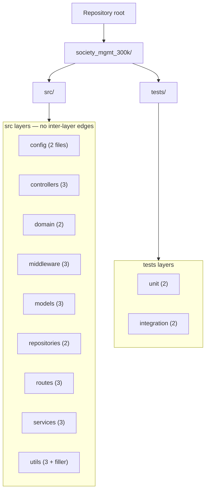

# Architecture

← Back to the [documentation hub](./README.md)

## Purpose

This document describes the **architecture** of the synthetic
[`society_mgmt_300k`](./overview.md) JavaScript *corpus*: how its files are
organized into a directory *scaffold* and — critically — what relationships do
**not** exist between those directories. The *corpus* is arranged as a **nominal
layered scaffold**, but the layer names are **organizational only**: they group
files on disk and carry **no runtime relationships**. There is no dependency
graph, no call graph, and no data or request flow between the layers, because
the source contains zero imports, zero exports, and zero cross-module calls.
This document therefore uses an honest **verified-absence** framing — the
architectural relationships a layered name might normally imply are reported as
verified absences rather than assumed. Source: `society_mgmt_300k/src/**`;
Tech Spec §1.2.2; AAP §0.4.1.

## Layered Scaffold

The *corpus* is organized into a two-part scaffold beneath the project
directory `society_mgmt_300k/`:

- A **`src/` tree with nine layers**: `config`, `controllers`, `domain`,
  `middleware`, `models`, `repositories`, `routes`, `services`, and `utils`.
  These names mirror the conventional layers of a layered application
  architecture. Source: `society_mgmt_300k/src/**`; Tech Spec §1.2.2.
- A **`tests/` tree with two layers**: `unit` and `integration`. These mirror a
  conventional test layout, but the test files hold the same arithmetic
  functions as the `src` layers and contain **no assertions** — they are not
  functional tests. Source: `society_mgmt_300k/tests/**`; see the
  [module reference](./functionality/module-reference.md) and Tech Spec §1.2.2.

**Round-robin file distribution.** The 28 numbered files (`file_0.js` …
`file_27.js`) are distributed across these layers **round-robin by file number**
— for example `file_0` → `controllers`, `file_1` → `services`, `file_3` →
`routes`, `file_6` → `config`, and `file_27` → `middleware`. Because placement
is purely a function of the file number, **layer membership does not change a
file's content**: every numbered file holds the same `6x + 10` *module*
functions regardless of the layer it lands in. Source:
`society_mgmt_300k/src/**` (file headers, line 1); AAP §0.3.1.

**Self-contained files.** Each numbered file is fully self-contained and follows
an identical shape: a one-line header comment `// mod_<n> - society module`,
then a single unused module-scoped declaration `const store = [];`, then a
sequence of `mod_<n>_<k>(x)` functions. A `routes` file illustrates the shape
that every layer repeats. Source: `society_mgmt_300k/src/routes/file_3.js:L1-L3`.

```javascript
// mod_3 - society module
const store = [];
function mod_3_0(x){
 let r=0;
 r+=x*1;
 r+=x*2;
 r+=x*3;
 if(r%2===0){r+=10}
 return r;
}
```

The lone non-numbered source file, `src/utils/filler.js`, is **comment-only
padding** (`// filler NNNNNN` on every line) and declares no functions; it
participates in the scaffold purely as the 29th `.js` file. Source:
`society_mgmt_300k/src/utils/filler.js`.

## No Inter-Layer Wiring

The layering is **nominal only**. A first-hand scan of the entire `src` and
`tests` trees finds **zero `module.exports` and zero `require(`** occurrences,
so nothing is exported and nothing is imported anywhere in the *corpus*. Source:
repository scan (0 exports / 0 imports across `society_mgmt_300k/src/**` and
`society_mgmt_300k/tests/**`); Tech Spec §2.2.4.

Consequently, the following architectural relationships are **verified absent**:

- **No inter-layer dependencies** — no layer imports or requires any other
  layer; the layers do not depend on one another. Source: repository scan
  (0 imports across `society_mgmt_300k/src/**`); Tech Spec §2.2.4.
- **No dependency graph** — because there are no imports between files, there
  are no edges to form a module dependency graph. Source: repository scan
  (0 exports / 0 imports); Tech Spec §2.2.4.
- **No call graph between modules** — every `mod_<n>_<k>(x)` function is
  file-local and is never invoked by another file; there are no cross-module
  calls. A representative `routes` file is self-contained arithmetic with no
  imports and no calls into other layers. Source:
  `society_mgmt_300k/src/routes/file_3.js:L1-L11`; Tech Spec §2.2.4.
- **No data flow or request flow** — there is no server, router wiring, or
  shared state connecting the layers; the module-scoped `const store = [];` in
  each file is never read or written, so it carries no data between modules.
  Source: `society_mgmt_300k/src/routes/file_3.js:L2`; AAP §0.3.1.

In short, the directory names suggest a layered application, but **no runtime
architecture connects them**. The scaffold is a static organizational
convenience, not a wired system.

## Layer Inventory

The table below inventories all **11 layers** — nine `src` layers plus two
`tests` layers — with their file counts, function counts, and module symbols
(`mod_<N>`). The counts are reconciled against the authoritative
[module reference](./functionality/module-reference.md), which carries the full
per-file breakdown. Source: file/function scan; AAP §0.3.1.

| Layer (path) | Files | Functions | Module symbols |
| --- | --- | --- | --- |
| `src/config/` | 2 | 2,400 | mod_6, mod_17 |
| `src/controllers/` | 3 | 3,600 | mod_0, mod_11, mod_22 |
| `src/domain/` | 2 | 2,400 | mod_8, mod_19 |
| `src/middleware/` | 3 | 3,105 | mod_5, mod_16, mod_27 (705) |
| `src/models/` | 3 | 3,600 | mod_2, mod_13, mod_24 |
| `src/repositories/` | 2 | 2,400 | mod_7, mod_18 |
| `src/routes/` | 3 | 3,600 | mod_3, mod_14, mod_25 |
| `src/services/` | 3 | 3,600 | mod_1, mod_12, mod_23 |
| `src/utils/` | 3 (+`filler.js`) | 3,600 | mod_4, mod_15, mod_26 |
| `tests/unit/` | 2 | 2,400 | mod_9, mod_20 |
| `tests/integration/` | 2 | 2,400 | mod_10, mod_21 |
| **Total** | **29** | **33,105** | — |

**Reconciliation.** The file counts sum to **29** — the 28 numbered files
(`file_0.js` … `file_27.js`) plus the comment-only `src/utils/filler.js` — and
the function counts sum to **33,105**. The `middleware` layer totals **3,105**
rather than 3,600 because `file_27.js` is a short variant with **705** functions
instead of the standard 1,200 (`2 × 1,200 + 705 = 3,105`). Source: file/function
scan; `society_mgmt_300k/src/middleware/file_27.js`; AAP §0.3.1. For the complete
per-file listing, see the
[module reference](./functionality/module-reference.md).

## Containment Diagram

The diagram below shows the scaffold as a **containment hierarchy only**. The
arrows represent directory containment (a parent directory *contains* its
children); there are **deliberately no edges between the layer nodes** inside the
`src layers` and `tests layers` groups, because no inter-layer wiring exists to
represent. Source: repository scan (0 exports / 0 imports); Tech Spec §2.2.4.



**Caption.** The absence of edges among the layer nodes is **intentional**: it
reflects the *verified absence* of inter-layer wiring (zero imports, zero
exports, zero cross-module calls). Source: repository scan (0 exports /
0 imports across `society_mgmt_300k/src/**` and `society_mgmt_300k/tests/**`);
Tech Spec §2.2.4.

## Cross-References

- [System overview](./overview.md) — what the *corpus* is and what it is not.
- [Module reference](./functionality/module-reference.md) — the authoritative
  per-layer and per-file inventory the table above reconciles against.
- [Documentation hub](./README.md) — the top-level navigation index.

## Source Citations

- `society_mgmt_300k/src/**` — the nine `src` layers (`config`, `controllers`,
  `domain`, `middleware`, `models`, `repositories`, `routes`, `services`,
  `utils`) and the round-robin file distribution (file headers, line 1).
- `society_mgmt_300k/tests/**` — the two `tests` layers (`unit`, `integration`)
  and the non-functional, assertion-free nature of the test files.
- `society_mgmt_300k/src/routes/file_3.js:L1-L3` — the self-contained file shape
  (header comment, `const store = [];`, `mod_<n>_<k>(x)` functions).
- `society_mgmt_300k/src/routes/file_3.js:L1-L11` — a representative layer file
  that is self-contained arithmetic with no imports and no cross-layer calls.
- `society_mgmt_300k/src/middleware/file_27.js` — the 705-function short variant
  that yields the `middleware` total of 3,105.
- `society_mgmt_300k/src/utils/filler.js` — the comment-only padding file (the
  29th `.js` file, 0 functions).
- Repository scan (0 `module.exports` / 0 `require(` across
  `society_mgmt_300k/src/**` and `society_mgmt_300k/tests/**`) — the verified
  absence of inter-layer wiring, a dependency graph, and a call graph.
- Tech Spec §1.2.2 — the nominal layered scaffold and the non-functional test
  layout.
- Tech Spec §2.2.4 — the absence of inter-module wiring.
- AAP §0.3.1, §0.4.1 — the per-layer file/function counts and the
  documentation scope for this architecture document.

---

← Back to the [documentation hub](./README.md)
