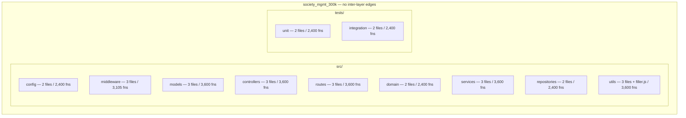

# Layered Scaffold (F-003)

## Overview

The `society_mgmt_300k` codebase is organized as a layered folder
scaffold of **11 nominal layers** — nine under `src/` (config,
middleware, models, controllers, routes, domain, services,
repositories, utils) and two under `tests/` (unit, integration).
Across the whole corpus these layers hold **29** `.js` files,
**33,105** `mod_*` functions, and exactly **300,000** lines.
Source: society_mgmt_300k/src/controllers/file_0.js:L1-L10

The layers are **nominal only**: each folder is named after a
conventional web-application tier, but every one contains nothing but
single-argument arithmetic stub functions (the `6x + 10` helpers).
There are **no dependencies between layers**, no imports or exports,
and no module system of any kind. "Society management" is likewise a
**nominal label** — it appears solely as the repository name and as a
per-file header comment such as `// mod_0 - society module`, and is
never implemented as functionality. For the vocabulary used here
(*layer*, *synthetic corpus*, *short variant*), see the
[Glossary](../reference/glossary.md).
Source: society_mgmt_300k/src/controllers/file_0.js:L1

## The 11 nominal layers

Each layer's folder name suggests a role from conventional application
architecture, but the **actual content** of every layer is identical:
nothing but `mod_<id>_<k>(x)` arithmetic stubs (the `6x + 10` helpers).
No layer implements the behavior its name implies.
Source: society_mgmt_300k/src/controllers/file_0.js:L1-L10

| Layer | Nominal role (what the name suggests) | Actual content |
| --- | --- | --- |
| `src/config` | Configuration | No config object/keys — arithmetic stubs |
| `src/middleware` | Request pipeline | No pipeline — arithmetic stubs |
| `src/models` | Data schemas | No schema/fields/ORM — arithmetic stubs |
| `src/controllers` | HTTP controllers | Not endpoints — arithmetic stubs |
| `src/routes` | Route table | No routes — arithmetic stubs |
| `src/domain` | Domain entities | No domain entities — arithmetic stubs |
| `src/services` | Business logic | No business logic — arithmetic stubs |
| `src/repositories` | Data access | No persistence — arithmetic stubs |
| `src/utils` | Utilities | Arithmetic stubs plus the comment-only `filler.js` |
| `tests/unit` | Unit tests | No assertions or runner — stubs |
| `tests/integration` | Integration tests | No assertions or runner — stubs |

## Per-layer composition

The table below rolls the 29 files up by nominal layer, giving the
file, function, and line counts for each. All counts were verified by
a direct full-corpus static scan (line counting and `mod_*` function
counting). For the authoritative sizing narrative see
[Corpus composition](../functionality/corpus-composition.md); for the
full per-file breakdown see
[File inventory](../reference/file-inventory.md).
Source: society_mgmt_300k/src/controllers/file_0.js:L1-L10

| Layer | Files | Functions | Lines |
| --- | ---: | ---: | ---: |
| `src/config` | 2 | 2,400 | 21,604 |
| `src/middleware` | 3 | 3,105 | 27,951 |
| `src/models` | 3 | 3,600 | 32,406 |
| `src/controllers` | 3 | 3,600 | 32,406 |
| `src/routes` | 3 | 3,600 | 32,406 |
| `src/domain` | 2 | 2,400 | 21,604 |
| `src/services` | 3 | 3,600 | 32,406 |
| `src/repositories` | 2 | 2,400 | 21,604 |
| `src/utils` | 4 (incl. `filler.js`) | 3,600 | 34,405 |
| `tests/unit` | 2 | 2,400 | 21,604 |
| `tests/integration` | 2 | 2,400 | 21,604 |
| **Totals** | **29** | **33,105** | **300,000** |

Two rows reflect structural exceptions: `src/utils` counts **4** files
because it includes the comment-only `filler.js` (which adds lines but
no functions), and `src/middleware` reports **3,105** rather than 3,600
functions because its third file, `file_27.js`, is a short variant
(1,200 + 1,200 + 705). Representative files: `src/config/file_6.js` for
a standard module and `src/middleware/file_27.js` for the short variant.
Source: society_mgmt_300k/src/middleware/file_27.js:L1-L10

## No inter-layer edges

There are no relationships between the layers, and this absence is
deliberate. A whole-tree keyword sweep across every `.js` file returns
**zero** occurrences of `require`, `import`, `export`, and
`module.exports` — and likewise zero `eval`, `fetch`, `Promise`,
`async`, `await`, `console`, and `use strict`. Because the corpus has
no module system, no file imports or references another, and no layer
depends on any other layer. Every symbol is **file-local and not
externally importable**.
Source: society_mgmt_300k/src/controllers/file_0.js:L1-L10

The layer map below therefore renders each layer as an **isolated node
with no connecting edges** — a faithful visual of F-003's complete lack
of inter-layer dependencies. There is no request pipeline, dependency
injection, or service-to-repository call to draw.
Source: society_mgmt_300k/src/controllers/file_0.js:L1-L10

## Naming convention

The scaffold follows one uniform naming scheme across all layers:

- **Files** are named `file_<n>.js`, where `<n>` is a numeric id (for
  example, `file_0.js`, `file_27.js`).
- Each file **opens with a header comment** of the form
  `// mod_<n> - society module` — for instance, `file_0.js` begins with
  `// mod_0 - society module` and `file_27.js` with
  `// mod_27 - society module`. This comment is the only place the
  "society" label appears in the code.
- **Functions** are named `mod_<fileId>_<k>`, where `<fileId>` matches
  the file's id and `<k>` is the 0-based index of the function within
  that file (so `mod_0_0` is the first function in `file_0.js`).

Source: society_mgmt_300k/src/controllers/file_0.js:L1

One file departs from the standard size: `src/middleware/file_27.js` is
a *short variant* holding 705 functions (6,347 lines) instead of the
standard 1,200. It still follows the same `file_<n>.js` /
`mod_<fileId>_<k>` convention. For the definition of *short variant*,
see the [Glossary](../reference/glossary.md).
Source: society_mgmt_300k/src/middleware/file_27.js:L1-L10

## Layer map

The diagram below renders the 11 nominal layers as isolated nodes, no
edges — visually conveying F-003's lack of inter-layer dependencies.

## See also

- [Module control flow](module-control-flow.md) — the execution path of
  a single `mod_*` function, including its dead always-true branch.
- [Corpus composition](../functionality/corpus-composition.md) — the
  authoritative sizing page and the 300,000-line target math.
- [Architecture index](README.md) — the architecture documentation hub.
- [Overview](../overview.md) — the system overview and synthetic-corpus
  framing.

## Source Citations

- `society_mgmt_300k/src/controllers/file_0.js:L1` — the per-file header
  comment (the nominal "society module" label) and the `file_<n>.js` /
  `mod_<fileId>_<k>` naming convention.
- `society_mgmt_300k/src/controllers/file_0.js:L1-L10` — the canonical
  module motif shared by every layer (header comment, inert `store`, and
  the arithmetic `mod_*` function), plus the corpus-wide absence of
  module keywords.
- `society_mgmt_300k/src/middleware/file_27.js:L1-L10` — the short
  variant (705 functions / 6,347 lines) that gives `src/middleware` its
  3,105-function total.
