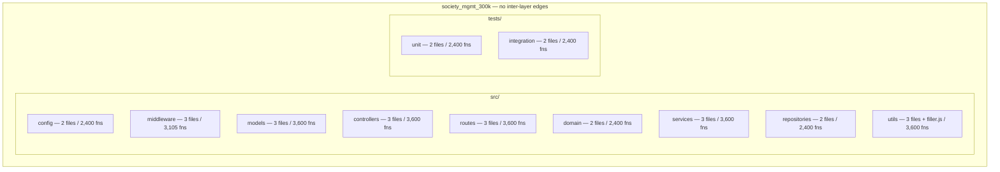

# Layered Scaffold (F-003)

← Back to the [architecture index](README.md) · [documentation hub](../README.md)

## Overview

The synthetic `society_mgmt_300k` *corpus* is organized as a **layered folder
scaffold** of **11 nominal layers** — nine under `src/` (config, middleware,
models, controllers, routes, domain, services, repositories, utils) and two under
`tests/` (unit, integration). Across those layers it holds exactly **29 `.js`
files**, **33,105** `mod_*` arithmetic functions, and **300,000 lines** in total,
every one of which follows a single canonical module motif
(Source: `society_mgmt_300k/src/controllers/file_0.js:L1-L10`).

The layer names are borrowed from conventional web-application architecture, but
the resemblance is **only in the naming**: each folder contains **only
`mod_<id>_<k>(x)` arithmetic stubs** — the `6x + 10` helpers — and nothing else.
There is **no module system** and there are **no dependencies between layers**: no
file imports, requires, exports, or calls another, so the layers are fully
isolated. Consistently, *"society management"* is a **nominal label** — it appears
solely as the repository name and as a per-file header comment such as
`// mod_0 - society module`, not as implemented domain functionality
(Source: `society_mgmt_300k/src/controllers/file_0.js:L1`). The terms *layer*,
*synthetic corpus*, and *short variant* are defined once in the
[glossary](../reference/glossary.md) and are not redefined here.

## The 11 nominal layers

Each layer's name suggests a conventional responsibility, but its **actual
content** is the same in kind across the whole corpus: a sequence of
single-argument arithmetic stub functions. The table below contrasts the nominal
role implied by each layer's name with what the layer actually contains. Every
layer follows the identical `6x + 10` arithmetic motif
(Source: `society_mgmt_300k/src/controllers/file_0.js:L1-L10`).

| Layer | Nominal role (what the name suggests) | Actual content |
| --- | --- | --- |
| `src/config` | Application configuration | No configuration object or keys — only `mod_<id>_<k>(x)` arithmetic stubs |
| `src/middleware` | Request/response pipeline | No pipeline or handlers — only arithmetic stubs (includes the `file_27.js` short variant) |
| `src/models` | Data schemas / ORM models | No schema, fields, or ORM — only arithmetic stubs |
| `src/controllers` | HTTP controllers | Not endpoints — only arithmetic stubs |
| `src/routes` | Route table | No routes or routing — only arithmetic stubs |
| `src/domain` | Domain entities | No domain entities — only arithmetic stubs |
| `src/services` | Business logic | No business logic — only arithmetic stubs |
| `src/repositories` | Data access | No persistence or data access — only arithmetic stubs |
| `src/utils` | Utility helpers | Arithmetic stubs plus the comment-only `filler.js` (0 functions) |
| `tests/unit` | Unit tests | No assertions or test runner — only arithmetic stubs |
| `tests/integration` | Integration tests | No assertions or test runner — only arithmetic stubs |

Despite eleven different names, all eleven layers are structurally the same — each
is a folder of `mod_*` arithmetic stubs with no behavior specific to its nominal
role (Source: `society_mgmt_300k/src/controllers/file_0.js:L1-L10`).

## Per-layer composition

The table below rolls all 29 `.js` files up to their nominal layer, with the
function count and line count of each layer. Every value was verified by a direct,
full-corpus static scan of the source branch
(Source: `society_mgmt_300k/src/controllers/file_0.js:L1-L10`). For the
authoritative sizing narrative see
[Corpus composition](../functionality/corpus-composition.md), and for the
per-file breakdown see the [File inventory](../reference/file-inventory.md).

| Layer | Files | Functions | Lines |
| --- | --- | --- | --- |
| `src/config` | 2 | 2,400 | 21,604 |
| `src/middleware` | 3 | 3,105 | 27,951 |
| `src/models` | 3 | 3,600 | 32,406 |
| `src/controllers` | 3 | 3,600 | 32,406 |
| `src/routes` | 3 | 3,600 | 32,406 |
| `src/domain` | 2 | 2,400 | 21,604 |
| `src/services` | 3 | 3,600 | 32,406 |
| `src/repositories` | 2 | 2,400 | 21,604 |
| `src/utils` | 4 (incl. `filler.js`) | 3,600 | 34,405 |
| `tests/unit` | 2 | 2,400 | 21,604 |
| `tests/integration` | 2 | 2,400 | 21,604 |
| **Totals** | **29** | **33,105** | **300,000** |

The per-layer line counts sum to exactly **300,000** and the function counts to
exactly **33,105**. Two layers deviate from a clean multiple of the standard
1,200-function / 10,802-line module: `src/middleware` holds 3,105 functions
(≈ 1,200 + 1,200 + 705) because of the *short variant* `file_27.js`, which has
705 functions / 6,347 lines
(Source: `society_mgmt_300k/src/middleware/file_27.js:L1-L10`); and `src/utils`
contains 4 files yet still 3,600 functions because of the comment-only `filler.js`
(0 functions / 1,999 lines). A representative standard module in each layer — for
example `src/config/file_6.js` — carries the uniform 1,200-function shape
(Source: `society_mgmt_300k/src/controllers/file_0.js:L1-L10`).

## No inter-layer edges

The layered names might suggest a runtime in which, for example, controllers call
services and services call repositories. **No such wiring exists.** A whole-tree
keyword sweep across every `.js` file returns **zero** occurrences of `require`,
`import`, `export`, and `module.exports` — and likewise zero `eval`, `fetch`,
`Promise`, `async`, `await`, `console`, and `use strict`
(Source: `society_mgmt_300k/src/controllers/file_0.js:L1-L10`). Because there is no
module system, **no file imports another and no layer depends on any other**;
every symbol is **file-local and not externally importable**.

The layer map below therefore renders the eleven layers as **isolated nodes with
no connecting edges**, faithfully conveying F-003's deliberate absence of
inter-layer dependencies
(Source: `society_mgmt_300k/src/controllers/file_0.js:L1-L10`).

## Naming convention

The corpus uses one mechanical naming scheme throughout. Files are named
`file_<n>.js`; each file begins with a header comment of the form
`// mod_<n> - society module`; and the functions within are named
`mod_<fileId>_<k>`, where `<fileId>` is the file's numeric id and `<k>` is the
function's 0-based index within that file
(Source: `society_mgmt_300k/src/controllers/file_0.js:L1`). Verified examples:
`file_0.js` opens with `// mod_0 - society module`, and `file_27.js` opens with
`// mod_27 - society module`
(Source: `society_mgmt_300k/src/middleware/file_27.js:L1-L10`).

One file departs from the standard size: `society_mgmt_300k/src/middleware/file_27.js`
is a *short variant* with 705 functions / 6,347 lines rather than the usual
1,200 / 10,802, while remaining structurally identical in every other respect
(Source: `society_mgmt_300k/src/middleware/file_27.js:L1-L10`). The term
*short variant* is defined in the [glossary](../reference/glossary.md).

## Layer map

The diagram renders the eleven layers as **isolated nodes, no edges** — visually
conveying F-003's lack of inter-layer dependencies
(Source: `society_mgmt_300k/src/controllers/file_0.js:L1-L10`).

## See also

- [Module control flow](module-control-flow.md) — the execution path of a single
  `mod_<id>_<k>(x)` function, including its dead always-true branch.
- [Corpus composition](../functionality/corpus-composition.md) — the authoritative
  per-layer sizing roll-up and the deterministic 300,000-line math.
- [File inventory](../reference/file-inventory.md) — the per-file table mapping
  each file to its layer, function count, and line count.
- [Architecture index](README.md) — the architecture documentation index.
- [Overview](../overview.md) — the system overview and what the corpus is (and is
  not).
- [Glossary](../reference/glossary.md) — definitions of *layer*, *synthetic
  corpus*, and *short variant*.

## Source Citations

- `society_mgmt_300k/src/controllers/file_0.js:L1` — the canonical header comment
  `// mod_0 - society module` and the basis for the `file_<n>.js` /
  `mod_<fileId>_<k>` naming convention; "society management" appears here only as
  a label.
- `society_mgmt_300k/src/controllers/file_0.js:L1-L10` — the canonical module
  motif shared by every layer (header comment, inert `store`, and the
  `mod_<id>_<k>(x)` arithmetic body), and the corpus-wide absence of module
  keywords that confirms there are no inter-layer edges.
- `society_mgmt_300k/src/middleware/file_27.js:L1-L10` — the *short variant* (705
  functions / 6,347 lines) that gives the `src/middleware` layer 3,105 functions.

---

← Back to the [architecture index](README.md) · [documentation hub](../README.md)
