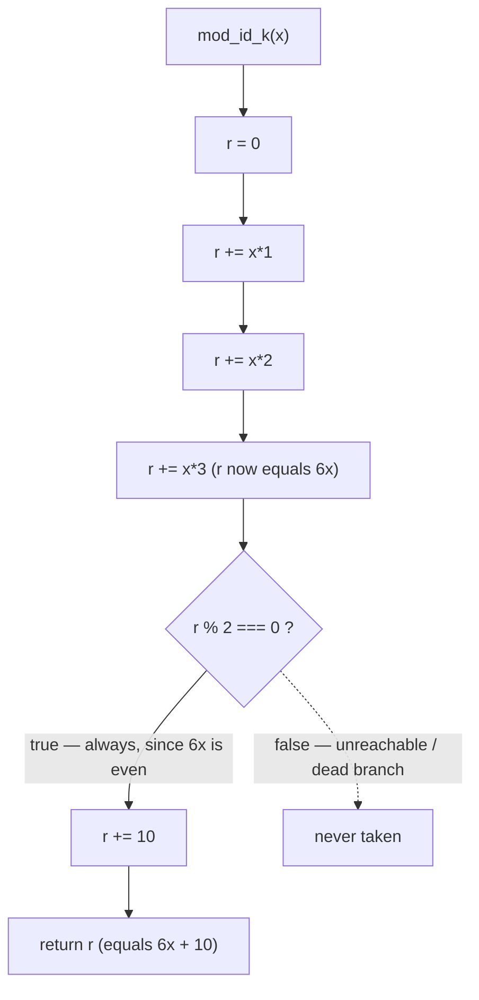

# Module Control Flow

## Overview

This page documents the control flow of any `mod_<id>_<k>(x)` function in
the `society_mgmt_300k` corpus — the exact order in which its statements
execute on a call. All 33,105 functions in the corpus share this identical
control flow: each is a single-argument, synchronous, pure, deterministic,
and side-effect-free function that accumulates `x*1 + x*2 + x*3` and then
conditionally adds `10`, so it effectively returns `6x + 10`.
Source: `society_mgmt_300k/src/controllers/file_0.js:L3-L10`.

Because the archetype is uniform, this single walkthrough characterises the
behaviour of the entire corpus. For the functional and behavioural treatment
of the same code (signature, return value, naming), see
[Arithmetic helpers](../functionality/arithmetic-helpers.md).

## The function

Every `mod_*` function is byte-identical apart from its name. The canonical
archetype, taken directly from the first function in the first file, is:

```javascript
// mod_0 - society module
const store = [];
function mod_0_0(x){
 let r=0;
 r+=x*1;
 r+=x*2;
 r+=x*3;
 if(r%2===0){r+=10}
 return r;
}
```

Source: `society_mgmt_300k/src/controllers/file_0.js:L1-L10`.

## Step-by-step execution

For an input `x`, the function body executes the following steps in order:

1. `let r = 0;` — initialise the accumulator to `0`.
2. `r += x*1;` — now `r = x`.
3. `r += x*2;` — now `r = 3x`.
4. `r += x*3;` — now `r = 6x` (the accumulator equals `6x`).
5. `if (r % 2 === 0)` — evaluate the parity test. Since `6x` is always even,
   this condition is **always true**.
6. `r += 10;` — the `+ 10` is therefore always applied, so `r = 6x + 10`.
7. `return r;` — the call returns **`6x + 10`**.

Source: `society_mgmt_300k/src/controllers/file_0.js:L3-L10`.

## The dead always-true branch

The conditional on line 8, `if (r % 2 === 0) { r += 10 }`, is a dead
always-true branch. By step 4 the accumulator always holds `6x`, and `6x` is
always even, so `r % 2 === 0` can never be false. The `+ 10` therefore runs on
every call, and the implicit `else` / false path is **unreachable (dead
code)**: it is never taken for any input `x`.
Source: `society_mgmt_300k/src/controllers/file_0.js:L8`.

This branch is documented faithfully, exactly as it executes; this page does
**not** propose to remove or "fix" the always-true test. Modifying the source
would be a code change and is therefore out of scope for documentation. For the
formal definition of this dead always-true branch term, see the
[Glossary](../reference/glossary.md).

## Control-flow diagram

The flowchart below traces a single call; the dotted edge marks the
unreachable / dead false branch that is never taken.



Source: `society_mgmt_300k/src/controllers/file_0.js:L3-L10`.

## Worked example

Because the function is pure and deterministic, its output for any input is
exact and verifiable by inspection. Evaluating the archetype for `x = 4`:
`mod_0_0(4)` = `6*4 + 10` = **`34`**.

| Input `x` | Computation  | Result |
|-----------|--------------|--------|
| `4`       | `6*4 + 10`   | `34`   |
| `0`       | `6*0 + 10`   | `10`   |
| `1`       | `6*1 + 10`   | `16`   |

Source: `society_mgmt_300k/src/controllers/file_0.js:L3-L10`.

## See also

- [Arithmetic helpers](../functionality/arithmetic-helpers.md) — the
  functional and behavioural treatment of the `mod_*` family.
- [Layered scaffold](layered-scaffold.md) — how these functions are arranged
  across the corpus's nominal layers.
- [Architecture index](README.md) — the architecture documentation hub.

## Source Citations

- `society_mgmt_300k/src/controllers/file_0.js:L1-L10` — the full canonical
  module motif (header comment, inert `store`, and the `mod_0_0` function).
- `society_mgmt_300k/src/controllers/file_0.js:L3-L10` — the function body and
  its step-by-step execution path.
- `society_mgmt_300k/src/controllers/file_0.js:L8` — the dead always-true
  parity branch.
