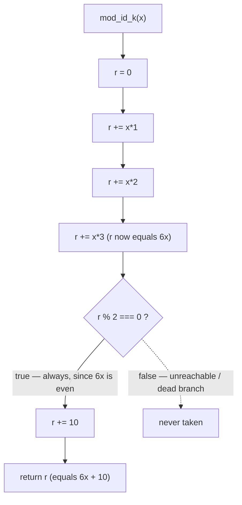

# Module Control Flow

← Back to the [architecture index](README.md) · [documentation hub](../README.md)

## Overview

This page documents the **control flow of a single `mod_<id>_<k>(x)` function** —
the execution path that runs every time any function in the synthetic
[`society_mgmt_300k`](../overview.md) *corpus* is called. All **33,105** functions
across the corpus are byte-identical apart from their names, so this one control
flow is a faithful, exhaustive description of every one of them: a single uniform
archetype. The function body is shown in the canonical file
(Source: `society_mgmt_300k/src/controllers/file_0.js:L3-L10`); that all 33,105
function bodies are byte-identical is verified corpus-wide
(Source: `docs/reference/corpus-evidence.md:L67-L95`).

Each function is **pure**, **deterministic**, synchronous, and
**side-effect-free**: it reads only its single numeric argument `x`, accumulates
three additions into a local variable, applies one parity-guarded addition, and
returns the result. It effectively computes **`6x + 10`** for every call. (The
terms *pure*, *deterministic*, and *dead branch* are defined in the
[glossary](../reference/glossary.md); this page does not redefine them.) For the
functional and behavioral treatment of this same motif — the signature, formula
table, and naming scheme — see
[Arithmetic helpers](../functionality/arithmetic-helpers.md)
(Source: `society_mgmt_300k/src/controllers/file_0.js:L3-L10`).

## The function

The canonical function body below is reproduced exactly as it appears in the
source. Every function in the corpus shares this body, differing only in its
`mod_<fileId>_<k>` name
(Source: `society_mgmt_300k/src/controllers/file_0.js:L1-L10`):

```javascript
// mod_0 - society module
const store = [];
function mod_0_0(x){
 let r=0;
 r+=x*1;
 r+=x*2;
 r+=x*3;
 if(r%2===0){r+=10}
 return r;
}
```

The module-scoped `const store = [];` on line 2 is an inert placeholder: it is
never read or written by the function and plays no part in the control flow
(Source: `society_mgmt_300k/src/controllers/file_0.js:L2`).

## Step-by-step execution

Tracing the body for an integer input `x`, the accumulator `r` evolves as
follows (Source: `society_mgmt_300k/src/controllers/file_0.js:L3-L10`):

1. `let r = 0;` — initialize the accumulator to `0`.
2. `r += x*1` — add `x`; now `r = x`.
3. `r += x*2` — add `2x`; now `r = 3x`.
4. `r += x*3` — add `3x`; now `r = 6x`. After the three additions `r` equals
   **`6x`**.
5. `if (r % 2 === 0)` — evaluate the parity guard. Because `6x` is a multiple of
   `2`, it is **always even**, so this condition is **always true** for integer
   `x`.
6. `r += 10` — the guarded statement runs, so `r = 6x + 10`.
7. `return r` — return the result, which is always **`6x + 10`**.

## The dead always-true branch

The conditional `if(r%2===0){r+=10}` on line 8 is a **dead always-true branch**.
Since the accumulator equals `r = 6x` and `6x` is always even for integer `x`,
the parity test `r % 2 === 0` is **always true**; the `r += 10` therefore
**always executes**, and the implicit `false`/`else` path — the case where the
`+ 10` is skipped — is **unreachable (dead code)**
(Source: `society_mgmt_300k/src/controllers/file_0.js:L8`).

This branch is documented **faithfully**, exactly as it executes: the false path
can never be taken for integer input. The term *dead (always-true) branch* is
defined in the [glossary](../reference/glossary.md). The branch is **not**
"fixed", simplified, or removed here — altering the source would be a code change
and is out of scope; this page only describes the existing behavior
(Source: `society_mgmt_300k/src/controllers/file_0.js:L8`).

## Control-flow diagram

The flowchart below traces a call to any `mod_<id>_<k>(x)`. The solid edge from
the decision node is the always-taken `true` path; the **dotted** edge marks the
unreachable / dead `false` branch that is never executed for integer `x`
(Source: `society_mgmt_300k/src/controllers/file_0.js:L3-L10`).



## Worked example

Because the function is pure and deterministic, its output for any input is exact
and verifiable by inspection. For `x = 4`:

- `r = 0` → `+4*1` (`r = 4`) → `+4*2` (`r = 12`) → `+4*3` (`r = 24`); now
  `r = 6 × 4 = 24`.
- `24 % 2 === 0` is **true**, so `r += 10` → `r = 34`.
- `return 34`.

So **`mod_0_0(4) === 34`** (that is, `6*4 + 10 = 34`). A few more inputs follow
the same `6x + 10` rule
(Source: `society_mgmt_300k/src/controllers/file_0.js:L3-L10`):

| Input `x` | `6x` | `6x + 10` (return value) |
| --- | --- | --- |
| `0` | `0` | `10` |
| `1` | `6` | `16` |
| `4` | `24` | `34` |

## See also

- [Arithmetic helpers](../functionality/arithmetic-helpers.md) — the functional
  and behavioral treatment of the same `6x + 10` motif (signature, formula table,
  naming scheme).
- [Layered scaffold](layered-scaffold.md) — how the files that contain these
  functions are organized into nominal layers.
- [Architecture index](README.md) — the architecture documentation index.
- [Glossary](../reference/glossary.md) — definitions of *dead (always-true)
  branch*, *pure function*, *deterministic*, and other corpus terminology.
- [Corpus evidence](../reference/corpus-evidence.md) — the body-uniformity scan
  showing all 33,105 functions share one byte-identical body.

## Source Citations

- `society_mgmt_300k/src/controllers/file_0.js:L1-L10` — the full canonical
  module motif (header comment, the inert `store` declaration, and the function
  body); this is the single-file archetype. That all 33,105 functions share this
  body is verified corpus-wide in `docs/reference/corpus-evidence.md:L67-L95`.
- `society_mgmt_300k/src/controllers/file_0.js:L3-L10` — the function body that
  accumulates `6x` and returns `6x + 10`.
- `society_mgmt_300k/src/controllers/file_0.js:L8` — the parity branch
  `if(r%2===0){r+=10}`, an always-true (dead) branch whose `false` path is
  unreachable for integer `x`.

---

← Back to the [architecture index](README.md) · [documentation hub](../README.md)
