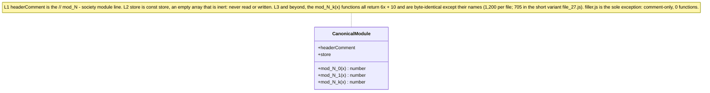

# Module pattern

This page documents the **canonical module pattern** — the single file shape that every non-filler file in the `society_mgmt_300k` [synthetic corpus](../glossary.md) follows — together with the inert `store` placeholder and the one exception, the comment-only `filler.js` `[society_mgmt_300k/src/config/file_6.js:L1-L10]` `[society_mgmt_300k/src/utils/filler.js]`.

## Summary

Across the corpus, every non-filler file shares one canonical structure: a one-line header comment, an inert `const store = []`, and then a run of [`mod_*`](../glossary.md) functions `[society_mgmt_300k/src/config/file_6.js:L1-L10]`. That single repeated shape is why the codebase is so uniform — because every function body is byte-for-byte identical except for its name, reading one canonical file (here, `society_mgmt_300k/src/config/file_6.js`) is enough to understand all 33,105 functions `[Technical Specification §4.3.3]` `[Technical Specification §1.2.2]`. This page describes the *file* shape; the full signature and semantics of the functions live in the [function reference](../reference/function-reference.md).

## Canonical file anatomy

The canonical file `society_mgmt_300k/src/config/file_6.js` has exactly three structural parts `[society_mgmt_300k/src/config/file_6.js:L1-L10]`:

- **L1 — header comment.** A single-line comment of the form `// mod_<fileId> - society module`; in the canonical file it reads `// mod_6 - society module` `[society_mgmt_300k/src/config/file_6.js:L1]`. The "society module" text is a label only — the file contains no business logic `[Technical Specification §5.4.2]`.
- **L2 — inert `store`.** The module-scoped declaration `const store = [];`, described in [its own section](#the-inert-store-placeholder) below `[society_mgmt_300k/src/config/file_6.js:L2]`.
- **L3 and beyond — the `mod_*` functions.** A run of functions named `mod_<fileId>_<k>(x)`, where `<fileId>` matches the header's file number and `<k>` is the zero-based index of the function within the file `[society_mgmt_300k/src/config/file_6.js:L1-L3]`.

The first three structural elements look like this — the header comment, the inert `store`, and the first function `mod_6_0` (its lines 3–10 collapsed onto one line) `[society_mgmt_300k/src/config/file_6.js:L1-L10]`:

```javascript
// mod_6 - society module
const store = [];
function mod_6_0(x){ let r=0; r+=x*1; r+=x*2; r+=x*3; if(r%2===0){r+=10} return r; }
```

This `mod_6_0` snippet is **representative of all 33,105 functions**, because every function body is byte-for-byte identical apart from its name `[society_mgmt_300k/src/config/file_6.js:L3-L10]` `[Technical Specification §4.3.3]`. Each call returns `6x + 10` for integer input — for example `mod_6_0(2)` returns `22` and `mod_6_0(5)` returns `40`, both verified by hand because the corpus has no runtime to execute against `[society_mgmt_300k/src/config/file_6.js:L3-L10]` `[Technical Specification §1.2.2]`. The full signature, the parameter and return tables, and the precise behavior are documented in the [function reference](../reference/function-reference.md).

## The inert `store` placeholder

Line 2 of every non-filler file declares a module-scoped array, `const store = [];` `[society_mgmt_300k/src/config/file_6.js:L2]`. Despite its name, this `store` is **inert**: it is **never read from and never written to** anywhere in the file, so it holds no state, performs no caching, and provides no persistence `[society_mgmt_300k/src/config/file_6.js:L2]` `[Technical Specification §5.4.3]`. It does not participate in any function's computation, and removing it would change no return value `[Technical Specification §5.4.3]`. Treat it as a structural placeholder that is part of the canonical file shape, not as functional state; the term is defined the same way in the [glossary](../glossary.md).

## Structure diagram

The diagram below models a canonical module as a single structure with its three parts: the L1 header comment, the inert L2 `store`, and the `mod_<fileId>_<k>(x)` functions (shown as `mod_N_k`, where `N` is the file id and `k` is the zero-based within-file index) `[society_mgmt_300k/src/config/file_6.js:L1-L10]`:



*Figure: the canonical module shape shared by every non-filler file — an L1 header comment, an inert L2 `store`, and a run of identical `mod_*` functions `[society_mgmt_300k/src/config/file_6.js:L1-L10]`.*

## Why every file looks the same

The uniformity is the defining property of this synthetic corpus. Every function shares one signature, `mod_<fileId>_<k>(x)`, and one body that returns `6x + 10` for integer input; only the name varies, encoding the file id and the within-file index `[society_mgmt_300k/src/config/file_6.js:L3-L10]` `[Technical Specification §4.3.3]`. The bodies are identical not only within a file but across layers — the first functions of `controllers/file_0.js`, `services/file_1.js`, and `config/file_6.js` are byte-for-byte the same except for their names — confirming a single generated template rather than hand-written, layer-specific logic `[Technical Specification §4.3.3]` `[Technical Specification §1.2.2]`.

One consequence of that shared body is a [dead branch](../glossary.md): the parity guard `if (r % 2 === 0) { r += 10 }` is always true for integer input (because `r = 6x` is even), so the `+ 10` always executes and the implicit branch-not-taken is unreachable — note there is no literal `else` keyword in the source `[society_mgmt_300k/src/config/file_6.js:L8]` `[Technical Specification §4.3.1]`. This is a static observation about the source; the [function reference](../reference/function-reference.md) covers it in full, including the non-integer case.

Most files contain 1,200 functions; the one short variant, `society_mgmt_300k/src/middleware/file_27.js`, contains 705 — the exhaustive per-layer inventory is in the [source layout](../reference/source-layout.md) `[society_mgmt_300k/src/middleware/file_27.js]` `[Technical Specification §1.2.2]`.

## The `filler.js` comment-only padding file

The single file that does **not** follow the canonical pattern is `society_mgmt_300k/src/utils/filler.js`. It is **comment-only**: 1,999 lines of the form `// filler NNNNNN` (running from `// filler 298001` to `// filler 299999`), containing **zero functions and zero declarations** — no header comment, no `store`, and no `mod_*` functions `[society_mgmt_300k/src/utils/filler.js]`. Its sole purpose is to pad the corpus to exactly 300,000 lines `[society_mgmt_300k/src/utils/filler.js]` `[Technical Specification §1.2.2]`. Because that total is exact, `filler.js` — like every other source file — must never be edited: adding or removing even a single line would break the 300,000-line invariant `[Technical Specification §1.2.2]`.

## Related documentation

- [Architecture overview](overview.md) — how the nominal layers relate, and why there are no runtime edges between them.
- [Function reference](../reference/function-reference.md) — the full signature, behavior, and dead-branch treatment of the `mod_*` functions.
- [Source layout](../reference/source-layout.md) — the exhaustive per-layer inventory of all 29 files, 33,105 functions, and 300,000 lines.
- [Glossary](../glossary.md) — definitions of `mod_*`, the inert `store`, `filler`, synthetic corpus, and dead branch.

---

[← Documentation Home](../index.md)
