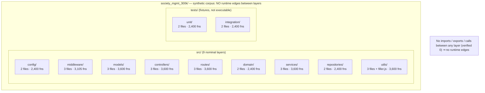

# Architecture overview

This page describes the architecture of the `society_mgmt_300k` [synthetic corpus](../glossary.md): how its files are organized into conventionally named [layers](../glossary.md), and — most importantly — why those layers have **no runtime edges** between them. For the canonical shape of an individual file, see the [module pattern](module-pattern.md); for the exhaustive per-file inventory, see the [source layout](../reference/source-layout.md).

## Summary

The corpus is organized into a conventional layered directory scaffold — nine `src` layers plus two `tests` directories — whose names (`controllers`, `services`, `repositories`, and so on) mirror a typical layered application `[Technical Specification §1.2.2]`. That resemblance is structural only: the repository is a [synthetic corpus](../glossary.md) of exactly 300,000 lines across 29 `.js` files and 33,105 near-identical functions, with a single behavior and no runtime `[Technical Specification §1.2.2]`. Because there are no imports, exports, classes, shared state, or calls between files, the layering is [nominal](../glossary.md) only — a naming convention that carries no runtime relationships `[Technical Specification §5.4.2]`.

## Layered directory layout

The corpus lives under `society_mgmt_300k/` and splits into two parts: a `src/` tree of nine layers and a `tests/` tree of two directories `[Technical Specification §1.2.2]`. Every layer holds the same family of [`mod_*`](../glossary.md) arithmetic helpers built from one canonical file shape — a header comment, an inert `const store = [];`, then a run of `mod_<fileId>_<k>(x)` functions — so placement in a given layer does not change a file's contents `[society_mgmt_300k/src/config/file_6.js:L1-L10]`.

The table below summarizes each directory's file and function counts; the columns reconcile to **29 files**, **33,105 functions**, and exactly **300,000 lines** `[Technical Specification §1.2.2]`. This is a summary only — the exhaustive per-file and per-line inventory lives in the [source layout](../reference/source-layout.md).

| Directory (`society_mgmt_300k/`) | Files | Functions | Notes |
| --- | ---: | ---: | --- |
| `src/config` | 2 | 2,400 | `mod_*` helpers only; no configuration object `[Technical Specification §1.2.2]` |
| `src/middleware` | 3 | 3,105 | includes the short variant `file_27.js` (705 functions) `[society_mgmt_300k/src/middleware/file_27.js]` |
| `src/models` | 3 | 3,600 | no schema or data fields `[Technical Specification §1.2.2]` |
| `src/controllers` | 3 | 3,600 | no HTTP endpoints or request handlers `[Technical Specification §1.2.2]` |
| `src/routes` | 3 | 3,600 | no route definitions `[Technical Specification §1.2.2]` |
| `src/domain` | 2 | 2,400 | no domain entities `[Technical Specification §1.2.2]` |
| `src/services` | 3 | 3,600 | no business logic `[Technical Specification §1.2.2]` |
| `src/repositories` | 2 | 2,400 | no data access `[Technical Specification §1.2.2]` |
| `src/utils` | 4 | 3,600 | 3 standard files + comment-only `filler.js` (1,999 lines, 0 functions) `[society_mgmt_300k/src/utils/filler.js]` |
| `tests/unit` | 2 | 2,400 | fixtures, not executable tests `[Technical Specification §1.2.2]` |
| `tests/integration` | 2 | 2,400 | fixtures, not executable tests `[Technical Specification §1.2.2]` |
| **Total** | **29** | **33,105** | exactly **300,000** lines `[Technical Specification §1.2.2]` |

The `src/middleware` total is **3,105** rather than 3,600 because `file_27.js` is a short variant with 705 functions instead of the usual 1,200 (`1,200 + 1,200 + 705 = 3,105`) `[society_mgmt_300k/src/middleware/file_27.js]`. The `src/utils` layer lists **four** files — three standard `mod_*` files plus the comment-only padding file `filler.js`, which contributes 0 functions `[society_mgmt_300k/src/utils/filler.js]`.

## Nominal-only layering (no runtime edges)

This is the most important property of the architecture. Although the folders are named like the tiers of a layered application (`controllers`, `services`, `repositories`, `routes`, and so on), there are **no imports, no exports, no classes, no shared state, and no calls between layers** anywhere in the corpus `[Technical Specification §5.4.2]`. A first-hand scan finds zero `import`, zero `export`, zero `module.exports`, and zero `require(` occurrences, so nothing is exported and nothing is imported `[Technical Specification §5.4.2]`.

Consequently, there are **no runtime edges** between the layers: no dependency graph, no call graph, and no data or request flow can be drawn, because none exists `[Technical Specification §5.4.2]`. Each file is a self-contained, independent collection of identical [`mod_*`](../glossary.md) helpers — the canonical file `society_mgmt_300k/src/config/file_6.js` declares a header comment, an inert [`store`](../glossary.md), and a run of `mod_<fileId>_<k>(x)` functions, and references nothing outside itself `[society_mgmt_300k/src/config/file_6.js:L1-L10]`. The directory names are therefore a naming convention only, not evidence of any wired system `[Technical Specification §5.4.2]`. The corpus also has no entry point and no `package.json`, build, or container configuration, so there is nothing that could wire the layers together at runtime `[Technical Specification §1.2.2]`.

## Architecture diagram

The diagram models the directory scaffold: the corpus contains a `src/` tree of nine [nominal layers](../glossary.md) and a `tests/` tree of two fixture directories. The layer nodes are deliberately **not connected** to one another — that visual absence is the point, because there are no imports, exports, or calls between them to represent `[Technical Specification §5.4.2]`:

*Figure: the nine `src` layers and two `tests` directories, drawn with no edges between the layer nodes to reflect the verified absence of inter-layer wiring — zero imports, zero exports, zero cross-module calls `[Technical Specification §5.4.2]`.*

## Test directories are fixtures

The `tests/unit` and `tests/integration` directories do not contain executable tests. They hold the same [`mod_*`](../glossary.md) functions as the `src` layers, with **no assertions and no test-runner hooks**, so they are generated [fixtures](../glossary.md) rather than runnable tests `[Technical Specification §1.2.2]`. Like every other directory, they have no edges to the rest of the corpus `[Technical Specification §5.4.2]`. For guidance on opening and reading these files, see the [repository tour](../getting-started/repository-tour.md).

## Related documentation

- [Module pattern](module-pattern.md) — the canonical file anatomy: the header comment, the inert `store`, and the `mod_*` functions.
- [Source layout](../reference/source-layout.md) — the exhaustive per-layer inventory of all 29 files, 33,105 functions, and 300,000 lines.
- [Function reference](../reference/function-reference.md) — the signature and `6x + 10` behavior of the `mod_*` functions.
- [Glossary](../glossary.md) — definitions of nominal layer, synthetic corpus, `mod_*`, the inert `store`, `filler`, and fixture.

---

[← Documentation Home](../index.md)
