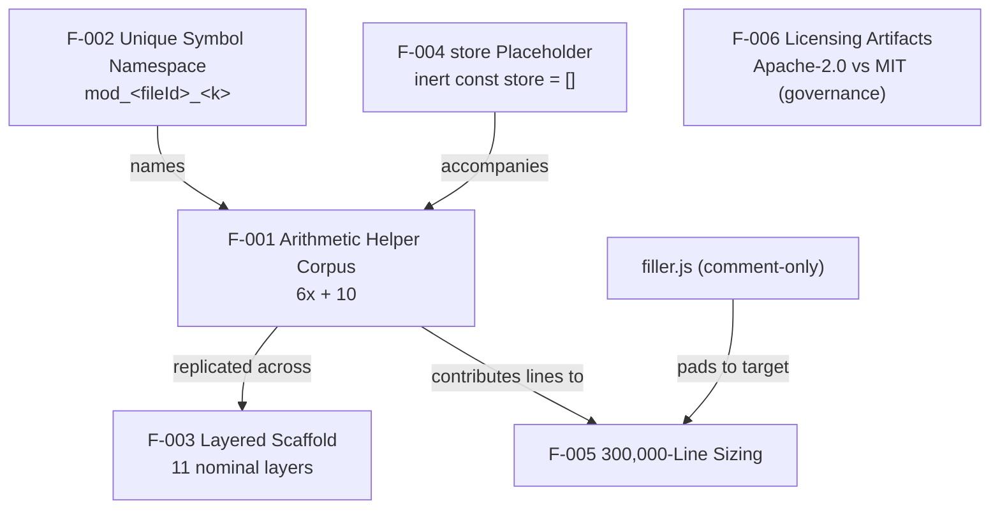

# Functionality Catalog

## Overview

This area documents **what the `society_mgmt_300k` corpus actually
does**. The corpus has exactly **one** behavioral capability: a family
of **33,105** pure arithmetic helper functions, each named
`mod_<fileId>_<k>(x)`, that effectively return **`6x + 10`** (feature
**F-001**) — for example, `mod_0_0(4) === 34`. Everything else in the
tree — the `config`, `middleware`, `models`, `controllers`, `routes`,
`domain`, `services`, and `repositories` folders — is a **structural
stub** built from the same arithmetic archetype, not implemented domain
logic. "Society management" is therefore a **nominal label** only: it
appears as the repository name and in a per-file header comment such as
`// mod_0 - society module`, never as real functionality.
Source: docs/reference/file-inventory.md#verification (the 29 `.js`
files / 33,105 functions); docs/architecture/layered-scaffold.md (the
11-layer stub scaffold); society_mgmt_300k/src/controllers/file_0.js:L1
(the `// mod_0 - society module` header label)

Because all 33,105 functions across the corpus's **29** `.js` files are
structurally identical, this catalog **generalizes a single archetype**
rather than documenting each function on its own page. The six features
below (F-001 through F-006) capture every documented aspect of the
system — its core computation, its naming scheme, its layered scaffold,
its inert `store` placeholder, its deterministic 300,000-line sizing,
and its licensing artifacts. Each is reported faithfully: where a real
performance or security surface is absent, that absence is stated
rather than invented.
Source: docs/reference/file-inventory.md#verification (the 29 files and
33,105 structurally identical functions); the six features are detailed
in the pages linked under In this area below.

## Feature summary

The table below is the one-stop reference for the six documented
features. Each feature is expanded in the detail pages listed under
[In this area](#in-this-area) or in the sibling areas reached via
[Related areas](#related-areas).

| Feature | Name | Description | Primary source |
| --- | --- | --- | --- |
| F-001 | Arithmetic Helper Corpus | 33,105 pure functions computing `6x + 10` (dead always-true parity branch) | Source: society_mgmt_300k/src/controllers/file_0.js:L3-L10 |
| F-002 | Unique Symbol Namespace | `mod_<fileId>_<k>` naming — collision-free, file-local, not importable | Source: society_mgmt_300k/src/controllers/file_0.js:L3 |
| F-003 | Layered Scaffold | 11 nominal layers with no inter-layer edges (see [Architecture](../architecture/README.md)) | Source: docs/architecture/layered-scaffold.md |
| F-004 | `store` Placeholder | inert `const store = [];` in 28 files, never read/written | Source: society_mgmt_300k/src/controllers/file_0.js:L2; docs/functionality/module-anatomy.md |
| F-005 | 300,000-Line Sizing | deterministic line target met exactly | Source: docs/functionality/corpus-composition.md |
| F-006 | Licensing Artifacts | Apache-2.0 (root) vs MIT (inner) conflict — governance (see [Security](../security/README.md)) | Source: LICENSE; society_mgmt_300k/LICENSE/LICENSE.txt:L1 |

## Feature relationships

The six features are not independent; the diagram below shows how they
relate — the namespace (F-002) names the helper corpus (F-001), which
is replicated across the layered scaffold (F-003) and, together with
`filler.js`, sizes the corpus (F-005), while licensing (F-006) stands
alone as a governance artifact.

In prose: **F-002** names **F-001**; the inert **F-004** `store`
accompanies **F-001** in 28 of the 29 files; **F-001** is replicated
across the **F-003** layers; **F-001** plus the comment-only
`filler.js` contribute the lines that meet the **F-005** 300,000-line
target; and **F-006** is a standalone licensing/governance artifact
with no behavioral relationship to the others.
Source: docs/functionality/module-anatomy.md (the inert `store` in 28 of
the 29 files); docs/architecture/layered-scaffold.md (replication across
the 11 layers); docs/functionality/corpus-composition.md (`filler.js`
and the 300,000-line target); LICENSE;
society_mgmt_300k/LICENSE/LICENSE.txt:L1 (the F-006 dual-license artifact)

## In this area

- **[Arithmetic helpers](arithmetic-helpers.md)** — F-001 core
  behavior (`6x + 10`, dead always-true branch) and the F-002
  namespace; includes a worked example and a formula table.
- **[Module anatomy](module-anatomy.md)** — the per-file header
  comment, the F-004 inert `store`, the function block, and the
  comment-only `filler.js` variant.
- **[Corpus composition](corpus-composition.md)** — F-005 sizing: the
  per-layer file/function/line table and the 300,000-line math.

## Related areas

- **[Architecture](../architecture/README.md)** — the F-003 layered
  scaffold (rendered as isolated nodes with no inter-layer edges) and
  the per-function control flow.
- **[Performance](../performance/README.md)** — the O(1) time/space
  characterization, determinism and purity, and the explicit absence of
  SLAs or throughput targets.
- **[Security](../security/README.md)** — the verified-absence security
  posture and the F-006 Apache-2.0-vs-MIT dual-license governance item.
- **[Glossary](../reference/glossary.md)** — definitions of `mod_`,
  `store`, `filler`, *layer*, *short variant*, *synthetic corpus*, and
  *dead always-true branch*.
- **[Documentation home](../README.md)** — the top-level documentation
  hub and navigation index.

## Source Citations

- `society_mgmt_300k/src/controllers/file_0.js:L1-L10` — the canonical
  module motif (header comment, inert `store`, and a `mod_*` function);
  the representative archetype for the per-feature examples shown above.
- `society_mgmt_300k/src/controllers/file_0.js:L3-L10` — the function
  body that yields the `6x + 10` behavior (F-001) and the `mod_0_0`
  name visible on its declaration (F-002).
- `docs/reference/file-inventory.md#verification` — the authoritative,
  reproducible scan establishing the 29-file / 33,105-function /
  300,000-line counts cited corpus-wide.
- `docs/architecture/layered-scaffold.md` — the authoritative source for
  the 11 nominal layers and the absence of inter-layer edges (F-003).
- `docs/functionality/module-anatomy.md` — the authoritative source for
  the inert `store` placeholder (F-004), present in 28 of the 29 files.
- `docs/functionality/corpus-composition.md` — the authoritative source
  for the deterministic 300,000-line sizing (F-005) and the per-layer
  composition.
- `society_mgmt_300k/src/utils/filler.js:L1-L3` — the comment-only
  `filler.js` (1,999 lines, 0 functions) that pads the corpus to its
  exact 300,000-line target (F-005).
- `LICENSE` — the root **Apache-2.0** license (F-006).
- `society_mgmt_300k/LICENSE/LICENSE.txt:L1` — the inner **MIT** license
  that conflicts with the root Apache-2.0 license (F-006).
