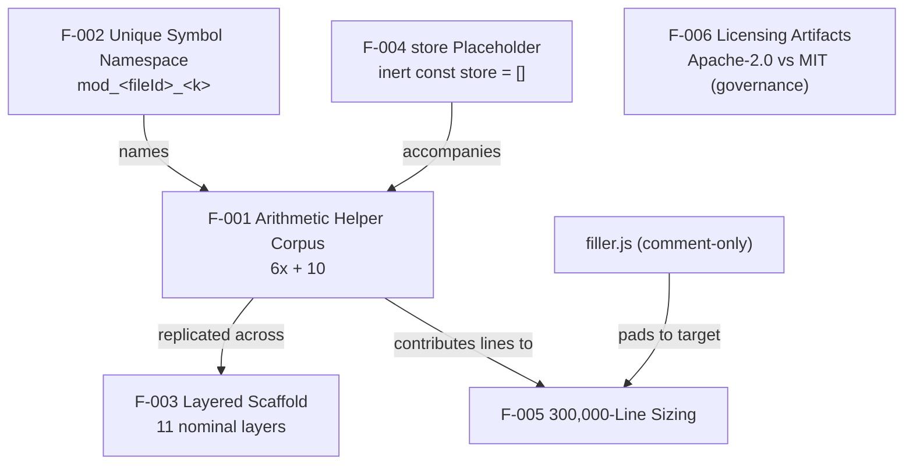

# Functionality Catalog

← Back to the [documentation hub](../README.md)

## Overview

This area documents **what the `society_mgmt_300k` corpus actually does**. The
corpus has exactly **one** behavioral capability: a family of arithmetic helper
functions, each of which effectively returns **`6x + 10`** for a numeric input
`x` (feature **F-001**). Every other layer — `config`, `models`, `routes`,
`services`, `repositories`, and the rest — is a **structural stub** built from
the same arithmetic body and contributes no domain logic. "Society management"
is a **nominal label** only: it appears as the repository name and a per-file
header comment (`// mod_0 - society module`), not as implemented behavior
(Source: `society_mgmt_300k/src/controllers/file_0.js:L1-L10`).

Because all **33,105** functions are byte-identical apart from their names, this
catalog documents a single **archetype** and generalizes it across the whole
corpus rather than publishing per-function pages
(Source: `society_mgmt_300k/src/controllers/file_0.js:L1-L10`). The six
documented features — **F-001** through **F-006** — are summarized in the table
below, with the full treatment split across the three detail pages in this
folder and the sibling areas. For terminology (*pure*, *deterministic*, *dead
always-true branch*, *synthetic corpus*, *short variant*, *filler*), see the
[glossary](../reference/glossary.md).

## Feature summary

This catalog documents six features (**F-001** through **F-006**); each row cites
its primary source, and the detail pages and sibling areas expand on them.

| Feature | Name | Description | Primary source |
| --- | --- | --- | --- |
| F-001 | Arithmetic Helper Corpus | 33,105 pure functions computing `6x + 10` (dead always-true parity branch) | `society_mgmt_300k/src/controllers/file_0.js:L3-L10` |
| F-002 | Unique Symbol Namespace | `mod_<fileId>_<k>` naming — collision-free, file-local, not importable | `society_mgmt_300k/src/controllers/file_0.js:L3` |
| F-003 | Layered Scaffold | 11 nominal layers with no inter-layer edges (see [Architecture](../architecture/README.md)) | `society_mgmt_300k/src/controllers/file_0.js:L1` |
| F-004 | `store` Placeholder | inert `const store = [];` in 28 files, never read/written | `society_mgmt_300k/src/controllers/file_0.js:L2` |
| F-005 | 300,000-Line Sizing | deterministic line target met exactly | `society_mgmt_300k/src/utils/filler.js:L1-L3` |
| F-006 | Licensing Artifacts | Apache-2.0 (root) vs MIT (inner) conflict — governance (see [Security](../security/README.md)) | `LICENSE`; `society_mgmt_300k/LICENSE/LICENSE.txt:L1` |

## Feature relationships

The six features are not independent. The diagram below shows how they relate:
the naming scheme names the helper family, the inert placeholder accompanies it,
the family is replicated across the layers and — together with the comment-only
`filler.js` — sizes the corpus, while the licensing artifacts stand alone as a
governance concern.

In prose: **F-002** names **F-001**; **F-004** accompanies **F-001** in every
numbered file; **F-001** is replicated across the **F-003** layers; **F-001**
together with the comment-only `filler.js` contributes the lines counted by
**F-005**; and **F-006** is a standalone governance artifact with no behavioral
relationship to the others
(Source: `society_mgmt_300k/src/controllers/file_0.js:L1-L10`).

## In this area

The three detail pages in this folder expand the features above:

- **[Arithmetic helpers](arithmetic-helpers.md)** — F-001 core behavior
  (`6x + 10`, dead branch) and the F-002 namespace; worked example and formula
  table.
- **[Module anatomy](module-anatomy.md)** — the header comment, the F-004 inert
  `store`, the function block, and the comment-only `filler.js` variant.
- **[Corpus composition](corpus-composition.md)** — F-005 sizing; the per-layer
  file/function/line table and the 300,000-line math.

## Related areas

Features that live outside this folder, plus supporting references:

- **[Architecture](../architecture/README.md)** — the F-003 layered scaffold and
  the `mod_*` module control flow (including the dead always-true branch).
- **[Performance](../performance/README.md)** — O(1) time and space, determinism
  and purity, and the explicit absence of SLAs.
- **[Security](../security/README.md)** — the verified-absence security posture
  and the F-006 dual-license governance item.
- **[Glossary](../reference/glossary.md)** — definitions for the corpus
  terminology used across these pages.
- **[Documentation hub](../README.md)** — the top-level index for every
  documentation area.

## Source Citations

- `society_mgmt_300k/src/controllers/file_0.js:L1-L10` — canonical module motif;
  the archetype and basis for F-001 through F-004.
- `society_mgmt_300k/src/utils/filler.js:L1-L3` — comment-only padding file;
  basis for F-005's exact line sizing.
- `LICENSE` — root Apache-2.0 license (F-006).
- `society_mgmt_300k/LICENSE/LICENSE.txt:L1` — inner MIT license (F-006).
