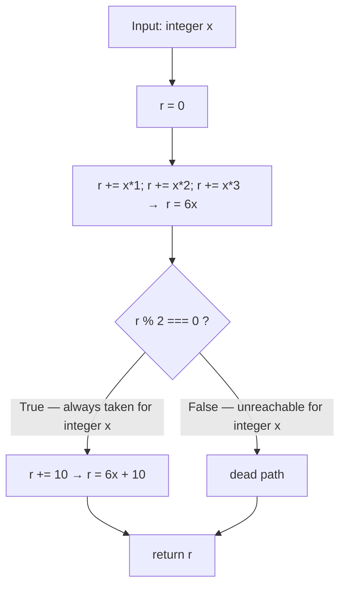

# Arithmetic Helpers (F-001)

← Back to the [functionality index](./README.md) · [documentation hub](../README.md)

## Purpose

This document describes **F-001**, the single computational motif of the synthetic [`society_mgmt_300k`](../overview.md) JavaScript *corpus*. Every one of the corpus's **33,105 functions** is byte-identical and computes the same expression, **`6x + 10`**, for an integer input `x`. Rather than enumerate 33,105 near-identical functions, this document specifies **one representative function contract** that stands in for all of them — the *representative-pattern* approach used throughout this documentation (Source: `society_mgmt_300k/src/controllers/file_0.js:L3-L10`; Tech Spec §2.2.2).

## Representative Contract

The representative contract is `mod_<fileId>_<k>(x) → 6x + 10`: a single-argument function whose name encodes its originating module (`fileId`) and its index within that module (`k`), and which returns `6x + 10` for an integer input `x`. The canonical function body, reproduced exactly as it appears in the source, is (Source: `society_mgmt_300k/src/controllers/file_0.js:L3-L10`):

```javascript
function mod_0_0(x){
 let r=0;
 r+=x*1;
 r+=x*2;
 r+=x*3;
 if(r%2===0){r+=10}
 return r;
}
```

The three additions accumulate the running total `r`:

- `r += x*1` adds `x`,
- `r += x*2` adds `2x`,
- `r += x*3` adds `3x`,

so after the three statements `r = x*1 + x*2 + x*3 = 6x`. The parity guard `if(r%2===0){r+=10}` then adds `10`, yielding the final result `6x + 10` (Source: `society_mgmt_300k/src/controllers/file_0.js:L3-L10`; Tech Spec §2.2.2).

## Behavior

The representative function is **pure, synchronous, deterministic, and side-effect-free** — each property is directly evident in the canonical body shown above (Source: `society_mgmt_300k/src/controllers/file_0.js:L3-L10`; Tech Spec §2.2.2):

- **Pure / deterministic** — its result depends only on the single numeric argument `x`; the same input always produces the same output.
- **Synchronous** — it performs no asynchronous work; there are no promises, callbacks, timers, or `await`.
- **Side-effect-free** — it reads only `x`, performs in-memory integer arithmetic on a single local accumulator `r`, allocates nothing, performs no I/O (no file, network, console, or database access), references no external or module-scoped state, and returns a number.

These properties are a *verified absence*: there are no additional parameters, overloads, error handling, exceptions, or asynchronous behavior in the source — the function consists solely of the arithmetic shown above (Source: `society_mgmt_300k/src/controllers/file_0.js:L3-L10`).

## The Dead Always-True Parity Branch

For any integer `x`, the accumulated value `r = 6x` is **always even** (it is a multiple of `6`, hence a multiple of `2`). Consequently the parity guard `if(r%2===0)` is **always true** for integer inputs, so the body `r += 10` **always executes**, and the implicit `false` path — the case where the `if` is skipped — is **unreachable / dead code** for integer `x` (Source: `society_mgmt_300k/src/controllers/file_0.js:L8`; Tech Spec §2.2.2).

This is a **static observation** — a constant-fold / dead-code property of the source — and not a runtime cost: the branch is evaluated in constant time on every call regardless of which path is logically reachable (Source: `society_mgmt_300k/src/controllers/file_0.js:L3-L10`, `:L8`; Tech Spec §2.2.2). The same branch is analyzed from the performance angle in [`../performance.md`](../performance.md), which shares the computation flowchart shown below.

## Worked Example

Evaluating the contract for `x = 5`:

1. `r = 0`
2. `r += 5*1` → `r = 5`
3. `r += 5*2` → `r = 15`
4. `r += 5*3` → `r = 30` (this is `6 × 5 = 30`)
5. `30 % 2 === 0` is **true** (30 is even), so `r += 10` → `r = 40`
6. `return 40`

The result is **`6 × 5 + 10 = 40`**. Because every function in the corpus is byte-identical, this single worked example fully characterizes the behavior of all of them — one example suffices (Source: `society_mgmt_300k/src/controllers/file_0.js:L3-L10` — evaluating `6x + 10` at `x = 5`).

## Equivalence Note

This one representative function stands in for **all 33,105 byte-identical functions** in the corpus. Every function across all 11 layers shares the identical body shown above and differs only in its `mod_<fileId>_<k>` name; none is enumerated individually here (the *representative-pattern* approach) (Source: `society_mgmt_300k/src/controllers/file_0.js:L3-L10`; Tech Spec §2.2.2 — byte-identical bodies across all layers).

- For the full per-layer rollup of all 29 files and their function counts, see [`./module-reference.md`](./module-reference.md).
- For the `mod_<fileId>_<k>` naming scheme and why every symbol is globally unique, see [`./symbol-namespace.md`](./symbol-namespace.md).

## Computation Flowchart

The flowchart below traces the computation: the `6x` accumulation, the always-true parity branch, and the `+10` result. This diagram is **shared verbatim** with [`../performance.md`](../performance.md); the **`False`** edge is the dead / unreachable path for integer `x`, as explained above.



## Cross-References

- [`../performance.md`](../performance.md) — analyzes the same computation (and the same shared flowchart) from the performance angle: constant-time `O(1)` per call and the dead always-true parity branch.
- [`./symbol-namespace.md`](./symbol-namespace.md) — the `mod_<fileId>_<k>` naming scheme, per-file index ranges, and global uniqueness.
- [`./module-reference.md`](./module-reference.md) — the per-layer inventory of all 29 files that this representative contract describes.
- [`./README.md`](./README.md) — the functionality index.
- [`../README.md`](../README.md) — the top-level documentation hub.

## Source Citations

- `society_mgmt_300k/src/controllers/file_0.js:L3-L10` — the canonical function body computing `6x + 10`, representative of all 33,105 byte-identical functions.
- `society_mgmt_300k/src/controllers/file_0.js:L8` — the always-true parity guard `if(r%2===0){r+=10}`, whose `false` path is dead for integer `x`.
- Tech Spec §2.2.2 — the representative `6x + 10` contract and the dead always-true parity branch.
- Tech Spec §2.2.2 — byte-identical function bodies across all layers; the representative-pattern approach stands in for all 33,105 functions.

---

← Back to the [functionality index](./README.md) · [documentation hub](../README.md)
