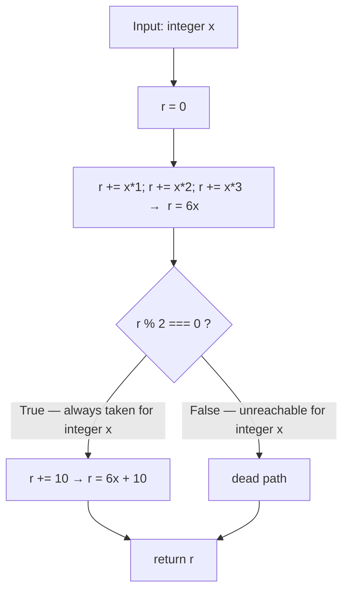

# Performance

← Back to the [documentation hub](./README.md)

## Purpose

This document **highlights the performance characteristics** of the synthetic
`society_mgmt_300k` JavaScript *corpus*. Performance is framed here honestly and
strictly around what is verifiable in the source: every function executes in
**constant time, `O(1)`**; the parity branch inside each function is a
**dead, always-true branch** (a static dead-code observation, not a runtime
cost); and the only genuinely performance-adjacent property of the project is
its **scale** — 300,000 lines of source — whose cost is a one-time
*parse / traverse* expense paid by tooling rather than at runtime. Conventional
runtime concerns — throughput, latency, concurrency, and scalability — are
**Not Applicable**, because the corpus is not a runnable application and has no
server, request path, or data path (Source: Tech Spec §2.2.4 — no entry point
and zero `module.exports`/`require(` occurrences; Tech Spec §2.5.2-§2.5.3 —
runtime concerns Not Applicable).

## Per-Call Complexity: Constant-Time `O(1)`

Every function in the corpus runs in **constant time, `O(1)`**. The
*representative function* performs a fixed number of arithmetic operations on a
single local accumulator and then returns — there are
**no loops, no recursion, no allocation, and no I/O** (no file, network,
console, or database access). The amount of work is independent of the input
value `x`, so the per-call cost does not grow with input magnitude. The
canonical function body, reproduced exactly as it appears in the source, is
(Source: `society_mgmt_300k/src/controllers/file_0.js:L3-L10`; Tech Spec
§2.5.2):

```javascript
function mod_0_0(x){
 let r=0;
 r+=x*1;
 r+=x*2;
 r+=x*3;
 if(r%2===0){r+=10}
 return r;
}
```

The three additions accumulate `r = x*1 + x*2 + x*3 = 6x`, after which the
parity guard adds `10`, so the function computes **`6x + 10`** in a fixed,
constant number of steps (Source:
`society_mgmt_300k/src/controllers/file_0.js:L3-L10`; Tech Spec §2.5.2).

This single `O(1)` profile is a *representative pattern*: every one of the
corpus's **33,105 functions** is byte-identical and shares this exact body, so
one complexity analysis characterizes the entire corpus and no per-function
profiling is required (Source: Tech Spec §2.2.2 — byte-identical bodies across
all 33,105 functions; `society_mgmt_300k/src/controllers/file_0.js:L3-L10`).

## The Dead Always-True Parity Branch

For any integer `x`, the accumulated value `r = 6x` is **always even** (it is a
multiple of `6`, and therefore a multiple of `2`). Consequently the parity guard
`if(r%2===0)` is **always true** for integer inputs: the body `r += 10`
**always executes**, and the implicit `false` path — the case in which the `if`
is skipped — is **unreachable / dead code** for integer `x` (Source:
`society_mgmt_300k/src/controllers/file_0.js:L8`; Tech Spec §2.5.3).

This is a **constant-fold / dead-code observation** about the source, not a
runtime penalty. The branch is evaluated in constant time on every call
regardless of which path is logically reachable; an optimizing engine could fold
the always-true condition away entirely, but the executed work remains `O(1)`
either way. The presence of the dead `false` path incurs no additional cost at
runtime (Source: `society_mgmt_300k/src/controllers/file_0.js:L8`; Tech Spec
§2.5.3).

## Corpus Scale (Parse / Traverse Cost)

The single performance-adjacent property of this project is its **scale**. The
corpus comprises **300,000 lines** of JavaScript across **29 files** that
together define **33,105 functions** (Source: Tech Spec §1.2.2 — 29 files and
per-layer function counts; Tech Spec §2.2.6 — the 300,000-line composition and
33,105-function total):

| Metric | Value |
| --- | --- |
| Total source lines | 300,000 |
| Source files (`.js`) | 29 |
| Functions defined | 33,105 |
| Exported / importable symbols | 0 |

Because nothing in the corpus executes as a service, the only real "performance"
cost associated with this scale is the **one-time static-processing cost** of a
large source tree — the time and memory a build tool, linter, IDE, or `git`
operation spends to **parse, lint, index, or traverse** 300,000 lines. This cost
is paid once by tooling at rest, scales with the size of the tree rather than
with any workload, and is never incurred repeatedly at runtime (Source:
Tech Spec §2.2.6 — the 300,000-line scale; Tech Spec §2.5.2 — performance
characterization).

## Runtime Scalability: Not Applicable

Conventional runtime performance concerns are **Not Applicable** to this corpus,
reported here as a *verified absence* rather than as zero-valued metrics:

- **Scalability — Not Applicable.** There is no server, request path, data path,
  concurrency model, or workload; nothing runs as a long-lived service that
  could be scaled (Source: Tech Spec §2.2.4 — no entry point and zero
  `module.exports`/`require(` occurrences; Tech Spec §2.5.2-§2.5.3 — scalability
  Not Applicable).
- **Throughput / latency — Not Applicable.** With no executing service and no
  request lifecycle, there is no throughput to measure and no latency to
  observe.
- **No SLAs, targets, or benchmarks.** No service-level agreements, performance
  targets, or benchmark suites exist for this corpus, and none are applicable;
  none are asserted or fabricated here (Source: Tech Spec §2.5.2-§2.5.3 — no
  SLAs, targets, or benchmarks apply to a non-runnable corpus).

Each of these properties does not exist for this corpus, so it is documented as
a verified absence and no figures are invented for it (Source: Tech Spec
§2.5.2-§2.5.3 — these runtime properties do not exist for a non-runnable corpus).

## Computation Flowchart

The flowchart below traces the same constant-time computation analyzed above:
the `6x` accumulation, the always-true parity branch, and the `+10` result. The
**`False`** edge is the dead / unreachable path for integer `x` described in the
dead-branch section above. This diagram is **shared verbatim** with
[`arithmetic-helpers.md`](./functionality/arithmetic-helpers.md), which analyzes
the same representative function from the functional-contract angle.



## Cross-References

- [`arithmetic-helpers.md`](./functionality/arithmetic-helpers.md) — the
  functional contract `mod_<fileId>_<k>(x) → 6x + 10` for the same
  representative function; it shares the computation flowchart above.
- [`./README.md`](./README.md) — the top-level documentation hub.

## Source Citations

- `society_mgmt_300k/src/controllers/file_0.js:L3-L10` — the canonical,
  constant-time function body computing `6x + 10`; representative of all 33,105
  byte-identical functions.
- `society_mgmt_300k/src/controllers/file_0.js:L8` — the always-true parity
  guard `if(r%2===0){r+=10}`, whose `false` path is dead for integer `x`.
- Tech Spec §1.2.2 and §2.2.6 — 300,000 lines / 29 files / 33,105
  functions, and `0` exported/importable symbols (Tech Spec §2.2.4).
- Tech Spec §2.5.2-§2.5.3 — runtime scalability, throughput, and
  latency are Not Applicable (no server, request path, or data path); Tech Spec
  §2.2.4 — no entry point or executing service.
- Tech Spec §2.2.2 — byte-identical bodies across all 33,105 functions, so one
  `O(1)` profile (the representative pattern) characterizes the entire corpus.
- Tech Spec §2.5.2-§2.5.3 — no SLAs, performance targets, or benchmarks exist or
  are applicable.

---

← Back to the [documentation hub](./README.md)
