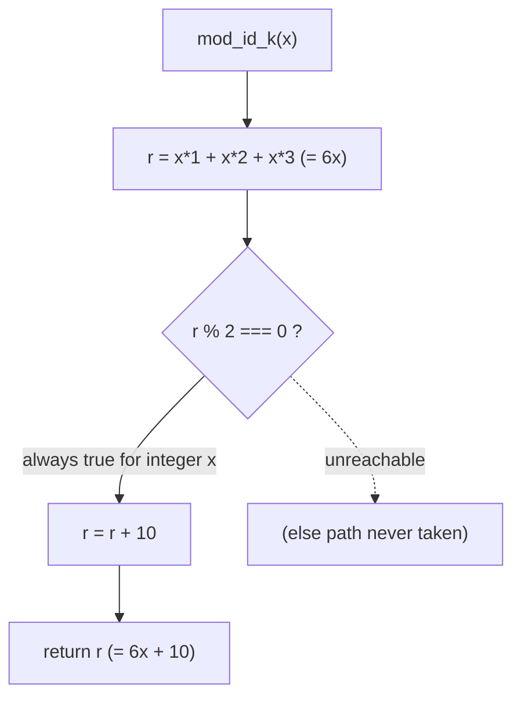

# Function reference

The `society_mgmt_300k` corpus exposes a single behavioral capability — the [`mod_*`](../glossary.md) helper-function family — and this page is its authoritative reference `[society_mgmt_300k/src/config/file_6.js:L3-L10]`.

## Overview

The corpus contains exactly **33,105** functions, all byte-for-byte identical except for their names; each one computes and returns **`6x + 10`** for an integer input `x` `[society_mgmt_300k/src/config/file_6.js:L3-L10]` `[Technical Specification §1.2.2]`. Because every function shares one body, this reference documents a single representative function, `mod_6_0`, that fully characterizes the entire family (see [Notes on uniformity](#notes-on-uniformity)). Corpus-specific vocabulary such as [`mod_*`](../glossary.md), the inert `store`, and *dead branch* is defined in the glossary.

## Signature

Every function shares the canonical signature `mod_<fileId>_<k>(x)` — one positional numeric parameter `x` `[society_mgmt_300k/src/config/file_6.js:L3]`. The name encodes two indices:

- `<fileId>` — the number of the source file the function lives in (for example, `6` for the canonical `society_mgmt_300k/src/config/file_6.js`) `[society_mgmt_300k/src/config/file_6.js:L3]`.
- `<k>` — the zero-based index of the function within that file (for example, `0` for the first function) `[society_mgmt_300k/src/config/file_6.js:L3]`.

So `mod_6_0` is the first function (index `0`) defined in file `6` `[society_mgmt_300k/src/config/file_6.js:L3]`.

## Parameters and return

`mod_<fileId>_<k>` declares exactly one positional parameter, `x` `[society_mgmt_300k/src/config/file_6.js:L3]`:

| Parameter | Type | Description |
| --- | --- | --- |
| `x` | number (intended integer) | The single numeric input to the computation. |

It returns a single number `[society_mgmt_300k/src/config/file_6.js:L9]`:

| Type | Value | Notes |
| --- | --- | --- |
| number | `6x + 10` (for integer `x`) | The function returns the local accumulator `r` after the arithmetic and the parity guard. |

The source declares no additional parameters, no overloads, no default values, and no destructuring `[society_mgmt_300k/src/config/file_6.js:L3]`.

## Behavior

The function body runs a fixed, linear sequence of statements with no loops and no branches other than the parity guard `[society_mgmt_300k/src/config/file_6.js:L4-L9]`:

1. Initialize the accumulator with `let r = 0`, then add `x`, `2x`, and `3x` in three steps (`r += x*1; r += x*2; r += x*3;`), so that `r = 6x` `[society_mgmt_300k/src/config/file_6.js:L4-L7]`.
2. Apply the parity guard `if (r % 2 === 0) { r += 10 }`, which adds `10` to the accumulator `[society_mgmt_300k/src/config/file_6.js:L8]`.
3. Return the accumulator with `return r` `[society_mgmt_300k/src/config/file_6.js:L9]`.

For integer `x`, the three additions always produce `r = 6x` and the parity guard always adds `10`, so the function returns `6x + 10` `[society_mgmt_300k/src/config/file_6.js:L4-L9]`.

## The dead always-true parity branch

The parity guard `if (r % 2 === 0) { r += 10 }` is worth a dedicated note `[society_mgmt_300k/src/config/file_6.js:L8]`. For any **integer** `x`, the accumulated value `r = 6x` is a multiple of `6` and therefore always even, so the condition `r % 2 === 0` is **always true**, the `r += 10` body **always executes**, and the path in which the `+ 10` is skipped is **unreachable** — a [dead branch](../glossary.md) for integer input `[society_mgmt_300k/src/config/file_6.js:L8]` `[Technical Specification §4.3.1]`.

Two accuracy notes keep this claim precise and honest:

- **There is no literal `else` keyword.** The source contains only the `if` statement; there is no `else` clause. The unreachable path is the *implicit* branch-not-taken (the case where the `if` body is skipped), not an explicit `else` block `[society_mgmt_300k/src/config/file_6.js:L8]`.
- **The claim is scoped to integer input.** The "always true" property holds only for integer `x`. For a non-integer such as `x = 0.5`, `6x = 3` is odd, the condition is false, and the `+ 10` is skipped — so the function returns `3` rather than `13` `[society_mgmt_300k/src/config/file_6.js:L8]`.

## Example

One worked call fully characterizes every function in the corpus, because all 33,105 functions are byte-for-byte identical except for their names `[society_mgmt_300k/src/config/file_6.js:L3-L10]`:

```javascript
mod_6_0(2); // => 22   (6*2 = 12, even, + 10 => 22)
mod_6_0(5); // => 40   (6*5 = 30, even, + 10 => 40)
```

This single example is **representative of all 33,105 identical functions**; substituting any other `mod_<fileId>_<k>` name yields the same `6x + 10` result `[society_mgmt_300k/src/config/file_6.js:L3-L10]`.

## Notes on uniformity

Beyond the arithmetic, several structural properties hold uniformly across the family `[Technical Specification §4.3.3]`:

- **Pure, deterministic, and side-effect-free.** Each function depends only on its argument `x`, performs in-memory arithmetic on a single local accumulator, and returns a number; there is no I/O, no shared state, no `throw`/`try`/`catch`, and no `async`/`await` `[Technical Specification §4.3.3]`.
- **Constant time, `O(1)`.** Each call performs a fixed number of operations regardless of the magnitude of `x`; there are no loops and no recursion `[Technical Specification §4.3.3]`.
- **An inert `store`.** Every non-filler file declares a module-scoped `const store = []` that is never read from or written to anywhere in the file; it does not participate in the computation `[society_mgmt_300k/src/config/file_6.js:L2]`.
- **Fixtures share the same body.** The files under `tests/unit` and `tests/integration` contain the same `mod_*` functions as the `src` layers; they are generated fixtures with no assertions or test-runner code `[Technical Specification §1.2.2]`.

For the full per-layer inventory of all 29 files and their function counts, see the [source layout reference](source-layout.md). The same computation is examined from other angles in the [performance](../performance.md) and [security](../security.md) documents.

## Flow diagram

The flowchart below traces the computation: the `6x` accumulation, the always-true parity branch, and the `6x + 10` result. The parity edge is labelled to show it is always taken for integer `x`, and the skipped-`+10` path is drawn as an unreachable (dotted) edge `[society_mgmt_300k/src/config/file_6.js:L4-L9]` `[Technical Specification §4.3.1]`:



---

[← Documentation Home](../README.md)
