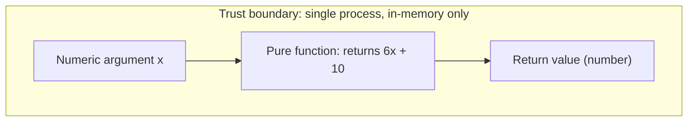

# Security

← Back to the [documentation hub](./README.md)

## Security posture

The `society_mgmt_300k` repository is a **synthetic JavaScript corpus** — a deterministically generated body of code, not a runnable product — and its security posture is therefore one of **verified absence**: there is no service, no runtime, and no conventional attack surface to defend. The corpus's only behavior is a pure, in-memory arithmetic helper, `mod_<fileId>_<k>(x)`, that returns `6x + 10` for a single numeric argument `x` and produces no side effects (Source: `society_mgmt_300k/src/config/file_6.js:L3-L10`; Tech Spec §6.4). This document highlights security honestly: rather than implying protections the code does not have, it reports — with a source citation on every claim — what is *verifiably absent*, and it explains why that absence is the correct, expected finding for a runtime-free corpus (Source: Tech Spec §6.4).

> **What "verified absence" means here.** "Absent" means *confirmed absent by a first-hand scan of the source*, not merely "undocumented" or "assumed." Where a capability — network access, persistence, authentication, and so on — is reported as absent below, that absence was checked against the corpus and reflects its deliberate, documented state (Source: Tech Spec §6.4).

## Attack surface (verified-empty)

The corpus performs only **in-memory integer arithmetic** on a single numeric argument, so there is no channel through which untrusted data can enter or leave. The sole input is the numeric parameter `x` passed to a pure function; there is **no network, file, environment, user, or other external input** (Source: `society_mgmt_300k/src/config/file_6.js:L3-L10`; Tech Spec §4.3.3). The module-scoped `const store = []` declared in every non-filler file is an **inert `store`** — it is never read or written — so it is neither a persistence mechanism nor an injection sink (Source: `society_mgmt_300k/src/config/file_6.js:L2`; Tech Spec §5.4.3). The functions contain **no `eval`, no dynamic code execution, no `throw`/`try`/`catch`, and no I/O** of any kind across all 33,105 functions (Source: Tech Spec §4.3.3). Finally, the project has **no `package.json` and zero third-party dependencies**, so there is no dependency-vulnerability surface and no supply-chain manifest to compromise (Source: Tech Spec §1.2.2).

The table below enumerates each conventional attack vector and its verified status in the corpus.

| Potential attack vector | Status | Evidence |
| --- | --- | --- |
| Network / remote endpoints | Not present (verified empty) | No network APIs; nothing listens or connects (Source: `society_mgmt_300k/src/config/file_6.js:L3-L10`; Tech Spec §4.3.3) |
| File / OS / filesystem input | Not present (verified empty) | No file or operating-system I/O anywhere in the source (Source: Tech Spec §4.3.3) |
| Environment / configuration input | Not present (verified empty) | The nominal `config/` layer holds only arithmetic helpers, no settings or secrets (Source: `society_mgmt_300k/src/config/file_6.js:L1`; Tech Spec §1.2.2) |
| User / authentication input | Not present (verified empty) | No users, sessions, tokens, or roles; the only input is the numeric argument `x` (Source: `society_mgmt_300k/src/config/file_6.js:L3-L10`; Tech Spec §6.4) |
| Persistent state / data store | Not present (verified empty) | The module-scoped `store` array is inert — never read or written (Source: `society_mgmt_300k/src/config/file_6.js:L2`; Tech Spec §5.4.3) |
| Dynamic code execution | Not present (verified empty) | No `eval`, no dynamic execution, no `throw`/`try`/`catch` (Source: Tech Spec §4.3.3) |
| Dependency / supply-chain surface | Not present (verified empty) | No `package.json` or lockfile; zero third-party dependencies (Source: Tech Spec §1.2.2) |

Because every one of these vectors is verifiably empty, there is no meaningful attack surface to enumerate, threat-model, or defend (Source: Tech Spec §6.4).

## No security controls — an intentional decision (ADR-06)

The corpus implements **no security controls**: no authentication, no authorization, no encryption, no input-validation framework, no rate limiting, and no secrets management (Source: Tech Spec §6.4). This is a **deliberate, documented architectural decision recorded as ADR-06**, not an oversight or a defect to remediate. Because the corpus has no attack surface — every vector enumerated above is verified empty — such controls would defend against threats that cannot arise here, and adding them would imply a capability and a risk profile the code does not have (Source: Tech Spec §6.4).

In verified-absence terms, the *correct* posture for a pure, side-effect-free arithmetic corpus is precisely the absence of controls. The decision is bounded: should the corpus ever gain real inputs, outputs, persistence, or network access, ADR-06 would need to be revisited and the corresponding controls introduced at that time (Source: Tech Spec §6.4).

## Baseline hygiene

The corpus exhibits a clean security baseline, achieved **by absence** of risky constructs rather than by any active control:

- **No committed secrets.** A scan of the source finds no credentials, API keys, tokens, or connection strings embedded in the `.js` files (Source: Tech Spec §6.4).
- **Zero third-party dependencies — no supply-chain surface.** With no `package.json` and no lockfile, the corpus pulls in no external packages, so there is no dependency supply-chain or CVE exposure to track (Source: Tech Spec §1.2.2).
- **Version history and recovery via Git.** Content and change history are tracked by Git, providing a verifiable record of every modification and a straightforward recovery path (Source: Tech Spec §6.4).

These properties reduce risk simply because the corresponding risky constructs — embedded secrets and external dependencies — are **not present** to begin with (Source: Tech Spec §6.4).

## Operational note on secrets

This is an **operational hygiene** note about how a project is run, not a finding against the corpus code:

- This documentation effort was supplied with **no environment variables and no secrets** (the setup configuration lists none), and the baseline-hygiene scan above confirms that **no secret values are committed anywhere in the corpus source** (Source: user-provided setup configuration — none provided; Tech Spec §6.4).
- Any secret values referenced in operator-supplied setup instructions — for example, a database host or an API key used to run a deployment — belong only to that **operational/runtime context**, never to the code, and should be supplied at runtime via **environment variables** or a dedicated **secrets manager**, and kept out of shell history, setup scripts, and documentation (Source: AAP §0.5.2).
- Secret *values* are deliberately **never reproduced** in this documentation; where a secret is discussed it is referred to by role only (Source: AAP §0.1.4).

## Licensing governance note

The repository contains **two conflicting license files**, recorded here as the **lone open governance concern** for the corpus — a governance and clarity matter, not a security vulnerability (Source: Tech Spec §1.3.3):

| Location | Path | License | Citation |
| --- | --- | --- | --- |
| Repository root | `LICENSE` | Apache License 2.0 | Source: `LICENSE:L1-L2` |
| Project subfolder | `society_mgmt_300k/LICENSE/LICENSE.txt` | MIT License | Source: `society_mgmt_300k/LICENSE/LICENSE.txt:L1-L3` |

The repository-root `LICENSE` is the **Apache License, Version 2.0** — its header reads "Apache License" followed by "Version 2.0, January 2004" (Source: `LICENSE:L1-L2`) — while the project-subfolder `society_mgmt_300k/LICENSE/LICENSE.txt` is the **MIT License**, bearing "Copyright (c) 2026" (Source: `society_mgmt_300k/LICENSE/LICENSE.txt:L1-L3`). Both are permissive but legally distinct, so a downstream consumer cannot determine with certainty which terms govern the repository as a whole (Source: Tech Spec §1.3.3).

This inconsistency is **documented here but deliberately not resolved** — selecting, rewriting, or deleting a license file is out of scope, and the decision rests with the repository owners (Source: Tech Spec §1.3.3). For the full governance write-up and neutral resolution guidance, see [Licensing governance](./governance/licensing.md).

## Compliance (not applicable)

No regulatory or assurance regime applies to the corpus, because it processes only a numeric argument and stores or transmits no data (Source: Tech Spec §6.4). Each regime below is therefore **not applicable** — this is never a claim of being "compliant," only that the regime's preconditions do not exist here.

| Regime | Applicability | Rationale |
| --- | --- | --- |
| GDPR | Not applicable | No personal data is collected, stored, or processed (Source: Tech Spec §6.4) |
| CCPA | Not applicable | No consumer personal information is handled (Source: Tech Spec §6.4) |
| HIPAA | Not applicable | No protected health information is handled (Source: Tech Spec §6.4) |
| PCI-DSS | Not applicable | No cardholder or payment data is handled (Source: Tech Spec §6.4) |
| SOC 2 | Not applicable | The corpus provides no service and makes no trust commitments (Source: Tech Spec §6.4) |

In every case the rationale is the same verified absence: the corpus computes `6x + 10` in memory and handles no personal, financial, or health data, and exposes no service (Source: `society_mgmt_300k/src/config/file_6.js:L3-L10`; Tech Spec §6.4).

## Verified-absence view

The diagram depicts the corpus's entire security-relevant footprint: a **single trust boundary** around one **pure function**, with a number flowing in and a number flowing out. There are deliberately **no network, storage, authentication, or external-input nodes** — their absence is the point (Source: `society_mgmt_300k/src/config/file_6.js:L3-L10`; Tech Spec §6.4).

*Figure — the verified-absence view. The single trust boundary encloses one pure, in-memory function: a number flows in as the argument `x`, and a number flows out as the return value. The absence of any network, storage, authentication, or external-input nodes is intentional and verified (Source: `society_mgmt_300k/src/config/file_6.js:L3-L10`; Tech Spec §6.4).*

## Related documentation

- [Licensing governance](./governance/licensing.md) — the Apache-versus-MIT license inconsistency, recorded as the one open governance item for the corpus (Source: `LICENSE:L1-L2`; `society_mgmt_300k/LICENSE/LICENSE.txt:L1-L3`).
- [Documentation hub](./README.md) — the navigation hub for all corpus documentation.

## Source citations

- `society_mgmt_300k/src/config/file_6.js:L1` — the `config/` layer's header comment; the nominal layer holds arithmetic helpers, not configuration values or secrets.
- `society_mgmt_300k/src/config/file_6.js:L2` — the module-scoped, inert `const store = []` declaration (never read or written).
- `society_mgmt_300k/src/config/file_6.js:L3-L10` — the canonical pure function computing `6x + 10`; representative of all 33,105 byte-identical functions and the corpus's only behavior.
- `LICENSE:L1-L2` — the repository-root Apache License, Version 2.0.
- `society_mgmt_300k/LICENSE/LICENSE.txt:L1-L3` — the project-subfolder MIT License (the dual-license inconsistency).
- `Tech Spec §6.4` — ADR-06, the explicit no-security-controls decision, the verified-absence security posture, baseline hygiene, and the not-applicable compliance treatment.
- `Tech Spec §4.3.3` — no `eval`, dynamic execution, `throw`/`try`/`catch`, or I/O across the 33,105 functions.
- `Tech Spec §1.2.2` — no `package.json` and zero third-party dependencies.
- `Tech Spec §5.4.3` — the inert `store` placeholder.
- `Tech Spec §1.3.3` — the dual-license (Apache-versus-MIT) governance inconsistency, documented but not resolved.
- `AAP §0.5.2`, `AAP §0.1.4` — the operational secrets note (operational hygiene; secret values are never reproduced).

← Back to the [documentation hub](./README.md)
