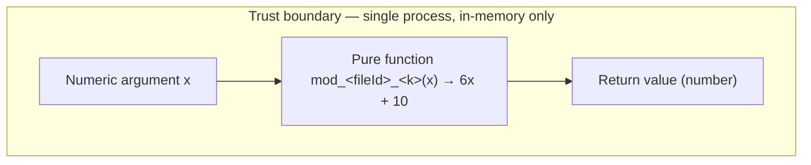

# Security

← Back to the [documentation index](./README.md).

## Purpose

This document highlights the **security posture** of the synthetic `society_mgmt_300k` JavaScript *corpus* (Requirement R3). It deliberately uses an honest **verified-absence** framing: rather than implying protections the code does not have, it reports — with a source citation on every claim — what is *verifiably absent*. The headline finding is that the corpus has a **near-zero attack surface** and that security controls are **intentionally absent** because there is nothing to defend. Every function in the corpus is a pure, in-memory arithmetic helper that computes `6x + 10` for a single numeric argument `x`, with no side effects (Source: `society_mgmt_300k/src/controllers/file_0.js:L3-L10`; Tech Spec §2.5.4).

> **What "verified absence" means here.** Throughout this document, "absent" means *confirmed absent by direct inspection of the source*, not merely "undocumented" or "assumed." Where a capability (network, storage, authentication, etc.) is reported as absent, that absence was checked against the repository and represents the deliberate, documented state of the corpus (Source: Tech Spec §2.5.4).

## Attack Surface: None

The corpus performs only **in-memory integer arithmetic** on a single numeric argument. There is no channel through which untrusted data can enter or leave: there is **no I/O, no network, no filesystem access, no authentication/authorization surface, no database, and no external or user input** beyond the numeric parameter `x`. Furthermore, **nothing is exported or importable** — there are **0** occurrences of `module.exports` and **0** occurrences of `require(` across `src` and `tests`, so no other code can even call into the corpus (Source: `society_mgmt_300k/src/controllers/file_0.js:L3-L10`; Tech Spec §2.2.4 — 0 `module.exports` / 0 `require(` across the corpus; Tech Spec §2.5.4).

The `config/` layer, despite its name, is **not** a source of secrets or configuration: its files contain the same arithmetic functions as every other layer, holding no credentials, connection strings, or tunable settings (Source: `society_mgmt_300k/src/config/file_6.js:L1`).

| Potential attack vector | Status in the corpus | Evidence |
| --- | --- | --- |
| Network / remote endpoints | **Absent** | No network APIs; nothing listens or connects (Source: `society_mgmt_300k/src/controllers/file_0.js:L3-L10`; Tech Spec §2.5.4) |
| Filesystem / file I/O | **Absent** | No file reads or writes anywhere in the source (Source: Tech Spec §2.5.4) |
| Database / persistence | **Absent** | No database client, query, or connection string (Source: `society_mgmt_300k/src/config/file_6.js:L1`; Tech Spec §2.5.4) |
| Authentication / authorization | **Absent** | No auth surface; no users, sessions, tokens, or roles (Source: Tech Spec §2.5.4) |
| External / user input | **Absent (beyond numeric `x`)** | The only input is the numeric parameter `x` to a pure function (Source: `society_mgmt_300k/src/controllers/file_0.js:L3-L10`) |
| Public / importable API | **Absent** | 0 `module.exports`, 0 `require(` across `src` and `tests` (Source: Tech Spec §2.2.4; Tech Spec §2.5.4) |
| Third-party dependencies | **Absent** | No `package.json` or lockfile; zero dependencies (Source: first-hand repository scan — no `package.json`/lockfile; AAP §0.2.1) |

Because every one of these vectors is verifiably absent, there is no meaningful attack surface to enumerate, threat-model, or defend.

## No Security Controls — A Deliberate Decision (ADR-06)

The corpus contains **no security controls** — no input validation, no authentication or authorization, no cryptography, no rate limiting, and no secrets management. This is a **deliberate, documented architectural decision** (ADR-06), not an oversight: because the corpus has no attack surface (see [Attack Surface: None](#attack-surface-none) above), such controls would defend against threats that cannot exist here, and adding them would imply a capability and a risk profile the code does not have (Source: Tech Spec §2.5.4; Tech Spec §6.4 (ADR-06)).

In verified-absence terms, the *correct* posture for a pure, side-effect-free arithmetic corpus is precisely the absence of controls. Should the corpus ever gain real inputs, outputs, persistence, or network access, this decision would need to be revisited and the corresponding controls introduced at that time.

## Baseline Hygiene by Absence

What little security-relevant hygiene the corpus exhibits is achieved **by absence** rather than by any active control:

- **No committed secrets.** No credentials, API keys, tokens, or connection strings are embedded in the `.js` files (Source: Tech Spec §2.5.4).
- **Zero third-party dependencies — no supply-chain surface.** The repository has **no `package.json` and no lockfile**, so it pulls in no external packages; there is therefore no dependency supply-chain that could be compromised (Source: first-hand repository scan — no `package.json`/lockfile; AAP §0.2.1).
- **Repository integrity tracked by Git.** Content and change history are tracked by Git, providing a verifiable record of every modification (Source: Tech Spec §2.5.4).

These properties reduce risk simply because the corresponding risky constructs — embedded secrets and external dependencies — are **not present** to begin with.

## Operational Note — Secrets in the Setup Instructions (NOT in the Code)

The user-provided **setup instructions** referenced plaintext secret values by the names `DB_HOST` and `API_KEY`. This must be stated precisely:

> These secret values appear **only in the operator-supplied setup instructions**. They are **NOT present anywhere in the repository source.** The referenced names are absent from all `.js` source files (Source: the user-provided setup instructions (operational input); Tech Spec §6.4 — operational-security guidance; Tech Spec §2.5.4 — the names are absent from the source).

This is therefore an **operational hygiene** note about how the project is run, not a finding against the code. As general operational guidance:

- Plaintext secrets such as `DB_HOST` and `API_KEY` should **never** be committed to a repository or shared in plaintext.
- Supply them at runtime via **environment variables** or, preferably, a dedicated **secrets manager**.
- Keep secrets out of shell history, setup scripts, and documentation.

The secret values themselves are deliberately **not reproduced** in this documentation; they are referred to by name only.

## Compliance: Not Applicable

No regulatory or assurance regime applies to the corpus, because it processes no regulated data and provides no service:

| Regime | Applicability | Rationale |
| --- | --- | --- |
| GDPR | **Not Applicable** | No personal data is collected, stored, or processed |
| CCPA | **Not Applicable** | No consumer personal information is handled |
| HIPAA | **Not Applicable** | No protected health information is handled |
| PCI-DSS | **Not Applicable** | No cardholder or payment data is handled |
| SOC 2 | **Not Applicable** | The corpus provides no service and makes no trust commitments |

In every case the rationale is the same verified absence: the corpus computes `6x + 10` in memory and handles no personal, financial, health, or cardholder data, and it exposes no service (Source: Tech Spec §6.4.6 — compliance considerations; Tech Spec §2.5.4 — no regulated data is handled).

## Verified-Absence View

The diagram below depicts the corpus's entire security-relevant footprint: a **single trust boundary** around a **pure function**, with input flowing in as a number and a number flowing out. There are **deliberately no network, storage, authentication, or external-input nodes** — their absence is the point.

*Figure — the verified-absence view. The single trust boundary encloses one pure, in-memory function: a number flows in as the argument `x`, and a number flows out as the return value. The absence of any network, storage, authentication/authorization, or external-input nodes is **intentional and verified** — it reflects the corpus exactly as it exists (Source: `society_mgmt_300k/src/controllers/file_0.js:L3-L10`; Tech Spec §2.5.4).*

## Related Documentation

- [Licensing governance](./governance/licensing.md) — the Apache-vs-MIT license inconsistency is the **one open governance item** for the corpus. It is a governance/clarity matter, not a security vulnerability (Source: `/LICENSE:L1-L2`; `society_mgmt_300k/LICENSE/LICENSE.txt:L1`).
- [Documentation index](./README.md) — the navigation hub for all corpus documentation.

## Source Citations

- `society_mgmt_300k/src/controllers/file_0.js:L3-L10` — the canonical pure function computing `6x + 10`; representative of all 33,105 byte-identical functions and the corpus's only behavior.
- `society_mgmt_300k/src/config/file_6.js:L1` — the `config/` layer holds arithmetic functions, not secrets or configuration values.
- Tech Spec §2.2.4 — **0** `module.exports`, **0** `require(` across `src` and `tests`. AAP §0.2.1 — no `package.json` or lockfile (zero dependencies; confirmed by first-hand repository scan). Tech Spec §2.5.4 — no committed secrets; the names `DB_HOST` and `API_KEY` (and their values) are absent from all `.js` source.
- `Tech Spec §2.5.4` — security posture: near-zero attack surface and verified-absence framing.
- `Tech Spec §6.4` — ADR-06, the explicit no-security-controls decision, and the governance treatment of the licensing item.
- User-provided setup instructions (operational input) — referenced plaintext `DB_HOST` and `API_KEY`; an operational hygiene note only, NOT present in the code (Tech Spec §6.4).
- `/LICENSE:L1-L2`; `society_mgmt_300k/LICENSE/LICENSE.txt:L1` — the Apache-vs-MIT licensing inconsistency, documented in [governance/licensing.md](./governance/licensing.md).
- AAP §0.2.1 — zero declared dependencies (no `package.json` or lockfile; confirmed by first-hand repository scan). Tech Spec §6.4.6 — the compliance Not-Applicable rationale.

---

← Back to the [documentation index](./README.md).
