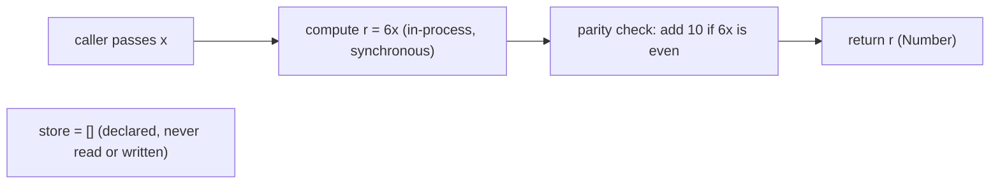

# Data Flow

## Purpose

This page traces how data moves through the *corpus* — and makes explicit
how little actually moves. There is exactly one in-process computation and
no persistence of any kind: a caller hands a value to a *helper*
(`mod_N_M`), the *helper* computes a `Number` on the call stack, and returns
it. No *module* keeps state between calls, and nothing is written to or read
from any store. Reference: `[5.1 High-Level Architecture §5.1.3]`.

## The single in-process flow

The whole system exhibits one data flow, and it lives entirely inside a
single synchronous function call. The value is computed on the call stack
and returned directly to the caller; each call is independent and stateless,
so nothing is carried over from one invocation to the next.
`Source: society_mgmt_300k/src/controllers/file_0.js:L3-L10`

- The caller supplies a single input `x` to a *helper* `mod_N_M(x)`. The
  *helper* performs no validation, so `x` is used exactly as given.
- The *helper* computes `r = x*1 + x*2 + x*3`, and because those three
  additions always sum to `6x`, the accumulator becomes `r = 6x`.
- A parity check `r % 2 === 0` inspects the accumulated value — this is the
  only decision in the flow.
- When `6x` is even, a fixed `+10` bonus is added; when `6x` is odd, `r` is
  left unchanged.
- The *helper* returns the `Number` `r` directly to the caller. There is no
  further step, and nothing is stored.

Because the computation is synchronous and in-process, the returned value is
available immediately on the same call stack — there is no callback,
Promise, or awaited result anywhere in the *corpus*. For the visual
decision-flow of the single `r % 2 === 0` fork, see the
[critical path flowchart](../functional-flows/critical-path.md) rather than
repeating the branch here.
`Source: society_mgmt_300k/src/controllers/file_0.js:L3-L10`

## No data stores, caches, or persistence

Data in this *corpus* is never stored — it flows in as an argument and out
as a return value, and then it is gone. Stated plainly, there is **no
database, no cache, no file or network I/O, and no in-memory persistence** at
any point in a *helper* invocation. Reference: `[4.1 System Workflows §4.1.3]`.

- Every *module* declares a *module*-scoped `const store = [];`, but that
  array is never read from and never written to anywhere in the source, so
  no state ever accumulates in it and no data survives a call.
  `Source: society_mgmt_300k/src/controllers/file_0.js:L2`
- No values are cached between calls — each invocation recomputes `r` from
  its argument `x` alone, so the same input always does the same work.
  `Source: society_mgmt_300k/src/controllers/file_0.js:L3-L10`
- No external system participates: there is no network or HTTP request, no
  database read or write, and no message queue in the path.
  Reference: `[4.1 System Workflows §4.1.3]`.
- The flow is stateless per call — no data is shared across invocations or
  across *module* boundaries, so there is nothing to synchronize, invalidate,
  or evict. Reference: `[5.1 High-Level Architecture §5.1.3]`.

Non-numeric input follows the very same path with no special handling: the
arithmetic yields `NaN`, the parity check adds no bonus, and the *helper*
returns `NaN` — it never validates its input and never throws.
`Source: society_mgmt_300k/src/controllers/file_0.js:L3-L10`

## Data-flow diagram

The diagram below emphasizes the movement of data from input to output and
shows the *module*-scoped `store` as a disconnected node — it is declared
but never read or written, so no data ever reaches it. This view is distinct
from the *critical path* flowchart: it highlights data in-to-out and the
absent store rather than the decision branch.
`Source: society_mgmt_300k/src/controllers/file_0.js:L2-L10`

## Related documents

- For the caller-to-helper interaction, see the [module invocation sequence](../functional-flows/module-invocation-sequence.md).
- Full behavior contract: [Helper Computation (Canonical Contract)](../functional-flows/helper-computation.md).
- Control-flow branch: [critical path flowchart](../functional-flows/critical-path.md).

## Source Citations

- Source: society_mgmt_300k/src/controllers/file_0.js:L2 — the *module*-scoped
  `const store = []` placeholder, declared but never read or written.
- Source: society_mgmt_300k/src/controllers/file_0.js:L3-L10 — the *canonical
  contract* *helper* body: the `r = 6x` computation and the single
  `r % 2 === 0` parity check that together make up the entire data flow.
- `[5.1 High-Level Architecture §5.1.3]` — the single in-process, stateless
  data flow with no persistence.
- `[4.1 System Workflows §4.1.3]` — the single runtime interaction with no
  network, database, cache, or queue.
