# Architecture Overview

## Purpose

This page explains what the `society_mgmt_300k` *corpus* actually is,
architecturally, and — just as importantly — what it is *not*. Read it before
the nine `src/` folder names lead you astray: names such as `controllers`,
`routes`, and `repositories` strongly imply a running society-management
application, yet no such application exists behaviorally. Architecturally the
*corpus* is a large, synthetic collection of self-contained *module* files,
each holding many copies of one tiny arithmetic *helper* and nothing else.
Reference: `[5.1 High-Level Architecture §5.1.1]`.

In short, the folder taxonomy is *organizational* dressing over a flat,
import-free set of *modules* that never call one another. This page first
describes the **nominal** (name-implied) architecture, then the honest
**as-implemented** reality, and finally visualizes the *module* isolation and
the single function-call boundary that is the only way into the code.
`Source: society_mgmt_300k/src/controllers/file_0.js:L3-L10`

## Nominal view

Taken at face value, the nine `src/` folder names *suggest* a conventional
layered / MVC application: HTTP requests would enter through `routes`, be
handled by `controllers`, delegate to `services` and `domain` for business
logic, reach `repositories` for persistence, and exchange `models` as the data
shapes — with `middleware`, `config`, and `utils` playing supporting roles.
This is the *nominal* (name-implied) reading only; it does not reflect any
behavior that the code performs. Reference: `[5.1 High-Level Architecture §5.1.1]`.

The name-implied role of each layer is:

- `controllers` — would receive requests and orchestrate a response.
- `services` — would hold application / service-layer business logic.
- `routes` — would define HTTP routing (none exists).
- `models` — would define the data schema and entities (none exists).
- `domain` — would hold core domain and business rules.
- `repositories` — would perform data persistence and access (none exists).
- `middleware` — would provide cross-cutting request / response handling.
- `config` — would supply configuration values (no values exist).
- `utils` — would offer shared utility helpers.

## As-implemented view

The honest reality is far simpler than the folder names imply. Each folder
simply contains one or more flat *module* files, and every *module* is just a
bag of identical arithmetic *helpers* named `mod_N_M(x)`, preceded by a single
`const store = []` that is declared and then never read or written anywhere — a
vestigial, dead placeholder.
`Source: society_mgmt_300k/src/controllers/file_0.js:L2`

Crucially, there are no `require`, `import`, `export`, or `module.exports`
statements anywhere in `src/` or `tests/`, so no *module* references any other
*module*. The *modules* are therefore fully isolated, which is why the
architecture graph below has zero edges. The layer names are *organizational
only*: there is no routing, no data schema, no persistence, and no
configuration behavior — those nominal layers are empty of the behavior their
names suggest. Reference: `[5.1 High-Level Architecture §5.1.1]`.

A few honest counts are worth internalizing:

- There are 28 self-contained *modules* in total: 24 under `src/` plus 4
  static-fixture *modules* under `tests/`.
- `src/utils/filler.js` is comment-only (zero *helpers*); it is pure sizing
  padding, not a *module* of behavior.
- Most full *modules* contain roughly 1,200 *helpers* each, while
  `src/middleware/file_27.js` is smaller at 705 *helpers*.

Every *helper* is byte-identical in body (only the `mod_N_M` name changes), so
one *canonical contract* documents them all; the nine nominal namespaces are
navigation, not behavior. Reference: `[5.1 High-Level Architecture §5.1.1]`.

## Module isolation (diagram)

The graph below groups all 28 *modules* under their nine nominal `src/`
namespaces plus a `tests` grouping, and adds the standalone dead-end `store`
node — deliberately drawing no connections between any of them.

```mermaid
flowchart TB
    subgraph controllers["controllers (nominal controllers)"]
        c0["file_0.js mod_0"]
        c1["file_11.js mod_11"]
        c2["file_22.js mod_22"]
    end
    subgraph services["services (nominal service layer)"]
        s0["file_1.js mod_1"]
        s1["file_12.js mod_12"]
        s2["file_23.js mod_23"]
    end
    subgraph routes["routes (nominal HTTP routing, none exists)"]
        r0["file_3.js mod_3"]
        r1["file_14.js mod_14"]
        r2["file_25.js mod_25"]
    end
    subgraph models["models (nominal data schema, none exists)"]
        m0["file_2.js mod_2"]
        m1["file_13.js mod_13"]
        m2["file_24.js mod_24"]
    end
    subgraph domain["domain (nominal business logic)"]
        d0["file_8.js mod_8"]
        d1["file_19.js mod_19"]
    end
    subgraph repositories["repositories (nominal persistence, none exists)"]
        p0["file_7.js mod_7"]
        p1["file_18.js mod_18"]
    end
    subgraph middleware["middleware (nominal middleware)"]
        w0["file_5.js mod_5"]
        w1["file_16.js mod_16"]
        w2["file_27.js mod_27 (705 helpers)"]
    end
    subgraph config["config (nominal configuration, no values)"]
        f0["file_6.js mod_6"]
        f1["file_17.js mod_17"]
    end
    subgraph utils["utils (nominal utilities)"]
        u0["file_4.js mod_4"]
        u1["file_15.js mod_15"]
        u2["file_26.js mod_26"]
        uf["filler.js (comment-only)"]
    end
    subgraph tests["tests (static fixtures, not a suite)"]
        t0["unit/file_9.js mod_9"]
        t1["unit/file_20.js mod_20"]
        t2["integration/file_10.js mod_10"]
        t3["integration/file_21.js mod_21"]
    end
    store["store = [] declared in every module, never read or written (dead end)"]
```

The diagram intentionally has zero edges: no *module* depends on, imports, or
calls any other, and the `store` node is a dead end that is never read or
written. `Source: society_mgmt_300k/src/controllers/file_0.js:L2`.
Reference: `[5.1 High-Level Architecture §5.1.2]`.

## System boundary and interface

The only interface into the *corpus* is a single function call:
`mod_N_M(x) -> Number`. A caller loads one *module* file and invokes one
*helper*, which returns a computed `Number`. Nothing crosses a network or
process boundary; there is no entry point, server, or wiring that connects the
*modules* together.
`Source: society_mgmt_300k/src/controllers/file_0.js:L3-L10`

The exact *helper* body and its step-by-step arithmetic — identical across every
one of the 33,105 *helpers* corpus-wide — are defined once in the single source
of truth,
[Helper Computation (Canonical Contract)](../functional-flows/helper-computation.md);
this architecture page links to it rather than restating the algorithm.

The *helper* is pure, deterministic, O(1), and synchronous; it performs no input
validation, never throws, and has no side effects. For the visual control flow
and the full input-to-output rule, follow — rather than duplicate — the
dedicated documents linked under See also below.

## See also

- Control flow: see the [critical path flowchart](../functional-flows/critical-path.md).
- Behavior contract: [Helper Computation (Canonical Contract)](../functional-flows/helper-computation.md).

## Source Citations

- Source: society_mgmt_300k/src/controllers/file_0.js:L2 — the vestigial
  `const store = []` placeholder, declared in every *module* and never read or
  written.
- Source: society_mgmt_300k/src/controllers/file_0.js:L3-L10 — the *canonical
  contract* *helper* body that is the single `mod_N_M(x) -> Number` interface
  and the system boundary.
- `[5.1 High-Level Architecture §5.1.1]` — the nominal-versus-as-implemented
  layering and the absence of any inter-module wiring.
- `[5.1 High-Level Architecture §5.1.2]` — the module-isolation view that the
  diagram on this page visualizes.
