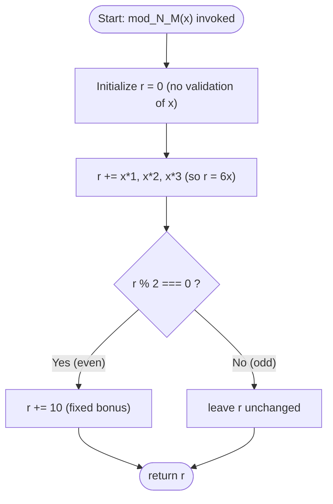

# Critical Path

## Purpose

This page identifies and visualizes THE *critical path* — the single parity
decision `if (r % 2 === 0)` that is the only conditional anywhere in the
*corpus*, so it is the one branch that determines every *helper*'s output.
Every *helper* (`mod_N_M`) runs the same fixed line of arithmetic and then
reaches this single fork, which is why it is the decisive step of the
*canonical contract*. `Source: society_mgmt_300k/src/controllers/file_0.js:L8`.
Reference: `[4.1 System Workflows §4.1.2]`.

## Flowchart

The flowchart below traces one *helper* call from invocation, through the
single `r % 2 === 0` decision, to its returned value.

## Walkthrough

The steps below narrate the same flow the diagram shows, tracking the
accumulator `r` from the initial call to the final return.
`Source: society_mgmt_300k/src/controllers/file_0.js:L4-L9`

- Start — a caller invokes the *helper* `mod_N_M(x)` with a single argument
  `x`.
- Initialize `r = 0` — the accumulator starts at zero; there is no validation
  of `x` before it is used.
- Accumulate `r += x*1`, then `r += x*2`, then `r += x*3` — the three
  additions always sum to `6x`, so after this step `r = 6x`.
- Decision `r % 2 === 0 ?` — the single *critical path* branch, which tests
  whether `6x` is even.
  - Yes (even) — add the fixed bonus, `r += 10`.
  - No (odd) — leave `r` unchanged.
- `return r` — both branches converge here and the *helper* returns the final
  accumulator.

For the full step-by-step arithmetic and the complete input-to-output rule,
follow the *canonical contract* rather than repeating it here:

- Full step-by-step and contract: [Helper Computation (Canonical Contract)](helper-computation.md).
- This flowchart is the shared *critical path* diagram, reused (linked, not
  duplicated) by `helper-computation.md` and `../architecture/overview.md`.

## No error path

The *helper* never throws and has no failure branch. It performs no input
validation, and the single `r % 2 === 0` decision has no error case, so
control always reaches `return r`. Non-numeric input is not rejected — it
flows through the exact same path: the arithmetic yields `NaN`,
`NaN % 2 === 0` evaluates to `false`, so no bonus is added and the *helper*
returns `NaN` instead of raising an exception.
`Source: society_mgmt_300k/src/controllers/file_0.js:L3-L10`

## Source Citations

- `society_mgmt_300k/src/controllers/file_0.js:L3-L10` — the *canonical
  contract* *helper* body whose single `r % 2 === 0` decision is the
  *critical path* documented on this page.
- `[4.1 System Workflows §4.1.2]` — the single-decision runtime flow this
  page visualizes.
