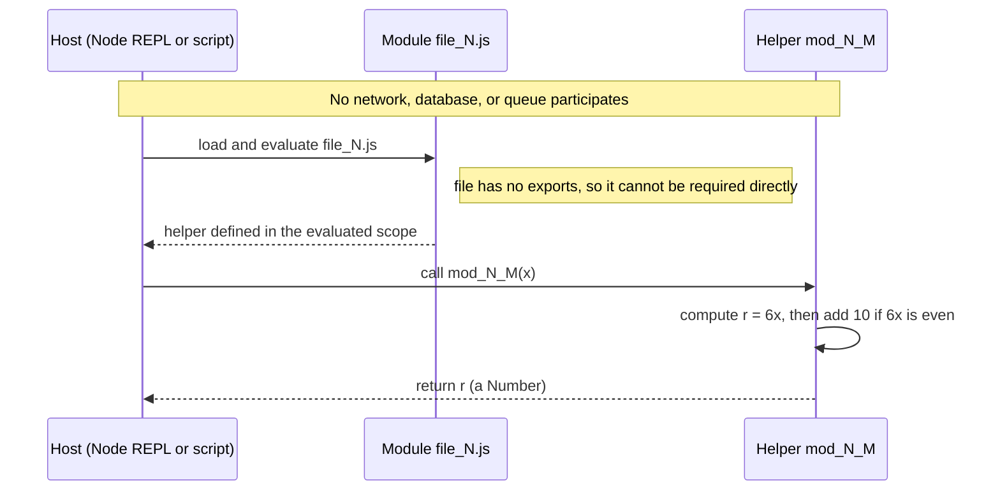

# Module Invocation Sequence

## Purpose

This document traces the end-to-end call sequence for a single *helper*: an
external Host (a Node REPL or script) loads a *module* file such as
`file_N.js`, invokes a *helper* named `mod_N_M(x)`, and receives a `Number`
back. The interaction is entirely in-process, synchronous JavaScript
computation — no network, database, message queue, cache, or file/console
I/O takes part at any step. This is the single runtime interaction the
*corpus* exhibits. Reference: `[4.1 System Workflows §4.1.3]`

## Sequence diagram

The diagram below shows each message exchanged between the Host, the
*module* file, and the *helper*, with explicit notes marking the
infrastructure that is deliberately absent.



## How a Host actually calls a helper (honest note)

A *module* file declares its *helper* functions as plain top-level
declarations and adds no `module.exports` and no `export` statement — in
fact there is not a single `require`, `import`, or `export` anywhere in the
*corpus*. Because nothing is exported, a Host cannot import a *helper*
directly: calling `require('./src/controllers/file_0.js')` returns an empty
object `{}`. To actually run a *helper*, the caller either copies the
identical function body (every *helper* shares the same body, so any copy
behaves the same) or evaluates the file's contents inside a Node REPL or
`vm` context so the declaration enters the current scope.
`Source: society_mgmt_300k/src/controllers/file_0.js:L1-L10`

```javascript
// Modules have no exports, so this yields {} (nothing usable):
// const mod = require('./src/controllers/file_0.js'); // => {}
// Instead, copy the identical canonical helper and call it:
function mod_0_0(x){ let r=0; r+=x*1; r+=x*2; r+=x*3; if(r%2===0){r+=10} return r; }
console.log(mod_0_0(5)); // => 40
```

## What does NOT participate

The sequence above is pure in-process arithmetic; none of the following
infrastructure takes part at any point in a *helper* invocation.
Reference: `[4.1 System Workflows §4.1.3]`

- No network or HTTP — the Host makes a direct in-memory function call, not
  a remote request.
- No database or persistence — nothing is read from or written to any data
  store.
- No message queue — the call is synchronous and returns immediately, with
  no broker in between.
- No cache — every call recomputes the result from `x` alone.
- No file or console I/O inside the *helper* — it neither reads files nor
  prints output; it only returns a `Number`.
- The *module*-level `const store = []` is declared but never read or
  written, so it holds no state and participates in nothing.
  `Source: society_mgmt_300k/src/controllers/file_0.js:L2`

## Related documents

- Behavior details: [Helper Computation (Canonical Contract)](helper-computation.md).
- Critical path: [Critical Path](critical-path.md).

## Source Citations

- `society_mgmt_300k/src/controllers/file_0.js:L1-L10` — the *module*
  banner, the vestigial `store`, and the *canonical contract* *helper* body
  a Host copies or evaluates to invoke.
- `society_mgmt_300k/src/controllers/file_0.js:L2` — the `const store = []`
  placeholder that is never read or written.
- `[4.1 System Workflows §4.1.3]` — the single in-process runtime
  interaction, with no network, database, or queue.
